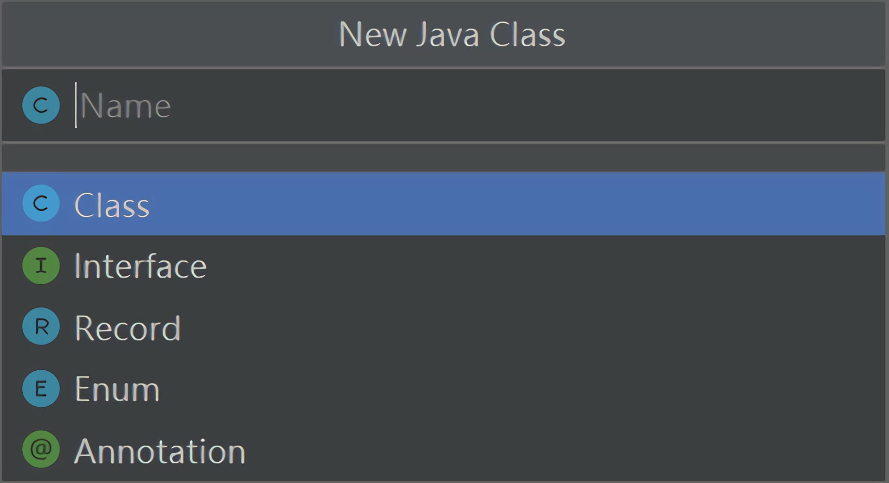

本文就带你快速了解 JAVA 9 - 16 的主要新特性


## JAVA 9（2017年9月）

### 接口里可以添加私有接口

JAVA 8 对接口增加了默认方法的支持，在 JAVA 9 中对该功能又来了一次升级，现在可以在接口里定义私有方法，然后在默认方法里调用接口的私有方法。 

这样一来，既可以重用私有方法里的代码，又可以不公开代码

```java
public interface TestInterface {
    default void wrapMethod(){
        innerMethod();
    }
    private void innerMethod(){
        System.out.println("");
    }
}
```


### 匿名内部类也支持钻石（diamond）运算符

JAVA 5 就引入了泛型（generic），到了 JAVA 7 开始支持钻石（diamond）运算符：`<>`，可以自动推断泛型的类型：

```java
List<Integer> numbers = new ArrayList<>();
```

但是这个自动推断类型的钻石运算符可不支持匿名内部类，在 JAVA 9 中也对匿名内部类做了支持：

```java
List<Integer> numbers = new ArrayList<>() {
    ...
}
```


### 增强的 `try-with-resources`

JAVA 7 中增加了`try-with-resources`的支持，可以自动关闭资源：

```java
try (BufferedReader bufferReader = new BufferedReader(...)) {
    return bufferReader.readLine();
}
```

但需要声明多个资源变量时，代码看着就有点恶心了，需要在 try 中写多个变量的创建过程：

```java
try (BufferedReader bufferReader0 = new BufferedReader(...);
    BufferedReader bufferReader1 = new BufferedReader(...)) {
    return bufferReader0.readLine();
}
```

JAVA 9 中对这个功能进行了增强，可以引用 try 代码块之外的变量来自动关闭：

```java
BufferedReader bufferReader0 = new BufferedReader(...);
BufferedReader bufferReader1 = new BufferedReader(...);
try (bufferReader0; bufferReader1) {
    System.out.println(br1.readLine() + br2.readLine());
}
```


## JAVA 10（2018年3月）

### 局部变量的自动类型推断（var）

JAVA 10 带来了一个很有意思的语法 - `var`，它可以自动推断局部变量的类型，以后再也不用写类型了，也不用靠 lombok 的 `var `注解增强了

```java
var message = "Hello, Java 10";
```

不过这个只是语法糖，编译后变量还是有类型的，使用时还是考虑下可维护性的问题，不然写多了可就成 JavaScript 风格了


## JAVA 11（2018年9月）

### Lambda 中的自动类型推断（var）

JAVA 11 中对 Lambda 语法也支持了 `var` 这个自动类型推断的变量，通过 var 变量还可以增加额外的注解：

```java
List<String> languages = Arrays.asList("Java", "Groovy");
String language = sampleList.stream()
  .map((@Nonnull var x) -> x.toUpperCase())
  .collect(Collectors.joining(", "));

assertThat(language).isEqualTo("Java, Groovy");
```


### javac + java 命令一把梭

以前编译一个 java 文件时，需要先 javac 编译为 class，然后再用 java 执行，现在可以一把梭了：

```bash
$ java HelloWorld.java
Hello Java 11!
```


### Java Flight Recorder 登陆 OpenJDK

**Java Flight Recorder** 是个灰常好用的调试诊断工具，不过之前是在 Oracle JDK 中，也跟着 JDK 11 开源了，OpenJDK 这下也可以用这个功能，真香！


## JAVA 12（2019年3月）

### 更简洁的 switch 语法

在之前的 JAVA 版本中，`switch `语法还是比较啰嗦的，如果多个值走一个逻辑需要写多个 `case`：

```java
DayOfWeek dayOfWeek = LocalDate.now().getDayOfWeek();
String typeOfDay = "";
switch (dayOfWeek) {
    case MONDAY:
    case TUESDAY:
    case WEDNESDAY:
    case THURSDAY:
    case FRIDAY:
        typeOfDay = "Working Day";
        break;
    case SATURDAY:
    case SUNDAY:
        typeOfDay = "Day Off";
}
```

到了 JAVA 12，这个事情就变得很简单了，几行搞定，而且！还支持返回值：

```java
typeOfDay = switch (dayOfWeek) {
    case MONDAY, TUESDAY, WEDNESDAY, THURSDAY, FRIDAY -> "Working Day";
    case SATURDAY, SUNDAY -> "Day Off";
};
```


### instanceof + 类型强转一步到位

之前处理动态类型碰上要强转时，需要先 `instanceof` 判断一下，然后再强转为该类型处理：

```java
Object obj = "Hello Java 12!";
if (obj instanceof String) {
    String s = (String) obj;
    int length = s.length();
}
```

现在 `instanceof` 支持直接类型转换了，不需要再来一次额外的强转：

```java
Object obj = "Hello Java 12!";
if (obj instanceof String str) {
    int length = str.length();
}
```


## JAVA 13（2019年9月）

### switch 语法再增强

JAVA 12 中虽然增强了 `swtich` 语法，但并不能在 `->` 之后写复杂的逻辑，JAVA 12 带来了 `swtich`更完美的体验，就像 `lambda` 一样，可以写逻辑，然后再返回：

```java
typeOfDay = switch (dayOfWeek) {
    case MONDAY, TUESDAY, WEDNESDAY, THURSDAY, FRIDAY -> {
        // do sth...
    	yield "Working Day";
    }
    case SATURDAY, SUNDAY -> "Day Off";
};
```


### 文本块（Text Block）的支持

你是否还在为大段带换行符的字符串报文所困扰，换行吧一堆换行符，不换行吧看着又难受：

```java
String json = "{\"id\":\"1697301681936888\",\"nickname\":\"空无\",\"homepage\":\"https://juejin.cn/user/1697301681936888\"}";
```

JAVA 13 中帮你解决了这个恶心的问题，增加了文本块的支持，现在可以开心的换行拼字符串了，就像用模板一样：

```java
String json = """
				{
				    "id":"1697301681936888",
				    "nickname":"空无",
				    "homepage":"https://juejin.cn/user/1697301681936888"
				}
				""";
```


## JAVA 14（2020年3月）

### 新增的 record 类型，干掉复杂的 POJO 类

一般我们创建一个 POJO 类，需要定义属性列表，构造函数，getter/setter，比较麻烦。JAVA 14 为我们带来了一个便捷的创建类的方式 - `record`

```java
public record UserDTO(String id,String nickname,String homepage) { };

public static void main( String[] args ){
	UserDTO user = new UserDTO("1697301681936888","空无","https://juejin.cn/user/1697301681936888");
    System.out.println(user.id);
    System.out.println(user.nickname);
    System.out.println(user.id);
}
```

IDEA 也早已支持了这个功能，创建类的时候直接就可以选：  **不过这个只是一个语法糖，编译后还是一个 Class，和普通的 Class 区别不大**


### 更直观的 NullPointerException 提示

**NullPointerException** 算是 JAVA 里最常见的一个异常了，但这玩意提示实在不友好，遇到一些长一点的链式表达式时，没办法分辨到底是哪个对象为空。 

比如下面这个例子中，到底是 `innerMap` 为空呢，还是 `effected` 为空呢？

```java
Map<String,Map<String,Boolean>> wrapMap = new HashMap<>();
wrapMap.put("innerMap",new HashMap<>());

boolean effected = wrapMap.get("innerMap").get("effected");

// StackTrace:
Exception in thread "main" java.lang.NullPointerException
	at org.example.App.main(App.java:50)
```

JAVA 14 也 get 到了 JAVAER 们的痛点，优化了 NullPointerException 的提示，让你不在困惑，一眼就能定位到底“空”在哪！

```java
Exception in thread "main" java.lang.NullPointerException: Cannot invoke "java.lang.Boolean.booleanValue()" because the return value of "java.util.Map.get(Object)" is null
	at org.example.App.main(App.java:50)
```

现在的 StackTrace 就很直观了，直接告诉你 `effected` 变量为空，再也不用困惑！


### 安全的堆外内存读写接口，别再玩 Unsafe 的骚操作了

在之前的版本中，JAVA 如果想操作堆外内存（DirectBuffer），还得 Unsafe 各种 copy/get/offset。现在直接增加了一套安全的堆外内存访问接口，可以轻松的访问堆外内存，再也不用搞 Unsafe 的骚操作了。

```java
// 分配 200B 堆外内存
MemorySegment memorySegment = MemorySegment.allocateNative(200);

// 用 ByteBuffer 分配，然后包装为 MemorySegment
MemorySegment memorySegment = MemorySegment.ofByteBuffer(ByteBuffer.allocateDirect(200));

// MMAP 当然也可以
MemorySegment memorySegment = MemorySegment.mapFromPath(
  Path.of("/tmp/memory.txt"), 200, FileChannel.MapMode.READ_WRITE);

// 获取堆外内存地址
MemoryAddress address = MemorySegment.allocateNative(100).baseAddress();

// 组合拳，堆外分配，堆外赋值
long value = 10;
MemoryAddress memoryAddress = MemorySegment.allocateNative(8).baseAddress();
// 获取句柄
VarHandle varHandle = MemoryHandles.varHandle(long.class, ByteOrder.nativeOrder());
varHandle.set(memoryAddress, value);

// 释放就这么简单，想想 DirectByteBuffer 的释放……多奇怪
memorySegment.close();
```

不了解 Unsafe 操作堆外内存方式的同学，可以参考我的另一篇文章《[JDK中为了性能大量使用的Unsafe类，你会用吗？](https://juejin.cn/post/6943391357935288351)》


### 新增的 jpackage 打包工具，直接打包二进制程序，再也不用装 JRE 了

之前如果想构建一个可执行的程序，还需要借助三方工具，将 JRE 一起打包，或者让客户电脑也装一个 JRE 才可以运行我们的 JAVA 程序。 

现在 JAVA 直接内置了 `jpackage` 打包工具，帮助你一键打包二进制程序包，终于不用乱折腾了


## JAVA 15（2020年9月）

### ZGC 和 Shenandoah 两款垃圾回收器正式登陆

在 JAVA 15中，ZGC 和 Shenandoah 再也不是实验功能，正式登陆了（不过 G1 仍然是默认的）。如果你升级到 JAVA 15 以后的版本，就赶快试试吧，性能更强，延迟更低


### 封闭（Sealed ）类

JAVA 的继承目前只能选择允许继承和不允许继承（final 修饰），现在新增了一个封闭（Sealed ）类的特性，可以指定某些类才可以继承：

```java
public sealed interface Service permits Car, Truck {

    int getMaxServiceIntervalInMonths();

    default int getMaxDistanceBetweenServicesInKilometers() {
        return 100000;
    }

}
```


## JAVA 16（2021年3月）

JAVA 16 在**用户可见的地方**变化并不多，基本都是 14/15 的实验性内容，到了 16 正式发布，这里就不重复介绍了。 


> 作者：空无  
> 链接：https://juejin.cn/post/6964543834747322405  
> 来源：掘金  
> 著作权归作者所有。商业转载请联系作者获得授权，非商业转载请注明出处。  
