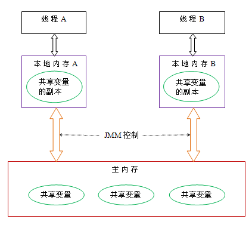

## [简介](https://zhuanlan.zhihu.com/p/29881777)

JMM即为JAVA 内存模型（java memory model）。因为在不同的硬件生产商和不同的操作系统下，内存的访问逻辑有一定的差异，结果就是当你的代码在某个系统环境下运行良好，并且线程安全，但是换了个系统就出现各种问题。Java内存模型，就是为了屏蔽系统和硬件的差异，让一套代码在不同平台下能到达相同的访问结果。JMM从java 5开始的JSR-133发布后，已经成熟和完善起来。

JAVA 内存模型是基于CPU缓存模型进行建立的。线程-》工作内存-》主内存

总体来说，解决数据（变量）可见性的问题。


JMM本质上可以理解为，Java 内存模型规范了 JVM 如何提供按需禁用缓存和编译优化的方法。具体来说，这些方法包括：

- volatile、synchronized 和 final 三个关键字
- Happens-Before 规则


## 并发编程模型

> 著作权归https://pdai.tech所有。 链接：https://www.pdai.tech/md/java/jvm/java-jvm-jmm.html

在并发编程中，我们需要处理两个关键问题：**线程之间如何通信及线程之间如何同步**（这里的线程是指并发执行的活动实体）。通信是指线程之间以何种机制来交换信息。在命令式编程中，线程之间的通信机制有两种：

- 共享内存
- 消息传递

**通信**：在共享内存的并发模型里，线程之间共享程序的公共状态，线程之间通过写 - 读内存中的公共状态来隐式进行通信。在消息传递的并发模型里，线程之间没有公共状态，线程之间必须通过明确的发送消息来显式进行通信。

**同步**：是指程序用于控制不同线程之间操作发生相对顺序的机制。在共享内存并发模型里，同步是显式进行的。程序员必须显式指定某个方法或某段代码需要在线程之间互斥执行。在消息传递的并发模型里，由于消息的发送必须在消息的接收之前，因此同步是隐式进行的。

Java 的并发采用的是共享内存模型，Java 线程之间的通信总是隐式进行，整个通信过程对程序员完全透明。


### Java 内存模型

在 java 中：

- 所有实例域、静态域和数组元素存储在堆内存中，堆内存在线程之间共享（本文使用“共享变量”这个术语代指实例域，静态域和数组元素）。
- 局部变量，方法定义参数和异常处理器参数不会在线程之间共享，它们不会有内存可见性问题，也不受内存模型的影响。

Java 线程之间的通信由 Java 内存模型（本文简称为 JMM）控制，JMM 决定一个线程对共享变量的写入何时对另一个线程可见。从抽象的角度来看，JMM 定义了线程和主内存之间的抽象关系：线程之间的共享变量存储在主内存（main memory）中，每个线程都有一个私有的本地内存（local memory），本地内存中存储了该线程以读 / 写共享变量的副本。本地内存是 JMM 的一个抽象概念，并不真实存在。它涵盖了缓存，写缓冲区，寄存器以及其他的硬件和编译器优化。Java 内存模型的抽象示意图如下：



从上图来看，线程 A 与线程 B 之间如要通信的话，必须要经历下面 2 个步骤：

- 首先，线程 A 把本地内存 A 中更新过的共享变量刷新到主内存中去。
- 然后，线程 B 到主内存中去读取线程 A 之前已更新过的共享变量


### 重排序

在执行程序时为了提高性能，编译器和处理器常常会对指令做重排序。重排序分三种类型：

- 编译器优化的重排序。编译器在不改变单线程程序语义的前提下，可以重新安排语句的执行顺序。
- 指令级并行的重排序。现代处理器采用了指令级并行技术（Instruction-Level Parallelism， ILP）来将多条指令重叠执行。如果不存在数据依赖性，处理器可以改变语句对应机器指令的执行顺序。
- 内存系统的重排序。由于处理器使用缓存和读 / 写缓冲区，这使得加载和存储操作看上去可能是在乱序执行。

从 java 源代码到最终实际执行的指令序列，会分别经历下面三种重排序：


上述的 1 属于编译器重排序，2 和 3 属于处理器重排序。这些重排序都可能会导致多线程程序出现内存可见性问题。对于编译器，JMM 的编译器重排序规则会禁止特定类型的编译器重排序（不是所有的编译器重排序都要禁止）。对于处理器重排序，JMM 的处理器重排序规则会要求 java 编译器在生成指令序列时，插入特定类型的**内存屏障**（memory barriers，intel 称之为 memory fence）指令，通过内存屏障指令来禁止特定类型的处理器重排序（不是所有的处理器重排序都要禁止）。

JMM 属于语言级的内存模型，它确保在不同的编译器和不同的处理器平台之上，通过禁止特定类型的编译器重排序和处理器重排序，为程序员提供一致的内存可见性保证。


## 可见性，有序性，原子性

- **原子性**

在Java中，对基本数据类型的变量的读取和赋值操作是原子性操作，即这些操作是不可被中断的，要么执行，要么不执行。

```
x = 10;        //语句1: 直接将数值10赋值给x，也就是说线程执行这个语句的会直接将数值10写入到工作内存中
y = x;         //语句2: 包含2个操作，它先要去读取x的值，再将x的值写入工作内存，虽然读取x的值以及 将x的值写入工作内存 这2个操作都是原子性操作，但是合起来就不是原子性操作了。
x++;           //语句3： x++包括3个操作：读取x的值，进行加1操作，写入新的值。
x = x + 1;     //语句4： 同语句3
```

上面4个语句只有语句1的操作具备原子性。


- **可见性**

Java提供了volatile关键字来保证可见性。

当一个共享变量被volatile修饰时，它会保证修改的值会立即被更新到主存，当有其他线程需要读取时，它会去内存中读取新值。

而普通的共享变量不能保证可见性，因为普通共享变量被修改之后，什么时候被写入主存是不确定的，当其他线程去读取时，此时内存中可能还是原来的旧值，因此无法保证可见性。

> 另外，通过synchronized和Lock也能够保证可见性，synchronized和Lock能保证同一时刻只有一个线程获取锁然后执行同步代码，并且在释放锁之前会将对变量的修改刷新到主存当中。因此可以保证可见性。


- **有序性**

在Java里面，可以通过volatile关键字来保证一定的“有序性”（具体原理在下一节讲述）。另外可以通过synchronized和Lock来保证有序性，很显然，synchronized和Lock保证每个时刻是有一个线程执行同步代码，相当于是让线程顺序执行同步代码，自然就保证了有序性。当然JMM是通过Happens-Before 规则来保证有序性的。


## 线程安全的实现方法

### 互斥同步

- synchronized
- ReentrantLock

互斥同步最主要的问题就是线程阻塞和唤醒所带来的性能问题，因此这种同步也称为阻塞同步。

互斥同步属于一种悲观的并发策略，总是认为只要不去做正确的同步措施，那就肯定会出现问题。无论共享数据是否真的会出现竞争，它都要进行加锁(这里讨论的是概念模型，实际上虚拟机会优化掉很大一部分不必要的加锁)、用户态核心态转换、维护锁计数器和检查是否有被阻塞的线程需要唤醒等操作。

### 非阻塞同步

- CAS
- AtomicInteger

随着硬件指令集的发展，我们可以使用基于冲突检测的乐观并发策略: 先进行操作，如果没有其它线程争用共享数据，那操作就成功了，否则采取补偿措施(不断地重试，直到成功为止)。这种乐观的并发策略的许多实现都不需要将线程阻塞，因此这种同步操作称为非阻塞同步。

乐观锁需要操作和冲突检测这两个步骤具备原子性，这里就不能再使用互斥同步来保证了，只能靠硬件来完成。硬件支持的原子性操作最典型的是: **比较并交换**(Compare-and-Swap，CAS)。CAS 指令需要有 3 个操作数，分别是内存地址 V、旧的预期值 A 和新值 B。当执行操作时，只有当 V 的值等于 A，才将 V 的值更新为 B。


### synchronized与ReentrantLock比较

**1. 锁的实现**

synchronized 是 JVM 实现的，而 ReentrantLock 是 JDK 实现的。

**2. 性能**

新版本 Java 对 synchronized 进行了很多优化，例如自旋锁等，synchronized 与 ReentrantLock 大致相同。

**3. 等待可中断**

当持有锁的线程长期不释放锁的时候，正在等待的线程可以选择放弃等待，改为处理其他事情。

ReentrantLock 可中断，而 synchronized 不行。

**4. 公平锁**

公平锁是指多个线程在等待同一个锁时，必须按照申请锁的时间顺序来依次获得锁。

synchronized 中的锁是非公平的，ReentrantLock 默认情况下也是非公平的，但是也可以是公平的。

**5. 锁绑定多个条件**

一个 ReentrantLock 可以同时绑定多个 Condition 对象。

#### 使用选择

除非需要使用 ReentrantLock 的高级功能，否则优先使用 synchronized。这是因为 synchronized 是 JVM 实现的一种锁机制，JVM 原生地支持它，而 ReentrantLock 不是所有的 JDK 版本都支持。并且使用 synchronized 不用担心没有释放锁而导致死锁问题，因为 JVM 会确保锁的释放。


## Sychronized

在应用Sychronized关键字时需要把握如下注意点：

- 一把锁只能同时被一个线程获取，没有获得锁的线程只能等待；
- 每个实例都对应有自己的一把锁(this),不同实例之间互不影响；例外：锁对象是*.class以及synchronized修饰的是static方法的时候，所有对象公用同一把锁
- synchronized修饰的方法，无论方法正常执行完毕还是抛出异常，都会释放锁

### 代码同步

**Monitorenter**和**Monitorexit**指令，会让对象在执行，使其锁计数器加1或者减1。每一个对象在同一时间只与一个monitor(锁)相关联，而一个monitor在同一时间只能被一个线程获得，一个对象在尝试获得与这个对象相关联的Monitor锁的所有权的时候，monitorenter指令会发生如下3中情况之一：

- monitor计数器为0，意味着目前还没有被获得，那这个线程就会立刻获得然后把锁计数器+1，一旦+1，别的线程再想获取，就需要等待
- 如果这个monitor已经拿到了这个锁的所有权，又重入了这把锁，那锁计数器就会累加，变成2，并且随着重入的次数，会一直累加
- 这把锁已经被别的线程获取了，等待锁释放

`monitorexit指令`：释放对于monitor的所有权，释放过程很简单，就是讲monitor的计数器减1，如果减完以后，计数器不是0，则代表刚才是重入进来的，当前线程还继续持有这把锁的所有权，如果计数器变成0，则代表当前线程不再拥有该monitor的所有权，即释放锁。

### 方法同步

方法级的同步是隐式，即无需通过字节码指令来控制的，它实现在方法调用和返回操作之中。JVM可以从方法常量池中的方法表结构(method_info Structure) 中的 **ACC_SYNCHRONIZED** 访问标志区分一个方法是否同步方法。当方法调用时，调用指令将会 检查方法的 ACC_SYNCHRONIZED 访问标志是否被设置，如果设置了，执行线程将先持有monitor（虚拟机规范中用的是管程一词）， 然后再执行方法，最后再方法完成(无论是正常完成还是非正常完成)时释放monitor。在方法执行期间，执行线程持有了monitor，其他任何线程都无法再获得同一个monitor。如果一个同步方法执行期间抛 出了异常，并且在方法内部无法处理此异常，那这个同步方法所持有的monitor将在异常抛到同步方法之外时自动释放。


synchronized修饰的方法并没有monitorenter指令和monitorexit指令，取得代之的确实是ACC_SYNCHRONIZED标识，该标识指明了该方法是一个同步方法，JVM通过该ACC_SYNCHRONIZED访问标志来辨别一个方法是否声明为同步方法，从而执行相应的同步调用。这便是synchronized锁在同步代码块和同步方法上实现的[基本原理](https://blog.csdn.net/u012998254/article/details/82558178)。


### JVM中锁的优化

简单来说在JVM中monitorenter和monitorexit字节码依赖于底层的操作系统的Mutex Lock来实现的，但是由于使用Mutex Lock需要将当前线程挂起并从用户态切换到内核态来执行，这种切换的代价是非常昂贵的；然而在现实中的大部分情况下，同步方法是运行在单线程环境(无锁竞争环境)如果每次都调用Mutex Lock那么将严重的影响程序的性能。**不过在jdk1.6中对锁的实现引入了大量的优化，如锁粗化(Lock Coarsening)、锁消除(Lock Elimination)、轻量级锁(Lightweight Locking)、偏向锁(Biased Locking)、适应性自旋(Adaptive Spinning)等技术来减少锁操作的开销**。


### 锁的类型

在Java SE 1.6里Synchronied同步锁，一共有四种状态：`无锁`、`偏向锁`、`轻量级锁`、`重量级锁`，它会随着竞争情况逐渐升级。锁可以升级但是不可以降级，目的是为了提供获取锁和释放锁的效率。

> 锁膨胀方向： 无锁 → 偏向锁 → 轻量级锁 → 重量级锁 (此过程是不可逆的)


### 自旋锁与自适应自旋锁

#### 自旋锁

> 引入背景：大家都知道，在没有加入锁优化时，Synchronized是一个非常“胖大”的家伙。在多线程竞争锁时，当一个线程获取锁时，它会阻塞所有正在竞争的线程，这样对性能带来了极大的影响。在挂起线程和恢复线程的操作都需要转入内核态中完成，这些操作对系统的并发性能带来了很大的压力。同时HotSpot团队注意到在很多情况下，共享数据的锁定状态只会持续很短的一段时间，为了这段时间去挂起和回复阻塞线程并不值得。在如今多处理器环境下，完全可以让另一个没有获取到锁的线程在门外等待一会(自旋)，但不放弃CPU的执行时间。等待持有锁的线程是否很快就会释放锁。为了让线程等待，我们只需要让线程执行一个忙循环(自旋)，这便是自旋锁由来的原因。

自旋锁早在JDK1.4 中就引入了，只是当时默认时关闭的。在JDK 1.6后默认为开启状态。自旋锁本质上与阻塞并不相同，先不考虑其对多处理器的要求，如果锁占用的时间非常的短，那么自旋锁的新能会非常的好，相反，其会带来更多的性能开销(因为在线程自旋时，始终会占用CPU的时间片，如果锁占用的时间太长，那么自旋的线程会白白消耗掉CPU资源)。因此自旋等待的时间必须要有一定的限度，如果自选超过了限定的次数仍然没有成功获取到锁，就应该使用传统的方式去挂起线程了，在JDK定义中，自旋锁默认的自旋次数为10次，用户可以使用参数`-XX:PreBlockSpin`来更改。

可是现在又出现了一个问题：如果线程锁在线程自旋刚结束就释放掉了锁，那么是不是有点得不偿失。所以这时候我们需要更加聪明的锁来实现更加灵活的自旋。来提高并发的性能。(这里则需要自适应自旋锁！)

#### 自适应自旋锁

 在JDK 1.6中引入了自适应自旋锁。这就意味着自旋的时间不再固定了，而是由前一次在同一个锁上的自旋 时间及锁的拥有者的状态来决定的。如果在同一个锁对象上，自旋等待刚刚成功获取过锁，并且持有锁的线程正在运行中，那么JVM会认为该锁自旋获取到锁的可能性很大，会自动增加等待时间。比如增加到100此循环。相反，如果对于某个锁，自旋很少成功获取锁。那再以后要获取这个锁时将可能省略掉自旋过程，以避免浪费处理器资源。有了自适应自旋，JVM对程序的锁的状态预测会越来越准备，JVM也会越来越聪明。


### 偏向锁

> 引入背景：在大多实际环境下，锁不仅不存在多线程竞争，而且总是由同一个线程多次获取，那么在同一个线程反复获取所释放锁中，其中并还没有锁的竞争，那么这样看上去，多次的获取锁和释放锁带来了很多不必要的性能开销和上下文切换。

 为了解决这一问题，HotSpot的作者在Java SE 1.6 中对Synchronized进行了优化，引入了偏向锁。当一个线程访问同步快并获取锁时，会在对象头和栈帧中的锁记录里存储锁偏向的线程ID，以后该线程在进入和推出同步块时不需要进行CAS操作来加锁和解锁。只需要简单地测试一下对象头的`Mark Word`里是否存储着指向当前线程的偏向锁。如果成功，表示线程已经获取到了锁。

#### 偏向锁的撤销

 偏向锁使用了一种等待竞争出现才会释放锁的机制。所以当其他线程尝试获取偏向锁时，持有偏向锁的线程才会释放锁。但是偏向锁的撤销需要等到全局安全点(就是当前线程没有正在执行的字节码)。它会首先暂停拥有偏向锁的线程，让你后检查持有偏向锁的线程是否活着。如果线程不处于活动状态，直接将对象头设置为无锁状态。如果线程活着，JVM会遍历栈帧中的锁记录，栈帧中的锁记录和对象头要么偏向于其他线程，要么恢复到无锁状态或者标记对象不适合作为偏向锁。


### 锁的优缺点对比

| 锁       | 优点                                                         | 缺点                                                         | 使用场景                           |
| -------- | ------------------------------------------------------------ | ------------------------------------------------------------ | ---------------------------------- |
| 偏向锁   | 加锁和解锁不需要CAS操作，没有额外的性能消耗，和执行非同步方法相比仅存在纳秒级的差距 | 如果线程间存在锁竞争，会带来额外的锁撤销的消耗               | 适用于只有一个线程访问同步快的场景 |
| 轻量级锁 | 竞争的线程不会阻塞，提高了响应速度                           | 如线程成始终得不到锁竞争的线程，使用自旋会消耗CPU性能        | 追求响应时间，同步快执行速度非常快 |
| 重量级锁 | 线程竞争不适用自旋，不会消耗CPU                              | 线程阻塞，响应时间缓慢，在多线程下，频繁的获取释放锁，会带来巨大的性能消耗 | 追求吞吐量，同步快执行速度较长     |


### synchronized的缺陷

- `效率低`：锁的释放情况少，只有代码执行完毕或者异常结束才会释放锁；试图获取锁的时候不能设定超时，不能中断一个正在使用锁的线程，相对而言，Lock可以中断和设置超时
- `不够灵活`：加锁和释放的时机单一，每个锁仅有一个单一的条件(某个对象)，相对而言，读写锁更加灵活
- `无法知道是否成功获得锁`，相对而言，Lock可以拿到状态，如果成功获取锁，....，如果获取失败，.....


### 总结

- **使用Synchronized有哪些要注意的？**
  - 锁对象不能为空，因为锁的信息都保存在对象头里
  - 作用域不宜过大，影响程序执行的速度，控制范围过大，编写代码也容易出错
  - 避免死锁
  - 在能选择的情况下，既不要用Lock也不要用synchronized关键字，用java.util.concurrent包中的各种各样的类，如果不用该包下的类，在满足业务的情况下，可以使用synchronized关键，因为代码量少，避免出错
- **synchronized是公平锁吗？**

synchronized实际上是非公平的，新来的线程有可能立即获得监视器，而在等待区中等候已久的线程可能再次等待，不过这种抢占的方式可以预防饥饿。


## volatile

> 相比Sychronized(重量级锁，对系统性能影响较大)，volatile提供了另一种解决可见性和有序性问题的方案。@pdai

### 实现可见性

可见性问题主要指一个线程修改了共享变量值，而另一个线程却看不到。引起可见性问题的主要原因是每个线程拥有自己的一个高速缓存区——线程工作内存。

volatile 变量的内存可见性是基于内存屏障(Memory Barrier)实现。在 volatile 修饰的共享变量进行写操作的时候会多出 **lock** 前缀的指令。

lock 前缀的指令在多核处理器下会引发两件事情:

- 将当前处理器缓存行的数据写回到系统内存。
- 写回内存的操作会使在其他 CPU 里缓存了该内存地址的额数据无效。

为了提高处理速度，处理器不直接和内存进行通信，而是先将系统内存的数据读到内部缓存(L1，L2 或其他)后再进行操作，但操作完不知道何时会写到内存。

如果对声明了 volatile 的变量进行写操作，JVM 就会向处理器发送一条 lock 前缀的指令，将这个变量所在缓存行的数据写回到系统内存。

为了保证各个处理器的缓存是一致的，实现了缓存一致性协议(MESI)，每个处理器通过嗅探在总线上传播的数据来检查自己缓存的值是不是过期了，当处理器发现自己缓存行对应的内存地址被修改，就会将当前处理器的缓存行设置成无效状态，当处理器对这个数据进行修改操作的时候，会重新从系统内存中把数据读到处理器缓存里。

所有多核处理器下还会完成：当处理器发现本地缓存失效后，就会从内存中重读该变量数据，即可以获取当前最新值。

volatile 变量通过这样的机制就使得每个线程都能获得该变量的最新值。


### volatile 的应用场景

使用 volatile 必须具备的条件

- 对变量的写操作不依赖于当前值。
- 该变量没有包含在具有其他变量的不变式中。
- 只有在状态真正独立于程序内其他内容时才能使用 volatile。


## final

> 著作权归https://pdai.tech所有。 链接：https://www.pdai.tech/md/java/thread/java-thread-x-key-final.html

### 修饰类

当某个类的整体定义为final时，就表明了你不能打算继承该类，而且也不允许别人这么做。即这个类是不能有子类的。

注意：final类中的所有方法都隐式为final，因为无法覆盖他们，所以在final类中给任何方法添加final关键字是没有任何意义的。

### 修饰方法

> 常规的使用就不说了，这里说下:

- private 方法是隐式的final
- final方法是可以被重载的

### 修饰参数

Java允许在参数列表中以声明的方式将参数指明为final，这意味这你无法在方法中更改参数引用所指向的对象。这个特性主要用来向匿名内部类传递数据。

### 修饰变量

- 变量值在被初始化后无法被更改。
- static final：一个既是static又是final 的字段只占据一段不能改变的存储空间，它必须在定义的时候进行赋值，否则编译器将不予通过。
- blank final：Java允许生成空白final，也就是说被声明为final但又没有给出定值的字段,但是必须在该字段被使用之前被赋值，这给予我们两种选择
  - 在定义处进行赋值(这不叫空白final)
  - 在构造器中进行赋值，保证了该值在被使用前赋值。


## synchronized与volatile

volatile解决读-写问题，synchronized解决写-写问题


## Java多线程和操作系统多线程关系

线程状态。首先两者的线程状态是一样的。（创建、就绪、执行、阻塞、终止），其实这五个状态也是进程的状态。

OS实现线程的方式分为两类，一类是用户级，一类是内核级。这两类的不同在于用户级线程是在用户空间实现的，而内核级线程是在OS内核空间实现的。设置用户级线程的系统，调度是以进程为单位的。而设置了内核级进程的而是以线程为单位进行调度的。

**线程在用户空间实现的主要优点:**

首先线程的切换不需要转换到内核空间，所以节省了模式切换的开销

用户级线程的实现和OS平台无关，对于线程管理的代码是属于用户程序的一部分。用户级线程甚至可以在不支持线程机制的OS上实现。