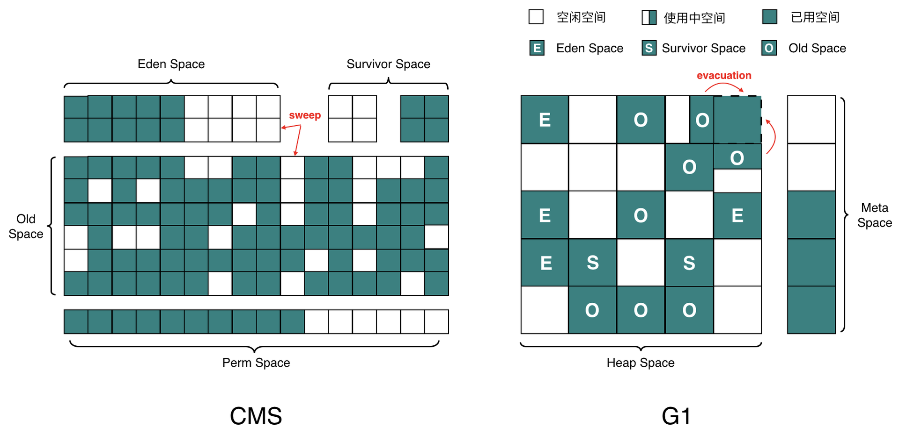

# 体系


# 类加载

## [类加载器--加载类的开放性](https://blog.csdn.net/weixin_38055381/article/details/81382115)

类加载器（ClassLoader）是Java语言的一项创新，也是Java流行的一个重要原因。在类加载的第一阶段“加载”过程中，需要通过一个类的全限定名来获取定义此类的二进制字节流，完成这个动作的代码块就是类加载器。这一动作是放在Java虚拟机外部去实现的，以便让应用程序自己决定如何获取所需的类。

虚拟机规范并没有指明二进制字节流要从一个Class文件获取，或者说根本没有指明从哪里获取、怎样获取。这种开放使得Java在很多领域得到充分运用，例如：

- 从ZIP包中读取，这很常见，成为JAR，EAR，WAR格式的基础
- 从网络中获取，最典型的应用就是Applet
- 运行时计算生成，最典型的是动态代理技术，在java.lang.reflect.Proxy中，就是用了ProxyGenerator.generateProxyClass来为特定接口生成形式为“*$Proxy”的代理类的二进制字节流
- 有其他文件生成，最典型的JSP应用，由JSP文件生成对应的Class类

## [**什么是类的加载**](https://www.cnblogs.com/ityouknow/p/5603287.html)

#### 类的加载

是将类的.class文件中的二进制数据读入到内存中，将其放在运行时数据区的方法区内，然后在堆区创建一个 java.lang.Class对象，用来封装类在方法区内的数据结构。类的加载的最终产品是位于**堆区**中的 Class对象， Class对象封装了类在方法区内的数据结构，并且向Java程序员提供了访问方法区内的数据结构的接口。

类加载器并不需要等到某个类被“首次主动使用”时再加载它，JVM规范允许类加载器在预料某个类将要被使用时就预先加载它，如果在预先加载的过程中遇到了.class文件缺失或存在错误，类加载器必须在程序首次主动使用该类时才报告错误（LinkageError错误）如果这个类一直没有被程序主动使用，那么类加载器就不会报告错误。

#### 双亲委托加载机制

如果一个类加载器收到了类加载的请求，它首先不会自己去尝试加载这个类，而是把请求委托给父加载器去完成，依次向上，因此，所有的类加载请求最终都应该被传递到顶层的启动类加载器中，只有当父加载器在它的搜索范围中没有找到所需的类时，即无法完成该加载，子加载器才会尝试自己去加载该类。


站在Java开发人员的角度来看，类加载器按加载顺序可以划分为以下三类：启动类加载器、扩展类加载器、应用程序类加载器

##### 加载的优先级

- **启动类加载器** 系统加载类       jdk 安装目录下 jre 目录下(lib) rt.jar 
- **扩展类加载器** 拓展加载类       jdk 安装目录下 jre 目录下(lib) ext目录      *.jar 
- **应用程序类加载器**  自定义加载类  自己创造的工作目录下产生的jar 文件 .class 


##### 双亲委托加载机制的优点

- **安全性**
  
  确保了 Java 核心类库的安全性和一致性。例如，防止用户自定义的恶意类替换 Java 核心类库中的类。因为核心类库的类总是由启动类加载器加载，用户类无法干预。
- **避免类的重复加载**
  
  由于类的加载请求会向上委托，如果父类加载器已经加载了某个类，子类加载器就不需要再次加载，提高了类加载的效率并且节省了内存空间。


## **类的生命周期**

 

其中：类加载的过程包括了加载、验证、准备、解析、初始化五个阶段。

**注：**在这五个阶段中，加载、验证、准备和初始化这四个阶段发生的顺序是确定的，而解析阶段则不一定，它在某些情况下可以在初始化阶段之后开始，这是为了支持Java语言的运行时绑定（也成为动态绑定或晚期绑定）。另外注意这里的几个阶段是**按顺序开始**，而**不是按顺序进行或完成**，因为这些阶段通常都是互相交叉地混合进行的，通常在一个阶段执行的过程中调用或激活另一个阶段。

**加载：**查找并加载类的二进制数据

- 通过一个类的全限定名来获取其定义的二进制字节流。
- 将这个字节流所代表的静态存储结构转化为方法区的运行时数据结构。
- 在Java堆中生成一个代表这个类的     java.lang.Class对象，作为对方法区中这些数据的访问入口。

**验证：**是为了确保Class文件的字节流中包含的信息符合当前虚拟机的要求，并且不会危害虚拟机自身的安全。

- **文件格式验证**：验证字节流是否符合Class文件格式的规范；例如：是否以     0xCAFEBABE开头、主次版本号是否在当前虚拟机的处理范围之内、常量池中的常量是否有不被支持的类型。
- **元数据验证**：对字节码描述的信息进行语义分析（注意：对比javac编译阶段的语义分析），以保证其描述的信息符合Java语言规范的要求；例如：这个类是否有父类，除了     java.lang.Object之外。
- **字节码验证**：通过数据流和控制流分析，确定程序语义是合法的、符合逻辑的。
- **符号引用验证**：确保解析动作能正确执行。

**准备：**为类的静态变量分配内存，并将其初始化为默认值，这些内存都将在方法区中分配。

- 这时候进行内存分配的仅包括类变量（static），而不包括实例变量，实例变量会在对象实例化时随着对象一块分配在Java堆中。
- 这里所设置的初始值通常情况下是数据类型默认的零值（如0、0L、null、false等），而不是被在Java代码中被显式地赋予的值。假设一个类变量的定义为：     publicstaticintvalue=3，那么变量value在准备阶段过后的初始值为0，而不是3

**解析：**把类中的符号引用转换为直接引用

- 将常量池内的符号引用替换为直接引用的过程，解析动作主要针对类或接口、字段、类方法、接口方法、方法类型、方法句柄和调用点限定符7类符号引用进行。
- **符号引用**就是一组符号来描述目标，可以是任何字面量。
- **直接引用**就是直接指向目标的指针、相对偏移量或一个间接定位到目标的句柄。

**初始化：**为类的静态变量赋予正确的初始值，JVM负责对类进行初始化，主要对类变量进行初始化。

**JVM初始化步骤：**

1、假如这个类还没有被加载和连接，则程序先加载并连接该类

2、假如该类的直接父类还没有被初始化，则先初始化其直接父类

3、假如类中有初始化语句，则系统依次执行这些初始化语句

**类初始化时机**

- 创建类的实例，也就是new的方式

- 访问某个类或接口的静态变量，或者对该静态变量赋值

- 调用类的静态方法

- 反射（如Class.forName(“com.shengsiyuan.Test”)）

- 初始化某个类的子类，则其父类也会被初始化

- Java虚拟机启动时被标明为启动类的类（JavaTest），直接使用 java.exe命令来运行某个主类

## Class字节码文件

[class](https://www.pdai.tech/md/java/jvm/java-jvm-class.html)文件本质上是一个以8位字节为基础单位的二进制流，各个数据项目严格按照顺序紧凑的排列在class文件中。jvm根据其特定的规则解析该二进制数据，从而得到相关信息。

Class文件采用一种伪结构来存储数据，它有两种类型：无符号数和表。

### 结构

- 魔数
  
  文件开头的4个字节("cafe babe")称之为 `魔数`，唯有以"cafe babe"开头的class文件方可被虚拟机所接受，这4个字节就是字节码文件的身份识别。
  
  0000是编译器jdk版本的次版本号0，0034转化为十进制是52,是主版本号，java的版本号从45开始，除1.0和1.1都是使用45.x外,以后每升一个大版本，版本号加一。也就是说，编译生成该class文件的jdk版本为1.8.0。

- 常量池

- 访问标志

- 索引

- 字段表属性

- 方法表属性

- 属性表属性

### 符号引用

在编译的时候一个每个java类都会被编译成一个class文件，但在编译的时候虚拟机并不知道所引用类的地址，多以用符号引用来代替，而在这个解析阶段就是为了把这个符号引用转化成为真正的地址的[阶段](https://blog.csdn.net/qq_34402394/article/details/72793119)。

```java
// 这个代码中在编译的时候对应的s会被解析成为符号引用
public static void main() {
 String s="adc";
 System.out.println("s="+s);
}

// 这段代码执行的时候会直接解析成直接引用
public static void main() {
 System.out.println("s="+"abc");
}
```

## JVM内存结构

### 内存结构

JVM[内存结构](https://mp.weixin.qq.com/s?__biz=MzI4NDY5Mjc1Mg==&mid=2247483949&idx=1&sn=8b69d833bbc805e63d5b2fa7c73655f5&chksm=ebf6da52dc815344add64af6fb78fee439c8c27b539b3c0e87d8f6861c8422144d516ae0a837&scene=21#wechat_redirect)主要有三大块：**堆内存、方法区**和**栈**。堆内存是JVM中最大的一块由年轻代和老年代组成，而年轻代内存又被分成三部分，Eden空间、From Survivor空间、To Survivor空间,默认情况下年轻代按照8:1:1的比例来分配；

方法区（Java8 称作[**Metaspace**](https://link.jianshu.com/?t=http://www.javacodegeeks.com/2013/02/java-8-from-permgen-to-metaspace.html)）存储类信息、常量、静态变量等数据，是线程共享的区域，为与Java堆区分，方法区还有一个别名Non-Heap(非堆)；栈又分为java虚拟机栈和本地方法栈主要用于方法的执行。

在通过一张图来了解如何通过参数来控制各区域的内存大小：

 

### JVM内存参数

**控制参数**

- -Xms 设置堆的最小空间大小。
- -Xmx 设置堆的最大空间大小。
- -Xmn 新生代大小，这个参数则是对 -XX:newSize、-XX:MaxnewSize两个参数的同时配置，即-XX:newSize = -XX:MaxnewSize = -Xmn
- -XX:NewSize 设置新生代最小空间大小。
- -XX:MaxNewSize 设置新生代最大空间大小。
- -Xss 设置每个线程的堆栈大小。

**JDK1.7**

- -XX:PermSize 设置永久代最小空间大小。
- -XX:MaxPermSize 设置永久代最大空间大小。

**JDK1.8**

- -XX:MetaspaceSize 设置Metaspace最小空间大小。
  
  MetaspaceSize表示metaspace首次使用不够而触发FGC的阈值，只对触发起作用。不设置则默认为20M左右。

- -XX:MaxMetaspaceSize 设置Metaspace最大空间大小。
  
  默认无穷大。

> **注：**没有直接设置老年代的参数，但是可以设置堆空间大小和新生代空间大小两个参数来间接控制。
> 
> 老年代空间大小=堆空间大小-年轻代大空间大小

### 内存参数调优

- Xmn 用于设置新生代的大小。过小会增加Minor GC频率，过大会减小老年代的大小。一般设为整个堆空间的1/4或1/3.
- XX:SurvivorRatio 用于设置新生代中 survivor 空间(from/to)和eden空间的大小比例； XX:TargetSurvivorRatio 表示，当经历Minor GC后，survivor空间占有量(百分比)超过它的时候，就会压缩进入老年代(当然，如果survivor空间不够，则直接进入老年代)。默认值为50%。
- 为了性能考虑，一开始尽量将新生代对象留在新生代，避免新生的大对象直接进入老年代。因为新生对象大部分都是短期的，这就造成了老年代的内存浪费，并且回收代价也高(Full GC发生在老年代和方法区Perm).
- 当 Xms=Xmx ，可以使得堆相对稳定，避免不停震荡
- 一般来说，MaxPermSize 设为64MB可以满足绝大多数的应用了。若依然出现方法区溢出，则可以设为128MB。若128MB还不能满足需求，那么就应该考虑程序优化了，减少**动态类**的产生。

### 调用关系

从更高的一个维度再次来看JVM和系统调用之间的关系  

 

方法区和对是所有线程共享的内存区域；而java栈、本地方法栈和程序员计数器是运行是线程私有的内存区域。

## **Java堆**

对于大多数应用来说，Java堆（Java Heap）是Java虚拟机所管理的内存中**最大**的一块。Java堆是被所有线程共享的一块内存区域，在虚拟机启动时创建。**此内存区域的唯一目的就是存放对象实例**，**几乎所有的对象实例都在这里分配内存**。

Java堆是垃圾收集器管理的主要区域，因此很多时候也被称做“**GC堆**”。如果从内存回收的角度看，由于现在收集器基本都是采用的分代收集算法，所以Java堆中还可以细分为：**新生代和老年代；再细致一点的有Eden空间、From Survivor空间、To Survivor空间等。**

根据Java虚拟机规范的规定，Java堆可以处于物理上不连续的内存空间中，只要逻辑上是连续的即可，就像我们的磁盘空间一样。在实现时，既可以实现成固定大小的，也可以是可扩展的，不过当前主流的虚拟机都是按照可扩展来实现的（通过-Xmx和-Xms控制）。

所有的对象在实例化后的整个运行周期内，都被存放在堆内存中。堆内存又被划分成不同的部分：伊甸区(Eden)，幸存者区域(Survivor Sapce)，老年代（Old Generation Space）。

HotSpot JVM把**年轻代**分为了三部分：1个**Eden**区和2个**Survivor**区（分别叫from(S0)和to(S1)）。默认比例为8（Eden）：1（一个survivor）。一般情况下，新创建的对象都会被分配到Eden区(一些大对象特殊处理),这些对象经过第一次Minor GC后，如果仍然存活，将会被移到Survivor区。对象在Survivor区中每熬过一次Minor GC，年龄就会增加1岁，当它的年龄增加到一定程度时，就会被移动到年老代中。

示例：我是一个普通的Java对象，我出生在Eden区，在Eden区我还看到和我长的很像的小兄弟，我们在Eden区中玩了挺长时间。有一天Eden区中的人实在是太多了，我就被迫去了Survivor区的“From”区，自从去了Survivor区，我就开始漂了，有时候在Survivor的“From”区，有时候在Survivor的“To”区，居无定所。直到我18岁的时候，爸爸说我成人了，该去社会上闯闯了。于是我就去了年老代那边，年老代里，人很多，并且年龄都挺大的，我在这里也认识了很多人。在年老代里，我生活了20年(每次GC加一岁)，然后被回收。

## 方法区

方法区用于存储已被虚拟机加载的 **类型信息、字段、方法、常量、** 即时编译器编译后的代码缓存等。

- 方法区（Method Area）与 Java 堆一样，是所有**线程共享**的内存区域。
- 虽然 Java 虚拟机规范把方法区描述为堆的一个逻辑部分，但是它却有一个别名叫 Non-Heap（非堆），目的应该是与 Java 堆区分开。
- **运行时常量池**（Runtime Constant Pool）是方法区的一部分。Class 文件中除了有类的版本/字段/方法/接口等描述信息外，还有一项信息是常量池（Constant Pool Table），用于存放编译期生成的各种字面量和符号引用，这部分内容将类在加载后进入方法区的运行时常量池中存放。运行期间也可能将新的常量放入池中，这种特性被开发人员利用得比较多的是 `String.intern()`方法。受方法区内存的限制，当常量池无法再申请到内存时会抛出 `OutOfMemoryErro`r 异常。
- 方法区的大小和堆空间一样，可以选择固定大小也可选择可扩展，方法区的大小决定了系统可以放多少个类，如果系统类太多，导致方法区溢出，虚拟机同样会抛出内存溢出错误。
- JVM 关闭后方法区即被释放。

> 方法区（method area）只是 JVM 规范中定义的一个概念，用于存储类信息、常量池、静态变量、JIT编译后的代码等数据，并没有规定如何去实现它，不同的厂商有不同的实现。而永久代（PermGen）是 Hotspot 虚拟机特有的概念， Java8 的时候又被元空间取代了，永久代和元空间都可以理解为方法区的落地实现。

> `JDK8` 中将永久代移除，使用 `MetaSpace` 来保存类加载之后的类信息，**字符串常量池**也被移动到 Java **堆**。

**方法区在 JDK6、7、8中的演进细节**

只有 HotSpot 才有永久代的概念

| JDK版本     | 变化                                              |
| --------- | ----------------------------------------------- |
| jdk1.6及之前 | 有永久代，静态变量存放在永久代上                                |
| jdk1.7    | 有永久代，但已经逐步“去永久代”，字符串常量池、静态变量移除，保存在堆中            |
| jdk1.8及之后 | 取消永久代，类型信息、字段、方法、常量保存在本地内存的元空间，但字符串常量池、静态变量仍在堆中 |

## **数据栈**

**程序计数器（Program Counter Register）**

程序计数器是一块较小的内存空间，它的作用可以看做是当前线程所执行的字节码的行号指示器。在虚拟机的概念模型里（仅是概念模型，各种虚拟机可能会通过一些更高效的方式去实现），字节码解释器工作时就是通过改变这个计数器的值来选取下一条需要执行的字节码指令，分支、**循环**、跳转、异常处理、线程恢复等基础功能都需要依赖这个计数器来完成。

由于Java虚拟机的多线程是通过线程轮流切换并分配处理器执行时间的方式来实现的，在任何一个确定的时刻，一个处理器（对于多核处理器来说是一个内核）只会执行一条线程中的指令。因此，为了线程切换后能恢复到正确的执行位置，**每条线程都需要有一个独立的程序计数器**，各条线程之间的计数器互不影响，独立存储，我们称这类内存区域为“线程私有”的内存。

**注：**此内存区域是唯一一个在Java虚拟机规范中没有规定任何OutOfMemoryError情况的区域。

**虚拟机栈（JVM Stacks）**

与程序计数器一样，Java虚拟机栈（[Java Virtual Machine Stacks](https://www.pdai.tech/md/java/jvm/java-jvm-struct.html)）也是线程私有的，**它的生命周期与线程相同。虚拟机栈描述的是Java方法执行的内存模型：**每个方法被执行的时候都会同时创建一个栈帧（Stack Frame），其中存储着：

- **局部变量表**（Local Variables）：用于存储方法参数和定义在方法体内的局部变量，包括编译期可知的各种基本数据类型（boolean、byte、char、short、int、float、long、double）、对象引用
- **操作数栈**（Operand Stack）(或称为表达式栈)：主要用于保存计算过程的中间结果，同时作为计算过程中变量临时的存储空间
- **动态链接**（Dynamic Linking）：指向运行时常量池的方法引用
- **方法返回地址**（Return Address）：方法正常退出或异常退出的地址，正常完成出口和异常完成出口的区别在于：*通过异常完成出口退出的不会给他的上层调用者产生任何的返回值*
- 一些附加信息

每一个方法被调用直至执行完成的过程，就对应着一个栈帧在虚拟机栈中从入栈到出栈的过程。

虚拟机栈不存在垃圾回收问题。


在Java虚拟机规范中，对这个区域规定了两种异常状况：如果线程请求的栈深度大于虚拟机所允许的深度，将抛出StackOverflowError异常；如果虚拟机栈可以动态扩展（当前大部分的Java虚拟机都可动态扩展，只不过Java虚拟机规范中也允许固定长度的虚拟机栈），当扩展时无法申请到足够的内存时会抛出OutOfMemoryError异常。

**本地方法栈（Native Method Stacks）**

简单的讲，一个 Native Method 就是一个 Java 调用非 Java 代码的接口。与虚拟机栈所发挥的作用是非常相似的，其区别不过是虚拟机栈为虚拟机执行Java方法（也就是字节码）服务，而**本地方法栈则是为虚拟机使用到的Native方法服务。**虚拟机规范中对本地方法栈中的方法使用的语言、使用方式与数据结构并没有强制规定，因此具体的虚拟机可以自由实现它。甚至有的虚拟机（譬如Sun HotSpot虚拟机）直接就把本地方法栈和虚拟机栈合二为一。与虚拟机栈一样，本地方法栈区域也会抛出StackOverflowError和OutOfMemoryError异常。

## 栈和堆的区别

**栈是运行时的单位，而堆是存储的单位**。

栈解决程序的运行问题，即程序如何执行，或者说如何处理数据。堆解决的是数据存储的问题，即数据怎么放、放在哪。

## 堆外内存

[堆外内存](https://www.jianshu.com/p/007052ee3773)是相对于堆内内存的一个概念。堆内内存是由JVM所管控的Java进程内存，我们平时在Java中创建的对象都处于堆内内存中，并且它们遵循JVM的内存管理机制，JVM会采用垃圾回收机制统一管理它们的内存。那么堆外内存就是存在于JVM管控之外的一块内存区域，因此它是不受JVM的管控。

堆外内存有着零拷贝等特点，被 Netty 等各种 NIO 框架使用。

### DirectByteBuffer

DirectByteBuffer是Java用于实现堆外内存的一个重要类，我们可以通过该类实现堆外内存的创建、使用和销毁。使用native方法`unsafe.allocateMemory(size)`通过C的malloc来进行分配的。分配的内存是系统本地的内存。

`unsafe.allocateMemory(size)`分配完堆外内存后就会返回分配的堆外内存基地址，并将这个地址赋值给了address属性。这样我们后面通过JNI对这个堆外内存操作时都是通过这个address来实现的了。

DirectByteBuffer对象本身其实是很小的，但是它后面可能关联了一个非常大的堆外内存，因此我们通常称之为冰山对象。

### 内存使用

- 堆内内存与堆外内存之间数据拷贝的方式(并且在将堆内内存拷贝到堆外内存的过程JVM会保证不会进行GC操作)：比如我们要完成一个从文件中读数据到堆内内存的操作，即FileChannelImpl.read(HeapByteBuffer)。这里实际上File I/O会将数据读到堆外内存中，然后堆外内存再讲数据拷贝到堆内内存，这样我们就读到了文件中的内存。
- **零拷贝** 直接使用堆外内存，如DirectByteBuffer：这种方式是直接在堆外分配一个内存(即，native memory)来存储数据，程序通过JNI直接将数据读/写到堆外内存中。因为数据直接写入到了堆外内存中，所以这种方式就不会再在JVM管控的堆内再分配内存来存储数据了，也就不存在堆内内存和堆外内存数据拷贝的操作了。

### 内存回收

先进行一次堆外内存资源回收后，还不够进行本次堆外内存分配的话，则调用 `System.gc()` 触发一个full gc，当然前提是你没有显示的设置 `-XX:+DisableExplicitGC` 来禁用显式GC。System.gc()并不能够保证full gc马上就能被执行。所以会进行最多9次尝试，看是否有足够的可用堆外内存来分配堆外内存。并且每次尝试之前，都对延迟等待时间，已给JVM足够的时间去完成full gc操作。如果9次尝试后依旧没有足够的可用堆外内存来分配本次堆外内存，则抛出`OutOfMemoryError("Direct buffer memory”)`异常。

Cleaner是PhantomReference的子类，并通过自身的next和prev字段维护的一个双向链表。PhantomReference的作用在于跟踪垃圾回收过程，并不会对对象的垃圾回收过程造成任何的影响。

### 使用堆外内存的原因

- 对垃圾回收停顿的改善
   因为full gc 意味着彻底回收，彻底回收时，垃圾收集器会对所有分配的堆内内存进行完整的扫描，这意味着一个重要的事实——这样一次垃圾收集对Java应用造成的影响，跟堆的大小是成正比的。过大的堆会影响Java应用的性能。如果使用堆外内存的话，堆外内存是直接受操作系统管理( 而不是虚拟机 )。这样做的结果就是能保持一个较小的堆内内存，以减少垃圾收集对应用的影响。
- 在某些场景下可以提升程序I/O操纵的性能。少去了将数据从堆内内存拷贝到堆外内存的步骤。

### 堆外内存的特点

- 对于大内存有良好的伸缩性
- 对垃圾回收停顿的改善可以明显感觉到
- 在进程间可以共享，减少虚拟机间的复制

# [**GC算法 垃圾收集器**](https://mp.weixin.qq.com/s?__biz=MzI4NDY5Mjc1Mg==&mid=2247483952&idx=1&sn=ea12792a9b7c67baddfaf425d8272d33&chksm=ebf6da4fdc815359869107a4acd15538b3596ba006b4005b216688b69372650dbd18c0184643&scene=21#wechat_redirect)

## **概述**

垃圾收集 Garbage Collection 通常被称为“GC”，它诞生于1960年 MIT 的 Lisp 语言，经过半个多世纪，目前已经十分成熟了。 jvm 中，程序计数器、虚拟机栈、本地方法栈都是随线程而生随线程而灭，栈帧随着方法的进入和退出做入栈和出栈操作，实现了自动的内存清理，因此，我们的内存**垃圾回收**主要集中于 **堆**和**方法区**中，在程序运行期间，这部分内存的分配和使用都是动态的。

**间接管理堆外内存**：在 Direct Memory 中，如果使用的是 DirectByteBuffer，那么在分配内存不够时则是 GC 通过 Cleaner#clean 间接管理。

> 堆外内存必须要[手动释放](https://www.pdai.tech/md/java/jvm/java-jvm-cms-gc.html)，DirectByteBuffer 没有 Finalizer，它的 Native Memory 的清理工作是通过 `sun.misc.Cleaner` 自动完成的，是一种基于 PhantomReference 的清理工具，比普通的 Finalizer 轻量些。
> 
> 为 DirectByteBuffer 分配空间过程中会显式调用 System.gc ，希望通过 Full GC 来强迫已经无用的 DirectByteBuffer 对象释放掉它们关联的 Native Memory

## **对象存活判断**

判断对象是否存活一般有两种方式：

**引用计数：**每个对象有一个引用计数属性，新增一个引用时计数加1，引用释放时计数减1，计数为0时可以回收。此方法简单，无法解决对象相互循环引用的问题。

**可达性分析**（Reachability Analysis）：从GC Roots开始向下搜索，搜索所走过的路径称为引用链。当一个对象到GC Roots没有任何引用链相连时，则证明此对象是不可用的。不可达对象。

## **垃圾收集算法**

**“标记-清除”（Mark-Sweep）算法**，如它的名字一样，算法分为“标记”和“清除”两个阶段：首先标记出所有需要回收的对象，在标记完成后统一回收掉所有被标记的对象。之所以说它是最基础的收集算法，是因为后续的收集算法都是基于这种思路并对其缺点进行改进而得到的。

它的主要缺点有两个：一个是效率问题，标记和清除过程的效率都不高；另外一个是空间问题，标记清除之后会产生大量不连续的内存碎片，空间碎片太多可能会导致，当程序在以后的运行过程中需要分配较大对象时无法找到足够的连续内存而不得不提前触发另一次垃圾收集动作。


**“复制”（Copying）的收集算法**，它将可用内存按容量划分为大小相等的两块，每次只使用其中的一块。当这一块的内存用完了，就将还存活着的对象复制到另外一块上面，然后再把已使用过的内存空间一次清理掉。

这样使得每次都是对其中的一块进行内存回收，内存分配时也就不用考虑内存碎片等复杂情况，只要移动堆顶指针，按顺序分配内存即可，实现简单，运行高效。只是这种算法的代价是将内存缩小为原来的一半，持续复制长生存期的对象则导致效率降低。


**标记-压缩（整理）算法**，复制收集算法在对象存活率较高时就要执行较多的复制操作，效率将会变低。更关键的是，如果不想浪费50%的空间，就需要有额外的空间进行分配担保，以应对被使用的内存中所有对象都100%存活的极端情况，所以在老年代一般不能直接选用这种算法。

根据老年代的特点，有人提出了另外一种**“标记-整理”（Mark-Compact）算法**，标记过程仍然与“标记-清除”算法一样，但后续步骤不是直接对可回收对象进行清理，而是让所有存活的对象都向一端移动，然后直接清理掉端边界以外的内存


**“分代收集”（Generational Collection）算法**，把Java堆分为新生代和老年代，这样就可以根据各个年代的特点采用最适当的收集算法。在新生代中，每次垃圾收集时都发现有大批对象死去，只有少量存活，那就选用复制算法，只需要付出少量存活对象的复制成本就可以完成收集。而老年代中因为对象存活率高、没有额外空间对它进行分配担保，就必须使用“标记-清理”或“标记-整理”算法来进行回收。

**如果说收集算法是内存回收的方法论，垃圾收集器就是内存回收的具体实现**

## **垃圾收集器**

**Serial收集器** 串行收集器是最古老，最稳定以及效率高的收集器，可能会产生较长的停顿，只使用一个线程去回收。新生代、老年代使用串行回收；新生代复制算法、老年代标记-压缩；垃圾收集的过程中会Stop The World（服务暂停）

**ParNew收集器** ParNew收集器其实就是Serial收集器的多线程版本。新生代并行，老年代串行；新生代复制算法、老年代标记-压缩

**Parallel Scavenge收集器** 类似ParNew收集器，Parallel收集器更关注系统的吞吐量。可以通过参数来打开自适应调节策略，虚拟机会根据当前系统的运行情况收集性能监控信息，动态调整这些参数以提供最合适的停顿时间或最大的吞吐量；也可以通过参数控制GC的时间不大于多少毫秒或者比例；新生代复制算法、老年代标记-压缩

**Parallel Old收集器** 是Parallel Scavenge收集器的老年代版本，使用多线程和“标记－整理”算法。这个收集器是在JDK 1.6中才开始提供

**CMS（Concurrent Mark Sweep）收集器** 是一种以获取最短回收停顿时间为目标的收集器。目前很大一部分的Java应用都集中在互联网站或B/S系统的服务端上，这类应用尤其重视服务的响应速度，希望系统停顿时间最短，以给用户带来较好的体验。

从名字（包含“Mark Sweep”）上就可以看出CMS收集器是基于“标记-清除”算法实现的，它的运作过程相对于前面几种收集器来说要更复杂一些，整个过程分为4个步骤，包括：

- 初始标记（CMS initial mark）
- 并发标记（CMS concurrent mark）
- 重新标记（CMS remark）
- 并发清除（CMS concurrent sweep）

**优点**: 并发收集、低停顿

**缺点**: 产生大量空间碎片、并发阶段会降低吞吐量

**G1收集器** 是目前技术发展的最前沿成果之一，HotSpot开发团队赋予它的使命是未来可以替换掉JDK1.5中发布的CMS收集器。与CMS收集器相比G1收集器有以下特点：

**空间整合**，G1收集器采用标记整理算法，不会产生内存空间碎片。分配大对象时不会因为无法找到连续空间而提前触发下一次GC。

**可预测停顿**，这是G1的另一大优势，降低停顿时间是G1和CMS的共同关注点，但G1除了追求低停顿外，还能建立可预测的停顿时间模型，能让使用者明确指定在一个长度为N毫秒的时间片段内，消耗在垃圾收集上的时间不得超过N毫秒，这几乎已经是实时Java（RTSJ）的垃圾收集器的特征了。

上面提到的垃圾收集器，收集的范围都是整个新生代或者老年代，而G1不再是这样。使用G1收集器时，Java堆的内存布局与其他收集器有很大差别，它将整个Java堆划分为多个大小相等的独立区域（Region），虽然还保留有新生代和老年代的概念，但新生代和老年代不再是物理隔阂了，它们都是一部分（可以不连续）Region的集合。

## **常用的收集器组合**

|     | **新生代GC策略**        | **老年代GC策略**     | **说明**                                                                                                                                                                                 |
| --- | ------------------ | --------------- | -------------------------------------------------------------------------------------------------------------------------------------------------------------------------------------- |
| 组合1 | Serial             | Serial  Old     | Serial和Serial  Old都是单线程进行GC，特点就是GC时暂停所有应用线程。                                                                                                                                           |
| 组合2 | Serial             | CMS+Serial  Old | CMS（Concurrent  Mark Sweep）是并发GC，实现GC线程和应用线程并发工作，不需要暂停所有应用线程。另外，当CMS进行GC失败时，会自动使用Serial  Old策略进行GC。                                                                                    |
| 组合3 | ParNew             | CMS             | 使用 -XX:+UseParNewGC选项来开启。ParNew是Serial的并行版本，可以指定GC线程数，默认GC线程数为CPU的数量。可以使用-XX:ParallelGCThreads选项指定GC的线程数。如果指定了选项  -XX:+UseConcMarkSweepGC选项，则新生代默认使用ParNew GC策略。                       |
| 组合4 | ParNew             | Serial  Old     | 使用 -XX:+UseParNewGC选项来开启。新生代使用ParNew GC策略，年老代默认使用Serial Old GC策略。                                                                                                                      |
| 组合5 | Parallel  Scavenge | Serial  Old     | Parallel  Scavenge策略主要是关注一个可控的吞吐量：应用程序运行时间 / (应用程序运行时间 +  GC时间)，可见这会使得CPU的利用率尽可能的高，适用于后台持久运行的应用程序，而不适用于交互较多的应用程序。                                                                      |
| 组合6 | Parallel  Scavenge | Parallel  Old   | Parallel  Old是Serial Old的并行版本                                                                                                                                                          |
| 组合7 | G1GC               | G1GC            | -XX:+UnlockExperimentalVMOptions -XX:+UseG1GC #开启； -XX:MaxGCPauseMillis=50 #暂停时间目标； -XX:GCPauseIntervalMillis=200 #暂停间隔目标； -XX:+G1YoungGenSize=512m #年轻代大小； -XX:SurvivorRatio=6 #幸存区比例 |

## 收集器的堆内存实现区别

**CMS**
CMS堆内存和以往的垃圾回收器一样，分为新生代和老年代，新生代和老年代是物理隔离的。

**G1**

G1垃圾收集器主要是为那些拥有大内存的多核处理器而设计的。

G1打破了以往将收集范围固定在新生代或老年代的模式，GI 将 Java 堆空间分割成了若干相同大小的 区域，即 region，包括 Eden、Survivor、 Old、 Humongous 四种类型。其中， Humongous 是特殊的 Old 类型，专门 放置大型对象。这样的划分方式意昧着不需要一个连续的内存空间管理对象。 GI 将 空间分为多个区域，优先回收垃圾最多的 区域。 GI 采用的是 好的空间整合能力’不会产生大量的空间碎片。

Region的数值是在1M到32M字节之间的一个2的幂值数，JVM会尽量划分2048个左右、同等大小的Region。

G1的一大优势在于可预测的停顿时间， 能够尽可能快地在指定时间内完成垃圾回收任务。在 JDK11中，已经将 GI 设为默认 垃圾回收器。

**ZGC**
和G1类似，但ZGC的region的大小更加灵活和动态。zgc的region不会像G1那样在一开始就被划分为固定大小的region。

zgc的region核心亮点就是：动态，表现为：动态地创建和销毁。
动态地决定region的大小。它的最小单位是2MB的一个块。然后每个region的大小就是是2MB*N就是。*

> 而且他有个概念叫：size groups。有三种：
> Small：就是一个2MB的region。
> Medium：32mb。2MB*16。
> Large：N\*2MB。

## CMS 和 G1 收集器内存结构

 目前使用最多的是 CMS 和 G1 收集器，二者都有分代的概念，主要内存结构如下：

## 内存分配策略

- **对象优先在 Eden 分配**
  
    大多数情况下，对象在新生代 Eden 区分配，当 Eden 区空间不够时，发起 Minor GC。

- **大对象直接进入老年代**
  
    大对象是指需要连续内存空间的对象，最典型的大对象是那种很长的字符串以及数组。经常出现大对象会提前触发垃圾收集以获取足够的连续空间分配给大对象。
  
    -XX:PretenureSizeThreshold，大于此值的对象直接在老年代分配，避免在 Eden 区和 Survivor 区之间的大量内存复制。

- **长期存活的对象进入老年代**
  
    为对象定义年龄计数器，对象在 Eden 出生并经过 Minor GC 依然存活，将移动到 Survivor 中，年龄就增加 1 岁，增加到一定年龄则移动到老年代中。
  
    -XX:MaxTenuringThreshold 用来定义年龄的阈值。

- **动态对象年龄判定**
  
    虚拟机并不是永远地要求对象的年龄必须达到 MaxTenuringThreshold 才能晋升老年代，如果在 Survivor 中相同年龄所有对象大小的总和大于 Survivor 空间的一半，则年龄大于或等于该年龄的对象可以直接进入老年代，无需等到 MaxTenuringThreshold 中要求的年龄。

- **空间分配担保**
  
    在发生 Minor GC 之前，虚拟机先检查老年代最大可用的连续空间是否大于新生代所有对象总空间，如果条件成立的话，那么 Minor GC 可以确认是安全的。
  
    如果不成立的话虚拟机会查看 HandlePromotionFailure 设置值是否允许担保失败，如果允许那么就会继续检查老年代最大可用的连续空间是否大于历次晋升到老年代对象的平均大小，如果大于，将尝试着进行一次 Minor GC；如果小于，或者 HandlePromotionFailure 设置不允许冒险，那么就要进行一次 Full GC。

## GC触发

### Minor GC

从年轻代空间（包括 Eden 和 Survivor 区域）回收内存被称为 Minor GC。

**触发条件**

当Eden区满时，触发Minor GC。

### Full GC

对老年代GC称为Major GC，而Full GC是对整个堆来说的。

**触发条件**

- 扩容缩容

- 调用System.gc()方法
  
  此方法的调用是建议JVM进行Full GC,虽然只是建议而非一定,但很多情况下它会触发 Full GC,从而增加Full GC的频率,也即增加了间歇性停顿的次数。

- 老年代空间不足

- MetaSpace空间不足

- Young 区晋升失败

# jvm调试

## **概述**

运用jvm自带的命令可以方便的在生产监控和打印堆栈的日志信息帮忙我们来定位问题！虽然jvm调优成熟的工具已经有很多：**jconsole**、大名鼎鼎的**VisualVM**，IBM的Memory Analyzer等等，但是在生产环境出现问题的时候，一方面工具的使用会有所限制，另一方面喜欢装X的我们，总喜欢在出现问题的时候在终端输入一些命令来解决。所有的工具几乎都是依赖于jdk的接口和底层的这些命令，研究这些命令的使用也让我们更能了解jvm构成和特性。

注：运行jconsole只需在装有jdk的机子上运行jconsole命令，同理，VisualVM用jvisualvm（这个两个工具都是图形化界面GUI）

## **jps**

jps [options] [hostid]

JVM Process Status Tool,显示指定系统内所有的HotSpot虚拟机进程。

option参数：

> -l : 输出主类全名或jar路径
> -q : 只输出LVMID
> -m : 输出JVM启动时传递给main()的参数
> -v : 输出JVM启动时显示指定的JVM参数

**示例：**显示所有的HotSpot虚拟机进程: **jps** -l -m

## **jstat**

jstat [option] LVMID [interval] [count]

**jstat** (JVM statistics Monitoring)是用于监视虚拟机运行时状态信息的命令，它可以显示出虚拟机进程中的类装载、内存、垃圾收集、JIT编译等运行数据。

- [option] : 操作参数

- LVMID : 本地虚拟机进程ID

- [interval] : 连续输出的时间间隔

- [count] : 连续输出的次数
  
  Option列表：

| **Option**       | **Displays…**                                                                                                                   |
| ---------------- | ------------------------------------------------------------------------------------------------------------------------------- |
| class            | class  loader的行为统计。Statistics on the behavior of the class loader.                                                              |
| compiler         | HotSpt  JIT编译器行为统计。Statistics of the behavior of the HotSpot Just-in-Time compiler.                                             |
| gc               | 垃圾回收堆的行为统计。Statistics  of the behavior of the garbage collected heap.                                                           |
| gccapacity       | 各个垃圾回收代容量(young,old,perm)和他们相应的空间统计。Statistics  of the capacities of the generations and their corresponding spaces.            |
| gcutil           | 垃圾回收统计概述。Summary  of garbage collection statistics.                                                                             |
| gccause          | 垃圾收集统计概述（同-gcutil），附加最近两次垃圾回收事件的原因。Summary  of garbage collection statistics (same as -gcutil), with the cause of the  last and |
| gcnew            | 新生代行为统计。Statistics  of the behavior of the new generation.                                                                      |
| gcnewcapacity    | 新生代与其相应的内存空间的统计。Statistics  of the sizes of the new generations and its corresponding spaces.                                   |
| gcold            | 年老代和永生代行为统计。Statistics  of the behavior of the old and permanent generations.                                                   |
| gcoldcapacity    | 年老代行为统计。Statistics  of the sizes of the old generation.                                                                         |
| gcpermcapacity   | 永生代行为统计。Statistics  of the sizes of the permanent generation.                                                                   |
| printcompilation | HotSpot编译方法统计。HotSpot  compilation method statistics.                                                                           |

**示例：**

> 监视类装载、卸载数量、总空间以及耗费的时间
> jstat -class 11589
> 
> 输出JIT编译过的方法数量耗时等
> jstat -compiler 1262

## jstack

jstack用于生成java虚拟机当前时刻的线程快照。线程快照是当前java虚拟机内每一条线程正在执行的方法堆栈的集合，生成线程快照的主要目的是定位线程出现长时间停顿的原因，如**线程间死锁、死循环、请求外部资源导致的长时间等待**等。 线程出现停顿的时候通过jstack来查看各个线程的调用堆栈，就可以知道没有响应的线程到底在后台做什么事情，或者等待什么资源。 

如果java程序崩溃生成core文件，jstack工具可以用来获得core文件的java stack和native stack的信息，从而可以轻松地知道java程序是如何崩溃和在程序何处发生问题。另外，jstack工具还可以附属到正在运行的java程序中，看到当时运行的java程序的java stack和native stack的信息, 如果现在运行的java程序呈现hung的状态，jstack是非常有用的。

> **示例：jstack** 10928 -J-d64 查看正在运行的java进程状态

## jmap

[jmap](https://www.jianshu.com/p/a4ad53179df3)是一个多功能的命令。它可以生成 java 程序的 dump 文件， 也可以查看堆内对象示例的统计信息、查看 ClassLoader 的信息以及 finalizer 队列。

参数：

- **option：** 选项参数。
- **pid：** 需要打印配置信息的进程ID。
- **executable：** 产生核心dump的Java可执行文件。
- **core：** 需要打印配置信息的核心文件。
- **server-id** 可选的唯一id，如果相同的远程主机上运行了多台调试服务器，用此选项参数标识服务器。
- **remote server IP or hostname** 远程调试服务器的IP地址或主机名。

option选项：

- **no option：** 查看进程的内存映像信息,类似 Solaris pmap 命令。
- **heap：** 显示Java堆详细信息
- **histo[:live]：** 显示堆中对象的统计信息
- **clstats：**打印类加载器信息
- **finalizerinfo：** 显示在F-Queue队列等待Finalizer线程执行finalizer方法的对象
- **dump:<dump-options>：**生成堆转储快照
- **F：** 当-dump没有响应时，使用-dump或者-histo参数. 在这个模式下,live子参数无效.
- **help：**打印帮助信息
- **J<flag>：**指定传递给运行jmap的JVM的参数

**实践：**

打印当前java堆中各个对象的数量、大小。

```
jmap -histo <pid>
```

> docker中为 ./jmap -histo 1

关于字节码的类型对应如下：

| 标识字符 | 含义                             |
| ---- | ------------------------------ |
| B    | 基本类型byte                       |
| C    | 基本类型char                       |
| D    | 基本类型double                     |
| F    | 基本类型float                      |
| I    | 基本类型int                        |
| J    | 基本类型long                       |
| S    | 基本类型short                      |
| Z    | 基本类型boolean                    |
| V    | 特殊类型void                       |
| L    | 对象类型，以分号结尾，如Ljava/lang/Object; |

> 对于数组类型，每一位使用一个前置的`[`字符来描述，如定义一个`java.lang.String[][]`类型的维数组，将被记录为`[[Ljava/lang/String;`

## **调优的网站**

[一只懂JVM参数的狐狸](http://xxfox.perfma.com/)

## **常用故障命令**

```
#打印当前java进程信息
jstack <pid>
```

> 注：docker中为 ./jstack 1

## CPU占用[**排查**](https://blog.csdn.net/blade2001/article/details/9065985)

```shell
# 查看高CPU使用率的进程
top

# 显示该进程下的线程列表
ps -mp {pid} -o THREAD,tid,time

# 将上面找到的占用时间最长的线程ID转换为16进制格式
printf "%x\n" {tid}

# 打印线程下该进程的堆栈信息（jstack 28555 | 7082 -A60）
jstack {pid} |grep {tid} -A 30

# 查看当前进程下的CPU高占用的线程
top -H -p {pid}
```

## jvm参数陷阱

**-XX:MaxTenuringThreshold**

> -XX:MaxTenuringThreshold只对串行回收器和ParNew有效，对ParallGC无效。存活次数在串行和ParNew方式中可通过-XX:MaxTenuringThreshold来设置，ParallelScavenge则根据运行状态来决定。

**-XX:PretenureSizeThreshold**

> -XX:PretenureSizeThreshold，设置大对象直接进入年老代的阈值。只对串行回收器和ParNew有效，对ParallGC无效。默认该值为0，即不指定最大的晋升大小，一切由运行情况决定。

**-verbose:gc与-XX:+PrintGC**

> -XX:+PrintGC 与 -verbose:gc 是一样的，可以认为-verbose:gc 是 -XX:+PrintGC的别名.
> -XX:+PrintGCDetails 在启动脚本可以自动开启-XX:+PrintGC , 如果在命令行使用jinfo开启的话，不会自动开启-XX:+PrintGC

**-XX:ConcGCThreads**

> CMS默认启动的并发线程数是（ParallelGCThreads+3）/4。
> 
> 当有4个并行线程时，有1个并发线程；
> 当有5~8个并行线程时，有2个并发线程。
> 
> ParallelGCThreads表示的是GC并行时使用的线程数，如果新生代使用ParNew，那么ParallelGCThreads也就是新生代GC线程数。默认情况下，当CPU数量小于8时，ParallelGCThreads的值就是CPU的数量，当CPU数量大于8时，ParallelGCThreads的值等于3+5*cpuCount/8。
> 
> ParallelGCThreads = (ncpus <= 8) ? ncpus : 3 + ((ncpus * 5) / 8)
> 
> 可以通过-XX:ConcGCThreads或者-XX:ParallelCMSThreads来指定。
> 
> 并发是指垃圾收集器和应用程序交替执行，并行是指应用程序停止，同时由多个线程一起执行GC。因此并行回收器不是并发的。因为并行回收器执行时，应用程序完全挂起，不存在交替执行的步骤。

**-XX:+UseCMSInitiatingOccupancyOnly**

> 始终基于设定的阈值，不根据运行情况进行调整。
> 
> 如果没有 -XX:+UseCMSInitiatingOccupancyOnly 这个参数, 只有第一次会使用CMSInitiatingPermOccupancyFraction=65 这个值. 后面的情况会自动调整。
> 
> 我们用-XX+UseCMSInitiatingOccupancyOnly标志来命令JVM不基于运行时收集的数据来启动CMS垃圾收集周期。而是，当该标志被开启时，JVM通过CMSInitiatingOccupancyFraction的值进行每一次CMS收集，而不仅仅是第一次。然而，请记住大多数情况下，JVM比我们自己能作出更好的垃圾收集决策。因此，只有当我们充足的理由(比如测试)并且对应用程序产生的对象的生命周期有深刻的认知时，才应该使用该标志。

**-XX:CMSInitiatingOccupancyFraction**

> 由于CMS收集器不是独占式的回收器，在CMS回收过程中，应用程序仍然在不停地工作。在应用程序工作过程中，又会不断产生垃圾。这些新垃圾在当前CMS回收过程中是无法清除的。同时，因为应用程序没有中断，所以在CMS回收过程中，还应该确保应用程序由足够的内存可用。因此，CMS回收器不会等待堆内存饱和时才进行垃圾回收，而是当堆内存使用率达到某一阈值时便开始进行回收，以确保应用程序在CMS工作中仍然有足够的空间支持应用程序运行。
> 
> -XX:CMSInitiatingOccupancyFraction，默认为68，即当年老代的空间使用率达到68%时，会执行一次CMS回收。如果应用程序的内存使用率增长很快，在CMS的执行过程中，已经出现了内存不足，此时，CMS回收就会失败，虚拟机将启动SerialOld串行收集器进行垃圾回收。如果这样，应用程序将完全中断，直到垃圾回收完成，这时，应用程序的停顿时间可能会较长。
> 
> 因此，根据应用特点，可以对该值进行调优，如果内存增长缓慢，则可以设置一个稍大的值，大的阈值可以有效降低CMS的触发频率，减少年老代回收的次数可以较为明显地改善应用程序性能。
> 
> 反之，如果应用程序内存使用率增长很快，则应该降低这个阈值，以避免频繁触发年老代串行收集器。

**CMS相关**

> -XX:+UseCMSCompactAtFullCollection：在CMS垃圾收集后，进行一次内存碎片整理。
> -XX:CMSFullGCsBeforeCompaction：在进行多少次CMS回收后，进行一次内存压缩。
> -XX:+CMSClassUnloadingEnabled，使用CMS回收Perm区

## [JVM资料合集](https://zhuanlan.zhihu.com/p/25042028)
