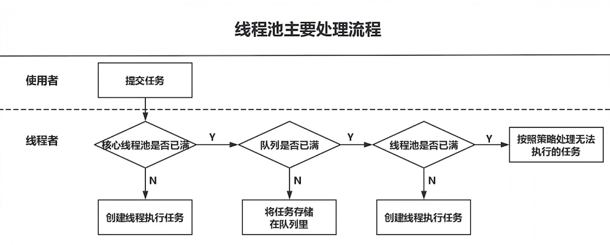
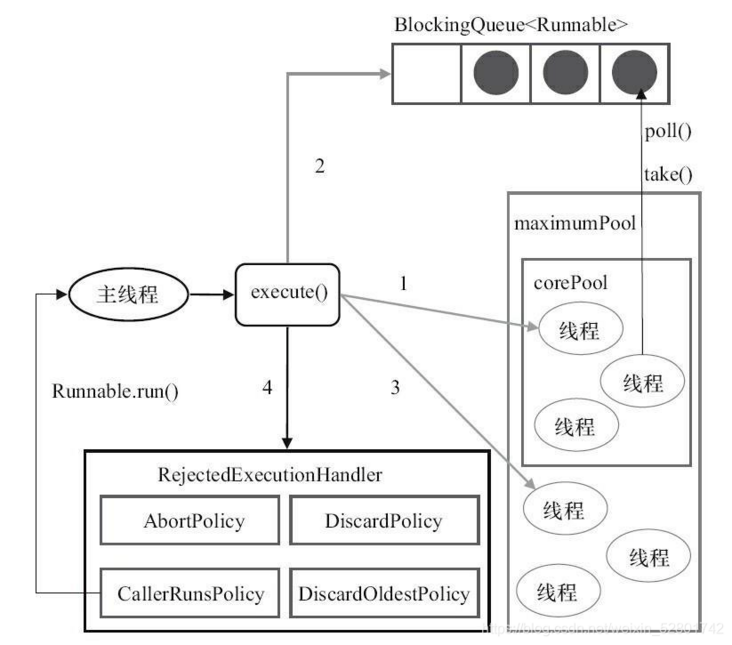

## 为什么要有线程池

线程池能够对线程进行统一分配，调优和监控:

- 降低资源消耗(线程无限制地创建，然后使用完毕后销毁)
- 提高响应速度(无须创建线程)
- 提高线程的可管理性


## 线程池实现

Java是如何实现和管理线程池的?

从JDK 5开始，把工作单元与执行机制分离开来，工作单元包括Runnable和Callable，而执行机制由Executor框架提供。


- WorkerThread

  ```java
  public class WorkerThread implements Runnable {
       
      private String command;
       
      public WorkerThread(String s){
          this.command=s;
      }
   
      @Override
      public void run() {
          System.out.println(Thread.currentThread().getName()+" Start. Command = "+command);
          processCommand();
          System.out.println(Thread.currentThread().getName()+" End.");
      }
   
      private void processCommand() {
          try {
              Thread.sleep(5000);
          } catch (InterruptedException e) {
              e.printStackTrace();
          }
      }
   
      @Override
      public String toString(){
          return this.command;
      }
  }
  ```

  

- SimpleThreadPool

  ```java
  import java.util.concurrent.ExecutorService;
  import java.util.concurrent.Executors;
   
  public class SimpleThreadPool {
   
      public static void main(String[] args) {
          ExecutorService executor = Executors.newFixedThreadPool(5);
          for (int i = 0; i < 10; i++) {
              Runnable worker = new WorkerThread("" + i);
              executor.execute(worker);
            }
          executor.shutdown(); // This will make the executor accept no new threads and finish all existing threads in the queue
          while (!executor.isTerminated()) { // Wait until all threads are finish,and also you can use "executor.awaitTermination();" to wait
          }
          System.out.println("Finished all threads");
      }
  
  }
  ```


程序中我们创建了固定大小为五个工作线程的线程池。然后分配给线程池十个工作，因为线程池大小为五，它将启动五个工作线程先处理五个工作，其他的工作则处于等待状态，一旦有工作完成，空闲下来工作线程就会捡取等待队列里的其他工作进行执行。

Executors 类提供了使用了 ThreadPoolExecutor 的简单的 ExecutorService 实现，但是 ThreadPoolExecutor 提供的功能远不止于此。我们可以在创建 ThreadPoolExecutor 实例时指定活动线程的数量，我们也可以限制线程池的大小并且创建我们自己的 RejectedExecutionHandler 实现来处理不能适应工作队列的工作。


## ThreadPoolExecutor详解

其实java线程池的实现原理很简单，说白了就是一个线程集合 workerSet 和一个阻塞队列 workQueue。当用户向线程池提交一个任务(也就是线程)时，线程池会先将任务放入 workQueue 中。workerSet 中的线程会不断的从 workQueue 中获取线程然后执行。当 workQueue 中没有任务的时候，worker 就会阻塞，直到队列中有任务了就取出来继续执行。


## 线程[参数](https://mp.weixin.qq.com/s?__biz=MzIxNTQ4MzE1NA==&mid=2247485631&idx=1&sn=b0d7cd3f337246c79cd08431d9a6d8ec&chksm=9796dec2a0e157d4b8a05b5bc1adcd53bc6ef81112cac5c7dc93370fbbc3baaab717aa5db628&scene=21#wechat_redirect)

1. **corePoolSize**：核心线程数大小

   不管它们创建以后是不是空闲的。线程池需要保持 corePoolSize 数量的线程，除非设置了 allowCoreThreadTimeOut。

2. **maximumPoolSize**：最大线程数
   
      线程池中最多允许创建 maximumPoolSize 个线程
      
3. **keepAliveTime**：存活时间

      如果经过 keepAliveTime 时间后，超过核心线程数的线程还没有接受到新的任务，那就回收。

4. **unit**：时间单位

      keepAliveTime 的时间单位

5. **workQueue**：存放待执行任务的队列

      当提交的任务数超过核心线程数大小后，再提交的任务就存放在这里。它仅仅用来存放被 execute 方法提交的 Runnable 任务。

6. **threadFactory**：线程工厂

      用于指定如何创建一个线程。比如这里面可以自定义线程名称，当进行虚拟机栈分析时，看着名字就知道这个线程是哪里来的，不会懵逼。

7. **handler** ：拒绝策略

      当队列里面放满了任务、最大线程数的线程都在工作时，这时继续提交的任务线程池就处理不了，应该执行怎么样的拒绝策略。


## **线程池的使用**

阿里 Java 开发手册 对线程池的使用进行了限制，可作参考：

 【强制】线程资源必须通过线程池提供，不允许在应用中自行显式创建线程。

说明：使用线程池的好处是减少在创建和销毁线程上所花的时间以及系统资源的开销，解决资源不足的问题。如果不使用线程池，有可能造成系统创建大量同类线程而导致消耗完内存或者“过度切换”的问题。

 【强制】线程池不允许使用**Executors**去创建，而是通过**ThreadPoolExecutor**的方式，这样的处理方式让写的同学更加明确线程池的运行规则，规避资源耗尽的风险。

- Executors.newCachedThreadPool()：无界线程池，可以进行自动线程回收
- Executors.newFixedThreadPool(int)：固定大小的线程池
- Executors.newSingleThreadExecutor()：单个后台线程的线程池
- Executors.newScheduledThreadPool()：执行定时任务的线程池
- Executors.newWorkStealingPool(int)：支持并行执行的线程池

> 说明：Executors返回的线程池对象的弊端如下：
>
> 1）FixedThreadPool和SingleThreadPool:允许的请求队列长度为Integer.MAX_VALUE，可能会堆积大量的请求，从而导致OOM。
>
> 2）CachedThreadPool和ScheduledThreadPool:允许的创建线程数量为Integer.MAX_VALUE，可能会创建大量的线程，从而导致OOM。

 


 

## ThreadPoolTaskExecutor和ThreadPoolExecutor区别

**ThreadPoolExecutor**

这个类是JDK中的线程池类，继承自Executor， Executor 顾名思义是专门用来处理多线程相关的一个接口，所有县城相关的类都实现了这个接口，里面有一个execute()方法，用来执行线程，线程池主要提供一个线程队列，队列中保存着所有等待状态的线程。避免了创建与销毁的额外开销，提高了响应的速度。

**ThreadPoolTaskExecutor**

这个类则是spring包下的，是sring为我们提供的线程池类，配合@EnableAsync和@Async实现方法或者类的异步调用。


分析下继承关系：

```java
public class ThreadPoolTaskExecutor extends ExecutorConfigurationSupport
		implements AsyncListenableTaskExecutor, SchedulingTaskExecutor{}
```

```java
ExecutorConfigurationSupport extends CustomizableThreadFactory
		implements BeanNameAware, InitializingBean, DisposableBean

AsyncListenableTaskExecutor extends AsyncTaskExecutor

SchedulingTaskExecutor extends AsyncTaskExecutor
```

从上继承关系可知：

ThreadPoolExecutor是一个java类不提供spring生命周期和参数装配。

ThreadPoolTaskExecutor实现了InitializingBean, DisposableBean ，xxaware等，具有spring特性

AsyncListenableTaskExecutor提供了监听任务方法(相当于添加一个任务监听，提交任务完成都会回调该方法)

**简单理解**：

1、ThreadPoolTaskExecutor使用ThreadPoolExecutor并增强，扩展了更多特性

2、ThreadPoolTaskExecutor只关注自己增强的部分，任务执行还是ThreadPoolExecutor处理。

3、前者spring自己用着爽，后者离开spring我们用ThreadPoolExecutor爽。

注意：ThreadPoolTaskExecutor 不会自动创建ThreadPoolExecutor需要手动调initialize才会创建。如果@Bean 就不需手动，会自动InitializingBean的afterPropertiesSet来调initialize


## 问答


> 参考：[10问10答：你真的了解线程池吗？](https://mp.weixin.qq.com/s/axWymUaYaARtvsYqvfyTtw)


**线程池创建之后，会立即创建核心线程么**

不会。从上面的源码可以看出，在刚刚创建ThreadPoolExecutor的时候，线程并不会立即启动，而是要等到有任务提交时才会启动，除非调用了prestartCoreThread/prestartAllCoreThreads事先启动核心线程。


**核心线程永远不会销毁么**

在JDK1.6之后，如果allowsCoreThreadTimeOut=true，核心线程也可以被终止。


**keepAliveTime=0会怎么样**

在JDK1.8中，keepAliveTime=0表示非核心线程执行完立刻终止。


## 执行过程

 

步骤：

1. 先使用核心线程执行任务
2. 满了之后放入阻塞队列
3. 阻塞队列满了就创建非核心线程执行任务
4. 总的线程数达到最大线程数之后按照拒绝策略执行处理


**美团点评技术团队：**


 


## ThreadPoolExecutor 的[内部结构](https://segmentfault.com/a/1190000040009000)

 


## ThreadLocal

**提供线程局部变量，实现线程数据隔离**

ThreadLocal是一个将在多线程中为每一个线程创建单独的变量副本的类；当使用ThreadLocal来维护变量时，ThreadLocal会为每个线程创建单独的变量副本，避免因多线程操作共享变量而导致的数据不一致的情况。

**使用**

提到ThreadLocal被提到应用最多的是session管理和数据库链接管理。在Spring中提供了事务相关的操作，事务保证一组操作同时成功或者失败，这意味着我们一次事务的所有操作都需要再同一个数据库连接上。Spring使用ThreadLocal来实现连接共享；ThreadLocal的存储类型是一个Map，Map中的key是DataSource，value是Connection，用ThreadLocal保证了同一个线程获取同一个Connection对象，保证一次事务的所有操作在同一个数据库连接上。

**示例**

Session的管理

```java
private static final ThreadLocal threadSession = new ThreadLocal();  
  
public static Session getSession() throws InfrastructureException {  
    Session s = (Session) threadSession.get();  
    try {  
        if (s == null) {  
            s = getSessionFactory().openSession();  
            threadSession.set(s);  
        }  
    } catch (HibernateException ex) {  
        throw new InfrastructureException(ex);  
    }  
    return s;  
}  
```


