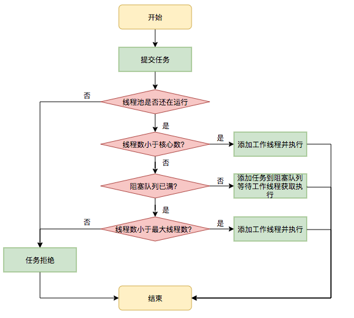

## **线程**[**参数**](https://mp.weixin.qq.com/s?__biz=MzIxNTQ4MzE1NA==&mid=2247485631&idx=1&sn=b0d7cd3f337246c79cd08431d9a6d8ec&chksm=9796dec2a0e157d4b8a05b5bc1adcd53bc6ef81112cac5c7dc93370fbbc3baaab717aa5db628&scene=21#wechat_redirect)

1. **corePoolSize**：the number of threads to keep in the     pool, even if they are idle, unless {@code allowCoreThreadTimeOut} is     set
             （核心线程数大小：不管它们创建以后是不是空闲的。线程池需要保持 corePoolSize 数量的线程，除非设置了     allowCoreThreadTimeOut。）
2. **maximumPoolSize**：the maximum number of threads to     allow in the pool。
             （最大线程数：线程池中最多允许创建 maximumPoolSize 个线程。）
3. **keepAliveTime**：when the number of threads is     greater than the core, this is the maximum time that excess idle threads     will wait for new tasks before terminating。
             （存活时间：如果经过 keepAliveTime 时间后，超过核心线程数的线程还没有接受到新的任务，那就回收。）
4. **unit**：the time unit for the {@code     keepAliveTime} argument
             （keepAliveTime 的时间单位。）
5. **workQueue**：the queue to use for holding     tasks before they are executed.  This queue will hold only the {@code     Runnable} tasks submitted by the {@code execute} method。
             （存放待执行任务的队列：**当提交的任务数超过核心线程数大小后，再提交的任务就存放在这里**。它仅仅用来存放被 execute 方法提交的 Runnable     任务。所以这里就不要翻译为工作队列了，好吗？不要自己给自己挖坑。）
6. **threadFactory**：the factory to use when the     executor creates a new thread。
             （线程工程：用来创建线程工厂。比如这里面可以自定义线程名称，当进行虚拟机栈分析时，看着名字就知道这个线程是哪里来的，不会懵逼。）
7. **handler** ：the handler to use when     execution is blocked because the thread bounds and queue capacities are     reached。
             （拒绝策略：当队列里面放满了任务、最大线程数的线程都在工作时，这时继续提交的任务线程池就处理不了，应该执行怎么样的拒绝策略。）

 