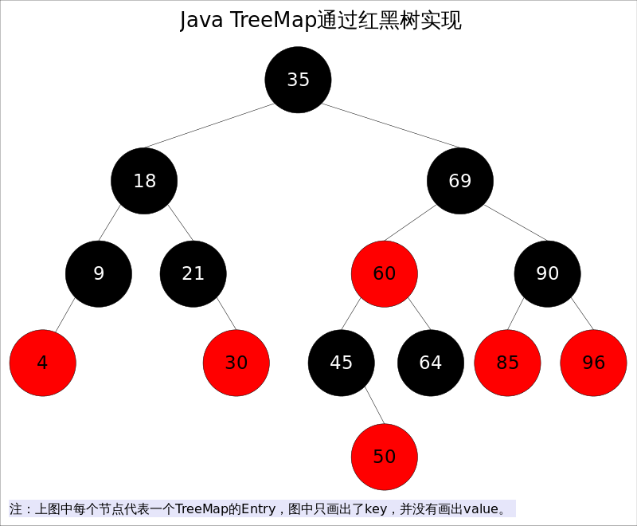

# 集合

容器主要包括 Collection 和 Map 两种，Collection 存储着对象的集合，而 Map 存储着键值对(两个对象)的映射表。


程序开发中数据结构可以分为这八类；`数组`、`链表`、`栈`、`队列`、`散列表`、`树`、`堆`、`图`。其中，数组、链表、散列表、树是程序开发直接或者间接用到的最多的。相关的对应实现类可以包括如下；

| 类型   | 实现          | 文章                                                         |
| :----- | :------------ | :----------------------------------------------------------- |
| 数组   | ArrayList     | [ArrayList也这么多知识？一个指定位置插入就把谢飞机面晕了！](https://bugstack.cn/interview/2020/09/03/[https://bugstack.cn/interview/2020/08/27/面经手册-第7篇-ArrayList也这么多知识-一个指定位置插入就把谢飞机面晕了.html](https://bugstack.cn/interview/2020/08/27/面经手册-第7篇-ArrayList也这么多知识-一个指定位置插入就把谢飞机面晕了.html)) |
| 链表   | LinkedList    | [LinkedList插入速度比ArrayList快？你确定吗？](https://bugstack.cn/interview/2020/09/03/[https://bugstack.cn/interview/2020/08/30/面经手册-第8篇-LinkedList插入速度比ArrayList快-你确定吗.html](https://bugstack.cn/interview/2020/08/30/面经手册-第8篇-LinkedList插入速度比ArrayList快-你确定吗.html)) |
| 树     | 2-3树、红黑树 | [看图说话，讲解2-3平衡树「红黑树的前身」](https://bugstack.cn/interview/2020/09/03/[https://bugstack.cn/interview/2020/08/16/面经手册-第5篇-看图说话-讲解2-3平衡树-红黑树的前身.html](https://bugstack.cn/interview/2020/08/16/面经手册-第5篇-看图说话-讲解2-3平衡树-红黑树的前身.html)) [红黑树操作原理，解析什么时候染色、怎么进行旋转、与2-3树有什么关联](https://bugstack.cn/interview/2020/09/03/[https://bugstack.cn/interview/2020/08/20/面经手册-第6篇-带着面试题学习红黑树操作原理-解析什么时候染色-怎么进行旋转-与2-3树有什么关联.html](https://bugstack.cn/interview/2020/08/20/面经手册-第6篇-带着面试题学习红黑树操作原理-解析什么时候染色-怎么进行旋转-与2-3树有什么关联.html)) |
| 散列表 | HashMap       | [HashMap核心知识，扰动函数、负载因子、扩容链表拆分，深度学习](https://bugstack.cn/interview/2020/09/03/[https://bugstack.cn/interview/2020/08/07/面经手册-第3篇-HashMap核心知识-扰动函数-负载因子-扩容链表拆分-深度学习.html](https://bugstack.cn/interview/2020/08/07/面经手册-第3篇-HashMap核心知识-扰动函数-负载因子-扩容链表拆分-深度学习.html)) [HashMap数据插入、查找、删除、遍历，源码分析](https://bugstack.cn/interview/2020/09/03/[https://bugstack.cn/interview/2020/08/13/面经手册-第4篇-HashMap数据插入-查找-删除-遍历-源码分析.html](https://bugstack.cn/interview/2020/08/13/面经手册-第4篇-HashMap数据插入-查找-删除-遍历-源码分析.html)) |
| 栈     | Stack         |                                                              |
| 队列   | Queue、Deque  |                                                              |


## ArrayList

> 著作权归https://pdai.tech所有。 链接：https://www.pdai.tech/md/java/collection/java-collection-ArrayList.html

*ArrayList*实现了*List*接口，是顺序容器，即元素存放的数据与放进去的顺序相同，允许放入`null`元素，底层通过**数组实现**。除该类未实现同步外，其余跟*Vector*大致相同。每个*ArrayList*都有一个**容量**(capacity)，表示底层数组的实际大小，容器内存储元素的个数不能多于当前容量。当向容器中添加元素时，如果容量不足，容器会自动增大底层数组的大小。前面已经提过，Java泛型只是编译器提供的语法糖，所以这里的数组是一个Object数组，以便能够容纳任何类型的对象。


### 底层数据结构

- elementData 存储实际数据
- size 存储当前链表实际存储元素的长度

```java
transient Object[] elementData; // non-private to simplify nested class access

/**
 * The size of the ArrayList (the number of elements it contains).
 */
private int size;
```


### 自动扩容

每当向数组中添加元素时，都要去检查添加后元素的个数是否会超出当前数组的长度，如果超出，数组将会进行扩容，以满足添加数据的需求。数组扩容通过一个公开的方法ensureCapacity(int minCapacity)来实现。在实际添加大量元素前，我也可以使用ensureCapacity来手动增加ArrayList实例的容量，以减少递增式再分配的数量。

数组进行**扩容**时，会将老数组中的元素重新拷贝一份到新的数组中，每次数组容量的**增长**大约是其原容量的**1.5**倍。这种操作的代价是很高的，因此在实际使用时，我们应该尽量避免数组容量的扩张。当我们可预知要保存的元素的多少时，要在构造ArrayList实例时，就指定其容量，以避免数组扩容的发生。或者根据实际需求，通过调用ensureCapacity方法来手动增加ArrayList实例的容量。


## LinkedList

> 著作权归https://pdai.tech所有。 链接：https://www.pdai.tech/md/java/collection/java-collection-LinkedList.html

*LinkedList*同时实现了*List*接口和*Deque*接口，也就是说它既可以看作一个顺序容器，又可以看作一个**队列**(*Queue*)，同时又可以看作一个**栈**(*Stack*)。这样看来，*LinkedList*简直就是个全能冠军。当你需要使用栈或者队列时，可以考虑使用*LinkedList*，一方面是因为Java官方已经声明不建议使用*Stack*类，更遗憾的是，Java里根本没有一个叫做*Queue*的类(它是个接口名字)。关于栈或队列，现在的首选是*ArrayDeque*，它有着比*LinkedList*(当作栈或队列使用时)有着更好的性能。

*LinkedList*的实现方式决定了所有跟下标相关的操作都是线性时间，而在首段或者末尾删除元素只需要常数时间。为追求效率*LinkedList*没有实现同步(synchronized)，如果需要多个线程并发访问，可以先采用`Collections.synchronizedList()`方法对其进行包装。


### 底层数据结构

*LinkedList*底层**通过双向链表实现**，本节将着重讲解插入和删除元素时双向链表的维护过程，也即是之间解跟*List*接口相关的函数，而将*Queue*和*Stack*以及*Deque*相关的知识放在下一节讲。双向链表的每个节点用内部类*Node*表示。*LinkedList*通过`first`和`last`引用分别指向链表的第一个和最后一个元素。注意这里没有所谓的哑元，当链表为空的时候`first`和`last`都指向`null`。

size 存储当前链表实际存储元素的长度


```java
transient int size = 0;

/**
 * Pointer to first node.
 */
transient Node<E> first;

/**
 * Pointer to last node.
 */
transient Node<E> last;
```

其中Node是私有的内部类：

```java
private static class Node<E> {
    E item;
    Node<E> next;
    Node<E> prev;

    Node(Node<E> prev, E element, Node<E> next) {
        this.item = element;
        this.next = next;
        this.prev = prev;
    }
}
```


### 方法解析

`add(int index, E element)`, 当index==size时，等同于add(E e); 如果不是，则分两步: 

- 先根据index找到要插入的位置,即node(index)方法；
- 修改引用，完成插入操作。

因为链表双向的，可以从开始往后找，也可以从结尾往前找，具体朝那个方向找取决于条件`index < (size >> 1)`，也即是index是靠近前端还是后端。从这里也可以看出，linkedList通过index检索元素的效率没有arrayList高。（**双向查找**）


## ArrayDeque

> 著作权归https://pdai.tech所有。 链接：https://www.pdai.tech/md/java/collection/java-collection-Queue&Stack.html

Java里有一个叫做*Stack*的类，却没有叫做*Queue*的类(它是个接口名字)。当需要使用栈时，Java已不推荐使用*Stack*，而是推荐使用更高效的*ArrayDeque*；既然*Queue*只是一个接口，当需要使用队列时也就首选*ArrayDeque*了(次选是*LinkedList*)。

*ArrayDeque*和*LinkedList*是*Deque*的两个通用实现，由于官方更推荐使用*AarryDeque* **用作栈和队列** 。

### Queue

*Queue*接口继承自Collection接口，除了最基本的Collection的方法之外，它还支持额外的*insertion*, *extraction*和*inspection*操作。这里有两组格式，共6个方法，一组是抛出异常的实现；另外一组是返回值的实现(没有则返回null)。

|         | Throws exception | Returns special value |
| ------- | ---------------- | --------------------- |
| Insert  | add(e)           | offer(e)              |
| Remove  | remove()         | poll()                |
| Examine | element()        | peek()                |

### Deque

`Deque`是"double ended queue", 表示双向的队列，英文读作"deck"，它既可以当作栈使用，也可以当作队列使用。Deque 继承自 Queue接口，除了支持Queue的方法之外，还支持`insert`, `remove`和`examine`操作，由于Deque是双向的，所以可以对队列的头和尾都进行操作。

### ArrayDeque

从名字可以看出*ArrayDeque*底层通过数组实现，为了满足可以同时在数组两端插入或删除元素的需求，该数组还必须是循环的，即 **循环数组(circular array)** ，也就是说数组的任何一点都可能被看作起点或者终点。 *ArrayDeque* 是非线程安全的(not thread-safe)，当多个线程同时使用的时候，需要程序员手动同步；另外，该容器不允许放入`null`元素。


上图中我们看到， **`head`指向首端第一个有效元素，`tail`指向尾端第一个可以插入元素的空位** 。因为是循环数组，所以`head`不一定总等于0，`tail`也不一定总是比`head`大。


### 自动扩容

扩容函数`doubleCapacity()`，其逻辑是申请一个更大的数组(原数组的两倍)，然后将原数组复制过去。过程如下图所示


图中我们看到，复制分两次进行，第一次复制`head`右边的元素，第二次复制`head`左边的元素。


## HashMap

HashMap 最早出现在 JDK 1.2中，底层基于散列算法实现。HashMap 允许 null 键和 null 值，在计算哈键的哈希值时，null 键哈希值为 0。HashMap 并不保证键值对的顺序，这意味着在进行某些操作后，键值对的顺序可能会发生变化。另外，需要注意的是，HashMap 是非线程安全类，在多线程环境下可能会存在问题。


### 扰动函数

理论上来说字符串的`hashCode`是一个int类型值，那可以直接作为数组下标了，且不会出现碰撞。但是这个`hashCode`的取值范围是[-2147483648, 2147483647]，有将近40亿的长度，谁也不能把数组初始化的这么大，内存也是放不下的。

我们默认初始化的Map大小是16个长度 `DEFAULT_INITIAL_CAPACITY = 1 << 4`，所以获取的Hash值并不能直接作为下标使用，需要与数组长度进行取模运算得到一个下标值，也就是我们上面做的散列列子。

那么，hashMap源码这里不只是直接获取哈希值，还进行了一次扰动计算，`(h = key.hashCode()) ^ (h >>> 16)`。把哈希值右移16位，也就正好是自己长度的一半，之后与原哈希值做异或运算，这样就混合了原哈希值中的高位和低位，增大了**随机性**。

说白了，使用扰动函数就是为了增加随机性，让数据元素更加均衡的散列，减少碰撞。


### 负载因子

```
static final float DEFAULT_LOAD_FACTOR = 0.75f;
```

**负载因子是做什么的？**

负载因子，可以理解成一辆车可承重重量超过某个阀值时，把货放到新的车上。

那么在HashMap中，负载因子决定了数据量多少了以后进行扩容。*这里要提到上面做的HashMap例子，我们准备了7个元素，但是最后还有3个位置空余，2个位置存放了2个元素。* 所以可能即使你数据比数组容量大时也是不一定能正正好好的把数组占满的，而是在某些小标位置出现了大量的碰撞，只能在同一个位置用链表存放，那么这样就失去了Map数组的性能。

所以，要选择一个合理的大小下进行扩容，默认值0.75就是说当阀值容量占了3/4时赶紧扩容，减少Hash碰撞。

同时0.75是一个默认构造值，在创建HashMap也可以调整，比如你希望用更多的空间换取时间，可以把负载因子调的更小一些，减少碰撞。


### 数组扩容

#### 链表数据插入

**java8之前是头插法**，就是说新来的值会取代原有的值，原有的值就顺推到链表中去，就像上面的例子一样，因为写这个代码的作者认为后来的值被查找的可能性更大一点，提升查找的效率。但是，**在java8之后，都是所用尾部插入了。**

**使用头插**会改变链表的上的顺序，但是如果**使用尾插**，在扩容时会保持链表元素原本的顺序，就不会出现链表成环的问题了。

Java7在多线程操作HashMap时可能引起死循环，原因是扩容转移后前后链表顺序倒置，在转移过程中修改了原来链表中节点的引用关系。

Java8在同样的前提下并不会引起死循环，原因是扩容转移后前后链表顺序不变，保持之前节点的引用关系。


#### 扩容

- capacity 即容量，默认16。
- loadFactor 加载因子，默认是0.75
- threshold 阈值。阈值=容量*加载因子。默认12。当元素数量超过阈值时便会触发扩容。

resize() 方法用于初始化数组或数组扩容，每次**扩容**后，**容量为原来的 2 倍**，并进行数据迁移。


### 链表树化

HashMap这种散列表的数据结构，最大的性能在于可以O(1)时间复杂度定位到元素，但因为哈希碰撞不得已在一个下标里存放多组数据，那么jdk1.8之前的设计只是采用链表的方式进行存放，如果需要从链表中定位到数据时间复杂度就是O(n)，链表越长性能越差。因为在jdk1.8中把过长的链表也就是8个，优化为自平衡的红黑树结构，以此让定位元素的时间复杂度优化近似于O(logn)，这样来提升元素查找的效率。但也不是完全抛弃链表，因为在元素相对不多的情况下，链表的插入速度更快，所以综合考虑下设定阈值为8才进行红黑树转换操作。

treeifyBin,是一个链表转树的方法，但不是所有的链表长度为8后都会转成树，还需要判断存放key值的数组桶长度是否小于`64 MIN_TREEIFY_CAPACITY`。如果小于则需要扩容，扩容后链表上的数据会被拆分散列的相应的桶节点上，也就把链表长度缩短了。

**知识点**

1. 链表树化的条件有两点；**链表长度大于等于8、桶容量大于64，否则只是扩容，不会树化**。
2. 链表树化的过程中是先由链表转换为树节点，此时的树可能不是一颗平衡树。同时在树转换过程中会记录链表的顺序，`tl.next = p`，这主要方便后续树转链表和拆分更方便。
3. 链表转换成树完成后，在进行红黑树的转换。先简单介绍下，红黑树的转换需要染色和旋转，以及比对大小。在比较元素的大小中，有一个比较有意思的方法，`tieBreakOrder`加时赛，这主要是因为HashMap没有像TreeMap那样本身就有Comparator的实现。


### 红黑树转链

在链表转红黑树中我们重点介绍了一句，在转换树的过程中，记录了原有链表的顺序。那么，这就简单了，红黑树转链表时候，直接把TreeNode转换为Node即可


### put 过程分析

1. 找到具体的数组下标，如果此位置没有值，那么直接初始化一下 Node 并放置在这个位置就可以
2. 数组该位置有数据，如果该节点是代表红黑树的节点，调用红黑树的插值方法，否则说明数组该位置上是一个链表
3. 如果在该链表中找到了"相等"的则覆盖掉原值，否则插入到链表的最后面

```java
public V put(K key, V value) {
    return putVal(hash(key), key, value, false, true);
}

// 第四个参数 onlyIfAbsent 如果是 true，那么只有在不存在该 key 时才会进行 put 操作
// 第五个参数 evict 我们这里不关心
final V putVal(int hash, K key, V value, boolean onlyIfAbsent,
               boolean evict) {
    Node<K,V>[] tab; Node<K,V> p; int n, i;
    // 第一次 put 值的时候，会触发下面的 resize()，类似 java7 的第一次 put 也要初始化数组长度
    // 第一次 resize 和后续的扩容有些不一样，因为这次是数组从 null 初始化到默认的 16 或自定义的初始容量
    if ((tab = table) == null || (n = tab.length) == 0)
        n = (tab = resize()).length;
    // 找到具体的数组下标，如果此位置没有值，那么直接初始化一下 Node 并放置在这个位置就可以了
    if ((p = tab[i = (n - 1) & hash]) == null)
        tab[i] = newNode(hash, key, value, null);

    else {// 数组该位置有数据
        Node<K,V> e; K k;
        // 首先，判断该位置的第一个数据和我们要插入的数据，key 是不是"相等"，如果是，取出这个节点
        if (p.hash == hash &&
            ((k = p.key) == key || (key != null && key.equals(k))))
            e = p;
        // 如果该节点是代表红黑树的节点，调用红黑树的插值方法，本文不展开说红黑树
        else if (p instanceof TreeNode)
            e = ((TreeNode<K,V>)p).putTreeVal(this, tab, hash, key, value);
        else {
            // 到这里，说明数组该位置上是一个链表
            for (int binCount = 0; ; ++binCount) {
                // 插入到链表的最后面(Java7 是插入到链表的最前面)
                if ((e = p.next) == null) {
                    p.next = newNode(hash, key, value, null);
                    // TREEIFY_THRESHOLD 为 8，所以，如果新插入的值是链表中的第 8 个
                    // 会触发下面的 treeifyBin，也就是将链表转换为红黑树
                    if (binCount >= TREEIFY_THRESHOLD - 1) // -1 for 1st
                        treeifyBin(tab, hash);
                    break;
                }
                // 如果在该链表中找到了"相等"的 key(== 或 equals)
                if (e.hash == hash &&
                    ((k = e.key) == key || (key != null && key.equals(k))))
                    // 此时 break，那么 e 为链表中[与要插入的新值的 key "相等"]的 node
                    break;
                p = e;
            }
        }
        // e!=null 说明存在旧值的key与要插入的key"相等"
        // 对于我们分析的put操作，下面这个 if 其实就是进行 "值覆盖"，然后返回旧值
        if (e != null) {
            V oldValue = e.value;
            if (!onlyIfAbsent || oldValue == null)
                e.value = value;
            afterNodeAccess(e);
            return oldValue;
        }
    }
    ++modCount;
    // 如果 HashMap 由于新插入这个值导致 size 已经超过了阈值，需要进行扩容
    if (++size > threshold)
        resize();
    afterNodeInsertion(evict);
    return null;
}
```


### HashSet

*HashSet*是对*HashMap*的简单包装，对*HashSet*的函数调用都会转换成合适的*HashMap*方法，因此*HashSet*的实现非常简单，只有不到300行代码。这里不再赘述。

```java
//HashSet是对HashMap的简单包装
public class HashSet<E>
{
	......
	private transient HashMap<E,Object> map;//HashSet里面有一个HashMap
    // Dummy value to associate with an Object in the backing Map
    private static final Object PRESENT = new Object();
    public HashSet() {
        map = new HashMap<>();
    }
    ......
    public boolean add(E e) {//简单的方法转换
        return map.put(e, PRESENT)==null;
    }
    ......
}
```


> 参考链接：
> [《HashMap核心知识，扰动函数、负载因子、扩容链表拆分，深度学习》](https://bugstack.cn/interview/2020/08/07/%E9%9D%A2%E7%BB%8F%E6%89%8B%E5%86%8C-%E7%AC%AC3%E7%AF%87-HashMap%E6%A0%B8%E5%BF%83%E7%9F%A5%E8%AF%86-%E6%89%B0%E5%8A%A8%E5%87%BD%E6%95%B0-%E8%B4%9F%E8%BD%BD%E5%9B%A0%E5%AD%90-%E6%89%A9%E5%AE%B9%E9%93%BE%E8%A1%A8%E6%8B%86%E5%88%86-%E6%B7%B1%E5%BA%A6%E5%AD%A6%E4%B9%A0.html)
> 
> [《我们一起进大厂》系列-HashMap](https://juejin.cn/post/6844904017269637128)


## LinkedHashMap

> 著作权归https://pdai.tech所有。 链接：https://www.pdai.tech/md/java/collection/java-map-LinkedHashMap&LinkedHashSet.html

*LinkedHashMap*实现了*Map*接口，即允许放入`key`为`null`的元素，也允许插入`value`为`null`的元素。从名字上可以看出该容器是*linked list*和*HashMap*的混合体，也就是说它同时满足*HashMap*和*linked list*的某些特性。**可将*LinkedHashMap*看作采用*linked list*增强的*HashMap*。**


事实上*LinkedHashMap*是*HashMap*的直接子类，**二者唯一的区别是*LinkedHashMap*在*HashMap*的基础上，采用双向链表(doubly-linked list)的形式将所有`entry`连接起来，这样是为保证元素的迭代顺序跟插入顺序相同**。上图给出了*LinkedHashMap*的结构图，主体部分跟*HashMap*完全一样，多了`header`指向双向链表的头部(是一个哑元)，**该双向链表的迭代顺序就是`entry`的插入顺序**。

除了可以保迭代历顺序，这种结构还有一个好处 : **迭代\*LinkedHashMap\*时不需要像\*HashMap\*那样遍历整个`table`，而只需要直接遍历`header`指向的双向链表即可**，也就是说*LinkedHashMap*的迭代时间就只跟`entry`的个数相关，而跟`table`的大小无关。

有两个参数可以影响*LinkedHashMap*的性能: 初始容量(inital capacity)和负载系数(load factor)。初始容量指定了初始`table`的大小，负载系数用来指定自动扩容的临界值。当`entry`的数量超过`capacity*load_factor`时，容器将自动扩容并重新哈希。对于插入元素较多的场景，将初始容量设大可以减少重新哈希的次数。

将对象放入到*LinkedHashMap*或*LinkedHashSet*中时，有两个方法需要特别关心: `hashCode()`和`equals()`。**`hashCode()`方法决定了对象会被放到哪个`bucket`里，当多个对象的哈希值冲突时，`equals()`方法决定了这些对象是否是“同一个对象”**。所以，如果要将自定义的对象放入到`LinkedHashMap`或`LinkedHashSet`中，需要@Override `hashCode()`和`equals()`方法。


出于性能原因，*LinkedHashMap*是非同步的(not synchronized)，如果需要在多线程环境使用，需要程序员手动同步；或者通过如下方式将*LinkedHashMap*包装成(wrapped)同步的:

```
Map m = Collections.synchronizedMap(new LinkedHashMap(...));
```


### LinkedHashMap经典用法

*LinkedHashMap*除了可以保证迭代顺序外，还有一个非常有用的用法: 可以轻松实现一个采用了FIFO替换策略的缓存。具体说来，LinkedHashMap有一个子类方法`protected boolean removeEldestEntry(Map.Entry<K,V> eldest)`，该方法的作用是告诉Map是否要删除“最老”的Entry，所谓最老就是当前Map中最早插入的Entry，如果该方法返回`true`，最老的那个元素就会被删除。在每次插入新元素的之后LinkedHashMap会自动询问removeEldestEntry()是否要删除最老的元素。这样只需要在子类中重载该方法，当元素个数超过一定数量时让removeEldestEntry()返回true，就能够实现一个固定大小的FIFO策略的缓存。示例代码如下

```java
/** 一个固定大小的FIFO替换策略的缓存 */
class FIFOCache<K, V> extends LinkedHashMap<K, V>{
    private final int cacheSize;
    public FIFOCache(int cacheSize){
        this.cacheSize = cacheSize;
    }

    // 当Entry个数超过cacheSize时，删除最老的Entry
    @Override
    protected boolean removeEldestEntry(Map.Entry<K,V> eldest) {
       return size() > cacheSize;
    }
}
```


### LinkedHashSet

*LinkedHashSet*和*LinkedHashMap*在Java里也有着相同的实现，前者仅仅是对后者做了一层包装，也就是说**LinkedHashSet里面有一个LinkedHashMap(适配器模式)**。


## TreeMap

> 著作权归https://pdai.tech所有。 链接：https://www.pdai.tech/md/java/collection/java-map-TreeMap&TreeSet.html

Java *TreeMap*实现了*SortedMap*接口，也就是说会按照`key`的大小顺序对*Map*中的元素进行排序，`key`大小的评判可以通过其本身的自然顺序(natural ordering)，也可以通过构造时传入的比较器(Comparator)。

***TreeMap\*底层通过红黑树(Red-Black tree)实现**，也就意味着`containsKey()`, `get()`, `put()`, `remove()`都有着`log(n)`的时间复杂度。其具体算法实现参照了《算法导论》。




出于性能原因，*TreeMap*是非同步的(not synchronized)，如果需要在多线程环境使用，需要程序员手动同步；或者通过如下方式将*TreeMap*包装成(wrapped)同步的:

```
SortedMap m = Collections.synchronizedSortedMap(new TreeMap(...));
```

**红黑树是一种近似平衡的二叉查找树，它能够确保任何一个节点的左右子树的高度差不会超过二者中较低那个的一陪**。具体来说，红黑树是满足如下条件的二叉查找树(binary search tree):

1. 每个节点要么是红色，要么是黑色。
2. 根节点必须是黑色
3. 红色节点不能连续(也即是，红色节点的孩子和父亲都不能是红色)。
4. 对于每个节点，从该点至`null`(树尾端)的任何路径，都含有相同个数的黑色节点。

在树的结构发生改变时(插入或者删除操作)，往往会破坏上述条件3或条件4，需要通过调整使得查找树重新满足红黑树的约束条件。调整可以分为两类: 一类是颜色调整，即改变某个节点的颜色；另一类是结构调整，集改变检索树的结构关系。结构调整过程包含两个基本操作 : 

- 左旋(Rotate Left)
- 右旋(RotateRight)


### TreeSet

`TreeSet`是对`TreeMap`的简单包装，对`TreeSet`的函数调用都会转换成合适的`TreeMap`方法，因此`TreeSet`的实现非常简单。这里不再赘述。

```java
// TreeSet是对TreeMap的简单包装
public class TreeSet<E> extends AbstractSet<E>
    implements NavigableSet<E>, Cloneable, java.io.Serializable
{
	......
    private transient NavigableMap<E,Object> m;
    // Dummy value to associate with an Object in the backing Map
    private static final Object PRESENT = new Object();
    public TreeSet() {
        this.m = new TreeMap<E,Object>();// TreeSet里面有一个TreeMap
    }
    ......
    public boolean add(E e) {
        return m.put(e, PRESENT)==null;
    }
    ......
}
```

