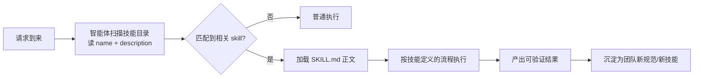
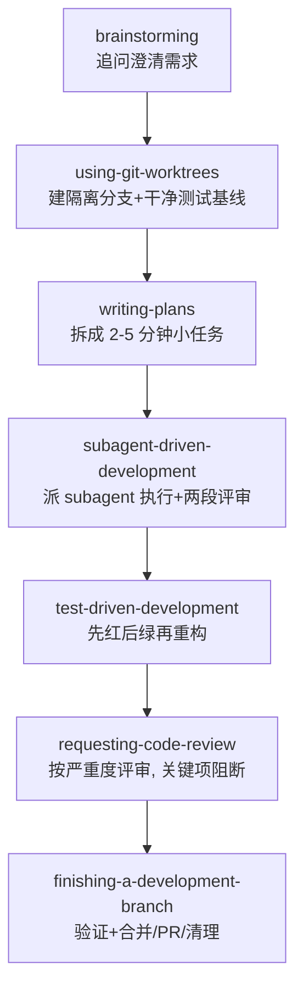

# Agent Skills：以 superpowers 为例的技能复用体系

> 文章来源：综合 [obra/superpowers 官方仓库](https://github.com/obra/superpowers)、Anthropic Skills 文档与社区实践整理，截至 2026-08；技能数量与命令以官方仓库为准。

编码智能体的痛点不是「不会写代码」，而是**不知道什么时候该停、该问什么、按什么顺序来**：你说「做个登录功能」，它直接开写，结果方向偏、没测试、没法审。Skills（技能）就是给智能体的一套**工作流说明书**——把「先澄清需求 → 写计划 → TDD → 评审 → 收尾」这类工程纪律，写成智能体会自动加载并强制执行的 Markdown 文件。

> **注意**：别和「LLM 超级代理框架」的落地案例混淆。这里的 skills 是**写给智能体看的流程文档（Markdown）**，不是一个独立跑起来的多 Agent 系统。后者见[实践 / AI Agent 实践](实践/AI智能体/基于LLM超级代理框架的领域增强定制实践.md)。

## 什么是 Skill

一个 skill = 一段**可复用的工作方法论**，封装在 `SKILL.md` 里（可带辅助文件）。它的特点：

- **平台无关**：因为是文档不是代码，同一套技能文件既能给 Claude Code 用，也能给 Cursor、Codex、OpenCode、Gemini CLI 用。
- **按需加载**：会话开始只加载「名称 + 描述」，正文在匹配到场景时才载入，常驻上下文成本极低。
- **自动触发**：你不必每次手敲 `/brainstorm` 或 `/tdd`——智能体遇到匹配场景会自己去找并应用对应技能。
- **是强制流程，不是建议**：superpowers 的 README 说得很直白——它们是 *forced workflows*，不是可选提示。



> **图题**：skill 的闭环——发现 → 加载 → 按流程执行 → 把经验沉淀成新技能，越用越贴合团队。

## 案例：obra/superpowers

[obra/superpowers](https://github.com/obra/superpowers)（作者 Jesse Vincent，网名 obra，Request Tracker 作者）是目前最被广泛使用的编码技能框架之一。它把「工程级开发方法论」做成了**一组可组合的 skills + 启动指令**：启动指令要求 Claude 在行动前先找相关技能、命中就照做。

### 安装

```bash
# Claude Code 内，从官方市场（已自动注册）
/plugin install superpowers@claude-plugins-official

# 或从作者自己的市场（更新更快）
/plugin marketplace add obra/superpowers-marketplace
/plugin install superpowers@superpowers-marketplace

# 手动克隆也行
git clone https://github.com/obra/superpowers.git ~/.claude/skills/superpowers
```

> **说明**：装完 `/reload-plugins` 或重启即可，之后**无需手动调用**——启动指令会让 Claude 自己去找技能。Cursor / Codex / GitHub Copilot CLI 也有各自的安装入口。

### 14 个技能（按类分组）

| 类别 | 技能 |
|------|------|
| 测试 | `test-driven-development`（强制 RED-GREEN-REFACTOR） |
| 调试 | `systematic-debugging`、`verification-before-completion`（证伪而非宣称修好） |
| 协作 | `brainstorming`、`writing-plans`、`executing-plans`、`dispatching-parallel-agents`、`subagent-driven-development`、`requesting-code-review`、`receiving-code-review`、`using-git-worktrees`、`finishing-a-development-branch` |
| 元 | `writing-skills`（教 Claude 写新技能）、`using-superpowers`（教它发现自己已有的技能） |

### 七步标准流程



> **图题**：superpowers 的标准链路——**Skills 占多数环节**（因为开发需要连续上下文），只在「隔离执行」和「无偏见评审」处才用 subagent。

> **关键洞察**：技能（5/7）多于子代理（2/7），因为大多数开发需要连续上下文；子代理只在「隔离执行独立任务」和「无偏见代码评审」时真正加分。哲学是 **evidence over claims（证据重于声明）**——Claude 必须证明某件事能跑，而不是声称它能跑。

## SKILL.md 的最小写法

一个技能目录至少包含 `SKILL.md`，带 frontmatter：

```markdown
---
name: my-conventional-commits
description: 提交前按 Conventional Commits 规范生成提交信息；当用户要 git commit 时触发
---

# Conventional Commits 技能

当用户准备提交时，按以下规则生成提交信息：

1. 类型取自：feat / fix / docs / refactor / test / chore
2. 主题句不超过 50 字，祈使句、小写开头
3. 必要时在空行后写 body 说明「为什么」而非「做了什么」

示例：
  feat(auth): 支持邮箱+验证码双因素登录
```

> **说明**：`description` 是技能的「触发器」——写清**在什么情况下用**，智能体才匹配得到。把流程步骤、校验清单、反例都写进正文，智能体就会照此执行。

## 三种现实选择

| 方案 | 你得到 | 安装成本 | 约束强度 |
|------|--------|----------|----------|
| `superpowers` 插件 | 14 个互锁技能 + 启动指令 | 一条命令 | 高：TDD/工作树/规划在每个功能上强制 |
| 单个独立技能 | 从目录挑的单项技能，各管各 | 复制文件夹到 `.claude/skills/` | 低：彼此不串联 |
| 自己写技能 | 完全贴合团队约定的 `SKILL.md` | 每技能数小时打磨 | 由你定 |

> **重要**：skills 是「方法论约束」不是「能力增强」——它解决不了模型本身不会的活，但通过强制流程（澄清、计划、TDD、评审）显著提升产出的工程质量。代价是**每次功能多出规划/评审轮次，token 消耗高于自由发挥**，属于用 token 换质量。

## 与其它工具的衔接

- 在 Claude Code 里，skills 是 7 种定制方式之一；配合 `CLAUDE.md`、hooks、subagents 形成完整分层（见 [Claude Code](contents/ai/claude-code.md)）。
- 在 Codex 里，可用 CLI 式 skills 把同类能力接到能力层（见 [Codex](contents/ai/codex.md)）。
- 多个技能可打包成插件（`/plugin`），一键安装 skills + hooks + MCP 接线。

## 官方仓库与资源

- 技能仓库：[github.com/obra/superpowers](https://github.com/obra/superpowers) —— 14 个技能源码、`SKILL.md` 写法与七步流程的权威出处（MIT 开源）
- 插件市场：[github.com/obra/superpowers-marketplace](https://github.com/obra/superpowers-marketplace) —— `/plugin marketplace add` 的来源，更新比官方市场更快
- Anthropic Skills 文档：技能 `frontmatter` 与加载机制的官方说明（见 [Claude Code](contents/ai/claude-code.md) 的「七种定制行为的方式」一节）

## 延伸

- 回到总览：[AI 辅助编程总览](contents/ai/ai-assisted-coding.md)
- 终端智能体：[Claude Code](contents/ai/claude-code.md)
- 云端智能体：[Codex](contents/ai/codex.md)
- 智能体核心机制：[AI Agent](contents/ai/ai-agent.md)
