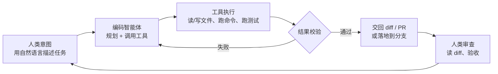

# AI 辅助编程总览：Codex / Claude Code / Skills 横向对比

> 文章来源：本文综合 OpenAI Codex、Anthropic Claude Code 官方文档与个人使用实践整理，截至 2026-08；工具演进较快，具体命令与能力以官方文档为准。

「AI 辅助编程」已经从「编辑器里帮你补全下一行」演进到「你把一整个任务交给一个能读代码、改文件、跑命令、开 PR 的智能体」。这一代工具的核心是 **agentic coding（智能体式编码）**：不是建议，而是行动。

本文把目前最主流的三类形态放到一张图、一张表里对比清楚，并给出选型建议。更深入的用法分别见：

- [Codex](contents/ai/codex.md) —— OpenAI 的云端异步 + 终端 CLI 编码智能体
- [Claude Code](contents/ai/claude-code.md) —— Anthropic 的终端同步编码智能体，可深度定制
- [Agent Skills（superpowers 等）](contents/ai/agent-skills.md) —— 把工程方法论封装成可复用技能包

## 它们解决的根本问题

传统补全式助手（如早期的 GitHub Copilot 行内建议）和你是在「同一条线上交替打字」；而编码智能体是「你下指令，它跑完一整个循环再回来交差」。

> **说明**：编码智能体不是聊天机器人，也不是 IDE 插件——它的核心形态是 CLI / 云端任务，沙箱里自主执行「读代码 → 改文件 → 跑测试 → 交 diff/PR」的完整闭环。

> **图题**：编码智能体的基本闭环——人类给任务，智能体在沙箱里自循环直到产出可审查的结果，最终由人验收。

## 三者横向对比

| 维度 | Codex（OpenAI） | Claude Code（Anthropic） | Skills（superpowers 等） |
|------|----------------|--------------------------|--------------------------|
| 本质 | 编码**智能体**（云端 + CLI） | 编码**智能体**（终端同步） | 给智能体装的**工作流技能包**（非独立工具） |
| 运行位置 | 云端异步任务 / 本地终端 CLI | 本地终端，实时交互 | 运行在 Claude Code / Codex / Cursor 等智能体之内 |
| 交互方式 | 云端：排队派活、合上电脑后回来看 diff；CLI：交互式 | 实时陪跑，危险操作逐条批准 | 自动触发，无需手动调用 |
| 权限模型 | 三种审批模式：suggest / auto-edit / full-auto；沙箱隔离 | 细粒度 allow/ask/deny（settings.json）；沙箱隔离 | 不另设权限，沿用宿主智能体的权限 |
| 记忆/约定文件 | `AGENTS.md`（支持目录级级联） | `CLAUDE.md`（根级 + 子目录按需加载） | 技能即 Markdown 文档，按需加载，常驻成本低 |
| 扩展机制 | MCP、Skills（CLI 式） | skills / subagents / hooks / plugins / MCP | 自身就是 skills；可组合成插件 |
| 最强场景 | 并行异步委派大量独立任务 | 交互式开发、需要边看边批 | 强制工程纪律（TDD、需求澄清、评审） |
| 计费 | 随 ChatGPT 订阅打包；2026-04 起按 token 信用计费 | 需 claude.ai Pro/Max 订阅或 API key | 技能本身免费（MIT），但多出的规划/评审轮次会增加 token 消耗 |
| 主要局限 | 国内需代理；需清晰可验证的任务描述 | 重交互、需订阅；长任务靠 compaction/checkpoint 管理 | 是「方法论约束」不是「能力增强」，不解决模型本身不会的活 |

> **注意**：不要把「Agent Skills（superpowers 等）」和「LLM 超级代理框架」的落地案例混淆——前者是**写给编码智能体看的工作流说明书（Markdown）**，后者是**一个跑起来的多 Agent 应用系统**。详见[实践 / AI Agent 实践](实践/AI智能体/基于LLM超级代理框架的领域增强定制实践.md)。

## 三个工具各自的定位

### Codex：把任务「外包」给云端

Codex 有两条产品线，但内核一致——你描述结果，它在隔离环境里自己把活干完：

- **云端 Agent**：在 ChatGPT 里派任务，或直接在 GitHub 评论里 `@codex` 让它开分支、改代码、跑测试、提 PR；适合「派出去、稍后验收」的异步模式。
- **Codex CLI**：`npx @openai/codex` 起一个本地交互式会话，源码留在本地，命令在沙箱里跑。

深入用法见 [Codex](contents/ai/codex.md)。

### Claude Code：终端里的「结对工程师」

Claude Code 更像一位实时陪你写代码的工程师：你在终端看着它工作，危险动作（push、删文件）逐条确认。它真正的价值在**可定制性**——官方给出 7 种影响行为的方式（CLAUDE.md、rules、skills、subagents、hooks、output styles、追加系统提示），让你把团队规范、审批门槛、自动化脚本都固化下来。

深入用法见 [Claude Code](contents/ai/claude-code.md)。

### Skills（superpowers 等）：给智能体装上「工程纪律」

Skills 解决的是另一层问题：智能体**知道怎么写代码，但不知道什么时候该停、该问什么、按什么顺序来**。以 `obra/superpowers` 为例，它把「先澄清需求 → 写计划 → TDD 开发 → 代码评审 → 收尾」整套流程写成一组 Markdown 技能文件，智能体遇到对应场景会**自动加载并强制执行**，而不是当作可选建议。

深入用法见 [Agent Skills（superpowers 等）](contents/ai/agent-skills.md)；官方仓库见 [obra/superpowers](https://github.com/obra/superpowers)。

## 选型建议

| 你的处境 | 推荐 |
|----------|------|
| 有一批相互独立、可验证的小任务，想「派出去睡一觉回来看」 | **Codex 云端**，批量异步 |
| 正在开发一个功能，想实时盯着、随时纠偏 | **Claude Code**，交互式陪跑 |
| AI 写出的东西总是「能跑但没测试、没规范、方向偏」 | 在任意智能体上装 **superpowers** 类 skills，强制工程流程 |
| 团队要统一约定（构建命令、目录结构、代码规范） | 写 **CLAUDE.md / AGENTS.md** + 必要 hooks，而不是每次口述 |
| 想要能力增强（接数据库、浏览器、IM） | 上 **MCP / 插件**，而非指望技能包 |

> **重要**：无论用哪个工具，**人工审查这一步不可省略**。2026 年的行业调查显示，接近 43% 的 AI 生成改动在上线后仍需要调试——把智能体的产出当成「待审初稿」，而不是「可直接合并的终稿」。保持任务边界清晰、给出可验证的完成标准（怎么算做完、怎么测），合并前逐行读 diff。

## 延伸阅读

- [Codex](contents/ai/codex.md)
- [Claude Code](contents/ai/claude-code.md)
- [Agent Skills（superpowers 等）](contents/ai/agent-skills.md)
- [AI Agent](contents/ai/ai-agent.md) —— 智能体核心概念与进阶机制
- [AI 安全与防护](contents/ai/ai-safety.md) —— 提示注入、沙箱、人工介入
