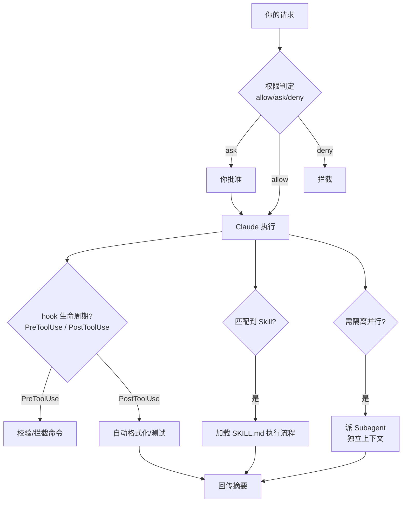

# Claude Code：Anthropic 的终端编码智能体

> 文章来源：综合 Anthropic 官方 Claude Code 文档与博客（含「Steering Claude Code」七种定制方式）整理，截至 2026-08；具体命令与版本以官方文档为准。

Claude Code 是 Anthropic 的 **终端式 agentic coding 助手**：读你的代码库、写代码、跑命令、管 git。它和 Codex 最大的差异不在「能不能干活」，而在**可定制性**——Anthropic 把记忆、审批、技能、子代理、自动化拆成清晰的层，让你把团队规范固化进每一次会话。

## 安装与启动

需要 claude.ai 的 Pro / Max 订阅，或 API Key。

```bash
# 全局安装
npm install -g @anthropic-ai/claude-code

# 在项目目录启动一个交互式会话
claude

# 无头模式（CI / 脚本里一次跑完）
claude -p "为 src/utils 生成 Jest 测试，目标 80% 分支覆盖"

# 只读规划模式（先出方案不执行）
claude --permission-mode plan
```

> **说明**：`claude -p` 的无头模式是把它接进 CI/CD 和定时任务的关键——配合 GitHub Action，可在 issue/PR 里 `@claude` 触发自动化。

## 七种定制行为的方式

官方把「怎么让 Claude 按你的方式工作」拆成七种机制，区别在于**何时加载进上下文、长会话压缩（compaction）后是否保留、占用多少上下文成本**：

| 机制 | 何时加载 | 压缩后保留 | 上下文成本 | 适合 |
|------|----------|-----------|-----------|------|
| `CLAUDE.md`（根） | 会话开始，全程常驻 | 重新读取（记忆化） | 高：每行都吃 token | 构建命令、目录结构、代码规范、团队约定 |
| `CLAUDE.md`（子目录） | 读到该目录文件时按需 | 该目录不被碰就丢失 | 低 | 子目录专属约定 |
| Rules（规则） | 会话开始（用户级）或匹配文件时 | 压缩后重注 | 中 | 特定约束（如所有 API handler 用 Zod 校验） |
| Skills | 名称+描述随会话加载，调用时才加载正文 | 在共享预算内，旧的先丢 | 低 | 流程化工作流（部署/发布清单） |
| Subagents | 被 Agent 工具调用时才加载 | 只回主会话一条摘要 | 低 | 并行/隔离的旁支任务（深度搜索、日志分析） |
| Hooks | 生命周期事件触发 | 绕开压缩 | 低 | 确定性自动化（跑 lint、完成后发 Slack、拦截命令） |
| Output styles | 会话开始注入系统提示 | 永压缩 | 高 | 大幅改变角色（如变通用助手） |

> **重要**：官方建议——把「团队专属规范」从根 `CLAUDE.md` 推进 path-scoped 的 rules，把「流程步骤」推进 skills。根 `CLAUDE.md` 控制在 200 行内、指定 owner、像改代码一样审它的变更，否则在每个会话里白白消耗 token 且稀释真正重要的指令。

## 核心机制一览



> **图题**：一次 Claude Code 请求会依次经过权限判定、hooks 拦截/后置、skill 自动加载、必要时派 subagent——每层独立可控。

## CLAUDE.md：给智能体一份「仓库说明书」

```markdown
# CLAUDE.md（仓库根）
## 构建与测试
- 构建：npm run build
- 测试：npm test
- 单测覆盖率门槛：80%
## 目录约定
- src/ 放源码，lib/ 放内部库，services/ 按域拆分
## 规范
- 所有 API handler 入参用 Zod 校验
- 提交信息遵循 Conventional Commits
```

> **说明**：子目录 `CLAUDE.md`（如 `services/api/CLAUDE.md`）只在 Claude 读到该目录文件时才加载，适合把团队规范「就近放」，不被无关会话加载。monorepo 里可给每个团队目录配自己的 `CLAUDE.md`。

## Skills 与 Subagents：流程 vs 隔离

- **Skill**：把「领域知识 / 工作流纪律」装进当前上下文——比如 TDD 纪律、API 设计标准、错误处理约定。它让 Claude **边写边记规则**。
- **Subagent**：派一个**全新上下文**去干隔离的活——比如代码评审不应看到主会话的半成品、调试代理只读不写。适合并行、需要隔离的任务。

> **经验法则**：想要任务「干净起步、不带前序上下文」→ 用 subagent；想要「记住并贯彻新规则」→ 用 skill。两者如何被 superpowers 这类框架组合，见 [Agent Skills（superpowers 等）](contents/ai/agent-skills.md)；官方仓库见 [obra/superpowers](https://github.com/obra/superpowers)。

## Hooks：用确定性脚本兜底

Hooks 是在 Claude Code 生命周期节点自动跑的脚本（`command` 执行 shell，或 `prompt` 注入提示）。常见生命周期：`SessionStart`、`UserPromptSubmit`、`PreToolUse`、`PostToolUse`、`Stop`、`SubagentStop`、`PreCompact`。

```json
{
  "hooks": {
    "PostToolUse": [
      { "matcher": "Edit|Write", "command": "npx prettier --write $FILE" }
    ]
  }
}
```

> **注意**：`PreToolUse` 是主要的安全闸门——可校验/拦截一条即将执行的命令。`command` 类 hook 以你的操作系统权限运行，接入他人仓库前务必审查其 hook 定义。

## 权限、插件与 MCP

- **权限**：在 `.claude/settings.json` 里用 `allow / ask / deny` 配置，例如 `deny: ["Read(./.env)"]` 禁止读密钥。
- **Plugins**：把 skills + subagents + hooks + MCP 打包成一个可安装单元（`/plugin install`），市场可限制来源。
- **MCP**：接外部工具/数据（Issue 跟踪、数据库、浏览器）。为省上下文，MCP 工具定义默认延迟加载，只用工具名进上下文，用到才展开。
- **Plan Mode**：`Shift+Tab` 两次或 `/plan`，只读提方案、写操作全禁，适合多文件重构与陌生代码库。
- **Checkpoints / 后台任务**：编辑前自动快照（连按 Esc 回退）；`run_in_background` 跑长命令，Claude 轮询结果并推送通知。

## 能力边界与局限

- **重交互**：相比 Codex 云端「派出去睡一觉」，Claude Code 更强调实时陪跑与逐条批准，长任务靠 compaction / checkpoint 管理上下文。
- **订阅门槛**：需 Pro/Max 或 API Key。
- **不是万能**：模型本身不会的活，再多层定制也补不上；产出仍需人工审查。

## 延伸

- 回到总览：[AI 辅助编程总览](contents/ai/ai-assisted-coding.md)
- 异步派活方案：[Codex](contents/ai/codex.md)
- 工程纪律技能库：[Agent Skills（superpowers 等）](contents/ai/agent-skills.md)
- 智能体安全：[AI 安全与防护](contents/ai/ai-safety.md)
