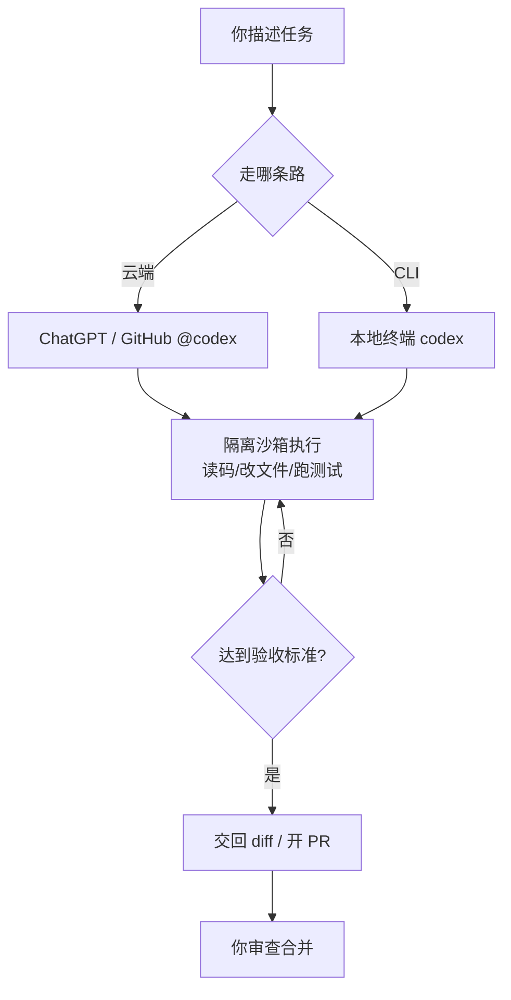

# Codex：OpenAI 的云端编码智能体

> 文章来源：综合 OpenAI 官方 Codex 文档与社区实践整理，截至 2026-08；具体命令、模型与计费以官方文档为准。

Codex 是 OpenAI 的 **agentic coding（智能体式编码）** 工具：你用自然语言描述一个任务，它在隔离环境里读你的代码、改文件、跑命令和测试，最后交回一个 diff 或 PR。它有两种形态——**云端异步 Agent** 与 **开源 CLI**——内核一致，交互方式不同。

> **说明**：Codex 不是聊天助手，也不是单纯的 IDE 插件。CLI 是大多数人的核心用法；云端形态则让你把任务「外包」出去、稍后验收。

## 两种形态

| 形态 | 入口 | 交互 |
|------|------|------|
| 云端 Agent | ChatGPT 内派任务；或 GitHub 评论里 `@codex` | 异步、可并行排队，合上电脑后回来看 diff |
| Codex CLI | `npx @openai/codex`（本地终端） | 交互式会话，源码留本地，命令在沙箱跑 |



> **图题**：Codex 云端与 CLI 殊途同归——都在隔离沙箱里自循环，直到产出可审查的结果。

## 安装与启动（CLI）

环境要求：Node.js 18+（推荐 20/22 LTS）、Git；Windows 建议用 WSL2。

```bash
# 方式一：全局安装后使用
npm install -g @openai/codex
codex --version

# 方式二：免安装直接跑（不想全局装时）
npx @openai/codex

# 首次运行按要求登录 ChatGPT 账号，或配置 API Key
export OPENAI_API_KEY="sk-..."   # 写入 ~/.zshrc / ~/.bashrc 持久化
```

> **注意**：CLI 本身开源免费，但调用需要 **付费 ChatGPT 账号或 OpenAI API Key**。2026-04 起 Codex 改为**按 token 的信用计费**（credit-based），轻任务便宜、重任务贵，不再是固定每条消息收费。

## 三种审批模式

Codex CLI 通过审批模式在「速度」与「可控」之间取舍：

| 模式 | 行为 | 适合 |
|------|------|------|
| `suggest` | 每个改动/命令都先征求你批准 | 生产仓库、探索、学习 |
| `auto-edit` | 自动读写文件，跑 shell 命令前才问 | 重构、批量重复编辑 |
| `full-auto` | 在断网沙箱里自主读/写/执行整套循环 | 隔离分支、原型、修构建 |

```bash
# 一次性指定
codex --approval-mode full-auto "给 Express API 加一个限流中间件，100 次/分钟/IP，超限返回 429 + Retry-After"

# 或在 ~/.codex/config.json 里固化
```

```json
{
  "model": "gpt-4.5",
  "approvalMode": "suggest",
  "notify": true
}
```

## 用 AGENTS.md 给智能体「立规矩」

和 Claude Code 的 `CLAUDE.md` 类似，Codex 读取仓库里的 `AGENTS.md` 作为任务的「常驻简报」：构建命令、测试命令、代码规范、项目特例都写进去。

> **说明**：`AGENTS.md` 支持**级联**——monorepo 里每个子目录可以放自己的 `AGENTS.md`，覆盖根级约定。把「怎么构建/怎么测/什么禁做」写清楚，能显著提升 Codex 一次做对的概率。

```bash
# 仓库根
AGENTS.md
# 子目录级覆盖
services/api/AGENTS.md
```

## 与其它工具的衔接

- **MCP**：Codex 支持 Model Context Protocol，可接外部工具/数据源（数据库、浏览器、Issue 跟踪等）。
- **GitHub 集成**：安装 Codex GitHub App 后，在 issue/PR 评论 `@codex` 即可派活，它会开分支、改代码、跑测试、提 PR。
- **Skills（CLI 式）**：Codex 也能识别并调用以命令行形式提供的 skills，把视频生成、图片、搜索等能力接到能力层。
- 想给编码智能体强加工程纪律（TDD、需求澄清、评审），见 [Agent Skills（superpowers 等）](contents/ai/agent-skills.md)。

## 能力边界与局限

- **最擅长**：边界清晰、可自测的任务（「加端点 + 写测试 + 跑通」）。它对自己的工作能自检（跑测试看是否通过）。
- **不擅长**：需要业务判断、未言明的隐性逻辑、或触碰完全没有测试的代码——这类产出往往方向偏、质量不稳。
- **国内访问**：云端形态需代理；CLI 用 API Key 时同样受网络环境影响。
- **审查不可省**：产出是「待审初稿」，合并前务必逐行读 diff。

> **重要**：把任务描述写清楚——目标是什么、怎么验证算完成。范围越紧、验收标准越明确，Codex 一次做对的概率越高。

## 延伸

- 回到总览：[AI 辅助编程总览](contents/ai/ai-assisted-coding.md)
- 交互式陪跑方案：[Claude Code](contents/ai/claude-code.md)
- 智能体核心机制：[AI Agent](contents/ai/ai-agent.md)
