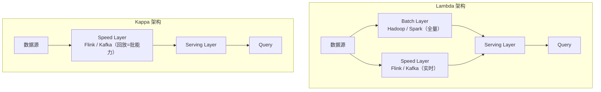
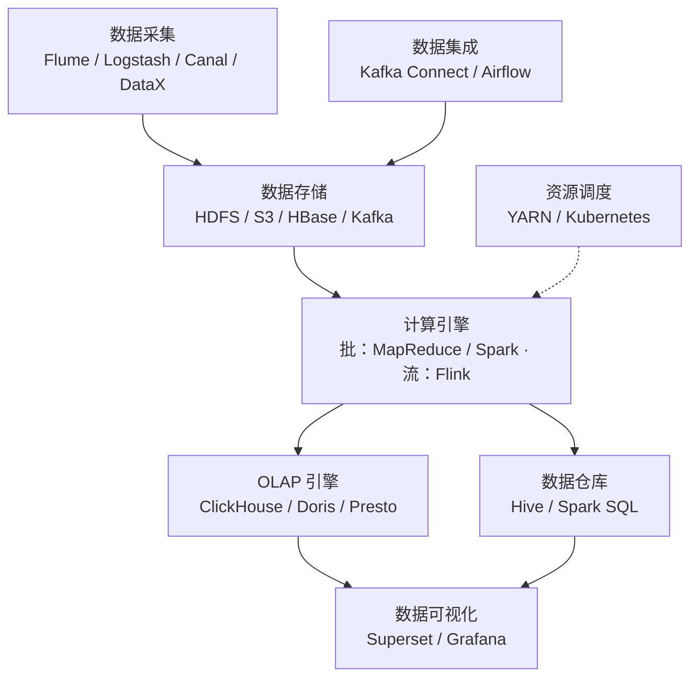

# 大数据基础

## 基本概念

### ADS、DWS、ODPS

1. **ADS（Application Data Service）**
   - **含义**：ADS 主要是应用数据服务层。它是数据应用的直接数据来源，侧重于为具体的业务应用提供数据支持，这些业务应用可能包括报表系统、数据可视化工具、数据分析应用等。ADS 中的数据通常是经过加工和整合，以满足特定业务场景下的数据分析和展示需求。
   - **数据特点**：数据的结构和内容是高度定制化的，根据不同的业务应用而不同。例如，对于一个电商企业的报表系统（属于 ADS 的应用场景），ADS 层的数据可能包含按照不同维度（如时间、地区、产品类别等）汇总的销售数据、用户购买行为数据等，这些数据的格式和聚合方式是为了方便快速生成报表而设计的。
   - **在数据分析中的作用**：它是连接数据分析工具和最终用户的桥梁。数据分析人员通过对 ADS 层数据的查询和分析，为业务决策提供支持。比如，通过分析 ADS 中的销售数据，可以发现哪些产品在特定时间段内销量增长迅速，从而为库存管理和营销决策提供依据。
2. **DWS（Data Warehouse Service）**
   - **含义**：DWS 是数据仓库服务层。它主要是对来自多个数据源的数据进行集成、清洗、转换等操作后，按照主题进行组织和存储的数据仓库。这些主题可以是客户主题、产品主题、销售主题等。数据仓库服务的目的是为了支持企业的决策分析，它整合了企业内部各个业务系统的数据，提供一个统一的数据视图。
   - **数据特点**：数据具有集成性，它将不同数据源的数据整合在一起，消除数据不一致性。例如，企业可能有销售系统、库存系统、客户关系管理系统等多个数据源，DWS 会将这些系统中的相关数据（如销售数据中的客户信息和客户关系管理系统中的客户信息）进行整合，确保数据的准确性和完整性。同时，数据是按照主题进行组织的，以销售主题为例，DWS 中可能包含销售订单数据、销售渠道数据、销售区域数据等相关子主题的数据。
   - **在数据分析中的作用**：为数据分析提供了一个稳定、高质量的数据基础。由于 DWS 对数据进行了清洗和转换，数据分析人员可以更方便地从这个层面获取所需的数据进行复杂的分析，如数据挖掘、趋势分析等。比如，在分析企业销售趋势时，数据分析人员可以从 DWS 中的销售主题数据中获取多年的销售订单数据，通过时间序列分析等方法预测未来的销售趋势。
3. **ODPS（Open Data Processing Service）**
   - **含义**：ODPS 是一种开放的数据处理服务。它提供了大规模数据存储和高效的数据处理能力，能够处理海量的数据。通常用于大数据场景，支持数据的存储、计算和分析等多种操作。
   - **数据特点**：可以处理海量的结构化和非结构化数据。例如，在互联网公司中，ODPS 可以存储和处理用户的日志数据（非结构化数据），这些日志数据包含用户的各种行为信息，如浏览网页的记录、点击广告的记录等。同时，它也可以处理像用户注册信息、订单信息等结构化数据。ODPS 的数据存储具有高扩展性，能够随着数据量的增加而方便地扩展存储容量。
   - **在数据分析中的作用**：为大数据分析提供了强大的计算和存储支持。在面对海量数据时，传统的数据处理工具可能无法满足需求，而 ODPS 可以通过分布式计算等技术快速地对数据进行处理。例如，在进行用户行为分析时，需要对海量的用户日志数据进行分析，ODPS 可以快速地提取、清洗和分析这些数据，帮助企业了解用户的行为模式，从而优化产品和服务。

## 数据仓库分层架构

现代数据仓库通常采用四层架构，自下而上逐层加工：

```
┌─────────────────────────────────┐
│  ADS — 应用数据层（报表/API）    │  ← 面向应用的高度聚合数据
├─────────────────────────────────┤
│  DWS — 数据汇总层（主题宽表）    │  ← 按主题汇总的轻度聚合数据
├─────────────────────────────────┤
│  DWD — 数据明细层（清洗后）      │  ← 标准化、清洗后的明细数据
├─────────────────────────────────┤
│  ODS — 操作数据层（原始数据）    │  ← 原始数据1:1同步，不做处理
└─────────────────────────────────┘
```

| 层级 | 全称 | 职责 | 数据特点 |
| --- | --- | --- | --- |
| **ODS** | Operational Data Store | 原始数据落地，保持与源系统一致 | 未清洗，可能有脏数据、重复数据 |
| **DWD** | Data Warehouse Detail | 数据清洗、标准化、维度退化 | 干净的明细数据，统一格式和编码 |
| **DWS** | Data Warehouse Summary | 按主题域轻度汇总，生成宽表 | 聚合数据，如每日/每用户汇总指标 |
| **ADS** | Application Data Service | 面向具体应用的高度聚合 | 直接服务报表/大屏/API，高度定制 |

**分层的核心价值：**

- **复用性**：ODS/DWD只加工一次，上层多个应用可复用
- **可追溯**：数据血缘清晰，问题可逐层定位
- **解耦**：源系统变更只影响ODS层，不影响上层应用
- **性能**：ADS层预计算，查询响应快

## OLTP vs OLAP

| 特性 | OLTP（联机事务处理） | OLAP（联机分析处理） |
| --- | --- | --- |
| **目的** | 日常业务操作 | 数据分析与决策支持 |
| **数据量** | 单次操作少量数据 | 批量扫描大量数据 |
| **操作类型** | 增删改为主，少量查询 | 查询为主，极少修改 |
| **响应时间** | 毫秒级 | 秒级到分钟级 |
| **并发量** | 高并发（数千/秒） | 低并发（数十/秒） |
| **数据模型** | 关系模型，3NF规范化 | 星型/雪花模型，反范式化 |
| **典型系统** | MySQL、PostgreSQL、Oracle | ClickHouse、Doris、Greenplum |
| **典型场景** | 订单、支付、库存管理 | 报表、BI、数据挖掘 |

**HTAP（Hybrid Transactional/Analytical Processing）**：同时支持OLTP和OLAP的数据库，如TiDB、OceanBase。

## 批处理 vs 流处理

| 特性 | 批处理 | 流处理 |
| --- | --- | --- |
| **数据范围** | 有限数据集（如一天的数据） | 无限数据流 |
| **延迟** | 分钟到小时级 | 毫秒到秒级 |
| **处理方式** | 定时调度，全量处理 | 事件驱动，逐条处理 |
| **吞吐量** | 极高 | 高 |
| **容错** | 失败重跑整个任务 | Checkpoint + 状态恢复 |
| **典型框架** | Hadoop MapReduce、Spark Core | Flink、Kafka Streams、Spark Streaming |
| **典型场景** | T+1报表、离线数据仓库 | 实时监控、实时推荐、风控 |

**Lambda 架构**：批处理层 + 实时层 + 服务层，同时保证准确性和低延迟。

```
Batch Layer (Hadoop/Spark)  ──→  Serving Layer  ──→  Query
                                       ↑
Speed Layer (Flink/Kafka)   ──────────┘
```

**Kappa 架构**：只用流处理，通过回放历史数据实现批处理能力，简化架构。

> **Lambda 与 Kappa 架构对比**：Lambda 双链路保证准确与低延迟，Kappa 仅用流层、靠回放历史获得批能力。



## 大数据技术栈概览

| 层级 | 功能 | 常用组件 |
| --- | --- | --- |
| **数据采集** | 日志收集、数据同步 | Flume、Logstash、Filebeat、Canal、DataX、Sqoop |
| **数据存储** | 分布式存储、列式存储 | HDFS、S3、HBase、Kafka |
| **资源调度** | 集群资源管理 | YARN、Kubernetes |
| **批处理计算** | 离线大数据处理 | Hadoop MapReduce、Spark |
| **流处理计算** | 实时数据处理 | Flink、Kafka Streams、Spark Streaming |
| **OLAP引擎** | 即席查询、多维分析 | ClickHouse、Doris、Presto、Druid、Kylin |
| **数据仓库** | SQL化数据分析 | Hive、Spark SQL |
| **数据集成** | ETL管道 | Kafka Connect、Airflow、DolphinScheduler |
| **数据可视化** | 报表与大屏 | Superset、Metabase、Grafana、FineBI |

> **大数据生态全景图**：采集、存储、调度、计算、OLAP、数仓、集成、可视化各层的常用组件。


