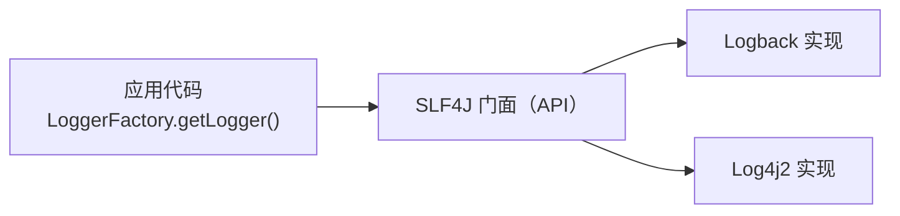
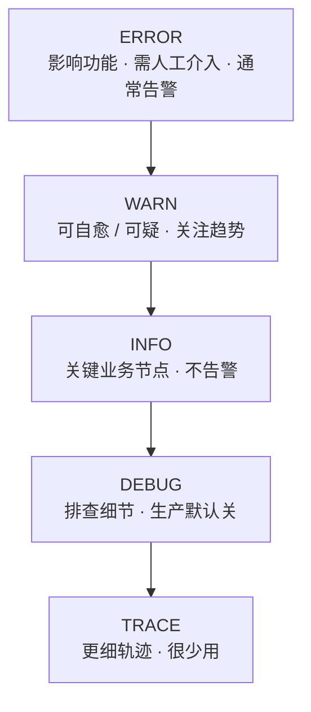
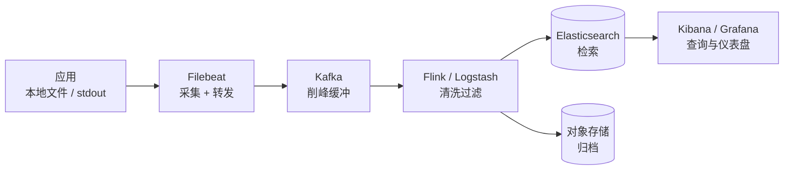

# 日志体系

## 简介

日志是系统可观测性的基础，规范的日志体系对于问题排查、行为审计和系统监控至关重要。一条完整的排查链路通常是：**监控告警发现异常 → 链路追踪定位到服务 → 日志确认现场细节**。

好的日志体系要回答三个问题：**写什么**（规范）、**怎么收**（采集）、**去哪查**（存储检索）。

## 日志框架

### Java 日志演进

Java 日志生态经历了多次迭代，理解演进过程能避免选型混乱：

| 阶段 | 框架 | 说明 |
|------|------|------|
| 早期 | JUL（java.util.logging） | JDK 自带，功能简陋，性能一般 |
| 崛起 | Log4j 1.x | 第一个流行框架，后停止维护且有安全漏洞 |
| 门面时代 | **SLF4J + Logback** | SLF4J 是门面（接口），Logback 是实现，Spring Boot 默认组合 |
| 现状 | Log4j 2 | 异步性能优秀，但 2021 年 Log4Shell 漏洞（CVE-2021-44228）敲响警钟 |

**门面模式（SLF4J）的价值**：代码只依赖 SLF4J 的 API，运行时由绑定器适配到具体实现（Logback/Log4j2），替换日志框架不用改代码。对 JCL、Log4j1 等遗留框架，用 `jcl-over-slf4j`、`log4j-over-slf4j` 等桥接包统一收口。

```java
// 永远面向 SLF4J 编程，不要直接 import logback/log4j 的类
private static final Logger log = LoggerFactory.getLogger(OrderService.class);
```

> **Log4Shell 教训**：Log4j 2 的 JNDI Lookup 特性允许日志内容触发远程类加载（`${jndi:ldap://...}`）。防御手段：升级到修复版本（2.17.1+）、禁用 lookup（`-Dlog4j2.formatMsgNoLookups=true`）、WAF 拦截特征串。

> **SLF4J 门面模式图**：应用代码只依赖 SLF4J 接口，运行期经绑定器适配到 Logback 或 Log4j2 实现，替换框架无需改代码。



### Spring Boot 日志配置

Spring Boot 默认使用 Logback，通过 `application.yml` 即可完成大部分配置：

```yaml
logging:
  level:
    root: info
    com.example.order: debug        # 按包名精细控制
    org.springframework.web: warn
  file:
    name: /var/log/app/order.log    # 不配置则只输出到控制台
  logback:
    rollingpolicy:
      max-file-size: 100MB          # 单文件上限
      max-history: 30               # 保留天数
      total-size-cap: 10GB          # 总量上限
  pattern:
    console: "%d{yyyy-MM-dd HH:mm:ss.SSS} [%thread] [%X{traceId}] %-5level %logger{36} - %msg%n"
```

要点：

- **日志级别按需开**：生产环境 root 用 INFO，DEBUG 只在排查时临时开启（可配合 Actuator 的 `/loggers` 端点在线调整）；
- **异步输出**：高吞吐场景在 logback 配置中用 `AsyncAppender` 包装，避免磁盘 I/O 阻塞业务线程；
- **多环境差异**：开发环境彩色控制台输出，生产环境输出到文件并接入采集。

## 日志规范

### 日志级别

- ERROR / WARN / INFO / DEBUG / TRACE
- 级别选择原则

| 级别 | 使用场景 | 告警关联 |
|------|----------|----------|
| ERROR | 影响功能的异常，需要人工介入（下单失败、外部接口挂了） | 通常触发告警 |
| WARN | 可自愈的异常、可疑情况（重试成功、缓存未命中、参数非法） | 关注趋势 |
| INFO | 关键业务节点（订单创建、支付成功、任务开始/结束） | 不告警 |
| DEBUG | 开发排查细节（方法入参、中间结果） | 生产默认关闭 |
| TRACE | 更细粒度的调用轨迹 | 很少使用 |

**常见错误**：

- 到处 `e.printStackTrace()`（输出到 stderr 无法采集）或 `log.error(e.getMessage())`（丢失堆栈）——正确写法 `log.error("下单失败, orderId={}", id, e)`，**异常对象放最后一个参数**；
- 把可预期的业务校验失败记成 ERROR，导致告警噪音；
- 循环里打 INFO 导致日志洪水。

> **日志级别层次图**：从 ERROR 到 TRACE 严重程度递减，ERROR 通常触发告警，DEBUG/TRACE 生产默认关闭。



### 日志格式

- **结构化日志**：输出 JSON 格式而非拼接字符串，采集后无需正则解析即可按字段检索。

```xml
<!-- logback 输出 JSON（logstash-logback-encoder） -->
<appender name="JSON" class="ch.qos.logback.core.rolling.RollingFileAppender">
    <encoder class="net.logstash.logback.encoder.LogstashEncoder"/>
</appender>
```

```json
{"timestamp":"2026-08-04T10:00:00.123","level":"INFO","logger":"c.e.OrderService","traceId":"a1b2c3","message":"订单创建成功","orderId":"ORDER-1"}
```

- **MDC（Mapped Diagnostic Context）**：基于 ThreadLocal 的上下文容器，把 traceId、userId、requestId 等横切信息注入每一行日志，无需层层传参。

```java
MDC.put("traceId", traceId);
try {
    // 业务逻辑，期间所有日志自动带上 traceId
} finally {
    MDC.clear(); // 必须清理，线程池复用线程时会串数据
}
```

> 注意：MDC 基于 ThreadLocal，**跨线程（线程池、异步任务）会丢失**，需要手动传递或使用 TTL（TransmittableThreadLocal）、MDCContext 装饰器。

### 日志内容

- **关键信息记录**：日志要能还原现场——谁（userId）、什么时候、做了什么（业务动作）、对象是谁（订单号等唯一键）、结果如何（成功/失败码）。入口出口打摘要，关键分支打状态；
- **敏感信息脱敏**：手机号、身份证、银行卡、密码、Token 等必须脱敏（如 `138****1234`），统一用脱敏工具类或 Logback 的 `MessageConverter` 扩展，避免各自为战；
- **异常日志规范**：异常要记录完整堆栈 + 业务上下文（哪个订单、哪个用户），只记 `e.getMessage()` 经常无法定位；捕获后不处理又不记录（"吃掉异常"）是最危险的反模式。

## 日志采集

日志产生在应用本地文件，需要采集组件统一输送到存储层。

### Filebeat

Elastic 官方的轻量级日志采集器，ELK 生态标配：

- **原理**：监控日志文件（inotify/轮询），逐行读取发送到 Logstash / Elasticsearch / Kafka；记录 offset 支持断点续传；
- **优点**：Go 编写，资源占用极小（几十 MB 内存），部署简单，可靠性好；
- **定位**：只做"采集 + 转发"，复杂解析交给 Logstash 或下游完成。

```yaml
# filebeat.yml
filebeat.inputs:
  - type: log
    paths: ["/var/log/app/*.log"]
    json.keys_under_root: true   # 结构化日志直接展开字段
output.kafka:
  hosts: ["kafka:9092"]
  topic: "app-logs"
```

### Flume

Apache 的分布式日志采集系统，Hadoop 生态出身：

- **架构**：Source（数据源，如 tail 文件、Syslog、Kafka）→ Channel（缓冲，内存或文件）→ Sink（输出，如 HDFS、Kafka、HBase），多级 Agent 可串联；
- **优点**：管道灵活、吞吐量高、可直写 HDFS，适合大数据离线分析场景；
- **缺点**：JVM 实现资源占用大，配置繁琐，在 ELK 主导的在线排查场景已较少使用。

> 典型采集链路：**应用 → Filebeat → Kafka（削峰缓冲）→ Flink/Logstash（清洗）→ Elasticsearch（检索）/ 对象存储（归档）**。

> **日志采集到查询链路图**：日志从应用经采集、缓冲、清洗，最终落 Elasticsearch 供检索或对象存储归档，再由 Kibana/Grafana 查询。



## 日志存储与检索

### ELK Stack

ELK 是最主流的日志平台，三个组件各司其职：

| 组件 | 职责 |
|------|------|
| **Elasticsearch** | 存储与全文检索，按索引分片支持海量数据 |
| **Logstash** | 数据管道：解析、过滤、字段加工（grok 正则、geoip 等） |
| **Kibana** | 可视化查询与仪表盘 |

- **优点**：全文检索能力强、查询灵活、生态成熟；
- **缺点**：资源消耗大（ES 索引膨胀快，存储成本高）、运维复杂（分片规划、冷热分离、滚动索引）；
- **实践**：按天/按月建索引 + ILM 生命周期策略（热数据 SSD、冷数据 HDD、过期自动删除）；查询必须带时间范围，避免全量扫描。

### Loki

Grafana Labs 推出的日志系统，设计哲学是"**像 Prometheus，但用于日志**"：

- **核心思想**：**只索引标签（labels），不索引日志全文**。日志按 `{app="order", env="prod"}` 等标签组织，查询时先按标签选流，再在小范围内做正则过滤；
- **优点**：索引极小导致**存储和运维成本远低于 ELK**，与 Grafana、Prometheus 无缝联动（日志 ↔ 指标 ↔ 链路互相跳转）；
- **缺点**：不支持复杂全文检索，大范围内 grep 较慢；
- **配套**：采集端用 Promtail / Grafana Alloy，查询语言为 LogQL；
- **选型**：日志量中小、已使用 Grafana 体系、以标签化排查为主的团队优先选 Loki；重检索、合规审计场景选 ELK。

## 日志分析

### 常见日志分析场景

- **异常检测**：统计 ERROR 数量突增、出现从未见过的新异常类型；
- **性能分析**：从日志提取接口耗时分布，找出慢请求与慢 SQL；
- **业务统计**：从关键业务日志统计下单量、支付成功率（注意与埋点指标区分，日志统计实时性差）；
- **安全审计**：登录失败、越权访问、敏感操作留痕，满足等保合规要求；
- **容量规划**：日志增长趋势辅助评估存储与带宽容量。

### 日志告警

日志告警是指标告警的补充，适合"出现即异常"的场景：

- **实现方式**：ELK 的 ElastAlert / Watcher，Loki 的 Ruler，或通用方案（Filebeat → Kafka → Flink 实时统计 → 告警）；
- **规则示例**：1 分钟内 `ERROR and "支付回调"` 超过 5 条；某异常关键字首次出现；某关键日志（如"心跳"）长时间缺失；
- **原则**：日志告警宁缺毋滥，只对**明确需要人介入**的模式告警，否则很快被淹没在噪音里（告警治理见《可观测性》）。

## 最佳实践

### 日志聚合与链路追踪

- 单机日志只能看单点，排查跨服务问题必须把日志**集中到统一平台**并按 traceId 串联；
- 落地路径：接入分布式追踪（SkyWalking / OpenTelemetry）拿到 traceId → 写入 MDC → 日志采集后在 Kibana/Loki 中按 traceId 一键聚合整条链路的日志；
- 入口层统一生成 traceId（网关或第一个服务），避免链路断裂；异步任务、MQ 消费要主动透传。

### 日志轮转与归档

- **必须轮转**：按大小（如 100MB）+ 按天滚动，防止单文件撑爆磁盘；
- **限额兜底**：设置保留天数（如 30 天）和总量上限（`total-size-cap`），防止日志挤占业务磁盘；
- **分级归档**：在线保留 7~30 天供检索，之后压缩转对象存储冷归档，满足审计合规（常要求留存 6 个月以上）；
- **日志目录与业务数据目录分离**，避免互相影响。

### 日志与容器化

容器环境日志实践与虚拟机时代有明显差异：

- **输出到 stdout/stderr**：容器内应用日志直接输出到标准输出，由容器运行时收集（Docker 的 json-file、K8s 的容器日志文件），不在容器里写本地文件（容器销毁日志即丢失）；
- **节点级采集**：Filebeat / Fluent Bit 以 DaemonSet 部署，采集每个节点的 `/var/log/containers/*`，日志自动带上 Pod、Namespace 标签；
- **防日志打爆节点**：配置容器运行时日志上限（`containerLogMaxSize` / `max-size` + `max-file`）；
- **注意**：stdout 采集是逐行读取，**多行堆栈**要配置 multiline 合并规则，否则一条异常被拆散。
