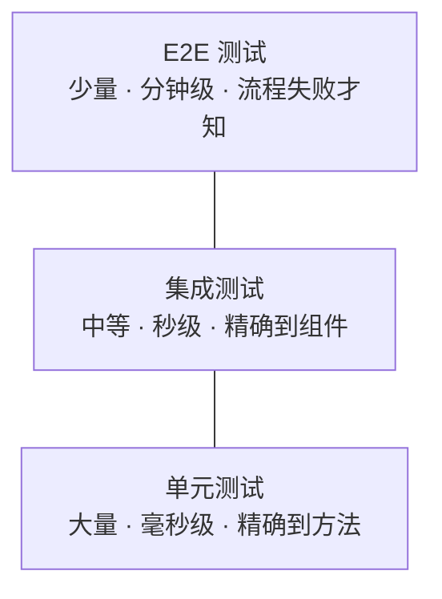
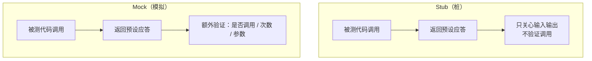
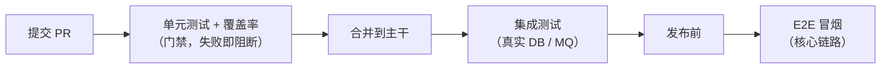

# 测试

## 简介

软件测试是保障代码质量的重要手段，合理的测试策略能显著提高开发效率和系统稳定性。测试的价值不仅在于发现 bug，更在于：

- **安全网**：重构和升级时敢于动手，测试能快速暴露回归问题；
- **活文档**：测试用例描述了代码的预期行为，比注释更不容易过时；
- **设计反馈**：难以测试的代码往往意味着耦合过重，测试倒逼更好的设计。

## 测试分类

### 单元测试

对最小可测试单元（通常是方法或类）进行验证，**不依赖外部系统**（数据库、网络、文件系统），运行快、数量最多。

Java 生态主流工具：

- **JUnit 5**：单元测试框架标准，`@Test`、`@BeforeEach`、`@DisplayName`、参数化测试 `@ParameterizedTest`；
- **AssertJ**：流式断言库，`assertThat(result).hasSize(3).contains("a")`，比 JUnit 原生断言可读性更好；
- **Mockito**：Mock 依赖对象（见后文 Mock 与 Stub 一节）。

```java
class OrderServiceTest {

    private OrderService orderService;
    private OrderRepository repository;

    @BeforeEach
    void setUp() {
        repository = mock(OrderRepository.class);
        orderService = new OrderService(repository);
    }

    @Test
    @DisplayName("库存不足时下单应抛出异常")
    void shouldThrowWhenStockNotEnough() {
        when(repository.getStock(1L)).thenReturn(0);

        assertThatThrownBy(() -> orderService.placeOrder(1L, 5))
                .isInstanceOf(StockNotEnoughException.class);
    }
}
```

**测试覆盖率**：常用指标有行覆盖率、分支覆盖率，一般以 70%~80% 为参考线。注意**覆盖率是下限不是目标**——100% 行覆盖也可能缺少关键断言；核心路径（金额计算、状态机）要求高覆盖，纯 getter/setter 不必强求。

### 集成测试

验证多个组件协作是否正确，会**真实依赖**数据库、缓存、消息队列等外部组件：

- **Spring Boot Test**：`@SpringBootTest` 启动完整上下文做端到端验证；`@WebMvcTest` 只加载 Web 层配合 MockMvc 测试 Controller；`@DataJpaTest` 只测试 JPA 层。

```java
@SpringBootTest
@AutoConfigureMockMvc
class UserControllerIntegrationTest {

    @Autowired
    private MockMvc mockMvc;

    @Test
    void shouldReturnUser() throws Exception {
        mockMvc.perform(get("/api/users/1"))
                .andExpect(status().isOk())
                .andExpect(jsonPath("$.name").value("张三"));
    }
}
```

- **Testcontainers**：用 Docker 容器启动真实的 MySQL、Redis、Kafka 等做测试，环境一致性好，避免 H2 内存库与生产行为不一致的问题。

```java
@Testcontainers
class UserRepositoryTest {

    @Container
    static MySQLContainer<?> mysql = new MySQLContainer<>("mysql:8.0");

    @DynamicPropertySource
    static void props(DynamicPropertyRegistry registry) {
        registry.add("spring.datasource.url", mysql::getJdbcUrl);
    }
}
```

### 端到端测试

E2E（End-to-End）测试站在**用户视角**，通过 UI 或完整 API 链路验证整个系统的业务流程，如"注册 → 下单 → 支付 → 查询订单"。

- 工具：Web 端用 Selenium / Playwright / Cypress，接口层用 REST Assured；
- **特点**：最接近真实场景，但运行慢（分钟级）、环境脆弱（依赖所有下游服务）、维护成本高；
- **策略**：只覆盖最核心的业务主链路（冒烟用例），不追求数量，通常部署在独立测试环境定时执行或发布前执行。

## 测试金字塔

测试金字塔（Mike Cohn 提出）描述了各层测试的数量与比例关系：

```
        /  E2E  \        少量：核心业务链路
       / 集成测试 \       适量：组件协作、关键流程
      /  单元测试   \     大量：逻辑分支、边界条件
```

| 层级 | 数量 | 速度 | 定位问题能力 | 依赖 |
|------|------|------|--------------|------|
| 单元测试 | 最多 | 毫秒级 | 精确到方法 | 无 |
| 集成测试 | 中等 | 秒级 | 精确到组件 | DB / MQ 等 |
| E2E 测试 | 最少 | 分钟级 | 只知道流程失败 | 全链路环境 |

**反模式：冰淇淋甜筒**——E2E 测试最多、单元测试最少。表面覆盖全面，实际反馈慢、维护成本高、失败原因难定位。越往下层，测试越便宜、越快、越稳定，应把问题尽量在低层拦截。

> **测试金字塔比例图**：底层单元测试数量最多、最快最稳，越往上（集成、E2E）数量越少、越慢越脆弱。



## Mock 与 Stub

测试中需要替换真实依赖的替身对象，统称 Test Double，常见两类：

- **Stub（桩）**：为被测代码提供**预设的应答**，只关心"给什么输入返回什么"，不验证调用行为；
- **Mock（模拟）**：除了提供应答，还**验证交互**——某方法是否被调用、调用了几次、参数是什么。

> 经验法则：**多用 Stub，少验证 Mock 交互**。过度验证调用细节会让测试与实现耦合（见"常见反模式"）。

> **Stub 与 Mock 区别图**：Stub 只提供预设应答，Mock 在应答之外还验证调用行为（是否调用、次数、参数）。



### Mockito

Java 生态最流行的 Mock 框架：

```java
// 创建 mock
PaymentClient client = mock(PaymentClient.class);

// 打桩（Stub）：指定行为
when(client.charge(any(), eq(100))).thenReturn(PaymentResult.success("TX-001"));
when(client.charge(any(), intThat(i -> i < 0)))
        .thenThrow(new IllegalArgumentException("金额必须为正"));

// 使用被测对象执行逻辑...

// 验证交互（Mock）
verify(client, times(1)).charge(any(), eq(100));
verify(client, never()).refund(any());

// 捕获参数做进一步断言
ArgumentCaptor<PaymentRequest> captor = ArgumentCaptor.forClass(PaymentRequest.class);
verify(client).charge(captor.capture(), eq(100));
assertThat(captor.getValue().getOrderId()).isEqualTo("ORDER-1");
```

**注意事项**：

- 只 Mock **接口或外部依赖**，不要 Mock 值对象（VO/DTO）和自己的被测类；
- Mockito 5+ 基于 Mockito inline mockmaker，支持 Mock final 类和静态方法（`mockStatic`）；
- Spring 集成：`@MockBean` 注入容器替身、`@SpyBean` 部分 Mock 真实对象。

### WireMock

用于 Mock **HTTP 外部服务**（第三方 API、下游微服务），以独立进程或 JUnit 扩展方式运行一个假的 HTTP Server：

```java
@WireMockTest(httpPort = 8089)
class PayGatewayTest {

    @Test
    void shouldHandlePayCallback() {
        stubFor(post(urlEqualTo("/api/pay/callback"))
                .willReturn(okJson("{\"code\":0,\"msg\":\"success\"}")));

        PayResult result = payGateway.callback("ORDER-1");

        assertThat(result.isSuccess()).isTrue();
        // 验证请求确实发出且参数正确
        verify(postRequestedFor(urlEqualTo("/api/pay/callback"))
                .withRequestBody(containing("ORDER-1")));
    }
}
```

适用场景：对接第三方支付、短信网关等无法在测试环境随意调用的外部接口；配合契约测试（Spring Cloud Contract）还可以保证上下游接口定义一致。

## 测试实践

### 测试命名规范

测试方法名应描述**场景 + 预期**，读测试列表就像读需求文档：

```java
// 推荐：should + 预期 + when + 条件
void shouldThrowException_whenStockNotEnough()
void shouldReturnDiscountPrice_whenUserIsVip()

// 不推荐：无信息量
void test1()
void testOrder()
```

配合 `@DisplayName("库存不足时下单应抛出异常")` 可以让报告输出中文描述。类命名约定：被测类名 + `Test`（单元）/ `IntegrationTest`（集成），便于构建工具分类执行。

### Given-When-Then 模式

来自 BDD 的测试结构约定，让每个测试意图清晰：

```java
@Test
void shouldCalculateDiscount() {
    // Given：准备前置条件和数据
    User vipUser = new User(Level.VIP);
    Order order = new Order(vipUser, price(100));

    // When：执行被测行为（只执行一个动作）
    Money result = pricingService.calculate(order);

    // Then：验证结果
    assertThat(result).isEqualTo(price(80));
}
```

- 一个测试只验证**一个行为点**，Given/When/Then 任一段膨胀说明该拆分了；
- 遵循 **AAA 模式**（Arrange-Act-Assert）是同一思想的另一种表述。

### 测试数据管理

| 策略 | 做法 | 适用 |
|------|------|------|
| 测试内构造 | 用 Builder/工厂方法在测试里 new 数据 | 单元测试首选 |
| 测试夹具（Fixture） | 抽取公共的对象工厂 `UserFixture.aVipUser()` | 数据重复时 |
| 数据隔离 | 每个测试用 `@Transactional` 回滚或 `@Sql` 清理 | 集成测试 |
| 外部文件 | JSON/CSV/SQL 脚本加载 | 大数据量场景 |

原则：**测试之间不共享可变状态、不依赖执行顺序**；避免依赖"上一个测试插入的数据"，否则单跑某个用例会失败。

### 测试与 CI/CD

- **提交门禁**：单元测试 + 覆盖率检查纳入 PR 合并条件，失败即阻断；
- **分层执行**：提交时只跑单元测试（秒级反馈）；合并后跑集成测试；发布前跑 E2E 冒烟；
- **失败快速定位**：测试报告（JUnit XML + Allure/Surefire）挂到流水线，失败用例附日志与截图；
- **禁止跳过失败用例换绿灯**：不稳定测试要么修复要么隔离到单独任务跟踪，不能 `@Disabled` 了事。

> **CI 中的测试阶段划分图**：提交门禁跑单元、合并后跑集成、发布前跑 E2E 冒烟，分层获取反馈速度。



## 性能测试

验证系统在高负载下的吞吐量、延迟和资源表现，通常在准生产环境进行。

### JMeter

Apache 开源的老牌压测工具，GUI 配置为主：

- 概念：**线程组**（模拟并发用户数与加压节奏）→ **取样器**（HTTP 请求等）→ **断言** → **监听器**（聚合报告）；
- 支持参数化（CSV 数据驱动）、关联（提取上次响应作为下次入参）、分布式压测；
- 命令行模式（`jmeter -n -t plan.jmx`）适合 CI 集成，避免 GUI 自身消耗影响结果。

### Gatling

基于 Scala/Netty 的代码化压测工具，用少量线程模拟海量并发，报告精美：

```java
public class OrderSimulation extends Simulation {
    {
        setUp(
            scenario("下单")
                .exec(http("create-order")
                    .post("/api/orders")
                    .body(StringBody("{\"skuId\":1}"))
                    .check(status().is(200)))
                .injectOpen(rampUsers(500).during(60)) // 60 秒内爬升到 500 并发
        ).protocols(http.baseUrl("http://localhost:8080"));
    }
}
```

同类工具还有 Locust（Python 编写脚本）、wrk / ab（简单的 HTTP 基准压测）。

### 压测指标

| 指标 | 含义 | 关注点 |
|------|------|--------|
| QPS / TPS | 每秒查询数 / 事务数 | 吞吐量上限 |
| RT（响应时间） | 请求耗时 | 看 **P95/P99** 而非平均值，均值会掩盖长尾 |
| 并发数 | 同时在处理的请求数 | 与 QPS 关系：并发 ≈ QPS × RT |
| 错误率 | 失败请求占比 | 加压到错误率突增的拐点即系统瓶颈 |
| 资源水位 | CPU / 内存 / GC / 连接池 | 定位瓶颈在 CPU 密集还是 I/O 等待 |

**压测方法**：梯度加压找到拐点 → 稳定性压测（目标水位持续运行数小时观察内存泄漏）→ 容量规划（按峰值流量 × 冗余系数反推实例数）。

## 常见反模式

### 过度 Mock

把被测对象的所有协作者都 Mock 掉，断言全是 `verify(xxx).method()`：

- **问题**：测试实际上在"复读实现"——验证了调用链而不是行为，重构内部实现就大面积挂掉；
- **改进**：只 Mock 外部边界（RPC、DB、MQ），对纯逻辑协作者用真实对象；断言优先验证**返回值和可观察状态**。

### 测试与实现耦合

测试直接依赖实现细节：断言私有方法调用顺序、Mock 内部工具类、依赖特定 SQL 语句：

- **问题**：实现一换写法测试就失败，但功能其实没变——测试不再是安全网而是重构阻力；
- **改进**：从**行为和契约**角度写测试（输入 → 输出），通过公共接口验证，实现细节不进入断言。

### 脆弱测试

测试时绿时红，重跑就好：

- 常见根源：依赖系统时间 / 当前日期、依赖执行顺序、并发竞争、异步未完成就断言、依赖外部环境（真实网络、真实时钟）；
- **改进**：时间用注入的 Clock、异步用 Awaitility 等待、随机数据用固定种子；脆弱测试必须修，**习惯性的"重跑一下"会掩盖真实缺陷**。
