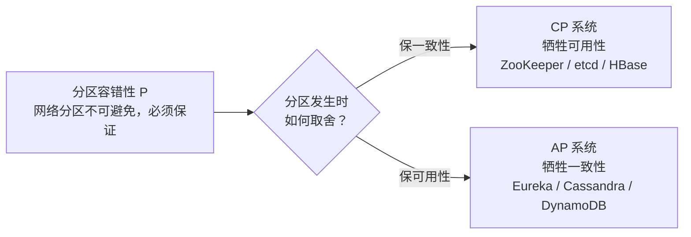

# 分布式系统基础概念

## 简介

分布式系统是多台独立计算机通过网络协同工作的系统，其核心挑战在于如何处理部分失败、网络延迟和一致性等问题。与单机系统不同，分布式系统中**局部失败是常态**：网络会抖动、节点会宕机、时钟会漂移，所有设计都必须围绕"如何在不可靠的基础设施上构建可靠的服务"展开。

## 核心理论

### CAP 定理

CAP 定理指出，一个分布式系统不可能同时满足以下三个特性，**最多只能同时满足其中两个**：

- 一致性（Consistency）：所有节点在同一时刻看到的数据相同
- 可用性（Availability）：每个请求都能在合理时间内得到非错误响应
- 分区容错性（Partition Tolerance）：网络分区发生时系统仍能继续工作

由于分布式系统中网络分区不可避免（P 必须保证），实际选择是在 **CP 与 AP 之间权衡**：

| 类型 | 含义 | 典型代表 |
|------|------|----------|
| CP | 分区发生时牺牲可用性保一致性 | ZooKeeper、etcd、HBase |
| AP | 分区发生时牺牲一致性保可用性 | Eureka、Cassandra、DynamoDB |
| CA | 不存在分区（单机数据库的理论上情况） | 单机 MySQL（严格说不属于分布式系统） |

> **常见误解**：CAP 不是"三选二后永远放弃第三个"。在没有发生分区的正常运行期，系统完全可以同时提供一致性和可用性；CAP 描述的是**分区发生时的取舍策略**。

> **CAP 取舍关系图**：网络分区不可避免（P 必选），实际只能在 CP 与 AP 之间权衡。



### BASE 理论

BASE 是对 CAP 中 AP 方案的延伸，是对大规模互联网系统实践经验的总结：

- **基本可用（Basically Available）**：出现故障时允许损失部分可用性，如响应时间变长、功能降级（非核心功能暂时不可用）；
- **软状态（Soft State）**：允许系统存在中间状态，即不同节点间的数据副本允许暂时不一致；
- **最终一致性（Eventual Consistency）**：经过一段时间后，所有节点的数据最终会达成一致。

BASE 不是 ACID 的对立面，而是对 ACID 中强一致性的妥协——**以最终一致性换取可用性和扩展性**。

### PACELC 定理

CAP 只描述了分区发生时的选择，PACELC 对其做了补充：

- **如果发生分区（P）**，在可用性（A）和一致性（C）之间选择 —— 即 CAP；
- **否则（E，Else）**，在正常运行时，在延迟（L，Latency）和一致性（C）之间选择。

即：**PA/PC 描述分区时的行为，EL/EC 描述正常时的行为**。例如：

| 系统 | PACELC 分类 | 说明 |
|------|-------------|------|
| DynamoDB | PA/EL | 分区时保可用，正常时保低延迟 |
| MongoDB | PC/EC | 始终优先一致性 |
| Cassandra | PA/EL | 典型 AP 系统 |

## 一致性模型

一致性模型描述了读写操作在分布式系统中的可见性保证，从弱到强大致排列：

### 强一致性

写入完成后，任何后续的读操作都能读到最新值。对调用方而言系统就像只有一个数据副本。

- 用户体验最好，但实现代价高：需要多副本同步确认，延迟和可用性都会受损；
- 典型实现：分布式锁保护的单点写、Paxos/Raft 多数派写入。

### 最终一致性

不保证读到最新值，但保证**在没有新写入的情况下，所有副本最终会收敛到同一值**。实际系统中最常见，可细分为：

- **读己之写（Read-your-writes）**：用户自己能立即看到自己的修改；
- **单调读（Monotonic Reads）**：不会读到比之前更旧的数据；
- **会话一致性**：在同一会话内保证读己之写和单调读。

### 因果一致性

有因果关系的操作保证按顺序可见，无因果关系的操作允许乱序。例如：A 发帖 → B 回复，所有人都必须先看到帖子再看到回复；但两条无关的帖子谁先可见无所谓。

因果一致性弱于强一致性、强于最终一致性，是**在保证语义正确的前提下性能最优**的一致性级别。

### 线性一致性

又称原子一致性，是最强的一致性模型：所有操作看起来像是在**一条全局时间线上原子地顺序执行**，且与真实物理时间顺序一致。

| 一致性模型 | 强度 | 典型场景 |
|-----------|------|----------|
| 线性一致性 | 最强 | 分布式锁、Leader 选举 |
| 顺序一致性 | 较强 | 只保证全局顺序，不要求与物理时间一致 |
| 因果一致性 | 中等 | 社交动态、评论系统 |
| 最终一致性 | 最弱 | DNS、缓存、异步复制 |

> 注意区分：**线性一致性（Linearizability）** 关注数据可见顺序，**可串行化（Serializability）** 是数据库事务隔离级别，二者属于不同维度，组合起来即"严格可串行化（Strict Serializability）"。

> **一致性模型强度阶梯**：从最强到最弱，分布式一致性保证逐级放宽。


## 分布式 ID

分布式系统中需要全局唯一 ID 来标识订单、消息、日志等对象，常见方案对比：

| 方案 | 优点 | 缺点 |
|------|------|------|
| UUID | 本地生成、无中心依赖 | 无序（索引性能差）、占用 128 位 |
| 数据库自增 | 简单、趋势递增 | 单点瓶颈、扩展性差 |
| 雪花算法 | 趋势递增、高性能、可扩展 | 依赖时钟，时钟回拨需处理 |
| Leaf | 工程化完善 | 引入额外服务依赖 |

### UUID

```java
String id = UUID.randomUUID().toString(); // 如 3f2b8c1a-9d4e-4f5a-8b7c-1d2e3f4a5b6c
```

- 128 位，由时间戳、节点 ID、随机数等构成，理论上碰撞概率极低；
- **缺点**：完全无序，作为 MySQL InnoDB 主键会导致频繁的页分裂和随机 I/O；字符串形式占 36 字节，不利于存储和传输。

### 雪花算法（Snowflake）

Twitter 开源的分布式 ID 方案，生成 **64 位长整型** ID：

```
| 1 bit 符号位 | 41 bit 时间戳 | 10 bit 机器 ID | 12 bit 序列号 |
```

- **41 位时间戳**：毫秒级，可用约 69 年；
- **10 位机器 ID**：最多部署 1024 个节点；
- **12 位序列号**：同一毫秒内每节点可生成 4096 个 ID。

**优点**：趋势递增（对数据库索引友好）、本地生成无中心依赖、单机每毫秒 4096 个性能极高。

**缺点**：依赖系统时钟，**时钟回拨**（NTP 同步导致）可能生成重复 ID，需要检测并处理（等待、抛异常或使用扩展位）。

### 数据库自增

利用数据库的自增主键生成 ID：

- 单库方案简单但有单点瓶颈；
- **号段模式**：应用每次从数据库批量取一段 ID（如一次取 1000 个）缓存在内存中，用完再取，大幅降低数据库压力；
- **多主实例**：设置不同的初始值和步长（实例 A 生成奇数，实例 B 生成偶数），避免冲突。

### Leaf

美团开源的分布式 ID 生成服务，同时提供两种模式：

- **Leaf-segment（号段模式）**：数据库号段 + 双 Buffer 预加载，避免取号段时阻塞；
- **Leaf-snowflake**：雪花算法 + ZooKeeper 分配机器 ID，解决 workerId 手工配置和时钟回拨检测问题。

## 分布式锁

分布式系统中多个进程互斥访问共享资源时，JDK 的 synchronized / ReentrantLock 失效，需要分布式锁。三种主流实现：

### 基于数据库

利用数据库的唯一约束或行锁实现：

```sql
-- 方式一：唯一索引，插入成功即获锁
INSERT INTO distributed_lock(lock_key) VALUES ('order_lock');
-- 方式二：SELECT ... FOR UPDATE 行锁
SELECT * FROM distributed_lock WHERE lock_key = 'order_lock' FOR UPDATE;
```

- **优点**：实现简单，无需额外组件；
- **缺点**：性能差、锁无法自动过期（需自己实现超时删除）、数据库成为瓶颈；
- 一般只用于并发量低、对性能不敏感的场景。

### 基于 Redis（Redlock）

最常用的方案，基于 Redis 的原子命令：

```bash
# 加锁：key 不存在时设置，value 为唯一标识，10 秒过期
SET lock_key unique_value NX PX 10000
# 解锁：Lua 脚本保证"判断 + 删除"原子性，防止误删别人的锁
if redis.call("get", KEYS[1]) == ARGV[1] then
    return redis.call("del", KEYS[1])
end
```

**要点**：

- `NX` 保证互斥，过期时间防止持有者宕机后死锁；
- value 使用唯一标识，解锁时校验，防止 A 的锁过期后被 B 持有、A 误删 B 的锁；
- 业务执行时间可能超过锁过期时间，可用 **Redisson 看门狗（WatchDog）** 自动续期；
- **Redlock**：Redis 主从切换时锁可能丢失，Redlock 算法要求在 N 个独立 Redis 实例上同时加锁成功才算获锁，但其正确性存在争议（Martin Kleppmann vs Antirez 之争）；
- 生产实践建议：高正确性要求用 ZooKeeper/etcd，追求性能用 Redis 单实例 + 可接受极端情况下的小概率重复。

### 基于 ZooKeeper

利用 ZK 的**临时顺序节点**实现：

1. 在锁路径下创建临时顺序节点，如 `/lock/node_0001`；
2. 判断自己是否是最小节点：是则获锁，否则 **watch 前一个节点**（避免羊群效应）；
3. 前一个节点删除（释放锁或会话断开）时收到通知，重新判断；
4. 业务完成后删除自己的节点释放锁。

- **优点**：无死锁问题（临时节点随会话自动删除）、可靠性高；
- **缺点**：频繁创建删除节点，性能低于 Redis；
- 适合**对正确性要求高、加锁频率低**的场景。

### 基于 etcd

利用 etcd 的 **Lease（租约）+ Revision 全局递增** 机制：

1. 创建 Lease 并注册 KeepAlive 心跳续约；
2. 将带 Lease 的 Key 写入 etcd，利用 Revision 判断获锁顺序；
3. 未获锁者 watch 前一个 Revision；
4. 宕机时 Lease 过期，锁自动释放。

官方提供 concurrency 包封装，Kubernetes 生态广泛使用。

**四种方案对比**：

| 维度 | 数据库 | Redis | ZooKeeper | etcd |
|------|--------|-------|-----------|------|
| 性能 | 低 | 高 | 中 | 中 |
| 可靠性 | 中 | 中（主从切换有风险） | 高 | 高 |
| 实现复杂度 | 低 | 中 | 中 | 中（有官方库） |
| 典型场景 | 低频简单场景 | 高并发互联网场景 | 强正确性场景 | K8s 生态 |

## 分布式时钟

分布式系统中各节点的本地时钟并不一致，时钟问题是很多诡异 bug 的根源。

### 物理时钟与 NTP

- 各节点依赖各自的硬件时钟（晶振），存在**时钟漂移**，每天可能偏差几秒；
- **NTP（网络时间同步协议）**：定期与时间服务器同步校准，精度通常在毫秒级；
- 工程上的坑：**时钟回拨**（NTP 校准、虚拟机迁移导致）会使雪花 ID 重复、基于时间戳的判断失效；云环境可考虑 AWS TrueTime、Google Spanner 的 GPS + 原子钟方案（误差控制在几毫秒内并用"不确定区间"表达）。

### 逻辑时钟（Lamport）

物理时钟无法精确排序分布式事件，Lamport 提出用**逻辑计数器**定义事件的先后：

1. 每个进程维护一个计数器，本地事件发生时 +1；
2. 发送消息时携带当前计数器，接收方取 `max(本地计数器, 消息计数器) + 1`；
3. 若事件 a 因果先于事件 b，则 a 的时间戳一定小于 b。

**局限**：时间戳小不代表因果在先（可能只是并发），即**只能判断"必然有序"，不能判断"是否并发"**。

### 向量时钟

向量时钟是 Lamport 时钟的增强，**可以识别并发事件**：每个进程维护一个长度为 N 的向量（N 为进程数），记录自己对每个进程时钟的认知。

- 比较两个向量：若 A 的每个分量都 ≤ B 且至少一个 <，则 A 因果先于 B；
- 若两个向量互不包含，则两个事件**并发**；
- 代价是向量大小随节点数增长，Dynamo 等系统曾用它检测版本冲突。

## 分布式共识

共识算法解决的是"多个节点如何就某个值达成一致"的问题，是分布式系统的基石。

### Paxos

Leslie Lamport 提出的经典共识算法，通过**提案（Proposal）+ 多数派（Quorum）** 机制保证一致性：

- 角色分为 Proposer（提案者）、Acceptor（接受者）、Learner（学习者）；
- 分为 Prepare 和 Accept 两阶段：提案需获得多数派 Acceptors 接受才能被选定；
- 保证**安全性**（不会选出两个不同的值），活性依赖各种优化；
- 以难以理解和实现著称，工程上多使用其变体：Multi-Paxos、Fast Paxos。

### Raft

为**可理解性**而设计的共识算法，功能等价于 Multi-Paxos，目前是主流选择（etcd、Consul、TiKV 都基于 Raft）：

- 节点分为三种角色：**Leader**（唯一处理写入）、**Follower**（被动响应）、**Candidate**（发起选举）；
- **Leader 选举**：Follower 超时未收到心跳则转为 Candidate 发起投票，获得多数票成为 Leader；
- **日志复制**：客户端请求发给 Leader，Leader 追加日志并复制到多数派后提交，再应用到状态机；
- 只要多数派节点存活，集群就可用（3 节点容忍 1 台故障，5 节点容忍 2 台）。

### ZAB

ZooKeeper Atomic Broadcast，ZooKeeper 专用的原子广播协议，与 Raft 思路相似但为 ZK 场景定制：

- 同样有 Leader/Follower 角色和 Leader 选举过程；
- 区别：ZAB 强调**全局有序的事务日志**（每个事务有全局递增 zxid），崩溃恢复时要保证已提交事务不丢失、未提交事务被丢弃；
- ZK 用它实现"顺序一致性 + 持久化保证"，支撑分布式锁、配置管理等场景。

## 设计原则

### 幂等性

**同一操作执行一次和执行多次的效果相同**。分布式环境中重试、消息重复投递、用户重复点击不可避免，幂等是兜底保障：

| 实现方式 | 说明 | 示例 |
|----------|------|------|
| 天然幂等 | 查询、按同一值 SET 更新 | `SELECT`、`UPDATE t SET status=1 WHERE id=1` |
| 唯一索引 | 数据库唯一约束防重复插入 | 订单号唯一键 |
| 去重表/幂等键 | 先查幂等记录再执行 | 支付流水号 + Redis SETNX |
| 状态机 | 状态只能单向流转 | 订单 待支付→已支付，重复调用直接返回 |
| 乐观锁 | 带版本号更新 | `UPDATE ... SET version=version+1 WHERE version=old` |
| Token 机制 | 先领 Token 再执行，执行时校验并删除 Token | 防表单重复提交 |

### 补偿机制

当正向操作失败或需要回滚时，执行一个**反向操作**抵消影响。与数据库事务回滚不同，补偿是业务层面的"语义回滚"：

- **TCC**：Try 预留资源 → Confirm 确认 / Cancel 取消（补偿）；
- **SAGA**：每个正向步骤配套一个补偿步骤，失败时按序反向执行补偿；
- 补偿必须**幂等**（可能重试）且尽量**可交换**（执行顺序不影响结果）；
- 无法自动补偿的场景（如已发送的短信）需要人工介入或延迟到可确认后再执行。

### 超时与重试

分布式调用的标配防御手段，但配置不当会放大故障：

**超时设置原则**：

- 必须设置超时，且**调用方的超时要大于被调用方的处理时间**，逐层递减避免无效等待；
- 超时值参考 P99 延迟而非平均值，过短导致误杀正常请求，过长拖垮线程池。

**重试策略**：

- **立即重试**：适合瞬时抖动（如网络闪断）；
- **固定间隔 / 指数退避**：失败后等待再重试，指数退避（1s → 2s → 4s）能避免重试风暴；
- **加随机抖动（Jitter）**：避免大量客户端在同一时刻集中重试。

**重试的注意事项**：

- **只对幂等接口重试**，非幂等写操作重试可能造成重复扣款等严重后果；
- 区分可重试错误（超时、5xx）与不可重试错误（4xx 参数错误）；
- 限制重试次数和总耗时，配合熔断使用，防止雪崩。
