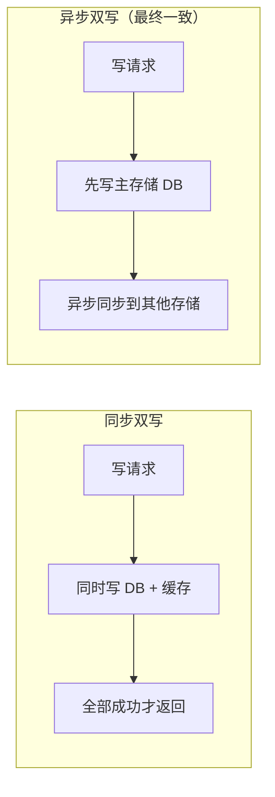
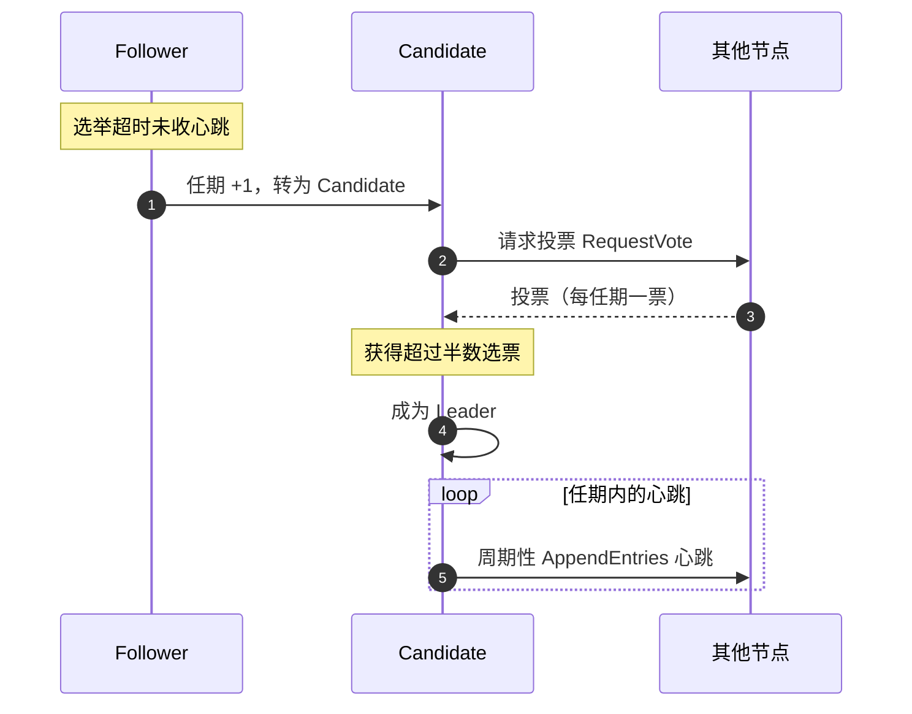
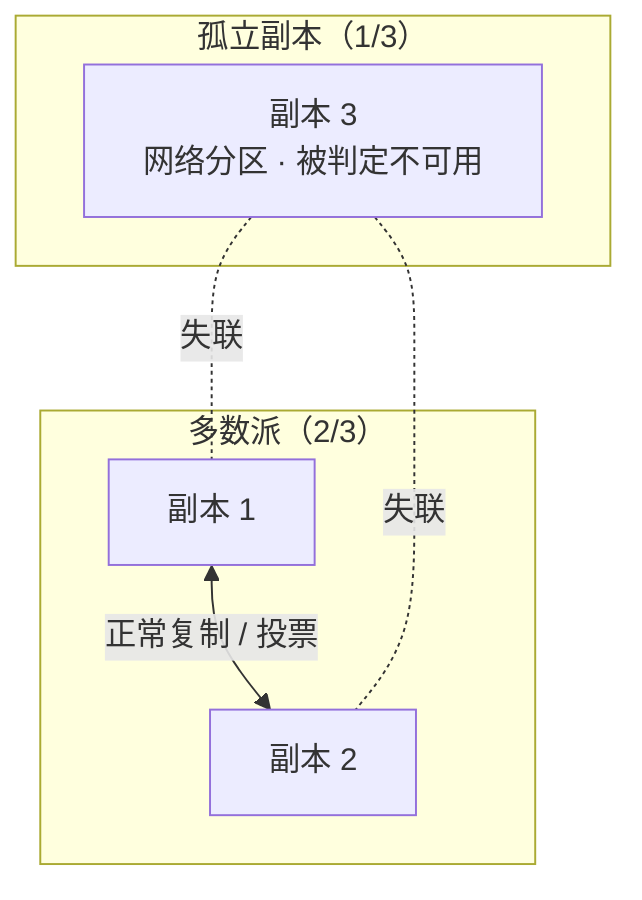

# 数据一致性

## 双写一致性

双写一致性是指在数据需要同时写入两个或多个存储系统（如数据库、缓存等）的情况下，要保证这些存储系统中的数据在任何时刻都是一致的。

- 例如，当一个电商系统中商品的库存信息既要更新数据库，又要更新缓存时，就需要保证数据库和缓存中的库存数据始终保持一致。

### 实现方法

- **同步双写**
  - **操作方式**：在数据写入时，同时对多个存储系统进行写入操作，只有当所有存储系统都写入成功后，才认为这次写入操作成功；如果其中任何一个存储系统写入失败，则回滚所有已执行的写入操作。
  - **优点**：可以保证数据在多个存储系统中实时一致。
  - **缺点**：这种方式的性能开销较大，因为它需要等待所有存储系统的写入操作完成，会增加系统的响应时间，而且如果某个存储系统出现故障，可能会导致整个写入操作失败。
- **异步双写**
  - **操作方式**：数据写入时，先将数据写入一个存储系统（通常是主存储系统），然后异步地将数据同步到其他存储系统。
  - **优点**：可以提高系统的响应速度，因为不需要等待所有存储系统的写入操作完成。即最终一致性。
  - **缺点**：这种方式可能会导致数据在短时间内不一致，因为数据同步到其他存储系统可能存在一定的延迟。
- **基于事务的双写**
  - **操作方式**：利用数据库事务或者分布式事务来保证双写的一致性。例如，在关系型数据库中，可以使用事务将对多个表的写入操作包含在一个事务中，当事务提交时，所有的写入操作要么全部成功，要么全部失败。
  - **优点**：可以保证数据的一致性，并且事务具有原子性、一致性、隔离性和持久性等特性，可以提供可靠的保证。
  - **缺点**：事务的使用会增加系统的复杂性，而且在分布式环境中，分布式事务的实现和管理相对复杂，性能开销也较大。

### 总结

一般情况下，缓存的操作都比数据库的操作更快，所以大多数时候选择的都是先以数据库为主，写完有空再处理缓存。（Cache-Aside）

> **双写一致两种方式**：同步双写实时一致但性能差，异步双写延迟低但存在短暂不一致窗口。

## Raft算法

Raft是一种分布式一致性算法，由Diego Ongaro和John Ousterhout在2014年的论文《In Search of an Understandable Consensus Algorithm》中提出。Raft的设计目的是为了更容易理解和实现，相较于之前的分布式一致性算法如Paxos，它具有更直观的结构，并且通过分离关注点来简化了理解过程。

Raft算法主要关注的是如何在一个分布式系统中达成一致性的决策机制，尤其是在节点可能因为网络分区、崩溃等原因而不可靠的情况下。Raft的核心思想是选举一个领导者（Leader）来进行集中化的决策，而其他的服务器节点则作为跟随者（Follower）或候选者（Candidate）

### 一、基本概念

- **领导者（Leader）**：负责接收客户端请求并广播给其他节点，同时负责管理日志的一致性。
- **追随者（Follower）**：接收领导者发送的日志条目进行复制。追随者不会主动发送请求，只会响应领导者的请求。（接收投票请求，并响应投票；如果长时间没有收到Leader的消息，则转换为Candidate状态）
- **候选者（Candidate）**：在领导者选举过程中，如果一个追随者在一定时间内没有收到领导者的心跳消息，它会转变为候选者，并开始新一轮选举，在获得多数票后成为Leader。

### 二、主要过程

- 当一个Follower没有在一定时间内接收到消息时，它会增加自己的任期号并转换成Candidate状态。
- Candidate会发起选举，向其他节点发送投票请求。
- 如果获得超过半数节点的投票，则该Candidate成为新的Leader。
   - 如果没有选举出领导者，则所有候选者会重置自己的定时器，并在下一轮超时后再次发起选举。

> **Raft 选主流程**：Follower 超时转 Candidate 发起投票，获多数票成为 Leader 并周期性发心跳。

### 三、特点和优势

- **心跳机制**：Leader会定期向Follower发送心跳消息，以确认其领导地位，并保持与Follower的联系。
- **安全性保证**：Raft通过确保在同一任期内只有一个Leader来避免冲突。

### 总结

Raft的一个重要特性是它不仅是一个理论上的研究结果，而且已经成功地应用到了实际的生产环境中，比如在Etcd和Consul等分布式协调服务中都有实现。此外，Raft的设计使得它很容易进行扩展以支持新的功能，例如支持安全协议（如TLS）以及支持动态地调整集群成员等。

## 脑裂现象

“脑裂”（Brain Split）现象通常发生在分布式系统中，尤其是那些依赖于多数决策（quorum-based）机制来达成一致性的系统。这种现象指的是，在网络分区（network partition）的情况下，系统的一部分节点无法与其他节点通信，导致系统分裂成两个或多个独立的子集，每个子集都认为自己是系统的合法部分。

#### 发生条件

“脑裂”通常发生在以下几种情况下：

1. **网络分区**：网络问题导致一部分节点与其他节点失去联系。
2. **硬件故障**：某个节点或一组节点发生故障，导致它们无法与其他节点同步状态。
3. **配置错误**：人为误操作或配置错误可能导致系统分裂。

#### 影响

当“脑裂”发生时，可能会导致以下问题：

1. **数据不一致**：不同子集中的节点可能会更新相同的数据，导致数据冲突或丢失。
2. **服务中断**：如果系统无法达成一致，服务可能会暂时停止工作，直到问题得到解决。
3. **资源浪费**：系统的一部分可能会继续运行无效的工作负载，浪费计算资源。

#### 解决方案

为了避免“脑裂”现象，通常采取以下措施：

1. **奇数个副本**：在选举机制中使用奇数个副本，确保任何情况下都能达成多数决策。（分布式数据库、多个副本的消息队列）
2. **心跳检测**：定期进行心跳检测，以确认节点之间的连接状态。
3. **仲裁机制**：引入外部仲裁者来帮助解决冲突。
4. **数据一致性协议**：使用分布式一致性协议，如 Paxos 或 Raft，来确保即使在网络分区的情况下也能保持数据的一致性。
5. **健康检查**：实施健康检查机制，及时发现并隔离故障节点。

#### 示例

在分布式数据库或存储系统中，“脑裂”的风险尤其高。例如，在一个有三个副本的系统中，如果一个副本因网络问题无法与其他两个副本通信，那么剩下的两个副本可以继续正常工作，因为它们构成了大多数（2/3），而孤立的那个副本则会被认为是不可用的。

总之，"脑裂"是分布式系统中的一种严重问题，需要通过合理的架构设计和有效的监控手段来预防和解决。

> **脑裂与 Quorum 防护**：3 副本中 2/3 构成多数可继续工作，孤立的 1 个副本被判定不可用。

