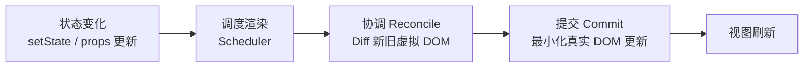
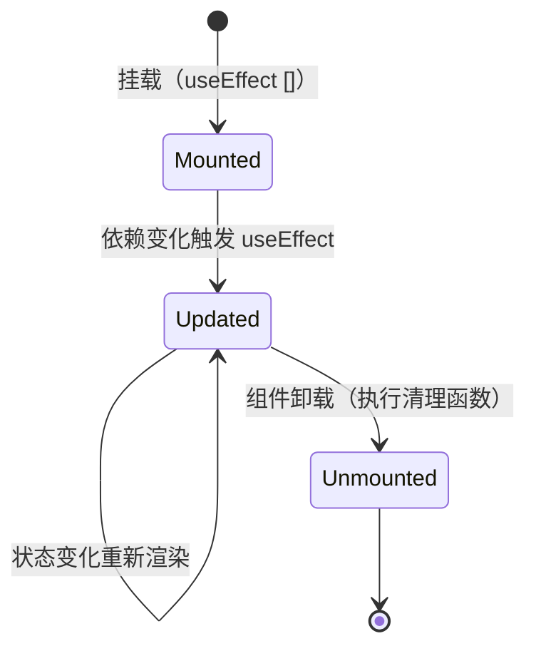
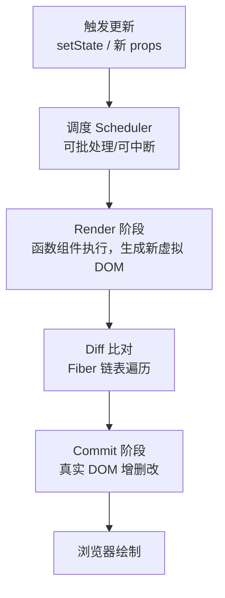
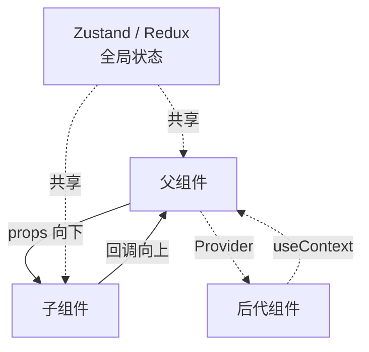

> 文章来源：React 官方文档 https://react.dev ，结合社区实践整理。

# React

React 是由 Meta（原 Facebook）维护的**用于构建用户界面的 JavaScript 库**（注意：它是库，不是像 Angular 那样的完整框架）。核心理念是**组件化**与**声明式 UI**：你描述"界面在不同状态下应该长什么样"，React 负责把状态变化高效地映射到真实 DOM。

> **React 版本现状**：React 18 是目前生产环境最广泛使用的稳定版本（引入并发特性）；React 19 于 2024 年底发布，已成为新版项目默认版本。本文以 React 18/19 的函数组件 + Hooks 写法为准。

## React 核心概念

### 1. JSX

JSX 是 JavaScript 的语法扩展，允许在 JS 中直接写类似 HTML 的结构。它会被编译为 `React.createElement(...)` 调用。

```jsx
// JSX
const element = <h1 className="title">Hello, React</h1>

// 编译后等价于
const element = React.createElement('h1', { className: 'title' }, 'Hello, React')
```

### 2. 组件与函数组件

React 组件本质是"接收 props、返回 UI 描述"的函数。

```jsx
function Welcome({ name }) {
  return <h1>你好，{name}</h1>
}
```

> **组件思想**：与 Vue 一致——封装内部状态 + 通过 props 向下传值、通过事件向上通知。

### 3. 单向数据流

数据自上而下通过 props 流动；子组件要改变父组件状态，只能调用父组件传下来的回调函数。这与 Vue 的 props/emits 模型相同。

### 4. 虚拟 DOM 与 Fiber

React 维护一棵**虚拟 DOM**（JavaScript 对象描述 UI）。状态变化触发重新渲染时，React 先用 **Diff 算法** 对比新旧虚拟 DOM，再**只把必要的变更提交（commit）到真实 DOM**。

React 16 引入的 **Fiber 架构** 把渲染拆成可中断的小任务，从而支持并发渲染（Concurrent Rendering）。

> **渲染流程**：状态变化 → 调度渲染 → 虚拟 DOM Diff → 最小化真实 DOM 提交。



### 5. 并发特性（Concurrent Features）

React 18 起默认开启的能力，让 UI 在大数据量/低优先级更新时仍保持响应：

- **自动批处理（Automatic Batching）**：同一事件中的多次 `setState` 自动合并为一次渲染
- **Suspense**：声明式地等待异步资源（数据、懒加载组件）
- **Transition（useTransition / useDeferredValue）**：把非紧急更新标记为"可中断"，避免卡住输入框等紧急交互

## Hooks（函数组件的核心）

Hooks 是 React 16.8 引入的，让函数组件拥有状态与生命周期能力。**类比 Vue 3 的 Composition API**——都是"在函数中组织逻辑"。

### useState（响应式状态，类比 ref）

```jsx
import { useState } from 'react'

function Counter() {
  const [count, setCount] = useState(0)

  const doubled = count * 2 // 类比 Vue 的 computed

  return (
    <button onClick={() => setCount(count + 1)}>
      Count: {count}, Doubled: {doubled}
    </button>
  )
}
```

### useReducer（复杂状态，类比 Pinia 的 mutation）

```jsx
import { useReducer } from 'react'

function reducer(state, action) {
  switch (action.type) {
    case 'increment': return { count: state.count + 1 }
    case 'decrement': return { count: state.count - 1 }
    default: return state
  }
}

function Counter() {
  const [state, dispatch] = useReducer(reducer, { count: 0 })
  return <button onClick={() => dispatch({ type: 'increment' })}>{state.count}</button>
}
```

### useEffect（副作用，类比生命周期/onMounted）

```jsx
import { useState, useEffect } from 'react'

function Example() {
  const [count, setCount] = useState(0)

  // 第二个参数是依赖数组；不传则每次渲染都执行
  useEffect(() => {
    console.log('count 变为', count)
    // 返回一个清理函数，类比组件卸载/更新前
    return () => console.log('清理 count 监听器')
  }, [count])

  return <button onClick={() => setCount(count + 1)}>{count}</button>
}
```

### useContext（跨层级传值，类比 provide/inject）

```jsx
import { createContext, useContext } from 'react'

const ThemeContext = createContext('light')

function Child() {
  const theme = useContext(ThemeContext) // 类比 Vue 的 inject
  return <div>当前主题：{theme}</div>
}

function App() {
  return (
    <ThemeContext.Provider value="dark"> {/* 类比 Vue 的 provide */}
      <Child />
    </ThemeContext.Provider>
  )
}
```

### useMemo / useCallback（性能优化，类比 computed/cache）

```jsx
import { useMemo, useCallback } from 'react'

function List({ items }) {
  const sorted = useMemo(() => [...items].sort(), [items])
  const onClick = useCallback((id) => console.log(id), [])
  return <ul>{sorted.map(i => <li key={i.id} onClick={() => onClick(i.id)}>{i.name}</li>)}</ul>
}
```

### useRef（引用 DOM / 保存可变值，类比 ref）

```jsx
import { useRef, useEffect } from 'react'

function Input() {
  const inputRef = useRef(null)
  useEffect(() => { inputRef.current?.focus() }, [])
  return <input ref={inputRef} />
}
```

## 组件生命周期（class → Hooks）

React 早期用 class 组件的生命周期方法；函数组件用 Hooks 表达同样语义。

| class 生命周期 | Hooks 等价写法 |
| --- | --- |
| `constructor` | `useState` 初始值 |
| `componentDidMount` | `useEffect(fn, [])` |
| `componentDidUpdate` | `useEffect(fn, [dep])` |
| `componentWillUnmount` | `useEffect` 返回的清理函数 |
| `shouldComponentUpdate` | `React.memo` / `useMemo` |
| `getDerivedStateFromProps` | 直接在渲染中计算 / `useState` + `useEffect` |

> **组件生命周期**：从挂载到卸载的状态流转，函数组件用 `useEffect` 的"依赖数组 + 清理函数"表达。



## 创建 React 工程

> **注意**：官方脚手架 `create-react-app`（CRA）已于 2023 年停止维护，新项目**推荐 Vite**；需要 SSR/全栈能力则选 Next.js。

### 使用 Vite（推荐）

```bash
# 创建项目（react 模板）
npm create vite@latest my-react-app -- --template react

# 进入目录并安装
cd my-react-app
npm install

# 启动开发服务器
npm run dev
```

### 使用 Next.js（SSR / 全栈框架）

```bash
npx create-next-app@latest my-next-app
cd my-next-app
npm run dev
```

> **Next.js 类比**：相当于 Vue 生态里的 Nuxt.js——在 React 之上提供路由、SSR/SSG、服务端能力等工程化封装。

## 渲染与更新原理

React 不靠响应式 Proxy 自动追踪依赖，而是**显式调用 setState 触发渲染**。理解这一点对写出高性能 React 很关键：

1. 调用 `setState` / 父组件传入新 `props`
2. React 调度一次重新渲染（并发模式下可能被中断/合并）
3. **协调阶段（Reconcile）**：Diff 新旧虚拟 DOM，找出最小变更
4. **提交阶段（Commit）**：把变更应用到真实 DOM



> **与 Vue 的区别**：Vue 用 Proxy 自动收集依赖、精确知道"谁变了"；React 默认可整棵组件子树重新执行 render，再靠 Diff + `React.memo` 控制实际 DOM 更新。两者最终都追求"最小 DOM 操作"。

## 组件通信

### Props 下行 + 回调上行

```jsx
// 父组件
function Parent() {
  const [msg, setMsg] = useState('Hello')
  return <Child text={msg} onUpdate={(v) => setMsg(v)} />
}

// 子组件
function Child({ text, onUpdate }) {
  return <button onClick={() => onUpdate('新的值')}>{text}</button>
}
```

### Context（跨层传值）

适合主题、登录用户等"全局但变化不频繁"的数据。

```jsx
const UserContext = createContext(null)

function App() {
  const [user] = useState({ name: 'React' })
  return <UserContext.Provider value={user}><Profile /></UserContext.Provider>
}
```

> **Context 注意**：value 变化会导致所有消费组件重渲染，高频变化的状态不要用 Context，应交给状态管理库。

### 受控组件（v-model 类比）

React 没有 `v-model`，用 `value` + `onChange` 显式绑定：

```jsx
function Input({ value, onChange }) {
  return <input value={value} onChange={(e) => onChange(e.target.value)} />
}
```

### 全局状态管理方案对比

| 方案 | 适用场景 | 特点 | Vue 对应 |
| --- | --- | --- | --- |
| `useState` / `useReducer` | 局部状态 | 内置，简单 | `ref` / `reactive` |
| Context | 跨层低频状态 | 内置，但易引发大范围重渲染 | `provide` / `inject` |
| **Zustand** | 中大型应用（推荐） | 极轻量、无 Provider 包裹、TypeScript 友好 | Pinia |
| **Redux Toolkit** | 大型企业应用 | 规范严格、可调试性强、生态成熟 | Vuex（已不推荐） |
| Jotai / Recoil | 原子化状态 | 细粒度、按需更新 | — |

> **组件通信方式**：父→子 props 下行，子→父 回调上行，跨层用 Context，全局用 Zustand/Redux。



## 路由（React Router）

React Router 是事实标准的前端路由库（类比 Vue Router）。

```jsx
import { createBrowserRouter, RouterProvider } from 'react-router-dom'

const router = createBrowserRouter([
  { path: '/', element: <Home /> },
  {
    path: '/user/:id',
    element: <User />,
    loader: async ({ params }) => fetchUser(params.id) // 类比路由守卫 + 数据预取
  }
])

function App() {
  return <RouterProvider router={router} />
}
```

### 路由守卫

React Router v6 用 `loader` / `action` 或自定义包裹组件实现鉴权：

```jsx
function RequireAuth({ children }) {
  const isAuth = useAuth()
  return isAuth ? children : <Navigate to="/login" />
}

// 在路由配置中
{ path: '/admin', element: <RequireAuth><Admin /></RequireAuth> }
```

### 懒加载与代码分割

```jsx
import { lazy, Suspense } from 'react'

const About = lazy(() => import('./About')) // 类比 Vue 的 defineAsyncComponent

function App() {
  return (
    <Suspense fallback={<div>加载中...</div>}>
      <About />
    </Suspense>
  )
}
```

## 性能优化

| 策略 | 用法 | 效果 |
| --- | --- | --- |
| `React.memo` | 包裹函数组件，浅比较 props | 避免父组件渲染导致子组件无谓重渲染 |
| `useMemo` / `useCallback` | 缓存计算结果 / 函数引用 | 避免子组件因引用变化而重渲染 |
| 路由/组件懒加载 | `React.lazy` + `Suspense` | 减小首屏 JS 体积 |
| 虚拟列表 | `react-window` / `react-virtuoso` | 万级列表 DOM 降至百级 |
| 并发过渡 | `useTransition` / `useDeferredValue` | 大更新不阻塞输入框等紧急交互 |
| Gzip/Brotli + CDN | 服务器/部署配置 | 传输体积减少 60-80% |

```javascript
// 用 React.memo 阻止无谓重渲染
const Child = React.memo(function Child({ user }) {
  return <div>{user.name}</div>
})

// 用 useTransition 把非紧急更新标记为可中断
const [isPending, startTransition] = useTransition()
startTransition(() => setHeavyList(nextList))
```

## TypeScript 支持

React 对 TypeScript 支持良好，是大型项目的默认选择。

```tsx
import { useState } from 'react'

interface User {
  name: string
  age: number
}

function Profile({ user }: { user: User }) {
  const [count, setCount] = useState<number>(0)
  return <div>{user.name} 点击了 {count} 次</div>
}
```

## React 19 新特性

React 19 在 18 的基础上进一步简化开发：

- **`use` API**：在组件/异步函数中读取 Promise 或 Context（替代部分 `useContext` / Suspense 写法）
- **Actions**：用 `useActionState` / `useFormStatus` 简化表单提交与服务端动作
- **原生文档元数据**：在组件里直接写 `<title>` / `<meta>` / `<link>`，React 自动提升到 `<head>`
- **ref 可作为普通 prop 传递**：不再需要 `forwardRef`
- **`useOptimistic`**：乐观 UI 更新

```tsx
// React 19：ref 直接作为 prop（无需 forwardRef）
function Input({ ref }: { ref: React.Ref<HTMLInputElement> }) {
  return <input ref={ref} />
}
```

## React 与 Vue 对比

两者都是组件化、声明式、基于虚拟 DOM 的主流方案，主要差异在**响应式模型**与**写法风格**：

| 维度 | React | Vue 3 |
| --- | --- | --- |
| 定位 | UI 库 | 渐进式框架（含路由/状态等生态） |
| 响应式 | 显式 `setState` 触发，Diff 比对 | Proxy 自动依赖追踪 |
| 模板 | JSX（写在 JS 中） | 单文件组件 `.vue`（模板/脚本/样式分离） |
| 逻辑组织 | Hooks（函数内） | Composition API（`setup`） |
| 状态管理 | Zustand / Redux Toolkit | Pinia |
| 全栈/SSR | Next.js | Nuxt.js |
| 学习曲线 | 概念少但需自行组合 | 约定多、开箱即用 |
| 适合人群 | 偏好 JS 灵活性、大型工程 | 偏好模板直观、渐进式上手 |

> 想了解 Vue 的对应写法，可参考 [Vue](Vue.md)。两框架核心概念（组件、通信、路由、状态管理、SSR）高度同构，掌握一个再学另一个很快。

## 生态资源

- 官方文档：https://react.dev
- 状态管理 Zustand：https://zustand-demo.pmnd.rs
- 路由 React Router：https://reactrouter.com
- 全栈框架 Next.js：https://nextjs.org
- UI 组件库：Ant Design（https://ant.design）、MUI（https://mui.com）
