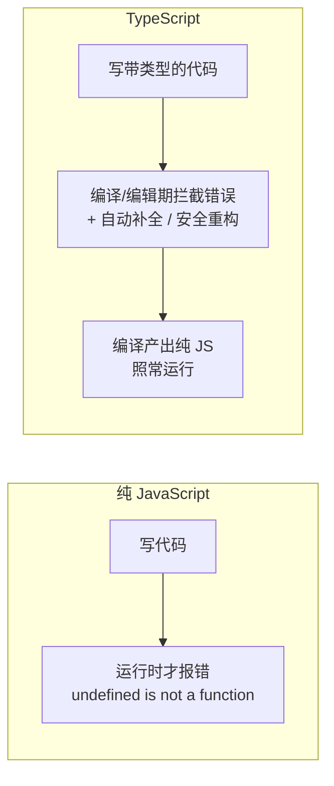
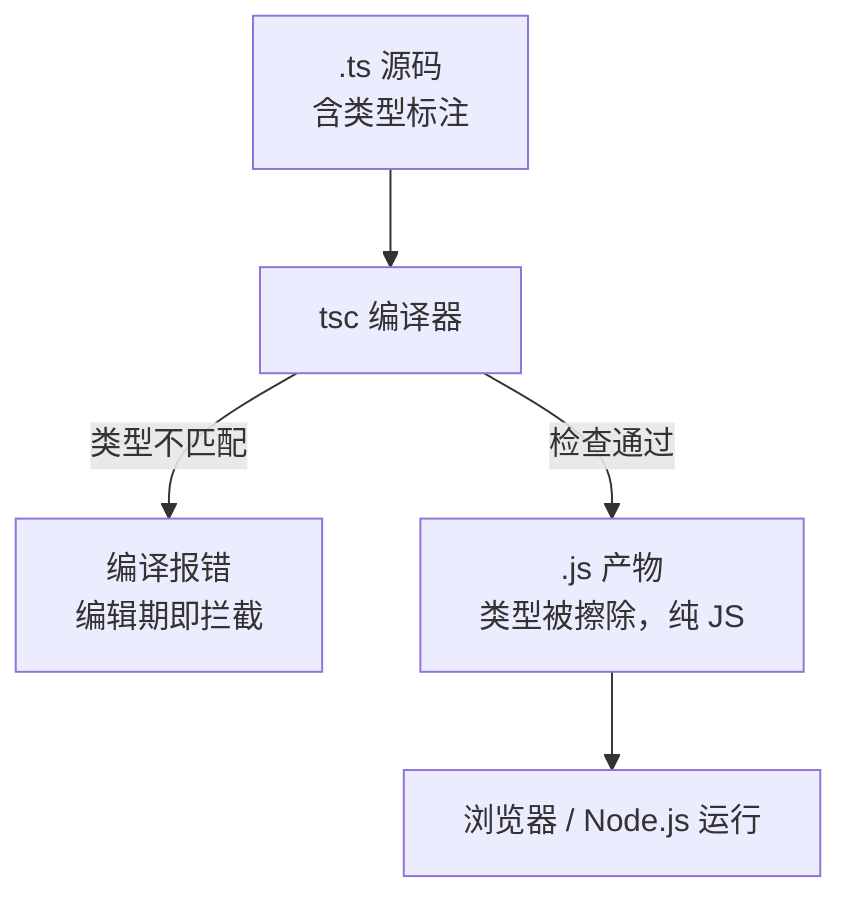

> 文章来源：TypeScript 官方文档 https://www.typescriptlang.org/docs ，结合后端/全栈开发视角整理。

# TypeScript

TypeScript（简称 TS）是微软在 2012 年推出的**JavaScript 超集**：它在 JS 语法之上加了一层**静态类型系统**，但编译后产出的是纯 JavaScript，可以直接在任何浏览器或 Node.js 里运行。本文面向**有 Java/后端基础、正在转向全栈的前端学习者**，重点讲清"为什么需要它"以及"它和 JS 到底差在哪"。

## 为什么会有 TypeScript（后端视角）

### JavaScript 的先天短板

JS 诞生时只是为了在浏览器里做点表单校验，设计目标是"简单、宽松"。这种宽松在大型项目里变成了痛点：

- **弱类型 + 动态类型**：变量随时能换类型，`let a = 1; a = 'x'` 合法，运行时才暴露问题
- **无编译期检查**：写错属性名、传错参数，浏览器**运行时才报错**，而不是在写代码时就拦住
- **重构没安全感**：重命名一个字段，编译器不会帮你找出所有引用点，只能靠全局搜索 + 人肉核对
- **IDE 无智能提示**：不知道一个对象有哪些字段，全靠记忆或查文档
- **早期无模块/类型系统**：大规模协作时，接口契约只能靠口头约定或注释

> **后端同学的共鸣**：Java 之所以稳，是因为 `javac` 在编译期就做了类型检查、泛型约束、方法签名匹配。前端项目大到几十万行、多人协作时，同样需要这套"编译期护栏"——TS 就是给 JS 补上这层护栏。

### TypeScript 的初衷

微软（主导者 Anders Hejlsberg，也是 C# 的首席架构师）做 TS 的目标是：

1. **给 JS 加静态类型**，把"运行时才爆的错"提前到"编译/写代码时就爆"
2. **不发明新运行时**：TS 编译后就是标准 JS，复用整个 JS 生态（npm、浏览器、Node）
3. **渐进式采用**：老 JS 文件可以逐步改成 TS，不必推倒重来



> **一句话总结**：TS 不是新语言，而是"给 JS 加了编译期类型检查的外挂"，让前端项目也能拥有后端那样的类型安全感。

## TypeScript 与 JavaScript 的区别

最容易误解的一句话是"TS 不就是 JS 么"。准确的说法是：**源码层面 TS 是 JS 的超集；产物层面 TS 编译后就是 JS（类型被擦除）**。区别全在"编译/编辑期"。

| 维度 | JavaScript | TypeScript |
| --- | --- | --- |
| 类型检查 | 无，运行时才报错 | 编译/编辑期静态检查 |
| 类型标注 | 不支持 | 支持 `: string`、接口、泛型等 |
| 智能提示 | 弱 | 强（基于类型推导） |
| 重构安全 | 靠搜索 + 手动 | 编译器驱动，重命名/改签名自动同步 |
| 联合/字面量类型 | 无 | `'a' \| 'b'`、`string \| number` |
| 泛型 / 工具类型 | 无 | 有 |
| 运行方式 | 直接跑 | 先 `tsc` 编译成 JS 再跑 |
| 学习成本 | 低 | 需额外学类型系统 |

### 类型擦除（最关键的一点）

TS 的**类型只存在于编译期**，编译成 JS 后类型信息全部消失——所以"运行时"它确实是 JS。这也意味着：你不能靠 TS 类型做运行时判断。

```typescript
// .ts 源码
function add(a: number, b: number): number {
  return a + b
}

// 编译后等价的 .js（类型全没了）
function add(a, b) {
  return a + b
}
```



> **注意**：正因为类型在运行时不存在，TS 里的"类型断言""类型收窄"都不会产生任何运行时代码。运行时校验还得靠 `typeof`、运行时 schema（如 Zod）等。

### "超集"意味着什么

合法的 JS 代码都是合法的 TS 代码（你把 `.js` 改名成 `.ts` 通常能直接编过）。TS 只是**额外**允许你写类型。这就是它能渐进式接入老项目的原因。

## 基础类型与特殊类型

### 原始类型

```typescript
let isDone: boolean = false
let count: number = 10
let name: string = 'TS'
let list: number[] = [1, 2, 3]
let tuple: [string, number] = ['age', 18] // 元组：固定长度+固定位置类型
```

### 四个容易混的特殊类型

| 类型 | 含义 | 后端类比 |
| --- | --- | --- |
| `any` | 放弃类型检查，等同回到 JS | 像 `Object` 随便转型，能编译但失去 TS 意义 |
| `unknown` | 未知类型，但**使用前必须先收窄** | 比 `any` 安全，类似"必须先判型才能用" |
| `never` | 永远不会有值（多用于穷尽检查） | 类似"不可能到达的分支" |
| `void` | 没有返回值 | 同 Java `void` |

> **`any` vs `unknown`**（后端转前端最高频踩坑）：`any` 等于"我不检查了"，后续随便调用都不会报错；`unknown` 则强制你先 `typeof`/类型收窄才能用——`unknown` 才是"我暂时不知道类型但请保持安全"。项目里应尽量用 `unknown` 替代 `any`。

```typescript
let a: any = 4
a.foo.bar() // 编译不报错，运行时炸

let u: unknown = 4
// u.foo()        // ❌ 编译报错：unknown 不能直接用
if (typeof u === 'number') {
  u.toFixed(2)   // ✅ 收窄后才能用
}
```

### 类型推断

TS 能根据初始值自动推断类型，不必处处标注：

```typescript
const x = 1          // 推断为 number
const y = 'hi'       // 推断为 string
let z = Math.random() > 0.5 ? 1 : 'x' // 推断为 number | string（联合类型！）
```

## 结构化类型（和 Java 的关键差异）

这是**后端同学最该理解、也最容易栽的一点**。Java 是**名义类型（nominal）**：两个类只有 `implements`/`extends` 关系才算同一类型。TS 是**结构化类型（structural）**：**只要"形状（字段/方法）对得上"就算兼容，不管名字**。

```typescript
interface Point { x: number; y: number }

// Java 思路：必须 implements Point 才算 Point
// TS 思路：只要有个带 x,y 的对象，就当成 Point
function print(p: Point) {
  console.log(p.x, p.y)
}

print({ x: 1, y: 2 })        // ✅ 直接传字面量也行
print({ x: 1, y: 2, z: 3 })  // ✅ 多余字段也兼容（结构匹配）

class Vec implements Point { x = 0; y = 0 } // 不用显式声明也兼容
print(new Vec())
```

> **后端陷阱**：结构化类型导致"形状碰巧一样"的两个本不应相关的对象被当成同类型——这既是灵活也是隐患。需要严格区分时，可用**品牌类型（branding）**模拟名义类型：

```typescript
type UserId = string & { __brand: 'UserId' }
function makeUserId(id: string): UserId {
  return id as UserId
}
// 普通 string 无法冒充 UserId，避免把订单号当作用户 ID 传进去
```

## 接口 interface 与类型别名 type

都能描述对象形状，区别如下：

| 场景 | interface | type |
| --- | --- | --- |
| 描述对象/类结构 | ✅ 推荐 | ✅ |
| 联合/交叉类型 | ❌ | ✅ `A \| B`、`A & B` |
| 声明合并（同名自动合并） | ✅ 支持 | ❌ 不支持 |
| 映射/条件类型 | ❌ | ✅ |
| 模拟名义类型（branding） | ❌ | ✅ |

经验法则：**描述对象形状用 `interface`，做类型组合/工具类型用 `type`**。

```typescript
interface User { id: number; name: string }
type ID = number | string
type Admin = User & { role: 'admin' }
```

## 联合 / 字面量 / 交叉类型（JS 完全没有的）

普通 JS 没有"一个值可能是多种类型之一""只能是某几个固定字符串"的表达。TS 用联合（`|`）和字面量类型补上，这是状态建模的神器。

```typescript
// 字面量类型：值只能是这三个之一
type Status = 'idle' | 'loading' | 'done'

// 联合类型：可以是多种类型
type ID = number | string

// 交叉类型：同时满足多个形状
type A = { x: number }
type B = { y: number }
type C = A & B // { x: number; y: number }
```

> **后端视角**：这相当于 Java 的 `enum` + 泛型上限的轻量组合，但灵活得多——`Status` 直接限制了合法取值，拼错一个状态名编译期就报错。

## 类型收窄（Narrowing）

TS 会根据代码里的判断，**自动缩小**变量的类型范围：

```typescript
function fn(x: string | number) {
  if (typeof x === 'string') {
    x.toUpperCase() // 这里 x 被收窄为 string
  } else {
    x.toFixed(2)    // 这里 x 被收窄为 number
  }
}
```

常见收窄手段：`typeof`、`instanceof`、`in`、字面量相等判断、以及后面讲的"可辨识联合"。

## 泛型与工具类型

### 泛型（和 Java 几乎一致）

```typescript
function identity<T>(arg: T): T {
  return arg
}
const n = identity<number>(10)
```

### 内置工具类型（元编程级别的"类型函数"）

这是 TS 比 Java 泛型更灵活的地方——可以对"类型"做变换：

| 工具类型 | 作用 | 示例 |
| --- | --- | --- |
| `Partial<T>` | 所有字段变可选 | `Partial<User>` |
| `Required<T>` | 所有字段变必填 | `Required<User>` |
| `Pick<T, K>` | 只取部分字段 | `Pick<User, 'id' \| 'name'>` |
| `Omit<T, K>` | 排除部分字段 | `Omit<User, 'password'>` |
| `Record<K, V>` | 键值映射对象 | `Record<string, number>` |
| `Readonly<T>` | 字段只读 | `Readonly<User>` |
| `ReturnType<F>` | 取函数返回类型 | `ReturnType<typeof fn>` |

```typescript
interface User { id: number; name: string; password: string }
type PublicUser = Omit<User, 'password'>  // { id: number; name: string }
```

## 可辨识联合 + never 穷尽检查（工程模式）

这是 TS 在前端状态机里**最实用**的模式，也是 Java 没有的轻量写法：用"字面量字段"区分联合成员，再用 `never` 让"漏处理一种情况"在编译期报错。

```typescript
type State =
  | { kind: 'idle' }
  | { kind: 'loading' }
  | { kind: 'success'; data: string }
  | { kind: 'error'; message: string }

function render(s: State): string {
  switch (s.kind) {
    case 'idle': return '待开始'
    case 'loading': return '加载中'
    case 'success': return s.data // 这里能直接拿到 data
    case 'error': return s.message
    default: {
      // 若以后给 State 加了 'cancel' 分支却忘了处理，这里会编译报错
      const _exhaustive: never = s
      return _exhaustive
    }
  }
}
```

> **后端视角**：相当于用编译器的 `never` 检查，强制你覆盖联合类型的每一个成员——比 Java 的 `switch` 漏写 `default` 安全得多。

## 高级类型（类型体操简介）

进阶但面试常考，了解即可：

```typescript
// 条件类型：T 是 string 就取长度类型，否则取 T 本身
type Len<T> = T extends string ? number : T

// infer：从类型里"提取"一部分
type Unwrap<T> = T extends Promise<infer U> ? U : T // Unwrap<Promise<number>> = number

// 映射类型：批量改写字段
type ReadonlyX<T> = { readonly [K in keyof T]: T[K] }

// keyof：取对象所有键的联合
type Keys = keyof User // 'id' | 'name' | 'password'
```

## tsconfig 与编译

TS 的行为由项目根目录的 `tsconfig.json` 控制。对后端同学，最重要的几个选项：

| 选项 | 作用 | 建议 |
| --- | --- | --- |
| `strict` | 开启全部严格检查（含 `null` 检查、隐式 `any` 报错） | **务必开 true** |
| `target` | 编译出的 JS 语法版本 | `ES2020` 起 |
| `module` | 模块规范 | `ESNext` / `CommonJS`（看运行环境） |
| `moduleResolution` | 模块解析策略 | `bundler`（配合 Vite） |
| `noImplicitAny` | 不允许隐式 `any` | 随 `strict` 开启 |
| `noEmit` | 只检查不产出 JS | 配合 Vite/Webpack 时设为 true |

```bash
# 安装与编译
npm install -g typescript
tsc --init         # 生成 tsconfig.json
tsc                # 按配置检查并编译
tsc --noEmit       # 只做类型检查，不产出文件
```

> **工程化提示**：现代前端（Vite/Webpack/Next）通常由打包工具调用 TS **做类型检查 + 转译**，不需要手动 `tsc` 产出 JS。详见 [前端工程化](前端工程化.md)（如已建）。

## 常见陷阱（后端转前端高发）

- **`any` 滥用**：一旦写 `any`，那段代码就退回 JS，失去 TS 意义。能用 `unknown` + 收窄就用 `unknown`。
- **非空断言 `!` 滥用**：`user!.name` 告诉编译器"我保证非空"，但若实际为空，运行时照样炸——它只是骗过编译期。
- **`enum` 的编译产物**：TS 的 `enum` 会编译出**真实对象**（不是纯类型），带来运行时开销和 tree-shaking 问题；常量枚举优先用 `const enum` 或 `as const` 字面量联合替代。
- **类型 ≠ 运行时**：TS 类型不参与运行，别指望 `instanceof SomeInterface`——接口在运行时不存在，要判定得靠 `in` / `typeof` 或运行时 schema（Zod）。
- **结构化类型误匹配**：名字不同但形状相同的两个对象被当成同类型，用 branding 区分关键 ID 类。

## 与 Vue / React 的关系

你站点里的 [Vue](Vue.md) 和 [React](React.md) 页面代码本身就用 TS 写成（`<script setup lang="ts">`、`.tsx`）。理解本文的类型系统后，再看那两篇的 `interface`、泛型、`Props` 类型标注会非常顺。TS 是这两个框架的**推荐开发语言**，也是现代前端（尤其中大型全栈项目）的事实标准。

## 生态资源

- 官方文档：https://www.typescriptlang.org/docs
- 中文手册：https://www.typescriptlang.org/zh
- 类型校验运行时库（前后端共用 schema）：Zod https://zod.dev
