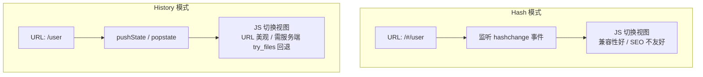
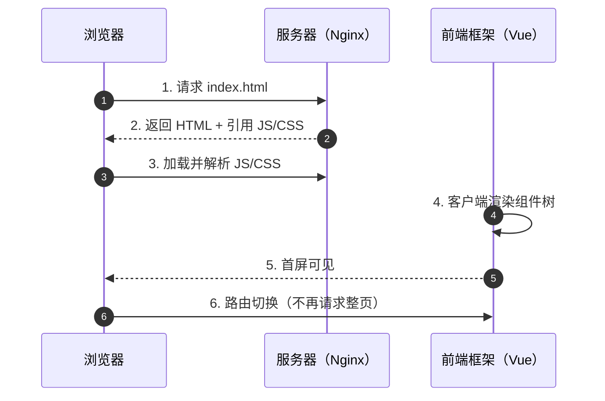
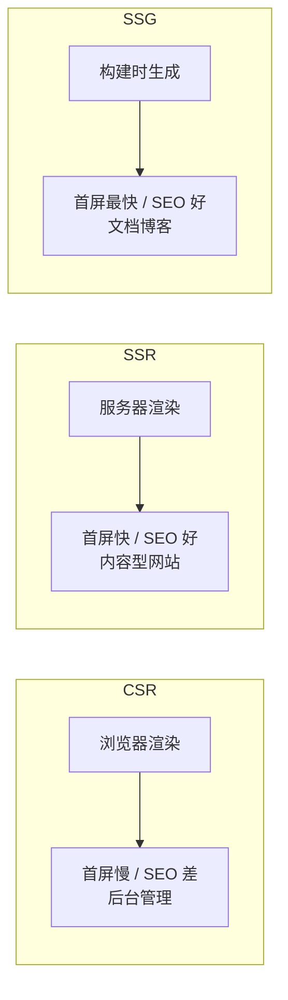

# 单页应用

## 单入口页面和模版引擎有什么区别

用Java开发写前端页面，传统方式如JSP，模版引擎如Freemarker,Velocity,Thymeleaf，单入口（配合Angular.js，Vue.js等前端框架），只有一个index.html，所有的功能都在这个页面中完成。

> https://en.m.wikipedia.org/wiki/Single-page_application

单页应用：如Angular.js，Vue.js等，页面在前端渲染生成。第一次加载所有需要的文件，而模板开发每一次只加载本次需要的文件。单页应用对于导航来说不可用。

## VUE对比图

|                | **Java Web**       | **Vue单页应用**               |
| -------------- | ------------------ | ----------------------------- |
| **开发环境**   | Tomcat             | NodeJS                        |
| **开发语言**   | Java               | ES6                           |
| **项目构建**   | maven              | npm                           |
| **编译后文件** | class (服务器使用) | js5、css、html (浏览器使用)   |
| **模块化**     | import (引入包)    | import、export                |
| **代码复用**   | pom.xml (jar)      | package.json (js)             |
| **入口**       | main函数           | main.js                       |
|                |                    |                               |
| **控制层**     | 控制器处理         | vue-router路由                |
| **视图处理**   | model              | vue数据绑定                   |
| **数据处理**   | dao层              | vue-axios                     |
| **调试**       | tomcat             | node.js (npm run dev)         |
| **部署**       | war到tomcat        | 一个js、一个index.html到nginx |

## 传统模板渲染和nodejs模板渲染

传统模板渲染利用服务器输出html流给到浏览器解析生成页面，nodejs是利用V8引擎输出html流给浏览器解析。

传统模板引擎有：JSP、Thymeleaf、Velocity、Freemarker

NodeJS模板引擎有：EJS、Vue、hogan.js、Jade（pug）、Nunjucks

## SPA 架构原理

### 前端路由

SPA 的核心是**前端路由**——由 JavaScript 控制页面切换，而非服务器返回新页面。两种主要模式：

| 模式 | URL 形式 | 原理 | 优缺点 |
| --- | --- | --- | --- |
| Hash | `http://example.com/#/user` | 监听 `hashchange` 事件 | 兼容性好，URL 不美观；SEO 不友好 |
| History | `http://example.com/user` | 使用 `pushState`/`popstate` API | URL 美观，SEO 友好；需服务器配置回退 |

**History 模式服务端配置（Nginx）：**

```nginx
location / {
    try_files $uri $uri/ /index.html;
}
```

所有路由都回退到 `index.html`，由前端路由接管。

> **前端路由两种模式**：Hash 监听 hashchange，History 使用 pushState 并依赖服务端回退。



### 组件化开发

SPA 将页面拆分为可复用的组件树：

```
App
├── Header
├── Sidebar
│   ├── NavItem
│   └── NavItem
└── MainContent
    ├── UserProfile
    └── UserList
```

组件的核心思想：**封装**（内部状态私有）+ **通信**（通过 props 向下传递，通过事件向上通知）。

> **SPA 首屏加载时序**：首屏请求 index.html 后，浏览器加载 JS/CSS，框架客户端渲染出页面。



### 状态管理

当组件层级较深或多个组件共享状态时，需要全局状态管理：

| 方案 | 适用场景 | 特点 |
| --- | --- | --- |
| 组件自身状态 | 简单局部状态 | `data` / `ref` |
| Provide/Inject | 祖先→后代传值 | Vue 3 内置，跨层级传递 |
| Pinia | 中大型应用 | Vue 3 官方推荐，轻量，TypeScript 友好 |
| Vuex | 遗留 Vue 2 项目 | 较重，Vue 3 中已不推荐 |

## SSR / CSR / SSG 对比

| 特性 | CSR（客户端渲染） | SSR（服务端渲染） | SSG（静态生成） |
| --- | --- | --- | --- |
| 渲染位置 | 浏览器 | 服务器 | 构建时 |
| 首屏速度 | 慢（需加载JS后渲染） | 快（服务器返回完整HTML） | 最快（直接返回静态HTML） |
| SEO | 差 | 好 | 好 |
| 服务器压力 | 低 | 高 | 最低 |
| 动态内容 | 实时 | 实时 | 需重新构建或客户端 hydration |
| 典型框架 | Vue SPA | Nuxt.js (SSR模式) | Nuxt.js (静态模式)、VitePress |

> **CSR / SSR / SSG 渲染对比**：渲染位置与首屏速度、SEO 的取舍决定选型。



**选型建议：**

- **后台管理系统** → CSR，SEO 不重要，首屏体验可通过懒加载优化
- **内容型网站/电商** → SSR，SEO 关键，首屏速度重要
- **文档/博客** → SSG，内容变化少，构建一次即可

## 前端路由详解

### Vue Router 基本用法

```javascript
import { createRouter, createWebHistory } from 'vue-router'

const routes = [
  { path: '/', component: Home },
  { path: '/user/:id', component: User, props: true },
  { path: '/admin', component: Admin, meta: { requiresAuth: true } }
]

const router = createRouter({
  history: createWebHistory(),
  routes
})
```

### 路由守卫

```javascript
// 全局前置守卫
router.beforeEach((to, from, next) => {
  if (to.meta.requiresAuth && !isAuthenticated()) {
    next('/login')
  } else {
    next()
  }
})

// 路由独享守卫
const routes = [
  {
    path: '/admin',
    component: Admin,
    beforeEnter: (to, from, next) => {
      // 仅对该路由生效
    }
  }
]
```

### 动态路由与懒加载

```javascript
const routes = [
  // 动态路由参数
  { path: '/user/:id', component: User },

  // 路由懒加载 — 按需加载组件，减小首屏体积
  { path: '/about', component: () => import('./views/About.vue') },

  // 嵌套路由
  {
    path: '/user/:id',
    component: User,
    children: [
      { path: 'profile', component: UserProfile },
      { path: 'posts', component: UserPosts }
    ]
  }
]
```

## 性能优化

### 懒加载与代码分割

```javascript
// 路由级别懒加载
const routes = [
  { path: '/dashboard', component: () => import('./views/Dashboard.vue') }
]

// 组件级别懒加载
const AsyncComp = defineAsyncComponent(() => import('./HeavyComponent.vue'))
```

### 关键优化策略

| 策略 | 说明 | 效果 |
| --- | --- | --- |
| 路由懒加载 | 按路由拆分代码块 | 首屏 JS 体积减少 50%+ |
| 组件懒加载 | 可视区域外组件延迟加载 | 减少初始渲染量 |
| 预渲染 | 构建时生成静态 HTML | 首屏白屏时间大幅缩短 |
| Gzip/Brotli | 服务器启用压缩 | 传输体积减少 60-80% |
| CDN 部署 | 静态资源放 CDN | 全球加速，减少延迟 |
| 虚拟滚动 | 大列表只渲染可见区域 | DOM 节点数从万级降至百级 |
| 图片懒加载 | 进入视口后再加载 | 减少初始请求数 |

### Vite 构建优化

```javascript
// vite.config.js
export default defineConfig({
  build: {
    rollupOptions: {
      output: {
        manualChunks: {
          'vendor': ['vue', 'vue-router'],
          'ui': ['element-plus']
        }
      }
    }
  }
})
```
