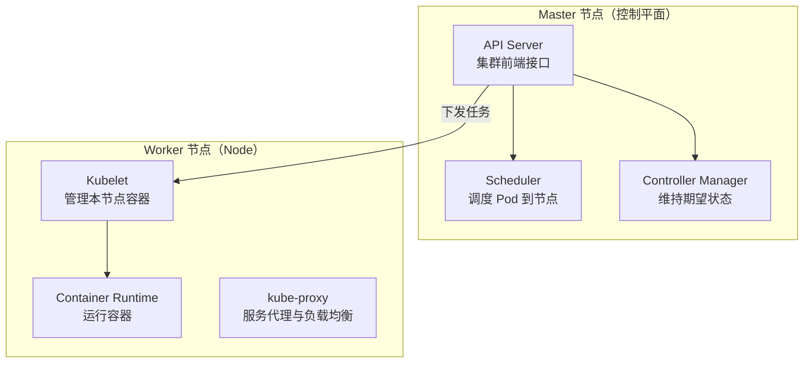
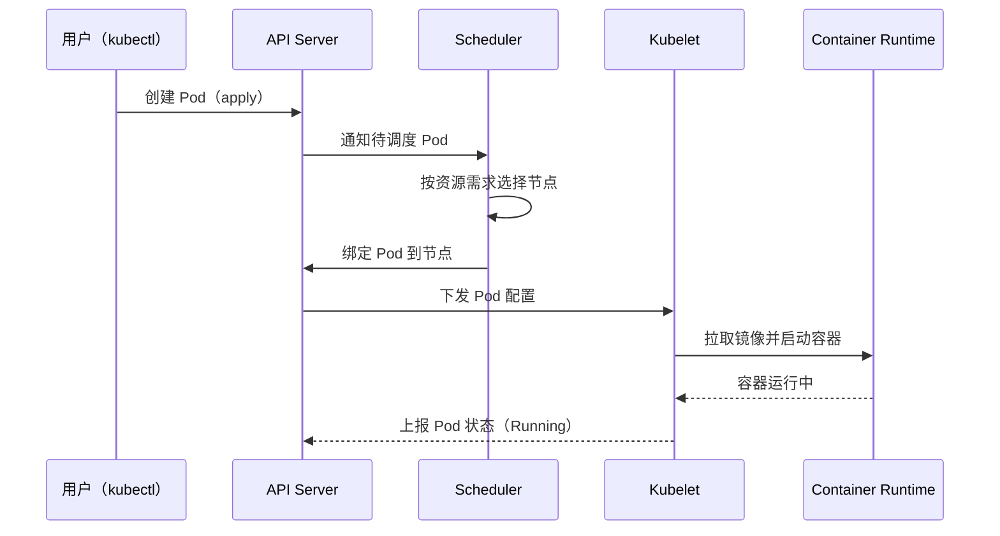
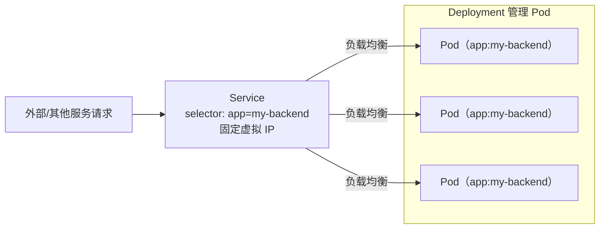

# Kubernetes （K8s）

Kubernetes（通常缩写为 K8s）是一个开源的容器编排平台，用于自动化应用程序的部署、扩展和管理。

## 起源和发展

### 起源

Kubernetes 的起源可以追溯到 Google 内部的 Borg 系统。Borg 是 Google 开发的一个大规模集群管理系统，用于管理 Google 内部的数据中心资源。Borg 系统能够高效地调度和管理成千上万的应用程序和服务，确保它们在高负载下稳定运行。

- **Borg 系统的影响**：Borg 系统在 Google 内部运行了多年，积累了丰富的经验和技术。Google 的工程师们意识到，Borg 的成功经验可以推广到更广泛的社区，帮助其他公司解决类似的容器编排问题。

- **Docker 的兴起**：2013 年，Docker 的发布使得容器技术变得更加流行和易于使用。Docker 提供了一种轻量级的虚拟化技术，使得应用程序可以在隔离的环境中运行，而不需要完整的虚拟机。Docker 的兴起推动了容器技术的普及，但也带来了新的挑战，特别是在大规模部署和管理容器时。

### Kubernetes 的诞生

2014 年，Google 决定将 Borg 系统的经验开源，并推出了 Kubernetes 项目。Kubernetes 的设计目标是提供一个通用的容器编排平台，能够管理大规模的容器化应用程序。

- **开源发布**：2014 年 6 月，Google 在 GitHub 上开源了 Kubernetes 项目。Kubernetes 的初始版本基于 Borg 系统的设计理念，但进行了简化和优化，以适应更广泛的用户需求。

- **社区参与**：Kubernetes 的开源吸引了大量的开发者和公司参与。Google 与 Linux 基金会合作，成立了 Cloud Native Computing Foundation（CNCF），以推动 Kubernetes 和云原生技术的发展。

### 发展历程

自 2014 年开源以来，Kubernetes 经历了快速的发展和演变，逐渐成为容器编排领域的事实标准。

- **早期版本**：Kubernetes 的早期版本（1.0 之前）主要关注核心功能的开发和稳定性。Google 和其他贡献者不断改进 Kubernetes 的架构和功能，使其能够更好地支持生产环境。

- **1.0 版本发布**：2015 年 7 月，Kubernetes 1.0 版本正式发布，标志着 Kubernetes 已经准备好用于生产环境。1.0 版本引入了许多关键功能，如 Pod、Service、Replication Controller 等。

- **CNCF 的成立**：2015 年，Google 与 Linux 基金会合作成立了 Cloud Native Computing Foundation（CNCF），Kubernetes 成为 CNCF 的第一个项目。CNCF 的成立进一步推动了 Kubernetes 的社区发展和生态系统的建设。

- **生态系统的扩展**：随着 Kubernetes 的普及，越来越多的公司和开发者开始围绕 Kubernetes 构建工具和服务。例如，Helm 提供了 Kubernetes 应用的包管理功能，Istio 提供了服务网格的支持，Prometheus 提供了监控和告警功能。

- **持续演进**：Kubernetes 的开发遵循严格的发布周期，每三个月发布一个新版本。每个版本都会引入新的功能和改进，同时保持向后兼容性。Kubernetes 的社区活跃度非常高，贡献者来自全球各地的公司和组织。

### 现状与未来

截至 2023 年，Kubernetes 已经成为容器编排领域的事实标准，被广泛应用于各种规模的企业和组织中。


## Kubernetes 架构

### 节点组件

#### Master 节点

- **API Server**：是 Kubernetes 集群的前端接口，它提供了 HTTP/HTTPS RESTful API，用于接收用户请求并进行处理。所有的管理操作，如创建、删除、更新容器等操作都是通过 API Server 进行的。
- **Scheduler**：负责根据容器的资源需求和节点的可用资源等因素，将容器调度到合适的节点上运行。例如，它会考虑节点的 CPU、内存等资源使用情况，以及容器对硬件的特殊要求（如 GPU 等）来进行调度。
- **Controller Manager**：包含了多个控制器，如 ReplicationController、DeploymentController 等。这些控制器用于保证集群的状态符合用户期望的状态。例如，ReplicationController 会确保容器副本的数量始终保持在用户定义的数量上。

#### Worker 节点（也称为 Node）

- **Kubelet**：运行在每个 Worker 节点上，它负责与 Master 节点通信，接收 Master 节点下发的任务，并管理本节点上运行的容器。例如，它会按照 Master 节点的要求，下载容器镜像、启动或停止容器等操作。
- **Container Runtime**：是负责实际运行容器的软件，常见的如 Docker、Containerd 等。它根据 Kubelet 的指令来运行容器，包括容器的创建、启动、停止等操作。
- **kube - proxy**：主要负责实现服务的代理和负载均衡功能。它会在节点上设置规则，将请求转发到正确的容器服务上。

> **Kubernetes 集群架构**：Master 节点运行控制平面组件，Worker 节点运行 Kubelet、运行时与 kube-proxy。




### 资源对象

Kubernetes 资源对象 主要包括 pod、service、deployment。

- **Pod** 是 Kubernetes 中**最小的可部署和可管理的计算单元**，它可以包含一个或多个紧密相关的容器。例如，一个包含主应用程序容器和辅助日志收集容器的组合可以放在一个 Pod 中。这些容器共享网络命名空间、存储卷等资源，它们之间的通信可以通过[localhost](https://localhost/)进行。

- **Service** 是一种**抽象的资源**，用于定义一组 Pod 的访问策略。它提供了一个稳定的 IP 地址和 DNS 名称，使得其他 Pod 或者外部客户端可以通过这个统一的入口访问后端的 Pod。例如，一个 Web 服务可以通过 Service 来对外提供服务，而不管后端的 Web 容器有多少个或者如何变化。

- **Deployment** 用于**管理 Pod 的部署和更新**。它可以定义 Pod 的副本数量、更新策略等。例如，在进行应用程序版本更新时，Deployment 可以控制更新的方式，如滚动更新（逐步替换旧版本的 Pod 为新版本）或者蓝绿更新（先启动新版本的应用，然后切换流量到新版本）。

> **Pod 创建与调度流程**：API Server 接收创建请求，Scheduler 选节点绑定，Kubelet 拉起容器并上报状态。



#### Pod

- **定义与组成**
  - Pod 是 Kubernetes 中最小的部署单元，它可以包含一个或多个紧密相关的容器。这些容器在同一个 Pod 内共享网络命名空间、存储卷等资源。通常，一个 Pod 内的容器会协同工作来完成一个完整的功能，比如一个包含应用容器和日志收集容器的 Pod。
  - 例如，在一个简单的 Web 应用场景中，一个 Pod 可能包含一个运行 Web 服务器（如 Nginx）的容器和一个用于收集 Nginx 日志的容器。这两个容器共享同一个网络接口，使得日志收集容器可以方便地从 Web 服务器容器获取日志信息。
- **生命周期管理**
  - Pod 有自己的生命周期，从创建、运行到销毁。在创建阶段，Kubelet 会根据 API Server 下发的 Pod 配置信息，下载容器镜像并启动容器。在运行过程中，Kubelet 会定期检查容器的健康状态，通过容器的健康检查机制（如 HTTP 健康检查、命令行检查等）来判断容器是否正常运行。如果容器出现故障，Kubelet 会根据配置尝试重启容器。当 Pod 需要被销毁时，Kubelet 会先停止容器，然后清理相关的资源。
  - 假设一个 Pod 中的 Web 服务器容器在运行过程中出现了内存泄漏，导致无法正常响应请求。Kubelet 通过健康检查发现这个问题后，会根据重启策略（如总是重启、一定次数后不再重启等）来决定是否重启该容器，以恢复 Web 服务的正常运行。
- **配置文件示例**
  
  在这个示例中，`apiVersion`指定了 Kubernetes API 的版本，`kind`表明这是一个 Pod 资源。`metadata`部分包含了 Pod 的名称（`my - pod`）和标签（`app: my - app`），标签用于对 Pod 进行分类和选择。`spec`部分详细描述了 Pod 中的容器，包括容器名称、容器镜像和容器暴露的端口等信息。
  
  ```yaml
  apiVersion: v1
  kind: Pod
  metadata:
    name: my - pod
    labels:
      app: my - app
  spec:
    containers:
    - name: my - web - container
      image: nginx:latest
      ports:
      - containerPort: 80
    - name: my - log - container
      image: fluentd:latest
  ```

#### Service

- **服务发现与访问抽象**
  - Service 是一种抽象的资源，它为一组 Pod 提供了一个稳定的访问入口。在 Kubernetes 集群中，Pod 的 IP 地址可能会因为各种原因（如 Pod 的重新调度、重启等）而发生变化。Service 通过为这组 Pod 分配一个固定的 ClusterIP 或者通过其他访问方式（如 NodePort、LoadBalancer），使得其他 Pod 或者外部客户端可以通过这个稳定的地址来访问这些 Pod。
  - 例如，对于一个后端由多个数据库 Pod 组成的数据库服务，前端的应用 Pod 可以通过访问数据库服务的 Service 地址来与数据库进行通信，而不用担心具体某个数据库 Pod 的 IP 地址变化。
- **类型与用途**
  - Service 有多种类型，如 ClusterIP（默认类型），这种类型的 Service 只能在集群内部访问，用于集群内的服务之间的通信；NodePort 类型的 Service 会在每个 Worker 节点上开放一个指定的端口，外部客户端可以通过访问节点的 IP 地址和这个端口来访问服务；LoadBalancer 类型的 Service 则通常用于在云环境中，会自动创建一个负载均衡器来将外部流量分配到后端的 Pod 上。
  - 在云环境中部署一个 Web 应用时，如果使用 LoadBalancer 类型的 Service，云服务提供商（如 AWS、Azure 等）会自动为这个服务创建一个负载均衡器，将互联网用户的请求均匀地分配到后端的 Web 应用 Pod 上，从而提高应用的可用性和性能。
- **配置文件示例**
  
  在这个示例中，`apiVersion`和`kind`定义了这是一个 Service 资源。`metadata`包含了 Service 的名称。`spec`部分的`selector`字段用于选择关联的 Pod，这里会选择带有`app: my - app`标签的 Pod。`ports`字段定义了 Service 的端口信息，包括协议（TCP）、Service 暴露的端口（`port`，这里是 80）和目标 Pod 的端口（`targetPort`，这里是 8080）。`type`指定了 Service 的类型为`ClusterIP`，表示这个 Service 只能在集群内部访问。
  
  > - **type类型**：
  >   - **ClusterIP（默认）**：这种类型的 Service 只能在集群内部访问，用于集群内的服务之间的通信。它会在集群内部的虚拟 IP 网络中分配一个 IP 地址，只有集群内的 Pod 可以通过这个 IP 地址访问后端的 Pod。
  >   - **NodePort**：除了 ClusterIP，NodePort 还会在每个 Worker 节点上开放一个指定的端口（范围是 30000 - 32767）。外部客户端可以通过访问节点的 IP 地址和这个端口来访问服务。例如，如果一个 NodePort 类型的 Service 的节点端口是 30080，外部客户端可以通过访问`http://<worker - node - ip>:30080`来访问服务。
  >   - **LoadBalancer**：通常用于在云环境中，会自动创建一个负载均衡器来将外部流量分配到后端的 Pod 上。云服务提供商（如 AWS、Azure 等）会根据 Service 的配置创建相应的负载均衡器，这个负载均衡器会将流量转发到后端的 NodePort 或者 ClusterIP 服务上。
  
  ```yaml
  apiVersion: v1
  kind: Service
  metadata:
    name: my - service
  spec:
    selector:
      app: my - app
    ports:
    - protocol: TCP
      port: 80
      targetPort: 8080
    type: ClusterIPluentd:latest
  ```

#### Deployment

- **应用部署与更新管理**
  - Deployment 是用于管理无状态应用的部署和更新的资源对象。它允许用户定义应用的期望状态，如 Pod 的副本数量、容器镜像版本等。在部署应用时，Deployment 会根据用户定义的配置创建指定数量的 Pod 副本。
  - 例如，当要部署一个新的微服务应用时，可以创建一个 Deployment 对象，指定要使用的容器镜像、副本数量（如 3 个副本）等信息。Deployment 会自动将 3 个 Pod 副本部署到合适的节点上，使得应用能够以多副本的方式运行，提高可用性。
- **更新策略与版本控制**
  - Deployment 提供了多种更新策略，如滚动更新和蓝绿更新。滚动更新是最常用的策略，它会逐步替换旧版本的 Pod 为新版本，在更新过程中可以控制更新的速度和同时更新的 Pod 数量，以确保应用的可用性。蓝绿更新则是先创建一套完整的新版本应用环境，然后一次性将流量切换到新版本。
  - 假设一个 Web 应用需要进行版本更新，使用滚动更新策略时，Deployment 会先创建一个新版本的 Pod，等待它成功运行后，再停止一个旧版本的 Pod。如此循环，直到所有旧版本的 Pod 都被替换为新版本，这样可以在不中断服务的情况下完成应用的更新。
- **配置文件示例**
  
  在这个示例中，`apiVersion`和`kind`定义了这是一个 Deployment 资源。`metadata`包含了 Deployment 的名称。`spec`部分的`replicas`字段定义了期望的 Pod 副本数量为 3 个。`selector`用于选择关联的 Pod，这里会选择带有`app: my - app`标签的 Pod。`template`部分定义了 Pod 的模板，包括 Pod 的标签和容器信息。这个模板用于创建和更新 Pod。
  
  > - **更新策略**：
  >   - **滚动更新**：这是最常用的更新策略。在滚动更新过程中，Deployment 会逐步替换旧版本的 Pod 为新版本。例如，它可以先创建一个新版本的 Pod，等待这个新 Pod 成功运行并通过健康检查后，再停止一个旧版本的 Pod。通过这种方式，应用的服务不会中断，并且可以控制同时更新的 Pod 数量和更新的速度。可以通过设置`maxSurge`（最多比期望副本数多出的 Pod 数量）和`maxUnavailable`（最多允许不可用的 Pod 数量）等参数来控制滚动更新的过程。
  >   - **蓝绿更新**：这种更新策略相对复杂一些。首先会创建一套完整的新版本应用环境（包括新的 Pod 等），然后通过切换流量的方式将用户请求从旧版本的应用转移到新版本。这种策略可以实现快速的版本切换，但需要更多的资源来同时维护旧版本和新版本的应用环境。
  
  ```yaml
  apiVersion: apps/v1
  kind: Deployment
  metadata:
    name: my - deployment
  spec:
    replicas: 3
    selector:
      matchLabels:
        app: my - app
    template:
      metadata:
        labels:
          app: my - app
      spec:
        containers:
        - name: my - container
          image: my - app:v1
  ```

### Deployment 和 Service 区别

在 Kubernetes (K8s) 中，**Deployment** 和 **Service** 是两个最基础且紧密配合的核心资源对象。简单来说，Deployment 负责“管理应用”，而 Service 负责“暴露应用”。

以下是它们的详细解析与对比：

#### 🚀 Deployment：应用的管理者
Deployment 是一种声明式的配置，主要用于管理**无状态应用**（如 Web 服务、API 接口等）。它通过管理 ReplicaSet 来间接管理 Pod（K8s 中最小的运行单元）。

*   **核心职责**：确保集群中始终运行着你指定数量的 Pod 副本。
*   **主要功能**：
    *   **声明式更新**：你只需要在配置文件中修改期望的状态（例如将镜像版本从 v1 升级到 v2），Deployment 控制器会自动以受控的速率将旧 Pod 替换为新 Pod。
    *   **滚动更新与回滚**：支持零宕机的滚动更新。如果新版本出现问题，还可以一键回滚到之前的稳定版本。
    *   **弹性伸缩**：可以随时调整副本数量（replicas）来应对流量高峰或低谷。
    *   **故障自愈**：当某个 Pod 崩溃或节点故障时，Deployment 会自动在其他健康的节点上重新创建 Pod。

#### 🌐 Service：稳定的网络入口
Service 是一种网络抽象，用于定义一组 Pod 的访问策略。因为 Pod 的 IP 是动态变化的（重启或扩容后 IP 会变），Service 提供了一个**固定不变的访问入口**（虚拟 IP 或 DNS 名称）。

*   **核心职责**：为后端的一组 Pod 提供稳定的网络端点和负载均衡。
*   **主要功能**：
    *   **服务发现与负载均衡**：通过标签选择器（Label Selector）找到对应的 Pod，并将流量自动分发到这些 Pod 上。
    *   **解耦**：让前端或其他服务无需关心后端 Pod 的具体 IP 地址，只需通过 Service 的名称或 IP 即可访问。
*   **常见的 Service 类型**：
    *   **ClusterIP**（默认）：分配一个集群内部的虚拟 IP，只能在集群内部访问。
    *   **NodePort**：在每个节点的固定端口上暴露服务，允许通过 `<节点IP>:<端口>` 从集群外部访问。
    *   **LoadBalancer**：在云环境中自动创建一个外部负载均衡器，将外部流量引入集群。
    *   **ExternalName**：将服务映射到一个外部的 DNS 域名。

#### 🤝 它们如何协同工作？
在实际应用中，Deployment 和 Service 通常是成对出现的：
1.  **Deployment** 负责创建并维护一组带有特定标签（如 `app: my-backend`）的 Pod。
2.  **Service** 通过配置相同的选择器（`selector: app: my-backend`），自动发现并关联这些 Pod。
3.  当外部请求到达 Service 时，Service 会将流量负载均衡到 Deployment 管理的健康 Pod 上。即使 Deployment 正在滚动更新（旧 Pod 销毁、新 Pod 创建），Service 也能智能地将流量只导向当前可用的 Pod，保证服务不中断。

> **Deployment 与 Service 协同**：Deployment 维持带标签的 Pod，Service 用相同选择器发现并负载均衡到这些 Pod。



#### 📊 核心区别总结

| 特性 | Deployment | Service |
| :--- | :--- | :--- |
| **关注点** | 应用的生命周期与状态管理 | 网络访问与流量路由 |
| **管理对象** | 管理 ReplicaSet 和 Pod | 管理一组 Pod 的访问策略 |
| **核心能力** | 滚动更新、回滚、弹性伸缩 | 负载均衡、服务发现、固定 IP |
| **网络属性** | 不直接提供网络访问入口 | 提供稳定的虚拟 IP 和 DNS 名称 |

你可以把 **Deployment** 想象成公司的“人力资源部门”，负责招聘（创建 Pod）、裁员（删除 Pod）和人员更替（更新版本）；而 **Service** 则是公司的“总机前台”，不管内部员工怎么变动，客户只要拨打总机号码（Service IP），总能被转接到当前在岗的员工（健康的 Pod）那里。


### 如何在 Kubernetes (K8s) 中部署一个新服务

在 Kubernetes (K8s) 中部署一个新服务，核心流程其实非常清晰。整个过程可以分为“准备阶段”和“部署阶段”两大步。

#### 🛠️ 第一阶段：准备工作（打包镜像）

在将服务交给 K8s 之前，你需要先把它打包成一个 Docker 镜像。

对于 Go 语言开发的后端服务来说，这一步非常高效。通常推荐使用**多阶段构建**来编写 Dockerfile：在构建阶段使用完整的 Go 环境编译代码，然后在最终阶段将编译好的二进制文件放入 `scratch` 或 `alpine` 等极简镜像中。这样不仅能大幅减小镜像体积，还能提升运行时的安全性。

#### 📝 第二阶段：编写 K8s 配置文件（核心）

K8s 是通过 YAML 文件来声明式管理资源的。部署一个新服务，你主要需要编写两个核心配置文件：

**1. Deployment 配置（负责“管理应用”）**
它告诉 K8s 如何创建和管理你的 Pod（即运行中的服务实例）。
```yaml
apiVersion: apps/v1
kind: Deployment
metadata:
  name: my-go-service      # 服务的名称
spec:
  replicas: 3              # 期望运行的 Pod 副本数量（保证高可用）
  selector:
    matchLabels:
      app: my-go-service   # 标签选择器，用于关联下方的 Pod
  template:
    metadata:
      labels:
        app: my-go-service # Pod 的标签
    spec:
      containers:
      - name: my-go-service
        image: your-registry/my-go-service:v1.0 # 你打包好的镜像地址
        ports:
        - containerPort: 8080  # 容器内部监听的端口
```

**2. Service 配置（负责“暴露服务”）**
它为你的 Pod 提供一个固定的访问入口和负载均衡。
```yaml
apiVersion: v1
kind: Service
metadata:
  name: my-go-service-svc
spec:
  selector:
    app: my-go-service     # 必须与 Deployment 中 Pod 的标签一致
  ports:
    - protocol: TCP
      port: 80             # Service 对外暴露的端口
      targetPort: 8080     # 转发到容器内部的端口
  type: ClusterIP          # 服务类型（ClusterIP仅限集群内访问，LoadBalancer可暴露到公网）
```

#### 🚀 第三阶段：执行部署与验证

将上面的 YAML 内容保存为文件（例如 `deployment.yaml` 和 `service.yaml`），然后使用 `kubectl` 命令行工具将它们应用到集群中：

**1. 应用配置**
```bash
kubectl apply -f deployment.yaml
kubectl apply -f service.yaml
```
*(注：你也可以用 `---` 将两个配置合并到一个文件中，一次性 apply)*

**2. 检查状态**
确认 Pod 是否已经成功启动并处于 Running 状态：
```bash
kubectl get pods -l app=my-go-service
kubectl get deployments
kubectl get services
```

**3. 故障排查（如果需要）**
如果 Pod 状态异常，可以通过以下命令查看详细信息和日志：
```bash
kubectl describe pod <pod-name>  # 查看 Pod 的详细事件和调度情况
kubectl logs -f <pod-name>       # 实时查看容器的运行日志
```

#### 🔄 后续：如何更新服务？

当你修改了代码并打包了新的镜像（例如 `v1.1`）后，只需要修改 `deployment.yaml` 中的 `image` 字段，然后重新执行一次 `kubectl apply -f deployment.yaml`。K8s 会自动执行**滚动更新**，用新版本的 Pod 平滑替换旧版本的 Pod，整个过程不会中断服务。


## minikube

Minikube 是一个用于在本地计算机上运行单节点 Kubernetes 集群的工具。它主要用于开发、测试和学习 Kubernetes，而不需要访问一个完整的 Kubernetes 集群。Minikube 可以在虚拟机或容器中运行 Kubernetes，支持多种虚拟化技术，如 VirtualBox、VMware、Hyper-V、KVM 和 Docker。

### 安装使用

> 需要提前安装好 Docker

#### 常用命令

> 参考资料：[💽 安装 Kubernetes 集群 - K8S 教程](https://k8s.easydoc.net/docs/dRiQjyTY/28366845/6GiNOzyZ/nd7yOvdY)

```shell
# 启动集群
minikube start
# 查看节点。kubectl 是一个用来跟 K8S 集群进行交互的命令行工具
kubectl get node
# 停止集群
minikube stop
# 清空集群
minikube delete --all
# 安装集群可视化 Web UI 控制台
minikube dashboard
```

##### 启动 Minikube

1. **启动 Minikube**：
   
   - 使用以下命令启动 Minikube 集群。默认情况下，Minikube 会使用 VirtualBox 作为虚拟化工具。
   
   <BASH>
   
   ```
   minikube start
   -- 或者指定镜像源（不指定的话，在使用过程中可能出现拉不到镜像的情况）
   minikube start --registry-mirror="https://docker.m.daocloud.io"
   ```

2. **指定虚拟化工具**：
   
   - 如果需要使用其他虚拟化工具，可以使用 `--driver` 参数指定。
   
   <BASH>
   
   ```
   minikube start --driver=hyperkit
   ```

3. **查看集群状态**：
   
   - 使用以下命令查看 Minikube 集群的状态。
   
   <BASH>
   
   ```
   minikube status
   ```

##### 使用 Minikube

1. **部署应用**：
   
   - 使用 kubectl 部署应用。例如，部署一个简单的 Nginx 应用。
   
   <BASH>
   
   ```
   kubectl create deployment nginx --image=nginx
   ```

2. **暴露服务**：
   
   - 使用 kubectl 暴露服务，使其可以通过外部访问。
   
   <BASH>
   
   ```
   kubectl expose deployment nginx --type=NodePort --port=80
   ```

3. **访问应用**：
   
   - 使用以下命令获取服务的 URL，并在浏览器中访问。
   
   <BASH>
   
   ```
   minikube service nginx
   ```

4. **查看日志**：
   
   - 使用 kubectl 查看 Pod 的日志。
   
   <BASH>
   
   ```
   kubectl logs <pod-name>
   ```

5. **进入 Pod**：
   
   - 使用 kubectl 进入 Pod 的容器。
   
   <BASH>
   
   ```
   kubectl exec -it <pod-name> -- /bin/bash
   ```

##### 停止和删除 Minikube

1. **停止 Minikube**：
   
   - 使用以下命令停止 Minikube 集群。
   
   <BASH>
   
   ```
   minikube stop
   ```

2. **删除 Minikube**：
   
   - 使用以下命令删除 Minikube 集群。
   
   <BASH>
   
   ```
   minikube delete
   ```

##### 插件和扩展

1. **启用插件**：
   
   - Minikube 支持多种插件，可以使用以下命令启用插件。
   
   <BASH>
   
   ```
   minikube addons enable ingress
   ```

2. **查看插件列表**：
   
   - 使用以下命令查看可用的插件列表。
   
   <BASH>
   
   ```
   minikube addons list
   ```
