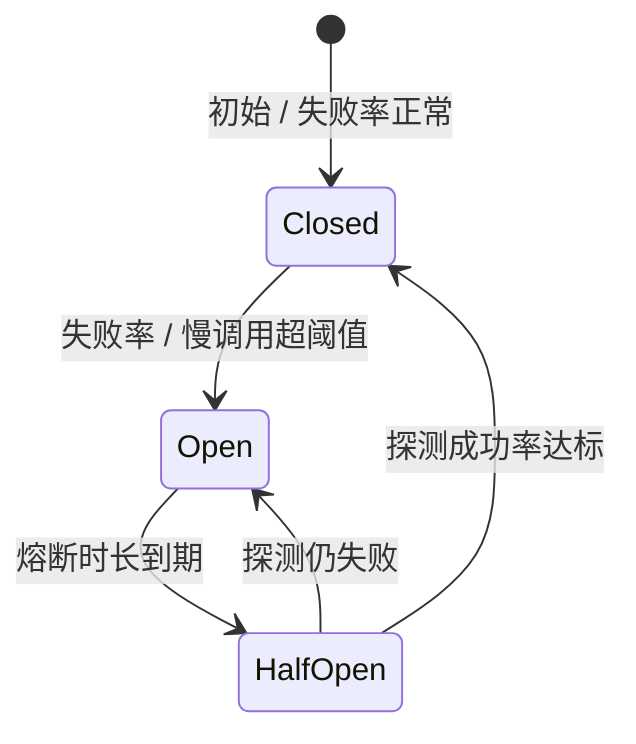
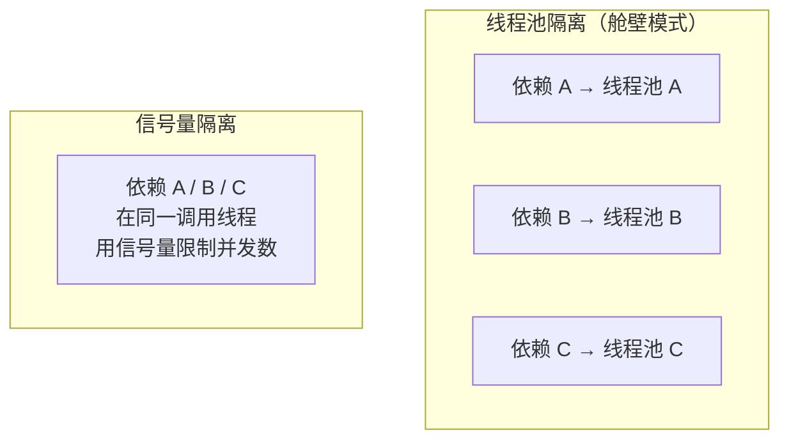

# 服务容错

## 简介

在分布式系统中，服务间的调用可能因网络故障、服务过载等原因失败，需要容错和流量控制机制保障系统稳定性。微服务调用链动辄几十层，任何一个环节故障都可能沿调用链放大，引发**雪崩效应**：

```
服务 A 慢 → 调用方线程堆积 → 线程池耗尽 → 调用方也不可用 → 它的上游继续堆积 → 全链路瘫痪
```

容错机制的目标就是**切断故障传播链**：隔离故障点、快速失败、控制流量入口，把局部故障的影响控制在最小范围。

## 服务容错

### 熔断

熔断器模式（Circuit Breaker）源自电路保险丝：当下游错误率超过阈值时，暂时停止调用直接失败，给下游喘息恢复的机会。

**三态转换：关闭 → 打开 → 半开**

| 状态 | 行为 | 转换条件 |
|------|------|----------|
| 关闭（Closed） | 正常放行请求，统计失败率 | 失败率/慢调用比例超阈值 → 打开 |
| 打开（Open） | 请求直接快速失败（不再调下游） | 熔断时长到期 → 半开 |
| 半开（Half-Open） | 放行少量探测请求 | 探测成功 → 关闭；探测失败 → 打开 |

> **熔断器三态状态机**：关闭、打开、半开之间的转换条件与触发动作。



> **说明**：半开态用少量探测请求试探下游是否恢复，成功则闭合、失败则重新打开。

```java
// Resilience4j 示例
CircuitBreaker breaker = CircuitBreaker.ofDefaults("orderService");
Supplier<String> decorated = CircuitBreaker.decorateSupplier(breaker,
        () -> orderClient.getOrder(id));
String result = Try.ofSupplier(decorated)
        .recover(throwable -> "默认值") // 熔断时走降级
        .get();
```

**关键参数**：失败率阈值（如 50%）、统计窗口（滑动窗口大小）、熔断持续时长、半开状态探测请求数。熔断通常与降级配合：熔断是"触发条件"，降级是"失败后的替代行为"。

### 降级

降级是**牺牲非核心体验保核心功能**的策略：当依赖不可用或系统过载时，返回兜底结果而不是让请求彻底失败。

**常见降级策略**：

| 策略 | 示例 |
|------|------|
| 返回默认值 / 缓存兜底 | 推荐服务挂了，返回热门商品兜底列表 |
| 关闭非核心功能 | 大促时关闭评论、积分、个性化推荐 |
| 简化流程 | 同步改异步、写操作转 MQ 削峰 |
| 只读降级 | 数据库压力大时拒绝写入只保留查询 |

**降级与熔断的区别**：

- **熔断**是被动的、自动的——由下游的失败率触发，作用于"调用关系"；
- **降级**是主动的、预案化的——可由开关人工触发（如大促前主动降级），也可由熔断触发，作用于"业务功能"。

### 超时与重试

**超时设置**：

- 任何远程调用都必须设置超时，防止故障点拖死调用方线程；
- 超时值基于下游 P99 耗时设置并留余量，过短误杀正常请求，过长失去保护意义；
- 沿调用链**外层超时 > 内层超时**，避免外层已放弃、内层还在空耗。

**重试策略与幂等性**：

- 重试应对瞬时故障（网络抖动），但会放大流量，必须克制：限制重试次数（1~2 次）、配合指数退避 + 随机抖动；
- **前提是被调用接口幂等**，否则重试导致重复下单、重复扣款；
- 只对可重试错误重试（超时、连接拒绝、5xx），业务错误（4xx、参数非法）重试无意义；
- 重试 + 熔断要联动：重试失败也计入熔断统计，达到阈值快速熔断。

### 隔离

隔离的目的是**划分资源边界**，让一个慢依赖耗尽的资源不影响其他依赖——即"舱壁模式（Bulkhead）"，像轮船的水密舱一样，一个舱进水不会沉船。

| 隔离方式 | 原理 | 优缺点 |
|----------|------|--------|
| **线程池隔离** | 每个依赖独立线程池，调用提交到对应池执行 | 隔离彻底、可异步，但有线程切换开销、上下文传递麻烦 |
| **信号量隔离** | 用信号量限制并发数，仍在调用方线程执行 | 轻量无切换开销，但无法超时中断（只能限并发） |

实践选择：对响应慢、不稳定的下游用线程池隔离；对高吞吐、低延迟的调用用信号量隔离。此外还有**连接池隔离**（数据源、HTTP 客户端连接池按依赖划分）、**集群隔离**（核心与非核心业务部署独立集群）等更大粒度的手段。

> **两种隔离方式对比**：线程池为每个依赖划分独立资源，信号量在调用线程内限制并发。



> **说明**：慢且不稳定的下游用线程池隔离，高吞吐低延迟的调用用信号量隔离。

> 限流与流量整形细节见 [限流](/contents/microservice/限流.md)

## 常见实现

### Sentinel

阿里开源的流量治理组件，Spring Cloud Alibaba 生态标配：

- **能力**：流控（QPS/并发数、流控效果：快速失败/Warm Up/排队等待）、熔断降级、热点参数限流、系统自适应保护（按 Load/CPU 整体限流）；
- **特点**：规则动态推送（对接 Nacos/Apollo）、Dashboard 实时监控与规则配置、与 OpenFeign/Gateway/Dubbo 集成开箱即用；
- **用法示例**：

```java
@SentinelResource(value = "getOrder",
        blockHandler = "getOrderBlock",     // 限流/熔断时的处理
        fallback = "getOrderFallback")      // 业务异常时的降级
public Order getOrder(Long id) {
    return orderClient.getOrder(id);
}

public Order getOrderBlock(Long id, BlockException ex) {
    return Order.defaultOrder(); // 被流控时的兜底
}
```

### Resilience4j

轻量级函数式容错库，为 Java 8+ 函数式编程设计，是 Hystrix 官方推荐的替代品：

- **模块**：CircuitBreaker（熔断）、RateLimiter（限流）、Retry（重试）、Bulkhead（隔离）、TimeLimiter（超时控制），可按需组合装饰任意函数；
- **特点**：无独立 Dashboard（靠 Micrometer 指标对接 Prometheus/Grafana）、基于 Vavr 函数式风格、配置驱动；
- 与 Spring Boot 集成后用 `@CircuitBreaker(name = "orderService", fallbackMethod = "fallback")` 注解即可使用。

### Hystrix（已停更）

Netflix 开源的容错先驱，熔断、隔离、降级概念的实际推广者：

- 线程池隔离 + 信号量隔离、熔断器、请求缓存与合并（Request Collapsing）；
- **2018 年底进入维护模式不再演进**，官方推荐迁移到 Resilience4j；
- 存量系统仍大量存在，理解 Hystrix 的概念有助于阅读老项目；新系统不应再选用。

**三者对比**：

| 维度 | Sentinel | Resilience4j | Hystrix |
|------|----------|--------------|---------|
| 维护状态 | 活跃 | 活跃 | 停更 |
| 隔离 | 信号量（并发数） | 信号量 + 线程池 | 线程池 + 信号量 |
| 限流 | 丰富（热点、系统保护） | 基础 RateLimiter | 不擅长 |
| 控制台 | 自带 Dashboard | 无（靠 Grafana） | Hystrix Dashboard（过时） |
| 规则动态化 | 支持（对接配置中心） | 配置刷新 | 不支持 |
| 生态 | Spring Cloud Alibaba | Spring Cloud / 通用 | Spring Cloud Netflix（旧） |

## 最佳实践

### 容错策略组合

单一手段不足以应对复杂故障，实践中按调用链分层组合：

```
入口网关：限流（全局 QPS 上限）+ 超时
   ↓
服务间调用：超时 + 重试（幂等接口）+ 熔断 + 降级
   ↓
资源访问：连接池隔离 + 慢 SQL 熔断
```

- **先超时再重试，重试失败触发熔断，熔断引发降级**——这是标准组合拳；
- 每个外部依赖都要想清楚三件事：超时设多少？失败怎么降级？是否需要隔离？
- 依赖分级：核心依赖（必须保，多级兜底）、非核心依赖（可降级可关闭），预案提前写好并演练。

### 限流粒度选择

- **网关层**：全局限流、黑白名单、防刷——粗粒度大流量防护；
- **服务层**：接口级 QPS、并发线程数——保护自身处理能力；
- **业务维度**：按用户/租户/AppKey 限流——防单点恶意流量挤占公共资源；
- 原则：**由粗到细、分层设防**，外层挡住大部分异常流量，内层精细管控；限流阈值来自压测数据（系统拐点），拍脑袋的阈值等于没设。

### 监控与告警

容错机制自身必须可观测，否则"保护是否生效"无从得知：

- **核心指标**：熔断状态变化（开/半开/关）、限流触发次数、降级执行次数、各依赖的错误率与 RT；
- **告警设置**：熔断打开要立即告警（说明下游已有实质故障）；限流持续触发说明容量不足需要扩容或调整阈值；
- **混沌演练**：主动注入故障（杀节点、加延迟、断网络）验证容错配置真实有效——故障游戏日（GameDay）、ChaosBlade / Chaos Mesh 等工具；
- 容错参数不是一次配置永久生效，要随业务量增长和依赖变化定期复盘调整。
