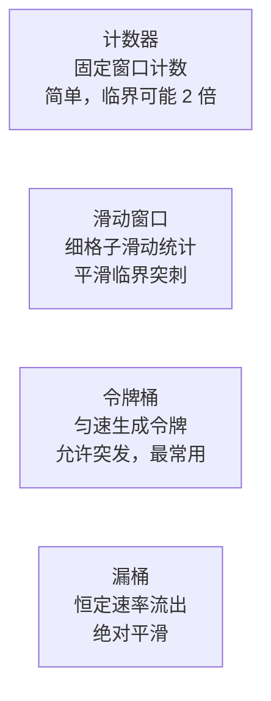
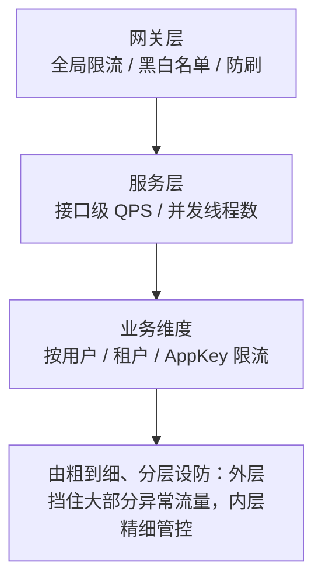
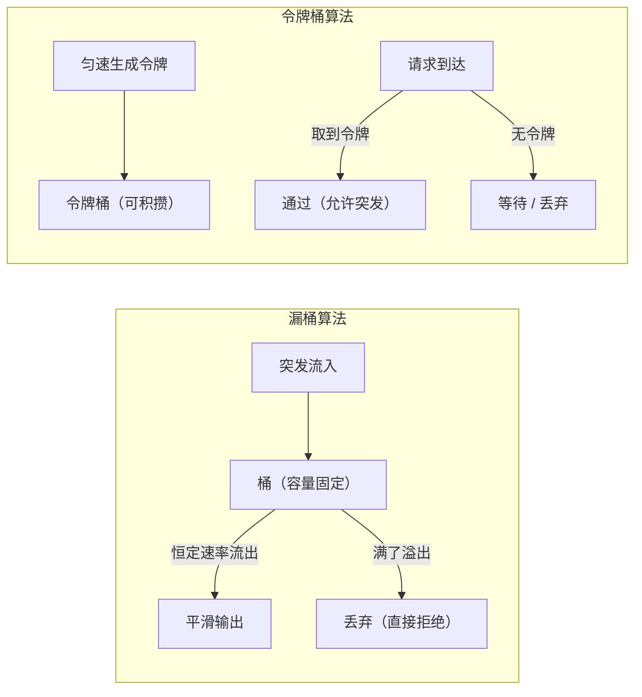

# 限流与流量控制

## 提升并发能力

- **分流**：负载均衡、消息队列、数据库拆分
- **导流**：缓存、CDN
- **并行/并发**：异步处理和多线程编程，批量操作（将多个独立的数据库操作合并成一个批量操作，减少数据库连接的次数和网络开销）

## 限流

限制单位时间通过的请求量，防止系统被突发流量压垮。四种经典算法：

| 算法 | 原理 | 特点 |
|------|------|------|
| **计数器** | 固定窗口内计数，超限拒绝 | 简单，但窗口临界点可能通过 2 倍流量 |
| **滑动窗口** | 窗口细分为小格子滑动统计 | 平滑临界突刺，Sentinel 默认采用 |
| **令牌桶** | 匀速生成令牌，请求拿到令牌才通过 | 允许一定突发（桶中积攒的令牌），最常用 |
| **漏桶** | 请求入桶，以恒定速率流出 | 绝对平滑，但无法利用突发容量 |

> **四种限流算法总览**：计数器、滑动窗口、令牌桶、漏桶的核心思路与各自特征。

> **说明**：Sentinel 默认采用滑动窗口；令牌桶因允许突发最常用于实际限流。

**限流后的处理方式**：直接拒绝（快速失败）、排队等待（匀速通过，漏桶语义）、降级返回兜底。

**限流维度**：网关全局限流 → 单服务接口限流 → 单用户/租户限流（防恶意刷接口），粒度越细实现成本越高，通常自上而下分层设置。

> **限流的分层位置**：从网关全局到服务接口再到业务维度的递进式设防。

> **说明**：粒度越细实现成本越高，阈值应来自压测得到的系统拐点。

### 漏桶算法

漏桶算法可以想象成一个底部带有小孔的水桶。无论流入桶中的水流量多大，水从桶底部小孔流出的速率是固定的。如果流入的水（数据包）超过了桶的容量，多余的水就会溢出，代表丢弃的数据包。因此，漏桶算法主要用于限制数据的平均传输速率。

1. **初始化**：设定一个固定的桶容量（Bucket Size）和固定的漏水速率（Leak Rate）。
2. **数据流入**：数据包持续不断地流入桶中。
3. **数据流出**：桶中的数据以固定的速率流出。
4. **溢出处理**：如果桶满了，多余的数据包会被丢弃。

#### 优点

1. **简单易实现**：算法简单，容易实现。
2. **平滑流量**：可以平滑突发流量，确保数据的平均传输速率。

#### 缺点

1. **丢包现象**：当突发流量超出桶的容量时，会丢弃数据包，可能导致数据丢失。
2. **不灵活**：无法适应突发流量的变化。

### 令牌桶算法

令牌桶算法也模拟了一个桶，但桶中装的是令牌（Tokens），而不是数据。数据包在发送前需要从桶中获取令牌，如果有足够的令牌就可以发送数据包，如果没有足够的令牌，则数据包需要等待或者被丢弃。

1. **初始化**：设定一个固定的桶容量（Bucket Size）和固定的令牌生成速率（Token Rate）。
2. **令牌生成**：以固定的速率向桶中添加令牌，桶的最大容量决定了可以存储的最大令牌数量。
3. **数据发送**：数据包发送前需要从桶中获取令牌，如果桶中有足够的令牌，则数据包可以发送；如果没有足够的令牌，则数据包需要等待或者被丢弃。

#### 优点

1. **灵活性**：可以适应突发流量的变化，允许短时间内发送大量数据包。
2. **平滑流量**：同样可以平滑突发流量，确保数据的平均传输速率。

#### 缺点

1. **复杂度较高**：相对于漏桶算法来说，令牌桶算法的实现稍微复杂一些。
2. **令牌浪费**：在高负载情况下，令牌可能会被浪费（桶满后停止生成令牌）。

#### 漏桶算法 vs 令牌桶算法

- **处理突发流量**：漏桶算法在突发流量超过桶容量时会丢弃数据包，而令牌桶算法允许短时间内发送大量数据包。
- **灵活性**：令牌桶算法更加灵活，可以适应突发流量的变化。
- **实现复杂度**：令牌桶算法相对复杂一些，但可以更好地处理突发流量。

- **漏桶算法**：在突发流量超出桶容量时，漏桶算法会直接丢弃数据包，可能会导致数据丢失。
- **令牌桶算法**：在突发流量超出令牌数量时，令牌桶算法会让数据包等待，直到有足够的令牌可用，这样可以**减少数据丢失**。

漏桶算法和令牌桶算法都是用于流量控制的重要算法。漏桶算法主要用于限制数据的平均传输速率，而令牌桶算法可以更好地处理突发流量。通过合理选择和使用这两种算法，可以有效地管理网络流量，确保系统的稳定性和高效性。

> **漏桶与令牌桶对比**：漏桶恒定流出、满则丢弃，令牌桶积攒令牌、允许短时突发。

> **说明**：漏桶侧重"绝对平滑"，令牌桶侧重"利用突发容量"，按下游特征选择。

### 滑动窗口算法

滑动窗口算法主要用于实时数据流处理、流量控制和异常检测等场景。它通过对一段时间内的数据进行连续监测，可以有效地识别数据流中的模式或异常情况。

1. **初始化窗口**：设定一个固定的时间窗口大小。
2. **数据收集**：在指定的时间窗口内收集数据。
3. **数据处理**：根据窗口内的数据进行相应的处理（如统计、检测等）。
4. **窗口滑动**：随着时间的推移，窗口向前滑动，新的数据进入窗口，旧的数据被移除。

#### 特点

- **实时性**：可以实时处理数据流。
- **灵活性**：可以根据需要调整窗口大小。
- **异常检测**：可以检测数据流中的异常模式。

#### 应用场景

- **流量控制**：监控网络流量，防止突发流量导致的服务过载。
- **异常检测**：检测数据流中的异常模式，如突然增加的访问量。
- **实时统计**：计算最近一段时间内的统计数据，如平均值、最大值等。
- **限流**：限制单位时间内请求的数量，防止恶意请求导致的服务不可用。

滑动窗口算法更多地用于实时数据流处理和异常检测。根据不同的应用场景和技术需求，可以选择合适的方法来解决问题。在实际应用中，有时也会结合多种算法来达到最佳效果。

## 流量整形

流量整形（Traffic Shaping）关注的是**让流量以平稳的速率通过**，而不仅是限住总量：

- 典型实现：漏桶/匀速排队——突发请求被放入队列按固定速率放行，削平尖刺保护下游（如 MQ 消费端的匀速消费）；
- 与限流的区别：限流是"超了就拒绝"，整形是"超了就排队慢慢过"，整形会带来额外延迟，需要设置最大排队时间，超时仍要快速失败；
- 适用场景：写数据库、调第三方限额接口等**下游处理能力恒定**的链路。

## 灰度发布

灰度发布（金丝雀发布）是**控制变更风险**的流量手段：新版本先承接一小部分流量，验证无误后逐步放量。

| 灰度方式 | 规则 | 场景 |
|----------|------|------|
| 按流量比例 | 5% → 20% → 50% → 100% | 通用 |
| 按用户特征 | 内部员工、白名单用户先行 | 新功能试用 |
| 按请求特征 | 指定 Header、地域、设备类型 | 定向验证 |

实现要点：网关或服务网格（Istio）按规则分流；配合监控指标（错误率、延迟对比）决定放量或回滚；**灰度必须与快速回滚能力绑定**，否则灰度只是延迟爆炸。灰度也是功能开关（Feature Flag）的天然搭档：代码已发布，功能按需开启。
