# Kafka

Apache Kafka 是一个分布式流处理平台，它最初由 LinkedIn 开发，并于 2011 年开源，随后成为 Apache Software Foundation 下的一个顶级项目。Kafka 主要用于构建实时数据管道和流处理应用程序，它提供了发布/订阅消息传递服务，具有高吞吐量、可靠性和持久性。

## 简介

### 背景

- Kafka最初由LinkedIn公司开发，使用Scala语言编写，目前是Apache的开源项目。
- 它是一个分布式流媒体平台，提供高吞吐量、低延迟的消息传递机制，适用于大规模数据处理和实时数据流场景。

### 核心组件与概念

1. **Broker**：Kafka服务器，负责消息的存储和转发。在Kafka集群中，每个Broker都是一个独立的节点，可以处理消息的读写操作。
2. **Topic**：消息类别，Kafka按照Topic来分类消息。生产者将消息发送到特定的Topic，消费者则订阅这些Topic以获取消息。
3. **Partition**：Topic的分区，一个Topic可以包含多个Partition。Partition是Kafka实现水平扩展和并行处理的关键。每个Partition都是一个有序的、不可变的记录序列，消息被追加到Partition的末尾，并分配一个唯一的偏移量（Offset）。
4. **Offset**：消息在日志中的位置，代表该消息的唯一序号。消费者通过Offset来定位并读取消息。
5. **Producer**：消息生产者，负责将消息发送到Kafka集群中的特定Topic。
6. **Consumer**：消息消费者，从Kafka集群中订阅特定的Topic，并处理所接收的消息。
7. **Consumer Group**：消费者分组，每个Consumer必须属于一个Group。Kafka会将同一个Topic中的消息分发给同一个Group内的不同Consumer，以实现负载均衡和消息的并行处理。
8. **Zookeeper**：保存Kafka集群的元数据，如Broker、Topic、Partition等信息。同时，Zookeeper还负责Broker故障发现、Partition Leader选举和负载均衡等功能。

> **核心组件关系图**：上面八个概念在一个 Kafka 集群中的对应关系。

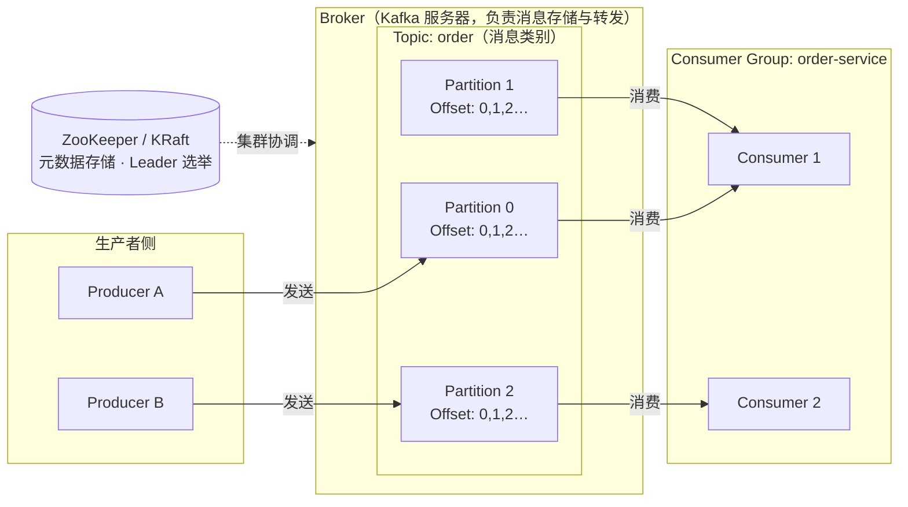

### 主要特点

1. **高吞吐量**：Kafka能够处理非常高的消息吞吐量，适用于大规模数据处理和实时数据流场景。
2. **低延迟**：Kafka具有较低的消息传递延迟，能够提供快速的消息传递服务。
3. **可伸缩性**：Kafka可以水平扩展，通过增加更多的节点来扩展处理能力和存储容量。
4. **持久性**：Kafka使用磁盘存储消息，确保消息的持久性和可靠性。
5. **高可靠性**：Kafka通过副本机制保证消息的可靠性，即使某些节点发生故障，也不会丢失消息。
6. **分区与并行处理**：Kafka的消息被分成多个分区，每个分区可以在不同的服务器上进行写入和读取，提高了并发性能。

### 适用场景

1. **实时数据流处理**：如实时日志处理、实时监控、实时推荐等。
2. **分布式日志集中存储**：用于收集、存储和分发日志数据，如应用日志、操作日志、系统日志等。
3. **数据集成和数据管道**：作为数据集成和数据管道的中间件，在不同系统之间传递数据。
4. **消息队列和事件驱动架构**：作为消息队列使用，处理异步消息和事件驱动的架构。
5. **大数据处理和流处理**：与大数据处理框架如Hadoop、Spark、Flink等集成，支持大规模数据的处理和分析。

### 优缺点

- **优点**：高吞吐量、低延迟、可伸缩性、持久性、高可靠性、分区与并行处理。
- **缺点**：扩容操作相对复杂、依赖Zookeeper（KRaft模式已解决）、跨分区消息顺序性无法保证。

### 生态系统

- **Kafka Connect**：用于构建和运行可靠的流式数据管道。
- **Kafka Streams**：用于构建流处理应用程序和服务。
- **Kafka MirrorMaker**：用于在 Kafka 集群之间复制数据。
- **Schema Registry**：用于管理和验证 Avro、JSON 等数据格式的模式。

## 架构与存储

> **数据流图**：一条消息从生产、存储到消费的完整链路，后续小节依次拆解其中各环节。

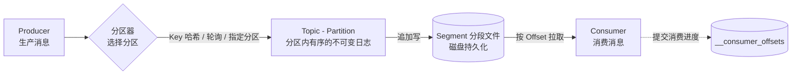

### 集群架构

> **集群架构全景图**：生产/消费端连接任意 Broker，集群元数据由 ZooKeeper 或 KRaft 管理。

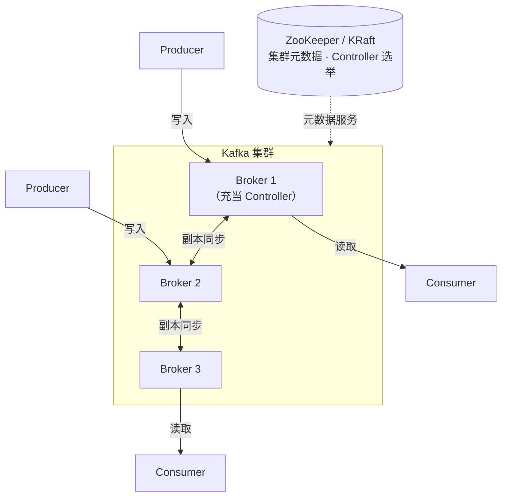

- **Controller**：集群中某个Broker充当Controller角色，负责Partition Leader选举、Broker上下线处理
- **ZooKeeper / KRaft**：维护集群元数据，Kafka 3.x 开始支持KRaft模式替代ZooKeeper

### 日志存储结构

每个Partition在磁盘上对应一个目录，包含多个Segment文件：

> **日志存储层次图**：Topic → Partition → Segment → 三类文件的层级关系。

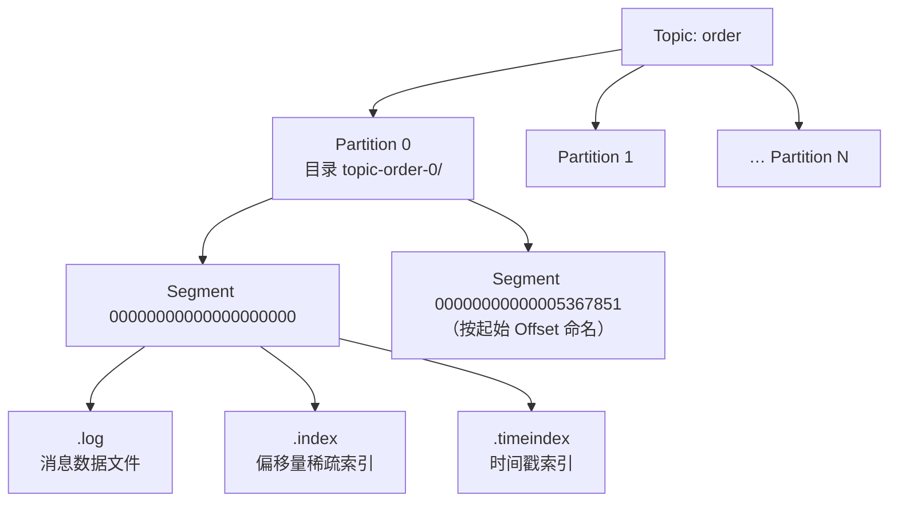

- **Segment**：Partition按大小（默认1GB）或时间切分为多个Segment，便于日志清理和查找
- **Offset Index**：稀疏索引，每4KB记录一条，用于快速定位消息位置
- **Time Index**：按时间戳索引，支持按时间消费

#### 日志清理策略

Kafka 的消息不会永久保留，通过两种策略清理旧数据：

| 策略 | 机制 | 适用场景 |
| --- | --- | --- |
| **delete（默认）** | 按保留时间（`log.retention.hours`，默认 168h/7 天）或日志大小（`log.retention.bytes`）删除最旧的 Segment | 日志、事件流等一次性消费的数据 |
| **compact（压缩）** | 按 Key 只保留每个 Key 的最新一条消息，旧版本被清理 | 配置变更、用户状态等「只关心最新值」的数据 |

> **注意**：两种策略可同时启用。`compact` 清理的是旧版本消息，消息的 Offset 不会重用（永远递增），消费者依然按 Offset 定位消息。

### 高性能原理

| 技术 | 说明 |
| --- | --- |
| **顺序写** | 消息追加到日志末尾，无需随机写磁盘，速度接近内存写 |
| **零拷贝** | 使用 `sendfile()` 系统调用，数据从磁盘直接到网卡，不经过用户空间 |
| **页缓存** | 利用OS的Page Cache，写入先到内存再批量刷盘，读取直接命中缓存 |
| **批量压缩** | 生产者批量发送，减少网络IO次数；支持gzip/snappy/lz4/zstd压缩 |
| **分区分段** | 并行读写，Segment便于日志清理和查找 |

> **零拷贝数据路径对比**：消费快的关键——`sendfile()` 让数据从页缓存直达网卡，不经过用户空间。

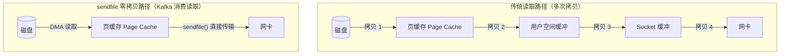

## 分区与副本

### 分区策略

生产者发送消息时，决定消息进入哪个Partition：

| 策略 | 说明 | 适用场景 |
| --- | --- | --- |
| 指定Partition | 直接指定分区号 | 需要精确控制 |
| Key哈希 | 相同Key的消息进入同一分区（`hash(key) % partitions`） | 需要保序的消息 |
| 轮询（默认） | Round Robin分配 | 无序要求，均匀分布 |
| 自定义分区器 | 实现 `Partitioner` 接口 | 业务规则分区 |

> **分区选择决策流程图**：生产者发送消息时选择分区的判定路径。

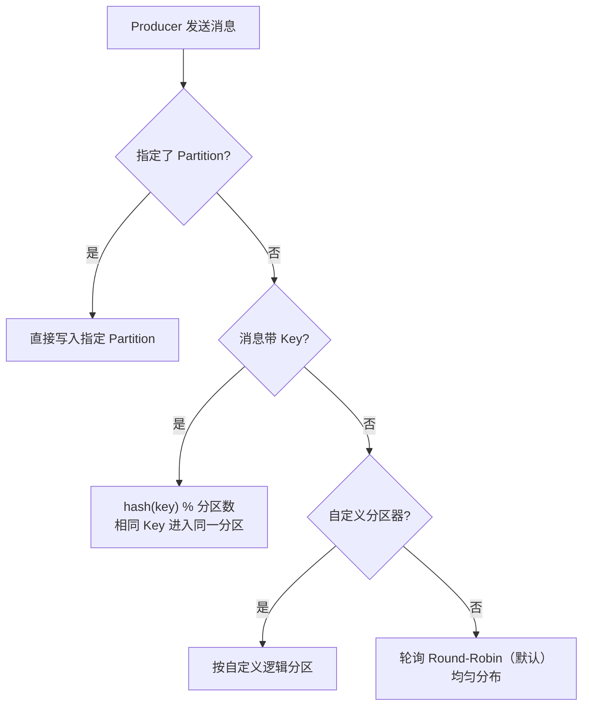

> **注意**：Key相同保证同一分区有序，但不保证跨分区有序。如果分区数发生变化，Key的映射关系会改变。

#### 分区数如何选择

- **估算公式**：`分区数 ≈ 目标吞吐量 ÷ 单分区吞吐量`（单分区吞吐受网络、磁盘、消费逻辑影响，需压测验证）
- **消费者并发上限**：一个分区的消息最多被组内一个消费者消费，**消费者数量 = 分区数时并发最高**；想提高消费并行度，必须先增加分区
- **分区过多的代价**：文件句柄过多（每个分区一批 Segment 文件）、元数据膨胀、Leader 选举与故障恢复变慢（副本同步要在更多分区上完成）、Rebalance 耗时增加

> 实践建议：按峰值吞吐 × 3 预估分区数，留出扩消费者余量；分区数**只能增加不能减少**（`kafka-topics.sh --alter`），且增加后 Key 哈希路由会变化，改分区前要评估对顺序性的影响。

### 副本机制

每个Partition有多个副本（Replica），分布在不同Broker上：

- **Leader Replica**：处理该分区所有读写请求
- **Follower Replica**：从Leader拉取数据同步，不处理客户端请求
- **ISR（In-Sync Replicas）**：与Leader保持同步的副本集合，包含Leader自身

**Leader选举**：当Leader宕机时，从ISR中选出一个Follower成为新Leader。

**副本同步流程**：

> **副本同步与 ISR 机制**：Follower 主动从 Leader 拉取数据保持同步，跟得上的副本留在 ISR 集合中。

<svg viewBox="0 0 800 470" width="100%" role="img" aria-label="副本同步与 ISR 机制" xmlns="http://www.w3.org/2000/svg" style="max-width:800px;height:auto" font-family="system-ui,-apple-system,'Segoe UI','PingFang SC','Microsoft YaHei',sans-serif">
<defs>
<marker id="arrGray" viewBox="0 0 10 10" refX="9" refY="5" markerWidth="7" markerHeight="7" orient="auto"><path d="M0,0 L10,5 L0,10 z" fill="#64748b"/></marker>
<marker id="arrBlue" viewBox="0 0 10 10" refX="9" refY="5" markerWidth="7" markerHeight="7" orient="auto"><path d="M0,0 L10,5 L0,10 z" fill="#2563eb"/></marker>
<marker id="arrPurple" viewBox="0 0 10 10" refX="9" refY="5" markerWidth="7" markerHeight="7" orient="auto"><path d="M0,0 L10,5 L0,10 z" fill="#8b5cf6"/></marker>
<marker id="arrRed" viewBox="0 0 10 10" refX="9" refY="5" markerWidth="7" markerHeight="7" orient="auto"><path d="M0,0 L10,5 L0,10 z" fill="#e11d48"/></marker>
<filter id="cardShadow" x="-8%" y="-8%" width="116%" height="116%"><feDropShadow dx="0" dy="2" stdDeviation="4" flood-color="#0f172a" flood-opacity="0.10"/></filter>
</defs>
<rect x="0" y="0" width="800" height="470" rx="14" fill="#ffffff" stroke="#e2e8f0"/>
<g filter="url(#cardShadow)">
<rect x="205" y="30" width="270" height="175" rx="12" fill="#f8fafc" stroke="#cbd5e1" stroke-width="1.5"/>
<text x="217" y="52" font-size="12" font-weight="700" fill="#475569">Broker A</text>
<rect x="225" y="65" width="130" height="60" rx="8" fill="#dbeafe" stroke="#3b82f6" stroke-width="1.5"/>
<text x="290" y="88" font-size="13.5" font-weight="700" fill="#1e3a8a" text-anchor="middle">Leader Replica</text>
<text x="290" y="108" font-size="11" fill="#1d4ed8" text-anchor="middle">处理该分区读写请求</text>
<rect x="375" y="65" width="82" height="60" rx="8" fill="#fffbeb" stroke="#f59e0b" stroke-width="1.5"/>
<text x="416" y="88" font-size="12.5" font-weight="700" fill="#92400e" text-anchor="middle">本地日志</text>
<text x="416" y="108" font-size="10.5" fill="#b45309" text-anchor="middle">LEO 同步位置</text>
</g>
<g filter="url(#cardShadow)">
<rect x="205" y="235" width="270" height="175" rx="12" fill="#f8fafc" stroke="#cbd5e1" stroke-width="1.5"/>
<text x="217" y="257" font-size="12" font-weight="700" fill="#475569">Broker B</text>
<rect x="225" y="270" width="130" height="60" rx="8" fill="#dcfce7" stroke="#16a34a" stroke-width="1.5"/>
<text x="290" y="293" font-size="13.5" font-weight="700" fill="#14532d" text-anchor="middle">Follower Replica</text>
<text x="290" y="313" font-size="11" fill="#15803d" text-anchor="middle">不处理客户端请求</text>
<rect x="375" y="270" width="82" height="60" rx="8" fill="#fffbeb" stroke="#f59e0b" stroke-width="1.5"/>
<text x="416" y="293" font-size="12.5" font-weight="700" fill="#92400e" text-anchor="middle">本地日志</text>
<text x="416" y="313" font-size="10.5" fill="#b45309" text-anchor="middle">LEO 同步位置</text>
</g>
<rect x="30" y="190" width="140" height="58" rx="9" fill="#f1f5f9" stroke="#64748b" stroke-width="1.5"/>
<text x="100" y="214" font-size="15" font-weight="700" fill="#0f172a" text-anchor="middle">Producer</text>
<text x="100" y="234" font-size="11.5" fill="#475569" text-anchor="middle">生产消息</text>
<g filter="url(#cardShadow)">
<rect x="520" y="140" width="250" height="160" rx="10" fill="#f5f3ff" stroke="#8b5cf6" stroke-width="1.5"/>
<text x="535" y="160" font-size="10" fill="#7c3aed">In-Sync Replicas</text>
<text x="535" y="184" font-size="14" font-weight="700" fill="#5b21b6">ISR 同步副本集合</text>
<line x1="530" y1="196" x2="760" y2="196" stroke="#ddd6fe" stroke-width="1"/>
<text x="535" y="218" font-size="12" fill="#4c1d95">✓ Leader（含自身）</text>
<text x="535" y="242" font-size="12" fill="#4c1d95">✓ Follower（跟得上同步）</text>
<text x="535" y="266" font-size="11.5" fill="#9333ea">✗ 落后过多会被移出 ISR</text>
</g>
<g stroke-linecap="round" stroke-linejoin="round">
<path d="M170,219 H200 V95 H222" fill="none" stroke="#64748b" stroke-width="1.8" marker-end="url(#arrGray)"/>
<path d="M355,95 H375" fill="none" stroke="#64748b" stroke-width="1.8" marker-end="url(#arrGray)"/>
<path d="M355,300 H375" fill="none" stroke="#64748b" stroke-width="1.8" marker-end="url(#arrGray)"/>
<path d="M290,270 V128" fill="none" stroke="#2563eb" stroke-width="2.2" marker-end="url(#arrBlue)"/>
<path d="M457,95 H490 V170 H520" fill="none" stroke="#8b5cf6" stroke-width="1.8" stroke-dasharray="6,4" marker-end="url(#arrPurple)"/>
<path d="M457,300 H490 V230 H520" fill="none" stroke="#8b5cf6" stroke-width="1.8" stroke-dasharray="6,4" marker-end="url(#arrPurple)"/>
<path d="M545,300 V420 H295 V332" fill="none" stroke="#e11d48" stroke-width="2" stroke-dasharray="6,4" marker-end="url(#arrRed)"/>
</g>
<g>
<rect x="200" y="206" width="56" height="14" rx="3" fill="#ffffff" stroke="#cbd5e1" stroke-width="0.8"/>
<text x="228" y="216" font-size="10.5" fill="#475569" text-anchor="middle">发送消息</text>
<rect x="297" y="178" width="78" height="18" rx="3" fill="#ffffff" stroke="#bfdbfe" stroke-width="0.8"/>
<text x="336" y="191" font-size="11.5" font-weight="700" fill="#1d4ed8" text-anchor="middle">Pull 拉取</text>
<rect x="297" y="200" width="100" height="14" rx="3" fill="#ffffff" stroke="#cbd5e1" stroke-width="0.8"/>
<text x="347" y="210" font-size="10" fill="#64748b" text-anchor="middle">Follower 主动发起</text>
<text x="494" y="126" font-size="11" fill="#7c3aed" writing-mode="vertical-rl">同步进度</text>
<text x="494" y="234" font-size="11" fill="#7c3aed" writing-mode="vertical-rl">同步进度</text>
<rect x="308" y="414" width="226" height="14" rx="3" fill="#ffffff" stroke="#fecdd3" stroke-width="0.8"/>
<text x="421" y="424" font-size="11" font-weight="600" fill="#be123c" text-anchor="middle">Leader 宕机时从 ISR 选举新 Leader</text>
</g>
</svg>

### 副本因子与可靠性

| `acks` 配置 | 行为 | 可靠性 | 吞吐量 |
| --- | --- | --- | --- |
| `acks=0` | 发送后不等响应 | 最低，可能丢数据 | 最高 |
| `acks=1` | Leader写入即返回 | 中等，Leader宕机可能丢 | 中等 |
| `acks=all` | 所有ISR副本写入才返回 | 最高，不丢数据 | 最低 |

#### 消息投递语义（at-most-once / at-least-once / exactly-once）

Kafka 提供三种投递语义，取决于**生产端 acks 配置**与**消费端 Offset 提交时机**的组合：

| 语义 | 生产端 | 消费端 | 说明 |
| --- | --- | --- | --- |
| **at-most-once** | 任意 | 消费前提交 / 自动提交 | 最多一次：可能丢消息，不重复 |
| **at-least-once** | `acks=all` | 消费成功后提交 | 至少一次：不丢消息，但**可能重复消费**（生产默认） |
| **exactly-once** | 幂等 + 事务 | `isolation.level=read_committed` | 精确一次：跨 Partition 原子写入 + 只读已提交消息 |

> 工程现实：端到端 exactly-once 很难，因为下游（数据库、Redis、外部系统调用）不感知 Kafka 事务。生产环境普遍采用 **at-least-once + 消费端幂等** 的组合，把「重复」交给业务去重兜底。

#### 消息不丢失：端到端三段式保障

Kafka 不丢消息需要**生产、存储、消费**三个环节同时保证，缺一环都可能丢：

> **消息不丢失的三段式保障链路**：每一环节对应一组关键配置，组合使用才能端到端不丢。

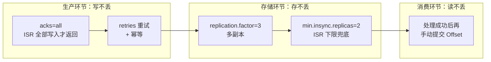

| 环节 | 保障手段 | 关键点 |
| --- | --- | --- |
| 生产者 | `acks=all` + `retries` | 等待 ISR 全部写入成功才返回；失败自动重试 |
| Broker 存储 | `replication.factor≥3` + ISR + `min.insync.replicas=2` | 允许 1 个 Broker 宕机不丢；ISR 不足时拒绝写入而非降级 |
| 消费者 | 处理成功后再 `commitSync()` | **先处理后提交**：提交了但没处理完 = 丢消息 |

> 注意：`acks=all` 只保证「消息写进 ISR」，不保证「消费者一定拿到」——消费环节的丢失（如自动提交）同样会造成消息丢失。

#### HW 与 LEO：Leader 切换为什么会丢数据

**LEO（Log End Offset）** 是日志已写到的位置（最新消息的下一条），**HW（High Watermark，高水位）** 是 ISR 中所有副本**都已完成同步**的位置——消费者只能读取 HW 之前的消息，HW 之后的数据对消费者不可见。

> **Leader 切换时 HW 截断导致丢数据**：`acks=all` 返回成功，但 Follower 尚未同步完成时 Leader 宕机，未同步数据被截断。

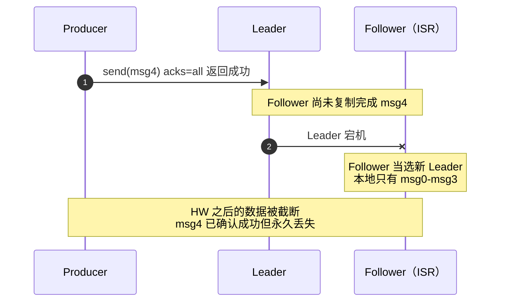

**为什么 `acks=all` 仍可能丢数据**：`acks=all` 返回时，消息只保证写入了当时 ISR 内的副本。若 Leader 在 Follower 完成同步前宕机，新 Leader（原 Follower）日志更短，会把 Leader 本地 HW 之后的「未同步数据」**截断丢弃**——这些消息虽已返回成功，但消费者永远读不到。

**ISR 为空时的取舍**：

| 配置 | 行为 | 影响 |
| --- | --- | --- |
| `unclean.leader.election.enable=false`（推荐） | 只允许 ISR 内副本当选 | 不丢数据，但 ISR 全部宕机时分区不可用 |
| `unclean.leader.election.enable=true` | 允许非 ISR 副本当选 | 快速恢复可用，但**会丢数据**（该副本可能严重滞后） |

> 一句话：**HW 是「已确认且可见」的分界线；unclean 选举是「保可用还是保数据」的取舍开关**。

## 核心概念深入

Kafka 的概念容易混淆，根源在于它们处在不同的「级别」上：有的属于整个集群，有的属于某个服务进程，有的属于某个分区。先把级别厘清，大多数「谁管谁」的问题就自然有了答案。

### 概念的三个级别

> **概念级别分布图**：Controller 是集群级的唯一角色；Leader 是分区级角色，分散在不同的 Broker 上。

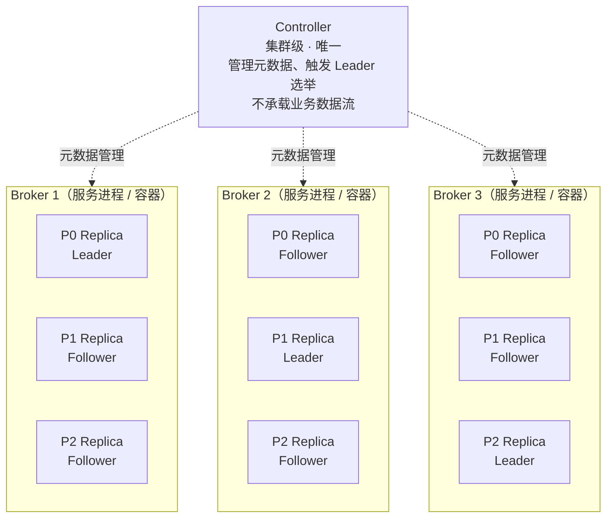

- **集群级**：整个集群只有一个 Controller（KRaft 模式下为多个 Controller 节点组成 Quorum，由 Active 节点主导），负责元数据管理、Partition Leader 选举、Broker 上下线处理；它不承载业务数据流，客户端也不直接连接它
- **Broker 级**：Broker 只是一个服务进程，是「容器」——一个 Broker 可以同时承载成千上万个分区，对其中一部分它是 Leader，对另一部分它是 Follower
- **分区级**：每个 Partition 独立选举自己的 Leader；Leader / Follower / ISR 都是绑定在分区副本（Replica）上的概念

### 常见辨析

Kafka 的概念容易产生混淆，最有代表性的是下面这些「一对对」的概念。把它们放在一起对比，比单独记定义更不易混淆。

#### Leader 是分区级的，不是 Broker 级的

**这是理解 Kafka 架构最关键的一点。**

- **归属关系**：Leader 的身份绑定在具体的 **Partition Replica（分区副本）** 上，而不是绑定在 Broker 进程上
- **粒度**：一个 Topic 有多个 Partition，每个 Partition 独立选举自己的 Leader
- **Broker 的角色**：Broker 只是一个「容器」。一个 Broker 可以同时承载成千上万个 Partition，其中一部分它是 Leader，另一部分它是 Follower

**直观示例**：集群有 3 个 Broker，Topic `orders` 有 3 个分区：

| Partition | Leader Broker | Follower Brokers | 说明 |
| :--- | :--- | :--- | :--- |
| P0 | **Broker-1** | Broker-2, Broker-3 | Broker-1 是 P0 的 Leader |
| P1 | **Broker-2** | Broker-3, Broker-1 | Broker-2 是 P1 的 Leader |
| P2 | **Broker-3** | Broker-1, Broker-2 | Broker-3 是 P2 的 Leader |

> **结论**：没有任何一个 Broker 是「全局 Leader」。每个 Broker 都是某些分区的 Leader，同时也是其他分区的 Follower。这种设计正是 Kafka 能够**水平扩展**和**负载均衡**的根本原因。当你问「Leader Broker」时，本质上是在问「哪个 Broker 当前是某个特定 Partition 的 Leader」，而非「哪个 Broker 是整个集群的老大」。

#### Leader 与 Controller 的区别

集群级别的「领导」角色是 Controller，它确实存在且集群唯一，但职责与 Partition Leader 完全不同：

| 对比项 | Partition Leader | Controller |
| :--- | :--- | :--- |
| **级别** | Partition 级 | Cluster 级 |
| **数量** | 每个 Partition 一个 | 集群仅一个（KRaft 模式下为 Controller Quorum） |
| **职责** | 处理客户端读写请求、数据同步 | 管理元数据、触发 Leader 选举、分配副本 |
| **数据面** | 承载实际业务数据流 | 不承载业务数据流 |
| **对客户端** | 可见，客户端直连 | 不可见，客户端不直接与 Controller 通信 |

> **一句话总结**：**Leader 管数据（Partition 级），Controller 管元数据（Cluster 级）。**

#### Rebalance 与 Leader 选举：两种不同的「重选」

两者都涉及「重新选举/分配」，但完全是不同级别的事情：

| 对比项 | Leader 选举 | Rebalance |
| :--- | :--- | :--- |
| **级别** | 分区副本级（Broker 侧） | 消费者组级（消费侧） |
| **触发** | Leader 宕机、ISR 变化 | 消费者加入/离开、心跳超时、分区数变化 |
| **主持者** | Controller | Group Coordinator（某个 Broker） |
| **结果** | 从 ISR 中选出新的 Leader 副本 | 重新分配分区与消费者的映射 |
| **影响范围** | 该分区的读写 | 组内所有消费者停止消费（短暂 STW） |

#### 分区有序性：分区内有序，跨分区无序

- Kafka 只保证**同一分区内**的消息是「有序的、不可变的记录序列」；**跨分区之间没有顺序可言**
- 相同 Key 的消息通过 `hash(key) % 分区数` 路由到同一分区——这是业务上保序的唯一手段
- 如果必须全局有序：Topic 只建一个分区，但会失去分区带来的吞吐与并行能力

#### Offset 与 Lag

- **日志最新位点（LEO，Log End Offset）**：分区日志当前已写到的位置
- **已提交 Offset**：消费者消费到并成功提交的位置（存储在 `__consumer_offsets` 内部 Topic）
- **Lag = LEO − 已提交 Offset**：衡量消费积压，Lag 持续增大说明消费速度跟不上生产速度
- `auto.offset.reset`（earliest/latest）只在消费者组没有已提交 Offset 时生效（首次消费或 Offset 已过期）

#### acks=all 等的是 ISR，不是全部副本

- `acks=all` 表示「**ISR 内**所有副本写入完成才返回」，而不是全部副本——落后太多被移出 ISR 的副本不在等待范围内
- 风险：若 ISR 收缩到只剩 Leader，`acks=all` 退化为 `acks=1` 的效果
- `min.insync.replicas` 兜底：ISR 数量低于该值时，Broker 直接拒绝写入（抛出 NotEnoughReplicas），宁可不写也不降低可靠性
- 经典可靠性配置：`replication.factor=3` + `min.insync.replicas=2` + `acks=all`——允许 1 个 Broker 宕机而不丢数据

## 消费者组

### 消费者组机制

- 同一Consumer Group内的消费者共同消费一个Topic的所有Partition
- 每个Partition只被组内一个消费者消费（确保消息不重复）
- 消费者数量超过Partition数时，多余消费者空闲

> **消费者组分区分配图**：每个 Partition 只被组内一个消费者消费，消费者多于分区时多出的消费者空闲。

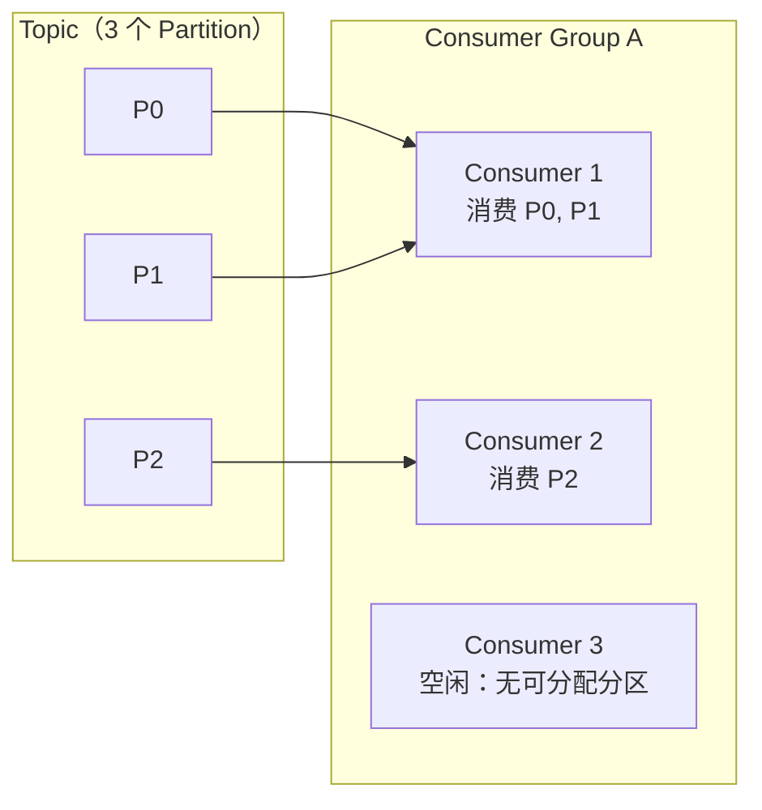

### Rebalance

当消费者加入/离开Group，或Partition数变化时，触发Rebalance——重新分配Partition与消费者的映射关系。

> **Rebalance 时序图**：由 Group Coordinator 协调，重新分配期间所有消费者停止消费（短暂 STW）。

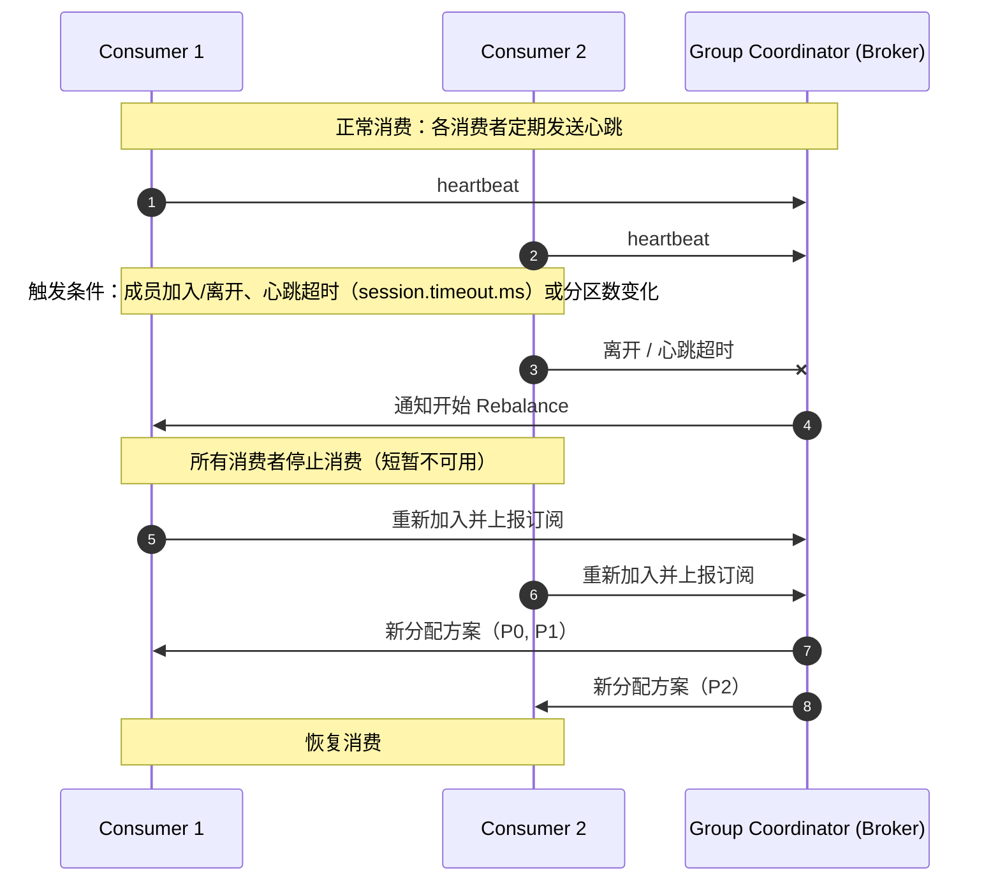

**Rebalance触发条件：**
- 消费者加入或离开Group
- 消费者心跳超时（`session.timeout.ms`）
- 订阅的Topic分区数变化

**Rebalance的问题**：期间所有消费者停止消费，造成短暂不可用。可通过以下方式减少影响：
- 调大 `session.timeout.ms`（默认10s）和 `heartbeat.interval.ms`（默认3s）
- 使用 `StickyAssignor` 分配策略，尽量保持原有分配

### 分区分配策略

| 策略 | 说明 |
| --- | --- |
| RangeAssignor（默认） | 按Partition编号范围连续分配给消费者 |
| RoundRobinAssignor | 轮询分配，跨Topic均匀分布 |
| StickyAssignor | 尽量保持原有分配，Rebalance时最少移动 |

### Offset管理

- **自动提交**：`enable.auto.commit=true`，定期提交（`auto.commit.interval.ms`，默认5s），可能丢消息或重复消费
- **手动提交**：`enable.auto.commit=false`，处理完消息后调用 `commitSync()` 或 `commitAsync()`
- **存储位置**：Kafka 0.9+ 默认存储在 `__consumer_offsets` 内部Topic中

#### 消息积压（Lag）排查与处理

先用 `kafka-consumer-groups.sh --describe --group <group>` 查看各分区 Lag，Lag 持续增大说明**消费速度 < 生产速度**。

> **消息积压处理决策流程**：先定位瓶颈在「并发不足 / 分区不足 / 消费过慢」哪一环，再选对应方案。

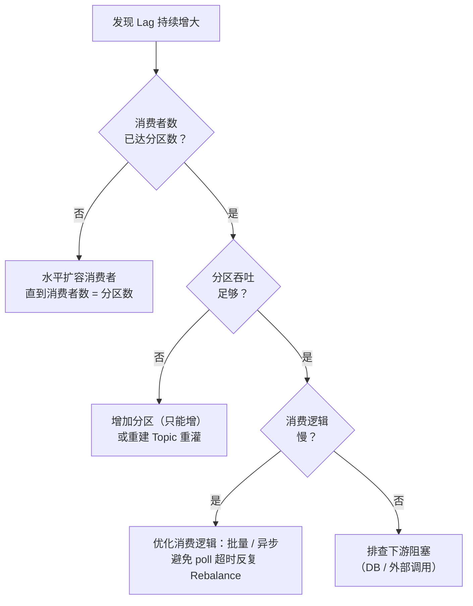

处理手段汇总：

| 手段 | 说明 |
| --- | --- |
| 扩容消费者 | 消费者数 ≤ 分区数，先扩到与分区数持平 |
| 增加分区 | `--alter --partitions` 只能增加；改分区数后 Key 路由变化，注意对顺序性的影响 |
| 重建 Topic 重灌 | 用更大分区数的新 Topic，消费者切换消费，适合积压巨大场景 |
| 临时丢消息 | 积压过大且业务可容忍时，重置 Offset 跳过旧消息（`--reset-offsets --to-latest`） |
| 排查消费者 | 处理耗时、`max.poll.interval.ms` 超时反复触发 Rebalance、下游阻塞 |

## 生产者与消费者

### 生产者核心配置

```properties
# Broker地址
bootstrap.servers=localhost:9092
# Key序列化器
key.serializer=org.apache.kafka.common.serialization.StringSerializer
# Value序列化器
value.serializer=org.apache.kafka.common.serialization.StringSerializer
# ACK确认级别 (0/1/all)
acks=all
# 重试次数
retries=3
# 批量发送大小（字节）
batch.size=16384
# 批量等待时间（毫秒）
linger.ms=5
# 缓冲区大小
buffer.memory=33554432
```

### 消费者核心配置

```properties
# Broker地址
bootstrap.servers=localhost:9092
# 反序列化器
key.deserializer=org.apache.kafka.common.serialization.StringDeserializer
value.deserializer=org.apache.kafka.common.serialization.StringDeserializer
# 消费者组ID
group.id=order-service
# 自动提交Offset
enable.auto.commit=false
# 消费起始位置（earliest/latest/none）
auto.offset.reset=earliest
# 一次拉取最大记录数
max.poll.records=500
# 两次poll最大间隔（超过则触发Rebalance）
max.poll.interval.ms=300000
```

#### Kafka 为什么用 Pull 而不是 Push

核心区别见下表：

| 对比项 | Pull（Kafka） | Push（如 RabbitMQ） |
| --- | --- | --- |
| 消费速度控制 | 消费者自主拉取，量力而行 | Broker 推送，需感知消费者处理能力 |
| Broker 复杂度 | 无状态，不关心消费者状态 | 需维护推送状态，易把慢消费者「推爆」 |
| 吞吐 | 支持批量拉取（`fetch.min.bytes` / `max.poll.records`），吞吐高 | 逐条推送开销大 |
| 延迟 | 空轮询有额外延迟，用长轮询（`fetch.wait.max.ms`）缓解 | 实时性更好 |

> 面试一句话：Pull 让**消费者掌握消费节奏**，Broker 保持简单无状态，配合批量拉取实现高吞吐；代价是空轮询延迟，Kafka 用长轮询把「拉不到数据时挂起等待」来缓解。

### Exactly-Once 语义

Kafka 通过幂等性（Idempotence）和事务（Transaction）实现 Exactly-Once：

**幂等性生产者**（防止生产者重试导致重复）：

```properties
enable.idempotence=true
```

每个Producer分配一个PID，Broker通过 `<PID, Partition, SeqNum>` 去重。

**事务**（跨Partition原子写入）：

> **Exactly-Once 事务时序图**：事务 Producer 注册 PID 后开启事务，Broker 依 `<PID, Partition, SeqNum>` 幂等去重。

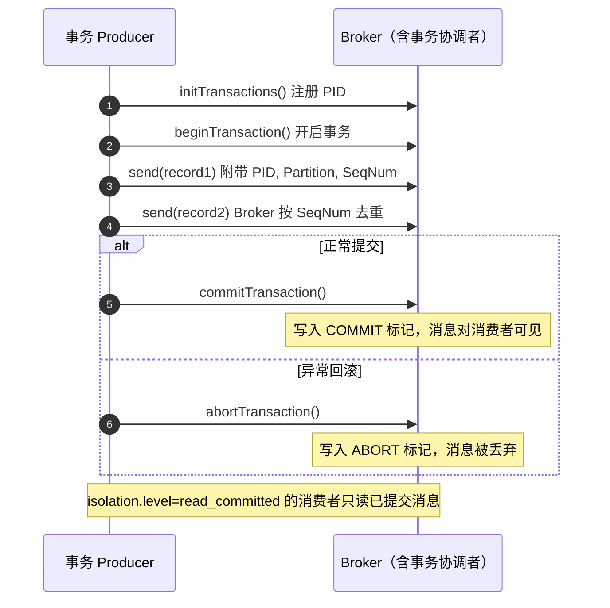

```java
producer.initTransactions();
try {
    producer.beginTransaction();
    producer.send(record1);
    producer.send(record2);
    producer.commitTransaction();
} catch (Exception e) {
    producer.abortTransaction();
}
```

#### 消费端幂等：重复消费的兜底方案

at-least-once 语义下，重复消费无法从 MQ 层面消除，只能靠业务幂等兜底：

| 方案 | 做法 | 适用场景 |
| --- | --- | --- |
| 唯一键 / 唯一索引 | 消息带业务唯一 ID（如订单号），写入冲突则忽略 | 数据库写入类消费 |
| Redis SETNX | 以消息 ID 为 key 设置标记，设置成功才处理 | 高并发、非强事务场景 |
| 状态机判断 | 处理前检查当前状态，只处理「允许流转」的消息 | 有明确状态流转的业务 |
| 去重表 | 消费前先查去重表，已处理过直接跳过 | 通用兜底 |

> 配合建议：消费逻辑**先查重再处理**，处理与标记（写库 / 写 Redis）尽量放在同一事务或原子操作中，避免「处理了但没标记」造成重复。

## Kafka 3.x 新特性

### KRaft 模式

Kafka 2.8 开始引入 KRaft（Kafka Raft），3.3 标记为生产可用，完全移除 ZooKeeper 依赖：

| 对比项 | ZooKeeper 模式 | KRaft 模式 |
| --- | --- | --- |
| 元数据存储 | ZooKeeper 集群 | Kafka 内部 Topic `__cluster_metadata` |
| Controller选举 | ZooKeeper 临时节点 | Raft 协议选举 |
| 运维复杂度 | 需额外维护ZK集群 | 只需维护Kafka集群 |
| Partition数支持 | 数万级 | 数百万级 |
| 启动速度 | 分钟级 | 秒级 |

#### `process.roles`：两种部署形态

KRaft 的 Controller 是否独立部署，由 `process.roles` 决定：

| 部署形态 | `process.roles` 取值 | 说明 |
| --- | --- | --- |
| 混合模式（Combined） | `broker,controller` | 同一进程同时承担 Broker 和 Controller 两种角色，适合开发/小集群 |
| 隔离模式（Isolated） | Controller 节点配 `controller`、Broker 节点配 `broker` | 两种角色分开进程部署，生产环境推荐 |

生产环境推荐隔离模式的原因：

- **资源画像不同**：Broker 重磁盘 I/O，Controller 对延迟敏感，混跑时 I/O 抖动可能干扰 Controller 选举
- **伸缩独立**：Controller 数量固定（3 或 5 个），Broker 随业务自由扩缩容
- **故障隔离**：Broker 故障不影响元数据面，反之亦然

#### Controller Quorum

所有 Controller 节点组成一个 **Quorum**（用 Raft 协议管理的副本组）：

- 通常配置 **3 或 5 个** Controller（奇数），`controller.quorum.voters` 配置列出全部投票成员
- 其中一个被选为 **Active Controller**（Raft Leader），负责处理元数据写入（Topic 管理、Partition Leader 选举结果等）
- 其余是 **Follower**，持续复制元数据日志，Active 故障时可随时接替
- 达成共识需要多数派：3 节点需 2 个存活，5 节点需 3 个——可容忍 (n-1)/2 个 Controller 故障

> **KRaft 隔离模式部署**：Controller 独立成 Quorum 管元数据，Broker 只承载业务数据。

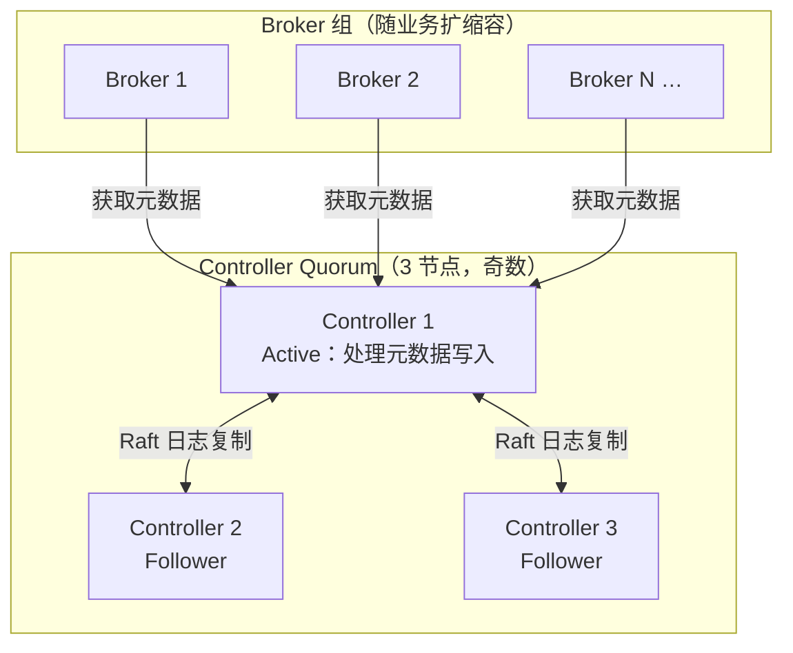

#### KRaft 启动配置（混合模式示例）

```properties
# server.properties
node.id=1
process.roles=broker,controller
controller.quorum.voters=1@host1:9093,2@host2:9093,3@host3:9093
listeners=PLAINTEXT://:9092,CONTROLLER://:9093
```

配置要点：

- `process.roles=broker,controller` 即混合模式；隔离模式下 Controller 节点只配 `controller`，Broker 节点只配 `broker`
- `controller.quorum.voters` 列出 Quorum 全部投票成员（格式 `node.id@主机:CONTROLLER端口`），**所有节点该配置必须一致**
- `CONTROLLER://:9093` 是 Controller 通信监听器，仅供节点间使用，不面向业务客户端

### 其他 3.x 特性

- **分层存储（Tiered Storage）**：热数据存本地，冷数据自动迁移到S3/HDFS
- **增量协作Rebalance**：减少Rebalance期间的停顿
- **移除ZooKeeper依赖**：Kafka 4.0 完全不再支持ZK模式

## 常用命令

### Topic 管理

```bash
# 创建Topic（3分区，2副本）
kafka-topics.sh --create --topic order \
  --partitions 3 --replication-factor 2 \
  --bootstrap-server localhost:9092

# 查看Topic列表
kafka-topics.sh --list --bootstrap-server localhost:9092

# 查看Topic详情
kafka-topics.sh --describe --topic order --bootstrap-server localhost:9092

# 修改分区数（只能增加）
kafka-topics.sh --alter --topic order --partitions 6 --bootstrap-server localhost:9092

# 删除Topic
kafka-topics.sh --delete --topic order --bootstrap-server localhost:9092
```

### 消费者组

```bash
# 查看所有消费者组
kafka-consumer-groups.sh --list --bootstrap-server localhost:9092

# 查看消费者组详情（含Offset和Lag）
kafka-consumer-groups.sh --describe --group order-service \
  --bootstrap-server localhost:9092

# 重置Offset（earliest/latest）
kafka-consumer-groups.sh --reset-offsets --group order-service \
  --topic order --to-earliest --execute \
  --bootstrap-server localhost:9092
```

### 生产与消费

```bash
# 控制台生产者
kafka-console-producer.sh --topic order --bootstrap-server localhost:9092

# 控制台消费者（从头消费）
kafka-console-consumer.sh --topic order --from-beginning \
  --bootstrap-server localhost:9092

# 查看Topic消息数量
kafka-run-class.sh kafka.tools.GetOffsetShell \
  --broker-list localhost:9092 --topic order
```

### 集群运维

```bash
# 查看Broker配置
kafka-configs.sh --describe --broker 1 --bootstrap-server localhost:9092

# 查看集群元数据
kafka-metadata.sh snapshot --snapshot /tmp/kafka-logs/meta.properties

# 查看LogDirs信息
kafka-log-dirs.sh --describe --bootstrap-server localhost:9092
```
