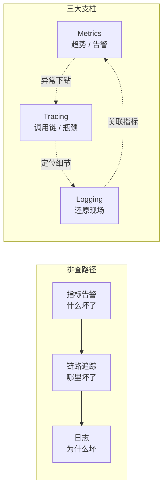
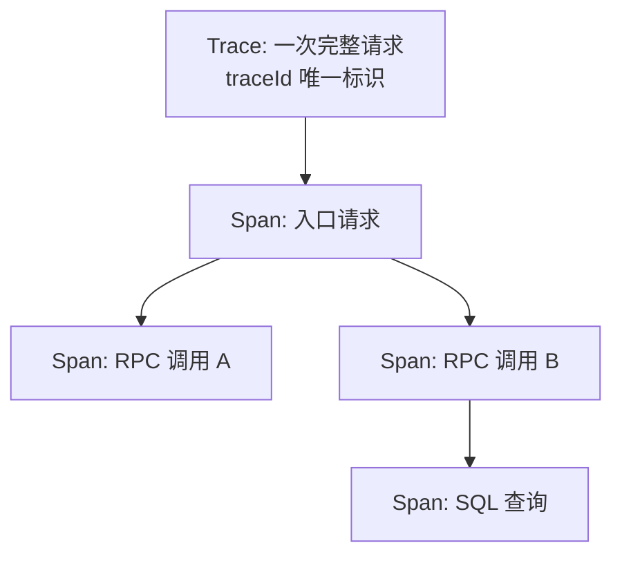

# 可观测性

## 简介

可观测性（Observability）是通过系统外部输出推断内部状态的能力，包含日志、指标、链路追踪三大支柱。这个概念源自控制论：一个系统如果仅凭其外部输出就能理解其内部状态，它就是可观测的。

**监控（Monitoring）与可观测性的区别**：

- 监控是"预定义问题"——提前想到会出什么问题，配好图表和告警（已知问题的已知未知）；
- 可观测性是"探索未知"——故障发生时能顺着数据层层下钻，定位到没预想到的问题（未知问题的未知未知）；
- 微服务架构下调用关系复杂多变，光靠预置监控面板远远不够，可观测性成为刚需。

可观测性的典型排查路径：**指标告警发现异常（什么坏了）→ 链路追踪定位范围（哪里坏了）→ 日志确认细节（为什么坏）**。

> **三大支柱与排查路径**：指标告警发现异常、链路追踪定位范围、日志确认细节，三者可互相跳转。



## 三大支柱

### 日志（Logging）

- ELK Stack
- 日志规范与结构化日志

日志记录离散事件的详细信息，适合事后还原现场。

**主流方案 ELK Stack**：Elasticsearch（存储检索）+ Logstash（采集加工）+ Kibana（可视化），配合 Filebeat 采集；轻量替代方案是 Grafana Loki（只索引标签，成本低，详见《日志体系》）。

**关键实践**：

- **结构化输出**：JSON 格式日志，字段化存储便于检索与聚合；
- **统一上下文字段**：traceId、spanId、应用名、环境，使日志能与链路、指标互相跳转；
- **级别规范**：ERROR 对应需要介入的异常，避免告警噪音；
- 日志的短板：量大成本高、无法直接反映趋势，**趋势类问题要靠指标**。

### 指标（Metrics）

- Prometheus
- Grafana
- 常用指标（RED / USE 方法论）

指标是**随时间变化的数值型聚合数据**（计数器、仪表盘），存储成本低、适合告警和趋势分析。

**Prometheus**：云原生时代的事实标准，拉模式（Pull）采集，内置 PromQL 查询语言；配合 Alertmanager 实现告警路由与收敛。服务暴露 `/actuator/prometheus` 端点（Micrometer 适配），Prometheus 定时抓取。

```promql
# 接口 QPS
sum(rate(http_server_requests_seconds_count{app="order"}[1m]))
# P99 延迟
histogram_quantile(0.99, sum(rate(http_server_requests_seconds_bucket{app="order"}[5m])) by (le))
# 错误率
sum(rate(http_server_requests_seconds_count{status=~"5.."}[5m]))
/ sum(rate(http_server_requests_seconds_count[5m]))
```

**Grafana**：可视化面板标准，支持 Prometheus、Loki、Jaeger 等多种数据源，是三大支柱的统一展示入口。

**常用方法论**：

| 方法论 | 适用对象 | 指标 |
|--------|----------|------|
| **RED** | 面向请求的服务 | Rate（QPS）、Errors（错误率）、Duration（延迟分布） |
| **USE** | 面向资源（CPU/内存/磁盘/连接池） | Utilization（使用率）、Saturation（饱和度/排队）、Errors（错误） |

此外还有业务侧的黄金指标：订单量、支付成功率等，与基础设施指标共同构成完整视图。**四个黄金信号**（Google SRE）：延迟、流量、错误、饱和度。

### 链路追踪（Tracing）

链路追踪记录一次请求在分布式系统中的完整调用路径，解决"跨服务问题定位"的核心痛点。

**核心概念**：

- **Trace**：一次完整请求，由全局唯一 traceId 标识；
- **Span**：Trace 中的一个工作单元（一次 RPC、一次 SQL），记录开始/结束时间、标签、父子关系；
- 多个 Span 组成调用树，可以清楚看到耗时瓶颈在哪一跳。

> **Trace 与 Span 调用树**：一个 Trace 由全局 traceId 标识，包含多个有父子关系的 Span。



**主流方案**：

| 方案 | 特点 |
|------|------|
| **OpenTelemetry** | CNCF 统一标准，融合 OpenTracing + OpenCensus，提供厂商无关的 API/SDK/采集器（OTel Collector），是当前趋势 |
| **Jaeger** | Uber 开源，云原生友好，常与 OpenTelemetry SDK 搭配作为后端存储与查询 UI |
| **SkyWalking** | Apache 项目，Java Agent 字节码增强**无侵入接入**，自带 UI、告警和服务拓扑图，国内流行 |

**落地要点**：

- 采样策略：全量采集开销大，通常按比例采样（如 10%）+ 对错误/慢请求强制全采（尾部采样）；
- 透传完整性：HTTP Header、MQ 消息属性、异步任务都要传递 traceId，断链会导致 Trace 残缺；
- 与日志、指标打通：日志带 traceId、指标可按 traceId 下钻（Exemplar），三者形成闭环。

## 告警体系

告警是可观测性产生价值的出口，目标是**该响的时候一定响，不该响的时候绝对不响**。

### 告警分级

按影响面和紧急程度分级，不同级别对应不同响应要求：

| 级别 | 定义 | 示例 | 响应要求 |
|------|------|------|----------|
| P0 | 核心业务不可用，资损风险 | 支付全挂、主库宕机 | 立即响应（5 分钟内），电话 + 短信轰炸，启动应急流程 |
| P1 | 核心功能受损或明显劣化 | 下单成功率跌至 90%、延迟翻倍 | 15 分钟内响应，值班人员处理 |
| P2 | 非核心异常或容量预警 | 磁盘 80%、某边缘接口报错 | 工作时间处理 |
| P3 | 提示信息 | 慢查询增多、证书即将过期 | 择机处理，可汇总为日报 |

**告警要基于 SLO**：从用户视角定义目标（如成功率 99.9%），用**错误预算（Error Budget）** 消耗速率触发告警，而不是对着每个原始指标设阈值——避免"指标抖动就报警，用户其实没感知"。

### 告警收敛

告警风暴时几百条消息同时轰炸只会让人瘫痪，必须做收敛：

- **去重**：同一告警持续触发只发一次，恢复时发恢复通知；
- **分组聚合**：同一服务/同一原因的多条告警合并为一条（Alertmanager 的 group_by）；
- **抑制（Inhibition）**：上游故障时抑制下游的连带告警（机房断网时不再报每个服务超时）；
- **静默（Silence）**：变更窗口、演练期间临时屏蔽已知告警；
- **防抖**：持续 N 分钟满足条件才告警，过滤瞬时毛刺；
- **分级路由**：不同级别走不同渠道（P0 电话、P2 IM 群消息），避免渠道疲劳。

### OnCall 机制

OnCall（值班）是告警落到人的制度保障：

- **排班与交接**：明确值班表（通常一周一轮），交接时同步遗留问题和关注点；
- **升级路径（Escalation）**：值班人 N 分钟未响应自动升级到备份值班 → 团队负责人，保证告警必有人接；
- **响应流程**：接收告警 → 认领（ack）→ 止血优先（回滚/降级/限流）→ 定位根因 → 恢复 → 复盘；
- **复盘文化**：重大故障必须写复盘报告（时间线、根因、改进项），**对事不对人**，改进项跟踪闭环；
- **控制告警疲劳**：定期清理无人处理的无效告警——没人响应的告警要么修要么删，否则团队会对告警脱敏。

## 最佳实践

### 可观测性设计原则

1. **从设计阶段内建**：可观测性不是上线前补丁，统一 traceId 规范、日志格式、指标命名要在架构阶段定下来；
2. **数据关联是灵魂**：三大支柱必须能互相跳转（指标异常 → 对应 Trace → 相关日志），孤立的数据源价值减半；
3. **面向排查设计**：问自己"半夜三点被叫起来，靠这些数据能在 15 分钟内定位吗"，缺什么补什么；
4. **成本意识**：指标最便宜、日志最贵，采样、分级存储、按保留期清理要提前规划；
5. **自助化**：排查工具要让一线开发自助使用，而不是每次都找 SRE 手动查库。

### 与 SRE 的关系

SRE（Site Reliability Engineering，站点可靠性工程）是 Google 提出的运维方法论，可观测性是 SRE 的核心基础设施：

- **SLO/SLI/Error Budget**：SRE 用指标定义可靠性目标并量化管理，这些 SLI 全部依赖可观测性数据；
- **故障应急**：SRE 的 MTTR（平均恢复时间）优化依赖快速定位能力，即可观测性水平；
- **容量规划与变更评估**：基于历史指标做容量预测，基于灰度期间的指标对比决定放量；
- 反过来，SRE 实践也在驱动可观测性演进：从"看面板"到"主动诊断"（根因分析、异常检测），再到 AIOps（指标异常自动检测、告警智能聚合）。
