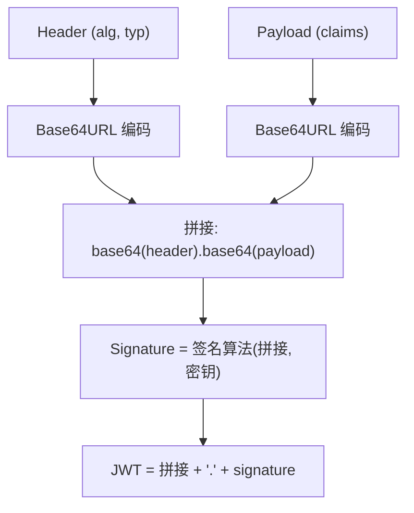
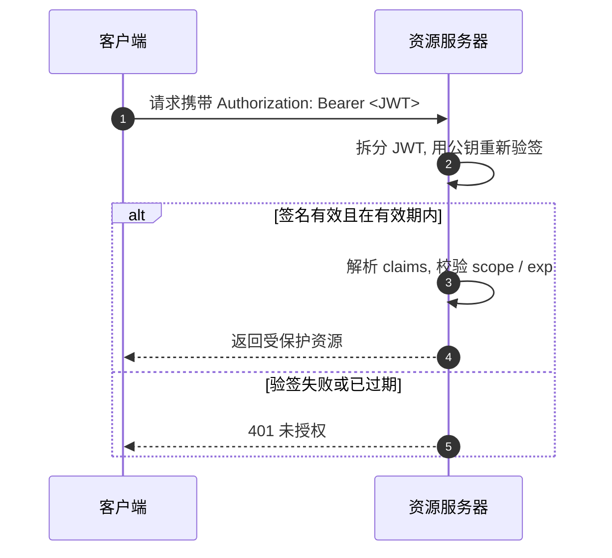

# JWT 令牌详解

> 文章来源：综合自 RFC 7519（JSON Web Token）、Auth0 / JWT 官方文档及公开技术博客，部分由 AI 整理。

JWT（JSON Web Token）是一种**紧凑、自包含**的令牌格式，常作为 OAuth2 的 `access_token` 或 OIDC 的 `id_token` 载体。本文讲清 JWT 的结构、签名验签、与 Session 的取舍及安全要点。

---

## 一、JWT 是什么，与 OAuth2 的关系

- **OAuth2** 是一个**授权框架**，规定了「如何申请令牌、如何换令牌」的流程；
- **JWT** 是一种**令牌的编码格式**，规定了「令牌长什么样、如何防篡改」。

二者是正交关系：OAuth2 流程最终签发出来的 `access_token`，**既可以是 JWT，也可以是一串无意义的随机字符串（Opaque Token）**。JWT 的优势在于资源服务器可以**本地验签、无需回查授权服务器**。

---

## 二、JWT 的结构

JWT 由三段组成，用 `.` 连接：`Header.Payload.Signature`，每段都是 **Base64URL** 编码。

| 部分 | 内容 | 说明 |
| --- | --- | --- |
| Header（头部） | `{"alg":"RS256","typ":"JWT"}` | 签名算法、令牌类型 |
| Payload（载荷） | `{"sub":"123","scope":"read:profile","exp":1700000000}` | 声明（claims），如主体、权限、过期时间 |
| Signature（签名） | `HMAC/签名(编码头.编码载荷, 密钥)` | 防篡改的核心 |

> **图题：JWT 生成结构**：对头部与载荷分别 Base64URL 编码后拼接，再用密钥签名，得到三段式令牌。

> **注意**：Base64URL 只是**编码不是加密**！Payload 可被任何人解码读取，**绝不可在 JWT 中存放密码、密钥等敏感信息**。

### 常见标准 claims

| Claim | 含义 |
| --- | --- |
| `iss` (issuer) | 签发者 |
| `sub` (subject) | 主体（用户/客户端标识） |
| `aud` (audience) | 受众（资源服务器） |
| `exp` (expiration) | 过期时间（Unix 时间戳） |
| `iat` (issued at) | 签发时间 |
| `scope` | 权限范围（OAuth2 常用） |

---

## 三、签名与验签

签名保证令牌在传输中**未被篡改**，且确实由可信的授权服务器签发。

- **对称签名（HS256）**：用同一个密钥签名与验签，密钥需同时在签发方与验签方保密，适合单方可信的内部场景。
- **非对称签名（RS256 / ES256）**：授权服务器用**私钥**签名，资源服务器只需持有**公钥**验签。公钥可公开分发，安全性与扩展性更好，是主流选择。

> **图题：JWT 校验流程**：资源服务器拆出签名，用密钥/公钥重新计算并比对，校验通过且未过期才放行。

---

## 四、JWT vs Session：如何取舍

| 维度 | JWT（无状态） | Session（有状态） |
| --- | --- | --- |
| 服务端存储 | 不存令牌，靠验签 | 存 session，客户端持 session-id（通常 Cookie） |
| 水平扩展 | 友好（任意节点可本地验签） | 需共享存储或黏性会话 |
| 吊销难度 | 较难（靠短期有效期 / 黑名单） | 容易（直接删服务端记录） |
| 信息携带 | 载荷自包含 claims，减少查库 | 需据 session-id 查库取用户数据 |
| 适用 | 微服务、API、跨域 SPA、OAuth2 接入 | 传统服务端渲染、需即时吊销的场景 |

> **经验法则**：需要**即时吊销**或**用户状态强一致**时用 Session；追求**无状态、易扩展、跨服务信任**时用 JWT，并以**短有效期**对冲不可吊销的弱点。

---

## 五、安全要点

| 风险 | 防护 |
| --- | --- |
| 算法混淆攻击（`alg:none`、用公钥当 HS256 密钥） | 验签时**固定允许的算法白名单**，拒绝 `none` |
| 令牌被长期冒用 | 设置**较短 `exp`**，必要时结合黑名单/版本号 |
| 载荷泄密 | 不在 payload 放敏感信息；全链路 **HTTPS** |
| 私钥/共享密钥泄露 | 非对称优先（RS256/ES256）；密钥定期轮换 |
| 无法即时吊销 | 短有效期 + 黑名单，或改用 Opaque Token |

---

## 六、与本站文档的衔接

- **OAuth2 中的令牌机制**：授权码/客户端凭证模式如何签发与刷新 JWT，见 [OAuth2 协议](OAuth2.md) 第五、七节。
- **Spring 集成**：Spring Security 以 JWT 作为资源服务器无状态认证、或对接第三方登录，见 [Spring Security](../../contents/spring/SpringSecurity.md) 的「OAuth2 / JWT」小节。
- **网关统一校验**：在 API 网关层校验 JWT/OAuth2 令牌并透传身份，见 [API 网关](../../contents/middleware/API网关.md) 的「认证与授权」小节。

---

## 小结

- JWT = `Header.Payload.Signature`，Base64URL 编码 + 签名，**自包含、可本地验签**。
- JWT 是 OAuth2 令牌的常见载体，但二者职责不同（格式 vs 流程）。
- 优先用**非对称签名（RS256）**；**短有效期**缓解不可吊销问题。
- 与 Session 取舍看「无状态扩展」还是「即时吊销」。
- 相关：[OAuth2 协议](OAuth2.md) · [Spring Security](../../contents/spring/SpringSecurity.md) · [API 网关](../../contents/middleware/API网关.md) · [安全防护](安全防护.md)
