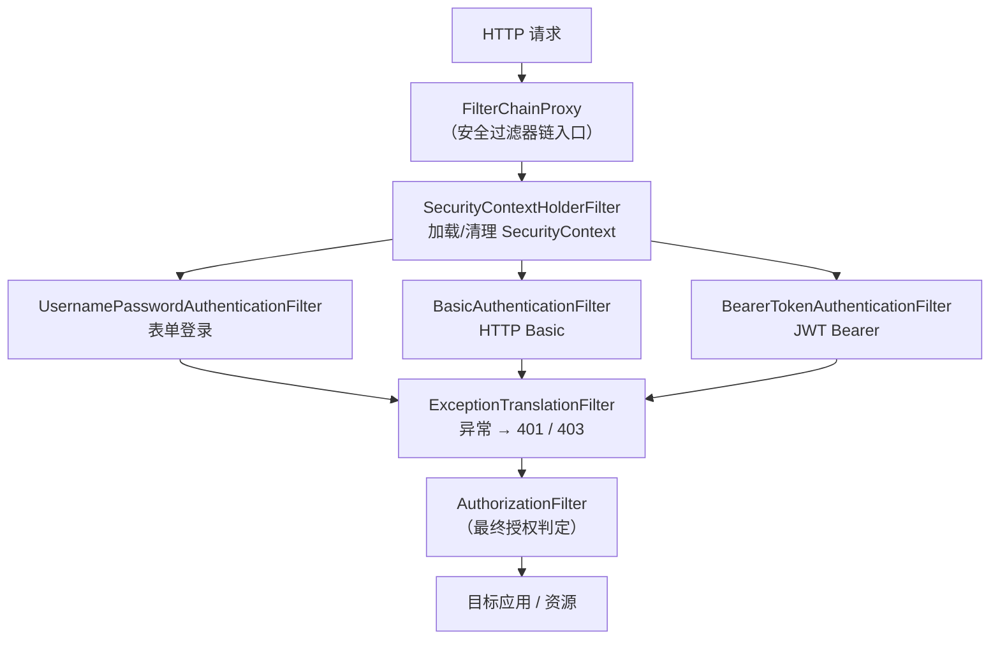
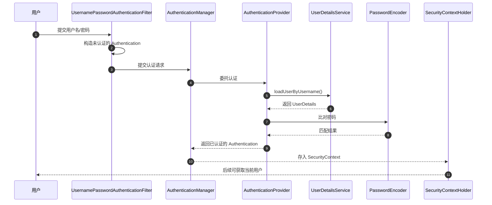

# Spring Security

## 简介

Spring Security 是 Spring 生态中的安全框架，提供认证（Authentication）和授权（Authorization）功能。它基于 Servlet Filter 构建，与 Spring IoC/AOP 深度集成，为 Spring 应用提供声明式的安全配置能力。

- **历史沿革**：Spring Security 最早以 "The Acegi Security System for Spring" 的名字于 2003 年出现，2008 年成为 Spring 官方子项目并更名为 Spring Security。
- **核心定位**：提供完整的认证、授权解决方案，同时内置对常见 Web 攻击（CSRF、会话固定、点击劫持等）的防护。
- **版本对应**：Spring Security 5.x 对应 Spring Boot 2.x（javax 命名空间）；Spring Security 6.x 对应 Spring Boot 3.x（jakarta 命名空间）。

### 版本演进

| 版本 | 发布时间 | 主要变化 |
|------|----------|----------|
| Acegi Security | 2003 年 | 前身项目，功能完善但配置繁琐 |
| Spring Security 2.0 | 2008 年 | 正式加入 Spring 生态，XML 命名空间配置 |
| Spring Security 4.0 | 2015 年 | Java Config 支持完善 |
| Spring Security 5.0 | 2018 年 | OAuth2 登录/资源服务器支持、WebFlux 响应式支持 |
| Spring Security 5.7 | 2022 年 | 废弃 `WebSecurityConfigurerAdapter`，统一组件化配置、Lambda DSL |
| Spring Security 6.0 | 2022 年 | 迁移至 Jakarta EE（jakarta.*）、移除大量废弃 API、`antMatchers` 改为 `requestMatchers` |

## 核心概念

- 认证（Authentication）：验证用户身份
- 授权（Authorization）：控制访问权限
- 过滤器链（Filter Chain）：基于 Servlet Filter 的安全机制

### 核心组件

| 组件 | 作用 |
|------|------|
| **SecurityContext** | 安全上下文，持有当前线程的认证信息（Authentication） |
| **SecurityContextHolder** | 访问 SecurityContext 的入口，默认基于 ThreadLocal 存储 |
| **Authentication** | 认证凭证对象，包含 principal（主体）、credentials（凭证）、authorities（权限） |
| **GrantedAuthority** | 权限标识，如 `ROLE_ADMIN`、`order:read` |
| **UserDetails** | 用户信息模型，包含用户名、密码、权限及账号状态（是否锁定、过期等） |
| **UserDetailsService** | 加载用户信息的接口，核心方法 `loadUserByUsername(String username)` |
| **PasswordEncoder** | 密码加密器，如 BCryptPasswordEncoder、PasswordEncoder 委派模式（DelegatingPasswordEncoder） |
| **AuthenticationManager** | 认证管理器，负责处理认证请求，常用实现是 ProviderManager |

### 过滤器链工作原理

Spring Security 的 Web 安全能力本质上是一条 **Filter 过滤器链**。核心入口是 `FilterChainProxy`，它作为一个 Servlet Filter 注册到容器中，内部可以管理多条 `SecurityFilterChain`（每条链负责一类请求的安全处理）。

过滤器链中常见的 Filter：

| Filter | 作用 |
|--------|------|
| `SecurityContextHolderFilter` | 加载/清理 SecurityContext（6.x 中替代 SecurityContextPersistenceFilter） |
| `UsernamePasswordAuthenticationFilter` | 处理表单用户名/密码登录 |
| `BasicAuthenticationFilter` | 处理 HTTP Basic 认证 |
| `BearerTokenAuthenticationFilter` | 处理 JWT（Bearer Token）认证 |
| `ExceptionTranslationFilter` | 将安全异常翻译为 401（未认证）或 403（拒绝访问）响应 |
| `AuthorizationFilter` | 最终的授权判定（6.x 中替代 FilterSecurityInterceptor） |

> **Spring Security 的过滤器链**：请求经 FilterChainProxy 进入，依次经过上下文加载、各类认证 Filter、异常翻译与最终授权判定。



### 认证流程

以表单登录为例，一次完整的认证过程如下：

1. 用户提交用户名和密码；
2. `UsernamePasswordAuthenticationFilter` 拦截请求，构造一个**未认证**的 `Authentication` 对象；
3. 将其交给 `AuthenticationManager`（实现类 `ProviderManager`）处理；
4. `ProviderManager` 委托具体的 `AuthenticationProvider`（如 `DaoAuthenticationProvider`）执行认证；
5. `AuthenticationProvider` 调用 `UserDetailsService.loadUserByUsername()` 加载用户信息；
6. 使用 `PasswordEncoder` 比对提交的密码与数据库中的密码；
7. 认证成功，将**已认证**的 `Authentication` 存入 `SecurityContextHolder`；
8. 后续过滤器和业务代码通过 `SecurityContextHolder.getContext().getAuthentication()` 获取当前用户。

> **表单登录的认证时序**：从提交凭据到 AuthenticationManager 委派 Provider 完成比对，最终把已认证的 Authentication 存入 SecurityContext。



```java
// 在业务代码中获取当前登录用户
Authentication authentication = SecurityContextHolder.getContext().getAuthentication();
String username = authentication.getName();
```

## 认证方式

### 表单登录

表单登录是 Web 应用最常见的认证方式。Spring Security 提供内置的登录页和登录处理逻辑，也支持自定义登录页。

```java
@Configuration
@EnableWebSecurity
public class SecurityConfig {

    @Bean
    public SecurityFilterChain securityFilterChain(HttpSecurity http) throws Exception {
        http
            .authorizeHttpRequests(auth -> auth
                .requestMatchers("/login", "/css/**", "/js/**").permitAll()
                .anyRequest().authenticated()
            )
            .formLogin(form -> form
                .loginPage("/login")                // 自定义登录页（不配置则使用内置登录页）
                .loginProcessingUrl("/doLogin")     // 登录表单提交的地址
                .defaultSuccessUrl("/home")         // 登录成功跳转地址
                .failureUrl("/login?error")         // 登录失败跳转地址
                .permitAll()
            )
            .logout(logout -> logout
                .logoutUrl("/logout")
                .logoutSuccessUrl("/login?logout")
            );
        return http.build();
    }

    @Bean
    public PasswordEncoder passwordEncoder() {
        return new BCryptPasswordEncoder();
    }
}
```

基于数据库用户认证时，实现 `UserDetailsService` 即可：

```java
@Service
public class UserDetailsServiceImpl implements UserDetailsService {

    @Autowired
    private UserMapper userMapper;

    @Override
    public UserDetails loadUserByUsername(String username) throws UsernameNotFoundException {
        SysUser user = userMapper.findByUsername(username);
        if (user == null) {
            throw new UsernameNotFoundException("用户不存在: " + username);
        }
        return User.builder()
                .username(user.getUsername())
                .password(user.getPassword()) // 数据库中存储的 BCrypt 密文
                .authorities(user.getPermissions().toArray(new String[0]))
                .build();
    }
}
```

### HTTP Basic 认证

HTTP Basic 认证中，客户端在每个请求的 `Authorization` 请求头中携带 `Base64(用户名:密码)`，格式为 `Authorization: Basic base64(username:password)`。适用于接口调用、脚本调试等场景，但凭据仅做 Base64 编码，**必须配合 HTTPS 使用**。

```java
@Bean
public SecurityFilterChain securityFilterChain(HttpSecurity http) throws Exception {
    http
        .authorizeHttpRequests(auth -> auth
            .requestMatchers("/api/public/**").permitAll()
            .anyRequest().authenticated()
        )
        .httpBasic(Customizer.withDefaults());
    return http.build();
}
```

测试时可以使用 curl 携带凭据：

```bash
curl -u user:password http://localhost:8080/api/user
```

### OAuth2 / JWT

> **协议原理**：OAuth2 的角色、四种授权模式、令牌与刷新机制，以及 JWT 的结构与签名，见独立文档 [OAuth2 协议](../../contents/security/OAuth2.md) 与 [JWT 令牌](../../contents/security/JWT.md)。下文仅演示 Spring Boot 的集成方式。

#### OAuth2 登录（第三方登录）

作为 OAuth2 客户端对接 GitHub、Google 等第三方登录，只需引入依赖并配置客户端信息：

```xml
<dependency>
    <groupId>org.springframework.boot</groupId>
    <artifactId>spring-boot-starter-oauth2-client</artifactId>
</dependency>
```

```yaml
spring:
  security:
    oauth2:
      client:
        registration:
          github:
            client-id: your-client-id
            client-secret: your-client-secret
```

开启 OAuth2 登录：

```java
http.oauth2Login(oauth2 -> oauth2.loginPage("/oauth2/authorization/github"));
```

#### JWT 资源服务器（无状态认证）

前后端分离架构中，通常使用 JWT 作为无状态认证方案：登录成功后服务端签发 JWT，之后每个请求在 `Authorization: Bearer <token>` 头中携带令牌，服务端只验签不存 Session。

```xml
<dependency>
    <groupId>org.springframework.boot</groupId>
    <artifactId>spring-boot-starter-oauth2-resource-server</artifactId>
</dependency>
```

```yaml
spring:
  security:
    oauth2:
      resourceserver:
        jwt:
          issuer-uri: https://auth.example.com  # 授权服务器地址，自动获取公钥验签
```

```java
@Bean
public SecurityFilterChain securityFilterChain(HttpSecurity http) throws Exception {
    http
        .authorizeHttpRequests(auth -> auth
            .requestMatchers("/api/public/**").permitAll()
            .anyRequest().authenticated()
        )
        .oauth2ResourceServer(oauth2 -> oauth2.jwt(Customizer.withDefaults()))
        .sessionManagement(session -> session
            .sessionCreationPolicy(SessionCreationPolicy.STATELESS)) // 无状态，不创建 Session
        .csrf(csrf -> csrf.disable()); // 纯 API 通常禁用 CSRF
    return http.build();
}
```

> **说明**：JWT 的签发（授权服务器）可以由 Spring Authorization Server 或 Keycloak 等实现；资源服务器侧 Spring Security 负责验签与解析 claims。

## 授权控制

### 基于角色

角色（Role）是一组权限的集合，通常表示用户的身份类别，如 `ROLE_USER`、`ROLE_ADMIN`。

```java
http.authorizeHttpRequests(auth -> auth
    .requestMatchers("/admin/**").hasRole("ADMIN")          // 仅管理员
    .requestMatchers("/user/**").hasAnyRole("USER", "ADMIN") // USER 或 ADMIN
    .anyRequest().authenticated()
);
```

**注意**：`hasRole("ADMIN")` 会自动补全前缀，实际匹配的是 `ROLE_ADMIN`。因此 `UserDetails` 中配置角色时应使用 `roles("ADMIN")` 或 `authority("ROLE_ADMIN")`，二者等价。

### 基于权限

权限（Authority）是更细粒度的访问控制标识，如 `user:read`、`order:delete`，**不会**自动添加前缀。

```java
http.authorizeHttpRequests(auth -> auth
    .requestMatchers(HttpMethod.GET, "/orders/**").hasAuthority("order:read")
    .requestMatchers(HttpMethod.DELETE, "/orders/**").hasAuthority("order:delete")
    .anyRequest().authenticated()
);
```

**角色与权限的区别**：

| 对比项 | 角色（Role） | 权限（Authority） |
|--------|------------|-----------------|
| 语义 | 用户的身份/类别 | 对具体资源的操作许可 |
| 前缀 | `hasRole` 自动补 `ROLE_` 前缀 | 无前缀，完全匹配 |
| 粒度 | 粗粒度 | 细粒度 |
| 判断方法 | `hasRole` / `hasAnyRole` | `hasAuthority` / `hasAnyAuthority` |

### 方法级安全

除了在 URL 层面控制访问，还可以在方法层面进行权限校验。Spring Security 6.x 使用 `@EnableMethodSecurity` 开启（旧版本为 `@EnableGlobalMethodSecurity`）：

```java
@Configuration
@EnableMethodSecurity
public class MethodSecurityConfig {
}
```

常用注解：

| 注解 | 作用 |
|------|------|
| `@PreAuthorize` | 方法执行**前**校验，表达式不通过则拒绝访问 |
| `@PostAuthorize` | 方法执行**后**校验，可访问返回值 `returnObject` |
| `@PreFilter` | 对集合类型的入参进行过滤 |
| `@PostFilter` | 对返回的集合进行过滤 |
| `@Secured` | 基于角色的简单校验，不支持 SpEL 表达式 |

```java
@Service
public class OrderService {

    // 仅管理员可删除订单
    @PreAuthorize("hasRole('ADMIN')")
    public void deleteOrder(Long orderId) {
        // ...
    }

    // 只能查询自己的订单
    @PreAuthorize("#userId == authentication.principal.id")
    public List<Order> listOrders(Long userId) {
        // ...
    }

    // 校验返回值：只能读取自己的订单
    @PostAuthorize("returnObject.userId == authentication.principal.id")
    public Order getOrder(Long orderId) {
        // ...
    }

    // 过滤返回集合，只保留当前用户的数据
    @PostFilter("filterObject.userId == authentication.name")
    public List<Order> listAll() {
        // ...
    }
}
```

表达式中常用的根对象：

- `authentication`：当前认证对象
- `principal`：当前用户主体
- `hasRole(...)` / `hasAuthority(...)` / `hasPermission(...)`：内置判断函数
- `#参数名`：方法入参（SpEL 语法）
- `returnObject`：方法返回值（仅 `@PostAuthorize` / `@PostFilter`）

## 与 Spring Boot 集成

### 引入依赖

```xml
<dependency>
    <groupId>org.springframework.boot</groupId>
    <artifactId>spring-boot-starter-security</artifactId>
</dependency>
```

### 默认行为

引入 `spring-boot-starter-security` 后，Spring Boot 的自动配置（`SecurityAutoConfiguration`）会提供以下默认行为：

1. **所有端点都被保护**：任何请求都需要认证；
2. **生成默认用户**：用户名为 `user`，密码是启动时随机生成的 UUID，**打印在控制台日志中**；
3. **表单登录 + HTTP Basic**：浏览器访问跳转登录页，API 调用返回 401；
4. 密码使用 BCrypt 加密。

可以通过配置文件快速覆盖默认用户：

```yaml
spring:
  security:
    user:
      name: admin
      password: 123456
      roles: ADMIN
```

### 自定义配置

实际项目中通常自定义 `SecurityFilterChain` Bean，Spring Boot 检测到后会自动替换默认安全配置：

```java
@Configuration
@EnableWebSecurity
public class SecurityConfig {

    @Bean
    public SecurityFilterChain securityFilterChain(HttpSecurity http) throws Exception {
        http
            .authorizeHttpRequests(auth -> auth
                .requestMatchers("/api/public/**").permitAll()
                .requestMatchers("/admin/**").hasRole("ADMIN")
                .anyRequest().authenticated()
            )
            .formLogin(Customizer.withDefaults());
        return http.build();
    }
}
```

### 版本迁移注意

| 旧写法 | 新写法（5.7+/6.x） |
|--------|-------------------|
| 继承 `WebSecurityConfigurerAdapter` 重写 `configure(HttpSecurity)` | 定义 `SecurityFilterChain` Bean |
| `http.antMatchers(...)` | `http.authorizeHttpRequests` + `requestMatchers(...)` |
| `and()` 链式拼接 | Lambda DSL：`auth -> auth...` |
| `@EnableGlobalMethodSecurity` | `@EnableMethodSecurity` |
| `WebSecurity.ignoringAntMatchers` | `WebSecurityCustomizer` + `ignoring().requestMatchers` |

> **重要**：`WebSecurityConfigurerAdapter` 在 Spring Security 5.7 中被废弃，并在 6.0 中彻底移除。新项目应直接使用组件化（Bean）配置方式。

## 常见攻击防护

Spring Security 默认开启多种 Web 安全防护机制：

| 攻击类型 | 防护机制 | 是否默认开启 |
|----------|----------|--------------|
| CSRF | `CsrfFilter` + Token 校验 | 是 |
| XSS | 安全响应头（X-Content-Type-Options 等） | 部分 |
| Session Fixation | 登录后更换 Session ID | 是 |
| 点击劫持 | `X-Frame-Options` 响应头 | 是 |

- **CSRF（跨站请求伪造）**
  
  攻击者诱导已登录用户在第三方站点发起伪造请求，借助浏览器自动携带的 Cookie 完成非预期操作。Spring Security 默认启用 `CsrfFilter`：每次渲染表单时生成 CSRF Token（默认存于 Session），提交请求时校验 Token，不一致则拒绝。
  
  ```java
  // 前后端分离的纯 JWT API 场景下通常禁用 CSRF
  http.csrf(csrf -> csrf.disable());
  
  // 或只对部分路径禁用
  http.csrf(csrf -> csrf.ignoringRequestMatchers("/api/**"));
  ```

- **XSS（跨站脚本）**
  
  攻击者将恶意脚本注入页面，窃取 Cookie 或执行伪操作。Spring Security 的防护分两层：
  
  1. **安全响应头**（`HeaderWriterFilter` 默认添加）：
     - `X-Content-Type-Options: nosniff`：禁止浏览器 MIME 嗅探
     - `Content-Security-Policy`：限制脚本来源，需要显式配置
     - `X-XSS-Protection`：旧版浏览器的 XSS 过滤（已逐步废弃）
  2. **输出转义**：框架层无法完全防御，业务侧输出用户内容到页面时必须做 HTML 转义（Thymeleaf 默认转义，`th:utext` 除外）。
  
  ```java
  http.headers(headers -> headers
      .contentSecurityPolicy(csp -> csp.policyDirectives("script-src 'self'"))
  );
  ```

- **Session Fixation（会话固定）**
  
  攻击者预先拿到一个合法的 Session ID 并诱导用户使用它登录，之后攻击者用同一 Session ID 冒充用户。Spring Security 默认使用 `migrateSession` 策略：登录成功后生成新的 Session ID，并把旧 Session 的属性迁移过去。
  
  ```java
  http.sessionManagement(session -> session
      .sessionFixation(fix -> fix
          .migrateSession()    // 默认：换新 Session ID 并迁移属性
          // .newSession()     // 新建空 Session
          // .changeSessionId()// 只换 ID 不新建 Session
      )
  );
  ```

- **点击劫持（Clickjacking）**
  
  攻击者用透明的 iframe 覆盖在自己的页面上，诱导用户点击时实际触发了目标站点的操作。Spring Security 默认添加响应头 `X-Frame-Options: DENY`，禁止页面被任何站点以 iframe 嵌入。
  
  ```java
  http.headers(headers -> headers
      .frameOptions(frame -> frame
          .sameOrigin() // 只允许同源页面嵌入
          // .deny()    // 默认：完全禁止嵌入
      )
  );
  ```
