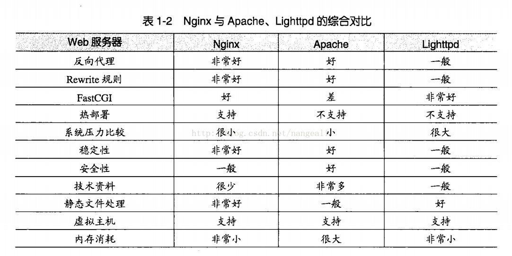

## **Nginx安装**

[**CentOS**](https://blog.csdn.net/oldguncm/article/details/78855000)**安装Ngnix**

```shell
# 要添加CentOS 7 EPEL仓库：
sudo yum install epel-release
# 安装：
sudo yum install nginx
# 启动：
sudo systemctl start nginx
# 关闭：
sudo systemctl stop nginx
# 开机启动：
sudo systemctl enable nginx
```

> **Tips**：这样的安装方式默认安装到：/etc/nginx目录下（配置文件也在这里面）

 

[**Ubuntu**](https://www.cnblogs.com/EasonJim/p/7806879.html)**安装Ngnix**

```shell
sudo apt-get install nginx

# 主程序路径
/usr/sbin/nginx
# 存放配置文件路径
/etc/nginx
# 存放静态文件路径
/usr/share/nginx
# 存放日志路径
/var/log/nginx
```

 

 

## **Nginx命令**

```shell
# 启动Nginx
nginx

#重启nginx
service nginx restart

# 重新载入配置文件
nginx -s reload

# 重启 Nginx
nginx -s reopen 

# 停止 Nginx
nginx -s stop
```

 


## **Nginx简介**

Nginx (“engine x”) 是一个高性能的 HTTP 和 反向代理 服务器 ，也是一个 IMAP/POP3/SMTP 代理 服务器 。 具有如下特点：

**热部署**

在master管理进程与worker工作进程的分离设计，使的Nginx具有热部署的功能，那么在7×24小时不间断服务的前提下，升级Nginx的可执行文件。也可以在不停止服务的情况下修改配置文件，更换日志文件等功能。

**高并发**

一些大公司、网站都需要面对高并发请求，如果有一个能够在峰值顶住10万以上并发请求的Server，肯定会得到大家的青睐。理论上，Nginx支持的并发连接上限取决于你的内存，10万远未封顶。

**低内存消耗**

在一般的情况下，10000个非活跃的HTTP Keep-Alive 连接在Nginx中仅消耗2.5M的内存，这也是Nginx支持高并发连接的基础。

**响应快**

在正常的情况下，单次请求会得到更快的响应。在高峰期，Nginx可以比其他的Web服务器更快的响应请求。

**高可靠性**

高可靠性来自其核心框架代码的优秀设计、模块设计的简单性；并且这些模块都非常的稳定。宕机的概率微乎其微。

 

 

## **Nginx能做什么**

1. 反向代理
2. 正向代理
3. 负载均衡
4. HTTP服务器(包含动静分离)

 

 

## 正向代理[**和**](https://blog.csdn.net/wy757510722/article/details/75267431)反向代理

**正向代理**

简称代理，简单的说：我是一个用户，我无法直接访问一个网站，但是我能访问一个代理服务器，这个代理服务器能访问那个我不能访问的网站，于是我先连上代理服务器，告诉它我需要那个无法访问网站的内容，代理服务器去取回来,然后返回给我。从网站的角度，只在代理服务器来取内容的时候有一次记录。结论就是，正向代理，是一个位于客户端和原始服务器(origin server)之间的服务器，为了从原始服务器取得内容，客户端向代理发送一个请求并指定目标(原始服务器)，然后代理向原始服务器转交请求并将获得的内容返回给客户端。客户端必须要进行一些特别的设置才能使用正向代理。

**反向代理**

例如我要访问 localhost:8080/views/test1 这个页面，但view对应的服务器上并没有test1这个资源，它是从另一台服务器上调用的资源。这样view对应的那个服务器就使用了反向代理。即用户只需要把请求发给特定的反向代理服务器，具体请求是谁处理的用户不需要知道(其实也不知道)，由代理服务器统一处理。结论就是 反向代理正好相反，对于客户端而言它就像是原始服务器，并且客户端不需要进行任何特别的设置。客户端向反向代理 的命名空间(name-space)中的内容发送普通请求，接着反向代理将判断向何处(原始服务器)转交请求，并将获得的内容返回给客户端，就像这些内容原本就是它自己的一样。

**用途**

正向代理的典型用途是为在防火墙内的局域网客户端提供访问Internet的途径。正向代理还可以使用缓冲特性减少网络使用率。反向代理的典型用途是将防火墙后面的服务器提供给Internet用户访问。反向代理还可以为后端的多台服务器提供负载平衡，或为后端较慢的服务器提供缓冲服务。

**总结**

正向代理：针对客户端而言， 代理服务器代理客户端，转发请求，并将获得的内容返回给客户端。 

反向代理：针对客户端而言， 代理服务器就像是原始服务器,代理集群的web节点服务器返回结果。

 

 

## **负载均衡**

负载均衡也是Nginx常用的一个功能，负载均衡其意思就是分摊到多个操作单元上进行执行，例如Web服务器、FTP服务器、企业关键应用服务器和其它关键任务服务器等，从而共同完成工作任务。简单而言就是当有2台或以上服务器时，根据规则随机的将请求分发到指定的服务器上处理，负载均衡配置一般都需要同时配置反向代理，通过反向代理跳转到负载均衡。而Nginx目前支持自带3种负载均衡策略，还有2种常用的第三方策略。

**RR**

按照轮询（默认）方式进行负载，每个请求按时间顺序逐一分配到不同的后端服务器，如果后端服务器down掉，能自动剔除。虽然这种方式简便、成本低廉。但缺点是：可靠性低和负载分配不均衡。

**权重** 

指定轮询几率，weight和访问比率成正比，用于后端服务器性能不均的情况。

upstream test{ **server** localhost:8080 weight=9; **server** localhost:8081 weight=1; }

**ip_hash**

上面的2种方式都有一个问题，那就是下一个请求来的时候请求可能分发到另外一个服务器，当我们的程序不是无状态的时候（采用了session保存数据），这时候就有一个很大的很问题了，比如把登录信息保存到了session中，那么跳转到另外一台服务器的时候就需要重新登录了，所以很多时候我们需要一个客户只访问一个服务器，那么就需要用iphash了，iphash的每个请求按访问ip的hash结果分配，这样每个访客固定访问一个后端服务器，可以解决session的问题。

**fair**(第三方) 

按后端服务器的响应时间来分配请求，响应时间短的优先分配。

**url_hash**(第三方) 

按访问url的hash结果来分配请求，使每个url定向到同一个后端服务器，后端服务器为缓存时比较有效。 在upstream中加入hash语句，server语句中不能写入weight等其他的参数，hash_method是使用的hash算法。

 

 

## **nginx**[**进程模型**](https://blog.csdn.net/wy757510722/article/details/75267431)

在工作方式上，Nginx分为单工作进程和多工作进程两种模式。

单工作进程模式：除主进程外，还有一个工作进程，工作进程是单线程的；

多工作进程模式：每个工作进程包含多个线程。Nginx默认为单工作进程模式。

Nginx在启动后，会有一个master进程和多个worker进程。

**master进程**

主要用来管理worker进程，包含：接收来自外界的信号，向各worker进程发送信号，监控worker进程的运行状态，当worker进程退出后(异常情况下)，会自动重新启动新的worker进程。

master进程充当整个进程组与用户的交互接口，同时对进程进行监护。它不需要处理网络事件，不负责业务的执行，只会通过管理worker进程来实现重启服务、平滑升级、更换日志文件、配置文件实时生效等功能。

​    我们要控制nginx，只需要通过kill向master进程发送信号就行了。比如kill -HUP pid，则是告诉nginx，从容地重启nginx，我们一般用这个信号来重启nginx，或重新加载配置，因为是从容地重启，因此服务是不中断的。master进程在接收到HUP信号后是怎么做的呢？

​    首先master进程在接到信号后，会先重新加载配置文件，然后再启动新的worker进程，并向所有老的worker进程发送信号，告诉他们可以光荣退休了。新的worker在启动后，就开始接收新的请求，而老的worker在收到来自master的信号后，就不再接收新的请求，并且在当前进程中的所有未处理完的请求处理完成后，再退出。

​    当然，直接给master进程发送信号，这是比较老的操作方式，nginx在0.8版本之后，引入了一系列命令行参数，来方便我们管理。比如，./nginx -s reload，就是来重启nginx，./nginx -s stop，就是来停止nginx的运行。

​    如何做到的呢？我们还是拿reload来说，我们看到，执行命令时，我们是启动一个新的nginx进程，而新的nginx进程在解析到reload参数后，就知道我们的目的是控制nginx来重新加载配置文件了，它会向master进程发送信号，然后接下来的动作，就和我们直接向master进程发送信号一样了。

**worker进程**

而基本的网络事件，则是放在worker进程中来处理了。多个worker进程之间是对等的，他们同等竞争来自客户端的请求，各进程互相之间是独立的。一个请求，只可能在一个worker进程中处理，一个worker进程，不可能处理其它进程的请求。worker进程的个数是可以设置的，一般我们会设置与机器cpu核数一致，这里面的原因与nginx的进程模型以及事件处理模型是分不开的。

worker进程之间是平等的，每个进程，处理请求的机会也是一样的。当我们提供80端口的http服务时，一个连接请求过来，每个进程都有可能处理这个连接，怎么做到的呢？首先，每个worker进程都是从master进程fork过来，在master进程里面，先建立好需要listen的socket（listenfd）之后，然后再fork出多个worker进程。

所有worker进程的listenfd会在新连接到来时变得可读，为保证只有一个进程处理该连接，所有worker进程在注册listenfd读事件前抢accept_mutex，抢到**互斥锁**的那个进程注册listenfd读事件，在读事件里调用accept接受该连接。当一个worker进程在accept这个连接之后，就开始读取请求，解析请求，处理请求，产生数据后，再返回给客户端，最后才断开连接，这样一个完整的请求就是这样的了。

**多进程IO模型好处**

首先，对于每个worker进程来说，独立的进程，不需要加锁，所以省掉了锁带来的开销，同时在编程以及问题查找时，也会方便很多。

其次，采用独立的进程，可以让互相之间不会影响，一个进程退出后，其它进程还在工作，服务不会中断，master进程则很快启动新的worker进程。当然，worker进程的异常退出，肯定是程序有bug了，异常退出，会导致当前worker上的所有请求失败，不过不会影响到所有请求，所以降低了风险。

 

 

## **nginx多进程事件模型：异步非阻塞**

虽然nginx采用多worker的方式来处理请求，每个worker里面只有一个主线程，那能够处理的并发数很有限啊，多少个worker就能处理多少个并发，何来高并发呢？非也，这就是nginx的高明之处，nginx采用了异步非阻塞的方式来处理请求，也就是说，nginx是可以同时处理成千上万个请求的。

一个worker进程可以同时处理的请求数只受限于内存大小，而且在架构设计上，不同的worker进程之间处理并发请求时几乎没有同步锁的限制，worker进程通常不会进入睡眠状态，因此，当Nginx上的进程数与CPU核心数相等时（最好每一个worker进程都绑定特定的CPU核心），进程间切换的代价是最小的。

而apache的常用工作方式（apache也有异步非阻塞版本，但因其与自带某些模块冲突，所以不常用），每个进程在一个时刻只处理一个请求，因此，当并发数上到几千时，就同时有几千的进程在处理请求了。这对操作系统来说，是个不小的挑战，进程带来的内存占用非常大，进程的上下文切换带来的cpu开销很大，自然性能就上不去了，而这些开销完全是没有意义的。

**实现原理**

​    我们先回到原点，看看一个请求的完整过程:首先，请求过来，要建立连接，然后再接收数据，接收数据后，再发送数据。

​    具体到系统底层，就是读写事件，而当读写事件没有准备好时，必然不可操作，如果不用非阻塞的方式来调用，那就得阻塞调用了，事件没有准备好，那就只能等了，等事件准备好了，你再继续吧。阻塞调用会进入内核等待，cpu就会让出去给别人用了，对单线程的worker来说，显然不合适，当网络事件越多时，大家都在等待呢，cpu空闲下来没人用，cpu利用率自然上不去了，更别谈高并发了。

​    好吧，你说加进程数，这跟apache的线程模型有什么区别，注意，别增加无谓的上下文切换。所以，在nginx里面，最忌讳阻塞的系统调用了。不要阻塞，那就非阻塞喽。非阻塞就是，事件没有准备好，马上返回EAGAIN，告诉你，事件还没准备好呢，你慌什么，过会再来吧。

​    好吧，你过一会，再来检查一下事件，直到事件准备好了为止，在这期间，你就可以先去做其它事情，然后再来看看事件好了没。虽然不阻塞了，但你得不时地过来检查一下事件的状态，你可以做更多的事情了，但带来的开销也是不小的。


## **综合比较**

 


## **nginx配置nodejs反向代理**

nginx安装完成之后，[配置](https://blog.csdn.net/tujiaw/article/details/58238352)文件一般在这些目录中/usr/local/nginx/conf, /etc/nginx, or /usr/local/etc/nginx

打开配置文件nginx.conf，在http下增加：

```
upstream nodejs { server 127.0.0.1:3000; #你所在服务器中nodejs程序监听的端口 keepalive 64; }
```

 在http配置中有个include /etc/nginx/sites-enabled/*;打开sites-enabled下面的**default文件**，在server下配置：

```nginx
listen 80 default_server;
listen [::]:80 default_server;
server_name [www.sanjiadian.net](http://www.sanjiadian.net) sanjiadian.net;

location / {
    proxy_set_header X-Real-IP $remote_addr;
    proxy_set_header X-Forwarded-For $proxy_add_x_forwarded_for;
    proxy_set_header Host $http_host;
    proxy_set_header X-Nginx-Proxy true;
    proxy_set_header Connection "";
    proxy_pass http://nodejs;
}
```

 

 

## **Nginx开启Gzip**

在nginx.conf中的http下加入以下内容：

```nginx
gzip on;
gzip_min_length 1k;
gzip_buffers 4 16k;
#gzip_http_version 1.0;
gzip_comp_level 9;
gzip_types text/plain application/javascript application/x-javascript text/css application/xml text/javascript application/x-httpd-php image/jpeg image/gif image/png;
gzip_vary off;
gzip_disable "MSIE [1-6]\.";
```

 

 

## **Nginx端口转发TCP**

/etc/nginx/nginx.conf配置文件加入（注意：[不要在http块中加入，加在最外层即可](https://blog.51cto.com/moerjinrong/2287680)）：

```nginx
# TCP端口转发
stream{
    upstream natmongodb{
        hash $remote_addr consistent;
        # 目标IP端口
        server 192.168.1.103:27017 max_fails=3 fail_timeout=10s;  
    }
    server{
        # 本机端口
        listen 10009;
        proxy_connect_timeout 20s;
        proxy_timeout 5m;
        proxy_pass natmongodb;
    }
}
```

 

 

## **Nginx访问频率限制**

接口调用频率限制（CC攻击）可通过如下Nginx[配置实现](https://www.cnblogs.com/zhen-rh/p/7424942.html)：

```
http {
    limit_req_zone $binary_remote_addr zone=req_perip:50m rate=10r/s;
    ...
    server {
        ...
        location /api/ {
                limit_req zone=req_perip burst=50 nodelay;
                limit_req_status 503;
        }
    }
}
```

 

 

## SSL(Https)配置

[**Nginx 1.14**](https://blog.52itstyle.vip/archives/4219/)配置SSL即Https需要nginx启用了https模块；nginx更详细的配置[参考](https://help.aliyun.com/document_detail/98728.html?spm=a2c4g.11186623.2.12.c0076b441E8wxG#concept-n45-21x-yfb)：

```nginx
server {
    listen       80 default_server;
    listen       443 ssl http2 default_server;
    listen       [::]:80 default_server;
    server_name  _;
    root         /usr/share/nginx/html;
    client_max_body_size 20M;

    #SSL-START SSL相关配置，请勿删除或修改下一行带注释的404规则
    #error_page 404/404.html;
    #HTTP_TO_HTTPS_START
    if ($server_port !~ 443){
        rewrite ^(/.*)$ https://$host$1 permanent;
    }
    #HTTP_TO_HTTPS_END
    ssl_certificate    /etc/nginx/ssl/fullchain.pem;
    ssl_certificate_key    /etc/nginx/ssl/privkey.pem;
    ssl_protocols TLSv1 TLSv1.1 TLSv1.2 TLSv1.3;
    ssl_ciphers ECDHE-RSA-AES128-GCM-SHA256:HIGH:!aNULL:!MD5:!RC4:!DHE;
    ssl_prefer_server_ciphers on;
    ssl_session_cache shared:SSL:10m;
    ssl_session_timeout 10m;
    error_page 497  https://$host$request_uri;

    #SSL-END
}
```


## Nginx多项目配置

有时候我们会在同一个系统中存在好几个项目，比如手机端和pc端，这时候就需要对不同的项目使用不同的路由去区分，下面是针对一个主项目和一个子项目（subpage）的配置：

```nginx
server {
    listen       8081 default_server;
    listen       [::]:8081 default_server;
    server_name  _;
    root         /usr/share/nginx/html;
    # Load configuration files for the default server block.

    # 主项目路径
    location / {
        index  index.html;
        # vue路由模式：history
        try_files $uri $uri/ /index.html; 
    }
    # 子项目路径
    location /subpage {
        alias /usr/share/nginx/subpage;
        # vue路由模式：history
        try_files $uri $uri/ /subpage/index.html;
        index  index.html index.htm;
    }
}
```


