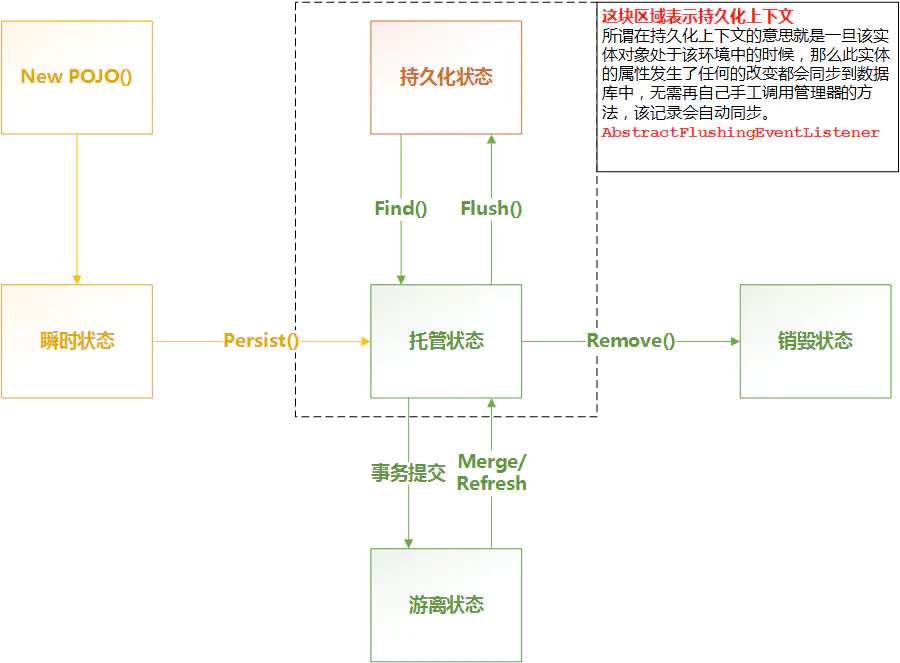

## 概述

### JPA是什么

JPA 是Java Persistence API的缩写，是一套由Java官方制定的ORM**标准**。当制定这套标准以后，市场上就出现很多JPA框架。如：OpenJPA（apache），EclipseTop（linktop）(eclipse)，Hibernate。

### 相关故事

自从Hibernate框架被JBoss公司收购之后，作者Gavin King也加入了JBoss公司，不久就开始与JBoss管理者的理念产生了分歧。最后还是离开了Jboss公司，加入到了java官方sun公司。在Sun公司期间就将ORM的理念作为标准发布，这个标准就是JPA。

当JPA出现后，基于JPA标准的ORM框架象雨后的春笋大量出现。其中比较出名的有：Apache基金会的OpenJPA，Eclipse社区的EclipseTop。标准化ORM的出现，直接威胁到了原来的ORM框架Hibernate。因此Hibernate框架不得不应战，于是也开始了对JPA标准的支持。

由于Hibernate的历史原因，Hibernate对JPA标准的支持有两套，兼容性的支持和完全性的支持。

> 1. 兼容性的支持：操作的接口使用Hibernate原来制定的，只有映射的注解使用JPA标准接口提供。
> 2. 完全性的支持：操作的接口和映射的注解全部使用JPA的标准。

### Hibernate使用JPA规范解决了什么问题

**使用注解**来替代配置文件。

注解的作用其实就是代替配置文件，将程序的元数据写在代码上，所谓的元数据就是，程序必须依赖的数据。

配置文件不是编程语言的语法，所以是无法断点调试。而注解是Java语法，报错的时候可以**快速的定位问题**。

### 移植到OpenJPA

如果代码使用**纯**JPA标准编写，那么不修改java代码代码，而只需修改一下配置文件，即可将HIbernate的代码移植到其他的JPA框架（OpenJPA、EclipseTOP）。

> 注意：Hibernate是这么多JPA框架里面，性能最好的一个！
>
> OpenJPA使用的是JPA2.0规范，而Hibernate使用的是JPA2.1规范。所以将Hibernate编写的JPA代码切换OpenJPA的代码，**需要修改配置文件版本**。

> 参考：[JPA【入门篇】](https://zhuanlan.zhihu.com/p/103919787)

## JPA实体的四种状态

- **瞬时状态（transient）**

  数据库中没有数据与之对应。瞬时状态的实体就是一个普通的java对象，和持久化上下文无关联，数据库中也没有数据与之对应。

- **托管状态（persistent）**

  数据库中有数据与之对应。使用EntityManager进行find或者persist操作返回的对象即处于托管状态，此时该对象已经处于持久化上下文中，因此任何对于该实体的更新都会同步到数据库中。

- **游离状态（detached）**

  数据库中有数据与之对应，但当前没有session与之关联；托管对象状态发生改变，hibernate不能检测到。当事务提交后，处于托管状态的对象就转变为了游离状态。此时该对象已经不处于持久化上下文中，因此任何对于该对象的修改都不会同步到数据库中。

- **删除状态 （deleted）**

  当调用EntityManger对实体进行delete后，该实体对象就处于删除状态。其本质也就是一个瞬时状态的对象。

