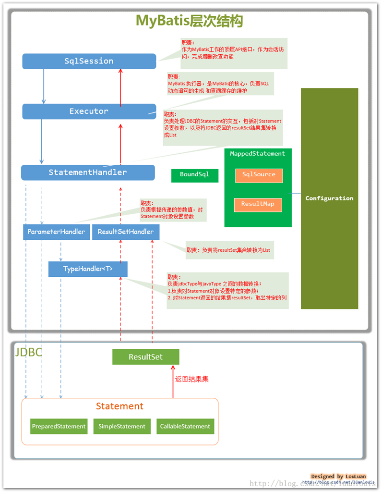

## [**概述**](https://www.jianshu.com/p/ec40a82cae28)

MyBatis和Hibernate一样，是一个优秀的持久层框架。原生的jdbc操作存在大量的重复性代码（如注册驱动，创建连接，创建statement，结果集检测等）。框架的作用就是把这些繁琐的代码封装，这样可以让程序员专注于sql语句本身。

MyBatis通过XML或者注解的方式将要执行的sql语句配置起来，并通过java对象和sql语句映射成最终执行的sql语句。最终由MyBatis框架执行sql，并将结果映射成java对象并返回。


## 数据处理

1. 参数映射：ParameterHandler
2. SQL解析：SqlSource
3. SQL执行：Executor
4. 结果处理和映射：ResultSetHandler


 

## MyBatis的[执行流程](https://blog.csdn.net/qq_32166627/article/details/70741729)

1. mybatis**配置文件**，包括Mybatis全局配置文件和Mybatis映射文件，其中全局配置文件配置了数据源、事务等信息；映射文件配置了SQL执行相关的信息。
2. mybatis通过读取配置文件信息（全局配置文件和映射文件），生成Configuration对象，然后根据Configuration构造出SqlSessionFactory，即会话工厂。
3. 通过**SqlSessionFactory**，可以创建SqlSession即会话。Mybatis是通过SqlSession来操作数据库的。
4. **SqlSession**本身不能直接操作数据库，它是通过底层的Executor执行器接口来操作数据库的。Executor接口有两个实现类，一个是普通执行器，一个是缓存执行器（默认）。MyBatis封装了对数据库的**访问**，把对数据库的会话和事务控制放到了SqlSession对象中
5. **Executor**执行器要处理的SQL信息是封装到一个底层对象MappedStatement中。该对象包括：SQL语句、输入参数映射信息、输出结果集映射信息。其中输入参数和输出结果的映射类型包括java的简单类型、HashMap集合对象、POJO对象类型。

**Executor的功能和作用**

1. 根据传递的参数，完成SQL语句的动态解析，生成BoundSql对象，供StatementHandler使用；
2. 为查询创建缓存，以提高性能；
3. 创建JDBC的Statement连接对象，传递给StatementHandler对象，返回List查询结果；

 

 

## **MyBatis初始化机制**

任何框架的初始化，无非是加载自己运行时所需要的配置信息。MyBatis的配置信息，大概包含以下信息，其高层级结构如下：

configuration 配置
	properties 属性
	settings 设置
	typeAliases 类型命名
	typeHandlers 类型处理器
	objectFactory 对象工厂
	plugins 插件
	environments 环境
		environment 环境变量
		transactionManager 事物管理器
		dataSource 数据源
	映射器

使用 org.apache.ibatis.session.**Configuration**对象作为一个**所有配置**信息的容器，Configuration对象的组织结构和XML配置文件的组织结构几乎完全一样（当然，Configuration对象的功能并不限于此，它还负责创建一些MyBatis内部使用的对象，如Executor等。可以这么说，MyBatis初始化的过程，就是创建 Configuration对象的过程。

**MyBatis的初始化可以有两种方式**

基于**XML配置**文件：基于XML配置文件的方式是将MyBatis的所有配置信息放在XML文件中，MyBatis通过加载并XML配置文件，将配置文信息组装成内部的Configuration对象。

基于**Java API：**这种方式不使用XML配置文件，需要MyBatis使用者在Java代码中，手动创建Configuration对象，然后将配置参数set 进入Configuration对象中。

 

 

## [**主要构件**](https://www.jianshu.com/p/ec40a82cae28)及其相互关系

**SqlSession：**作为MyBatis工作的主要顶层API，表示和数据库交互的会话，完成必要数据库增删改查功能；

**Executor：**MyBatis执行器，是MyBatis 调度的核心，负责SQL语句的生成和查询缓存的维护；

**StatementHandler：**封装了JDBC Statement操作，负责对JDBC statement 的操作，如设置参数、将Statement结果集转换成List集合。

**ParameterHandler：**负责对用户传递的参数转换成JDBC Statement 所需要的参数；

**ResultSetHandler：**负责将JDBC返回的ResultSet结果集对象转换成List类型的集合；

**TypeHandler：**负责java数据类型和jdbc数据类型之间的映射和转换；

**MappedStatement：**MappedStatement维护了一条<select|update|delete|insert>节点的封装；

**SqlSource：**负责根据用户传递的parameterObject，动态地生成SQL语句，将信息封装到BoundSql对象中，并返回；

**BoundSql：**表示动态生成的SQL语句以及相应的参数信息；

**Configuration：**MyBatis所有的配置信息都维持在Configuration对象之中；

**SqlSessionFactoryBuilder ：**SqlSessionFactory的构造器，用于创建SqlSessionFactory，采用了[**Builder设计模式**](onenote:JAVA.one#CoreJava&section-id={BB0F7AEA-6EDE-4C62-BA6B-C3B44D3FF49F}&page-id={72C3EAD6-D7FE-4D38-8DEC-2C9AA6B9DFA9}&object-id={429876D7-25E2-09B1-2661-B59378EEC7CA}&D&base-path=https://d.docs.live.net/33c60bae7d1e31a9/文档/技术学习)

**SqlSessionFactory：**SqlSession工厂类，以工厂形式创建SqlSession对象，采用了Factory工厂设计模式


 


## Executor在sqlSession中的[应用](https://blog.csdn.net/ykzhen2015/article/details/50315027)

一个mapper被执行是通过动态代理来完成的，然后进入到了sqlSession的方法中去。这个并不难理解，但是sqlSession内部是通过**四大对象**的协作来运行。(**四大对象是指：executor，statementHandler，parameterHandler，resultHandler对象**)

SqlSession是一个接口，mybatis内部是通过DefaultSqlSession这个实现类为我们提供服务。这个类是通过executor去执行方法来完成查询的。

**三种执行器**

- **Simple**Executor：SIMPLE 就是普通的执行器。
- **Reuse**Executor：执行器会重用预处理语句（prepared statements）

- **Batch**Executor：它是批量执行器

默认的是simple，该模式下它为每个语句的执行创建一个新的预处理语句，单条提交sql；而batch模式重复使用已经预处理的语句，批量执行所有更新语句，显然batch性能将更优；batch模式也有自己的问题，比如在Insert操作时，在事务没有提交之前，是没有办法获取到自增的id，这在某型情形下是不符合业务要求的，在同一事务中batch模式和simple模式之间无法转换

可以通过配置文件的settings里面的元素defaultExecutorType，配置它，默认是采用SimpleExecutor如果你在Spring运用它，那么你可以这么配置它：

```xml
<bean id="sqlSessionTemplateBatch" class="org.mybatis.spring.SqlSessionTemplate">       
	<constructor-arg index="0" ref="sqlSessionFactory" />    
	<!--更新采用批量的executor -->    
	<constructor-arg index="1" value="BATCH"/>    
</bean> 
```

这样，它便是一个批量的执行器。mybatis的三个executor都有一个共同的父类——**Base**Executor。


 

## [MyBatis缓存](https://tech.meituan.com/mybatis_cache.html)

**一级缓存**

在应用运行过程中，我们有可能在一次数据库会话中，执行多次查询条件完全相同的SQL，MyBatis提供了一级缓存的方案优化这部分场景，如果是相同的SQL语句，会优先命中一级缓存，避免直接对数据库进行查询，提高性能。

MyBatis一级缓存的生命周期和SqlSession一致。

MyBatis一级缓存内部设计简单，只是一个没有容量限定的HashMap，在缓存的功能性上有所欠缺。

MyBatis的一级缓存最大范围是SqlSession内部，有多个SqlSession或者分布式的环境下，数据库写操作会引起脏数据，建议设定缓存级别为Statement。


**二级缓存**

在上文中提到的一级缓存中，其最大的共享范围就是一个SqlSession内部，如果多个SqlSession之间需要共享缓存，则需要使用到二级缓存。开启二级缓存后，会使用CachingExecutor装饰Executor，进入一级缓存的查询流程前，先在CachingExecutor进行二级缓存的查询。

二级缓存开启后，同一个namespace下的所有操作语句，都影响着同一个Cache，即二级缓存被多个SqlSession共享，是一个全局的变量。

当开启缓存后，数据的查询执行的流程就是 二级缓存 -> 一级缓存 -> 数据库。

但是，通常我们会为每个单表创建单独的映射文件，由于MyBatis的二级缓存是基于namespace的，多表查询语句所在的namspace无法感应到其他namespace中的语句对多表查询中涉及的表进行的修改，引发脏数据问题。

> **总结**
>
> MyBatis的二级缓存相对于一级缓存来说，实现了SqlSession之间缓存数据的共享，同时粒度更加的细，能够到namespace级别，通过Cache接口实现类不同的组合，对Cache的可控性也更强。
>
> MyBatis在多表查询时，极大可能会出现脏数据，有设计上的缺陷，安全使用二级缓存的条件比较苛刻。
>
> 在分布式环境下，由于默认的MyBatis Cache实现都是基于本地的，分布式环境下必然会出现读取到脏数据，需要使用集中式缓存将MyBatis的Cache接口实现，有一定的开发成本，直接使用Redis,Memcached等分布式缓存可能成本更低，安全性也更高。


## SpringBoot中的SqlSession

在mybatis与springboot的结合中，sqlSession的实现类不再是myBatis默认的DefaultSqlSession，而是SqlSessionTemplate。

**SqlSessionTemplate** 是 MyBatis-Spring 的核心。 这个类负责管理 MyBatis 的 SqlSession, 调用 MyBatis 的 SQL 方法, 翻译异常。 SqlSessionTemplate 是线程安全的, 可以被多个 DAO 所共享使用。

SqlSessionTemplate的内部类SqlSessionInterceptor动态代理创建sqlSession。

在与springboot结合之后，sqlSession的创建在没有共享一个事务的情况下，都是一次mapper接口调用创建一个sqlSession，如果多次查询共享一个事务（通过SqlSessionHolder），则会共享同一个sqlSession（一级缓存）。

> Tips：SqlSessionHolder用于在TransactionSynchronizationManager中保持当前的SqlSession


## [MyBatis结合Redis](http://blog.csdn.net/xiaolyuh123/article/details/73912617)

1、开启Mybatis二级缓存

2、自定义缓存需要实现Mybatis的Cache接口，我这里将使用Redis来作为缓存的容器。


## Mybatis与JPA比较

**Mybatis**

需要在spring-boot的主类添加@MapperScan("com.example.demo.dao")

需要添加Mapper(Dao)接口，自定义所有的Dao方法以及使用注解或者xml添加对应方法的sql实现。

没有自动建表，需要手动建表。

配置application.properties连接数据库属性。

**JPA**

需要在pojo类添加注解@Entity，pojo类对应的每个属性需要添加@Id或者@Column。

添加Repository(Dao)接口，需要实现JpaRepository接口，可以不写方法声明。

配置application.properties连接数据库属性。

可通过配置spring.jpa.properties.hibernate.hbm2ddl.auto=update属性实现自动建表。

> **总结：**都需要添加Dao类，Mybatis的Dao类需要实现具体sql（注解或者xml），JPA不需要。对于pojo类的侵入性而言，Mybatis无需更改pojo类的任何地方，而JPA需要添加注解实现映射。


## **mybatis和hibernate的区别**

- hibernate入门门槛高，是一个标准的ORM矿建（对象关系映射），不需要程序写sql，sql语句自动生成，对sql语句进行优化、修改比较困难。

- mybatis专注于sql本身，需要程序员自己编写sql语句，sql修改、优化比较方便。是一个不完全的ORM框架，而且比较重要的一点是mybatis对于**输入参数和返回参数的自动映射**使得开发更加方便。

  > hibernate适用于**需求变化不多**的中小型项目，比如：后台管理系统；mybatis适用于**需求变化较多**的项目，比如：互联网项目。


## SQL注入

主要解决sql的like 、in 、order by [注入问题](https://blog.csdn.net/chen3888015/article/details/79657083)

**Like**

处理方式1：在程序中校验并拼接%后，直接用#格式，如下

```
select * from user where name like #{name}
```

处理方式2：在xml配置中用sql的内置函数拼接，如下

```
select * from user where name like concat('%',#{name},'%')
```

**In**

```
select * from user where id in
<foreach collection="ids" item="item" open="("separator="," close=")">#{item}</foreach>
```


## Mapper方法不可重载

mybatis在动态代理调用方法时，Mybatis使用package+Mapper+method全限名作为key，去xml内寻找唯一sql来执行的。类似：key=x.y.UserMapper.getUserById，那么，重载方法时将导致矛盾。对于Mapper接口，[Mybatis禁止方法重载（overLoad）](https://blog.csdn.net/yuandengta/article/details/108645364)。


## FAQ

>**Mybatis 无法注入mapper**

解决：未配置包扫描路径。

Mybatis的xml方式或者注解方式都需要配置@MapperScan


> **访问mapper方法出现异常：binding.BindingException: Invalid bound statement (not found)**

可能原因1：
mybatis.mapper-locations路径配置有误：例如：mybatis.mapper-locations=classpath:mybatis/mapper/ArticleMapper.xml
重新编译项目：rebuild

可能原因2：
1 当所有接口的mapper对应的xml文件都放在同一个目录下的时候，mybatis.mapper-locations指定到该目录并用\*匹配即可；
2 当所有接口的mapper对应的xml文件放在各自的包路径下面时，不仅仅需要mybatis.mapper-locations用\*匹配目录，还需要在pom.xml下的<build>中加入对xml的打包，否则生成的运行文件中不包含对应的xml文件，导致出现异常：BindingException: Invalid bound statement (not found)


