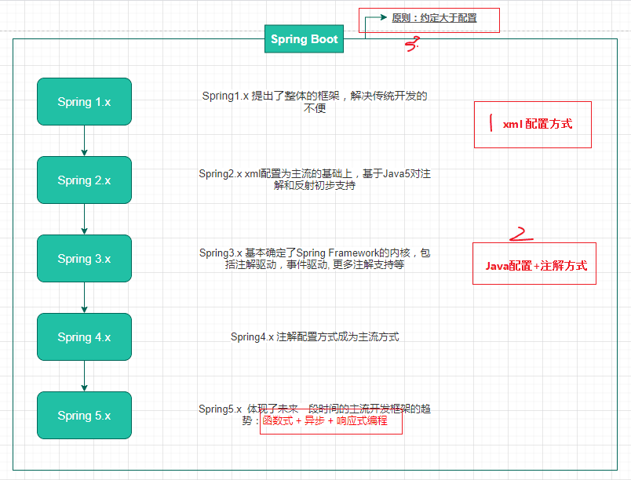

## Spring历史更新



> 来源： https://www.pdai.tech/md/spring/spring-x-framework-helloworld.html

### 各版本支持的JDK

- Spring Framework 4.x：支持 Java 6、7 和 8

- Spring Framework 5.x：支持 Java 8 到 Java 17


## Bean的加载过程

1. **资源定位**：定位到我们需要的进行ioc的bean；对于注解配置，会扫描指定包路径下带有特定注解（如 @Component 等）的类。

2. **注册bean定义**：把 BeanDefinition 对象注册到 BeanFactory；以 Bean 名字为键，BeanDefinition 为值存储。

3. **实例化bean**：根据 BeanDefinition，利用反射机制调用构造方法创建 Bean 实例。

4. **依赖注入**；反射调用 setter 方法或其他方式，将属性值（包括对其他 Bean 的引用、基本类型、集合等）注入到 Bean 实例。

5. **初始化bean**：Bean 实现了 InitializingBean 接口，则调用 afterPropertiesSet () 方法。


## bean的注入过程

Spring ioc 容器的核心类是 AbstractApplicationContext，入口是 `refresh()` 方法，该方法是个模板方法，定义了加载到容器的[全部过程](https://blog.csdn.net/ajianyingxiaoqinghan/article/details/107218224)。

整个 bean 注册过程核心功能可以概括为：

1. 创建bean工厂
2. 注册bean定义
3. 调用bean工厂后处理器
4. 注册bean后处理器
5. bean实例化
   - bean初始化
   - bean赋值
   - 执行bean后处理器（before、after）
   - bean注册

> 后处理器：
> 
> - BeanFactoryPostProcessor，是由 Spring 框架组建提供的容器扩展机制，允许在 Bean 对象注册后但**未实例化**之前，对 Bean 的定义信息 `BeanDefinition` 执行修改操作。
> - BeanPostProcessor，也是 Spring 提供的扩展机制，不过 BeanPostProcessor 是在 Bean 对象**实例化之后**修改 Bean 对象，也可以替换 Bean 对象。这部分与后面要实现的 AOP 有着密切的关系（动态代理）。

### 过程

注册bean定义 -> ① -> 实例化bean -> 依赖的装配 -> ② -> 初始化bean -> ③ -> OK

> 其中①②③是Spring预留的三个埋点，可以在这些地方插入一些用户代码，进行一些[定制化](https://www.cnblogs.com/lixinjie/p/taste-spring-009.html)。

ConfigurationClassPostProcessor不仅仅是一个bean工厂后处理器，还是一个专门用于注册bean定义的后处理器。这个类在容器启动时会被调用，因此把其它类的bean定义注册到了容器中。

**处理的问题**

- 可能有 Bean 可能有别名、可能有依赖、也可能是被 BeanFactory 包装过，所以会有 transformedBeanName 来处理这些差异化行为。
- 有没有循环依赖、有没有父工厂、是单例还是原型、是懒加载还是预加载、在不在缓冲区，所以就有各种组合判断来做不同的流程。
- 提早暴漏对象、三级缓存、后置标记清楚，所有的优化处理都是为了让整个 Bean 的获取更加高效。

**Spring Bean 容器是什么？**

Spring 包含并管理应用对象的配置和生命周期，在这个意义上它是一种用于承载对象的容器，你可以配置你的每个 Bean 对象是如何被创建的，这些 Bean 可以创建一个单独的实例或者每次需要时都生成一个新的实例，以及它们是如何相互关联构建和使用的。

如果一个 Bean 对象交给 Spring 容器管理，那么这个 Bean 对象就应该以类似零件的方式被拆解后存放到 Bean 的定义中，这样相当于一种把对象解耦的操作，可以由 Spring 更加容易的管理，就像处理循环依赖等操作。

当一个 Bean 对象被定义存放以后，再由 Spring 统一进行装配，这个过程包括 Bean 的初始化、属性填充等，最终我们就可以完整的使用一个 Bean 实例化后的对象了。

### refresh方法

```java
@Override
    public void refresh() throws BeansException, IllegalStateException {
        synchronized (this.startupShutdownMonitor) {
            prepareRefresh();
            ConfigurableListableBeanFactory beanFactory = obtainFreshBeanFactory();
            prepareBeanFactory(beanFactory);
            try {
                postProcessBeanFactory(beanFactory);
                // 注册 BeanDefinition 到 BeanDefinitionRegistry 中
                invokeBeanFactoryPostProcessors(beanFactory);
                registerBeanPostProcessors(beanFactory);
                initMessageSource();
                initApplicationEventMulticaster();
                onRefresh();
                registerListeners();
                // 将 BeanDefinition 转换为 Bean 实例
                finishBeanFactoryInitialization(beanFactory);
                finishRefresh();
            } catch (BeansException ex) {
                if (logger.isWarnEnabled()) {
                    logger.warn("Exception encountered during context initialization - " +
                            "cancelling refresh attempt: " + ex);
                }
                destroyBeans();
                cancelRefresh(ex);
                throw ex;
            }
            finally {
                resetCommonCaches();
            }
        }
    }
```

重要的来说，就是[四大步](https://www.cnblogs.com/lixinjie/p/taste-spring-009.html)：

1. 准备好bean工厂（BeanFactory）。
2. 调用已经注册的bean工厂后处理器（BeanFactoryPostProcessor）。
3. 注册bean后处理器（BeanPostProcessor）。
4. 实例化所有的单例bean。

**bean 是在什么时候被创建的，有哪些规则？**

容器初始化的时候会预先对单例和非延迟加载的对象进行预先初始化。其他的都是延迟加载是在第一次调用getBean 的时候被创建。

bean 的创建过程其实都是通过调用工厂的 getBean 方法来完成的。这里面将会完成对构造函数的选择、依赖注入等。

[GetBean](https://bugstack.cn/interview/2021/04/18/%E9%9D%A2%E7%BB%8F%E6%89%8B%E5%86%8C-%E7%AC%AC30%E7%AF%87-%E5%85%B3%E4%BA%8E-Spring-%E4%B8%AD-getBean-%E7%9A%84%E5%85%A8%E6%B5%81%E7%A8%8B%E6%BA%90%E7%A0%81%E8%A7%A3%E6%9E%90.html) 的大概过程：

1. 先尝试从单例缓存对象里获取。这个位置就是三级缓存解决循环依赖的方法。

2. 从父容器里取定义，有则由父容器创建。

3. 如果是单例，则走单例对象的创建过程：在 spring 容器里单例对象和非单例对象的创建过程是一样的。都会调用父类 AbstractAutowireCapableBeanFactory 的 createBean 方法。 不同的是单例对象只创建一次并且需要缓存起来。

> 如果想要详细了解原理，推荐阅读：[《Spring 手撸专栏》第 2 章：小试牛刀(让新手能懂)，实现一个简单的Bean容器](https://segmentfault.com/a/1190000040031724)

## BeanDefinition

BeanDefinition的实例用来描述对象的信息，比如说，Spring用BeanDefinition来存储着我们日常给SpringBean定义的元数据(@Scope、@Lazy、@DependsOn等等）
可以理解为：Class只描述了类的信息，而BeanDefinition描述了对象的信息

## ApplicationContextAware

从已有的spring上下文取得已实例化的bean。通过[ApplicationContextAware](https://www.jianshu.com/p/4c0723615a52)接口进行实现。

当一个类实现了这个接口（ApplicationContextAware）之后，这个类就可以方便获得ApplicationContext中的所有bean。换句话说，就是这个类可以直接获取 spring 配置文件中，所有有引用到的bean对象。

## ApplicationEvent

`ApplicationEvent`以及`Listener`是Spring为我们提供的一个事件监听、订阅的实现，内部实现原理是观察者设计模式，设计初衷也是为了系统业务逻辑之间的解耦，提高可扩展性以及可维护性。事件发布者并不需要考虑谁去监听，监听具体的实现内容是什么，发布者的工作只是为了[发布事件](https://segmentfault.com/a/1190000011433514)而已。

结合springboot，实现简单的事件发布和订阅（异步消费）：

**EchoEvent.java**：自定义事件

```
/**
 * 自定义事件
 **/
@Getter
@Setter
@Builder
public class EchoEvent implements Serializable {
    private String msg;
}
```

**MsgListener.java**：事件监听处理

```
/**
 * 事件监听处理
 **/
@Slf4j
@Component
public class MsgListener {

    @Async
    @EventListener
    public void onEcho(EchoEvent event) {
        log.info("listener is call");
        log.info("the EchoEvent msg is " + event.getMsg());
    }
}
```

测试推送

```
@Slf4j
@SpringBootTest
class EventListenerApplicationTests implements ApplicationContextAware {

    private ApplicationContext applicationContext;

    @Override
    public void setApplicationContext(ApplicationContext applicationContext) throws BeansException {
        this.applicationContext = applicationContext;
    }

    @Test
    void doEvent() {
        applicationContext.publishEvent(EchoEvent.builder().msg("hei, boy").build());
        log.info("push finish");
    }

}
```

## Spring注解

注解对分层中的类进行注释：

| 注解          | 作用                              |
| ----------- | ------------------------------- |
| @Service    | 用于标注业务层组件                       |
| @Controller | 用于标注控制层组件（如struts中的action）      |
| @Repository | 用于标注数据访问组件，即DAO组件               |
| @Component  | 泛指组件，当组件不好归类的时候，我们可以使用这个注解进行标注。 |

## 事务管理

> Spring 事务的传播属性定义了事务方法在被另一个事务方法调用时，事务应该如何传播

当使用声明式事务模型时，您必须告诉容器如何去管理事务，例如，何时开启一个事务？哪些方法需要事务？当前不存在事务的情况下，容器是否需要为其添加事务控制？事实上，Spring提供了一个bean ——TransactionAttributSource，通过配置其事务（传播）属性（transactionattribute）来达到精确控制事务行为的目的。事务的(传播)属性总共[有七种](https://blog.csdn.net/caomiao2006/article/details/38829039)：

1. **REQUIRED（默认）**
   
   如果当前没有事务，就新建一个事务；如果已经存在一个事务，则加入到这个事务中。

2. **SUPPORTS**
   
   如果当前存在事务，则加入该事务；如果当前没有事务，则以非事务的方式执行。

3. **MANDATORY**
   
   要求当前必须存在事务，如果没有事务则抛出异常。

4. **REQUIRES_NEW**
   
   新建事务，如果当前存在事务，则把当前事务挂起。

5. **NOT_SUPPORTED**
   
   以非事务方式执行，如果当前存在事务，则把当前事务挂起。

6. **NEVER**
   
   以非事务方式执行，如果当前存在事务，则抛出异常。

7. **NESTED**
   
   如果当前存在事务，则在嵌套事务内执行；如果当前没有事务，则新建一个事务。嵌套事务是外部事务的子事务，外部事务回滚时，嵌套事务也会回滚，而嵌套事务回滚不会影响外部事务的提交。

#### 七种事务属性

**Required**

告诉容器某个特定的方法需要一个事务，如果上下文中**已经存在事务**，**则加入**；**否则**，**开启一个事务**。这是一种使用最频繁的事务属性，适用于大多数情况；但是并不绝对，下面我们将会看到对于某些场景，总会有更好的理由去使用Mandatory属性。

**Mandatory**

告诉容器某个特定的方法需要一个事务。但是，不同于Required属性，它无论如何都**不会开启新的事务**；相反的，它会“强制”要求该方法**被调用时**上下文中**必须存在事务**，否则会抛出TransactionRequiredException异常，提示需要一个事务但没有找到。何时选择Mandatory，后面将会专门抽出一节来分析。

**RequiresNew**

告诉容器某个特定的方法需要一个新事务的支持。如果上下文中已经存在事务A，则该事务A挂起，并启动一个新的事务B。当事务B结束后，事务A被唤醒并继续执行。事实上，使用RequiresNew违反了事务的ACID原则，因为新事务会导致原有事务的挂起。

该属性在某个行为必须被完成（提交或回滚）而不受外部事务结果影响时十分有用，例如记录日志。大多数交易系统的每一个操作都必须写进日志，无论其执行结果如何（成功或失败）。假设某个股票交易的方法placement()启动了一个事务，并且调用了一个通用的方法audit()来记录日志。由于audit()和placement()处于同一个事务的管辖范围之内，因此一旦placement()回滚，audit()记录的日志也会相应的进行回滚；这就违背了“任何成功或失败的操作都必须记录日志”这一业务逻辑。如果将audit()的事务属性设作RequiresNew，则确保了audit()在一个新的、单独的事务中记录日志，因此不受placement()中外部事务的影响。

**Supports**

告诉容器，该方法不需要事务支持，但如果当前上下文中已经存在了一个事务，则加入其中。Supports这是一个相当强大、相当有用的事务属性。考虑这样一个场景，业务方法A用来查询某个交易者特定时期的交易总量。由于是查询操作，因此这个时候事务并不是必须的，因此我们将其事务属性设为Supports，来告诉容器在调用方法时不要开启新的事务。但是，如果方法A被某个已经存在事务控制的方法B所调用，那么它就会加入当前事务；那么，在该事务提交之前，方法B中对数据的任何修改对于方法A来说，都是可见的。

下面我们举个更具体的例子来说明Supports的作用。假设某位交易者一天的最大交易额是一百万，如果采用Supports作为事务属性，一次超额交易的具体处理流程如下：

| 事务回滚                                                                                                                    | 事务提交                                                                                                                           |
| ----------------------------------------------------------------------------------------------------------------------- | ------------------------------------------------------------------------------------------------------------------------------ |
| 目前为止，当天总共的交易量是900，000  事务启动  交易者又进行了一笔200，000的交易  事务为**Supports**的查询方法，同一个事务得到结果为1,100,000  业务逻辑判断，已经超过最大交易限额，抛出异常，事务回滚 | 目前为止，当天总共的交易量是900，000  事务启动  交易者又进行了一笔200，000的交易  事务为**NotSupported**的查询方法，非同一事务得到结果为1,100,000  业务逻辑判断没有超过最大交易限额，事务提交（实超过当天限额） |

**NotSupported**

告诉容器，该方法不需要事务支持；如果当前上下文中已经存在事务，则该事务被挂起直到该方法执行完毕。如果当前上下文中不存在事务，该方法则在没有事务支持的环境下执行。NotSupported适用于“某些方法在事务控制下有较大可能性会产生异常”的场合。例如在XA架构的事务处理过程中，调用包含DDL语句的存储过程往往会抛出异常，因此比较好的做法是将其设为NotSupported，暂时挂起当前事务。

**Never**

Never属性告诉容器，该方法必须在无事务的上下文中运行。注意，这与NotSupported不同，后者意味着，如果上下文中存在事务，则将该事务暂时挂起并在无事务的上下文中运行。但Never却不同，如果当前上下文中已经存在事务，则在调用该方法时会抛出一个异常，提示该方法不能在事务环境下运行。因为使用Never会导致各种意料之外的运行时异常，因此非必要不推荐使用

**PROPAGATION_NESTED**

Spring又添加了一种**新**的事务**属性**，**PROPAGATION_NESTED**，用于实现真正的**嵌套事务**，前提条件是外部环境必须提供相应的实现支持。尽管可以通过配置的方式在bean（类）级别指定事务属性，一般来说，还是应该将事务属性应用于方法级别。为整个bean配置某个事务属性意味着其内部所有的方法都采用它，而方法级别的事务属性可以将其覆盖。PROPAGATION_NESTED是已经存在事务的一个真正的子事务。嵌套事务开始执行时, 它将取得一个 savepoint。如果这个嵌套事务失败, 我们将回滚到此savepoint。嵌套事务是外部事务的一部分, 只有外部事务结束后它才会被提交。

**补充：事务的传播特性是什么呢？**

在我们用SSH开发项目的时候，我们一般都是将事务设置在Service层 那么当我们调用Service层的一个方法的时候它能够保证我们的这个方法中执行的所有的对数据库的更新操作保持在一个事务中，在事务层里面调用的这些方法要么全部成功，要么全部失败。那么事务的传播特性也是从这里说起的。

如果你在你的Service层的这个方法中，除了调用了Dao层的方法之外，还调用了本类的其他的Service方法，那么在调用其他的Service方法的时候，这个事务是怎么规定的呢，我必须保证我在我方法里掉用的这个方法与我本身的方法处在同一个事务中，否则如果保证事物的一致性。事务的传播特性就是解决这个问题的，“事务是会传播的”在Spring中有针对传播特性的多种配置我们大多数情况下只用其中的一种:**PROPGATION_REQUIRED**：这个配置项的意思是说当我调用service层的方法的时候开启一个事务(具体调用那一层的方法开始创建事务，要看你的aop的配置),那么在调用这个service层里面的其他的方法的时候,如果当前方法产生了事务就用当前方法产生的事务，否则就创建一个新的事务。这个工作使由Spring来帮助我们完成的。 

当我们项目中仅仅使用hibernate，而没有集成进spring的时候，我们在一个service层中调用其他的业务逻辑方法，为了保证事物必须也要把当前的hibernate session传递到下一个方法中，或者采用ThreadLocal的方法，将session传递给下一个方法，其实都是一个目的。现在这个工作由spring来帮助我们完成，就可以让我们更加的专注于我们的业务逻辑。而不用去关心事务的问题。

## Bean的生命周期

 

**Spring管理的Bean单例**

在spring中，从BeanFactory或ApplicationContext取得的实例为Singleton，也就是预设为每一个Bean的别名只能维持一个实例，而不是每次都产生一个新的对象使用Singleton模式产生单一实例。所以service层，dao层注入的是同一个对象，每次调用的也是同一个对象。

**Struts2管理的Action多实例**

而struts 2的Action是多实例的并非单例，也就是每次请求产生一个Action的对象。原因是：struts 2的Action中包含数据，例如你在页面填写的数据就会包含在Action的成员变量里面。如果Action是单实例的话，这些数据在多线程的环境下就会相互影响，例如造成别人填写的数据被你看到了。所以Struts2的Action是多例模式的。

## **BeanFactory和ApplicationContext的区别**

BeanFactory是Spring里面最低层的接口，提供了最简单的容器的功能，只提供了实例化对象和拿对象的功能。

BeanFactory是一个接口，ApplicationContext是一个类。

**两者装载bean的区别**

BeanFactory：在**启动**的**时**候**不**会去**实例化Bean**，中有从容器中拿Bean的时候才会去实例化；

ApplicationContext：在**启动**的**时**候就把所有的**Bean全部实例化**了。它还可以为Bean配置lazy-init=true来让Bean延迟实例化；

**我们该用BeanFactory还是ApplicationContent**

**BeanFactory 延迟实例化的优点：**

应用启动的时候占用资源很少，对资源要求较高的应用，比较有优势；

缺点：速度会相对来说慢一些。而且有可能会出现空指针异常的错误，而且通过bean工厂创建的bean生命周期会简单一些

**ApplicationContext 不延迟实例化的优点：**

所有的Bean在启动的时候都加载，系统运行的速度快；

在启动的时候所有的Bean都加载了，我们就能在系统启动的时候，尽早的发现系统中的配置问题

建议web应用，在启动的时候就把所有的Bean都加载了。

缺点：把费时的操作放到系统启动中完成，所有的对象都可以预加载，缺点就是消耗服务器的内存

## **Spring的IOC**

IOC （Inverse of Control） 控制反转，也可以称为依赖倒置。IOC理论提出的观点大体是这样的：借助于“第三方”**实现具有依赖关系的对象之间的解耦**。“第三方”，也就是IOC容器，通俗讲IOC容器负责加载各种依赖，并提供给各个模块所依赖的实例。

spring的[控制反转](http://www.cnblogs.com/ITtangtang/p/3978349.html#a1)即对象的创建和生命周期交给spring管理，依赖对象交给spring注入。Spring IoC容器会在我们使用的时候自动为我们创建，并且为我们注入好相关的依赖，这就是Spring核心功能的控制反转和依赖注入的相关功能。

**BeanFactory**

作为最顶层的一个接口类，它定义了IOC容器的基本功能规范。BeanFactory 有三个子类：

**Listable**BeanFactory、**Hierarchical**BeanFactory 、**AutowireCapable**BeanFactory

但是从上图中我们可以发现最终的默认实现类是 **DefaultListableBeanFactory**，他实现了所有的接口。那为何要定义这么多层次的接口呢？查阅这些接口的源码和说明发现，每个接口都有他使用的场合，它主要是为了区分在 Spring 内部在操作过程中对象的传递和转化过程中，对对象的数据访问所做的限制。例如 ListableBeanFactory 接口表示这些 Bean 是可列表的，而 HierarchicalBeanFactory 表示的是这些 Bean 是有继承关系的，也就是每个Bean 有可能有父 Bean。AutowireCapableBeanFactory 接口定义 Bean 的自动装配规则。这四个接口共同定义了 **Bean 的集合、Bean 之间的关系、以及 Bean 行为**。

**ApplicationContext**

是Spring提供的一个高级的IoC容器，它除了能够提供IoC容器的基本功能外，还为用户提供了以下的附加服务。

1. 支持信息源，可以实现国际化。（实现MessageSource接口）

2. 访问资源。(实现ResourcePatternResolver接口，这个后面要讲)

3. 支持应用事件。(实现ApplicationEventPublisher接口)

Spring IoC容器对Bean定义资源的载入是从refresh()函数开始的，refresh()是一个模板方法，refresh()方法的作用是：在创建IoC容器前，如果已经有容器存在，则需要把已有的容器销毁和关闭，以保证在refresh之后使用的是新建立起来的IoC容器。refresh的作用类似于对IoC容器的重启，在新建立好的容器中对容器进行初始化，对Bean定义资源进行载入。refresh()方法主要为IoC容器Bean的生命周期管理提供条件

## **Spring的AOP**

所谓AOP，即Aspect orientied program,就是[面向方面](http://www.ymq.io/2018/03/21/spring/#spring-aop的实现原理)(切面)的编程。

**特点**

让 **关注点代码与业务代码分离** ,可以动态地添加和删除在切面上的逻辑而不影响原来的执行代码。

1. 模块之间的耦合度;
2. 统容易扩展;
3. 的代码复用;

**AOP核心概念**

切面（aspect）

类是对物体特征的抽象，切面就是对横切关注点的抽象,面向切面编程，就是指 对很多功能都有的重复的代码抽取，再在运行的时候往业务方法上动态植入“切面类代码”。

通知（advice）

所谓通知指的就是指拦截到连接点之后要执行的代码，通知分为前置、后置、异常、最终、环绕通知五类

AOP代理（AOP Proxy）

在Spring AOP中有两种代理方式，JDK动态代理和CGLIB代理。

**AOP的实现原理**

- Spring AOP使用的动态代理，所谓的动态代理就是说AOP框架**不**会去**修改字节码**，而是在内存中**临时为方法生成**一个AOP**对象**，这个AOP对象**包含**了**目标对象**的**全部方法**，并且在特定的切点做了增强处理，并回调原对象的方法。
- Spring     AOP中的动态代理主要有两种方式，JDK动态代理和CGLIB动态代理。JDK动态代理通过反射来接收被代理的类，并且要求被代理的类必须实现一个接口。JDK动态代理的核心是InvocationHandler接口和Proxy类。
- 如果目标类没有实现接口，那么Spring AOP会选择使用CGLIB来动态代理目标类。CGLIB（Code Generation     Library），是一个代码生成的类库，可以在运行时动态的生成某个类的子类，注意，CGLIB是**通过继承**的方式**做**的**动态代理**，因此如果某个**类**被标记**为final**，那么它是**无法使用CGLIB**做动态代理的。

**拦截器**

一般拦截器都是实现HandlerInterceptor，其中有三个方法preHandle、postHandle、afterCompletion

**preHandle**：执行controller之前执行

**postHandle**：执行完controller，return modelAndView之前执行，主要操作modelAndView的值

**afterCompletion**：controller返回后执行

## **Spring定时**[**任务**](https://www.jianshu.com/p/1defb0f22ed1)

@Scheduled

**cron表达式语法**：

[秒] [分] [小时] [日] [月] [周] [年]

该参数接收一个cron表达式，cron表达式是一个字符串，字符串以5或6个空格隔开，分开共6或7个域，每一个域代表一个含义。

注：[年]不是必须的域，可以省略[年]，则一共6个域

**通配符说明:**

\* 表示所有值。 例如:在分的字段上设置 *,表示每一分钟都会触发。

? 表示不指定值。使用的场景为不需要关心当前设置这个字段的值。例如:要在每月的10号触发一个操作，但不关心是周几，所以需要周位置的那个字段设置为”?” 具体设置为 0 0 0 10 * ?

\- 表示区间。例如 在小时上设置 “10-12”,表示 10,11,12点都会触发。

, 表示指定多个值，例如在周字段上设置 “MON,WED,FRI” 表示周一，周三和周五触发

/ 用于递增触发。如在秒上面设置”5/15” 表示从5秒开始，每增15秒触发(5,20,35,50)。 在日字段上设置’1/3’所示每月1号开始，每隔三天触发一次。

## 循环依赖

Spring 通过三级缓存提前暴露对象解决循环依赖

一级缓存存放的是完整对象，也叫成品对象。二级缓存存放的是半成品对象，就是那些属性还没赋值的对象。三级缓存存放的是对象工厂，就是这用于处理 AOP 循环依赖的。

- 循环依赖分为三种，自身依赖于自身、互相循环依赖、多组循环依赖。
- 但无论循环依赖的数量有多少，循环依赖的本质是一样的。就是你的完整创建依赖于我，而我的完整创建也依赖于你，但我们互相没法解耦，最终导致依赖创建失败。
- 所以 Spring 提供了除了构造函数注入和原型注入外的，setter循环依赖注入解决方案。

**三级缓存解决什么**

- 有了二级缓存都能解决 Spring 依赖了，怎么要有三级缓存呢。其实我们在前面分析源码时也提到过，三级缓存主要是解决 Spring AOP 的特性。AOP 本身就是对方法的增强，是 `ObjectFactory<?>` 类型的 lambda 表达式，而 Spring 的原则又不希望将此类类型的 Bean 前置创建，所以要存放到三级缓存中处理。
- 其实整体处理过程类似，唯独是 B 在填充属性 A 时，先查询成品缓存、再查半成品缓存，最后在看看有没有单例工程类在三级缓存中。最终获取到以后调用 getObject 方法返回代理引用或者原始引用。
- 至此也就解决了 Spring AOP 所带来的三级缓存问题。*本章节涉及到的 AOP 依赖有源码例子，可以进行调试*

## @Autowired 与@Resource的区别

### 相同点

@Resource的作用相当于@Autowired，均可标注在字段或属性的[setter方法](https://blog.51cto.com/qiangmzsx/1359952)上。

### 不同点

- **提供方**不一样： `@Autowired` 是由Spring提供； `@Resource` 是由java提供，是Java标准，绝大部分框架都支持。需要JDK1.6及以上。

- **注入方式**不一样： `@Autowired` 只按照**类型**（byType）注入； `@Resource` 默认按**名称**（byName）自动注入，也提供按照byType 注入；
  
  > @Qualifier一般跟Autowired配合使用，需要指定一个bean的名称，通过bean名称就能找到需要装配的bean。

- **属性参数**有区别：Autowired只包含一个参数：required，表示是否开启自动准入，默认是true，也就是默认情况下它要求依赖对象必须存在。而@Resource包含七个参数，其中最重要的两个参数是：name 和 type。

## @Component, @Repository, @Service的区别

> 参考：[@Component, @Repository, @Service的区别](https://blog.csdn.net/fansili/article/details/78740877)

- @Component, @Service, @Controller, @Repository是spring注解，注解后可以被spring框架所扫描并注入到spring容器来进行管理
- @Component是通用注解，其他三个注解是这个注解的**拓展**，并且具有了特定的功能
- @Repository注解在持久层中，具有将数据库操作抛出的原生异常翻译转化为spring的持久层异常的功能。
- @Controller层是spring-mvc的注解，具有将请求进行转发，重定向的功能。
- @Service层是业务逻辑层注解，这个注解只是标注该类处于业务逻辑层。

用这些注解对应用进行分层之后，就能将请求处理，义务逻辑处理，数据库操作处理分离出来，为代码解耦，也方便了以后项目的维护和开发。

| 注解          | 含义                        |
| ----------- | ------------------------- |
| @Component  | 最普通的组件，可以被注入到spring容器进行管理 |
| @Repository | 作用于持久层                    |
| @Service    | 作用于业务逻辑层                  |
| @Controller | 作用于表现层（spring-mvc的注解）     |
