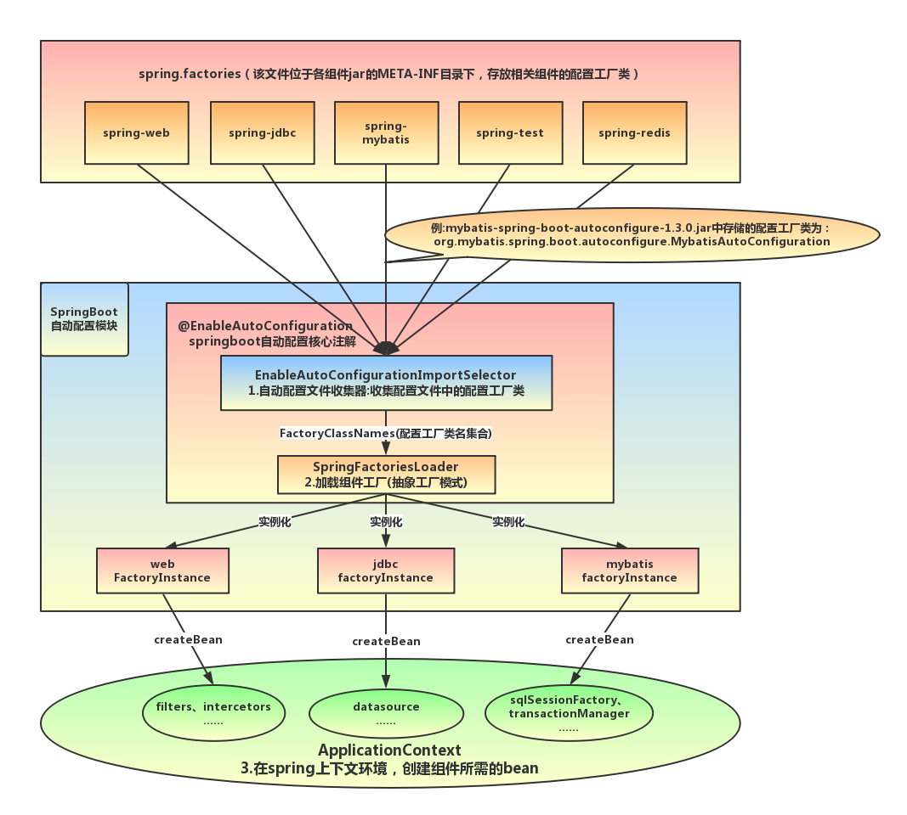

## **概述**

Spring Boot （Boot 顾名思义，是引导的意思）[框架](https://www.zhihu.com/question/53729800)是用于简化 Spring 应用从搭建到开发的过程。应用**开箱即用**，只要通过一个指令，包括命令行 java -jar 、SpringApplication 应用启动类 、 Spring Boot Maven 插件等，就可以启动应用了。另外，Spring Boot 强调只需要很少的配置文件，所以在开发生产级 Spring 应用中，让开发变得更加高效和简易。目前，Spring Boot 版本是 2.x 版本。Spring Boot 包括 WebFlux。

 

 

## **作用**

- 自动配置：针对很多Spring应用程序常见的应用功能，Spring Boot能自动提供相关配置
- 起步依赖：告诉Spring Boot需要什么功能，它就能引入需要的库。
- 命令行界面：这是Spring Boot的可选特性，借此你只需写代码就能完成完整的应用程序，无需传统项目构建。
- Actuator：让你能够深入运行中的Spring Boot应用程序，一探究竟。

 

 

## **Spring Boot** [**特性**](https://www.zhihu.com/question/39483566/answer/243413600)

- 支持运行期内嵌容器，如 Tomcat、Jetty
- 强大的开发包，支持热启动
- 自动管理依赖
- 自带应用监控
- 非常简洁的安全策略集成

 

 

## 启动过程

- SpringBoot的[启动过程](https://www.jianshu.com/p/cb5cb5937686)，实际上就是对ApplicationContext的初始化过程。
- ApplicationContext创建后立刻为其设置Environment，并由**ApplicationContextInitializer**对其进一步封装。
- 通过*SpringApplicationRunListener*在ApplicationContext初始化过程中各个时点发布各种广播事件，并由*ApplicationListener*负责接收广播事件。
- 初始化过程中完成IoC的注入，包括通过**@EnableAutoConfiguration**导入的各种自动配置类。
- 初始化完成前调用ApplicationRunner和CommandLineRunner的实现类。

 

启动流程主要分为三个部分：

1. 第一部分进行SpringApplication的初始化模块，配置一些基本的环境变量、资源、构造器、监听器
2. 第二部分实现了应用具体的启动方案，包括启动流程的监听模块、加载配置环境模块、及核心的创建上下文环境模块
3. 第三部分是自动化配置模块




## Spring Boot扩展机制

[java spi](https://blog.csdn.net/lldouble/article/details/80690446)的具体约定为:当服务的提供者，提供了服务接口的一种实现之后，在jar包的META-INF/services/目录里同时创建一个以服务接口命名的文件。该文件里就是实现该服务接口的具体实现类。而当外部程序装配这个模块的时候，就能通过该jar包META-INF/services/里的配置文件找到具体的实现类名，并装载实例化，完成模块的注入。 基于这样一个约定就能很好的找到服务接口的实现类，而不需要再代码里制定。

在Spring中也有一种类似与Java SPI的加载机制。它在META-INF/spring.factories文件中配置接口的实现类名称，然后在程序中读取这些配置文件并实例化。这种自定义的SPI机制是Spring Boot Starter实现的基础。


## 重要注解

**@ComponentScan**注解的作用是扫描@SpringBootApplication所在的Application类（即spring-boot项目的入口类）所在的包（basepackage）下所有的@component注解（或拓展了@component的注解）标记的bean，并注册到spring容器中。


  **@EnableAutoConfiguration** 自动配置：从classpath中搜寻所有的META-INF/spring.factories配置文件，并将其中EnableAutoConfiguration对应的配置项通过反射（Java Refletion）实例化为对应的标注了@Configuration的JavaConfig形式的IoC容器配置类，然后汇总为一个并加载到IoC容器。

> 出处：[Springboot 启动原理详细解析](https://www.cnblogs.com/jstarseven/p/11087157.html)


## **程序发布（Maven build打包程序）**

**eclipse****：** Run->Maven build

或者直接在项目的路径下面运行：mvn package

如果需要跳过单元测试可以使用：mvn package -DskipTests

启动命令：java -jar ./Application-0.0.1-SNAPSHOT.jar --server.port=8888 start

运行命令(输出到日志文件)：java -jar spring-boot01-1.0-SNAPSHOT.jar > log.file 2>&1 &

 

 

## [**日志管理**](https://blog.csdn.net/xudan1010/article/details/52890102)

在创建Spring Boot工程时，我们引入了spring-boot-starter，其中包含了spring-boot-starter-logging，该依赖内容就是Spring Boot默认的日志框架Logback，所以我们在引入log4j2之前，需要先排除该包的依赖，再引入log4j2的依赖。

```xml
<dependency>
    <groupId>org.springframework.boot</groupId>
    <artifactId>spring-boot-starter</artifactId>
    <exclusions>
        <exclusion>
            <groupId>org.springframework.boot</groupId>
            <artifactId>spring-boot-starter-logging</artifactId>
        </exclusion>
    </exclusions>
</dependency>
<dependency> 
    <groupId>org.springframework.boot</groupId>
    <artifactId>spring-boot-starter-log4j2</artifactId>
</dependency>
```

> **注意：**spring boot 1.3版本支持log4j，在spring boot 1.4的版本中，就需要使用log4j2，否则会出现如下错误：Project build error: 'dependencies.dependency.version' for org.springframework.boot:spring-boot-starter-log4j:jar is missing.


## **定时任务**

1 定时任务的开启，首先需要在项目的启动类上加入@EnableScheduling注解来启用定时任务。

2 在运行定时任务的类上加上@Component注解，表示该类可以作为定时任务类运行来交给spring运行。

3 在需要运行的方法上加上@Scheduled(fixedRate=1000)来定义执行的方式，这里表示每1秒运行一次。

 

 

## Spring Boot 2 [新特性](https://blog.csdn.net/yalishadaa/article/details/79400916)

- **默认connection pool变了**

默认的连接池已经由Tomcat切换到了HikariCP。

- **软件版本**

要求Tomcat最低版本为8.5、要求Hibernate最低版本为5.2、要求Jetty最低版本为9.4

- **Spring Framework 5.0**

Spring Boot 2.0 是建立在Spring Framework 5.0之上的（最低要求）

- **松绑定改善**

下面的属性最终都会被映射为 spring.jpa.databaseplatform=mysql

- spring.jpa.database-platform=mysql

- spring.jpa.databasePlatform=mysql

- spring.JPA.database_platform=mysql


## **Spring Boot Admin** 

Spring Boot Admin 是一个管理和[监控Spring Boot 应用程序](https://www.cnblogs.com/shihaiming/p/8488939.html)的开源软件。每个应用都认为是一个客户端，通过HTTP或者使用 Eureka注册到admin server中进行展示，Spring Boot Admin UI部分使用AngularJs将数据展示在前端。

Spring Boot Admin 是一个针对spring-boot的actuator接口进行UI美化封装的监控工具。他可以：在列表中浏览所有被监控spring-boot项目的基本信息，详细的Health信息、内存信息、JVM信息、垃圾回收信息、各种配置信息（比如数据源、缓存列表和命中率）等，还可以直接修改logger的level。

springboot2.0使用admin可以参考[本文](https://www.jianshu.com/p/2b66433bd373)。1.5.x参考[该文](https://www.cnblogs.com/shihaiming/p/8488939.html)。

 

## Spring Boot Admin的使用

springboot-admin分为**客户端**和**服务器端**，使用服务

客户端即为自己的应用；

服务端则为引入了spring-boot-admin-starter-server依赖的springboot应用。


**客户端**

客户端需要引入spring-boot-admin-starter-client依赖；如果需要端点保护，则还需引入spring-boot-starter-security依赖，

并添加配置文件和SecurityConfig.java；

**application.properties**

```properties
server.port=8001
## 是否开启security 拦截
security.basic.enabled=true
security.user.name=root
security.user.password=root
## 应用名称
spring.application.name=demo
## 监控服务端地址
spring.boot.admin.url=http://192.168.1.101:9191
## client访问服务端端点的认证信息
spring.boot.admin.username=root
spring.boot.admin.password=root
## 服务端访问client端点的地址信息（本应用访问地址）
spring.boot.admin.client.service-url=http://192.168.1.164:8001
## 服务端访问client端点的认证信息
spring.boot.admin.client.metadata.user.name=${security.user.name}
spring.boot.admin.client.metadata.user.password=${security.user.password}
## 安全认证
management.security.enabled=true
#可在线查看日志
endpoints.logfile.enabled=true
```

**SecurityConfig.java**

```java
@Configuration
publicclassSecurityConfigextendsWebSecurityConfigurerAdapter{
	@Override
	protectedvoidconfigure(HttpSecurityhttp)throwsException{
		http.csrf().disable();//配置跨域请求
		http.httpBasic().and()
		.authorizeRequests().antMatchers("/actuator/**").authenticated()
		.anyRequest().permitAll();//配置springboot-admin-client
		http.csrf().ignoringAntMatchers("/**");//忽略拦截所有地址（顺序不可变）
	}
}
```

 

**服务端**

客户端需要引入spring-boot-admin-starter-server依赖；如果需要端点保护，则还需引入spring-boot-starter-security依赖，

并添加配置文件和SecurityConfig.java；

**application.properties**

```properties
server.port=8000
# 配置SBA Client连接的安全账号密码
security.user.name=root
security.user.password=root
#开启安全验证
security.basic.enabled=true
```

**SecurityConfig.java**

```java
@Configuration
publicclassSecurityConfigextendsWebSecurityConfigurerAdapter{
	@Override
	protectedvoidconfigure(HttpSecurityhttp)throwsException{
		//Pagewithloginformisservedas/login.htmlanddoesaPOSTon/login
		http.formLogin().loginPage("/login.html").loginProcessingUrl("/login").permitAll();
		//TheUIdoesaPOSTon/logoutonlogout
		http.logout().logoutUrl("/logout");
		//Theuicurrentlydoesn'tsupportcsrf
		http.csrf().disable();
		
		//Requestsfortheloginpageandthestaticassetsareallowed
		http.authorizeRequests()
		.antMatchers("/login.html","/**/*.css","/img/**","/third-party/**")
		.permitAll();
		//...andanyotherrequestneedstobeauthorized
		http.authorizeRequests().antMatchers("/**").authenticated();
		
		//EnablesothattheclientscanauthenticateviaHTTPbasicforregistering
		http.httpBasic();
	}
}
```

**参考：**

> https://blog.csdn.net/lqm1991/article/details/83788978
>
> https://www.jianshu.com/p/921387db847e
>
> https://www.jianshu.com/p/d29663c1bddd
>
> http://codecentric.github.io/spring-boot-admin/1.5.0/#securing-spring-boot-admin


## **README文件**

一份好的README可以给人以项目全景[概览](https://mp.weixin.qq.com/s/M2FihtQmvMgX-o7JD8edzA)，可以使新人快速上手项目，可以降低沟通成本。同时，README应该简明扼要，条理清晰，建议包含以下方面：

- 项目简介：用一两句话简单描述该项目所实现的业务功能；
- 技术选型：列出项目的技术栈，包括语言、框架和中间件等；
- 本地构建：列出本地开发过程中所用到的工具命令；
- 领域模型：核心的领域概念，比如对于示例电商系统来说有Order、Product等；
- 测试策略：自动化测试如何分类，哪些必须写测试，哪些没有必要写测试；
- 技术架构：技术架构图；
- 部署架构：部署架构图；
- 外部依赖：项目运行时所依赖的外部集成方，比如订单系统会依赖于会员系统；
- 环境信息：各个环境的访问方式，数据库连接等；
- 编码实践：统一的编码实践，比如异常处理原则、分页封装等；
- FAQ：开发过程中常见问题的解答。

需要注意的是，README中的信息可能随着项目的演进而改变（比如引入了新的技术栈或者加入了新的领域模型），因此也是需要持续更新的。虽然我们知道，软件文档的一个痛点便是无法与项目实际进展保持同步，但是就README这点信息来讲，还是建议开发者们不要吝啬那一点点敲键盘的时间。

此外，除了保持README的持续更新，一些重要的架构决定可以通过示例代码的形式记录在代码库中，新开发者可以通过直接阅读这些示例代码快速了解项目的通用实践方式以及架构选择，请参考ThoughtWorks的技术雷达。