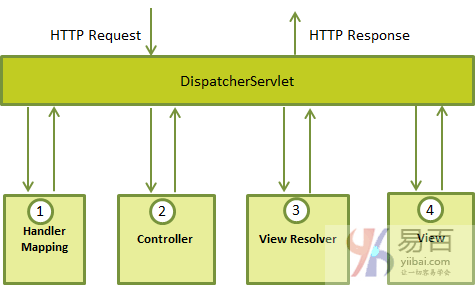

## **Spring MVC** [**概述**](https://www.yiibai.com/spring_mvc/springmvc_overview.html)

> Spring Web MVC是一种基于Java的实现了Web MVC设计模式的请求驱动类型的轻量级Web框架，即使用了MVC架
> 构模式的思想，**将web层进行职责解耦**，基于请求驱动指的就是使用请求-响应模型。

Spring web MVC框架提供了MVC(模型 - 视图 - 控制器)架构和用于开发灵活和松散耦合的Web应用程序的组件。 **MVC**模式导致应用程序的不同方面(输入逻辑，业务逻辑和UI逻辑)分离，同时提供这些元素之间的松散耦合。

- **模型(Model)** 封装了应用程序数据，通常它们将由**POJO**类组成。
- **视图(View)** 负责渲染模型数据，一般来说它生成客户端浏览器可以**解释HTML**输出。
- **控制器(Controller)** 负责处理用户请求并 **构建** 适当的模型，并将其传递给视图进行渲染（响应数据）。

 


## 优势

- 清晰的角色划分：前端控制器（DispatcherServlet）、请求到处理器映射（HandlerMapping）、处理器适配器（HandlerAdapter）、视图解析器（ViewResolver）、处理器或页面控制器（Controller）、验证器（ Validator）、命令对象（Command  请求参数绑定到的对象就叫命令对象）、表单对象（Form Object  提供给表单展示和提交到的对象就叫表单对象）。 
- 分工明确，而且扩展点相当灵活，可以很容易扩展，虽然几乎不需要； 
- 由于命令对象就是一个POJO，无需继承框架特定API，可以使用命令对象直接作为业务对象； 
- 和Spring 其他框架无缝集成，是其它Web框架所不具备的； 
- 可适配，通过HandlerAdapter可以支持任意的类作为处理器； 
- 可定制性，HandlerMapping、ViewResolver等能够非常简单的定制； 
- 功能强大的数据验证、格式化、绑定机制； 
- 利用Spring提供的Mock对象能够非常简单的进行Web层单元测试； 
- 本地化、主题的解析的支持，使我们更容易进行国际化和主题的切换。 
- 强大的JSP标签库，使JSP编写更容易。 
- 还有比如RESTful风格的支持、简单的文件上传、约定大于配置的契约式编程支持、基于注解的零配置支持等等。


 

## **HttpServlet**

Servlet([Tomcat](onenote:Web容器.one#Tomcat&section-id={9B6AA5FE-49EA-422B-B611-7B2BC44897FB}&page-id={07BA235F-A0EA-4830-9442-676A4E344354}&object-id={171FCE31-5BDC-03EB-2164-752F0448381D}&D&base-path=https://d.docs.live.net/33c60bae7d1e31a9/文档/技术学习))容器负责创建HttpServlet对象，并把Http请求直接封装到HttpServlet对象中，大大简化了HttpServlet解析请求数据的工作量。

**HttpServlet容器响应Web客户请求流程：**

1）Web客户向Servlet容器发出Http请求；

2）Servlet容器解析Web客户的Http请求；

3）Servlet容器创建一个HttpRequest对象，在这个对象中封装Http请求信息；

4）Servlet容器创建一个HttpResponse对象；

5）Servlet容器调用HttpServlet的service方法，把HttpRequest和HttpResponse对象作为service方法的参数传给HttpServlet对象；

6）HttpServlet调用HttpRequest的有关方法，获取HTTP请求信息；

7）HttpServlet调用HttpResponse的有关方法，生成响应数据；

8）Servlet容器把HttpServlet的响应结果传给Web客户。

SpringMVC的**DispatcherServlet**间接**继承**了**HttpServlet**抽象类，来实现请求和响应的处理。如果需要自己造轮子(造MVC框架)去处理http请求，就继承HttpServlet去实现自己的方法即可。

 

 

## DispatcherServlet

Spring Web模型 - 视图 - 控制器(MVC)框架是围绕**DispatcherServlet**设计的，它处理所有的HTTP请求和响应。又叫前端控制器，来自前端的请求会先到达这里，它负责到后台去匹配合适的handler。是SpringMVC的统一处理入口。

DispatcherServlet在初始化的时候就会根据 `DispatcherServlet.properties` 把映射器、适配器、试图解析器、异常处理器、文件处理器等都初始化。所有的请求都会被它的 `doService()` 方法处理，里面最主要的是调用 `doDispatch()` 方法。

请求处理工作流如下图所示：

 


以下是对应于到DispatcherServlet的传入HTTP请求的事件顺序：

- 在接收到HTTP请求后，DispatcherServlet会查询HandlerMapping以调用相应的Controller。
- Controller接受请求并根据使用的GET或POST方法调用相应的服务方法。     服务方法将基于定义的业务逻辑设置模型数据，并将视图名称返回给DispatcherServlet。
- DispatcherServlet将从ViewResolver获取请求的定义视图。
- 当视图完成，DispatcherServlet将模型数据传递到最终的视图，并在浏览器上呈现。

所有上述组件，即: HandlerMapping，Controller和ViewResolver是WebApplicationContext的一部分，它是普通ApplicationContext的扩展，带有Web应用程序所需的一些额外功能。

注：需要通过使用**web.xml**文件中的URL映射来映射希望**DispatcherServlet处理**的请求。


## **初始化加载**

 

从图中可以看出：
Spring的ContextLoaderListener初始化的上下文加载的Bean是对于整个应用程序共享的，不管是使用什么表现层技术，一般如DAO层、Service层Bean；
SpringMVC的DispatcherServlet初始化的上下文加载的Bean是只对Spring Web MVC有效的Bean，如Controller、HandlerMapping、HandlerAdapter等等，该初始化上下文应该只加载Web相关组件。


 

## **Spring MVC获取表单参数**

Spring MVC获取表单参数有如下4种：

- **Controller形参(Model)** ：写在Controller方法的形参里。
- **bean(View)** ：通过bean接收。

注意：使用bean接收无需定义form表单输入框name的前缀为xxx.属性，而是直接使用属性即可。

- **HttpServletRequest(Controller)** ：通过request.getParameter("参数名")获取参数值。
- **json**

 

 

## **Spring MVC数据绑定**

springMVC默认支持的数据绑定类型：

**基本数据类型及其包装类类型**

与方法形参一致

形参数据类型声明为想要的数据类型，默认参数名字要和传递过来的参数名字保持一致，例如提交的请求为：

```java
// http://localhost:8088/smvc/login.action?id=100
@RequestMapping(“/login”)
public String login(Integer id){
	//形式参数id就可以接收到请求url上的id属性值。
}
```

使用注解@RequestParam

如果参数名字和request提交过来的请求参数名字不一致，可以使用注解@RequestParam指明要将提交过来的哪个请求参数，注入给哪个方法参数。

```java
@RequestMapping(“/login”)
public String login(@RequestParam(value="id",required=false,defaultValue="100")Integer user_id){
	//形式参数id就可以接收到请求url上的id属性值。
	//如上代码指定了随请求传递过来的名字为uid的参数将赋值给user_id,参数不是必须的，如果请求没有传递名字为id的参数，那么赋予user_id默认值为100
}
```

> Tips：如果Controller方法参数中定义的是基本数据类型，但是从页面 提交过来的数据为null或者””的话，会出现数据转换的异常。也就是必须保证表单传递过来的数据不能为null或””，所以，在开发过程中，对可能为空 的数据，最好将参数数据类型定义成包装类型


**URI模板(template)映射**

URI Template可以允许@RequestMapping方法方便的选中URL的一部分内容进行访问。

一个URI Template看起来像一个URI 字符串，包含一个或多个变量名。当你给这些变量赋了合适的值之后，这个模板变成一个URI。例如: http://www.example.com/users/{userId}这个URI Template包含了一个userId变量，当给它指派一个值 test, 就变成了URI ->http://www.example.com/users/test.

语法：

```java
@RequestMapping("/path/{param}")
@RequestMapping("/path/{param}/path2");
@requestMapping("/path/{param1}/path2/{param2}")
```


模板参数只有**一个**

声明之后，在SpringMVC中你可以在一个方法参数上使用@PathVariable注解绑定它到这个URI模板变量上(方法参数可以是任意你想使用的简单数据类型,类似，int,double,String，Date等，后期数据绑定详细介绍...)。例如：

```java
@RequestMapping("/third/{userId}")
public String third(@PathVariable Long userId){
	System.out.println("userId:"+userId);
	return "/index.jsp";
}
```

一般要求方法中用来接收模板参数值的变量名要和模板参数名保持一致(即方法参数名<-->模板参数名)。如果方法参数跟模板参数名不一致，可以使用@PathVariable("模板参数名")来指定要将那个参数映射到当前方法参数上，例如：

```java
@RequestMapping("/third/{userId}")
public String third(@PathVariable("userId") Long uid){
	System.out.println("userId:"+uid);
	return "/index.jsp";
}
```

模板参数有**多个**

给每一个模板参数指定一个方法参数接收：

```java
@RequestMapping("/third/{userId}/update/{userId2}")
public String third(@PathVariable("userId") Long uid,@PathVariable String userId2){
	System.out.println("userId:"+uid);
	System.out.println("userId2:"+userId2);
	System.out.println("我是模板映射哟！");
	return "/index.jsp";
}
```

```java
// 使用一个map集合接收所有的参数：
@RequestMapping("/users/{userid}/save/{name}")
public String four(@PathVariable Map<String, String> vars){
	for(String key:vars.keySet()){
	System.out.println(key+"...."+vars.get(key));
	}
	return "/index.jsp";
}
```

此时将所有的模板参数名当做key值，访问时使用的替换值，作为map集合的value值存放。


分别在**类级别**和**方法级**别使用模板URI：

```java
@RequestMapping("/anno/{aid}")
public class AnnoController {
	@RequestMapping("/users/{userid}")
	public String four(@PathVariable Long aid,@PathVariable userid){
		return "/index.jsp";
	}
}
```


 

## Spring MVC和Struts2的[区别](http://www.jb51.net/article/120410.htm)

1、springmvc基于**方法**开发的，struts2基于**类**开发的。

2、**单例**和**多例**的[区别](https://blog.csdn.net/silenttalfrede/article/details/52950762)：springmvc在映射的时候，通过形参来接收参数的，是将url和controller方法映射，映射成功后，springmvc生成一个handlers对象，对象中只包括一个method，方法执行结束的时候，形参的数据就销毁，所以springmvc可以进行单例开发，并且建议使用。在Spring整合时，SpringMVC的Controller Bean默认**单例模式**。所以默认对所有的请求，只会创建一个Controller，线程安全。

但是structs接收的参数是通过类的成员变量来接收的，这些变量在多线程访问中，是共享的，而不是像springmvc那样，方法结束之后，形参自动销毁，且无法使用单例，只能使用多例。和Spring整合时Struts2的ActionBean注入作用域是**原型模式**（用于创建重复的对象,同时又能保证性能）否则会出现线程并发问题。

3、Struts2入口是**Filter**，Spring MVC入口是**Servlet**。则两者个方面机制不同，比如拦截器实现机制

4、Spring MVC结合Spring的Ioc/AOP特性, Spring Boot热更新等解决方案, 开发效率比Struts2高。SpringMVC开发速度和性能较优于Struts2，流程更容易理解