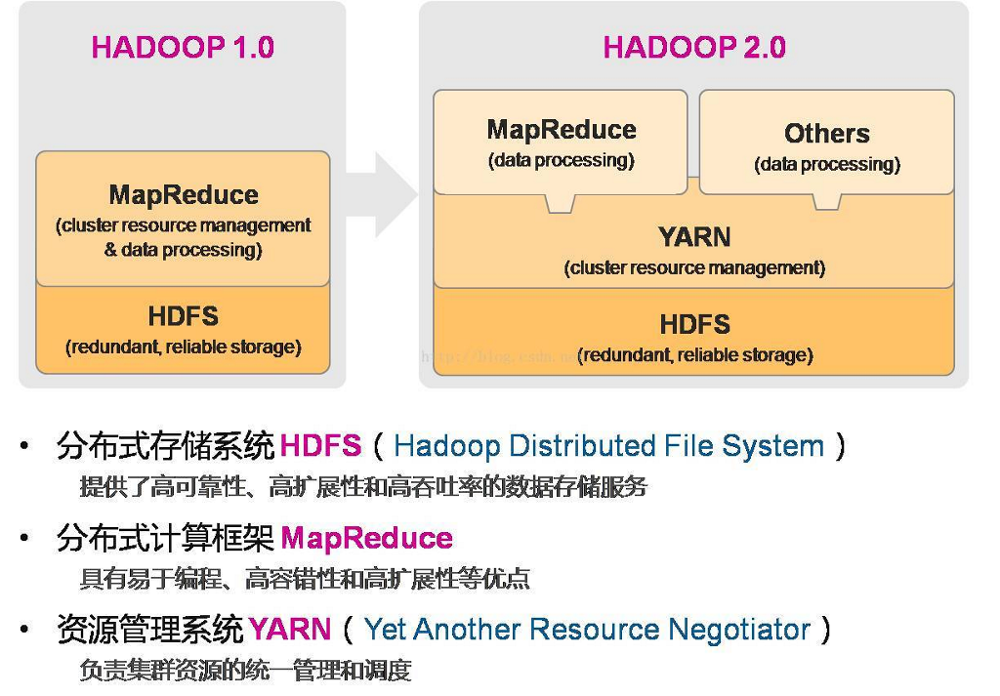

## **简介**

Hadoop自带一个称为HDFS的分布式文件系统，即Hadoop Distributed Filesystem，HDFS是以流式数据访问模式来存储超大文件，运行于商用硬件集群上。与正常文件系统不同的是，它会让集群中的每个机器仿佛访问同一个文件系统，即在A机器写入HDFS的文件，在B机器也能看到，在B机器删除HDFS文件，集群其他机器中的该文件也会被删除。

 

 

## **安装**

使用 Docker 快速搭建 Hadoop [集群环境](https://www.jianshu.com/p/b75f8bc9346d)

 

 

## **构成**

Hadoop的[核心](https://blog.csdn.net/jiangyu1013/article/details/72644098)就是HDFS和MapReduce，而两者只是理论基础，不是具体可使用的高级应用

### **HDFS特点**

1、**大数据文件**，非常适合上T级别的大文件或者一堆大数据文件的存储，如果文件只有几个G甚至更小就没啥意思了。

2、文件**分块存储**，HDFS会将一个完整的大文件平均分块存储到不同计算器上，它的意义在于读取文件时可以同时从多个主机取不同区块的文件，多主机读取比单主机读取效率要高得多得都。

3、**流式数据访问**，一次写入多次读写，这种模式跟传统文件不同，它不支持动态改变文件内容，而是要求让文件一次写入就不做变化，要变化也只能在文件末添加内容。

4、廉价硬件，HDFS可以应用在普通PC机上，这种机制能够让给一些公司用几十台廉价的计算机就可以撑起一个大数据集群。

5、硬件故障，HDFS认为所有计算机都可能会出问题，为了防止某个主机失效读取不到该主机的块文件，它将同一个文件块副本分配到其它某几个主机上，如果其中一台主机失效，可以迅速找另一块副本取文件。

### **HDFS元素**

1）**Block**：将一个文件进行分块，通常是64M。

2）**NameNode**：记录了文件是如何被拆分成block以及这些block都存储到了那些DateNode节点。保存整个文件系统的目录信息、文件信息及分块信息，这是由唯一 一台主机专门保存，当然这台主机如果出错，NameNode就失效了。在 Hadoop2.* 开始支持 activity-standy 模式----如果主 NameNode 失效，启动备用主机运行 NameNode。

3）**DataNode**：存储被拆分的blocks。分布在廉价的计算机上，用于存储Block块文件。

 

### **MapReduce**

我们要数图书馆中的所有书。你数1号书架，我数2号书架。这就是“Map”。我们人越多，数书就更快。

现在我们到一起，把所有人的统计数加在一起。这就是“Reduce”。

通俗说MapReduce是一套从海量源数据提取分析元素最后返回结果集的编程模型，将文件分布式存储到硬盘是第一步，而从海量数据中提取分析我们需要的内容就是MapReduce做的事了。

MapReduce的基本原理就是：将大的数据分析分成小块逐个分析，最后再将提取出来的数据汇总分析，最终获得我们想要的内容。当然怎么分块分析，怎么做Reduce操作非常复杂，Hadoop已经提供了数据分析的实现，我们只需要编写简单的需求命令即可达成我们想要的数据。

## **HDFS架构**

**Active Namenode**

主 Master（只有一个），管理 HDFS 的名称空间，管理数据块映射信息；配置副本策略；处理客户端读写请求

**Secondary NameNode**

NameNode 的热备；定期合并 fsimage 和 fsedits，推送给 NameNode；当 Active NameNode 出现故障时，快速切换为新的 Active NameNode。

**Datanode**

Slave（有多个）；存储实际的数据块；执行数据块读 / 写

**Client**

与 NameNode 交互，获取文件位置信息；与 DataNode 交互，读取或者写入数据；管理 HDFS、访问 HDFS。

## **HDFS的不足**

hdfs并非一个通用的应用程序，而是局限于某些特定的场景

hdfs优化了高速流数据读取性能，代价则是随机读取性能上的削弱

访问hdfs文件最好采取顺序读取的方式

hdfs只支持在文件上做少数的操作，但不包括任何更新的操作

hdfs不提供数据的本地缓存机制

## **应用场景**

搜索、日志处理、推荐系统、数据分析、视频图像分析、数据保存等

## **与Spark区别**

Hadoop和Spark之间的一个关键[区别](https://blog.csdn.net/c36qUCnS2zuqF6/article/details/81518150)。 Hadoop基于大数据的批处理。 这意味着数据会在一段时间内存储，然后使用Hadoop进行处理。 在Spark中，处理可以实时进行。 Spark中的这种实时处理能力帮助我们解决实时分析问题。 除此之外，Spark还能够比Hadoop MapReduce（ Hadoop处理框架）快100倍地进行批处理。 因此，Apache Spark是业界大数据处理的首选工具。

 

 

## **MapReduce详解**

Mapreduce是一个[计算框架](https://www.cnblogs.com/sharpxiajun/p/3151395.html)，既然是做计算的框架，那么表现形式就是有个输入（input），mapreduce操作这个输入（input），通过本身定义好的计算模型，得到一个输出（output），这个输出就是我们所需要的结果。

我们要学习的就是这个计算模型的运行规则。在运行一个mapreduce计算任务时候，任务过程被分为两个阶段：map阶段和reduce阶段，每个阶段都是用键值对（key/value）作为输入（input）和输出（output）。而程序员要做的就是定义好这两个阶段的函数：map函数和reduce函数。

 

 

## **HDFS和**[**Hbase**](https://www.sohu.com/a/161068448_693397)

1 HDFS容错率很高，即便是在系统崩溃的情况下，也能够在节点之间快速传输数据。HBase是非关系数据库，是开源的Not-Only-SQL数据库，它的运行建立在Hadoop上。HBase依赖于CAP定理(Consistency, Availability, and Partition Tolerance）中的CP项。

2 HDFS最适于执行批次分析。然而，它最大的缺点是无法执行实时分析，而实时分析是信息科技行业的标配。HBase能够处理大规模数据，它不适于批次分析，但它可以向Hadoop实时地调用数据。

3 HDFS和HBase都可以处理结构、半结构和非结构数据。因为HDFS建立在旧的MapReduce框架上，所以它缺乏内存引擎，数据分析速度较慢。相反，HBase使用了内存引擎，大大提高了数据的读写速度。

**关联**

HBase是Google Bigtable的开源实现，类似Google Bigtable利用GFS作为其文件存储系统，HBase利用Hadoop HDFS作为其文件存储系统；Google运行MapReduce来处理Bigtable中的海量数据，HBase同样利用Hadoop MapReduce来处理HBase中的海量数据。Hive与Hbase的数据一般都存储在HDFS上。Hadoop HDFS为他们提供了高可靠性的底层存储支持。

 

HBase是实时数据处理环境的最佳典范。我们的一个客户是某欧洲著名银行，下面要举的就是这个客户的例子，恰到好处的说明了问题。我们同时使用了Apache Storm和Apache Hbase，来分析应用服务器和网页服务器上的日志数据，想以此得到一些新发现。因为单位时间内我们需要处理大量的数据，所以我们最终决定使用HBase而不是HDFS。HDFS不能处理高速流动的数据。结果令人震惊，搜索时间从3天变成了3分钟。

## **Hive是什么**

Hive是一个数据仓库基础工具在Hadoop中用来处理结构化数据。它架构在[Hadoop](http://www.yiibai.com/hadoop/)之上，总归为大数据，并使得查询和分析方便。并提供简单的sql查询功能，可以将sql语句转换为MapReduce任务进行运行。它是用来开发SQL类型脚本用于做MapReduce操作的平台。

Apache Hive是一个构建在Hadoop基础设施之上的数据仓库。通过Hive可以使用HQL语言查询存放在HDFS上的数据。HQL是一种类SQL语言，这种语言最终被转化为Map/Reduce. 虽然Hive提供了SQL查询功能，但是Hive不能够进行交互查询--因为它只能够在Haoop上批量的执行Hadoop。

 

Hive和Hbase是两种基于Hadoop的不同技术--Hive是一种类SQL的引擎，并且运行MapReduce任务，Hbase是一种在Hadoop之上的NoSQL 的Key/vale数据库。当然，这两种工具是可以同时使用的。就像用Google来搜索，用FaceBook进行社交一样，Hive可以用来进行统计查询，HBase可以用来进行实时查询，数据也可以从Hive写到Hbase，设置再从Hbase写回Hive。

 

 

## **hadoop1.0与hadoop2.0**[**比较**](https://blog.csdn.net/babyfish13/article/details/52527665)

版本[对比](https://www.cnblogs.com/dream-to-pku/p/7249954.html)：

1.0版本中首先用户程序(JobClient)提交了一个job,job的信息会发送到Job Tracker,Job Tracker是Map-reduce框架的中心，他需要与集群中的机器定时通信heartbeat,需要管理哪些程序应该跑在哪些机器上，需要管理所有job失败、重启等操作。JobTracker是Map-reduce的集中处理点，存在单点故障。

为了从根本上解决旧的MapReduce框架的性能瓶颈，促进Hadoop框架的更长远发展，从0.23.0版本开始，Hadoop的MapReduce框架完全重构，叫做MapReduceV2或者Yarn.

 

Hadoop在2.0将资源管理从MapReduce中独立出来变成通用框架后，就从1.0的三层结构演变为了现在的四层架构：

1. 底层——存储层，文件系统HDFS

2. 中间层——资源及数据管理层，YARN以及Sentry等

3. 上层——MapReduce、Impala、Spark等计算引擎

4. 顶层——基于MapReduce、Spark等计算引擎的高级封装及工具，如Hive、Pig、Mahout等等

## **YARN**

**概述：**

针对MapReduce在扩展性和多框架支持方面的[不足](https://blog.csdn.net/suixinsuoyuwjm/article/details/22984087)（扩展性受限、单点故障、难以支持MR之外的计算），提出了全新的资源管理框架YARN，它将JobTracker中的资源管理和作业控制功能分开，分别由两个不同进程ResourceManager和ApplicationMaster实现，其中ResourceManager负责所有应用程序的资源分配，而ApplicationMaster仅仅负责管理一个应用程序。

**ResourceManager**：管理和分配集群的资源，是集群的一个单点，通过zookeeper来保存状态以便failover（容错）。RM主要包含两个功能组件：Applications Manager（AM）和Resource Scheduler（RS），其中AM负责接收client的作业提交的请求，为AppMaster请求Container，并且处理AM的fail；RS负责在多个application之间分配资源，存在queue capacity的限制，RS调度的单位是Resource Container，一个Container是memory，cpu，disk，network的组合。Yarn支持可插拔的调度器！（处理客户端请求、启动/监控ApplicationMaster、监控NodeManager、资源分配与调度）

 

**NodeManager**：部署在每个节点上的slave，负责启动container，并且检测进程组资源使用情况。NodeManager上可以搭载一些简单的service，比如shuffle service。（单个节点上的资源管理、处理来自ResourceManager的命令、处理来自ApplicationMaster的命令）

 

**ApplicationMaster**：每个application的master，负责和Resource Manager协商资源，将相应的Task分配到合适的Container上，并监测Task的执行情况。在和RM协商资源的时候可以加上资源偏好，比如MapReduceMaster为了本地化会将InputSplit的信息转化成对应的资源请求。ApplicationMaster将其history文件持久化存储在HDFS上，并在AM出问题的时候，回放history文件，进行断点重启。（数据切分、为应用程序申请资源，并分配给内部任务、任务监控与容错）

**用途：**

YARN（Yet Another Resource Negotiator）是一个通用的资源管理平台，可为各类计算框架提供资源的管理和调度。 

其核心出发点是为了分离资源管理与作业调度/监控，实现分离的做法是拥有一个全局的资源管理器（ResourceManager，RM），以及每个应用程序对应一个的应用管理器（ApplicationMaster，AM），应用程序由一个作业（Job）或者Job的有向无环图（DAG）组成。

 

YARN可以将[多种计算框架](https://blog.csdn.net/bingduanlbd/article/details/51880019?utm_source=blogxgwz1)(如离线处理MapReduce、在线处理的Storm、迭代式计算框架Spark、流式处理框架S4等) 部署到一个公共集群中，共享集群的资源。并提供如下功能：

**资源的统一管理和调度：** 

集群中所有节点的资源(内存、CPU、磁盘、网络等)抽象为Container。计算框架需要资源进行运算任务时需要向YARN申请Container， YARN按照特定的策略对资源进行调度进行Container的分配。

**资源隔离：** 

YARN使用了轻量级资源隔离机制Cgroups进行资源隔离以避免相互干扰，一旦Container使用的资源量超过事先定义的上限值，就将其杀死。

 

YARN是对Mapreduce V1重构得到的，有时候也成为MapReduce V2。 

YARN可以看成一个云操作系统，由一个ResourceManager和多个NodeManager组成， 它负责管理所有NodeManger上多维度资源， 并以Container(启动一个Container相当于启动一个进程)方式分配给应用程序启动ApplicationMaster(相当于主进程中运行逻辑) 或运行ApplicationMaster切分的各Task(相当于子进程中运行逻辑)。

