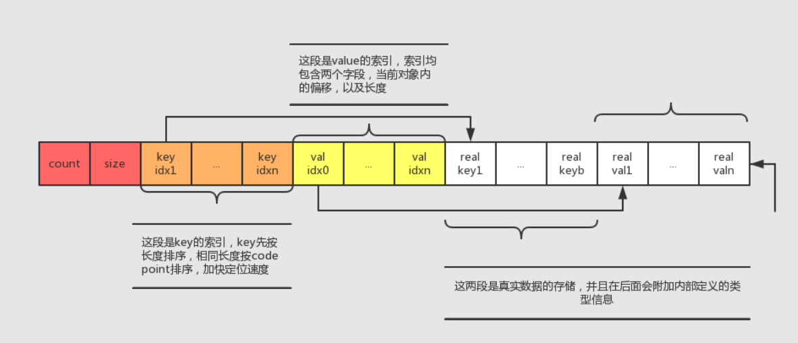
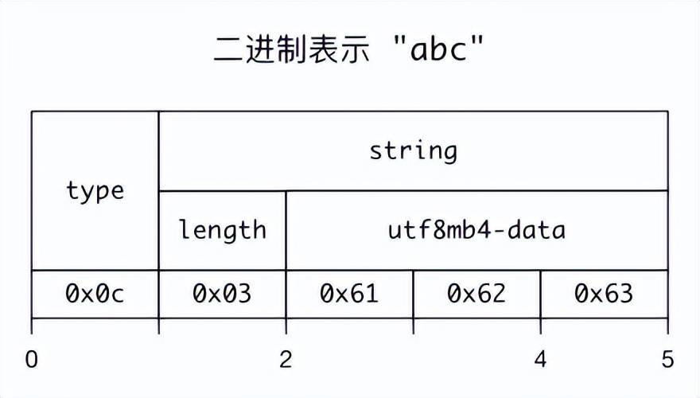
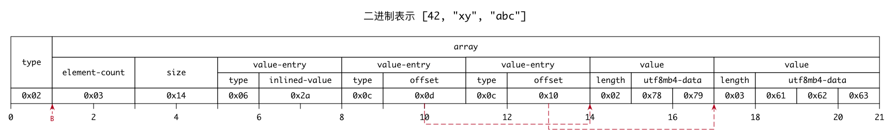
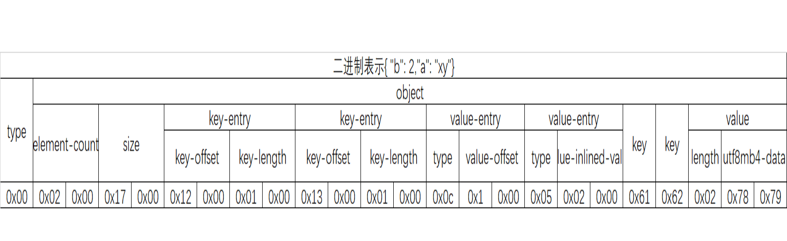

## **基本操作**

**启动**

```shell
sudo service mysqld start
sudo /etc/inint.d/mysqld start
```

**关闭**

```sh
sudo service mysqld start
sudo /etc/inint.d/mysqld start
```

**debian系统**

```shell
# 启动
service mysql start
# 关闭
service mysql stop
# 重启
service mysql restart
```

## **维护**

```sql
-- 查看数据库端口号占用情况
select * from information_schema.PROCESSLIST;

-- 查看所有连接
show processlist; 
-- 查看所有连接：如果没有FULL关键字， SHOW PROCESSLIST则只显示Info字段中每个语句的前 100 个字符 
show full processlist; 

-- 查看所有连接：全列出
show full processlist;

-- 查询mysql 哪些表正在被锁状态
show OPEN TABLES where In_use > 0;

-- 查看正在锁的事务
SELECT * FROM INFORMATION_SCHEMA.INNODB_LOCKS;

-- 查看等待锁的事务
SELECT * FROM INFORMATION_SCHEMA.INNODB_LOCK_WAITS;
```

```sh
# 杀掉当前所有的MySQL连接
mysqladmin -uroot -p processlist|awk -F "|" '{print $2}'|xargs -n 1 mysqladmin -uroot -p kill
```

## **管理用户**

**创建**

**CREATE USER** 'username'@'host' IDENTIFIED BY 'password';

```sql
CREATE USER 'dog'@'localhost' IDENTIFIED BY '123456';
```

> **说明** username - 你将创建的用户名, host - 指定该用户在哪个主机上可以登陆,如果是本地用户可用localhost, 如果想让该用户可以从任意远程主机登陆,可以使用通配符%. password - 该用户的登陆密码,密码可以为空,如果为空则该用户可以不需要密码登陆服务器. 

**查看所有用户**

```sql
select user,host from mysql.user;
```

**设置与更改密码**

**SET PASSWORD FOR '**username**'@'**host**' = PASSWORD('**newpassword**');**

```sql
SET PASSWORD FOR 'pig'@'%' = PASSWORD("123456");
```

> **说明** 如果是当前登陆用户用SET PASSWORD = PASSWORD("newpassword");

**查看权限**

```sql
show grants for 你的用户
show grants for root@'localhost';
show grants for root;
```

**授权**

**GRANT privileges ON** databasename**.**tablename **TO '**username**'@'**host**';**

```sql
GRANT ALL ON *.* TO 'pig'@'%';
FLUSH PRIVILEGES;
```

> **说明** privileges - 用户的操作权限,如SELECT , INSERT , UPDATE 等(详细列表见该文最后面).如果要授予所的权限则使用ALL.;databasename - 数据库名,tablename-表名,如果要授予该用户对所有数据库和表的相应操作权限则可用*表示, 如*.*. 最后记得使用FLUSH PRIVILEGES更新权限表。

**撤销用户权限**

**REVOKE privilege ON** databasename**.**tablename **FROM '**username**'@'**host**';**

```sql
REVOKE SELECT ON *.* FROM 'pig'@'%';
```

**删除用户**

```sql
 DROP USER 'root'@'%';
```

**授权远程连接**

**GRANT ALL PRIVILEGES ON** *******.******* **TO '**username**'@'%' IDENTIFIED BY '**password**' WITH GRANT OPTION;**

```sql
GRANT ALL PRIVILEGES ON *.* TO 'root'@'%' IDENTIFIED BY 'root' WITH GRANT OPTION;
```

**远程登陆**

**mysql -h**[目标IP] **-p**[目标端口] **-u**[数据库用户名] **-p**

```shell
mysql -h192.168.69.8 -p3306 -uroot -p;
```

## **管理数据库**

**创建数据库**

**create database** <数据库名> **character set utf8;**

```sql
create database test character set utf8;
```

> **说明** character set utf8 用以设置该数据库创建表时候的编码格式

**导出数据库**

**mysqldump -u** username **-p** **-R** **--add-drop-table** database **>** path**/**database**.sql**

```shell
mysqldump -u root -p -R fulva > D:/fulva.sql
```

> **注意：**默认情况下不会导出数据库的存储过程和函数，如果需要备份存储过程，那就需要用参数 -R 来指定，如果只导出存储过程和函数可用:
> 
> mysqldump -uroot -p -hlocalhost -P3306 -n -d -t -R DBName > procedure_name.sql
> 
> 其中，-d 表示--no-create-db, -n表示--no-data, -t表示--no-create-info, -R表示导出function和procedure。所以上述代码表示仅仅导出函数和存储过程，不导出表结构和数据。

**导出时忽略指定的表：**

```shell
mysqldump -uroot -p -R **dbname** --ignore-table=**dbname****.tb1** --ignore-table=**dbname****.tb2** >C:\Users\xqlsr\Desktop\back_20190604.sql
```

**导入数据库**

```shell
# 推荐
mysql -uabsbank -p --default-character-set=utf8mb4 absbank<C:\JJH\absbank.sql
```

```sql
-- 先登录MySQL，进入MySQL命令行，再执行下面的命令
source path/database.sql
```

> **说明：**如果遇到 @@GLOBAL.GTID_PURGED can only be set when @@GLOBAL.GTID_EXECUTED is empty [错误](http://blog.itpub.net/20893244/viewspace-2138125/)可添加 -f 参数强制导入

**复制数据库**

```sql
CREATE DATABASE `newdb`;
```

```shell
mysqldump db1 -u root -p123456 --add-drop-table | mysql newdb -u root -p123456
```

**跨主机备份**

```shell
mysqldump -uroot -proot --host=192.168.1.217 --opt msharp| mysql --host=192.168.1.218 -uroot -proot -C msharp;
```

**添加或删除表字段**

```sql
-- 添加字段
alter table `code_library` add column Data_Insert_Date varchar(20);
-- 删除字段
alter table `user_movement_log` drop column Gatewayid
```

**显示所有表**

```sql
show tables;

select table_name from information_schema.TABLES where TABLE_SCHEMA='数据库名';
```

**显示表的所有字段名**

```sql
select * from information_schema.`COLUMNS` where TABLE_SCHEMA='数据库名' and table_name='表名';
```

**不锁表数据导出**

```shell
mysqldump -u mysql_user --lock-tables=false --default-character-set=utf8 -p mysql_db mysql_table --where="ID > 20"  > backup.sql
```

## 配置

**查看和设置MySQL最大连接数**

```sql
show variables like "max_connections";
set GLOBAL max_connections=100;
```

**大小写区分**

在windows环境的mysql数据表名一般不区分大小写，而在linux下则会区分大小写，如果要在linux下不区分大小写可在/etc/mysql/conf.d/my.cnf（文件不存在则新增）的[mysqld]节点下，加入一行：  

```
lower_case_table_names=1
```

重启MySQL即可

[**字符集**](https://www.cnblogs.com/shootercheng/p/5836657.html)

```
-- 显示当前数据库字符集
use <数据库>;
show variables like 'character_set_database';

-- 创建数据库时指定数据库的字符集
create database <数据库名> character set utf8;

-- 创建数据库时指定数据库的字符集
alter database <数据库名> character set utf8;

-- 创建数据库时指定数据库的字符集
alter table <表名> character set utf8;
```

**查看数据库表占用空间**

```sql
select TABLE_NAME, table_rows, 
concat(truncate(data_length/1024/1024,2),' MB') as data_size,
concat(truncate(index_length/1024/1024,2),' MB') as index_size
from information_schema.tables where TABLE_SCHEMA = 'cfs'
group by TABLE_NAME order by data_length desc;
```

**查看所有数据库大小**

```sql
select concat(round(sum(data_length/1024/1024),2),'MB') as data from information_schema.tables;
```

**查看数据库存储文件路径**

**show global variables like "**%datadir%**";**

**查看数据库的存储引擎**

**show variables like '**%storage_engine%**';**

## 处理逗号分隔的字符串

```sql
select * from b_program_publish where find_in_set ('0c52dab',terminals);
```

在翻这些函数的过程中，你应该已经深深地体会到mysql的设计者对[以逗号分割存储字段](https://blog.csdn.net/rovast/article/details/50519144)方法的肯定，因为有很多方法就是设计用来处理这种问题的。 

## **配置文件**

**添加或修改配置**

MySQL的默认配置文件是 /etc/mysql/my.cnf 文件。如果想要自定义配置，建议向 /etc/mysql/conf.d 目录中创建 .cnf 文件。新建的文件可以任意起名，只要保证后缀名是 cnf 即可。新建的文件中的配置项可以覆盖 /etc/mysql/my.cnf 中的配置项

比如修改SQL数据包的大小则在/etc/mysql/conf.d目录下新建my.cnf配置文件，内容如下：

```
[mysqld]

#SQL数据包发送的大小，如果有BLOB对象建议修改成1G
max_allowed_packet = 100M
```

保存之后重启MySQL即可生效。

**查看linux服务器上mysql配置文件路径**

在类NUIX的系统中，配置文件的位置一般在/etc/my.cnf 或者 /etc/MySQL/my.cnf

我们见过有些人尝试修改配置文件但是不生效，因为他们修改的并不是服务器读取的文件。例如Debian下，/etc/mysql/my.cnf才是MySQL读取的配置文件，而不是/etc/my.cnf。

```shell
which mysqld
/usr/sbin/mysqld

/usr/sbin/mysqld --verbose --help | grep -A 1 'Default options'
Default options are read from the following files in the given order:
/etc/my.cnf /etc/mysql/my.cnf ~/.my.cnf 
```

## **MySQL锁**

相对于其他的数据库而言，MySQL的[锁机制](https://blog.csdn.net/mysteryhaohao/article/details/51669741)比较简单，最显著的特点就是不同的存储引擎支持不同的锁机制。根据不同的存储引擎，MySQL中锁的特性可以大致归纳如下：

| **存储引擎** | **行锁** | **表锁** | **页锁** |
| -------- | ------ | ------ | ------ |
| MyISAM   |        | √      |        |
| BDB      |        | √      | √      |
| InnoDB   | √      | √      |        |

**表锁：**

开销小，加锁快；不会出现死锁；锁定力度大，发生锁冲突概率高，并发度最低

**行锁：**

开销大，加锁慢；会出现死锁；锁定粒度小，发生锁冲突的概率低，并发度高

**页锁：**

开销和加锁速度介于表锁和行锁之间；会出现死锁；锁定粒度介于表锁和行锁之间，并发度一般

## 索引优化-MRR

> MRR针对于辅助索引上的范围查询进行优化,收集辅助索引对应主键rowid。进行排序后回表查询，随机IO转顺序IO

### 介绍

当我们需要对大表(基于辅助索引)进行范围扫描时，会导致产生许多随机/O。而对于普通磁盘来说，随机的性能很差，会遇到瓶颈，在 MySQL 5.6/5.7和MariaDB5.3/5.5/10.0/10.1版本里对这种情况进行了优化，一个新的名词 **Multi Range Read([MRR](https://www.jianshu.com/p/3d9b9b4ea186))**出现了，优化器会先扫描辅助索引，然后收集每行的主键（rowid ），并对主键进行排序（排序结果存储到read_rnd_buffer)，此时就可以用主键顺序访问基表，即用顺序IO代替随机IO。**MRR 在本质上是一种用空间换时间的算法**。

MRR 能够提升性能的核心在于，这条查询语句在索引上做的是一个范围查询（也就是说，这是一个多值查询），可以得到足够多的主键id。这样通过排序以后，再去主键索引查数据，才能体现出“顺序性”的优势。所以MRR优化可用于range，ref，eq_ref类型的查询。

> 注意：MRR 只是针对优化回表查询的速度，当不需要回表访问的时候，MRR就失去意义了（比如覆盖索引）

### 开启MRR

mysql默认开启MRR优化。但是由优化器决定是否真正使用MRR（mrr=on,mrr_cost_based=on）。

```
-- 查询MRR的开启状态
SHOW VARIABLES LIKE '%optimizer_switch%'
```

> mrr=on,mrr_cost_based=on

## **MySQL事务实现原理**

[**MVCC**](https://blog.csdn.net/SnailMann/article/details/94724197)

MVCC(Mutil-Version Concurrency Control)，就是**多版本并发控制**。MVCC 是一种并发控制的方法，一般在数据库管理系统中，实现对数据库的并发访问。

Mysql的大多数事务型存储引擎实现的都不是简单的行级锁。基于提升并发性能的考虑，他们一般都同时实现了MVCC.实现了非阻塞的读操作，写操作也只锁定必要的行。在Mysql的InnoDB引擎中就是指在已提交读(READ COMMITTD)和可重复读(REPEATABLE READ)这两种隔离级别下的事务对于SELECT操作会访问版本链中的记录的过程。

在Mysql中MVCC是在Innodb存储引擎中得到支持的，Innodb为每行记录都实现了三个隐藏字段：

- **6字节的事务ID（DB_TRX_ID ）**
  
  最近修改(`修改/插入`)事务ID：记录创建这条记录/最后一次修改该记录的事务ID

- **7字节的回滚指针（DB_ROLL_PTR）**
  
  回滚指针，指向这条记录的上一个版本（存储于rollback segment里）

- **隐藏的ID（DB_ROW_ID）**
  
  隐含的自增ID（隐藏主键），如果数据表没有主键，InnoDB会自动以`DB_ROW_ID`产生一个聚簇索引

- deleted_bit
  
  实际还有一个删除flag隐藏字段, 既记录被更新或删除并不代表真的删除，而是删除flag变了

每开始一个新的事务，系统版本号都会自动递增。事务开始时刻的系统版本号会作为事务的版本号，用来和查询到的每行记录的版本号进行比较。

这就使得别的事务可以修改这条记录，反正每次修改都会在版本链中记录。SELECT可以去版本链中拿记录，这就实现了读-写，写-读的并发执行，提升了系统的性能。

从前面的分析可以看出，为了实现InnoDB的MVCC机制，更新或者删除操作都只是设置一下老记录的deleted_bit，并不真正将过时的记录删除。

为了节省磁盘空间，InnoDB有专门的purge线程来清理deleted_bit为true的记录。为了不影响MVCC的正常工作，purge线程自己也维护了一个read view（这个read view相当于系统中最老活跃事务的read view）;如果某个记录的deleted_bit为true，并且DB_TRX_ID相对于purge线程的read view可见，那么这条记录一定是可以被安全清除的。

## **MySQL数据库**[**优化**](https://mp.weixin.qq.com/s?__biz=MzA4Nzg5Nzc5OA==&mid=2651669647&idx=1&sn=2a72d20d7485e2879a6b772d9e2248ea&chksm=8bcb8726bcbc0e30b62fb971b25c28ea962c27e17ee20ca8bd82ffc73b1e83e95d0dff1c7454&scene=21#wechat_redirect)

**拒绝默认设置**

在默认情况下，MySQL 是针对小规模的发布、安装进行调优的，而并非真正的生产环境规模。因此，通常您需要将 MySQL 配置为使用所有可用的内存资源，并且能允许您的应用程序所需的最大连接数。这里有三个有关 MySQL 性能优化的设置，值得去仔细地配置：

```
innodb_buffer_pool_size=2048M
```

数据和索引被用作缓存的缓冲池。当您的数据库服务器有着大量的系统内存时，可以用到该设置。

如果只运行 InnoDB 存储引擎，那么通常可以分配 **80％** 左右的内存给该缓冲池。（Innodb的很多性能提升如索引都是依靠这个）

如果要运行非常复杂的查询或者有大量的并发数据库连接，亦或有非常大的数据表的情况，那么就可能需要将此值下调一个等级，以便为其他的调用分配更多的内存。

在设置 InnoDB 缓冲池大小的时候，要确保其设置既不要过大，也不要频繁引起交换（swapping），因为这些绝对会降低数据库性能。有一个简单的检查方法就是在“**Percona 监控和管理**”。

这对Innodb表来说非常重要。Innodb相比MyISAM表对缓冲更为敏感。MyISAM可以在默认的 key_buffer_size 设置下运行的可以，然而Innodb在默认的 innodb_buffer_pool_size 设置下却跟蜗牛似的。由于Innodb把数据和索引都缓存起来，无需留给操作系统太多的内存，因此如果只需要用Innodb的话则可以设置它高达 70-80% 的可用内存。一些应用于 key_buffer 的规则有 — 如果你的数据量不大，并且不会暴增，那么无需把 innodb_buffer_pool_size 设置的太大了

**innodb_log_file_size**

这是指单个 InnoDB 日志文件的大小。默认情况下，InnoDB 使用两个值，这样您就可以通过将其增加一倍，来让 InnoDB 获得循环的重做日志空间，以确保交易的持久性。这同时也优化了对数据库的写入性能。

设置 innodb_log_file_size 的值是很值得推敲的：如果分配了较大的重做空间，那么对于写入密集型的工作负载来说性能会越好。

但是如果您的系统遭受到断电或其他问题导致崩溃的时候，那么其恢复时间则会越长。您可以通过查看未实际使用的重做日志空间大小来判定。

**max_connections**

大型应用程序通常需要比默认数量多得多的连接。不同于其他的变量，如果您没能将该值设置正确，您就会碰到性能方面的问题。也就是说，如果连接的数量不足以满足您的应用需求，那么应用程序将根本无法连接到数据库，在用户看来就像宕机了一样。由此可见，将它设置正确是非常重要的。

幸运的是，MySQL 能够在峰值操作时轻易地获悉所用到的连接数量。通常，您需要确保在应用程序所使用到的最大连接数和可用的最大连接数之间至少有 30％ 的差额。

## MySQL存储引擎[区别](http://www.cnblogs.com/y-rong/p/8110596.html)

**MyISAM**：ISAM是Indexed Sequential Access Method (有索引的顺序访问方法) 的缩写，设计简单，数据以紧密格式存储。对于只读数据，或者表比较小、可以容忍修复操作，则依然可以使用它。。

- 不支持事务，不支持外键。
- MyISAM是非聚集索引，也是使用B+Tree作为索引结构，索引和数据文件是分离的，索引保存的是数据文件的指针。主键索引和辅助索引是独立的。

[**InnoDB**](https://rsy.me/posts/mysql-innodb-preliminary/?hmsr=toutiao.io&utm_medium=toutiao.io&utm_source=toutiao.io)：是 MySQL 默认的事务型存储引擎，**只有在需要它不支持的特性时，才考虑使用其它存储引擎**。

- 支持事务、外键、行锁。
- InnoDB是聚集索引，使用B+Tree作为索引结构，数据文件是和（主键）索引绑在一起的（表数据文件本身就是按B+Tree组织的一个索引结构），必须要有主键，通过主键索引效率很高。但是辅助索引需要两次查询，先查询到主键，然后再通过主键查询到数据。因此，主键不应该过大，因为主键太大，其他索引也都会很大。

| [**差异**](https://juejin.im/post/5c6b9c09f265da2d8a55a855) | **MyISAM**                      | **Innodb**           |
| --------------------------------------------------------- | ------------------------------- | -------------------- |
| **文件格式**                                                  | 数据和索引是分别存储的，数据.MYD，索引.MYI       | 数据和索引是集中存储的，.ibd     |
| **文件能否移动**                                                | 能，一张表就对应.frm、MYD、MYI3个文件        | 否，因为关联的还有data下的其它文件  |
| **记录存储顺序**                                                | 按记录插入顺序保存                       | 按主键大小有序插入            |
| **空间碎片（删除记录并flush table 表名之后，表文件大小不变）**                   | 产生。定时整理：使用命令optimize table 表名实现 | 不产生                  |
| **事务**                                                    | 不支持                             | 支持                   |
| **外键**                                                    | 不支持                             | 支持                   |
| **锁支持（锁是避免资源争用的一个机制，MySQL锁对用户几乎是透明的）**                    | 表级锁定                            | 行级锁定、表级锁定，锁定力度小并发能力高 |

## MySQL不同引擎的[优化](https://www.zhihu.com/question/19719997/answer/81930332)

**myisam**

读的效果好，写的效率差，这和它数据存储格式，索引的指针和锁的策略有关的，它的数据是顺序存储的（innodb数据存储方式是聚簇索引），他的索引btree上的节点是一个指向数据物理位置的指针，所以查找起来很快，（innodb索引节点存的则是数据的主键，所以需要根据主键二次查找）；myisam锁是表锁，只有读读之间是并发的，写写之间和读写之间（读和插入之间是可以并发的，去设置concurrent_insert参数，定期执行表优化操作，更新操作就没有办法了）是串行的，所以写起来慢，并且默认的写优先级比读优先级高，高到写操作来了后，可以马上插入到读操作前面去，如果批量写，会导致读请求饿死，所以要设置读写优先级或设置多少写操作后执行读操作的策略;myisam不要使用查询时间太长的sql，如果策略使用不当，也会导致写饿死，所以尽量去拆分查询效率低的sql

**innodb**

一般都是行锁，这个一般指的是sql用到索引的时候，**行锁是加在索引上的**，**不是加在数据记录上的**，如果sql没有用到索引，仍然会锁定表,mysql的读写之间是可以并发的，普通的select是不需要锁的，当查询的记录遇到锁时，用的是一致性的非锁定快照读，也就是根据数据库隔离级别策略，会去读被锁定行的快照，其它更新或加锁读语句用的是当前读，读取原始行；因为普通读与写不冲突，所以innodb不会出现读写饿死的情况，又因为在使用索引的时候用的是行锁，锁的粒度小，竞争相同锁的情况就少，就增加了并发处理，所以并发读写的效率还是很优秀的，问题在于索引查询后的根据主键的二次查找导致效率低

备注：InnoDB行锁是通过给索引上的索引项加锁来实现的，这一点MySQL与Oracle不同，后者是通过在数据块中对相应数据行加锁来实现的。InnoDB这种行锁实现特点意味着：只有通过索引条件检索数据，InnoDB才使用行级锁，否则，InnoDB将使用表锁！在实际应用中，要特别注意InnoDB行锁的这一特性，不然的话，可能导致大量的锁冲突，从而影响并发性能。

因为 InnoDB 的数据文件本身要按主键聚集，所以 InnoDB 要求表必须有主键，如果没有显式指定，则 MySQL 系统会自动选择一个可以唯一标识数据记录的列作为主键，如果不存在这种列，则 MySQL 自动为 InnoDB 表生成一个隐含字段作为主键，这个字段长度为6个字节，类型为长整形。

InnoDB 的辅助索引 data 域存储相应记录主键的值而不是地址。换句话说，InnoDB 的所有辅助索引都引用主键作为 data 域。聚集索引这种实现方式使得按主键的搜索十分高效，但是辅助索引搜索需要检索两遍索引：首先检索辅助索引获得主键，然后用主键到主索引中检索获得记录。

## InnoDB

### InnoDB存储引擎的[锁算法](https://mp.weixin.qq.com/s/JUdSHpa1n6qt4w-lgL6rKQ)

Mysql默认的事务隔离级别是**可重复读(Repeatable Read)**，即保证在同一个事务中多次读取同样数据的结果是一样的。

- 在不通过索引条件查询时，InnoDB会锁定表中的所有记录。所以，如果考虑性能，WHERE语句中的条件查询的字段都应该加上索引。
- InnoDB通过**索引**来**实现行锁**，而不是通过锁住记录。因此，当操作的两条不同记录拥有相同的索引时，也会因为行锁被锁而发生等待。
- 由于InnoDB的索引机制，数据库操作使用了主键索引，InnoDB会锁住主键索引；使用非主键索引时，InnoDB会先锁住非主键索引，再锁定主键索引。
- 当查询的索引是唯一索引(不存在两个数据行具有完全相同的键值)时，InnoDB存储引擎会将Next-Key     Lock降级为Record Lock，即只锁住索引本身，而不是范围。
- InnoDB对于辅助索引有特殊的处理，不仅会锁住辅助索引值所在的范围，还会将其下一键值加上Gap     LOCK。
- InnoDB使用Next-Key Lock机制来避免Phantom     Problem（幻读问题）。

> Record Lock: 单个记录上的锁
> 
> Gap Lock: 间隙锁，锁定一个范围，但不包括记录本上
> 
> Next-Key Lock: Gap Lock+Record Lock，锁定一个范围，并且锁定记录本身

### 写缓冲

在MySQL5.5之前，叫插入缓冲(insert buffer)，只针对insert做了优化；现在对delete和update也有效，叫做写缓冲(change buffer)。

它是一种应用在**非唯一普通索引页**(即二级索引且属性不是unique)，不在缓冲池中，对页进行了写操作，并不会立刻将磁盘页加载到缓冲池，而仅仅记录缓冲变更(buffer changes)，等未来数据被读取时，再将数据合并(merge)恢复到缓冲池中的技术。写缓冲的目的是**降低写操作的磁盘IO**，提升数据库性能。

如果索引设置了唯一(unique)属性，在进行修改操作时，InnoDB必须进行唯一性检查。也就是说，索引页即使不在缓冲池，磁盘上的页读取无法避免(否则怎么校验是否唯一？)

## **redo log**

InnoDB 记录了对数据文件的物理更改，并保证总是[日志先行](https://www.cnblogs.com/hoxis/p/10070256.html)。

也就是所谓的 WAL（Write-Ahead Logging），即在持久化数据文件前，保证之前的 redo 日志已经写到磁盘。

MySQL 的每一次更新并没有每次都写入磁盘，InnoDB 引擎会先将记录写到 redo log 里，并更新到内存中，然后再适当的时候，再把这个记录更新到磁盘。

**产生 & 释放：**在事务开始之后就产生 redo log，redo log 的落盘并不是随着事务的提交才写入的，而是在事务的执行过程中，便开始写入 redo log 文件中。当对应事务的脏页写入到磁盘之后，redo log 的使命也就完成了，重做日志占用的空间就可以重用（被覆盖）

**缓存区：**redo log 有一个缓存区Innodb_log_buffer，默认大小为 8M，Innodb 存储引擎先将重做日志写入 innodb_log_buffer 中。

然后会通过以下三种方式将 innodb 日志缓冲区的日志刷新到磁盘：

1、Master Thread 每秒一次执行刷新 Innodb_log_buffer 到重做日志文件；

2、每个事务提交时会将重做日志刷新到重做日志文件；

3、当 redo log 缓存可用空间少于一半时，重做日志缓存被刷新到重做日志文件；

有了 redo log，InnoDB 就可以保证即使数据库发生异常重启，之前提交的记录都不会丢失，这个能力称为 crash-safe。

## **bin log**

MySQL 整体可以分为 Server 层和引擎层。其实，**redo log** 是属于引擎层的 **InnoDB** **所特有**的日志，而 Server 层也有自己的日志，即 binlog（归档日志）。

**与redo log区别：**

1、redo log 是 InnoDB 引擎特有的，binlog 是 MySQL 的 Server 层实现，所有引擎都可以使用；

2、内容不同：redo log 是物理日志，记录的是在数据页上做了什么修改,是正在执行中的 dml 以及 ddl 语句；而 binlog 是逻辑日志，记录的是语句的原始逻辑，已经提交完毕之后的 dml 以及 ddl sql 语句，如「给 ID=2 的这一行的 c 字段加 1」；

3、写方式不同：redo log 是循环写的，空间固定；binlog 是可以一直追加写的，一个文件写到一定大小后，会继续写下一个，之前写的文件不会被覆盖；

4、作用不同：redo log 主要用来保证事务安全，作为异常 down 机或者介质故障后的数据恢复使用，binlog 主要用来做主从复制和即时点恢复时使用；

5、另外，两者日志产生的时间，可以释放的时间，在可释放的情况下清理机制，都是完全不同的。

> **注意：**记录 Binlog 是在 InnoDB 引擎 Prepare（即 Redo Log 写入磁盘）之后，这点至关重要。另外需要注意的一点就是，SQL 语句产生的 Redo 日志会一直刷新到磁盘（master thread 每秒 fsync redo log），而 Binlog 是事务 commit 时才刷新到磁盘，如果 binlog 太大则 commit 时会慢。

**与redo log比较**

redo log记录的东西是偏向于物理性质的，如：“对什么数据，做了什么修改”。bin log是偏向于逻辑性质的，类似于：“对 students 表中的 id 为 1 的记录做了更新操作” 两者的主要特点总结如下:

| 性质   | redo Log                                             | bin Log                                                     |
| ---- | ---------------------------------------------------- | ----------------------------------------------------------- |
| 文件大小 | redo log 的大小是固定的（配置中也可以设置，一般默认的就足够了）                 | bin log 可通过配置参数max_bin log_size设置每个bin log文件的大小（但是一般不建议修改）。 |
| 实现方式 | redo log是InnoDB引擎层实现的（也就是说是 Innodb  存储引起过独有的）        | bin log是  MySQL  层实现的，所有引擎都可以使用 bin log日志                   |
| 记录方式 | redo log 采用循环写的方式记录，当写到结尾时，会回到开头循环写日志。               | bin log 通过追加的方式记录，当文件大小大于给定值后，后续的日志会记录到新的文件上                |
| 使用场景 | redo log适用于崩溃恢复(crash-safe)（这一点其实非常类似与 Redis 的持久化特征） | bin log 适用于主从复制和数据恢复                                        |

刷入 bin log 有以下几种模式

- **STATMENT**

基于 SQL 语句的复制(statement-based replication, SBR)，每一条会修改数据的 SQL 语句会记录到 bin log 中

【优点】：不需要记录每一行的变化，减少了 bin log 日志量，节约了 IO , 从而提高了性能

【缺点】：在某些情况下会导致主从数据不一致，比如执行sysdate()、slepp()等

- **ROW**

基于行的复制(row-based replication, RBR)，不记录每条SQL语句的上下文信息，仅需记录哪条数据被修改了

【优点】：不会出现某些特定情况下的存储过程、或 function、或 trigger 的调用和触发无法被正确复制的问题

【缺点】：会产生大量的日志，尤其是 alter table 的时候会让日志暴涨

- **MIXED**

基于 STATMENT 和 ROW 两种模式的混合复制( mixed-based replication, MBR )，一般的复制使用 STATEMENT 模式保存 bin log ，对于 STATEMENT 模式无法复制的操作使用 ROW 模式保存 bin log

那既然bin log也是日志文件，那它是在什么记录数据的呢？

其实 MySQL 在提交事务的时候，不仅仅会将 redo log buffer  中的数据写入到redo log 文件中，同时也会将本次修改的数据记录到 bin log文件中，同时会将本次修改的bin log文件名和修改的内容在bin log中的位置记录到redo log中，最后还会在redo log最后写入 commit 标记，这样就表示本次事务被成功的提交了。

## MySQL页

InnoDB不能以单行基础上工作。InnoDB总是在页上操作。一旦页被加载，它就会扫描页以寻找所请求的行/记录。

### 基础结构

[**Page**](https://segmentfault.com/a/1190000008545713)是Innodb存储的最基本结构，也是Innodb磁盘管理的最小单位，与数据库相关的所有内容都存储在Page结构里。Page分为几种类型：`数据页（B-Tree Node）`，`Undo页（Undo Log Page）`，`系统页（System Page）`，`事务数据页（Transaction System Page）`等；每个数据页的大小为`16kb`，每个Page使用一个32位（一位表示的就是0或1）的int值来表示，正好对应Innodb最大64TB的存储容量(16kb * 2^32=64tib)

page头部保存了两个指针，分别指向前一个Page和后一个Page，头部还有Page的类型信息和用来唯一标识Page的编号。根据这个指针分布可以想象到Page链接起来就是一个双向链表。

在Page的主体部分，主要关注数据和索引的存储，他们都位于`User Records`部分，User Records占据Page的大部分空间，User Records由一条条的Record组成，每条记录代表索引树上的一个节点（非叶子节点和叶子节点）；在一个单链表的内部，单链表的头尾由两条记录来表示，字符串形式的“ Infimum”代表开头，“Supremum”表示结尾；System Record 和 User Record是两个平行的段；
Innodb中存在四种不同的Record，分别是

1. 主键索引树非叶子节点
2. 主键索引树叶子节点
3. 辅助键索引树非叶子节点
4. 辅助键索引树叶子节点

这四种节点Record格式上有差异，但是内部都存储着Next指针指向下一个Record

### User Record

User Record在Page内以单链表的形式存在，最初数据是按照插入的先后顺序排列的，但是随着新数据的插入和旧数据的删除，数据物理顺序发生改变，但是他们依然保持着逻辑上的先后顺序。同一页内数据顺续不一定一致，但不同页之间的数据顺续是一致的。


把User Record组织形式和若干Page组织起来，就得到了稍微完整的形式：


### 如何定位一个Record

1. 通过根节点开始遍历一个索引的B+树，通过各层非叶子节点达到底层的叶子节点的数据页（Page），这个Page内部存放的都是叶子节点
2. 在Page内部从“Infimum”节点开始遍历单链表（遍历一般会被优化），如果找到键则返回。如果遍历到了“Supremum”，说明当前Page里没有合适的键，这时借助Page页内部的next page指针，跳转到下一个page继续从“Infmum”开始逐个查找


Page和B+树之间并没有一一对应的关系，Page只是作为一个Record的保存容器，它存在的目的是便于对磁盘空间进行批量管理。

### 索引长度

索引的长度决定不仅决定了索引占用的数据空间大小，也会影响查找数据的 IO 次数。

在同等数据量下，索引长度过长会导致单个数据页存放的索引条目数减少，索引高度增加，磁盘 IO 增加，并且索引占用空间增大。所以应该在满足要求的前提下，尽量减少索引长度。

**索引长度 = 字段长度 + 是否为空(+1) + 是否变长(+2)**

## **压测工具mysqlslap**

安装MySQL时附带了一个压力测试工具[mysqlslap](https://juejin.im/post/5c6b9c09f265da2d8a55a855)（位于bin目录下）

**自动生成sql测试**

mysqlslap --auto-generate-sql -uroot -proot

**并发测试**

mysqlslap --auto-generate-sql --concurrency=100 -uroot -proot

**多轮测试**

mysqlslap --auto-generate-sql --concurrency=150 --iterations=10 -uroot -proot

存储引擎测试

mysqlslap --auto-generate-sql --concurrency=150 --iterations=3 --engine=innodb -uroot -proot

mysqlslap --auto-generate-sql --concurrency=150 --iterations=3 --engine=myisam -uroot -proot

## ID自增问题

一张表，里面有ID自增主键，当insert了17条记录之后，删除了第15,16,17条记录，再把Mysql重启，再insert一条记录，这条记录的ID是18还是15？

（1）如果表的类型是MyISAM，那么是18.

因为MyISAM表会吧自增主键的最大ID记录到数据文件里，重启MysQL自增主键的最大ID也不会丢失。

（2）如果表的类型是InnoDB，那么是15.

InnoDB表只是把自增主键的最大ID记录到内存中，所以重启数据库或者是对表进行OPTIMIZE操作，都会导致最大ID丢失。

## **字符数还是字节数**

对于MySql中的varchar长度究竟是字节还是字符是这样的：在version4之前，按字节；version5（MySQL 5.0+）之后，按字符。

## **sql_mode=only_full_group_by异常**

执行语句：

```sql
SET @@global.sql_mode ='STRICT_TRANS_TABLES,NO_ZERO_IN_DATE,NO_ZERO_DATE,ERROR_FOR_DIVISION_BY_ZERO,NO_AUTO_CREATE_USER,NO_ENGINE_SUBSTITUTION';
```

## **数据库最大连接数设置**

```sql
-- 查看最大连接数
show variables like "max_connections";

-- 设置最大连接数为400
set GLOBAL max_connections=400;
```

## limit 20000加载很慢怎么[解决](https://mp.weixin.qq.com/s/9TxItfrkh5d1mNFKMvH6LA)

\# 执行时间：4.73s

select * from user where age = 10 limit 100000,10;

\# 执行时间：0.53s

SELECT a.* FROM USER a

INNER JOIN 

  (SELECT id FROM USER WHERE age = 10 LIMIT 100000,10) b 

ON a.id = b.id;

其中需要对where条件增加索引，id因为是主键自带索引。select返回减少回表可以提升查询性能,所以采用查询主键字段后进行关联大幅度提升了查询效率。

## MySQL压缩版的安装[详细步骤](https://baijiahao.baidu.com/s?id=1630347658327095638&wfr=spider&for=pc)

1 下载压缩包，解压压缩包到指定目录：

https://downloads.mysql.com/archives/community/

2 以管理员打开命令行并进入到解压根目录/bin目录下

创建配置文件my.ini。默认解压文件中没有，我们可以新建完添加解压根目录下。（新建文本文档，并将后缀名改成.ini）然后我们编辑此文件，设置MySQL根目录，以及数据库数据存放的目录。

```
[mysql]
# 设置mysql客户端默认字符集
default-character-set=utf8
[mysqld]
#设置3306端口
port = 3306
# 设置mysql的安装目录
basedir=D:\\Program Files\\mysql-5.7.24-winx64
# 允许最大连接数
max_connections=200
# 服务端使用的字符集默认为8比特编码的latin1字符集
character-set-server=utf8
# 创建新表时将使用的默认存储引擎
default-storage-engine=INNODB
```

3 初始化MySQL数据目录

```
mysqld --initialize
```

> 注：如果出现找不到MSVCP140.dll错误，说明没有安装VC++2015运行库，MySQL运行需要这个运行库，可以去微软官网下载，大概实十几M大小。

4 获取初始化数据库随机密码。执行完上一步之后，在data目录下生的文件有一个.err文件，这里面有初始化的密码。我们编辑打开此文件，找到密码。（root@localhost：后面跟的就是随机密码）

5 安装MySQL服务

```
mysqld --install mysql5.7
```

6 启动mysql服务

```
net start mysql8.0
```

7 用root账号、随机密码登录连接MySQL，输入上面的随机密码（.err文件）成功登录

```
mysql -u root -p
```

8 修改随机密码

```sql
ALTER USER 'root'@'localhost' IDENTIFIED BY 'root';
```

## MySQL备份脚本（Window）

```powershell
::换成默认的gbk（避免获取日期错误）https://www.cnblogs.com/a-fun/p/9391301.html
chcp 936
@echo off
set hour=%time:~0,2%
if "%time:~0,1%"==" " set hour=0%time:~1,1%
set now=%Date:~0,4%%Date:~5,2%%Date:~8,2%_%hour%%Time:~3,2%%Time:~6,2%
echo %now%
set host=localhost
set port=3306
set user=root
set pass=root
set dbname=hro
set backupfile=D:\app\backup\database\%dbname%_%now%.sql
D:\app\mysql-5.7.28-winx64\bin\mysqldump -h%host% -P%port% -u%user% -p%pass% -c -R --default-character-set=utf8 --single-transaction=TRUE --add-drop-table %dbname% > %backupfile%
echo delete files before 30 days
forfiles /p "D:\app\backup\database" /m *.sql /d -30 /c "cmd /c del @file /f"
```

## **Docker备份和导入文件**

```shell
# 备份文件
docker exec some-mysql sh -c 'exec mysqldump -R -uroot -p"$MYSQL_ROOT_PASSWORD" merck' > /some/path/merck.sql

# 导入文件
docker exec -i mysql8_db_1 sh -c 'exec mysql -uroot -pmima merck' < /mnt/hdd/docker/mysql8/merck.sql
```

## **MySQL双机热备的实现**

**条件：**

1. 主服务器的版本**低于**从服务器版本

2. 主服务器上需要备份的数据库在从服务器的mysql数据库中不能对应不上（即：主服务器有testdb数据库，从服务器也有名称为testdb数据库）

**步骤：**

**主服务器Master配置**

1. 创建好同步连接的帐户

2. 修改mysql配置文件[/etc/mysql/conf.d/my.cnf]

```
[mysqld]
server-id = 1　　　　　　　　//唯一id
log-bin=mysql-bin       //其中这两行是本来就有的，可以不用动，添加下面两行即可.指定日志文件
binlog-do-db = test　　　　 //记录日志的数据库
binlog-ignore-db = mysql  //不记录日志的数据库
```

3. 重启mysql服务

```shell
service mysql restart     //如果是运行的docker，直接重启docker
```

4. 查看主服务器状态[记录数据信息，后面需要用到]

```shell
mysql> show master status\G;
```

**从服务器Slave配置**

1. 修改mysql配置文件[/etc/mysql/conf.d/my.cnf]

```
[mysqld]
server-id = 2
log-bin=mysql-bin
replicate-do-db = test
replicate-ignore-db = mysql,information_schema,performance_schema
```

2. 重启mysql服务

```shell
service mysql restart     //如果是运行的docker，直接重启docker
```

3、指定同步位置

```
mysql>stop slave;     //先停步slave服务线程，这个是很重要的，如果不这样做会造成以下操作不成功。
mysql>change master to master_host='59.151.15.36',master_user='replicate',master_password='123456', master_log_file='mysql-bin.000016',master_log_pos=107;
```

> **注：**master_log_file, master_log_pos由主服务器（Master）查出的状态值中确定。也就是刚刚叫注意的。master_log_file对应File, master_log_pos对应Position。Mysql 5.x以上版本已经不支持在配置文件中指定主服务器相关选项。

```
mysql>start slave;
```

4、查看从服务器（Slave）状态

```
mysql> show slave status\G;
## 查看下面两项值均为Yes，即表示设置从服务器成功。
Slave_IO_Running: Yes
Slave_SQL_Running: Yes
```

> 参考：https://www.cnblogs.com/fnlingnzb-learner/p/7000898.html

## **Linux安装Mysql-5.7版本**

```shell
groupadd mysql      ## 添加一个mysql组
useradd -r -g mysql mysql    ## 添加一个用户
# 解压缩下载的包
tar -xzvf /data/software/mysql-5.7.13-linux-glibc2.5-x86_64.tar.gz
# 然后 mv 解压后的包  mysql   ##相当于重命名
chown -R mysql:mysql ./   ##进入mysql包中， 给这个包授权 给mysql
bin/mysqld --initialize --user=mysql --basedir=/usr/local/mysql --datadir=/usr/local/mysql/data
## 进入mysql文件名  basedir 为mysql 的路径， datadir 为mysql的 data 包，里面存放着mysql自己的包， 如user
## 重要：此处需要注意记录生成的临时密码，如上文：YLi>7ecpe;YP
bin/mysql_ssl_rsa_setup  --datadir=/usr/local/mysql/data           
## 进入mysql support-files
cp my-default.cnf /etc/my.cnf             ##注释或者删除掉 my.cnf里一般配置选项 中的socket=...的内容
cp mysql.server /etc/init.d/mysql
vim /etc/init.d/mysql             ##修改basedir=自己的路径     修改datadir=自己的路径
bin/mysqld_safe --user=mysql --disable-partition-engine-check &     ## 启动mysql
bin/mysql --user=root –p   
## 输入临时密码
set password=password('A123456');
grant all privileges on *.* to root@'%' identified by 'A123456';
flush privileges;
use mysql;
select host,user from user;
## 远程链接数据库，或者重启。
```

> 参考：
> 
> http://www.cnblogs.com/zfxJava/p/6004188.html
> 
> http://blog.csdn.net/xyang81/article/details/51792144

## CentOS7安装MySQL

在CentOS中默认安装有MariaDB，这个是MySQL的分支，但为了需要，还是要在系统中安装[MySQL](https://blog.csdn.net/qq_36582604/article/details/80526287)，而且安装完成之后可以直接覆盖掉MariaDB。

```bash
wget -i -c http://dev.mysql.com/get/mysql57-community-release-el7-10.noarch.rpm

yum -y install mysql57-community-release-el7-10.noarch.rpm
# 安装MySQL服务器
yum -y install mysql-community-server
```

## Red Hat安装MYSQL

> 参考：[Red Hat环境下安装MYSQL（图文）](https://blog.csdn.net/weixin_43931875/article/details/103500815)

首先根据RedHat的版本到mysql官网https://downloads.mysql.com/archives/community/下载安装包：

```bash
cat /etc/redhat-release
cat /etc/system-release
```

在服务器上创建文件夹：

```java
mkdir /mysql
```

比如下载到`mysql-8.0.25-1.el7.x86_64.rpm-bundle.tar`，使用`tar`指令进行解压：

```bash
tar -xf  mysql-8.0.18-1.el7.x86_64.rpm-bundle.tar
```

开始安装：
由于系统中存在mariadb 包会导致 mysql安装时报错mariadb-libs 被 mysql-community-libs-8.0.11-1.el7.x86_64 取代

需要先卸载mariadb 包：

```bash
yum remove mariadb*
```

之后开始安装，注意顺序不能乱！

```bash
rpm -ivh mysql-community-common-8.0.18-1.el7.x86_64.rpm

rpm -ivh mysql-community-libs-8.0.11-1.el7.x86_64.rpm

rpm -ivh mysql-community-client-8.0.18-1.el7.x86_64.rpm 

rpm -ivh mysql-community-server-8.0.18-1.el7.x86_64.rpm 
```

安装完成后初始化mysql数据库：

```bash
cd /etc
mysqld --initialize --user=mysql
```

初始密码每个人都不一样，查看初始随机密码：

```bash
cat /var/log/mysqld.log
```

接下来，登陆mysql

```bash
mysql -u root -p
```

最后一步，修改密码：

```mysql
alter user 'root'@'localhost'identified by '123456';
```

## MYSQL中JSON类型介绍

### json对象的介绍

在mysql未支持json数据类型时，我们通常使用varchar、blob或text的数据类型存储json字符串，对mysql来说，用户插入的数据只是序列化后的一个普通的字符串，不会对JSON文档本身的语法合法性做检查，文档的合法性需要用户自己保证。在使用时需要先将整个json对象从数据库读取出来，在内存中完成解析及相应的计算处理，这种方式增加了数据库的网络开销并降低处理效率。

从 MySQL 5.7.8 开始，MySQL 支持RFC 7159定义的全部json 数据类型，具体的包含四种基本类型（strings, numbers, booleans,and null）和两种结构化类型（objects and arrays）。可以有效地访问 JSON文档中的数据。与将 JSON 格式的字符串存储在字符串列中相比，该数据类型具有以下优势：

- 自动验证存储在 JSON列中的 JSON 文档。无效的文档会产生错误。
- 优化的存储格式。存储在列中的 JSON 文档被转换为允许快速读取文档元素的内部格式。当读取 JSON 值时，不需要从文本表示中解析该值，使服务器能够直接通过键或数组索引查找子对象或嵌套值，而无需读取文档中它们之前或之后的所有值。

### json类型的存储结构

mysql为了提供对json对象的支持，提供了一套将json字符串转为结构化二进制对象的存储方式。json会被转为二进制的doc对象存储于磁盘中（在处理JSON时MySQL使用的utf8mb4字符集，utf8mb4是utf8和ascii的超集）。

doc对象包含两个部分，type和value部分。其中type占1字节，可以表示16种类型：大的和小的json object类型、大的和小的 json array类型、literal类型（true、false、null三个值）、number类型（int6、uint16、int32、uint32、int64、uint64、double类型、utf8mb4 string类型和custom data（mysql自定义类型），具体可以参考源码json_binary.cc和json_binary.h进行学习。

下面进行简单介绍：  

```
type ::=  
0x00 | // small JSON object  
0x01 | // large JSON object  
0x02 | // small JSON array  
0x03 | // large JSON array  
0x04 | // literal (true/false/null)  
0x05 | // int16  
0x06 | // uint16  
0x07 | // int32  
0x08 | // uint32  
0x09 | // int64  
0x0a | // uint64  
0x0b | // double  
0x0c | // utf8mb4 string  
0x0f // custom data (any MySQL data type)
```

1. value包含 object、array、literal、number、string和custom-data六种类型，与type的16种类型对应。
2. object表示json对象类型，由6部分组成：
3. object ::= element-count size key-entry ***value-entry*** key ***value***  
   其中:  
   element-count表示对象中包含的成员（key）个数，在array类型中表示数组元素个数。  
   size表示整个json对象的二进制占用空间大小。小对象用2Bytes空间表示（最大64K），大对象用4Bytes表示（最大4G）  
   key-entry可以理解为一个用于指向真实key值的数组。本身用于二分查找，加速json字段的定位。  
   key-entry由两个部分组成：  
   key-entry ::= key-offset key-length  
   其中:  
   key-offset：表示key值存储的偏移量，便于快速定位key的真实值。  
   key-length：表示key值的长度，用于分割不同key值的边界。长度为2Bytes，这说明，key值的长度最长不能超过64kb.
4. value-entry与key-enter功能类似，不同之处在于，value-entry可能存储真实的value值。  
   value-entry由两部分组成：  
   value-entry ::= type offset-or-inlined-value  
   其中：  
   type表示value类型，如上文所示，支持16种基本类型，从而可以表示各种类型的嵌套。
5. offset-or-inlined-value：有两层含义，如果value值足够小，可以存储于此，那么就存储数据本身，如果数据本身较大，则存储真实值的偏移用于快速定位。  
   key 表示key值的真实值，类型为：key ::= utf8mb4-data,这里无需指定key值长度，因为key-entry中已经声明了key的存储长度。同时，在同一个json对象中，key值的长度总是一样的。



举例说明：







需要注意的是：

- JSON对象的Key索引（图中橙色部分）都是排序好的，先按长度排序，长度相同的按照code point排序；Value索引（图中黄色部分）根据对应的Key的位置依次排列，最后面真实的数据存储（图中白色部分）也是如此
- Key和Value的索引对存储了对象内的偏移和大小，单个索引的大小固定，可以通过简单的算术跳转到距离为N的索引
- 通过MySQL5.7.16源代码可以看到，在序列化JSON文档时，MySQL会动态检测单个对象的大小，如果小于64KB使用两个字节的偏移量，否则使用四个字节的偏移量，以节省空间。同时，动态检查单个对象是否是大对象，会造成对大对象进行两次解析，源代码中也指出这是以后需要优化的点
- 现在受索引中偏移量和存储大小四个字节大小的限制，单个JSON文档的大小不能超过4G；单个KEY的大小不能超过两个字节，即64K
- 索引存储对象内的偏移是为了方便移动，如果某个键值被改动，只用修改受影响对象整体的偏移量
- 索引的大小现在是冗余信息，因为通过相邻偏移可以简单的得到存储大小，主要是为了应对变长JSON对象值更新，如果长度变小，JSON文档整体都不用移动，只需要当前对象修改大小
- 现在MySQL对于变长大小的值没有预留额外的空间，也就是说如果该值的长度变大，后面的存储都要受到影响
- 结合JSON的路径表达式可以知道，JSON的搜索操作只用反序列化路径上涉及到的元素，速度非常快，实现了读操作的高性能
- MySQL对于大型文档的变长键值的更新操作可能会变慢，可能并不适合写密集的需求

### json类型基本操作

#### json数据插入

son类型数据插入时有两种方式，一种是基于字符串格式插入，另一种是基于json_object()函数，在使用json_object()函数只需按k-v顺序，以,符号隔开顺序插入即可，MYSQL会自动验证 JSON 文档，无效的文档会产生错误。

```sql
mysql> CREATE TABLE t1 (jdoc JSON);
Query OK, 0 rows affected (0.20 sec)

mysql> INSERT INTO t1 VALUES('{"key1": "value1", "key2": "value2"}');
Query OK, 1 row affected (0.01 sec)

mysql> INSERT INTO t1 VALUES('[1, 2,');
ERROR 3140 (22032) at line 2: Invalid JSON text:
"Invalid value." at position 6 in value (or column)  '[1, 2,'.
```

当一个字符串被解析并发现是一个有效的 JSON 文档时，它也会被规范化：具有与文档中先前找到的键重复的键的成员被丢弃（即使值不同）。以下第一个sql中通过 JSON_OBJECT()调用生成的对象值不包括第二个key1元素，因为该键名出现在值的前面；第二个sql中只保留了x第一次出现的值：

```sql
mysql> SELECT JSON_OBJECT('key1', 1, 'key2', 'abc', 'key1', 'def');
+------------------------------------------------------+
| JSON_OBJECT('key1', 1, 'key2', 'abc', 'key1', 'def') |
+------------------------------------------------------+
| {"key1": 1, "key2": "abc"}                           |
+------------------------------------------------------+

mysql> INSERT INTO t1 VALUES
     >     ('{"x": 17, "x": "red"}'),
     >     ('{"x": 17, "x": "red", "x": [3, 5, 7]}');

mysql> SELECT c1 FROM t1;
+-----------+
| c1        |
+-----------+
| {"x": 17} |
| {"x": 17} |
+-----------+
```

#### json合并

MySQL 5.7支持JSON_MERGE（）的合并算法，多个对象合并时产生一个对象。  可将多个数组合并为一个数组：

```sql
mysql> SELECT JSON_MERGE('[1, 2]', '["a", "b"]', '[true, false]');
+-----------------------------------------------------+
| JSON_MERGE('[1, 2]', '["a", "b"]', '[true, false]') |
+-----------------------------------------------------+
| [1, 2, "a", "b", true, false]                       |
+-----------------------------------------------------+
```

当合并数组与对象时，会将对象转换为新数组进行合并：

```sql
mysql> SELECT JSON_MERGE('[10, 20]', '{"a": "x", "b": "y"}');
+------------------------------------------------+
| JSON_MERGE('[10, 20]', '{"a": "x", "b": "y"}') |
+------------------------------------------------+
| [10, 20, {"a": "x", "b": "y"}]                 |
+------------------------------------------------+
```

如果多个对象具有相同的键，则生成的合并对象中该键的值是包含键值的数组：

```sql
mysql> SELECT JSON_MERGE('{"a": 1, "b": 2}', '{"c": 3, "a": 4}');
+----------------------------------------------------+
| JSON_MERGE('{"a": 1, "b": 2}', '{"c": 3, "a": 4}') |
+----------------------------------------------------+
| {"a": [1, 4], "b": 2, "c": 3}                      |
+----------------------------------------------------+
```

MySQL 8.0.3（及更高版本）支持两种合并算法，由函数 JSON_MERGE_PRESERVE()和 JSON_MERGE_PATCH(). 它们在处理重复键的方式上有所不同：JSON_MERGE_PRESERVE()保留重复键的值（与5.7版本的JSON_MERGE（）相同），而 JSON_MERGE_PATCH()丢弃除最后一个值之外的所有值。具体的

- JSON_MERGE_PRESERVE() 函数接受两个或多个 JSON 文档并返回组合结果。如果参数为两个object,相同的key将会把value合并为array(即使value也相同，也会合并为array),不同的key则直接合并。如果其中一个参数为json array，则另一个json object整体作为一个元素，加入array结果。
- JSON_MERGE_PATCH()函数接受两个或多个 JSON 文档并返回组合结果。如果参数为两个object,相同的key的value将会被后面参数的value覆盖,不同的key则直接合并。如果合并的是数组，将按照“最后一个重复键获胜”逻辑仅保留最后一个参数。

```sql
mysql> SELECT JSON_MERGE_PRESERVE('{"a":1,"b":2}', '{"a":3,"c":3}');
+-------------------------------------------------------+
| JSON_MERGE_PRESERVE('{"a":1,"b":2}', '{"a":3,"c":3}') |
+-------------------------------------------------------+
| {"a": [1, 3], "b": 2, "c": 3}                         |
+-------------------------------------------------------+
1 row in set (0.01 sec)
mysql> SELECT JSON_MERGE_PATCH('{"a":1,"b":2}', '{"a":3,"c":3}');
+----------------------------------------------------+
| JSON_MERGE_PATCH('{"a":1,"b":2}', '{"a":3,"c":3}') |
+----------------------------------------------------+
| {"a": 3, "b": 2, "c": 3}                           |
+----------------------------------------------------+
1 row in set (0.02 sec)

mysql> SELECT JSON_MERGE_PRESERVE('["a", 1]', '"a"','{"key": "value"}');
+-----------------------------------------------------------+
| JSON_MERGE_PRESERVE('["a", 1]', '"a"','{"key": "value"}') |
+-----------------------------------------------------------+
| ["a", 1, "a", {"key": "value"}]                           |
+-----------------------------------------------------------+
1 row in set (0.00 sec)
mysql> SELECT JSON_MERGE_PATCH('["a", 1]', '"a"','{"key": "value"}') ;
+--------------------------------------------------------+
| JSON_MERGE_PATCH('["a", 1]', '"a"','{"key": "value"}') |
+--------------------------------------------------------+
| {"key": "value"}                                       |
+--------------------------------------------------------+
1 row in set (0.01 sec)
```

#### json数据查询

MySQL 5.7.7+本身提供了很多原生的函数以及路径表达式来方便用户访问JSON数据。  
JSON_EXTRACT()函数用于解析json对象，->符号是就一种JSON_EXTRACT()函数的等价模式。例如查询上面t1表中 jdoc字段中key值为x的值

```sql
SELECT jdoc->'$.x' FROM t1;
SELECT JSON_EXTRACT(jdoc,'$.x') FROM t1;
```

JSON_EXTRACT返回值会带有” “,如果想获取原本的值可以使用JSON_UNQUOTE

```sql
mysql> SELECT JSON_EXTRACT('{"id": 14, "name": "Aztalan"}', '$.name');
+---------------------------------------------------------+
| JSON_EXTRACT('{"id": 14, "name": "Aztalan"}', '$.name') |
+---------------------------------------------------------+
| "Aztalan"                                               |
+---------------------------------------------------------+

mysql> SELECT JSON_UNQUOTE(json_extract('{"id": 14, "name": "Aztalan"}', '$.name'));;
+-----------------------------------------------------------------------+
| JSON_UNQUOTE(json_extract('{"id": 14, "name": "Aztalan"}', '$.name')) |
+-----------------------------------------------------------------------+
| Aztalan                                                               |
+-----------------------------------------------------------------------+
```

json路径的语法：

```
pathExpression:
    scope[(pathLeg)*]

pathLeg:
    member | arrayLocation | doubleAsterisk

member:
    period ( keyName | asterisk )

arrayLocation:
    leftBracket ( nonNegativeInteger | asterisk ) rightBracket

keyName:
    ESIdentifier | doubleQuotedString

doubleAsterisk:
    '**'

period:
    '.'

asterisk:
    '*'

leftBracket:
    '['

rightBracket:
    ']'
```

以 `json { “a”: [ [ 3, 2 ], [ { “c” : “d” }, 1 ] ], “b”: { “c” : 6 }, “one potato”: 7, “b.c” : 8 }` 为例：  

```
$.a[1] 获取的值为 [ { “c” : “d” }, 1 ] $.b.c 获取的值为 6  
$.”b.c” 获取的值为 8（因为键名包含不合法的表达式所以需要使用引号）


mysql>  select json_extract('{ "a": [ [ 3, 2 ], [ { "c" : "d" }, 1 ] ], "b": { "c" : 6 }, "one potato": 7, "b.c" : 8 }','$**.c');
+-------------------------------------------------------------------------------------------------------------------+
| JSON_EXTRACT('{ "a": [ [ 3, 2 ], [ { "c" : "d" }, 1 ] ], "b": { "c" : 6 }, "one potato": 7, "b.c" : 8 }','$**.c') |
+-------------------------------------------------------------------------------------------------------------------+
| ["d", 6]                                                                                                          |
+-------------------------------------------------------------------------------------------------------------------+

$**.c 匹配到了两个路径 :
$.a[1].c 获取的值是”d”
$.b.c 获取的值为 6
```

#### json数据更新

一些函数采用现有的 JSON 文档，以某种方式对其进行修改，然后返回结果修改后的文档。路径表达式指示在文档中进行更改的位置。例如，JSON_SET()、 JSON_INSERT()和 JSON_REPLACE()函数各自采用现有的 JSON 文档，加上一个或多个路径和值对，来描述修改文档和要更新的值。这些函数在处理文档中现有值和不存在值的方式上有所不同。
具体如下

```sql
mysql> SET @j = '["a", {"b": [true, false]}, [10, 20]]';
```

JSON_SET()替换存在的路径的值并添加不存在的路径的值：

```sql
mysql> SELECT JSON_SET(@j, '$[1].b[0]', 1, '$[2][2]', 2);
+--------------------------------------------+
| JSON_SET(@j, '$[1].b[0]', 1, '$[2][2]', 2) |
+--------------------------------------------+
| ["a", {"b": [1, false]}, [10, 20, 2]]      |
+--------------------------------------------+
```

在这种情况下，路径$[1].b[0]选择一个现有值 ( true)，该值将替换为路径参数 ( 1) 后面的值。该路径$[2][2]不存在，因此将相应的值 ( 2) 添加到 选择的值中$[2]。  
JSON_INSERT()添加新值但不替换现有值：

```sql
mysql> SELECT JSON_INSERT(@j, '$[1].b[0]', 1, '$[2][2]', 2);
+-----------------------------------------------+
| JSON_INSERT(@j, '$[1].b[0]', 1, '$[2][2]', 2) |
+-----------------------------------------------+
| ["a", {"b": [true, false]}, [10, 20, 2]]      |
+-----------------------------------------------+
```

JSON_REPLACE()替换现有值并忽略新值：

```sql
mysql> SELECT JSON_REPLACE(@j, '$[1].b[0]', 1, '$[2][2]', 2);
+------------------------------------------------+
| JSON_REPLACE(@j, '$[1].b[0]', 1, '$[2][2]', 2) |
+------------------------------------------------+
| ["a", {"b": [1, false]}, [10, 20]]             |
+------------------------------------------------+
```

JSON_REMOVE()接受一个 JSON 文档和一个或多个路径，这些路径指定要从文档中删除的值。返回值是原始文档减去文档中存在的路径选择的值：

```sql
mysql> SELECT JSON_REMOVE(@j, '$[2]', '$[1].b[1]', '$[1].b[1]');
+---------------------------------------------------+
| JSON_REMOVE(@j, '$[2]', '$[1].b[1]', '$[1].b[1]') |
+---------------------------------------------------+
| ["a", {"b": [true]}]                              |
+---------------------------------------------------+

$[2]匹配[10, 20] 并删除它。
$[1].b[1]匹配 元素false中 的第一个实例b并将其删除。
不匹配的第二个实例$[1].b[1]：该元素已被删除，路径不再存在，并且没有效果。
```

#### json比较与排序

JSON值可以使用=, <, <=, >, >=, <>, !=, <=>等操作符，BETWEEN, IN,GREATEST, LEAST等操作符现在还不支持。JSON值使用的两级排序规则，第一级基于JSON的类型，类型不同的使用每个类型特有的排序规则。
JSON类型按照优先级从高到低为：

```
BLOB
BIT
OPAQUE
DATETIME
TIME
DATE
BOOLEAN
ARRAY
OBJECT
STRING
INTEGER, DOUBLE
NULL
```

优先级高的类型大，不用再进行其他的比较操作；如果类型相同，每个类型按自己的规则排序。具体的规则如下：

- BLOB/BIT/OPAQUE: 比较两个值前N个字节，如果前N个字节相同，短的值小
- DATETIME/TIME/DATE: 按照所表示的时间点排序
- BOOLEAN: false小于true
- ARRAY: 两个数组如果长度和在每个位置的值相同时相等，如果不想等，取第一个不相同元素的排序结果，空元素最小。例：[] < [“a”] < [“ab”] < [“ab”, “cd”, “ef”] < [“ab”, “ef”]
- OBJECT: 如果两个对象有相同的KEY，并且KEY对应的VALUE也都相同，两者相等。否则，两者大小不等，但相对大小未规定。例：{“a”: 1, “b”: 2} = {“b”: 2, “a”: 1}
- STRING: 取两个STRING较短的那个长度为N，比较两个值utf8mb4编码的前N个字节，较短的小，空值最小。例：”a” < “ab” < “b” < “bc”；此排序等同于使用 collat​​ion 对 SQL 字符串进行排序utf8mb4_bin。因为 utf8mb4_bin是二进制排序规则，所以 JSON 值的比较区分大小写：”A” < “a”
- INTEGER/DOUBLE: 包括精确值和近似值的比较

### JSON的索引

现在MySQL不支持对JSON列进行索引，官网文档的说明是：

JSON columns cannot be indexed. You can work around this restriction by creating an index on a generated column that extracts a scalar value from the JSON column.

虽然不支持直接在JSON列上建索引，但MySQL规定，可以首先使用路径表达式对JSON文档中的标量值建立虚拟列，然后在虚拟列上建立索引。这样用户可以使用表达式对自己感兴趣的键值建立索引。举个具体的例子来说明：

```sql
ALTER TABLE features ADD feature_street VARCHAR(30) AS (JSON_UNQUOTE(feature->"$.properties.STREET"));
ALTER TABLE features ADD INDEX (feature_street);
```

两个步骤，可以对feature列中properties键值下的STREET键(feature->”$.properties.STREET”)创建索引。

其中，feature_street列就是新添加的虚拟列。之所以取名虚拟列，是因为与它对应的还有一个存储列(stored column)。它们最大的区别为虚拟列只修改数据库的metadata，并不会存储真实的数据在硬盘上，读取过程也是实时计算的方式；而存储列会把表达式的列存储在硬盘上。两者使用的场景不一样，默认情况下通过表达式生成的列为虚拟列。

这样虚拟列的添加和删除都会非常快，而在虚拟列上建立索引跟传统的建立索引的方式并没有区别，会提高虚拟列读取的性能，减慢整体插入的性能。虚拟列的特性结合JSON的路径表达式，可以方便的为用户提供高效的键值索引功能。

### 总结

1. JSON类型无须预定义字段，适合拓展信息的存储
2. 单个JSON文档的大小不能超过4G；单个KEY的大小不能超过两个字节，即64K
3. JSON类型适合应用于不常更新的静态数据
4. 对搜索较频繁的数据建议增加虚拟列并建立索引

> [MYSQL中JSON类型介绍 | 京东物流技术团队 - 京东云开发者的独家号 - 开发者头条](https://toutiao.io/posts/mqg9ogj)

## MySQL 查询缓存

### MySQL 查询缓存介绍

为了提高完全相同的查询语句的响应速度，MySQL Server 会对查询语句进行 Hash 计算得到一个 Hash 值。MySQL Server 不会对 SQL 做任何处理，SQL 必须完全一致 Hash 值才会一样。得到 Hash 值之后，通过该 Hash 值到查询缓存中匹配该查询的结果。

- 如果匹配（命中），则将查询的结果集直接返回给客户端，不必再解析、执行查询。
- 如果没有匹配（未命中），则将 Hash 值和结果集保存在查询缓存中，以便以后使用。

也就是说，**一个查询语句（select）到了 MySQL Server 之后，会先到查询缓存看看，如果曾经执行过的话，就直接返回结果集给客户端。**

### 缓存规则

- 查询缓存会将查询语句和结果集保存到内存（一般是 key-value 的形式，key 是查询语句，value 是查询的结果集），下次再查直接从内存中取。
- 缓存的结果是通过 sessions 共享的，所以一个 client 查询的缓存结果，另一个 client 也可以使用。
- SQL 必须完全一致才会导致查询缓存命中（大小写、空格、使用的数据库、协议版本、字符集等必须一致）。检查查询缓存时，MySQL Server 不会对 SQL 做任何处理，它精确的使用客户端传来的查询。
- 不缓存查询中的子查询结果集，仅缓存查询最终结果集。
- 不确定的函数将永远不会被缓存, 比如 `now()`、`curdate()`、`last_insert_id()`、`rand()` 等。
- 不缓存产生告警（Warnings）的查询。
- 太大的结果集不会被缓存 (< query_cache_limit)。
- 如果查询中包含任何用户自定义函数、存储函数、用户变量、临时表、MySQL 库中的系统表，其查询结果也不会被缓存。
- 缓存建立之后，MySQL 的查询缓存系统会跟踪查询中涉及的每张表，如果这些表（数据或结构）发生变化，那么和这张表相关的所有缓存数据都将失效。
- MySQL 缓存在分库分表环境下是不起作用的。
- 不缓存使用 `SQL_NO_CACHE` 的查询。

### MySQL 查询缓存对性能的影响

在 MySQL Server 中打开查询缓存对数据库的读和写都会带来额外的消耗:

- 读查询开始之前必须检查是否命中缓存。
- 如果读查询可以缓存，那么执行完查询操作后，会查询结果和查询语句写入缓存。
- 当向某个表写入数据的时候，必须将这个表**所有的缓存设置为失效**，如果缓存空间很大，则消耗也会很大，可能使系统僵死一段时间，因为这个操作是靠全局锁操作来保护的。
- 对 InnoDB 表，当修改一个表时，设置了缓存失效，但是多版本特性会暂时将这修改对其他事务屏蔽，在这个事务提交之前，所有查询都无法使用缓存，直到这个事务被提交，所以长时间的事务，会大大降低查询缓存的命中。

### 总结

MySQL 中的查询缓存虽然能够提升数据库的查询性能，但是查询同时也带来了额外的开销，每次查询后都要做一次缓存操作，失效后还要销毁。

查询缓存是一个适用较少情况的缓存机制。如果你的应用对数据库的更新很少，那么查询缓存将会作用显著。比较典型的如博客系统，一般博客更新相对较慢，数据表相对稳定不变，这时候查询缓存的作用会比较明显。

简单总结一下查询缓存的适用场景：

- 表数据修改不频繁、数据较静态。
- 查询（Select）重复度高。
- 查询结果集小于 1 MB。

对于一个更新频繁的系统来说，查询缓存缓存的作用是很微小的，在某些情况下开启查询缓存会带来性能的下降。

简单总结一下查询缓存不适用的场景：

- 表中的数据、表结构或者索引变动频繁
- 重复的查询很少
- 查询的结果集很大

---

> 内容来源： [MySQL查询缓存详解 | JavaGuide(Java面试 + 学习指南)](https://javaguide.cn/database/mysql/mysql-query-cache.html)


## Buffer Pool

在 MySQL 中，Buffer Pool 主要指的是 InnoDB 存储引擎使用的缓存机制。Buffer Pool 的作用是在内存中缓存 InnoDB 表的数据页和索引页，以提高数据访问的速度。Buffer Pool 是 InnoDB 缓存策略的关键组成部分，它可以显著提升查询性能，尤其是在频繁访问相同数据的情况下。

### 作用

1. **提高读写性能**：
   
   - **读操作**：当数据页首次被读入时，InnoDB 会将其放入 Buffer Pool。随后的读取操作可以直接从 Buffer Pool 中读取，而不需要再次访问磁盘。
   - **写操作**：当数据页被修改时，更改首先保存在 Buffer Pool 中，随后在合适的时机（如定期检查点）写入磁盘。

2. **减少磁盘 I/O**：
   
   - 通过缓存数据页和索引页，Buffer Pool 减少了磁盘 I/O 的次数，从而提高了整体性能。

3. **支持事务**：
   
   - Buffer Pool 还支持 InnoDB 的事务特性，如回滚段（rollback segment）和重做日志（redo log），确保数据的一致性和持久性。

### 流程

1. 首先执行器根据 MySQL 的执行计划来查询数据，先是从**缓存池中查询**数据，如果没有就会去数据库中查询，如果查询到了就将其放到缓存池中。

2. 在数据被缓存到缓存池的同时，会**写入 undo log** 日志文件。

3. **更新**的动作是在 **BufferPool** 中完成的，同时会将更新后的数据添加到 redo log buffer 中。

4. 完成以后就可以提交事务，在提交的同时会做以下三件事：
   
   - 将redo log buffer中的数据刷入到 redo log 文件中
   
   - 将本次操作记录写入到 bin log文件中
   
   - 将 bin log 文件名字和更新内容在 bin log 中的位置记录到redo log中，同时在 redo log 最后添加 commit 标记


### Buffer Pool 的管理

1. **LRU 列表**：
   
   - Buffer Pool 使用最近最少使用（Least Recently Used，LRU）算法来管理数据页。当 Buffer Pool 的空间不足时，LRU 列表尾部的数据页可能会被替换掉。

2. **老化机制**：
   
   - 数据页在 Buffer Pool 中的老化（aging）过程通过改变数据页的访问频率来控制，以确保经常访问的数据页不会被轻易替换掉。

3. **脏页管理**：
   
   - 当数据页被修改时，会标记为脏页（dirty page）。InnoDB 会在适当的时候将脏页写回到磁盘上，以确保数据的一致性。
   - 脏页的写入操作可以通过调整参数 `innodb_flush_log_at_trx_commit` 来控制。
