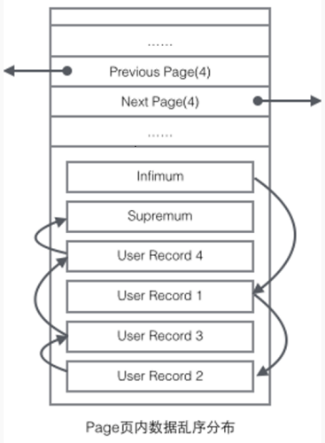

## **基本操作**

**启动**

```shell
sudo service mysqld start
sudo /etc/inint.d/mysqld start
```

 

**关闭**

```sh
sudo service mysqld start
sudo /etc/inint.d/mysqld start
```

 

**debian系统**

```shell
# 启动
service mysql start
# 关闭
service mysql stop
# 重启
service mysql restart
```


## **维护**

```sql
-- 查看数据库端口号占用情况
select * from information_schema.PROCESSLIST;

-- 查看所有连接
show processlist; 
-- 查看所有连接：如果没有FULL关键字， SHOW PROCESSLIST则只显示Info字段中每个语句的前 100 个字符 
show full processlist; 

-- 查看所有连接：全列出
show full processlist;

-- 查询mysql 哪些表正在被锁状态
show OPEN TABLES where In_use > 0;

-- 查看正在锁的事务
SELECT * FROM INFORMATION_SCHEMA.INNODB_LOCKS;

-- 查看等待锁的事务
SELECT * FROM INFORMATION_SCHEMA.INNODB_LOCK_WAITS;
```

```sh
# 杀掉当前所有的MySQL连接
mysqladmin -uroot -p processlist|awk -F "|" '{print $2}'|xargs -n 1 mysqladmin -uroot -p kill
```


## **管理用户**

**创建**

**CREATE USER** 'username'@'host' IDENTIFIED BY 'password';

```sql
CREATE USER 'dog'@'localhost' IDENTIFIED BY '123456';
```

> **说明** username - 你将创建的用户名, host - 指定该用户在哪个主机上可以登陆,如果是本地用户可用localhost, 如果想让该用户可以从任意远程主机登陆,可以使用通配符%. password - 该用户的登陆密码,密码可以为空,如果为空则该用户可以不需要密码登陆服务器. 

 

**查看所有用户**

```sql
select user,host from mysql.user;
```

 

**设置与更改密码**

**SET PASSWORD FOR '**username**'@'**host**' = PASSWORD('**newpassword**');**

```sql
SET PASSWORD FOR 'pig'@'%' = PASSWORD("123456");
```

> **说明** 如果是当前登陆用户用SET PASSWORD = PASSWORD("newpassword");

 

**查看权限**

```sql
show grants for 你的用户
show grants for root@'localhost';
show grants for root;
```

 

**授权**

**GRANT privileges ON** databasename**.**tablename **TO '**username**'@'**host**';**

```sql
GRANT ALL ON *.* TO 'pig'@'%';
FLUSH PRIVILEGES;
```

> **说明** privileges - 用户的操作权限,如SELECT , INSERT , UPDATE 等(详细列表见该文最后面).如果要授予所的权限则使用ALL.;databasename - 数据库名,tablename-表名,如果要授予该用户对所有数据库和表的相应操作权限则可用*表示, 如*.*. 最后记得使用FLUSH PRIVILEGES更新权限表。

 

**撤销用户权限**

**REVOKE privilege ON** databasename**.**tablename **FROM '**username**'@'**host**';**

```sql
REVOKE SELECT ON *.* FROM 'pig'@'%';
```

 

**授权远程连接**

**GRANT ALL PRIVILEGES ON** *******.******* **TO '**username**'@'%' IDENTIFIED BY '**password**' WITH GRANT OPTION;**

```sql
GRANT ALL PRIVILEGES ON *.* TO 'root'@'%' IDENTIFIED BY 'root' WITH GRANT OPTION;
```

 

**远程登陆**

**mysql -h**[目标IP] **-p**[目标端口] **-u**[数据库用户名] **-p**

```shell
mysql -h192.168.69.8 -p3306 -uroot -p;
```

 

 

## **管理数据库**

**创建数据库**

**create database** <数据库名> **character set utf8;**

```sql
create database test character set utf8;
```

> **说明** character set utf8 用以设置该数据库创建表时候的编码格式

 

**导出数据库**

**mysqldump -u** username **-p** **-R** **--add-drop-table** database **>** path**/**database**.sql**

```shell
mysqldump -u root -p -R fulva > D:/fulva.sql
```

> **注意：**默认情况下不会导出数据库的存储过程和函数，如果需要备份存储过程，那就需要用参数 -R 来指定，如果只导出存储过程和函数可用:
>
> mysqldump -uroot -p -hlocalhost -P3306 -n -d -t -R DBName > procedure_name.sql
>
> 其中，-d 表示--no-create-db, -n表示--no-data, -t表示--no-create-info, -R表示导出function和procedure。所以上述代码表示仅仅导出函数和存储过程，不导出表结构和数据。

**导出时忽略指定的表：**

```shell
mysqldump -uroot -p -R **dbname** --ignore-table=**dbname****.tb1** --ignore-table=**dbname****.tb2** >C:\Users\xqlsr\Desktop\back_20190604.sql
```

 

**导入数据库**

```shell
# 推荐
mysql -uabsbank -p --default-character-set=utf8mb4 absbank<C:\JJH\absbank.sql
```

```sql
-- 先登录MySQL，进入MySQL命令行，再执行下面的命令
source path/database.sql
```

> **说明：**如果遇到 @@GLOBAL.GTID_PURGED can only be set when @@GLOBAL.GTID_EXECUTED is empty [错误](http://blog.itpub.net/20893244/viewspace-2138125/)可添加 -f 参数强制导入

 

**复制数据库**

```sql
CREATE DATABASE `newdb`;
```

```shell
mysqldump db1 -u root -p123456 --add-drop-table | mysql newdb -u root -p123456
```

 

**跨主机备份**

```shell
mysqldump -uroot -proot --host=192.168.1.217 --opt msharp| mysql --host=192.168.1.218 -uroot -proot -C msharp;
```

 

**添加或删除表字段**

```sql
-- 添加字段
alter table `code_library` add column Data_Insert_Date varchar(20);
-- 删除字段
alter table `user_movement_log` drop column Gatewayid
```

 

**显示所有表**

```sql
show tables;

select table_name from information_schema.TABLES where TABLE_SCHEMA='数据库名';
```

 

**显示表的所有字段名**

```sql
select * from information_schema.`COLUMNS` where TABLE_SCHEMA='数据库名' and table_name='表名';
```

 

**不锁表数据导出**

```shell
mysqldump -u mysql_user --lock-tables=false --default-character-set=utf8 -p mysql_db mysql_table --where="ID > 20"  > backup.sql
```

 

 

## 配置

**查看和设置MySQL最大连接数**

```sql
show variables like "max_connections";
set GLOBAL max_connections=100;
```

 

**大小写区分**

在windows环境的mysql数据表名一般不区分大小写，而在linux下则会区分大小写，如果要在linux下不区分大小写可在/etc/mysql/conf.d/my.cnf（文件不存在则新增）的[mysqld]节点下，加入一行：  

```
lower_case_table_names=1
```

重启MySQL即可

 

[**字符集**](https://www.cnblogs.com/shootercheng/p/5836657.html)

```
-- 显示当前数据库字符集
use <数据库>;
show variables like 'character_set_database';

-- 创建数据库时指定数据库的字符集
create database <数据库名> character set utf8;

-- 创建数据库时指定数据库的字符集
alter database <数据库名> character set utf8;

-- 创建数据库时指定数据库的字符集
alter table <表名> character set utf8;
```


**查看数据库表占用空间**

```sql
select TABLE_NAME, table_rows, 
concat(truncate(data_length/1024/1024,2),' MB') as data_size,
concat(truncate(index_length/1024/1024,2),' MB') as index_size
from information_schema.tables where TABLE_SCHEMA = 'cfs'
group by TABLE_NAME order by data_length desc;
```

 

**查看所有数据库大小**

```sql
select concat(round(sum(data_length/1024/1024),2),'MB') as data from information_schema.tables;
```

 

**查看数据库存储文件路径**

**show global variables like "**%datadir%**";**

 

**查看数据库的存储引擎**

**show variables like '**%storage_engine%**';**

 


## 处理逗号分隔的字符串

```sql
select * from b_program_publish where find_in_set ('0c52dab',terminals);
```

在翻这些函数的过程中，你应该已经深深地体会到mysql的设计者对[以逗号分割存储字段](https://blog.csdn.net/rovast/article/details/50519144)方法的肯定，因为有很多方法就是设计用来处理这种问题的。 

 

 

## **配置文件**

**添加或修改配置**

MySQL的默认配置文件是 /etc/mysql/my.cnf 文件。如果想要自定义配置，建议向 /etc/mysql/conf.d 目录中创建 .cnf 文件。新建的文件可以任意起名，只要保证后缀名是 cnf 即可。新建的文件中的配置项可以覆盖 /etc/mysql/my.cnf 中的配置项

比如修改SQL数据包的大小则在/etc/mysql/conf.d目录下新建my.cnf配置文件，内容如下：

```
[mysqld]

#SQL数据包发送的大小，如果有BLOB对象建议修改成1G
max_allowed_packet = 100M
```

保存之后重启MySQL即可生效。

 

**查看linux服务器上mysql配置文件路径**

在类NUIX的系统中，配置文件的位置一般在/etc/my.cnf 或者 /etc/MySQL/my.cnf

我们见过有些人尝试修改配置文件但是不生效，因为他们修改的并不是服务器读取的文件。例如Debian下，/etc/mysql/my.cnf才是MySQL读取的配置文件，而不是/etc/my.cnf。

```shell
which mysqld
/usr/sbin/mysqld

/usr/sbin/mysqld --verbose --help | grep -A 1 'Default options'
Default options are read from the following files in the given order:
/etc/my.cnf /etc/mysql/my.cnf ~/.my.cnf 
```

 

 

## **MySQL锁**

相对于其他的数据库而言，MySQL的[锁机制](https://blog.csdn.net/mysteryhaohao/article/details/51669741)比较简单，最显著的特点就是不同的存储引擎支持不同的锁机制。根据不同的存储引擎，MySQL中锁的特性可以大致归纳如下：

| **存储引擎** | **行锁** | **表锁** | **页锁** |
| ------------ | -------- | -------- | -------- |
| MyISAM       |          | √        |          |
| BDB          |          | √        | √        |
| InnoDB       | √        | √        |          |

**表锁：**

开销小，加锁快；不会出现死锁；锁定力度大，发生锁冲突概率高，并发度最低

**行锁：**

开销大，加锁慢；会出现死锁；锁定粒度小，发生锁冲突的概率低，并发度高

**页锁：**

开销和加锁速度介于表锁和行锁之间；会出现死锁；锁定粒度介于表锁和行锁之间，并发度一般

 


## 索引优化-MRR

> MRR针对于辅助索引上的范围查询进行优化,收集辅助索引对应主键rowid。进行排序后回表查询，随机IO转顺序IO

### 介绍

当我们需要对大表(基于辅助索引)进行范围扫描时，会导致产生许多随机/O。而对于普通磁盘来说，随机的性能很差，会遇到瓶颈，在 MySQL 5.6/5.7和MariaDB5.3/5.5/10.0/10.1版本里对这种情况进行了优化，一个新的名词 **Multi Range Read([MRR](https://www.jianshu.com/p/3d9b9b4ea186))**出现了，优化器会先扫描辅助索引，然后收集每行的主键（rowid ），并对主键进行排序（排序结果存储到read_rnd_buffer)，此时就可以用主键顺序访问基表，即用顺序IO代替随机IO。**MRR 在本质上是一种用空间换时间的算法**。

MRR 能够提升性能的核心在于，这条查询语句在索引上做的是一个范围查询（也就是说，这是一个多值查询），可以得到足够多的主键id。这样通过排序以后，再去主键索引查数据，才能体现出“顺序性”的优势。所以MRR优化可用于range，ref，eq_ref类型的查询。

> 注意：MRR 只是针对优化回表查询的速度，当不需要回表访问的时候，MRR就失去意义了（比如覆盖索引）

### 开启MRR

mysql默认开启MRR优化。但是由优化器决定是否真正使用MRR（mrr=on,mrr_cost_based=on）。

```
-- 查询MRR的开启状态
SHOW VARIABLES LIKE '%optimizer_switch%'
```

> mrr=on,mrr_cost_based=on

 


## **MySQL事务实现原理**

[**MVCC**](https://blog.csdn.net/SnailMann/article/details/94724197)

MVCC(Mutil-Version Concurrency Control)，就是**多版本并发控制**。MVCC 是一种并发控制的方法，一般在数据库管理系统中，实现对数据库的并发访问。

Mysql的大多数事务型存储引擎实现的都不是简单的行级锁。基于提升并发性能的考虑，他们一般都同时实现了MVCC.实现了非阻塞的读操作，写操作也只锁定必要的行。在Mysql的InnoDB引擎中就是指在已提交读(READ COMMITTD)和可重复读(REPEATABLE READ)这两种隔离级别下的事务对于SELECT操作会访问版本链中的记录的过程。

在Mysql中MVCC是在Innodb存储引擎中得到支持的，Innodb为每行记录都实现了三个隐藏字段：

- **6字节的事务ID（DB_TRX_ID ）**

  最近修改(`修改/插入`)事务ID：记录创建这条记录/最后一次修改该记录的事务ID

- **7字节的回滚指针（DB_ROLL_PTR）**

  回滚指针，指向这条记录的上一个版本（存储于rollback segment里）

- **隐藏的ID（DB_ROW_ID）**

  隐含的自增ID（隐藏主键），如果数据表没有主键，InnoDB会自动以`DB_ROW_ID`产生一个聚簇索引

- deleted_bit

  实际还有一个删除flag隐藏字段, 既记录被更新或删除并不代表真的删除，而是删除flag变了


每开始一个新的事务，系统版本号都会自动递增。事务开始时刻的系统版本号会作为事务的版本号，用来和查询到的每行记录的版本号进行比较。

这就使得别的事务可以修改这条记录，反正每次修改都会在版本链中记录。SELECT可以去版本链中拿记录，这就实现了读-写，写-读的并发执行，提升了系统的性能。

 

从前面的分析可以看出，为了实现InnoDB的MVCC机制，更新或者删除操作都只是设置一下老记录的deleted_bit，并不真正将过时的记录删除。

为了节省磁盘空间，InnoDB有专门的purge线程来清理deleted_bit为true的记录。为了不影响MVCC的正常工作，purge线程自己也维护了一个read view（这个read view相当于系统中最老活跃事务的read view）;如果某个记录的deleted_bit为true，并且DB_TRX_ID相对于purge线程的read view可见，那么这条记录一定是可以被安全清除的。


## **MySQL数据库**[**优化**](https://mp.weixin.qq.com/s?__biz=MzA4Nzg5Nzc5OA==&mid=2651669647&idx=1&sn=2a72d20d7485e2879a6b772d9e2248ea&chksm=8bcb8726bcbc0e30b62fb971b25c28ea962c27e17ee20ca8bd82ffc73b1e83e95d0dff1c7454&scene=21#wechat_redirect)

**拒绝默认设置**

在默认情况下，MySQL 是针对小规模的发布、安装进行调优的，而并非真正的生产环境规模。因此，通常您需要将 MySQL 配置为使用所有可用的内存资源，并且能允许您的应用程序所需的最大连接数。这里有三个有关 MySQL 性能优化的设置，值得去仔细地配置：

```
innodb_buffer_pool_size=2048M
```

数据和索引被用作缓存的缓冲池。当您的数据库服务器有着大量的系统内存时，可以用到该设置。

如果只运行 InnoDB 存储引擎，那么通常可以分配 **80％** 左右的内存给该缓冲池。（Innodb的很多性能提升如索引都是依靠这个）

如果要运行非常复杂的查询或者有大量的并发数据库连接，亦或有非常大的数据表的情况，那么就可能需要将此值下调一个等级，以便为其他的调用分配更多的内存。

在设置 InnoDB 缓冲池大小的时候，要确保其设置既不要过大，也不要频繁引起交换（swapping），因为这些绝对会降低数据库性能。有一个简单的检查方法就是在“**Percona 监控和管理**”。

这对Innodb表来说非常重要。Innodb相比MyISAM表对缓冲更为敏感。MyISAM可以在默认的 key_buffer_size 设置下运行的可以，然而Innodb在默认的 innodb_buffer_pool_size 设置下却跟蜗牛似的。由于Innodb把数据和索引都缓存起来，无需留给操作系统太多的内存，因此如果只需要用Innodb的话则可以设置它高达 70-80% 的可用内存。一些应用于 key_buffer 的规则有 — 如果你的数据量不大，并且不会暴增，那么无需把 innodb_buffer_pool_size 设置的太大了

 

**innodb_log_file_size**

这是指单个 InnoDB 日志文件的大小。默认情况下，InnoDB 使用两个值，这样您就可以通过将其增加一倍，来让 InnoDB 获得循环的重做日志空间，以确保交易的持久性。这同时也优化了对数据库的写入性能。

设置 innodb_log_file_size 的值是很值得推敲的：如果分配了较大的重做空间，那么对于写入密集型的工作负载来说性能会越好。

但是如果您的系统遭受到断电或其他问题导致崩溃的时候，那么其恢复时间则会越长。您可以通过查看未实际使用的重做日志空间大小来判定。

 

**max_connections**

大型应用程序通常需要比默认数量多得多的连接。不同于其他的变量，如果您没能将该值设置正确，您就会碰到性能方面的问题。也就是说，如果连接的数量不足以满足您的应用需求，那么应用程序将根本无法连接到数据库，在用户看来就像宕机了一样。由此可见，将它设置正确是非常重要的。

幸运的是，MySQL 能够在峰值操作时轻易地获悉所用到的连接数量。通常，您需要确保在应用程序所使用到的最大连接数和可用的最大连接数之间至少有 30％ 的差额。

 

## MySQL存储引擎[区别](http://www.cnblogs.com/y-rong/p/8110596.html)

**MyISAM**：ISAM是Indexed Sequential Access Method (有索引的顺序访问方法) 的缩写，设计简单，数据以紧密格式存储。对于只读数据，或者表比较小、可以容忍修复操作，则依然可以使用它。。

- 不支持事务，不支持外键。
-  MyISAM是非聚集索引，也是使用B+Tree作为索引结构，索引和数据文件是分离的，索引保存的是数据文件的指针。主键索引和辅助索引是独立的。


[**InnoDB**](https://rsy.me/posts/mysql-innodb-preliminary/?hmsr=toutiao.io&utm_medium=toutiao.io&utm_source=toutiao.io)：是 MySQL 默认的事务型存储引擎，**只有在需要它不支持的特性时，才考虑使用其它存储引擎**。

- 支持事务、外键、行锁。
- InnoDB是聚集索引，使用B+Tree作为索引结构，数据文件是和（主键）索引绑在一起的（表数据文件本身就是按B+Tree组织的一个索引结构），必须要有主键，通过主键索引效率很高。但是辅助索引需要两次查询，先查询到主键，然后再通过主键查询到数据。因此，主键不应该过大，因为主键太大，其他索引也都会很大。


| [**差异**](https://juejin.im/post/5c6b9c09f265da2d8a55a855)  | **MyISAM**                                      | **Innodb**                               |
| ------------------------------------------------------------ | ----------------------------------------------- | ---------------------------------------- |
| **文件格式**                                                 | 数据和索引是分别存储的，数据.MYD，索引.MYI      | 数据和索引是集中存储的，.ibd             |
| **文件能否移动**                                             | 能，一张表就对应.frm、MYD、MYI3个文件           | 否，因为关联的还有data下的其它文件       |
| **记录存储顺序**                                             | 按记录插入顺序保存                              | 按主键大小有序插入                       |
| **空间碎片（删除记录并flush table 表名之后，表文件大小不变）** | 产生。定时整理：使用命令optimize table 表名实现 | 不产生                                   |
| **事务**                                                     | 不支持                                          | 支持                                     |
| **外键**                                                     | 不支持                                          | 支持                                     |
| **锁支持（锁是避免资源争用的一个机制，MySQL锁对用户几乎是透明的）** | 表级锁定                                        | 行级锁定、表级锁定，锁定力度小并发能力高 |

  

 

## MySQL不同引擎的[优化](https://www.zhihu.com/question/19719997/answer/81930332)

**myisam**

读的效果好，写的效率差，这和它数据存储格式，索引的指针和锁的策略有关的，它的数据是顺序存储的（innodb数据存储方式是聚簇索引），他的索引btree上的节点是一个指向数据物理位置的指针，所以查找起来很快，（innodb索引节点存的则是数据的主键，所以需要根据主键二次查找）；myisam锁是表锁，只有读读之间是并发的，写写之间和读写之间（读和插入之间是可以并发的，去设置concurrent_insert参数，定期执行表优化操作，更新操作就没有办法了）是串行的，所以写起来慢，并且默认的写优先级比读优先级高，高到写操作来了后，可以马上插入到读操作前面去，如果批量写，会导致读请求饿死，所以要设置读写优先级或设置多少写操作后执行读操作的策略;myisam不要使用查询时间太长的sql，如果策略使用不当，也会导致写饿死，所以尽量去拆分查询效率低的sql

**innodb**

一般都是行锁，这个一般指的是sql用到索引的时候，**行锁是加在索引上的**，**不是加在数据记录上的**，如果sql没有用到索引，仍然会锁定表,mysql的读写之间是可以并发的，普通的select是不需要锁的，当查询的记录遇到锁时，用的是一致性的非锁定快照读，也就是根据数据库隔离级别策略，会去读被锁定行的快照，其它更新或加锁读语句用的是当前读，读取原始行；因为普通读与写不冲突，所以innodb不会出现读写饿死的情况，又因为在使用索引的时候用的是行锁，锁的粒度小，竞争相同锁的情况就少，就增加了并发处理，所以并发读写的效率还是很优秀的，问题在于索引查询后的根据主键的二次查找导致效率低

备注：InnoDB行锁是通过给索引上的索引项加锁来实现的，这一点MySQL与Oracle不同，后者是通过在数据块中对相应数据行加锁来实现的。InnoDB这种行锁实现特点意味着：只有通过索引条件检索数据，InnoDB才使用行级锁，否则，InnoDB将使用表锁！在实际应用中，要特别注意InnoDB行锁的这一特性，不然的话，可能导致大量的锁冲突，从而影响并发性能。

因为 InnoDB 的数据文件本身要按主键聚集，所以 InnoDB 要求表必须有主键，如果没有显式指定，则 MySQL 系统会自动选择一个可以唯一标识数据记录的列作为主键，如果不存在这种列，则 MySQL 自动为 InnoDB 表生成一个隐含字段作为主键，这个字段长度为6个字节，类型为长整形。

InnoDB 的辅助索引 data 域存储相应记录主键的值而不是地址。换句话说，InnoDB 的所有辅助索引都引用主键作为 data 域。聚集索引这种实现方式使得按主键的搜索十分高效，但是辅助索引搜索需要检索两遍索引：首先检索辅助索引获得主键，然后用主键到主索引中检索获得记录。

 

## InnoDB

### InnoDB存储引擎的[锁算法](https://mp.weixin.qq.com/s/JUdSHpa1n6qt4w-lgL6rKQ)

Mysql默认的事务隔离级别是**可重复读(Repeatable Read)**，即保证在同一个事务中多次读取同样数据的结果是一样的。

- 在不通过索引条件查询时，InnoDB会锁定表中的所有记录。所以，如果考虑性能，WHERE语句中的条件查询的字段都应该加上索引。
- InnoDB通过**索引**来**实现行锁**，而不是通过锁住记录。因此，当操作的两条不同记录拥有相同的索引时，也会因为行锁被锁而发生等待。
- 由于InnoDB的索引机制，数据库操作使用了主键索引，InnoDB会锁住主键索引；使用非主键索引时，InnoDB会先锁住非主键索引，再锁定主键索引。
- 当查询的索引是唯一索引(不存在两个数据行具有完全相同的键值)时，InnoDB存储引擎会将Next-Key     Lock降级为Record Lock，即只锁住索引本身，而不是范围。
- InnoDB对于辅助索引有特殊的处理，不仅会锁住辅助索引值所在的范围，还会将其下一键值加上Gap     LOCK。
- InnoDB使用Next-Key Lock机制来避免Phantom     Problem（幻读问题）。

> Record Lock: 单个记录上的锁
>
> Gap Lock: 间隙锁，锁定一个范围，但不包括记录本上
>
> Next-Key Lock: Gap Lock+Record Lock，锁定一个范围，并且锁定记录本身


 ### 写缓冲

在MySQL5.5之前，叫插入缓冲(insert buffer)，只针对insert做了优化；现在对delete和update也有效，叫做写缓冲(change buffer)。

它是一种应用在**非唯一普通索引页**(即二级索引且属性不是unique)，不在缓冲池中，对页进行了写操作，并不会立刻将磁盘页加载到缓冲池，而仅仅记录缓冲变更(buffer changes)，等未来数据被读取时，再将数据合并(merge)恢复到缓冲池中的技术。写缓冲的目的是**降低写操作的磁盘IO**，提升数据库性能。

如果索引设置了唯一(unique)属性，在进行修改操作时，InnoDB必须进行唯一性检查。也就是说，索引页即使不在缓冲池，磁盘上的页读取无法避免(否则怎么校验是否唯一？)


 

## **redo log**

InnoDB 记录了对数据文件的物理更改，并保证总是[日志先行](https://www.cnblogs.com/hoxis/p/10070256.html)。

也就是所谓的 WAL（Write-Ahead Logging），即在持久化数据文件前，保证之前的 redo 日志已经写到磁盘。

MySQL 的每一次更新并没有每次都写入磁盘，InnoDB 引擎会先将记录写到 redo log 里，并更新到内存中，然后再适当的时候，再把这个记录更新到磁盘。

**产生 & 释放：**在事务开始之后就产生 redo log，redo log 的落盘并不是随着事务的提交才写入的，而是在事务的执行过程中，便开始写入 redo log 文件中。当对应事务的脏页写入到磁盘之后，redo log 的使命也就完成了，重做日志占用的空间就可以重用（被覆盖）

**缓存区：**redo log 有一个缓存区Innodb_log_buffer，默认大小为 8M，Innodb 存储引擎先将重做日志写入 innodb_log_buffer 中。

然后会通过以下三种方式将 innodb 日志缓冲区的日志刷新到磁盘：

1、Master Thread 每秒一次执行刷新 Innodb_log_buffer 到重做日志文件；

2、每个事务提交时会将重做日志刷新到重做日志文件；

3、当 redo log 缓存可用空间少于一半时，重做日志缓存被刷新到重做日志文件；

有了 redo log，InnoDB 就可以保证即使数据库发生异常重启，之前提交的记录都不会丢失，这个能力称为 crash-safe。

 

 

## **bin log**

MySQL 整体可以分为 Server 层和引擎层。其实，**redo log** 是属于引擎层的 **InnoDB** **所特有**的日志，而 Server 层也有自己的日志，即 binlog（归档日志）。

**与redo log区别：**

1、redo log 是 InnoDB 引擎特有的，binlog 是 MySQL 的 Server 层实现，所有引擎都可以使用；

2、内容不同：redo log 是物理日志，记录的是在数据页上做了什么修改,是正在执行中的 dml 以及 ddl 语句；而 binlog 是逻辑日志，记录的是语句的原始逻辑，已经提交完毕之后的 dml 以及 ddl sql 语句，如「给 ID=2 的这一行的 c 字段加 1」；

3、写方式不同：redo log 是循环写的，空间固定；binlog 是可以一直追加写的，一个文件写到一定大小后，会继续写下一个，之前写的文件不会被覆盖；

4、作用不同：redo log 主要用来保证事务安全，作为异常 down 机或者介质故障后的数据恢复使用，binlog 主要用来做主从复制和即时点恢复时使用；

5、另外，两者日志产生的时间，可以释放的时间，在可释放的情况下清理机制，都是完全不同的。

> **注意：**记录 Binlog 是在 InnoDB 引擎 Prepare（即 Redo Log 写入磁盘）之后，这点至关重要。另外需要注意的一点就是，SQL 语句产生的 Redo 日志会一直刷新到磁盘（master thread 每秒 fsync redo log），而 Binlog 是事务 commit 时才刷新到磁盘，如果 binlog 太大则 commit 时会慢。

 

**与redo log比较**

redo log记录的东西是偏向于物理性质的，如：“对什么数据，做了什么修改”。bin log是偏向于逻辑性质的，类似于：“对 students 表中的 id 为 1 的记录做了更新操作” 两者的主要特点总结如下:

| 性质     | redo Log                                                     | bin Log                                                      |
| -------- | ------------------------------------------------------------ | ------------------------------------------------------------ |
| 文件大小 | redo log 的大小是固定的（配置中也可以设置，一般默认的就足够了） | bin log 可通过配置参数max_bin log_size设置每个bin log文件的大小（但是一般不建议修改）。 |
| 实现方式 | redo log是InnoDB引擎层实现的（也就是说是 Innodb  存储引起过独有的） | bin log是  MySQL  层实现的，所有引擎都可以使用 bin log日志   |
| 记录方式 | redo log 采用循环写的方式记录，当写到结尾时，会回到开头循环写日志。 | bin log 通过追加的方式记录，当文件大小大于给定值后，后续的日志会记录到新的文件上 |
| 使用场景 | redo log适用于崩溃恢复(crash-safe)（这一点其实非常类似与 Redis 的持久化特征） | bin log 适用于主从复制和数据恢复                             |

 

刷入 bin log 有以下几种模式

- **STATMENT**

基于 SQL 语句的复制(statement-based replication, SBR)，每一条会修改数据的 SQL 语句会记录到 bin log 中

【优点】：不需要记录每一行的变化，减少了 bin log 日志量，节约了 IO , 从而提高了性能

【缺点】：在某些情况下会导致主从数据不一致，比如执行sysdate()、slepp()等

- **ROW**

基于行的复制(row-based replication, RBR)，不记录每条SQL语句的上下文信息，仅需记录哪条数据被修改了

【优点】：不会出现某些特定情况下的存储过程、或 function、或 trigger 的调用和触发无法被正确复制的问题

【缺点】：会产生大量的日志，尤其是 alter table 的时候会让日志暴涨

- **MIXED**

基于 STATMENT 和 ROW 两种模式的混合复制( mixed-based replication, MBR )，一般的复制使用 STATEMENT 模式保存 bin log ，对于 STATEMENT 模式无法复制的操作使用 ROW 模式保存 bin log

那既然bin log也是日志文件，那它是在什么记录数据的呢？

其实 MySQL 在提交事务的时候，不仅仅会将 redo log buffer  中的数据写入到redo log 文件中，同时也会将本次修改的数据记录到 bin log文件中，同时会将本次修改的bin log文件名和修改的内容在bin log中的位置记录到redo log中，最后还会在redo log最后写入 commit 标记，这样就表示本次事务被成功的提交了。


## MySQL页

InnoDB不能以单行基础上工作。InnoDB总是在页上操作。一旦页被加载，它就会扫描页以寻找所请求的行/记录。

### 基础结构

[**Page**](https://segmentfault.com/a/1190000008545713)是Innodb存储的最基本结构，也是Innodb磁盘管理的最小单位，与数据库相关的所有内容都存储在Page结构里。Page分为几种类型：`数据页（B-Tree Node）`，`Undo页（Undo Log Page）`，`系统页（System Page）`，`事务数据页（Transaction System Page）`等；每个数据页的大小为`16kb`，每个Page使用一个32位（一位表示的就是0或1）的int值来表示，正好对应Innodb最大64TB的存储容量(16kb * 2^32=64tib)

page头部保存了两个指针，分别指向前一个Page和后一个Page，头部还有Page的类型信息和用来唯一标识Page的编号。根据这个指针分布可以想象到Page链接起来就是一个双向链表。

在Page的主体部分，主要关注数据和索引的存储，他们都位于`User Records`部分，User Records占据Page的大部分空间，User Records由一条条的Record组成，每条记录代表索引树上的一个节点（非叶子节点和叶子节点）；在一个单链表的内部，单链表的头尾由两条记录来表示，字符串形式的“ Infimum”代表开头，“Supremum”表示结尾；System Record 和 User Record是两个平行的段；
Innodb中存在四种不同的Record，分别是

1. 主键索引树非叶子节点
2. 主键索引树叶子节点
3. 辅助键索引树非叶子节点
4. 辅助键索引树叶子节点

这四种节点Record格式上有差异，但是内部都存储着Next指针指向下一个Record

### User Record

User Record在Page内以单链表的形式存在，最初数据是按照插入的先后顺序排列的，但是随着新数据的插入和旧数据的删除，数据物理顺序发生改变，但是他们依然保持着逻辑上的先后顺序。同一页内数据顺续不一定一致，但不同页之间的数据顺续是一致的。



把User Record组织形式和若干Page组织起来，就得到了稍微完整的形式：


### 如何定位一个Record

1. 通过根节点开始遍历一个索引的B+树，通过各层非叶子节点达到底层的叶子节点的数据页（Page），这个Page内部存放的都是叶子节点
2. 在Page内部从“Infimum”节点开始遍历单链表（遍历一般会被优化），如果找到键则返回。如果遍历到了“Supremum”，说明当前Page里没有合适的键，这时借助Page页内部的next page指针，跳转到下一个page继续从“Infmum”开始逐个查找


Page和B+树之间并没有一一对应的关系，Page只是作为一个Record的保存容器，它存在的目的是便于对磁盘空间进行批量管理。


### 索引长度

索引的长度决定不仅决定了索引占用的数据空间大小，也会影响查找数据的 IO 次数。

在同等数据量下，索引长度过长会导致单个数据页存放的索引条目数减少，索引高度增加，磁盘 IO 增加，并且索引占用空间增大。所以应该在满足要求的前提下，尽量减少索引长度。

**索引长度 = 字段长度 + 是否为空(+1) + 是否变长(+2)**


## **压测工具mysqlslap**

安装MySQL时附带了一个压力测试工具[mysqlslap](https://juejin.im/post/5c6b9c09f265da2d8a55a855)（位于bin目录下）

**自动生成sql测试**

mysqlslap --auto-generate-sql -uroot -proot

**并发测试**

mysqlslap --auto-generate-sql --concurrency=100 -uroot -proot

**多轮测试**

mysqlslap --auto-generate-sql --concurrency=150 --iterations=10 -uroot -proot

存储引擎测试

mysqlslap --auto-generate-sql --concurrency=150 --iterations=3 --engine=innodb -uroot -proot

mysqlslap --auto-generate-sql --concurrency=150 --iterations=3 --engine=myisam -uroot -proot

 

 

## ID自增问题

一张表，里面有ID自增主键，当insert了17条记录之后，删除了第15,16,17条记录，再把Mysql重启，再insert一条记录，这条记录的ID是18还是15？

（1）如果表的类型是MyISAM，那么是18.

因为MyISAM表会吧自增主键的最大ID记录到数据文件里，重启MysQL自增主键的最大ID也不会丢失。

（2）如果表的类型是InnoDB，那么是15.

InnoDB表只是把自增主键的最大ID记录到内存中，所以重启数据库或者是对表进行OPTIMIZE操作，都会导致最大ID丢失。

 

 

## **字符数还是字节数**

对于MySql中的varchar长度究竟是字节还是字符是这样的：在version4之前，按字节；version5（MySQL 5.0+）之后，按字符。

 

 

## **sql_mode=only_full_group_by异常**

执行语句：

```sql
SET @@global.sql_mode ='STRICT_TRANS_TABLES,NO_ZERO_IN_DATE,NO_ZERO_DATE,ERROR_FOR_DIVISION_BY_ZERO,NO_AUTO_CREATE_USER,NO_ENGINE_SUBSTITUTION';
```

 

 

## **数据库最大连接数设置**

```sql
-- 查看最大连接数
show variables like "max_connections";

-- 设置最大连接数为400
set GLOBAL max_connections=400;
```

 

  

## limit 20000加载很慢怎么[解决](https://mp.weixin.qq.com/s/9TxItfrkh5d1mNFKMvH6LA)

\# 执行时间：4.73s

select * from user where age = 10 limit 100000,10;

\# 执行时间：0.53s

SELECT a.* FROM USER a

INNER JOIN 

  (SELECT id FROM USER WHERE age = 10 LIMIT 100000,10) b 

ON a.id = b.id;

其中需要对where条件增加索引，id因为是主键自带索引。select返回减少回表可以提升查询性能,所以采用查询主键字段后进行关联大幅度提升了查询效率。

 

 

## MySQL压缩版的安装[详细步骤](https://baijiahao.baidu.com/s?id=1630347658327095638&wfr=spider&for=pc)

1 下载压缩包，解压压缩包到指定目录：

https://downloads.mysql.com/archives/community/

 

2 以管理员打开命令行并进入到解压根目录/bin目录下

创建配置文件my.ini。默认解压文件中没有，我们可以新建完添加解压根目录下。（新建文本文档，并将后缀名改成.ini）然后我们编辑此文件，设置MySQL根目录，以及数据库数据存放的目录。

```
[mysql]
# 设置mysql客户端默认字符集
default-character-set=utf8
[mysqld]
#设置3306端口
port = 3306
# 设置mysql的安装目录
basedir=D:\\Program Files\\mysql-5.7.24-winx64
# 允许最大连接数
max_connections=200
# 服务端使用的字符集默认为8比特编码的latin1字符集
character-set-server=utf8
# 创建新表时将使用的默认存储引擎
default-storage-engine=INNODB
```

 

3 初始化MySQL数据目录

```
mysqld --initialize
```

> 注：如果出现找不到MSVCP140.dll错误，说明没有安装VC++2015运行库，MySQL运行需要这个运行库，可以去微软官网下载，大概实十几M大小。

 

4 获取初始化数据库随机密码。执行完上一步之后，在data目录下生的文件有一个.err文件，这里面有初始化的密码。我们编辑打开此文件，找到密码。（root@localhost：后面跟的就是随机密码）

 

5 安装MySQL服务

```
mysqld --install mysql5.7
```

 

6 启动mysql服务

```
net start mysql8.0
```

 

7 用root账号、随机密码登录连接MySQL，输入上面的随机密码（.err文件）成功登录

```
mysql -u root -p
```

 

8 修改随机密码

```sql
ALTER USER 'root'@'localhost' IDENTIFIED BY 'root';
```

 

 

## MySQL备份脚本（Window）

```powershell
::换成默认的gbk（避免获取日期错误）https://www.cnblogs.com/a-fun/p/9391301.html
chcp 936
@echo off
set hour=%time:~0,2%
if "%time:~0,1%"==" " set hour=0%time:~1,1%
set now=%Date:~0,4%%Date:~5,2%%Date:~8,2%_%hour%%Time:~3,2%%Time:~6,2%
echo %now%
set host=localhost
set port=3306
set user=root
set pass=root
set dbname=hro
set backupfile=D:\app\backup\database\%dbname%_%now%.sql
D:\app\mysql-5.7.28-winx64\bin\mysqldump -h%host% -P%port% -u%user% -p%pass% -c -R --default-character-set=utf8 --single-transaction=TRUE --add-drop-table %dbname% > %backupfile%
echo delete files before 30 days
forfiles /p "D:\app\backup\database" /m *.sql /d -30 /c "cmd /c del @file /f"
```

 

 

## **Docker备份和导入文件**

```shell
# 备份文件
docker exec some-mysql sh -c 'exec mysqldump -R -uroot -p"$MYSQL_ROOT_PASSWORD" merck' > /some/path/merck.sql

# 导入文件
docker exec -i mysql8_db_1 sh -c 'exec mysql -uroot -pmima merck' < /mnt/hdd/docker/mysql8/merck.sql
```


## **MySQL双机热备的实现**

**条件：**

1. 主服务器的版本**低于**从服务器版本

2. 主服务器上需要备份的数据库在从服务器的mysql数据库中不能对应不上（即：主服务器有testdb数据库，从服务器也有名称为testdb数据库）

**步骤：**

**主服务器Master配置**

1. 创建好同步连接的帐户

2. 修改mysql配置文件[/etc/mysql/conf.d/my.cnf]

```
[mysqld]
server-id = 1　　　　　　　　//唯一id
log-bin=mysql-bin       //其中这两行是本来就有的，可以不用动，添加下面两行即可.指定日志文件
binlog-do-db = test　　　　 //记录日志的数据库
binlog-ignore-db = mysql  //不记录日志的数据库
```

3. 重启mysql服务

```shell
service mysql restart     //如果是运行的docker，直接重启docker
```

4. 查看主服务器状态[记录数据信息，后面需要用到]

```shell
mysql> show master status\G;
```

**从服务器Slave配置**

1. 修改mysql配置文件[/etc/mysql/conf.d/my.cnf]

```
[mysqld]
server-id = 2
log-bin=mysql-bin
replicate-do-db = test
replicate-ignore-db = mysql,information_schema,performance_schema
```

2. 重启mysql服务

```shell
service mysql restart     //如果是运行的docker，直接重启docker
```

3、指定同步位置

```
mysql>stop slave;     //先停步slave服务线程，这个是很重要的，如果不这样做会造成以下操作不成功。
mysql>change master to master_host='59.151.15.36',master_user='replicate',master_password='123456', master_log_file='mysql-bin.000016',master_log_pos=107;
```

> **注：**master_log_file, master_log_pos由主服务器（Master）查出的状态值中确定。也就是刚刚叫注意的。master_log_file对应File, master_log_pos对应Position。Mysql 5.x以上版本已经不支持在配置文件中指定主服务器相关选项。

```
mysql>start slave;
```

4、查看从服务器（Slave）状态

```
mysql> show slave status\G;
## 查看下面两项值均为Yes，即表示设置从服务器成功。
Slave_IO_Running: Yes
Slave_SQL_Running: Yes
```

> 参考：https://www.cnblogs.com/fnlingnzb-learner/p/7000898.html


## **Linux安装Mysql-5.7版本**

```shell
groupadd mysql      ## 添加一个mysql组
useradd -r -g mysql mysql    ## 添加一个用户
# 解压缩下载的包
tar -xzvf /data/software/mysql-5.7.13-linux-glibc2.5-x86_64.tar.gz
# 然后 mv 解压后的包  mysql   ##相当于重命名
chown -R mysql:mysql ./   ##进入mysql包中， 给这个包授权 给mysql
bin/mysqld --initialize --user=mysql --basedir=/usr/local/mysql --datadir=/usr/local/mysql/data
## 进入mysql文件名  basedir 为mysql 的路径， datadir 为mysql的 data 包，里面存放着mysql自己的包， 如user
## 重要：此处需要注意记录生成的临时密码，如上文：YLi>7ecpe;YP
bin/mysql_ssl_rsa_setup  --datadir=/usr/local/mysql/data           
## 进入mysql support-files
cp my-default.cnf /etc/my.cnf             ##注释或者删除掉 my.cnf里一般配置选项 中的socket=...的内容
cp mysql.server /etc/init.d/mysql
vim /etc/init.d/mysql             ##修改basedir=自己的路径     修改datadir=自己的路径
bin/mysqld_safe --user=mysql --disable-partition-engine-check &     ## 启动mysql
bin/mysql --user=root –p   
## 输入临时密码
set password=password('A123456');
grant all privileges on *.* to root@'%' identified by 'A123456';
flush privileges;
use mysql;
select host,user from user;
## 远程链接数据库，或者重启。
```

> 参考：
>
> http://www.cnblogs.com/zfxJava/p/6004188.html
>
> http://blog.csdn.net/xyang81/article/details/51792144

