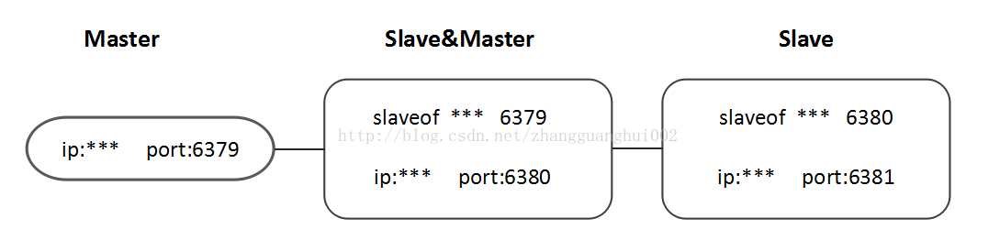

## **什么是**[**Redis**](https://juejin.im/post/5ad6e4066fb9a028d82c4b66)

Redis 是一个使用 C 语言写成的，开源的 key-value 数据库。。和Memcached类似，它支持存储的value类型相对更多，包括string(字符串)、list(链表)、set(集合)、zset(sorted set --有序集合)和hash（哈希类型）。这些数据类型都支持push/pop、add/remove及取交集并集和差集及更丰富的操作，而且这些操作都是原子性的。在此基础上，redis支持各种不同方式的排序。与memcached一样，为了保证效率，数据都是缓存在内存中。区别的是redis会周期性的把更新的数据写入磁盘或者把修改操作写入追加的记录文件，并且在此基础上实现了master-slave(主从)同步。目前，Vmware在资助着redis项目的开发和维护。

  


## **Redis常见数据结构**[**使用场景**](https://mp.weixin.qq.com/s/cGD-sKKuMH-Y6LUD5JTv1w)

1.**String**

常用命令：set,get,decr,incr,mget 等。

String数据结构是简单的key-value类型，value其实不仅可以是String，也可以是数字。

**用途：**

常规key-value缓存应用；

常规计数：微博数，粉丝数等。

2.**Hash**

常用命令： hget,hset,hgetall 等。

Hash是一个string类型的field和value的映射表，hash特别适合用于存储对象。 比如我们可以Hash数据结构来存储用户信息，商品信息等等。

**举例：** 电商网站项目的首页使用redis的hash数据结构进行缓存，因为一个网站的首页访问量是最大的，所以通常网站的首页可以通过redis缓存来提高性能和并发量。我用**jedis客户端**来连接和操作我搭建的redis集群或者单机redis，利用jedis可以很容易的对redis进行相关操作，总的来说从搭一个简单的[集群](https://juejin.im/post/5ad54d76f265da23970759d3)到实现redis作为缓存的整个步骤不难。

3.**List**

常用命令:lpush,rpush,lpop,rpop,lrange等

list就是链表，Redis list的应用场景非常多，也是Redis最重要的数据结构之一，比如微博的关注列表，粉丝列表，最新消息排行等功能都可以用Redis的list结构来实现。

Redis list的实现为一个双向链表，即可以支持反向查找和遍历，更方便操作，不过带来了部分额外的内存开销。

4.**Set**

常用命令：sadd,spop,smembers,sunion 等

set对外提供的功能与list类似是一个列表的功能，特殊之处在于set是可以自动排重的。 当你需要存储一个列表数据，又不希望出现重复数据时，set是一个很好的选择，并且set提供了判断某个成员是否在一个set集合内的重要接口，这个也是list所不能提供的。

**举例：**在微博应用中，可以将一个用户所有的关注人存在一个集合中，将其所有粉丝存在一个集合。Redis还为集合提供了求交集、并集、差集等操作，可以非常方便的实现如共同关注、共同喜好、二度好友等功能。可以使用不同的命令选择将结果返回给客户端还是存集到一个新的集合中。 

5.**Sorted Set**

常用命令： zadd,zrange,zrem,zcard等

和set相比，sorted set增加了一个权重参数score，使得集合中的元素能够按score进行有序排列。

**举例：** 在直播系统中，实时排行信息包含直播间在线用户列表，各种礼物排行榜，弹幕消息（可以理解为按消息维度的消息排行榜）等信息，适合使用Redis中的SortedSet结构进行存储。

 


## **Redis命令**

**登录**

```
redis-cli -h host -p port -a password
```

 

**查看**

```
# 查看所有keys
# 如果需要模糊查询可在*前加上需要匹配的关键字比如：keys spring*
keys *
```


**删除**

```
# 清空当前数据库中的所有 key
flushall
```


 

## **Redis安全**

默认情况下 requirepass 参数是空的，这就意味着你无需通过密码验证就可以连接到 redis 服务。

通过以下命令查看是否设置了密码验证：

```
127.0.0.1:6379> CONFIG get requirepass
1) "requirepass"
2) ""
```

通过以下命令来修改该参数：

```
127.0.0.1:6379> CONFIG set requirepass "runoob"
OK
127.0.0.1:6379> CONFIG get requirepass
1) "requirepass"
2) "runoob"
```

设置密码后，客户端连接 redis 服务就需要密码验证，否则无法执行命令。

```
127.0.0.1:6379> AUTH "runoob"
OK
127.0.0.1:6379> SET mykey "Test value"
OK
127.0.0.1:6379> GET mykey
"Test value"
```


## Redis相比memcached有哪些区别

**数据类型丰富：**

Redis不仅仅支持简单的k/v类型的数据，同时还提供list，set，zset，hash等数据结构的存储。memcached支持简单的数据类型，String。

**速度快：**

redis的比memcached速度快很多

**持久化：**

Redis支持数据的持久化，可以将内存中的数据保持在磁盘中，重启的时候可以再次加载进行使用,而Memecache把数据全部存在内存之中

**数据备份：**

Redis支持数据的备份，即master-slave模式的数据备份。

**单线程：**

Memcached是多线程，非阻塞IO复用的网络模型；Redis使用单线程的IO复用模型。

 

 

## **Redis实现主从同步**

Master&Slave也就是我们所说的[主从复制](https://blog.csdn.net/zhangguanghui002/article/details/78524533)，主机数据更新后根据配置和策略，自动同步到备机，Master以写为主，Slave以读为主。

**作用：**

​    1、读写分离；

​    2、容灾恢复。

**怎么玩：**

​    1、配从（库）不配主（库）；

​    2、从库配置：slaveof [主库IP] [主库端口]；

​    补充：每次slave与master断开后，都需要重新连接，除非你配置进redis.conf文件;

​    键入info replication 可以查看redis主从信息。

**薪火相传**



上一个Slave可以是下一个Slave的Master，Slave同样可以接收其他slaves的连接和同步请求，那么该slave作为了链条中下一个slave的Master，如此可以有效减轻Master的写压力。如果slave中途变更转向，会清除之前的数据，重新建立最新的。

**反客为主**

当Master挂掉后，Slave可键入命令 slaveof no one使当前redis停止与其他Master redis数据同步，转成Master redis。

**复制原理**

​    1、Slave启动成功连接到master后会发送一个sync命令；

​    2、Master接到命令启动后的存盘进程，同时收集所有接收到的用于修改数据集命令，在后台进程执行完毕之后，master将传送整个数据文件到slave，以完成一次完全同步；

​    3、全量复制：而slave服务在数据库文件数据后，将其存盘并加载到内存中；

​    4、增量复制：Master继续将新的所有收集到的修改命令依次传给slave，完成同步；

​    5、但是只要是重新连接master，一次完全同步（全量复制）将被自动执行。

**哨兵模式（sentinel）**

反客为主的自动版，能够后台监控Master库是否故障，如果故障了根据投票数自动将slave库转换为主库。一组sentinel能同时监控多个Master。

​    1、在Master对应redis.conf同目录下新建sentinel.conf文件，名字绝对不能错；

​    2、配置哨兵，在sentinel.conf文件中填入内容：

​       sentinel monitor 被监控数据库名字（自己起名字） ip port 1

​       说明：上面最后一个数字1，表示主机挂掉后slave投票看让谁接替成为主机，得票数多少后成为主机。

​    3、启动哨兵模式：

​       命令键入：redis-sentinel /myredis/sentinel.conf

​       注：上述sentinel.conf路径按各自实际情况配置

**复制的缺点**

延时，由于所有的写操作都是在Master上操作，然后同步更新到Slave上，所以从Master同步到Slave机器有一定的延迟，当系统很繁忙的时候，延迟问题会更加严重，Slave机器数量的增加也会使得这个问题更加严重。


 

## **如何保证Redis中的数据都是热点数据**

MySQL里有2000w数据，Redis中只存20w的数据，如何保证Redis中的数据都是热点数据（redis有哪些数据淘汰策略？？？）

相关知识：redis 内存数据集大小上升到一定大小的时候，就会施行数据淘汰策略（回收策略）。

**redis 提供 6种数据淘汰策略：**

1. **volatile-lru**：从已设置过期时间的数据集（server.db[i].expires）中挑选最近最少使用的数据淘汰
2. **volatile-ttl**：从已设置过期时间的数据集（server.db[i].expires）中挑选将要过期的数据淘汰
3. **volatile-random**：从已设置过期时间的数据集（server.db[i].expires）中任意选择数据淘汰
4. **allkeys-lru**：从数据集（server.db[i].dict）中挑选最近最少使用的数据淘汰
5. **allkeys-random**：从数据集（server.db[i].dict）中任意选择数据淘汰
6. **no-enviction**（驱逐）：禁止驱逐数据

 

 

## **Redis的并发竞争问题如何解决**

Redis为单进程单线程模式，采用队列模式将并发访问变为串行访问。Redis本身没有锁的概念，Redis对于多个客户端连接并不存在竞争，但是在Jedis客户端对Redis进行并发访问时会发生连接超时、数据转换错误、阻塞、客户端关闭连接等问题，这些问题均是由于客户端连接混乱造成。对此有2种解决方法：

1.客户端角度，为保证每个客户端间正常有序与Redis进行通信，对连接进行池化，同时对客户端读写Redis操作采用内部锁synchronized。

2.服务器角度，利用setnx实现锁。

注：对于第一种，需要应用程序自己处理资源的同步，可以使用的方法比较通俗，可以使用synchronized也可以使用lock；第二种需要用到Redis的setnx命令，但是需要注意一些问题。

 

 

## **Redis与消息队列**

不要使用redis去做消息队列，这不是redis的设计目标。但实在太多人使用redis去做去消息队列，redis的作者看不下去，另外基于redis的核心代码，另外实现了一个消息队列**disque**： antirez/disque:https://github.com/antirez/disque部署、协议等方面都跟redis非常类似，并且支持集群，延迟消息等等。

在做网站过程接触比较多的还是使用redis做缓存，比如秒杀系统，首页缓存等等。


## **Redis作为队列使用**

```java
// 加入队列
redisTemplate.opsForList().rightPush(K key, V value)
// 从队列中拿出
redisTemplate.opsForList().leftPop(K key)
```

 


## **Redis常见性能问题和解决方案**

1. Master最好不要做任何持久化工作，如RDB内存快照和AOF日志文件
2. 如果数据比较重要，某个Slave开启AOF备份数据，策略设置为每秒同步一次
3. 为了主从复制的速度和连接的稳定性，Master和Slave最好在同一个局域网内
4. 尽量避免在压力很大的主库上增加从库

 

 

## **Redis持久化**

Redis提供不同级别[持久化方案](https://mp.weixin.qq.com/s/4XdqkaBBwSJCpcuWBoadTA)：

- RDB持久化方式能在指定时间周期内对数据进行快照存储
- AOF（Append-only     file）持久化方式记录每次对Redis的写操作命令，当Redis重启，会重新执行这些命令以恢复原始数据，AOF命令遵循Redis协议追加到文件末尾，Redis还能对AOF文件进行后台重写（轮询文件）,使得AOF文件的体积不至于过大。

注：也可以同时开启两种持久化方式。当Redis重启，会优先载入AOF文件来恢复原始数据（一般AOF文件保存的数据库要比RDB文件保存的数据库完整）

**RDB优点**

- RDB**文件**十分**紧凑**（compact），保存某个时间及该时间以前的数据集，如：每小时保存一下数据，那么30天后，如果出问题，可以根据需求恢复不同时间版本的数据集
- 非常**适合备份**，或灾难恢复，在出现问题后，直接传送紧凑的RDB单文件进行恢复。
- RDB在保存RDB文件时父进程唯一需要做的就是fork出一个子进程,接下来的工作全部由子进程来做，父进程不需要再做其他IO操作，所以RDB持久化方式可以**最大化**Redis的**性能**
- 与AOF相比,在恢复大的数据集时，RDB方式会更**快**一些

**RDB缺点**

- 若希望Redis意外停止工作（如服务器断电）时丢失最少数据，那AOF方式更适合，虽然可配置不同的save时间点（如每5分钟数据集有100个写操作时执行持久化），但最后一次持久化后的数据更新无法保存到磁盘
- RDB 需要经常fork子进程来保存数据集到硬盘上,当数据集比较大的时候,fork的过程是非常耗时的,可能会导致Redis在一些毫秒级内不能响应客户端的请求.如果数据集巨大并且CPU性能不是很好的情况下,这种情况会持续1秒,AOF也需要fork,但是你可以调节重写日志文件的频率来提高数据集的耐久度(产品能够无故障的使用较长时间或使用寿命长)

**AOF优点**

- AOF方式能提高Redis数据集的耐久度，可以有**多种fsync策略**：

- - 完全无fsync；将数据交给操作系统处理，更快，但数据丢失风险高
  - 每秒fsync;(默认策略)，(fsync是由后台线程进行处理的,主线程会尽力处理客户端请求),一旦出现故障，你最多丢失1秒的数据
  - 每次写fsync；非常慢，但异常安全

- AOF会**追加日志**到文件，而不需要搜索文件内容，即使由于某些原因(磁盘空间已满，写的过程中宕机等等)未执行完整的写入命令,你也也可使用Redis-check-aof工具修复这些问题

- Redis可以在AOF文件体积变得过大时，**自动**地在后台对AOF进行**重写**（轮询文件）：重写后的新AOF文件包含了恢复当前数据集所需的最小命令集合。整个重写操作是绝对安全的，因为Redis在创建新AOF文件时，会继续将命令追加到现有的AOF文件里面，即使重写过程中发生停机，现有的AOF文件也不会丢失。而一旦新AOF文件创建完毕，Redis 就会从旧AOF文件切换到新AOF文件，并开始对新AOF文件进行追加操作

- AOF 文件按照命令执行顺序保存对数据库执行的所有写入操作，这些写入操作以Redis协议格式保存，因此AOF文件**易读性高**，分析方便，同时AOF文件导出也很便捷。举个例子，如果你不小心执行了FLUSHALL命令， 但只要AOF文件未被重写， 那么只要停止服务器，移除AOF文件末尾的FLUSHALL命令， 并重启Redis， 就可以将数据集恢复到FLUSHALL执行之前的状态

**AOF缺点**

- 对于相同的数据集来说，AOF文件的**体积**通常要**大**于RDB文件的体积（保存的是命令列表，相较于直接保存数据更占用空间）
- 根据所使用的fsync策略，AOF的持久化**速度**可能会**慢**于RDB，尽管如此，每秒fsync的性能依然非常高，而关闭fsync可以让AOF的持久化速度和RDB一样快，     即使在高负荷之下也是如此。不过，在写入巨量数据时，RDB能保证比较低的延迟(latency)

**如何选择哪种持久化方式？**

- 若想达到足以媲美PostgreSQL的数据安全性，应该同时使用两种持久化功能；
- 若能承受数分钟内数据丢失，可只使用RDB持久化；
- 很多场景用户都只使用AOF持久化，但并不推荐：因为定时生成RDB快照(snapshot),非常便于进行数据备份，且RDB恢复数据集速度比AOF快，此外，使用     RDB 还可以避免之前提到的 AOF 程序的 bug；


## **windows下启动Radis**

**标准方式**

1.启动服务（命令行输入）：

```
D:\redis\redis-server.exe D:\redis\redis.windows.conf
```

2.打开终端（radis目录命令行输入）：

```
redis-cli -h 127.0.0.1 -p 6379
```

**简易方式**

1.启动服务：运行redis目录下的redis-server.exe即可

2.终端访问：运行redis目录下的redis-cli.exe即可

**将redis变成windows服务**

使用管理员身份运行powershell，进入redis文件夹下键入以下命令之后即可进入服务列表看到新加的redis服务：

```
./redis-server --service-install redis.windows-service.conf --loglevel verbose
```


 

## **Linux下安装启动Radis**

[**安装**](https://www.cnblogs.com/lauhp/p/8487029.html)**：**

1.获取redis资源

```
wget http://download.redis.io/releases/redis-4.0.8.tar.gz
tar xzvf redis-4.0.8.tar.gz
```

2.安装

```
cd redis-4.0.8
make
cd src
make install PREFIX=/usr/local/redis
```

3.移动配置文件到安装目录下

```
cd ../
mkdir /usr/local/redis/etc
mv redis.conf /usr/local/redis/etc
```

4.配置redis为后台启动

```
# 将daemonize no 改成daemonize yes
vi /usr/local/redis/etc/redis.conf
```

5.将redis加入到开机启动

```
# 在里面添加内容：/usr/local/redis/bin/redis-server /usr/local/redis/etc/redis.conf (意思就是开机调用这段开启redis的命令)
vi /etc/rc.local
```

**启动：**

1.开启redis

```
/usr/local/redis/bin/redis-server /usr/local/redis/etc/redis.conf 
# 或者
redis-server /usr/local/redis/etc/redis.conf
```

2.停止

```
pkill redis
```

**卸载：**

```
# 删除安装目录
rm -rf /usr/local/redis

# 删除所有redis相关命令脚本
rm -rf /usr/bin/redis-*

# 删除redis解压文件夹
rm -rf /root/download/redis-4.0.4
```


 

## **CacheCloud**

CacheCloud提供一个Redis[云管理平台](https://hub.docker.com/r/trumandu/cachecloud/)：实现多种类型(Redis Standalone、Redis Sentinel、Redis Cluster)自动部署、解决Redis实例碎片化现象、提供完善统计、监控、运维功能、减少运维成本和误操作，提高机器的利用率，提供灵活的伸缩性，提供方便的接入客户端。

```
#docker使用CacheCloud
docker pull trumandu/cachecloud:1.2
```


 

## **SpringBoot使用**[**Redis**](https://juejin.im/post/5bbf077d5188255c393f8c90)

Spring为我们提供了几个注解来支持Spring Cache。其核心主要是[@Cacheable](https://www.cnblogs.com/fashflying/p/6908028.html)和@CacheEvict。

使用@Cacheable标记的方法在执行后Spring Cache将缓存其返回结果

使用@CacheEvict标记的方法会在方法执行前或者执行后移除Spring Cache中的某些元素。

 

 

## Lettuce（Redis客户端）

Lettuce和Jedis的都是连接Redis Server的客户端程序。Jedis在实现上是直连redis server，多线程环境下非线程安全，除非使用连接池，为每个Jedis实例增加物理连接。[Lettuce](https://blog.csdn.net/winter_chen001/article/details/80614331)基于Netty的连接实例（StatefulRedisConnection），可以在多个线程间并发访问，且**线程安全**，满足多线程环境下的并发访问，同时它是可伸缩的设计，一个连接实例不够的情况也可以按需增加连接实例。

 

## **Redis**[**插入大量数据**](http://www.redis.cn/topics/mass-insert.html)

使用[Shell+Redis](https://www.cnblogs.com/ivictor/p/5446503.html)

1. 新建一个文本文件，包含redis命令

   SET Key0 Value0
   SET Key1 Value1
    …

2. 将这些命令转化成Redis Protocol**（因为Redis管道功能支持的是Redis Protocol，而不是直接的Redis命令）**

   ```
   #!/bin/bash
   while read CMD; do
   # each command begins with *{number arguments in command}\r\n
   XS=($CMD); printf "*${#XS[@]}\r\n"
   # for each argument, we append ${length}\r\n{argument}\r\n
   for X in $CMD; do printf "\$${#X}\r\n$X\r\n"; done
   done < redis.log
   ```

	执行文件
   ```
   ./convert.sh > redis_data.txt
   ```

   

3. 利用管道插入

   ```
   cat redis_data.txt | redis-cli --pipe
   ```

   


## **MongoDB与Redis比较**

| **比较指标** | **MongoDB(v2.4.9)**                                          | **Redis(v2.4.17)**                                           | **比较说明**                                                 |
| ------------ | ------------------------------------------------------------ | ------------------------------------------------------------ | ------------------------------------------------------------ |
| 实现语言     | c++                                                          | c/c++                                                        | -                                                            |
| 协议         | BSON,自定义二进制                                            | 类telnet                                                     | -                                                            |
| 性能         | 依赖内存,TPS较高                                             | 依赖内存,TPS非常高                                           | Redis优于MongoDB                                             |
| 可操作性     | 丰富的数据表达,索引;最类似于关系型数据库,支持丰富的查询语句  | 数据丰富,较少的IO                                            | MongoDB优于Redis                                             |
| 内存及存储   | 适合大数据量存储,依赖系统虚拟内存,采用镜像文件存储;内存占用率比较高,官方建议独立部署在64位系统 | Redis2.0后支持虚拟内存特性(VM)  突破物理内存限制;数据可以设置时效性,类似于memcache | 不同的应用场景,各有千秋                                      |
| 可用性       | 支持master-slave,replicatset(内部采用paxos选举算法,自动故障恢复),auto  sharding机制,对客户端屏蔽了故障转移和切片机制 | 依赖客户端来实现分布式读写;主从复制时,每次从节点重新连接主节点都要依赖整个快照,无增量复制;不支持auto  sharding,需要依赖程序设定一致性hash机制 | MongoDB优于Redis；单点问题上,MongoDB应用简单,相对用户透明,Redis比较复杂,需要客户端主动解决.(MongoDB一般使用replicasets和sharding相结合,replicasets侧重高可用性以及高可靠,sharding侧重性能,水平扩展) |
| 可靠性       | 从1.8版本后,采用binlog方式(类似Mysql)  支持持久化            | 依赖快照进行持久化;AOF增强可靠性;增强性的同时,影响访问性能   |                                                              |
| 一致性       | 不支持事务,靠客户端保证                                      | 支持事务,比较脆,仅能保证事务中的操作按顺序执行               | Redis优于MongoDB                                             |
| 数据分析     | 内置数据分析功能(mapreduce)                                  | 不支持                                                       | MongoDB优于Redis                                             |
| 应用场景     | 海量数据的访问效率提升                                       | 较小数据量的性能和运算                                       | MongoDB优于Redis                                             |

> **注：**MongoDB建议集群部署，更多的考虑到集群方案，Redis更偏重于进程顺序写入，虽然支持集群，也仅限于主-从模式。