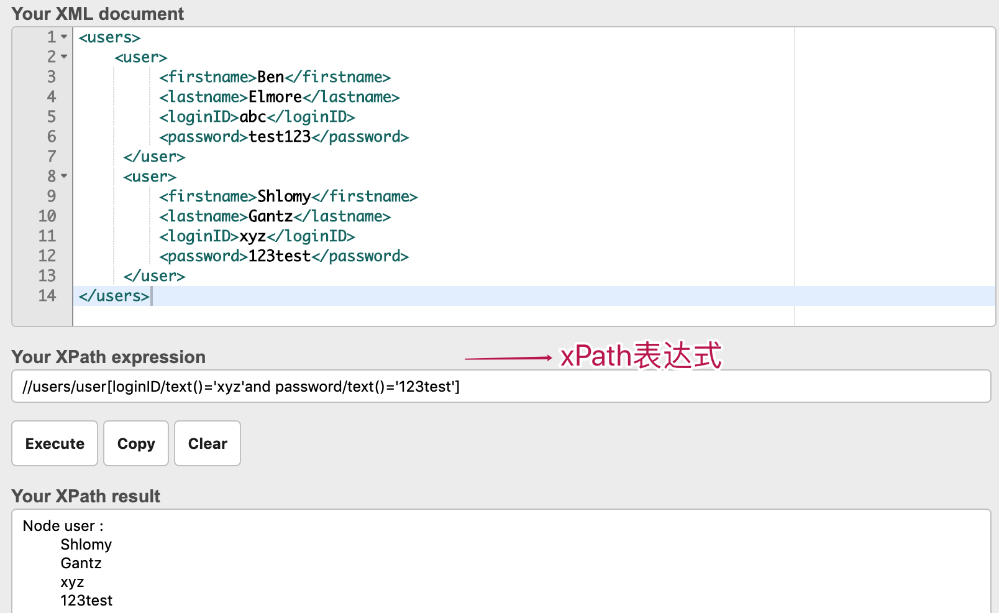
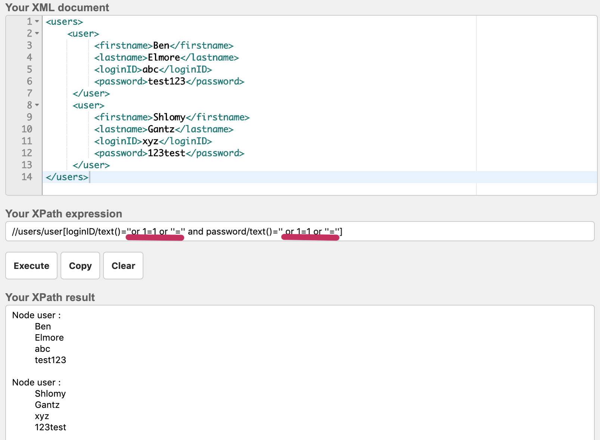

# 安全防护

> 文章来源：[开发安全相关知识体系详解](https://www.pdai.tech/md/develop/security/dev-security-overview.html)

## 注入攻击

注入攻击最为常见的攻击方式，作为开发而言必须完全避免; 本文会介绍常见的几种注入方式，比如：`SQL 注入`, `xPath 注入`, `命令注入`, `LDAP注入`, `CLRF注入`, `Host头注入`, `Email头注入`等等，总结来看其本质其实是一样的，且防御措施也大同小异，具体看下面的内容。

### SQL 注入

所谓 SQL 注入，就是通过将 SQL 命令插入应用程序的 http 请求中，并在服务器端被接收后用于参与数据库操作，最终达到欺骗服务器执行恶意的 SQL 命令的效果。理论上来讲，应用程序中只要是与数据库有数据交互的地方，无论是增删改查，如果数据完全受用户控制，而应用程序又处理不当，那么这些地方都是可能存在 SQL 注入的。

#### 如何防御

- **使用预编译处理输入参数**：要防御 SQL 注入，用户的输入就不能直接嵌套在 SQL 语句当中。使用参数化的语句，用户的输入就被限制于一个参数当中。
- **输入验证**：检查用户输入的合法性，以确保输入的内容为正常的数据。数据检查应当在客户端和服务器端都执行，之所以要执行服务器端验证，是因为客户端的校验往往只是减轻服务器的压力和提高对用户的友好度，攻击者完全有可能通过抓包修改参数或者是获得网页的源代码后，修改验证合法性的脚本（或者直接删除脚本），然后将非法内容通过修改后的表单提交给服务器等等手段绕过客户端的校验。因此，要保证验证操作确实已经执行，唯一的办法就是在服务器端也执行验证。但是这些方法很容易出现由于过滤不严导致恶意攻击者可能绕过这些过滤的现象，需要慎重使用。
- **错误消息处理**：防范 SQL 注入，还要避免出现一些详细的错误消息，恶意攻击者往往会利用这些报错信息来判断后台 SQL 的拼接形式，甚至是直接利用这些报错注入将数据库中的数据通过报错信息显示出来。
- **加密处理**：将用户登录名称、密码等数据加密保存。加密用户输入的数据，然后再将它与数据库中保存的数据比较，这相当于对用户输入的数据进行了“消毒”处理，用户输入的数据不再对数据库有任何特殊的意义，从而也就防止了攻击者注入 SQL 命令。

### xPath 注入

XPath 是一种用来在内存中导航整个XML树的语言，它使用路径表达式来选取XML文档中的节点或者节点集。XPath 的设计初衷是作为一种面向 XSLT 和 XPointer 的语言,后来独立成了一种W3C标准。而 XPath 注入是指利用 XPath 解析器的松散输入和容错特性，能够在 URL、表单或其它信息上附带恶意的 XPath 查询代码，以获得权限信息的访问权并更改这些信息。XPath 注入与 SQL 注入类似，均是通过构造恶意的查询语句，对应用程序进行攻击。



**如何攻击**

如果用户传入类似 ’ or 1=1 or ”=’ 的值，那么该查询语句也会得到 true 返回值，将返回所有用户的列表。



#### 如何防御

- 对用户的输入进行合理验证，对特殊字符（如<、>、’、”等）等进行转义。过滤可以在客户端和服务端两边实现，如果可能的话，建议两者同时进行过滤。
- 创建一份安全字符白名单，确保 XPath 查询中由用户控制的数值完全来自于预定的字符集合，不包含任何 XPath 元字符。
- 对于系统出现的错误信息，以IE错误编码信息替换，屏蔽系统本身的出错信息。
- 参数化XPath查询，将需要构建的XPath查询表达式，以变量的形式表示，变量不是可以执行的脚本。
- 通过MD5、SSL等加密算法，对于数据敏感信息和在数据传输过程中加密，即使某些非法用户通过非法手法获取数据包，看到的也是加密后的信息。
- 使用源代码静态分析工具，进行自动化的检测，可以有效的发现源代码中的 XPath 注入问题。

### 命令注入

命令是指通过提交恶意构造的参数破坏命令语句结构，从而达到执行恶意命令的目的。

#### 场景

Java中`System.Runtime.getRuntime().exec(cmd);`可以在目标机器上执行命令，而构建参数的过程中可能会引发注入攻击。

#### 常见注入方式

- “；”分割
- “&”，“&&”，“||” 分割
- “|” 管道符
- `\r\n %d0%a0` 换行
- 反引号解析
- `$()` 替换

#### 如何防御

- 不使用时禁用相应函数
- 尽量不要执行外部的应用程序或命令
- 做输入的格式检查
- 转义命令中的所有shell元字符: shell元字符包括 #&;`,|*?~<>^()[]{}$\

## CSRF

CSRF（Cross Site Request Forgery, 跨站域请求伪造）是一种网络的攻击方式，它在 2007 年曾被列为互联网 20 大安全隐患之一。其他安全隐患，比如 SQL 脚本注入，跨站域脚本攻击等在近年来已经逐渐为众人熟知，很多网站也都针对他们进行了防御。然而，对于大多数人来说，CSRF 却依然是一个陌生的概念。即便是大名鼎鼎的 Gmail, 在 2007 年底也存在着 CSRF 漏洞，从而被黑客攻击而使 Gmail 的用户造成巨大的损失。

CSRF 攻击是黑客借助受害者的 cookie 骗取服务器的信任，但是黑客并不能拿到 cookie，也看不到 cookie 的内容。

### 如何攻击

A网站通过cookie来识别用户（C），当用户成功进行身份验证之后浏览器就会得到一个标识其身份的cookie，只要不关闭浏览器或者退出登录，以后访问A网站会一直带上这个cookie。如果这期间浏览器被人控制着向A网站发起请求去执行一些用户不想做的功能（比如添加账号），这就是会话劫持了。因为这个不是用户真正想发出的请求，这就是所谓的“请求伪造”。此外，由于请求可以从第三方网站提交，所以前缀跨站二字，即从B网站发起。

### 防御思路

- **验证 HTTP Referer 字段**
  
  根据 HTTP 协议，在 HTTP 头中有一个字段叫 Referer，它记录了该 HTTP 请求的来源地址。因此，要防御 CSRF 攻击，银行网站只需要对于每一个转账请求验证其 Referer 值，如果是以 bank.example 开头的域名，则说明该请求是来自银行网站自己的请求，是合法的。如果 Referer 是其他网站的话，则有可能是黑客的 CSRF 攻击，拒绝该请求。

- **在请求地址中添加 token 并验证**

- CSRF 攻击之所以能够成功，是因为黑客可以完全伪造用户的请求，该请求中所有的用户验证信息都是存在于 cookie 中，因此黑客可以在不知道这些验证信息的情况下直接利用用户自己的 cookie 来通过安全验证。要抵御 CSRF，关键在于在请求中放入黑客所不能伪造的信息，并且该信息不存在于 cookie 之中。可以在 HTTP 请求中以参数的形式加入一个随机产生的 token，并在服务器端建立一个拦截器来验证这个 token，如果请求中没有 token 或者 token 内容不正确，则认为可能是 CSRF 攻击而拒绝该请求。这种方法要比检查 Referer 要安全一些。

- **在 HTTP 头中自定义属性并验证**
  
  这种方法也是使用 token 并进行验证，和上一种方法不同的是，这里并不是把 token 以参数的形式置于 HTTP 请求之中，而是把它放到 HTTP 头中自定义的属性里。XMLHttpRequest 这个类，可以一次性给所有该类请求加上 csrftoken 这个 HTTP 头属性，并把 token 值放入其中。这样解决了上种方法在请求中加入 token 的不便，同时，通过 XMLHttpRequest 请求的地址不会被记录到浏览器的地址栏，也不用担心 token 会透过 Referer 泄露到其他网站中去。

### 总结

可见，CSRF 是一种危害非常大的攻击，又很难以防范。目前几种防御策略虽然可以很大程度上抵御 CSRF 的攻击，但并没有一种完美的解决方案。一些新的方案正在研究之中，比如对于每次请求都使用不同的动态口令，把 Referer 和 token 方案结合起来，甚至尝试修改 HTTP 规范，但是这些新的方案尚不成熟，要正式投入使用并被业界广为接受还需时日。在这之前，我们只有充分重视 CSRF，根据系统的实际情况选择最合适的策略，这样才能把 CSRF 的危害降到最低。

## XSS

XSS是跨站脚本攻击(Cross Site Scripting)，为不和层叠样式表(Cascading Style Sheets, CSS)的缩写混淆，故将跨站脚本攻击缩写为XSS。恶意攻击者往Web页面里插入恶意Script代码，当用户浏览该页之时，嵌入其中Web里面的Script代码会被执行，从而达到恶意攻击用户的目的。

### 简介

举一个简单的例子，就是留言板。我们知道留言板通常的任务就是把用户留言的内容展示出来。正常情况下，用户的留言都是正常的语言文字，留言板显示的内容也就没毛病。然而这个时候如果有人不按套路出牌，在留言内容中丢进去一行 `<script>alert("aaa")</script>` ，那么留言板界面的网页代码就会变成形如以下：

```html
<html>
    <head>
       <title>Board</title>
    </head>
    <body>
    <div id="board">
        <script>alert("aaa")</script>
    </div>     
    </body>
</html>
```

那么这个时候问题就来了，当浏览器解析到用户输入的代码那一行时会发生什么呢？答案很显然，浏览器并不知道这些代码改变了原本程序的意图，会照做弹出一个信息框。

对于攻击者来说，能够让受害者浏览器执行恶意代码的唯一方式，就是把代码注入到受害者从网站下载的网页中, 这就是xss攻击。

### 攻击类型

通常XSS攻击分为：`反射型xss攻击`, `存储型xss攻击` 和 `DOM型xss攻击`。

#### 反射型xss攻击

反射型的攻击需要用户主动的去访问带攻击的链接，攻击者可以通过邮件或者短信的形式，诱导受害者点开链接。如果攻击者配合短链接URL，攻击成功的概率会更高。

1. 用户误点开了带攻击的url : `http://xxx?keyword=<script>alert('aaa')</script>`
2. 网站给受害者的返回中包含了来自URL的的恶意文本
3. 用户的浏览器收到文本后执行页面，会在网页中弹窗aaa

#### 存储型xss攻击

这种攻击方式恶意代码会被存储在数据库中，其他用户在正常访问的情况下，也有会被攻击，影响的范围比较大。

1. 攻击者通过评论表单提交将`<script>alert(‘aaa’)</script>`提交到网站
2. 网站后端对提交的评论数据不做任何操作，直接存储到数据库中
3. 其他用户访问正常访问网站，并且需要请求网站的评论数据
4. 网站后端会从数据库中取出数据，直接返回给用户
5. 用户得到页面后，直接运行攻击者提交的代码`<script>alert(‘aaa’)</script>`，所有用户都会在网页中弹出aaa的弹窗

#### DOM型xss攻击

基于DOM的XSS攻击是反射型攻击的变种。服务器返回的页面是正常的，只是我们在页面执行js的过程中，会把攻击代码植入到页面中。

- 用户误点开了带攻击的url : `http://xxx?name=<script>alert('aaa')</script>`
- 网站给受害者的返回中正常的网页
- 用户的浏览器收到文本后执行页面合法脚本，这时候页面恶意脚本会被执行，会在网页中弹窗aaa

这种攻击方式发生在我们合法的js执行中，服务器无法检测我们的请求是否有攻击的危险

### 危害

- 通过document.cookie盗取cookie
- 使用js或css破坏页面正常的结构与样式
- 流量劫持（通过访问某段具有window.location.href定位到其他页面）
- Dos攻击：利用合理的客户端请求来占用过多的服务器资源，从而使合法用户无法得到服务器响应。
- 利用iframe、frame、XMLHttpRequest或上述Flash等方式，以（被攻击）用户的身份执行一些管理动作，或执行一些一般的如发微博、加好友、发私信等操作。
- 利用可被攻击的域受到其他域信任的特点，以受信任来源的身份请求一些平时不允许的操作，如进行不当的投票活动。
- DOS（拒绝服务）客户端浏览器。
- 钓鱼攻击，高级的钓鱼技巧。
- 劫持用户Web行为，甚至进一步渗透内网。
- 蠕虫式挂马攻击、刷广告、刷浏量、破坏网上数据

### 防御

XSS攻击其实就是代码的注入。用户的输入被编译成恶意的程序代码。所以，为了防范这一类代码的注入，需要确保用户输入的安全性。对于攻击验证，我们可以采用以下两种措施：

- **编码，就是转义用户的输入，把用户的输入解读为数据而不是代码**
- **校验，对用户的输入及请求都进行过滤检查，如对特殊字符进行过滤，设置输入域的匹配规则等**。

具体比如：

- **对于验证输入**，我们既可以在`服务端验证`，也可以在`客户端验证`
- **对于持久性和反射型攻击**，`服务端验证`是必须的，服务端支持的任何语言都能够做到
- **对于基于DOM的XSS攻击**，验证输入在客户端必须执行，因为从服务端来说，所有发出的页面内容是正常的，只是在客户端js代码执行的过程中才发生可攻击
- 但是对于各种攻击方式，**我们最好做到客户端和服务端都进行处理**。

其它还有一些辅助措施，比如：

- **入参长度限制**： 通过以上的案例我们不难发现xss攻击要能达成往往需要较长的字符串，因此对于一些可以预期的输入可以通过限制长度强制截断来进行防御。
- 设置cookie httponly为true（具体请看下文的解释）

#### 编码

- **前端**
  
  ```javascript
  // util封装可以参考 HTMLParser.js, 或者自己封装
  util.escapeHtml(html);
  ```

- **后端**
  
  推荐使用ApacheCommon包下 `StringEscapeUtils` – 用于正确处理转义字符，产生正确的Java、JavaScript、HTML、XML和SQL代码；
  
  ```java
  // encode html
  System.out.println(StringEscapeUtils.escapeHtml("<a>abc</a>"));
  System.out.println(StringEscapeUtils.unescapeHtml("<a>abc</a>"));
  
  // encode js
  System.out.println(StringEscapeUtils.escapeJavaScript("<script>alert('123')<script>"));
  System.out.println(StringEscapeUtils.unescapeJavaScript("<script>alert(\'123\')<script>"));
  ```

#### 过滤或者校验

校验是一种过滤用户输入以至于让代码中恶意部分被移除的行为。校验都是通过一定的经验和规则，对用户的输入进行匹配，过滤，去除掉存在攻击风险的部分。

我们可以通过黑名单的方式和白名单的方式来设置我们的规则，对用户提交的数据进行有效性验证，仅接受符合我们期望格式的内容提交，阻止或者忽略除此外的其他任何数据。

- **黑名单** 我们可以把某些危险的标签或者属性纳入黑名单，过滤掉它。
- **白名单** 这种方式只允许部分标签和属性，不在这个白名单中的，一律过滤掉它。

#### CSP

内容安全策略（Content Security Policy，简称CSP）是一种以可信白名单作机制，来限制网站中是否可以包含某来源内容。

CSP对你用于浏览页面的浏览器做出了限制，以确保它只能从可信赖来源下载的资源。*资源*可以是脚本，样式，图片，或者其他被页面引用的文件。这意味着即使攻击者成功的在你的网站中注入了恶意内容，CSP也能免于它被执行。

默认配置下不允许执行内联代码（`<script>`块内容，内联事件，内联样式），以及禁止执行eval() , newFunction() , setTimeout([string], ...) 和setInterval([string], ...) 。

**示例**

```javascript
// 只允许本站资源
Content-Security-Policy： default-src ‘self’

// 允许本站的资源以及任意位置的图片以及 https://www.pdai.tech 下的脚本。
Content-Security-Policy： default-src ‘self’; img-src *;
script-src https://www.pdai.tech
```

#### 盗用cookie

csrf攻击其实是不能盗用cookie的，它只是以当前的名义进行恶意操作；而xss攻击是可以直接盗用cookie。

那盗用cookie的危害是什么？比如拿到用户的cookie信息，然后传送到攻击者自己的服务器，从cookie中提取敏感信息，拿到用户的登录信息，或者攻击者可以通过修改DOM在页面上插入一个假的登陆框，也可以把表单的`action`属性指向他自己的服务器地址，然后欺骗用户提交自己的敏感信息。

这就是为什么cookie也是要防御的，比如：

- 设置http-only
- 设置cookie的有效周期

## DDos

分布式拒绝服务攻击(英文意思是Distributed Denial of Service，简称DDoS)是指处于不同位置的多个攻击者同时向一个或数个目标发动攻击，或者一个攻击者控制了位于不同位置的多台机器并利用这些机器对受害者同时实施攻击。由于攻击的发出点是分布在不同地方的，这类攻击称为分布式拒绝服务攻击，其中的攻击者可以有多个。@pdai

### 攻击原理

分布式拒绝服务攻击原理分布式拒绝服务攻击DDoS是一种基于DoS的特殊形式的拒绝服务攻击，是一种分布的、协同的大规模攻击方式。单一的DoS攻击一般是采用一对一方式的，它利用网络协议和操作系统的一些缺陷，采用欺骗和伪装的策略来进行网络攻击，使网站服务器充斥大量要求回复的信息，消耗网络带宽或系统资源，导致网络或系统不胜负荷以至于瘫痪而停止提供正常的网络服务。与DoS攻击由单台主机发起攻击相比较，分布式拒绝服务攻击DDoS是借助数百、甚至数千台被入侵后安装了攻击进程的主机同时发起的集团行为。

一个完整的DDoS攻击体系由攻击者、主控端、代理端和攻击目标四部分组成。主控端和代理端分别用于控制和实际发起攻击，其中主控端只发布命令而不参与实际的攻击，代理端发出DDoS的实际攻击包。对于主控端和代理端的计算机，攻击者有控制权或者部分控制权．它在攻击过程中会利用各种手段隐藏自己不被别人发现。真正的攻击者一旦将攻击的命令传送到主控端，攻击者就可以关闭或离开网络．而由主控端将命令发布到各个代理主机上。这样攻击者可以逃避追踪。每一个攻击代理主机都会向目标主机发送大量的服务请求数据包，这些数据包经过伪装，无法识别它的来源，而且这些数据包所请求的服务往往要消耗大量的系统资源，造成目标主机无法为用户提供正常服务。甚至导致系统崩溃。

### 攻击分类

| 攻击分类  | 洪水攻击                                                                      | 慢速攻击                              |
| ----- | ------------------------------------------------------------------------- | --------------------------------- |
| 网络层攻击 | ICMP/IGMP洪水攻击                                                             | /                                 |
| 传输层攻击 | UDP洪水攻击   SYN洪水攻击   TCP连接洪水攻击   PSH+ACK洪水攻击   ACK反射攻击   RST洪水攻击   SSL洪水攻击 | Sockstress攻击   THC SSL Dos攻击      |
| 应用层攻击 | DNS QUERY洪水攻击  DNS NXDOMAIN洪水攻击  DNS放大攻击  HTTP洪水攻击  SNMP放大攻击  NTP放大攻击     | Slowloris攻击  慢速POST请求攻击  数据处理过程攻击 |

### 攻击方式

#### 攻击网络资源带宽

当网络数据包的数量达到或者超过上限的时候，会出现网络拥堵、响应缓慢的情况。DDoS就是利用这个原理，发送大量网络数据包，占满被攻击目标的全部带宽，从而造成正常请求失效，达到拒绝服务的目的。

##### 直接攻击

- **ICMP/IGMP Flood**
  
  > Internet Control Message Protocol（网络控制消息协议）是TCP/IP协议族的核心协议之一。它用于在TCP/IP网络中发送控制消息，提供可能发生在通信环境中的各种问题反馈。通过这些消息，管理者可以对所发生的问题做出诊断，然后采取适当的措施解决。
  
  Internet Group Management Protocol（因特网组管理协议）是用于管理因特网协议多播组成员的一种通信协议。IP主机和相邻的路由器利用IGMP来建立多播组的组成员。 攻击者使用受控主机向被攻击目标发送大量的ICMP/IGMP报文，进行洪水攻击以消耗目标的宽带资源，这种类型的攻击出现的很早，使用hping等工具就能简单的发起攻击。但现在使用这种方法发动的攻击已见不多，被攻击目标可以在其网络边界直接过滤并丢弃ICMP/IGMP数据包使攻击无效化。 但是这种直接方式通常依靠受控主机本身的网络性能，所以效果不是很好，还容易被查到攻击源头。于是反射攻击就出现。

- **UDP Flood**
  
  > User Datagram Protocol（用户数据包协议）是一种面向无连接的传输层协议，主要用于不要求分组顺序到达的传输，提供面向事务的简单的不可靠信息传送服务。
  
  利用UDP数据报文，攻击者也可以发送洪水攻击，UDP洪水攻击和ICMP/IGMP洪水攻击的原理基本相同，通常，攻击者会使用小包和大包两种方式进行攻击。
  
  小包是指64字节大小的数据包，这是以太网上传输数据帧的最小值，在相同流量下，单包体积越小，数据包的数量就越多。由于交换机、路由器等网络设备需要对没一个数据包进行检查和校验，因此使用UDP小包攻击能够最有效的增大网络设备处理数据包的压力，造成处理速度的缓慢和传输延迟等拒绝服务攻击的效果。
  
  大包是指1500字节以上的数据包，其大小超过了以太网的最大传输单元(MTU)，使用UDP大包攻击，能够有效的占用网络接口的传输宽带，并迫使被攻击目标在接受到UDP数据时进行分片重组，造成网络拥堵，服务器响应速度变慢。
  
  UDP洪水攻击也是很早就出现的一种拒绝服务攻击方式，这种攻击发动简单，有相当多的工具都能够发动UDP洪水攻击，如hping、LOIC等，但UDP洪水攻击完全依靠受控主机本身的网络性能，因此通常对目标宽带资源的消耗并不太大。

##### 反射和放大攻击

反射攻击又被称为DRDoS（Distributed Reflection Denial of Service 分布式反射拒绝服务）攻击，是指利用路由器、服务器等设施对请求产生应答，从而反射攻击流量并隐藏攻击来源的一种分布式拒绝服务攻击技术。

在进行反射攻击时，攻击者使用受控主机发送大量的数据包，这些数据包的特别之处在于，其目的IP地址指向作为反射器的服务器、路由器等设施，而源IP地址则被伪造成被攻击目标的IP地址，反射器在收到数据包时，会认为该数据包是否被攻击目标所发来的请求，因此会将相应数据发送给被攻击目标，当大量的响应数据包涌向攻击目标时，就会耗尽目标的网络宽带资源，造成拒绝服务攻击。

放大攻击是一种特殊的反射攻击，其特殊之处在于反射器对于网络流量具有放大作用，因此我们也可以将这种反射器成为放大器，进行放大攻击的方式与反射攻击的方式也是基本一致的，不同之处在于反射器（放大器）所提供的网络服务需要满足一定条件。

在反射器所提供的网络服务协议中，需要存在请求和响应数据量不对称的情况，响应数据量需要大于请求数据量，响应数据量与请求数据量的比值越大，放大器的放大倍数也就越大，进行放大攻击所产生的消耗宽带资源的效果也就越明显。

**ACK Flood**

在传输控制协议建立连接时，首先会进行TCP三次握手，在这个过程中，当服务器端接收到客户端发来的SYN连接请求时，会对该请求进行ACK应答，利用TCP握手的ACK应答，即可进行ACK反射攻击。 如果攻击者将SYN的源IP地址伪造成被攻击目标的IP地址，服务器的应答也就会直接发送给被攻击目标，由于使用TCP协议的服务在互联网上广泛存在，攻击者可以通过受控主机向大量不同的服务器发送伪造源IP地址的SYN请求，从而使服务器响应的大量ACK应答数据涌向被攻击目标，占用目标的网络宽带资源并拒绝服务。

DNS Flood

> Domain Name System （域名系统）是因特网的一项核心服务，它作为可以将域名和IP地址相互映射的一个分布式数据库，能够使人更方便地访问互联网，而不用去记住那些难以记忆的IP地址，DNS使用的TCP与UDP端口号都是53，主要使用的UDP协议。 通常，DNS的相应数据包会比查询数据包大，因此攻击者利用普通的DNS查询请求就能够发动放大攻击，并将攻击流量放大2~10倍，但更有效的方法是使用RFC2671中定义的DNS扩展机制EDNS0。

在EDNS0中，扩展了DNS数据包的结果，增加了OPT RR字段，在OPT RR字段中，包含了客户端能够处理的最大UDP报文大小的信息，服务器在响应DNS请求时，解析并记录下客户端能够处理的最大UDP报文的大小，并根据该大小生成响应的报文。 攻击者能够利用dig和EDNS0进行高效的DNS放大攻击，攻击者向广泛存在的开放DNS解析器发送dig查询命令，将OPT RR字段中UDP报文大小设置为很大的值，并将请求的源IP地址伪造成被攻击目标的IP地址。DNS解析器收到查询请求后，会将解析的结果发送给被攻击目标，当大量的解析结果涌向目标时，就会导致目标网络拥堵和缓慢，造成拒绝服务攻击。攻击者发送的DNS查询请求数据包大小一般为60字节左右，而查询返回结果的数据包大小通常为300字节以上，因此，使用该方式进行放大攻击能够达到50倍以上的放大效果。

**NTP Flood**

> Network Time Protocol （网络时间协议）是用来使计算器时间同步化的一种协议，它可以使计算机与时钟源进行同步化并提供高精准度的时间校正，NTP使用UDP 123端口进行通信。

在NTP协议的服务器实现上，通常会实现一系列Mode 7的调试接口，而接口中的monlist请求能够获取到目标NTP服务器进行同步的最后600个客户端的IP地址等信息。这意味着，只需要发送一个很小的请求包，就能触发大量连续的包含IP地址信息等数据的UDP响应数据包。

实际上，monlist请求返回的数据量与一段时间内和NTP服务器交互的客户端数据量有关，由于NTP服务使用的是UDP单包通信，因此攻击者可以将伪造源IP地址的UDP请求包发送给NTP放大器，伪造客户端与NTP服务器的交互，增加“和NTP服务器交互的客户端的数量”，以此来增加monlist请求的响应数据量并增大NTP放大器的放大倍数，只要向NTP放大器发送600个不超过64字节的请求包（约40KB数据），就能够快速的将NTP放大器的放大倍数提高到700倍以上，并在该服务器的NTP服务关闭或重新启动之前一直保持这么大的放大倍数。攻击者发送的monlist请求数据包大小不超过64字节，而请求返回的结果会包含100个482字节的UDP响应数据，因此使用该方式进行放大攻击能够达到700倍以上的放大效果。

**SNMP Flood**

> Simple Network Management Protocol（简单网络管理协议）是目前网络中应用最为广泛的网络管理协议，它提供了一个管理框架来监控和维护互联网的设备，SNMP协议使用UDP 161端口进行通信。 利用SNMP协议中的默认通信字符串和GetBulk请求，攻击者能够开展有效的SNMP放大攻击。

许多厂商安装的SNMP都采用了默认的通信字符串（Community String），这些通信字符串是程序获取设备信息和修改配置必不可少的，最常见的默认通信字符串是public和private，除此之外还有许多厂商私有的默认通信字符串，几乎所有运行SNMP的网络设备上，都可以找到某种形式的默认通信字符串。

在SNMPv1中定义的get请求可以尝试一次获取多个MIB对象，但响应消息的大小受到设备处理能力的限制，如果设备不能返回全部请求的响应，则会返回一条错误信息。在SNMPv2中，添加了Getbulk请求，该请求会通知设备返回尽可能多的数据，这使得管理程序能够通过发送一次请求就获得大段的检索信息。

攻击者向广泛存在并开启了SNMP服务的网络设备发送Getbulk请求，使用默认通信字符串作为认证凭据，并将源IP地址伪造成攻击目标的IP地址，设备收到Getbulk请求后，会将响应结果发送给攻击目标，当大量的响应结果涌向攻击目标时，就会导致攻击目标网络拥堵和缓慢，造成拒绝服务攻击。 攻击者发送的Getbulk请求数据包约为60字节，而请求的响应数据能够达到1500字节以上，因此，使用该方式进行放大攻击能够达到25倍以上的放大效果，这也是一种放大效应明显且有效的放大攻击方式。

**Chargen Flood**

> Character Generator Protocol （Chargen字符发生器协议）是一种简单网络协议，在RFC 864中被定义。该协议设计的目的是用来调试TCP或UDP协议程序、测量连接的带宽或进行QoS的微调等。它的默认端口为19，分为基于TCP和UDP两种方式，TCP方式下建立连接后，服务器会不断传送任意字符到客户端，直到客户端关闭连接。UDP方式下每当服务器收到客户端的一个UDP数据包后向客户端返回一个数据包，长度为0~512字节之间随机值，数据包的负载可以是任意字符。

Chargen协议的设计初衷是为了网络测试，并没有严格的访问控制和流量控制机制，在UDP模式下任何人都可以向开放Chargen服务的主机请求服务，这种简单的请求-回复模式使得攻击者可以伪造源发地址信息向Chargen服务发送请求，而Chargen服务并不会验证源发地址的真伪，会向源发地址发送应答包，这导致该服务可被用来进行DOS攻击。RFC 864中给出Chargen应答包的建议大小不超过512字节，但是在实际实现过程中，这个大小并未被严格限制，根据实际测试，在Linux 系统下，对于64字节的无负载UDP Chargen请求，系统回复一个1066字节的UDP 应答报文，流量被放大了15倍，而在Windows系统下使用同样的请求，回复的UDP应答报文长度达3259字节，并产生了分片，流量被放大了50倍。这使得该服务可以被用来进行放大DOS攻击。

**SSDP Flood**

> 互联网上家用路由器、网络摄像头、打印机、智能家电等智能设备普遍采用 UPnP（即插即用）协议作为网络通讯协议， 而UPnP设备的发现是通过源端口为 1900 的 SSDP（简单服务发现协议）进行相互感知。

利用SSDP协议进行反射攻击的原理与利用DNS服务、NTP服务类似，都是伪造成被攻击者的IP地址向互联网上大量的智能设备发起SSDP请求，接收到请求的智能设备根据源IP地址将响应数据包返回给受害者。随着物联网和智能设备的快速发展和普及，利用智能设备展开DDoS攻击会越来越普遍。

##### 攻击链路

> 攻击链路与以前介绍的几种攻击方法有所不同，其攻击的目标并不是作为互联网断点的服务器的宽带资源，而是骨干网上的链路的宽带资源，对链路进行攻击的一种典型的方式是Coremelt攻击。

Coremelt是安全研究人员在2009年提出的一种针对链路的分布式拒绝服务攻击方法，攻击者需要控制一个分布足够广泛的僵尸网络来发动Coremelt攻击。

首先，攻击者通过traceroute等手段来判断各个僵尸主机和将要攻击的链路之间的位置关系，并根据结果将僵尸主机分为两个部分，然后，攻击者控制僵尸主机，使其与链路另一侧的每一台僵尸主机进行通信并收发大量数据，这样，大量的网络数据包就会经过骨干网上的被攻占链路，造成网络拥堵和延时。

从骨干网上来看，这些僵尸主机之间相互收发的数据包确实是真是存在的通信数据，没有办法将这些通信数据与真正的合法通信数据进行有效的区分，因此这种攻击方式更加难以防护和缓解。

#### 攻击系统资源

##### 攻击TCP连接

> Transmission Control Protocol（传输控制协议）是一种面向连接的、可靠的、基于字节流的传输层通讯协议，不同主机的应用层之间经常需要可靠的、像管道一样的连接，但是IP层无法提供这样的流机制，在现实的互联网中，这种连接通常通过TCP协议来实现。

TCP连接包括三个阶段：连接创建，数据传送和连接终止，由于在协议的设计过程当中只专注于协议的可用性，而没有对协议的安全性进行比较周密和详细的考虑，因此TCP协议存在很多安全缺陷和安全性问题。

- **TCP连接洪水攻击**
  
    TCP连接洪水攻击是在连接创建阶段对TCP资源进行攻击的。
  
    在三次握手进行的过程中，服务器会创建并保存TCP连接的信息，这个信息通常被保存在连接表结构中，但是，连接表的大小是有限的，一旦服务器接收到的连接数量超过了连接表能存储的数量，服务器就无法创建新的TCP连接了。攻击者可以利用大量受控主机，通过快速建立大量恶意的TCP连接占满被攻击目标的连接表，使目标无法接受新的TCP连接请求，从而达到拒绝服务攻击的目的。

- **SYN Flood**
  
  > SYN洪水攻击就是攻击者利用受控主机发送大量的TCP SYN报文，使服务器打开大量的半开连接，占满服务器的连接表，从而影响正常用户与服务器建立会话，造成拒绝服务。
  
    在建立TCP连接的过程中，如果在服务器返回SYN+ACK报文后，客户端由于某种原因没有对其进行确认，这时服务器端就需要重传SYN+ACK报文，并等待客户端的确认报文直到TCP连接超时，这种等待客户确认的连接状态通常被称为半开连接。 在连接超时之前，半开连接会一直保存在服务器的连接表中。 由于连接表的大小是有限的，如果在短时间内产生大量的半开连接，而这些连接又无法很快的结束，连接表就会很快被占满，导致新的连接TCP连接无法建立。
  
    攻击者在发送TCP SYN报文时，可以在收到服务器返回的SYN+ACK报文后，跳过最后的ACK报文发送，使连接处于半开状态，但是这样会很明显的暴露出进行SYN洪水攻击的IP地址，同时相应报文会作为反射流量占用攻击者的宽带资源，所以更好的方式是攻击者将SYN报文的源IP地址随机伪造其他主机的IP地址或者不存在的IP地址，这样攻击目标将会应答发送给被伪造的IP地址，从而占用连接资源并隐藏攻击来源。

- **PSH+ACK Flood**
  
  > 由于带有PSH标志位的TCP数据包会强制要求接收端将接收缓冲区清空并将数据提交给应用服务进行处理，因此当攻击者利用受控主机向攻击目标发送大量的PSH+ACK数据包时，被攻击目标就会消耗大量的系统资源不断地进行接收缓冲区的清空处理，导致无法正常处理数据，从而造成拒绝服务。
  
    在正常的TCP传输过程当中，如果待发送的数据会清空发送缓冲区，那么操作系统的TCP/IP协议栈就会自动为该数据包设置PSH标志，同样，当服务端接收到一个设置了PSH+ACK标志的报文时，意味着当前数据传输已经结束，因此需要立即将这些数据投递交给服务进程并清空接收缓冲区，而无须等待判断是否还会有额外的数据到达。

- **RST Flood**
  
  > 在TCP连接的终止阶段，通常是通过带有FIN标志报文的四次交互（TCP四次握手）来切断客户端与服务端的TCP连接，但是客户端或服务器其中之一出现异常状况，无法正常完成TCP四次握手以终止连接时，就会使用RST报文将连接强制中断。
  
  在TCP连接中，RST表示复位，用来在异常时关闭连接，发送端在发送RST报文关闭连接时，不需要等待缓冲区中的数据报全部发送完毕，而会直接丢弃缓冲器的数据并发送RST报文，同样，接收端在收到RST报文后，也会清空缓冲区并关闭连接，并且不必发送ACK报文进行确认。
  
  攻击者可以利用RST报文的这个特性，发送伪造的带有RST标志位的TCP报文，强制中断客户端与服务端的TCP连接，在伪造RST报文的过程中，服务端的IP地址和端口号是已知的，攻击者还需要设法获取客户端的IP地址和端口号，并且使RST报文的序列号处于服务器的接收窗口之内，如果攻击者和被攻击客户端或服务器处于同一内网，这些信息可以通过欺骗和嗅探等方式获取到。
  
  很多情况下，攻击者不会与被攻击客户端或服务器处于同一内网，导致发动TCP RST攻击时难以获取端口和序列号，在这种情况下，攻击者可以利用大量的受控主机猜测端口和序列号，进行盲打，发送RST洪水攻击，只要在数量巨大的RST报文中有一条与攻击目标的端口号相同，并且序列号落在目标的接收窗口之中，就能够终端连接。

- **Sockstress攻击**
  
  > Sockstress攻击是研究人员在2008年提出的一种攻击TCP连接的方法，与前面几种攻击方式不同的是，Sockstress攻击不需要在短时间内发送大量的攻击流量，因此不属于洪水攻击，而是一种慢速攻击。
  
  在TCP传输数据时，并不是将数据直接递交给应用程序处理，而是先临时存储在接受缓冲区里，该接收缓冲区的大小是由TCP窗口表示的，如果TCP窗口大小为0，则表示接收缓冲区已被填满，发送端应该停止发送数据，知道接收端的窗口发生了更新，Sockstress攻击就是利用该原理长时间维持TCP连接，以达到拒绝服务攻击的目的。
  
  Sockstress攻击首先会完成TCP三次握手以建立TCP连接，但是在三次握手的最后一次ACK应答中，攻击者将其TCP窗口大小设置为0，随后进行一次数据请求，攻击目标在传输数据时，发现接收端的TCP窗口大小为0，就会停止传输数据，并发出TCP窗口探测包，询问攻击者其TCP窗口是否有更新，由于攻击者没有更改TCP窗口的大小，被攻击目标就会一直维持TCP连接等待数据发送，并不断进行窗口更新的探测，如果攻击者利用大量的受控主机进行Sockstress攻击，被攻击目标会一直维持大量的TCP连接并进行大量窗口更新探测，其TCP连接表会逐渐耗尽，无法连接新的连接而导致拒绝服务。

##### 攻击SSL连接

> Secure Sockets Layer（安全套接层）是为网络通信提供安全及数据完整性的一种安全协议，SSL能够在传输层对网络连接进行加密，以防止传输的数据明文被监听和截获。

然而，SSL协议加密、解密和秘钥协商的过程中会消耗大量的系统资源，严重降低机器的性能，因此，通常只有在传输密码等机密信息时才使用SSL协议进行传输。攻击者可以利用SSL协议消耗资源的特性进行拒绝服务攻击。

- **THC SSL DoS攻击**
  
  THC SSL DOS攻击是安全研究人员在2011年提出的一种针对SSL的拒绝服务攻击方法，这种方法就是利用Renegotiation选项，造成被攻击目标资源耗尽，在进行SSL连接并握手之后，攻击者反复不断的进行秘钥重新协商过程，而秘钥重新协商过程需要服务器投入比客户端多15倍的CPU计算资源，攻击者只需要一台普通的台式机就能拖慢一台高性能服务器，而如果有大量主机同时进行攻击，则会使服务器忙于协商秘钥而完全停止响应。

- **SSL Flood**
  
  > 在进行SSL握手的过程中，服务器会消耗较多的CPU计算资源进行加解密，并进行数据的有效性检验，对于客户端发过来的数据，服务器需要先花费大量的计算资源进行解密，之后才能对数据的有效性进行检验，重要的是，不论数据是否是有效的，服务器都必须先进行解密才能够做检查，攻击者可以利用这个特性进行SSL洪水攻击。
  
  在进行洪水攻击时，一个要点是需要攻击者能够在客户端大量的发出攻击请求，这就需要客户端所进行的计算尽可能的少，对于SSL洪水攻击，比较好的方式是在数据传输之前，进行SSL握手的过程中发动攻击，攻击者并不需要完成SSL握手和秘钥交换，而只需要在这个过程中让服务器去解密和验证，就能够大量的消耗服务器的计算资源，因此，攻击者可以非常容易的构造秘钥交换过程中的请求数据，达到减少客户端计算量的目的。

#### 攻击应用资源

##### 攻击DNS服务

Domain Name System （域名系统）服务是互联网的一项核心服务，通过使用DNS，人们在访问网络时不需要记住其IP地址，而只需输入其域名即可，在IPv6网络环境下，由于IP地址由原来的32位扩展到了128位，变得更加难以记忆，DNS服务也就变得更加重要，当DNS服务的可用性收到威胁时，互联网上的大量设备都会受到影响甚至无法正常运行。

- **DNS QUERY Flood**
  
  > DNS查询和解析过程：当客户端向DNS服务器查询某域名时，DNS服务器会首先检查其本地缓存中是否有该域名的记录，如果缓存中有该域名的记录（即命中），则直接讲缓存中记录的IP地址作为非权威应答返回给客户端，如果在缓存中没有找到该域名的记录，则会进行迭代查询，从根域名开始，逐级进行域名解析，直到解析出完整的域名，之后服务器会将域名解析结果作为应答发送给客户端，并生成一条解析记录保存到缓存中。
  
  在DNS解析的过程中，客户端发起一次查询请求，DNS服务器可能需要进行额外的多次查询才能完成解析的过程并给出应答，在这个过程中会消耗一定的计算和网络资源，如果攻击者利用大量受控主机不断发送不同域名的解析请求，那么DNS服务器的缓存会被不断刷新，而大量解析请求不能命中缓存又导致DNS服务器必须消耗额外的资源进行迭代查询，这会极大的增加DNS服务器的资源消耗，导致DNS响应缓慢甚至完全拒绝服务。

- **DNS NXDOMAIN Flood**
  
  > DNS NXDOMAIN洪水攻击是DNS QUERY洪水攻击的一个变种攻击方式，区别在于后者是向DNS服务器查询一个真实存在的域名，而前者是向DNS服务器查询一个不存在的域名。（NXDOMAIN = Non-eXistent Domain）
  
  在进行DNS NXDOMAIN洪水攻击时，DNS服务器会进行多次域名查询，同时，其缓存会被大量NXDOMAIN记录所填满，导致响应正常用户的DNS解析请求的速度变慢，这与DNS QUERY洪水攻击所达到的效果类似，除此之外，一部分DNS服务器在获取不到域名的解析结果时，还会再次进行递归查询，向其上一级的DNS服务器发送解析请求并等待应答，这进一步增加了DNS服务器的资源消耗，因此，DNS NXDOMAIN洪水攻击通常比DNS QUERY洪水攻击的效果更好。

##### 攻击Web服务

近年来，Web技术发展非常迅速，人们可以通过浏览器使用Web服务，简单方便的获取需要的信息，而许多机构和企业的重要信息和关键业务也是通过Web服务的方式对外提供，一旦Web服务受到解决服务攻击，就会对其承载的业务造成致命的影响。

- **HTTP Flood**
  
  > Web服务通常使用 HyperText Transfer Protocol （超文本传输协议）进行请求和响应数据的传输。
  
  常见的HTTP请求有GET请求和POST请求两种，通常GET请求用于从Web服务器获取数据和资源，例如请求页面、获取图片和文档等；POST请求用于向Web服务器提交数据和资源，例如发送用户名/密码、上传文件等。在处理这些HTTP请求的过程中，Web服务器通常需要解析请求、处理和执行服务端脚本、验证用户权限并多次访问数据库，这会消耗大量的计算资源和I/O访问资源。
  
  攻击者利用大量的受控主机不断的向Web服务器发送恶意大量HTTP请求，要求Web服务器处理，就会完全占用服务器的资源，造成其他正常用户的Web访问请求处理缓慢设置得不到处理，导致拒绝服务，这就是HTTP洪水攻击。
  
  由于HTTP协议是基于TCP协议的，需要完成三次握手建立TCP连接才能开始HTTP通信，因此进行HTTP洪水攻击时无法使用伪造源IP地址的方式发动攻击，这时，攻击者通常会使用HTTP代理服务器，HTTP代理服务器在互联网上广泛存在，通过使用HTTP代理服务器，不仅可以隐藏来源以避免被追查，还能够提高攻击的效率——攻击者连接代理服务器并发送完成请求后，可以直接切断与该代理服务器的连接并开始连接下一个代理服务器，这时代理服务器与目标Web服务器的HTTP连接依然保持，Web服务器需要继续接收数据并处理HTTP请求。

  与DNS服务类似，Web服务也存在缓存机制，如果攻击者的大量请求都命中了服务器缓存，那么这种攻击的主要作用仅体现再消耗网络宽带资源上，对于计算和I/O资源的消耗是非常有限的，因此，高效的HTTP洪水攻击应不断发出针对不同资源和页面的HTTP请求，并尽可能请求无法被缓存的资源，从而加重服务器的负担，增强攻击效果。

  此外，如果Web服务器支持HTTPS,那么进行HTTPS洪水攻击是更为有效的一种攻击方式，一方面，在进行HTTPS通信时，Web服务器需要消耗更多的资源用来进行认证和加解密，另一方面，一部分的防护设备无法对HTTPS通信数据流进行处理，也会导致攻击流量绕过防护设备，直接对Web服务器造成攻击。

  HTTP洪水攻击是目标对Web服务威胁最大的攻击之一，有大量的攻击工具支持HTTP洪水攻击，发动简单其效果明显，已经成为攻击者使用的主要攻击方式之一。

- **Slowloris攻击**
  
  > Slowloris攻击是一种针对web服务器的慢速HTTP攻击，由安全研究人员在2009年提出。
  
  在HTTP协议中规定，HTTP头部以连续的“rnrn”作为结束标志，许多Web服务器在处理HTTP请求的头部信息时，会等待头部传输结束后再进行处理，因此，如果Web服务器没有接受到连续的“rnrn”，就会一直接受数据并保持与客户端的连接，利用这个特性，攻击者能够长时间与Web服务器保持联系，并逐渐耗尽Web服务器的连接资源。
  
  攻击者在发送HTTP GET请求时，缓慢的发送无用的header字段，并且一直不发送“rnrn”结束标志，这样就能够长时间占用与Web服务器的连接并保证该连接不被超时中断，然而，Web服务器能够处理的并发连接数是有限的，如果攻击者利用大量的受控主机发送这种不完整的HTTP GET请求并持续占用这些连接，就会耗尽Web服务器的连接资源，导致其他用户的HTTP请求无法被处理，造成拒绝服务。

- **慢速POST请求攻击**
  
  > 慢速POST请求攻击也是一种针对Web服务器的慢速HTTP攻击，由安全研究人员在2010年提出，与Slowloris攻击不同的是，慢速POST请求攻击利用缓慢发送HTTP BODY的方式达到占用并耗尽Web服务器连接资源的目的。
  
  在HTTP头部信息中，可以使用Content-Length字段来指定HTTP消息实体的传输长度，当Web服务器接收到的请求头部中含有Content-Length字段时，服务器会将该字段的值作为HTTP BODY的长度，持续接收数据并在达到Content-Length值时对HTTP BODY的数据内容进行处理，利用这个特性，攻击者能够长时间与Web服务器保持连接，并逐渐耗尽Web服务器的连接资源。
  
  攻击者在发送HTTP POST请求时，在请求头部中将Content-Length设置为一个很大的值，并将HTTP BODY以非常缓慢的速度一个字节一个字节的向Web服务器发送，这样，Web服务器就需要一直维持与客户端的连接并等待数据传输结束，由于Content-Length被设置成了很大的值，而HTTP BODY的传输速度又非常缓慢，攻击者就可以长时间占用这个连接，通过间断性的发送单字节的HTTP BODY内容，攻击者就能够确保连接不因超时而导致中断，如果攻击者利用大量的受控主机发送这种缓慢的HTTP POST请求并持续占用这些连接，就会耗尽Web服务器的连接资源，导致其他用户的HTTP请求无法被处理，造成拒绝服务。

- **数据处理过程攻击**
  
  > Web服务器在收到HTTP请求之后，需要检查并处理其中的数据，通过恶意构造请求数据的内容，攻击者可以显著的增加数据处理过程中的资源消耗，造成拒绝服务攻击。
  
  这里以正则表达式拒绝服务攻击和哈希冲突拒绝服务攻击为例进行说明。
  
  **正则表达式拒绝服务攻击**又被称为ReDoS，是安全研究人员在2009年发现的一种拒绝服务攻击方法，在处理请求数据时，Web应用通常会使用正则表达式进行字符的匹配操作，一部分正则表达式引擎会使用一种被称为非确定性有限状态自动机的实现方式，以便能够处理复杂的正则表达式，例如包含了向后引用或者捕获括号的正则表达式。然而，这种正则引擎的实现方式也导致了其处理时间增加，尤其是在确定“否定匹配”时，正则引擎需要对所有可能的匹配路径全部进行测试，如果位于Web应用中的正则表达式写的不好，需要测试的匹配路径数量会随着输入字符串的长度呈指数级增长，利用恶意构造的输入字符串，攻击者只需要提交相对较短的输入字符串，就可以强制正则引擎处理数亿个匹配路径，所需时间可以达到几个小时甚至几天，只需要几个这种类似的恶意正则表达式匹配请求，就能够完全占用Web服务器的计算资源，造成Web服务器拒绝服务。

  **哈希冲突拒绝服务攻击**是安全研究人员在2011年提出的一种拒绝服务攻击方法，web应用在处理请求中的POST数据时，通常使用键-值对的方式来进行存储，在PHP、Python、Java等语言中，键-值对的实质是一个哈希表，web应用程序通过计算“键”的哈希来获取其所对应的的“值”。正常情况下，这个哈希表的哈希冲突较少，因此进行查找和插入的速度很快，如果攻击者构造一组恶意的POST数据，使得请求中的“键”的哈希值全部相同，那么保存POST数据的哈希表就会因此退化成为链表 ，对哈希表的查找和插入等操作规则变成了对链表的遍历操作，造成大量的计算资源被占用，导致拒绝服务攻击。如图所示为大量冲突状态下的哈希表。

### 攻击防御

- **设置高性能设备**

要保证网络设备不能成为瓶颈，因此选择路由器、交换机、硬件防火墙等设备的时候要尽量选用知名度高、口碑好的产品。再就是假如和网络提供商有特殊关系或协议的话就更好了，当大量攻击发生的时候请他们在网络接点处做一下流量限制来对抗某些种类的DDoS攻击是非常有效的。

- **带宽得保证**

网络带宽直接决定了能抗受攻击的能力，假若仅仅有10M带宽的话，无论采取什么措施都很难对抗现在的SYN Flood攻击。所以，最好选择100M的共享带宽，当然是挂在1000M的主干上了。

- **不要忘记升级**

在有网络带宽保证的前提下，请尽量提升硬件配置，要有效对抗每秒10万个SYN攻击包。而且最好可以进行优化资源使用，提高web server 的负载能力。

- **异常流量的清洗**

通过DDoS硬件防火墙对异常流量的清洗过滤，通过数据包的规则过滤、数据流指纹检测过滤、及数据包内容定制过滤等顶尖技术能准确判断外来访问流量是否正常，进一步将异常流量禁止过滤。

- **考虑把网站做成静态页面**
- 把网站尽可能做成静态页面，不仅能大大提高抗攻击能力，而且还给黑客入侵带来不少麻烦，最好在需要调用数据库的脚本中，拒绝使用代理的访问，经验表明，使用代理访问你网站的80%属于恶意行为。

**分布式集群防御**

- 这是目前网络安全界防御大规模DDoS攻击的最有效办法。分布式集群防御的特点是在每个节点服务器配置多个IP地址，并且每个节点能承受不低于10G的DDoS攻击，如一个节点受攻击无法提供服务，系统将会根据优先级设置自动切换另一个节点，并将攻击者的数据包全部返回发送点，使攻击源成为瘫痪状态，从更为深度的安全防护角度去影响企业的安全执行决策。
- **IP轮询技术**
- 对稳定性、流畅性以及安全性上要求较高的业务，用户遭受 DDoS 攻击且达到一定峰值时，系统通过 IP 轮询机制，将从IP 池中灵活调取一个新的 IP 充当业务 IP，使攻击者失去攻击目标，以此保证业务在 DDoS 的攻击下正常运转。
- **BGP高防IP**
- 当用户应用 BGP 高防 IP 且配置转发规则和域名回源后，此时所有的访问流量都将流经 BGP 高防 IP 集群，通过端口协议转发的方式（支持网站业务和非网站业务）将访问流量转发至源站，同时攻击流量将在 BGP 高防 IP 集群进行清洗和过滤，只会将正常业务流量返回至源站，从而确保源站业务的稳定。

**运营商过滤**

- 针对反射放大类攻击，都有相同的特点，可以直接在运营商侧进行过滤，不用将流量流入抗D设备，从而使防御与反射放大类压制更有效果。本不存在放大效果，但基于其真实 IP 的原因，穿透性与隐蔽性都十分显著。

**流量预压制**

- 流量预压制/UDP 预压制等能力，从容应对新型的超大流量攻击。 （Memcached的5W倍反射）

## 点击劫持

> 点击劫持是一种恶意技术，欺骗网络用户点击与用户认为他们点击的内容不同的内容，从而可能在点击看似无害的网页时泄露机密信息。〜维基百科

以下是点击劫持的几种可能漏洞或用图。

- 诱骗用户公开其社交网络个人资料信息
- 在Facebook上分享或喜欢链接
- 点击Google Adsense广告即可生成每次点击付费收入
- 让用户在Twitter或Facebook上关注某人
- 下载并运行恶意软件（恶意软件），允许远程攻击者控制其他计算机
- 在Facebook粉丝页面上获得喜欢或在Google Plus上获得+1
- 播放YouTube视频以获取观看次数

点击劫持很容易实现，如果您的网站只需单击即可完成操作，那么很可能是点击劫持。它可能不像跨站点脚本或代码注入攻击那样常见，但它仍然存在另一个漏洞。有时看到视觉效果会很有帮助。

### 攻击方式

#### 图片覆盖攻击（XSIO）

点击劫持的本质就是一种视觉欺骗，通过这种思想，黑客可以完成很多劫持，例如：钓鱼网站的实现，通过图片覆盖导致链接到一些未知的网站，从而达到黑客正真的目的。原理：通过调整图片的style使得图片能够覆盖在他所指定的任意位置。

XSIO不同于XSS，它利用的是图片的style，或者能够控制CSS。如果应用没有限制style的position为absolute的话，图片就可以覆盖到页面上的任意位置，形成点击劫持。

#### Flash点击劫持

攻击者通过Flash构造出了点击劫持，在完成一系列复杂的动作之后，最终控制了用户的摄像头，原理：黑客在Flash游戏页面内嵌了一个iframe，通过游戏选项按钮诱导用户去点击按钮，从而最终实现Flash点击劫持！每次点击完成之后按钮的位置都是可变化的、移动的。

#### 拖拽劫持与数据窃取

目前很多浏览器都开始支持Drag&Drop的API。对于用户来说，拖拽他们的操作更加简单。浏览器拖拽的对象可以是一个连接，也可以是一段文字，还可以从一个窗口拖拽到另外一个窗口，因此拖拽不受同源策略的影响。

“拖拽劫持”的思路是诱使用户从隐藏的不可见iframe中拖拽出攻击者希望得到的数据，然后放到攻击者能够控制的另外一个页面，从而窃取数据。

#### 触屏劫持（TapJacking）

触屏，从手机OS的角度来看，触屏实际上就是一个事件，手机OS捕捉这些事件，并执行相应的动作。

一次触屏操作，可能会对应一下几个事件的发生：

- touchstart，手指触摸屏幕时发生；
- Touchend，手指离开屏幕时发生；
- Touchmove，手指滑动时发生；
- Touchcancel，系统可取消touch事件

### 劫持防御

> X-FRAME-OPTIONS是目前最可靠的方法。

x-frame-options（XFO），是一个HTTP响应头，也称为HTTP安全头，自2008年以来一直存在。在2013年，它正式发布为RFC 7034，但不是互联网标准。此标题告诉您的浏览器在处理您网站的内容时的行为方式。其成立的主要原因是通过不允许在帧中呈现页面来提供点击劫持保护。这可以包括在页面的呈现`<frame>`，`<iframe>`或`<object>`。iframe用于将第三方内容嵌入并隔离到网站中。使用iframe的内容示例可能包括社交媒体共享按钮，Google地图，视频播放器，音频播放器，第三方广告，甚至一些OAuth实施。

并且在IE8、Firefox3.6、Chrome4以上的版本均能很好的支持。

这个头有三个值：

- **DENY** // 拒绝任何域加载
- **SAMEORIGIN** // 允许同源域下加载
- **ALLOW-FROM** // 可以定义允许frame加载的页面地址, 比如 `x-frame-options: ALLOW-FROM https://domain.com/`

**在Nginx上启用**

要x-frame-options在Nginx上启用标头，只需将其添加到服务器块配置中即可。

```nginx
add_header x-frame-options "SAMEORIGIN" always;
```


## CORS跨域

跨域问题（Cross-Origin Resource Sharing，简称 CORS）是指在 Web 开发中，浏览器出于安全原因实施的一种限制措施，防止一个网站上的恶意脚本尝试获取另一个网站的数据。这种限制被称为“同源策略”（Same-origin policy）。

### 同源策略

同源策略是一种安全机制，它规定只有在以下三个条件完全相同的情况下，一个网页上的脚本才能与其他网页进行交互：

1. **协议**：HTTP 或 HTTPS。
2. **域名**：[www.example.com](http://www.example.com/) 或 another.example.com。
3. **端口**：80、8080、443 等。

如果这三个条件中有任何一个不同，那么这两个网页就被认为是“不同源”的。当一个网页试图通过 XMLHttpRequest 或 Fetch API 访问另一个不同源的资源时，浏览器会阻止这种请求，这就是所谓的“跨域问题”。

### 为什么会出现跨域问题？

在许多情况下，前端应用（如 JavaScript）需要从后端服务器获取数据。当前端应用和后端服务器部署在不同的域名、协议或端口上时，就会出现跨域问题。例如：

- 前端页面部署在 `example.com`，而后端 API 部署在 `api.example.com`。
- 前端页面通过 HTTP 协议访问，而后端 API 通过 HTTPS 协议访问。
- 前端页面通过 80 端口访问，而后端 API 通过 8080 端口访问。

### 跨域问题的表现

当浏览器检测到一个请求是跨域时，它会阻止该请求

### 解决跨域问题的方法

解决跨域问题通常有两种主要的方法：

1. **JSONP（JSON with Padding）**：这是一种古老的解决方法，利用 `<script>` 标签不受同源策略限制的特点来实现跨域请求。但是 JSONP 只支持 GET 请求，不支持 POST 等其他请求方法。

2. **CORS（Cross-Origin Resource Sharing）**：这是一种现代的解决方法，通过 HTTP 头部信息来实现跨域请求的支持。CORS 允许服务器声明哪些源可以访问它的资源。

### CORS 的工作机制

CORS 通过 HTTP 头部字段来控制跨域请求的权限。主要有以下几个关键的 HTTP 头部字段：

- **Access-Control-Allow-Origin**：表示服务器允许哪些源访问资源。可以设置为特定的域名或 `"*"` 表示允许所有源。
- **Access-Control-Allow-Methods**：表示服务器允许哪些 HTTP 方法。
- **Access-Control-Allow-Headers**：表示服务器允许哪些 HTTP 请求头。
- **Access-Control-Allow-Credentials**：表示是否允许发送凭证（如 cookie）。
- **Access-Control-Max-Age**：表示预检请求的有效期。

### 预检请求（Preflight Request）

对于涉及复杂请求（如 PUT、DELETE、POST 请求或带有自定义头部的请求），浏览器会在实际请求之前发送一个 OPTIONS 请求，称为预检请求（preflight request）。预检请求的目的是确认服务器是否允许实际的跨域请求。


