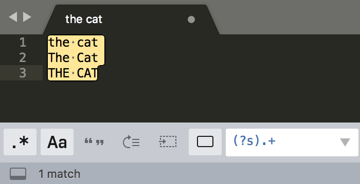

# 正则表达式

> 文章来源：[一个提高效率的工具，正则表达式，值得学习一下!](https://juejin.cn/post/6976271402349363236)

**正则表达式**，又称规则表达式，通常被用来检索、替换那些符合某个模式(规则)的文本。

许多程序设计语言都支持利用正则表达式进行字符串操作。例如，在Perl中就内建了一个功能强大的正则表达式引擎。

学会使用正则表达式可以极大提高我们文本处理效率，并且各大操作系统、编程语言、文本编辑器都已经支持正则表达式

## 元字符

一般普通字符表示的还是原来的意思，比如字符 e，而所谓元字符（Metacharacter）就是指那些在正则表达式中具有特殊意义的专用字符。

正则元字符可以分为：

- 特殊单字符
- 空白符
- 范围
- 量词
- 断言

### 特殊单字符

- `·` 任意字符（换行除外）
- `\d` 任意数字`\D` 任意非数字
- `\w` 任意字母数字下划线 `\W` 任意非字母数字下划线
- `\s` 任意空白符 `\S` 任意非空白符

### 空白符

- `\r` 回车符
- `\n` 换行符
- `\f` 换页符
- `\t` 制表符
- `\v` 垂直制表符
- `\s` 任意空白符

### 量词

`*` ：0到多次

`+` ：1到多次

`?` ：0到1次，如colou?r

`{m}` ：出现m次

`{m,}` ：出现至少m次

`{m,n}` ：m到n次

### 范围

`|` 或，如 ablbc 代表ab或bc

`[．．．]` 多选一，括号中任意单个元素

`[a-z]` 匹配a到z之间任意单个元素（按ASCII表，包含a，z）

`[^…]` 取反，不能是括号中的任意单个元素

## 贪婪、非贪婪与独占

正则有三种模式：贪婪匹配、非贪婪匹配和独占模式

- 贪婪匹配：在正则中，表示次数的量词默认是贪婪的，在贪婪模式下，会尝试尽可能最大长度去匹配。
- 非贪婪匹配：找出长度最小且满足要求的，量词后面要加上英文的问号(`?`)，正则就变成了 `a*?`。
- 独占模式：不管是贪婪模式，还是非贪婪模式，都需要发生回溯才能完成相应的功能。但是在一些场景下，我们不需要回溯，匹配不上返回失败就好了，因此正则中还有另外一种模式，独占模式，它类似贪婪匹配，但匹配过程不会发生**回溯**，因此在一些场合下性能会更好。

## 分组与引用

**举个例子：**

假设我们现在要去查找15位或18位数字。

根据前面学习的知识，使用量词可以表示出现次数，使用管道符号可以表示多个选择，你应该很快就能写出d{15}|d{18}。

但经过测试，你会发现，这个正则并不能很好地完成任务，因为18位数字也会匹配上前15位

没有匹配到18位的记录

**解决方式**

可以用括号括起来表示一个整体

**替换举例**

`((\d{4})-(\d{2})-(\d{2})) ((\d{2}):(\d{2}):(\d{2}))`

`日期$1 时间$5 $2年$3月$4日 $6时$7分$8秒`

## 匹配模式

常见的匹配模式有4种，分别是：

- 不区分大小写模式
- 点号通配模式
- 多行模式
- 注释模式

### 不区分大小写模式

**使用模式修饰符：**放在整个正则前面时，表示匹配模式

### 点号通配模式

点号它可以匹配上任何符号，但不能匹配换行，如何匹配真正的“任意”符号

### 多行匹配模式

多行模式的作用在于，使 `^` 和 `$` 能匹配上**每行**的开头或结尾，我们可以使用模式修饰符号 `(?m)` 来指定这个模式

### 注释模式

为正则添加注释

## 断言

断言是指对匹配到的文本位置有要求。

通过一些例子来讲解。

你应该知道 d{11} 能匹配上11位数字，但这11位数字可能是18位身份证号中的一部分。再比如，去查找一个单词，我们要查找 tom，但其它的单词，比如 tomorrow 中也包含了tom

### 单词边界

​	`\b` 匹配单词边界

### 行的开始/结束

- `^` 匹配行的开始
  *多行模式时，可以匹配任意行开头*
- `$` 匹配行的结束
  *多行模式时，可以匹配任意行结尾*
- `\A` 仅匹配整个字符串的开始
  *不支持多行模式*
- `\Z` 仅匹配整个字符串的结束
  *不支持多行模式*

### 环视

- `(?<=Y)X` 匹配前面是Y的X
- `(?<!Y)X` 匹配前面不是Y的X
- `X(?=Y)` 匹配后面是Y的X
- `X(?!Y)` 匹配后面不是Y的X

举例邮政编码的判断：6位数字，且左边不是数字，右边不是数字

# 常用正则表达式

> 文章来源：[正则表达式 - 常用正则表达式](https://www.pdai.tech/md/develop/regex/dev-regex-usage.html)

在学习了正则表达式知识点之后，通常使用正则表达式推荐你本文总结的常用的正则表达式，能覆盖80%的应用场景，如果没有通过可以工具自己写和校验。@pdai

## 校验字符的表达式

- 汉字：`^[\u4e00-\u9fa5]{0,}$`
- 英文和数字：`^[A-Za-z0-9]+$` 或 `^[A-Za-z0-9]{4,40}$`
- 长度为3-20的所有字符：`^.{3,20}$`
- 由26个英文字母组成的字符串：`^[A-Za-z]+$`
- 由26个大写英文字母组成的字符串：`^[A-Z]+$`
- 由26个小写英文字母组成的字符串：`^[a-z]+$`
- 由数字和26个英文字母组成的字符串：`^[A-Za-z0-9]+$`
- 由数字、26个英文字母或者下划线组成的字符串：`^\w+$ 或 ^\w{3,20}$`
- 中文、英文、数字包括下划线：`^[\u4E00-\u9FA5A-Za-z0-9_]+$`
- 中文、英文、数字但不包括下划线等符号：`^[\u4E00-\u9FA5A-Za-z0-9]+$` 或 `^[\u4E00-\u9FA5A-Za-z0-9]{2,20}$`
- 可以输入含有^%&',;=?$"等字符：`[^%&',;=?$\x22]+`
- 禁止输入含有~的字符：`[^~\x22]+`

## 特殊需求表达式

- Email地址：`^\w+([-+.]\w+)*@\w+([-.]\w+)*\.\w+([-.]\w+)*$`
- 域名：`[a-zA-Z0-9][-a-zA-Z0-9]{0,62}(\.[a-zA-Z0-9][-a-zA-Z0-9]{0,62})+\.?`
- InternetURL：`[a-zA-z]+://[^\s]*` 或 `^http://([\w-]+\.)+[\w-]+(/[\w-./?%&=]*)?$`
- 手机号码：`^(13[0-9]|14[5|7]|15[0|1|2|3|4|5|6|7|8|9]|18[0|1|2|3|5|6|7|8|9])\d{8}$`
- 电话号码("XXX-XXXXXXX"、"XXXX-XXXXXXXX"、"XXX-XXXXXXX"、"XXX-XXXXXXXX"、"XXXXXXX"和"XXXXXXXX)：`^(\(\d{3,4}-)|\d{3.4}-)?\d{7,8}$`
- 国内电话号码(0511-4405222、021-87888822)：`\d{3}-\d{8}|\d{4}-\d{7}`
- 电话号码正则表达式（支持手机号码，3-4位区号，7-8位直播号码，1－4位分机号）: `((\d{11})|^((\d{7,8})|(\d{4}|\d{3})-(\d{7,8})|(\d{4}|\d{3})-(\d{7,8})-(\d{4}|\d{3}|\d{2}|\d{1})|(\d{7,8})-(\d{4}|\d{3}|\d{2}|\d{1}))$)`
- 身份证号(15位、18位数字)，最后一位是校验位，可能为数字或字符X：`(^\d{15}$)|(^\d{18}$)|(^\d{17}(\d|X|x)$)`
- 帐号是否合法(字母开头，允许5-16字节，允许字母数字下划线)：`^[a-zA-Z][a-zA-Z0-9_]{4,15}$`
- 密码(以字母开头，长度在6~18之间，只能包含字母、数字和下划线)：`^[a-zA-Z]\w{5,17}$`
- 强密码(必须包含大小写字母和数字的组合，不能使用特殊字符，长度在 8-10 之间)：`^(?=.*\d)(?=.*[a-z])(?=.*[A-Z])[a-zA-Z0-9]{8,10}$`
- 强密码(必须包含大小写字母和数字的组合，可以使用特殊字符，长度在8-10之间)：`^(?=.*\d)(?=.*[a-z])(?=.*[A-Z]).{8,10}$`
- 日期格式：`^\d{4}-\d{1,2}-\d{1,2}`
- 一年的12个月(01～09和1～12)：`^(0?[1-9]|1[0-2])$`
- 一个月的31天(01～09和1～31)：`^((0?[1-9])|((1|2)[0-9])|30|31)$`
- 钱的输入格式：
  - 有四种钱的表示形式我们可以接受:"10000.00" 和 "10,000.00", 和没有 "分" 的 "10000" 和 "10,000"：`^[1-9][0-9]*$`
  - 这表示任意一个不以0开头的数字,但是,这也意味着一个字符"0"不通过,所以我们采用下面的形式：`^(0|[1-9][0-9]*)$`
  - 一个0或者一个不以0开头的数字.我们还可以允许开头有一个负号：`^(0|-?[1-9][0-9]*)$`
  - 这表示一个0或者一个可能为负的开头不为0的数字.让用户以0开头好了.把负号的也去掉,因为钱总不能是负的吧。下面我们要加的是说明可能的小数部分：`^[0-9]+(.[0-9]+)?$`
  - 必须说明的是,小数点后面至少应该有1位数,所以"10."是不通过的,但是 "10" 和 "10.2" 是通过的：`^[0-9]+(.[0-9]{2})?$`
  - 这样我们规定小数点后面必须有两位,如果你认为太苛刻了,可以这样：`^[0-9]+(.[0-9]{1,2})?$`
  - 这样就允许用户只写一位小数.下面我们该考虑数字中的逗号了,我们可以这样：`^[0-9]{1,3}(,[0-9]{3})*(.[0-9]{1,2})?$`
  - 1到3个数字,后面跟着任意个 逗号+3个数字,逗号成为可选,而不是必须：`^([0-9]+|[0-9]{1,3}(,[0-9]{3})*)(.[0-9]{1,2})?$`
  - 备注：这就是最终结果了,别忘了"+"可以用"*"替代如果你觉得空字符串也可以接受的话(奇怪,为什么?)最后,别忘了在用函数时去掉去掉那个反斜杠,一般的错误都在这里
- xml文件：`^([a-zA-Z]+-?)+[a-zA-Z0-9]+\\.[x|X][m|M][l|L]$`
- 中文字符的正则表达式：`[\u4e00-\u9fa5]`
- 双字节字符：`[^\x00-\xff]` (包括汉字在内，可以用来计算字符串的长度(一个双字节字符长度计2，ASCII字符计1))
- 空白行的正则表达式：`\n\s*\r` (可以用来删除空白行)
- HTML标记的正则表达式：`<(\S*?)[^>]*>.*?|<.*? />` ( 首尾空白字符的正则表达式：`^\s*|\s*$`或`(^\s*)|(\s*$)` (可以用来删除行首行尾的空白字符(包括空格、制表符、换页符等等)，非常有用的表达式)
- 腾讯QQ号：`[1-9][0-9]{4,}` (腾讯QQ号从10000开始)
- 中国邮政编码：`[1-9]\d{5}(?!\d)` (中国邮政编码为6位数字)
- IP地址：`((?:(?:25[0-5]|2[0-4]\\d|[01]?\\d?\\d)\\.){3}(?:25[0-5]|2[0-4]\\d|[01]?\\d?\\d))`
