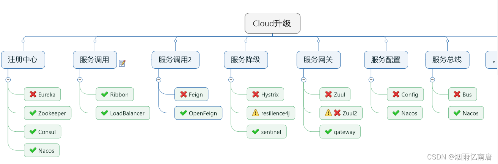

# 服务描述

开发web服务最古老的方式是先开发web应用，然后添加web服务作为一种备用的接口。

> 来源：《互联网创业核心技术-构建可伸缩的web应用》

## Web服务类型

### 以功能为中心的服务

曾经有很多以功能为中心的技术，不过这么多年过去了，SOAP（简单对象访问协议）一支独秀，部分源于几家最大的科技公司的支持，比如微软、IBM。

SOAP最常见的实现方案是使用XML作为描述和消息编码的方式，通过HTTP在客户端和服务器之间传递请求和响应。SOAP最重要的一个特性是允许web服务基于自身的约定描述完成服务发现并生成集成代码。

Web服务提供者暴露一组 XML资源，诸如Web服务定义语言( WSDL)文件、XML模式定义(XSD)文件、WSDL描述方法与可用的终端信息，XSD描述请求与响应中用到的数据结构。这些资源文件就是Web服务的约定，客户端代码如何生成，Web服务如何调用，这些必要的信息全部都在这些资源文件中。举个例子，如果你用Java开发，那么你可以用专门的工具和库下载资源文件，然后生成Java本地客户端代码。这些代码就是一些 Java类，可以被编译并用在应用程序中。在这些代码的背后，会依赖到SOAP相关的一些库， 封装了数据序列化、身份认证、路由、错误处理等各种实现细节。客户端代码无须知道自己调用的是远程Web服务，只需要简单依赖基于Web服务约定( WSDL和XSD文件)生成的Java库就可以了。

但是动态语言如：php、python等和SOAP web 服务集成会比较困难。所以web需要一种SOAP的替代技术，可以更容易的集成，更方便的实现。这就使得JSON—基于REST风格的服务流行起来。

> SOAP已经不再是Web服务开发的主流技术，开发的复杂性和维护的工作量相当大。

### 以资源为中心的服务

开发Web服务的一个替代方案就是将服务的关注点从功能转移到资源上。以功能为中心的Web服务，每个功能都需要若干个参数，产生若干个结果值;以资源为中心的Web服务，每个资源都代表一类对象， 这些对象上面只能执行有限的操作(可以创建、删除、更新、获取资源)。资源的模型可以是任意的，但是和资源的交互是标准的。

REST是一个面向资源架构风格的方案，早在2000年初就已经提出来。此后，由于其简单性和轻量级的开发模型，逐渐变成Web应用集成事实上的标准。

**REST：表征状态转移**（Representational State Transfer），采用Web 服务使用标准的 HTTP 方法 (GET/PUT/POST/DELETE) 将所有 Web 系统的服务抽象为资源，REST从资源的角度来观察整个网络，分布在各处的资源由URI确定，而客户端的应用通过URI来获取资源的表征。Http协议所抽象的get,post,put,delete就好比数据库中最基本的增删改查，而互联网上的各种资源就好比数据库中的记录（可能这么比喻不是很好），对于各种资源的操作最后总是能抽象成为这四种基本操作，在定义了定位资源的规则以后，对于资源的操作通过标准的Http协议就可以实现，开发者也会受益于这种轻量级的协议。REST是一种软件架构风格而非协议也非规范，是一种针对网络应用的开发方式，可以降低开发的复杂性，提高系统的可伸缩性。

REST 是一种强制的客户端/服务端架构设计模型，客户端基于服务端管理的一系列资源操作。服务端提供修改或获取资源的接口。所有的通信必须是无状态和可缓存的。REST 关注于暴露数据。它减少了客户端／服务端的耦合程度，经常用于公共 HTTP API 接口设计。REST 使用更通常与规范化的方法来通过 URI 暴露资源，通过 header 来表述并通过 GET、POST、PUT、DELETE 和 PATCH 这些动作来进行操作。因为无状态的特性，REST 易于横向扩展和隔离。

RESTful 接口有四条规则：

- 标志资源（HTTP 里的 URI） ── 无论什么操作都使用同一个URI。
- 表示的改变（HTTP 的动作） ── 使用动作, headers 和body。
- 可自我描述的错误信息（HTTP 中的 status code）──使用状态码，不要重新造轮子。
- HATEOAS（HTTP 中的HTML 接口） ── 你的 web 服务器应该能够通过浏览器访问。

REST 的基本思想是**面向资源**来抽象问题，它与此前流行的编程思想——**面向过程的编程**在抽象主体上有本质的差别。在 REST 提出以前，人们设计分布式系统服务的唯一方案就只有 RPC，RPC 是将本地的方法调用思路迁移到远程方法调用上，开发者是围绕着“远程方法”去设计两个系统间交互的，譬如 CORBA、RMI、DCOM，等等。这样做的坏处不仅是“如何在异构系统间表示一个方法”、“如何获得接口能够提供的方法清单”都成了需要专门协议去解决的问题（RPC 的三大基本问题之一），更在于服务的每个方法都是完全独立的，服务使用者必须逐个学习才能正确地使用它们。

面向资源的编程思想与另外两种主流编程思想只是抽象问题时所处的立场不同，只有选择问题，没有高下之分：

- 面向过程编程时，为什么要以算法和处理过程为中心，输入数据，输出结果？当然是为了符合计算机世界中主流的交互方式。
- 面向对象编程时，为什么要将数据和行为统一起来、封装成对象？当然是为了符合现实世界的主流的交互方式。
- 面向资源编程时，为什么要将数据（资源）作为抽象的主体，把行为看作是统一的接口？当然是为了符合网络世界的主流的交互方式。

# 服务架构演进史

架构并不是被发明出来的，而是持续演进的结果，本章我们暂且放下代码与技术，借讨论历史之名，来梳理软件架构发展历程中出现过的名词术语，以全局的视角，从这些概念的起源去分析它们是什么、它们取代了什么，以及它们为什么能够在竞争中取得成功，为什么变得不可或缺，又或者它们为什么会失败，在斗争中被淘汰，逐渐湮灭于历史的烟尘当中。

> 来源：[《凤凰架构》——周志明](https://icyfenix.cn/architecture/architect-history/)

## 原始分布式时代

可能与绝大多数人心中的认知会有差异，“使用多个独立的分布式服务共同构建一个更大型系统”的设想与实际尝试，反而要比今天大家所了解的大型单体系统出现的时间更早。

在 20 世纪 70 年代末期到 80 年代初，计算机科学刚经历了从以大型机为主向以微型机为主的蜕变，计算机逐渐从一种存在于研究机构、实验室当中的科研设备，转变为存在于商业企业中的生产设备，甚至是面向家庭、个人用户的娱乐设备。此时的微型计算机系统通常具有 16 位寻址能力、不足 5MHz 时钟频率的处理器和 128KB 左右的内存地址空间。譬如著名的英特尔处理器的鼻祖，[Intel 8086 处理器](https://zh.wikipedia.org/zh-tw/Intel_8086)就是在 1978 年研制成功，流行于 80 年代中期，甚至一直持续到 90 年代初期仍有生产销售。

当时计算机硬件局促的运算处理能力，已直接妨碍到了在单台计算机上信息系统软件能够达到的最大规模。为突破硬件算力的限制，各个高校、研究机构、软硬件厂商开始分头探索，寻找使用多台计算机共同协作来支撑同一套软件系统运行的可行方案。这一阶段是对分布式架构最原始的探索，从结果来看，历史局限决定了它不可能一蹴而就地解决分布式的难题，但仅从过程来看，这个阶段的探索称得上成绩斐然。研究过程的很多中间成果都对今天计算机科学的诸多领域产生了深远的影响，直接牵引了后续软件架构的演化进程。譬如，惠普公司（及后来被惠普收购的 Apollo）提出的[网络运算架构](https://en.wikipedia.org/wiki/Network_Computing_System)（Network Computing Architecture，NCA）是未来远程服务调用的雏形；卡内基·梅隆大学提出的[AFS 文件系统](https://en.wikipedia.org/wiki/Andrew_File_System)（Andrew File System）是日后分布式文件系统的最早实现（Andrew 意为纪念 Andrew Carnegie 和 Andrew Mellon）；麻省理工学院提出的[Kerberos 协议](https://en.wikipedia.org/wiki/Kerberos_(protocol))是服务认证和访问控制的基础性协议，是分布式服务安全性的重要支撑，目前仍被用于实现包括 Windows 和 MacOS 在内众多操作系统的登录、认证功能，等等。

将一个系统拆分到不同的机器中运行，这样做带来的服务发现、跟踪、通信、容错、隔离、配置、传输、数据一致性和编码复杂度等方面的问题，所付出的代价远远超过了分布式所取得的收益。亲身经历过那个年代的计算机科学家、IBM 院士 Kyle Brown 事后曾评价道：“这次尝试最大的收获就是对 RPC、DFS 等概念的开创，以及得到了一个价值千金的教训：**某个功能能够进行分布式，并不意味着它就应该进行分布式，强行追求透明的分布式操作，只会自寻苦果。**”

20 世纪 80 年代正是[摩尔定律](https://zh.wikipedia.org/wiki/摩尔定律)开始稳定发挥作用的黄金时期，微型计算机的性能以每两年即增长一倍的惊人速度提升，硬件算力束缚软件规模的链条很快变得松动，信息系统进入了以单台或少量几台计算机即可作为服务器来支撑大型信息系统运作的单体时代，且在很长的一段时间内，单体都将是软件架构的绝对主流。尽管如此，对于另外一条路径，即对分布式计算、远程服务调用的探索也从未有过中断。关于远程服务调用这个关键问题的历史、发展与现状，笔者还会在稍后的“[远程服务调用](https://icyfenix.cn/architect-perspective/general-architecture/api-style/rpc.html)”中，以现代 RPC 和 RESTful 为主角来进行更详细的讲述。那些在原始分布式时代中遭遇到的各种分布式问题，也还会在软件架构演进后面几个时代里被人们反复提起。

## 单体系统时代

> **单体架构**（Monolithic）
> 
> “单体”只是表明系统中主要的过程调用都是进程内调用，不会发生进程间通信，仅此而已。

单体架构是今天绝大多数软件开发者都学习、实践过的一种软件架构，许多介绍微服务的书籍和技术资料中也常把这种架构风格的应用称作“[巨石系统](https://en.wikipedia.org/wiki/Monolithic_application)”（Monolithic Application）。“单体架构”在整个软件架构演进的历史进程里，是出现时间最早、应用范围最广、使用人数最多、统治历史最长的一种架构风格，但“单体”这个名称，却是在微服务开始流行之后才“事后追认”所形成的概念。此前，并没有多少人将“单体”视作一种架构来看待，如果你去查找软件架构的开发资料，可以轻而易举地找出大量以微服务为主题的书籍和文章，却很难找出专门教你如何开发单体系统的任何形式的材料，这一方面体现了单体架构本身的简单性，另一方面，也体现出在相当长的时间尺度里，大家都已经习惯了软件架构就应该是单体这种样子。

在“拆分”这方面，单体系统的真正缺陷不在如何拆分，而在拆分之后的隔离与自治能力上的欠缺。由于所有代码都运行在同一个进程空间之内，所有模块、方法的调用都无须考虑网络分区、对象复制这些麻烦的事和性能损失。获得了进程内调用的简单、高效等好处的同时，也意味着如果任何一部分代码出现了缺陷，过度消耗了进程空间内的资源，所造成的影响也是全局性的、难以隔离的。譬如内存泄漏、线程爆炸、阻塞、死循环等问题，都将会影响整个程序，而不仅仅是影响某一个功能、模块本身的正常运作。如果消耗的是某些更高层次的公共资源，譬如端口号或者数据库连接池泄漏，影响还将会波及整台机器，甚至是集群中其他单体副本的正常工作。

同样，由于所有代码都共享着同一个进程空间，不能隔离，也就无法（其实还是有办法的，譬如使用 OSGi 这种运行时模块化框架，但是很别扭、很复杂）做到单独停止、更新、升级某一部分代码，因为不可能有“停掉半个进程，重启 1/4 个程序”这样不合逻辑的操作，所以从可维护性来说，单体系统也是不占优势的。程序升级、修改缺陷往往需要制定专门的停机更新计划，做灰度发布、A/B 测试也相对更复杂。

由于隔离能力的缺失，单体除了难以阻断错误传播、不便于动态更新程序以外，还面临难以技术异构的困难，每个模块的代码都通常需要使用一样的程序语言，乃至一样的编程框架去开发。单体系统的技术栈异构并非一定做不到，譬如 JNI 就可以让 Java 混用 C 或 C++，但这通常是迫不得已的，并不是优雅的选择。

不过，以上列举的这些问题都还不是今天以微服务取代单体系统成为潮流趋势的根本原因，笔者认为最重要的理由是：单体系统很难兼容“[Phoenix](https://icyfenix.cn/introduction/about-the-fenix-project.html#架构的演进)”的特性。这种架构风格潜在的观念是希望系统的每一个部件，每一处代码都尽量可靠，靠不出或少出缺陷来构建可靠系统。然而战术层面再优秀，也很难弥补战略层面的不足，单体靠高质量来保证高可靠性的思路，在小规模软件上还能运作良好，但系统规模越大，交付一个可靠的单体系统就变得越来越具有挑战性。如本书的前言开篇《[什么是"凤凰架构"](https://icyfenix.cn/introduction/about-the-fenix-project.html)》所说，正是随着软件架构演进，构筑可靠系统从“追求尽量不出错”，到正视“出错是必然”的观念转变，才是微服务架构得以挑战并逐步开始取代运作了数十年的单体架构的底气所在。

为了允许程序出错，为了获得隔离、自治的能力，为了可以技术异构等目标，是继为了性能与算力之后，让程序再次选择分布式的理由。然而，开发分布式程序也并不意味着一定要依靠今天的微服务架构才能实现。在新旧世纪之交，人们曾经探索过几种服务拆分方法，将一个大的单体系统拆分为若干个更小的、不运行在同一个进程的独立服务，这些服务拆分方法后来导致了[面向服务架构](https://en.wikipedia.org/wiki/Service-oriented_architecture)（Service-Oriented Architecture）的一段兴盛期，我们称其为“[SOA 时代](https://icyfenix.cn/architecture/architect-history/soa.html)”。

## SOA 时代

> **SOA 架构**（Service-Oriented Architecture）
> 
> 面向服务的架构是一次具体地、系统性地成功解决分布式服务主要问题的架构模式。

为了对大型的单体系统进行拆分，让每一个子系统都能独立地部署、运行、更新，开发者们曾经尝试过多种方案，这里列举以下三种较有代表性的架构模式，具体如下：

- [烟囱式架构](https://en.wikipedia.org/wiki/Information_silo)（Information Silo Architecture）：信息烟囱又名信息孤岛（Information Island），使用这种架构的系统也被称为孤岛式信息系统或者烟囱式信息系统。它指的是一种完全不与其他相关信息系统进行互操作或者协调工作的设计模式。
- [微内核架构](https://en.wikipedia.org/wiki/Microkernel)（Microkernel Architecture）：微内核架构也被称为插件式架构（Plug-in Architecture）。既然在烟囱式架构中，没有业务往来关系的系统也可能需要共享人员、组织、权限等一些的公共的主数据，那不妨就将这些主数据，连同其他可能被各子系统使用到的公共服务、数据、资源集中到一块，成为一个被所有业务系统共同依赖的核心（Kernel，也称为 Core System），具体的业务系统以插件模块（Plug-in Modules）的形式存在，这样也可提供可扩展的、灵活的、天然隔离的功能特性，即微内核架构。
- [事件驱动架构](https://en.wikipedia.org/wiki/Event-driven_architecture)（Event-Driven Architecture）：为了能让子系统互相通信，一种可行的方案是在子系统之间建立一套事件队列管道（Event Queues），来自系统外部的消息将以事件的形式发送至管道中，各个子系统从管道里获取自己感兴趣、能够处理的事件消息，也可以为事件新增或者修改其中的附加信息，甚至可以自己发布一些新的事件到管道队列中去，如此，每一个消息的处理者都是独立的，高度解耦的，但又能与其他处理者（如果存在该消息处理者的话）通过事件管道进行互动。

当系统演化至事件驱动架构时，仍在并行发展的远程服务调用也迎来了 SOAP 协议的诞生。

SOA 的概念最早由 Gartner 公司在 1994 年提出，当时的 SOA 还不具备发展的条件，直至 2006 年情况才有所变化，由 IBM、Oracle、SAP 等公司共同成立了 OSOA 联盟（Open Service Oriented Architecture），用于联合制定和推进 SOA 相关行业标准。

软件架构来到 SOA 时代，许多概念、思想都已经能在今天微服务中找到对应的身影了，譬如服务之间的松散耦合、注册、发现、治理，隔离、编排，等等。这些在今天微服务中耳熟能详的名词概念，大多数也是在分布式服务刚被提出时就已经可以预见的困难点。SOA 针对这些问题，甚至是针对“软件开发”这件事情本身，都进行了更加系统性、更加具体的探索。

SOA 在 21 世纪最初的十年里曾经盛行一时，有 IBM 等一众行业巨头厂商为其呐喊冲锋，吸引了不少软件开发商、尤其是企业级软件的开发商的跟随，最终却还是偃旗息鼓，沉寂了下去。在稍后的[远程服务调用](https://icyfenix.cn/architect-perspective/general-architecture/api-style/rpc.html)一节，笔者会提到 SOAP 协议被逐渐边缘化的本质原因：过于严格的规范定义带来过度的复杂性。而构建在 SOAP 基础之上的 **ESB**、BPM、SCA、SDO 等诸多上层建筑，进一步加剧了这种复杂性。开发信息系统毕竟不是作八股文章，过于精密的流程和理论也需要懂得复杂概念的专业人员才能够驾驭。SOA 诞生的那一天起，就已经注定了它只能是少数系统阳春白雪式的精致奢侈品，它可以实现多个异构大型系统之间的复杂集成交互，却很难作为一种具有广泛普适性的软件架构风格来推广。SOA 最终没有获得成功的致命伤与当年的[EJB](https://zh.wikipedia.org/wiki/EJB)如出一辙，尽管有 Sun Microsystems 和 IBM 等一众巨头在背后力挺，EJB 仍然败于以 Spring、Hibernate 为代表的“草根框架”，可见一旦脱离人民群众，终究会淹没在群众的海洋之中，连信息技术也不曾例外过。

## 微服务时代

> **微服务架构**（Microservices）
> 
> 微服务是一种通过多个小型服务组合来构建单个应用的架构风格，这些服务围绕业务能力而非特定的技术标准来构建。各个服务可以采用不同的编程语言，不同的数据存储技术，运行在不同的进程之中。服务采取轻量级的通信机制和自动化的部署机制实现通信与运维。

- **围绕业务能力构建**（Organized around Business Capability）。这里再次强调了康威定律的重要性，有怎样结构、规模、能力的团队，就会产生出对应结构、规模、能力的产品。这个结论不是某个团队、某个公司遇到的巧合，而是必然的演化结果。如果本应该归属同一个产品内的功能被划分在不同团队中，必然会产生大量的跨团队沟通协作，跨越团队边界无论在管理、沟通、工作安排上都有更高昂的成本，高效的团队自然会针对其进行改进，当团队、产品磨合调节稳定之后，团队与产品就会拥有一致的结构。
- **分散治理**（Decentralized Governance）。这是要表达“谁家孩子谁来管”的意思，服务对应的开发团队有直接对服务运行质量负责的责任，也应该有着不受外界干预地掌控服务各个方面的权力，譬如选择与其他服务异构的技术来实现自己的服务。这一点在真正实践时多少存有宽松的处理余地，大多数公司都不会在某一个服务使用 Java，另一个用 Python，下一个用 Golang，而是通常会有统一的主流语言，乃至统一的技术栈或专有的技术平台。微服务不提倡也并不反对这种“统一”，只要负责提供和维护基础技术栈的团队，有被各方依赖的觉悟，要有“经常被凌晨 3 点的闹钟吵醒”的心理准备就好。微服务更加强调的是确实有必要技术异构时，应能够有选择“不统一”的权利，譬如不应该强迫 Node.js 去开发报表页面，要做人工智能训练模型时，应该可以选择 Python，等等。
- **通过服务来实现独立自治的组件**（Componentization via Services）。之所以强调通过“服务”（Service）而不是“类库”（Library）来构建组件，是因为类库在编译期静态链接到程序中，通过本地调用来提供功能，而服务是进程外组件，通过远程调用来提供功能。前面的文章里我们已经分析过，尽管远程服务有更高昂的调用成本，但这是为组件带来隔离与自治能力的必要代价。
- **产品化思维**（Products not Projects）。避免把软件研发视作要去完成某种功能，而是视作一种持续改进、提升的过程。譬如，不应该把运维只看作运维团队的事，把开发只看作开发团队的事，团队应该为软件产品的整个生命周期负责，开发者不仅应该知道软件如何开发，还应该知道它如何运作，用户如何反馈，乃至售后支持工作是怎样进行的。注意，这里服务的用户不一定是最终用户，也可能是消费这个服务的另外一个服务。以前在单体架构下，程序的规模决定了无法让全部人员都关注完整的产品，组织中会有开发、运维、支持等细致的分工的成员，各人只关注于自己的一块工作，但在微服务下，要求开发团队中每个人都具有产品化思维，关心整个产品的全部方面是具有可行性的。
- **数据去中心化**（Decentralized Data Management）。微服务明确地提倡数据应该按领域分散管理、更新、维护、存储，在单体服务中，一个系统的各个功能模块通常会使用同一个数据库，诚然中心化的存储天生就更容易避免一致性问题，但是，同一个数据实体在不同服务的视角里，它的抽象形态往往也是不同的。譬如，Bookstore 应用中的书本，在销售领域中关注的是价格，在仓储领域中关注的库存数量，在商品展示领域中关注的是书籍的介绍信息，如果作为中心化的存储，所有领域都必须修改和映射到同一个实体之中，这便使得不同的服务很可能会互相产生影响而丧失掉独立性。尽管在分布式中要处理好一致性的问题也相当困难，很多时候都没法使用传统的事务处理来保证，但是两害相权取其轻，有一些必要的代价仍是值得付出的。
- **强终端弱管道**（Smart Endpoint and Dumb Pipe）。弱管道（Dumb Pipe）几乎算是直接指名道姓地反对 SOAP 和 ESB 的那一堆复杂的通信机制。ESB 可以处理消息的编码加工、业务规则转换等；BPM 可以集中编排企业业务服务；SOAP 有几十个 WS-*协议族在处理事务、一致性、认证授权等一系列工作，这些构筑在通信管道上的功能也许对某个系统中的某一部分服务是有必要的，但对于另外更多的服务则是强加进来的负担。如果服务需要上面的额外通信能力，就应该在服务自己的 Endpoint 上解决，而不是在通信管道上一揽子处理。微服务提倡类似于经典 UNIX 过滤器那样简单直接的通信方式，RESTful 风格的通信在微服务中会是更加合适的选择。
- **容错性设计**（Design for Failure）。不再虚幻地追求服务永远稳定，而是接受服务总会出错的现实，要求在微服务的设计中，有自动的机制对其依赖的服务能够进行快速故障检测，在持续出错的时候进行隔离，在服务恢复的时候重新联通。所以“断路器”这类设施，对实际生产环境的微服务来说并不是可选的外围组件，而是一个必须的支撑点，如果没有容错性的设计，系统很容易就会被因为一两个服务的崩溃所带来的雪崩效应淹没。可靠系统完全可能由会出错的服务组成，这是微服务最大的价值所在，也是这部开源文档标题“凤凰架构”的含义。
- **演进式设计**（Evolutionary Design）。容错性设计承认服务会出错，演进式设计则是承认服务会被报废淘汰。一个设计良好的服务，应该是能够报废的，而不是期望得到长存永生。假如系统中出现不可更改、无可替代的服务，这并不能说明这个服务是多么的优秀、多么的重要，反而是一种系统设计上脆弱的表现，微服务所追求的独立、自治，也是反对这种脆弱性的表现。
- **基础设施自动化**（Infrastructure Automation）。基础设施自动化，如 CI/CD 的长足发展，显著减少了构建、发布、运维工作的复杂性。由于微服务下运维的对象比起单体架构要有数量级的增长，使用微服务的团队更加依赖于基础设施的自动化，人工是很难支撑成百上千乃至成千上万级别的服务的。

《Microservices》一文中对微服务特征的描写已经相当具体了，文中除了定义微服务是什么，还专门申明了微服务不是什么——微服务不是 SOA 的变体或衍生品，应该明确地与 SOA 划清了界线，不再贴上任何 SOA 的标签。

从以上微服务的定义和特征中，你应该可以明显地感觉到微服务追求的是更加自由的架构风格，摒弃了几乎所有 SOA 里可以抛弃的约束和规定，提倡以“实践标准”代替“规范标准”。可是，如果没有了统一的规范和约束，以前 SOA 所解决的那些分布式服务的问题，不也就一下子都重新出现了吗？的确如此，服务的注册发现、跟踪治理、负载均衡、故障隔离、认证授权、伸缩扩展、传输通信、事务处理，等等，这些问题，在微服务中不再会有统一的解决方案，即使只讨论 Java 范围内会使用到的微服务，光一个服务间远程调用问题，可以列入解决方案的候选清单的就有：*RMI（Sun/Oracle）、Thrift（Facebook）、Dubbo（阿里巴巴）、gRPC（Google）、Motan2（新浪）、Finagle（Twitter）、brpc（百度）、Arvo（Hadoop）、JSON-RPC、REST*，等等；光一个服务发现问题，可以选择的就有：*Eureka（Netflix）、Consul（HashiCorp）、Nacos（阿里巴巴）、ZooKeeper（Apache）、Etcd（CoreOS）、CoreDNS（CNCF）*，等等。其他领域的情况也是与此类似，总之，完全是八仙过海，各显神通的局面。

微服务所带来的自由是一把双刃开锋的宝剑，当软件架构者拿起这把宝剑，一刃指向 SOA 定下的复杂技术标准，将选择的权力夺回的同一时刻，另外一刃也正朝向着自己映出冷冷的寒光。微服务时代中，软件研发本身的复杂度应该说是有所降低。一个简单服务，并不见得就会同时面临分布式中所有的问题，也就没有必要背上 SOA 那百宝袋般沉重的技术包袱。需要解决什么问题，就引入什么工具；团队熟悉什么技术，就使用什么框架。

## 后微服务时代

> **后微服务时代**（Cloud Native）
> 
> 从软件层面独力应对微服务架构问题，发展到软、硬一体，合力应对架构问题的时代，此即为“后微服务时代”。

上节提到的分布式架构中出现的问题，如注册发现、跟踪治理、负载均衡、传输通信等，其实在 SOA 时代甚至可以说从原始分布式时代起就已经存在了，只要是分布式架构的系统，就无法完全避免，但我们不妨换个思路来想一下，这些问题一定要由软件系统自己来解决吗？

如果不局限于采用软件的方式，这些问题几乎都有对应的硬件解决方案。譬如，某个系统需要伸缩扩容，通常会购买新的服务器，部署若干副本实例来分担压力；如果某个系统需要解决负载均衡问题，通常会布置负载均衡器，选择恰当的均衡算法来分流；如果需要解决传输安全问题，通常会布置 TLS 传输链路，配置好 CA 证书以保证通信不被窃听篡改；如果需要解决服务发现问题，通常会设置 DNS 服务器，让服务访问依赖稳定的记录名而不是易变的 IP 地址，等等。经过计算机科学多年的发展，这些问题大多有了专职化的基础设施去解决，而之所以微服务时代，人们选择在软件的代码层面而不是硬件的基础设施层面去解决这些分布式问题，很大程度上是因为由硬件构成的基础设施，跟不上由软件构成的应用服务的灵活性的无奈之举。软件可以只使用键盘命令就能拆分出不同的服务，只通过拷贝、启动就能够伸缩扩容服务，硬件难道就不可以通过敲键盘就变出相应的应用服务器、负载均衡器、DNS 服务器、网络链路这些设施吗？

行文至此，估计大家已经听出下面要说的是[虚拟化](https://en.wikipedia.org/wiki/Virtualization)技术和[容器化](https://en.wikipedia.org/wiki/OS-level_virtualization)技术了。微服务时代所取得的成就，本身就离不开以 Docker 为代表的早期容器化技术的巨大贡献。在此之前，笔者从来没有提起过“容器”二字，这并不是刻意冷落，而是早期的容器只被简单地视为一种可快速启动的服务运行环境，目的是方便程序的分发部署，这个阶段针对单个应用进行封装的容器并未真正参与到分布式问题的解决之中。尽管 2014 年微服务开始崛起的时候，Docker Swarm（2013 年）和 Apache Mesos（2012 年）就已经存在，更早之前也出现了[软件定义网络](https://en.wikipedia.org/wiki/Software-defined_networking)（Software-Defined Networking，SDN）、[软件定义存储](https://en.wikipedia.org/wiki/Software-defined_storage)（Software-Defined Storage，SDS）等技术，但是，被业界广泛认可、普遍采用的通过虚拟化基础设施去解决分布式架构问题的开端，应该要从 2017 年 Kubernetes 赢得容器战争的胜利开始算起。

2017 年是容器生态发展历史中具有里程碑意义的一年。在这一年，长期作为 Docker 竞争对手的[RKT 容器](https://coreos.com/rkt/docs/latest/)一派的领导者 CoreOS 宣布放弃自己的容器管理系统 Fleet，未来将会把所有容器管理的功能移至 Kubernetes 之上去实现。在这一年，容器管理领域的独角兽 Rancher Labs 宣布放弃其内置了数年的容器管理系统 Cattle，提出了“All-in-Kubernetes”战略，把 1.x 版本时就能够支持多种容器编排系统的管理工具 Rancher，从 2.0 版本开始“反向升级”为完全绑定于 Kubernetes 这单一种系统。在这一年，Kubernetes 的主要竞争者 Apache Mesos 在 9 月正式宣布了“[Kubernetes on Mesos](https://k8smeetup.github.io/docs/getting-started-guides/mesos/)”集成计划，由竞争关系转为对 Kubernetes 提供支持，使其能够与 Mesos 的其他一级框架（如[HDFS](https://docs.mesosphere.com/latest/usage/service-guides/hdfs/)、[Spark](https://docs.mesosphere.com/latest/usage/service-guides/spark/) 和[Chronos](https://mesos.github.io/chronos/docs/getting-started.html)等）进行集群资源动态共享、分配与隔离。在这一年，Kubernetes 的最大竞争者 Docker Swarm 的母公司 Docker，终于在 10 月被迫宣布 Docker 要同时支持 Swarm 与 Kubernetes 两套容器管理系统，也即在事实上承认了 Kubernetes 的统治地位。这场已经持续了三、四年时间，以 Docker Swarm、Apache Mesos 与 Kubernetes 为主要竞争者的“容器编排战争”终于有了明确的结果，Kubernetes 登基加冕是容器发展中一个时代的终章，也将是软件架构发展下一个纪元的开端。笔者在表 1-1 列出了在同一个分布式服务的问题在传统 Spring Cloud 中提供的应用层面的解决方案与在 Kubernetes 中提供的基础设施层面的解决方案，尽管因为各自出发点不同，解决问题的方法和效果都有所差异，但这无疑是提供了一条全新的、前途更加广阔的解题思路。

表 1-1 传统 Spring Cloud 与 Kubernetes 提供的解决方案对比

|      | Kubernetes              | Spring Cloud          |
| ---- | ----------------------- | --------------------- |
| 弹性伸缩 | Autoscaling             | N/A                   |
| 服务发现 | KubeDNS / CoreDNS       | Spring Cloud Eureka   |
| 配置中心 | ConfigMap / Secret      | Spring Cloud Config   |
| 服务网关 | Ingress Controller      | Spring Cloud Zuul     |
| 负载均衡 | Load Balancer           | Spring Cloud Ribbon   |
| 服务安全 | RBAC API                | Spring Cloud Security |
| 跟踪监控 | Metrics API / Dashboard | Spring Cloud Turbine  |
| 降级熔断 | N/A                     | Spring Cloud Hystrix  |

“前途广阔”不仅仅是一句恭维赞赏的客气话，当虚拟化的基础设施从单个服务的容器扩展至由多个容器构成的服务集群、通信网络和存储设施时，软件与硬件的界限便已经模糊。一旦虚拟化的硬件能够跟上软件的灵活性，那些与业务无关的技术性问题便有可能从软件层面剥离，悄无声息地解决于硬件基础设施之内，让软件得以只专注业务，真正“围绕业务能力构建”团队与产品。

现在常被媒体冠以“云原生”这个颇为抽象的名字加以宣传。**云原生时代**与此前微服务时代中追求的目标并没有本质改变，在服务架构演进的历史进程中，笔者更愿意称其为“后微服务时代”。

Kubernetes 成为容器战争胜利者标志着后微服务时代的开端，但 Kubernetes 仍然没有能够完美解决全部的分布式问题——“不完美”的意思是，仅从功能上看，单纯的 Kubernetes 反而不如之前的 Spring Cloud 方案。这是因为有一些问题处于应用系统与基础设施的边缘，使得完全在基础设施层面中确实很难精细化地处理。举个例子，微服务 A 调用了微服务 B 的两个服务，称为 B1和 B2，假设 B1表现正常但 B2出现了持续的 500 错，那在达到一定阈值之后就应该对 B2进行熔断，以避免产生[雪崩效应](https://en.wikipedia.org/wiki/Snowball_effect)。如果仅在基础设施层面来处理，这会遇到一个两难问题，切断 A 到 B 的网络通路则会影响到 B1的正常调用，不切断的话则持续受 B2的错误影响。

以上问题在通过 Spring Cloud 这类应用代码实现的微服务中并不难处理，既然是使用程序代码来解决问题，只要合乎逻辑，想要实现什么功能，只受限于开发人员的想象力与技术能力，但基础设施是针对整个容器来管理的，粒度相对粗旷，只能到容器层面，对单个远程服务就很难有效管控。类似的情况不仅仅在断路器上出现，服务的监控、认证、授权、安全、负载均衡等都有可能面临细化管理的需求，譬如服务调用时的负载均衡，往往需要根据流量特征，调整负载均衡的层次、算法，等等，而 DNS 尽管能实现一定程度的负载均衡，但通常并不能满足这些额外的需求。

为了解决这一类问题，虚拟化的基础设施很快完成了第二次进化，引入了今天被称为“[**服务网格**](https://en.wikipedia.org/wiki/Service_mesh)”（Service Mesh）的“边车代理模式”（Sidecar Proxy）。这个场景里指的具体含义是由系统自动在服务容器（通常是指 Kubernetes 的 Pod）中注入一个通信代理服务器，以类似网络安全里中间人攻击的方式进行流量劫持，在应用毫无感知的情况下，悄然接管应用所有对外通信。这个代理除了实现正常的服务间通信外（称为数据平面通信），还接收来自控制器的指令（称为控制平面通信），根据控制平面中的配置，对数据平面通信的内容进行分析处理，以实现熔断、认证、度量、监控、负载均衡等各种附加功能。这样便实现了既不需要在应用层面加入额外的处理代码，也提供了几乎不亚于程序代码的精细管理能力。

服务网格在 2018 年才火起来，今天它仍然是个新潮的概念，仍然未完全成熟，甚至连 Kubernetes 也还算是个新生事物。但笔者相信，未来 Kubernetes 将会成为服务器端标准的运行环境，如同现在 Linux 系统；服务网格将会成为微服务之间通信交互的主流模式，把“选择什么通信协议”、“怎样调度流量”、“如何认证授权”之类的技术问题隔离于程序代码之外，取代今天 Spring Cloud 全家桶中大部分组件的功能，微服务只需要考虑业务本身的逻辑，这才是最理想的[Smart Endpoints](https://martinfowler.com/articles/microservices.html#SmartEndpointsAndDumbPipes)解决方案。

## 无服务时代

> **无服务架构**（Serverless）
> 
> 如果说微服务架构是分布式系统这条路的极致，那无服务架构，也许就是“不分布式”的云端系统这条路的起点。

绝对意义上的无限性能必然是不存在的，但在云计算落地已有十年时间的今日，相对意义的无限性能已经成为了现实。在工业界，2012 年，[Iron.io 公司](https://www.iron.io/)率先提出了“无服务”（Serverless，应该翻译为“无服务器”才合适，但现在称“无服务”已形成习惯了）的概念，2014 年开始，亚马逊发布了名为 Lambda 的商业化无服务应用，并在后续的几年里逐步得到开发者认可，发展成目前世界上最大的无服务的运行平台；到了 2018 年，中国的阿里云、腾讯云等厂商也开始跟进，发布了旗下的无服务的产品，“无服务”已成了近期技术圈里的“新网红”之一。

无服务现在还没有一个特别权威的“官方”定义，但它的概念并没有前面各种架构那么复杂，本来无服务也是以“简单”为主要卖点的，它只涉及两块内容：后端设施（Backend）和函数（Function）。

- **后端设施**是指数据库、消息队列、日志、存储，等等这一类用于支撑业务逻辑运行，但本身无业务含义的技术组件，这些后端设施都运行在云中，无服务中称其为“后端即服务”（Backend as a Service，BaaS）。
- **函数**是指业务逻辑代码，这里函数的概念与粒度，都已经很接近于程序编码角度的函数了，其区别是无服务中的函数运行在云端，不必考虑算力问题，不必考虑容量规划（从技术角度可以不考虑，从计费的角度你的钱包够不够用还是要掂量一下的），无服务中称其为“函数即服务”（Function as a Service，FaaS）。

无服务的愿景是让开发者只需要纯粹地关注业务，不需要考虑技术组件，后端的技术组件是现成的，可以直接取用，没有采购、版权和选型的烦恼；不需要考虑如何部署，部署过程完全是托管到云端的，工作由云端自动完成；不需要考虑算力，有整个数据中心支撑，算力可以认为是无限的；也不需要操心运维，维护系统持续平稳运行是云计算服务商的责任而不再是开发者的责任。在 UC Berkeley 的论文中，把无服务架构下开发者不再关心这些技术层面的细节，类比成当年软件开发从汇编语言踏进高级语言的发展过程，开发者可以不去关注寄存器、信号、中断等与机器底层相关的细节，从而令生产力得到极大地解放。

无服务架构的远期前景看起来是很美好的，但笔者自己对无服务中短期内的发展并没有那么乐观。与单体架构、微服务架构不同，无服务架构有一些天生的特点决定了它现在不是，以后如果没有重大变革的话，估计也很难成为一种普适性的架构模式。无服务架构对一些适合的应用确实能够降低开发和运维环节的成本，譬如不需要交互的离线大规模计算，又譬如多数 Web 资讯类网站、小程序、公共 API 服务、移动应用服务端等都契合于无服务架构所擅长的短链接、无状态、适合事件驱动的交互形式；但另一方面，对于那些信息管理系统、网络游戏等应用，又或者说所有具有*业务逻辑复杂，依赖服务端状态，响应速度要求较高，需要长链接*等这些特征的应用，至少目前是相对并不适合的。这是因为无服务天生“无限算力”的假设决定了它必须要按使用量（函数运算的时间和占用的内存）计费以控制消耗算力的规模，因而函数不会一直以活动状态常驻服务器，请求到了才会开始运行，这导致了函数不便依赖服务端状态，也导致了函数会有冷启动时间，响应的性能不可能太好（目前无服务的冷启动过程大概是在数十到百毫秒级别，对于 Java 这类启动性能差的应用，甚至能到接近秒的级别）。

无论如何，云计算毕竟是大势所趋，今天信息系统建设的概念和观念，在（较长尺度的）明天都是会转变成适应云端的，笔者并不怀疑 Serverless+API 的设计方式会成为以后其中一种主流的软件形式，届时无服务还会有更广阔的应用空间。

## SpringCloud 的发展历程

**Spring Cloud**：Spring 官方提供的分布式应用开发的一套共用模式，也可以理解成一套微服务开发的统一的抽象编程模型。

**Spring Cloud Netflix**：基于 Spring Cloud 编程模型实现的微服务框架，是最早期的微服务框架。近年来，Netflix 宣布大多数组件停止维护。

**Spring Cloud Alibaba**：Alibaba 提供的基于 Spring Cloud 编程模型实现的微服务框架，其所有组件都来自于阿里巴巴微服务技术，无论是解决方案完整性、技术成熟度、社区还是文档资料等都对国内开发者非常友好。

### Spring Cloud Netflix

#### 起源

在2008年，Netflix遭遇了一次严重的服务宕机事件，整个DVD租赁服务中断了三天。这次事件让Netflix意识到传统单体架构的脆弱性和单点故障的风险。为了构建一个更加可靠、可扩展和高可用的系统，Netflix决定进行基础架构的转型，将IT基础设施从自己的数据中心迁移到公共云上，并采用微服务架构来重构整个技术体系。

在微服务架构的转型过程中，Netflix积累了大量的实践经验和技术成果。为了将这些成果分享给业界，并促进微服务架构的普及和发展，2014年，Netflix决定将其开发的微服务工具包开源。推出了一系列开源的微服务工具包，称为**Netflix OSS**，这些工具包包括Eureka（服务发现）、Hystrix（断路器）、Zuul（API网关）等，它们为微服务架构的实现提供了重要的支持和保障。

#### 诞生

Spring Cloud的创始人Spencer Gibb和Josh Long在学习Netflix OSS的过程中，意识到这些工具可以与Spring框架无缝集成，从而降低了开发人员在构建微服务时的技术难度和成本。于是，他们开始开发Spring Cloud，将Netflix OSS的技术和Spring框架相结合，提供了一套全面的微服务解决方案。

#### 爆发

随着互联网的发展，微服务架构逐渐成为一种流行的架构风格。Spring Cloud Netflix 作为一种成熟的微服务解决方案，受到了广泛的关注和应用。许多企业和开发团队开始采用 Spring Cloud Netflix 来构建他们的微服务架构。

#### 没落

然而，随着 Netflix 公司在2018年宣布其核心组件（如 `Hystrix、Ribbon、Zuul、Eureka `等）进入维护状态，不再进行新特性开发，只修复 bug，这直接影响了 Spring Cloud 项目的发展路线。之后，Spring Cloud 也在其发展过程中逐渐移除了对 Netflix OSS 相关组件（如 Ribbon）的依赖，并引入了其他替代方案。

Spring Cloud Netflix 从其起源作为 Spring Cloud 的一部分，通过集成 Netflix OSS 的技术和 Spring 框架，为微服务开发提供了全面的解决方案。然而，随着 Netflix OSS 核心组件的逐渐淘汰和维护模式的宣布，Spring Cloud Netflix 的影响力逐渐减弱。取而代之的是像 Spring Cloud Alibaba 这样的新兴微服务解决方案，它们提供了更多与当前技术趋势和企业需求相契合的功能和组件。

### Spring Cloud Alibaba

#### 起源

2014 年 Spring Boot 1.0 发布，其简便的开发方式和诸多特性受到广泛关注，围绕 Spring Boot 的生态项目不断涌现。2016 年，阿里全面拥抱 Spring Boot，并开始进行 Spring Boot 与阿里中间件的整合，开发了如`spring-boot-starter-sentinel`、`spring-boot-starter-diamond`、`spring-cloud-stream-binder-metaq`等 starter。此时，阿里内部已有对应 Spring Cloud 规范的实现，为了将其融入 Spring 社区并开源，Spring Cloud Alibaba 项目应运而生。

#### 孵化

2017 年 12 月，Spring Cloud Alibaba 顺利进入 Spring Cloud 孵化器，最初项目名为`spring-cloud-alibabacloud`，后为避免拗口去掉了最后的 “cloud”。在进入孵化器后，Nacos、Sentinel 和 Seata 相继开源。Nacos 是阿里巴巴软负载团队开发的 Diamond 和 Vipserver 的集合，用于服务注册与发现以及配置管理；Sentinel 是阿里巴巴高可用团队的稳定性利器，用于流量控制、熔断降级和系统保护等；Seata 是分布式事务解决方案。

2019 年 7 月 24 日，Spring 官方宣布 Spring Cloud Alibaba 毕业，仓库迁移至 Alibaba Github OSS 下，这意味着它成为国内首个进入 Spring 社区的开源项目。Spring Cloud Alibaba 提供了多种功能特性，如服务限流降级（使用 Sentinel）、服务注册与发现（使用 Nacos 并默认集成 Ribbon）、分布式配置管理（以 Nacos 为数据存储）、事件驱动（使用 Spring Cloud Stream RocketMQ Binder）、消息总线（使用 Spring Cloud Bus RocketMQ）、分布式事务（使用 Seata）、Dubbo RPC（扩展 Spring Cloud 服务调用协议）、阿里云 OSS 集成等。

#### 持续发展

2021 年，Spring Cloud Alibaba 继续更新迭代，如 3 月 9 日发布的 2021.0.1.0 版本，基于 Spring Boot 2.6.3 和 Spring Cloud 2021.0.1，对各个组件进行了升级，包括将 Nacos 客户端升级到 1.4.2 版本，支持 Nacos 服务发现故障和容错；RocketMQ 升级到 4.9.2，新增支持批量消息和异步支持等功能；Sentinel 升级到 1.8.3，为 FeignClient 提供了灵活的流控规则能力等。

2022 年，Spring Cloud Alibaba 又发布了多个版本，如 2022.0.0.0 正式版。该版本主要适配了 Spring Cloud 2022.0.0、Spring Boot 3.0、JDK 17，同时对 Nacos 和 Seata 等组件进行了较大更新，并且在功能上有了诸多改进和优化，例如对静态编译的支持，在适配 Spring Boot 3.0 以后，使用基于 GraalVM 构建原生应用镜像，使应用在启动速度、内存占用和应用包大小等方面都得到显著提升。

2023 年 8 月，Spring Cloud Alibaba 2023.0.0 版本发布，带来了一些重大的更新和改进，进一步提升了性能和稳定性。

截至 2024 年 8 月，Spring Cloud Alibaba 仍在不断发展和完善。例如，在 2024 年 8 月 13 日，Spring Cloud Alibaba 发布了 Scheduling 任务调度模块，提供了一套开源、轻量级、高可用的定时任务解决方案，帮助开发者快速开发微服务体系下的分布式定时任务。

### Spring Cloud 组件

（2020）各组件替换方案

  
**Alibaba替换方案**

| 组件      | Spring Cloud Netflix            | Spring Cloud alibaba   |
| ------- | ------------------------------- | ---------------------- |
| 注册中心    | Eureka(保留)                      | Nacos                  |
| 服务调用    | OpenFeign(保留)                   | Dubbo RPC              |
| 服务熔断    | Hystrix                         | Sentinel               |
| 负载均衡    | Ribbon                          | Dubbo LB               |
| 配置中心    | Archaius                        | Nacos                  |
| 监控工具    | Hystrix  Dashboard / Turbine | Sentinel  dashboard |
| 网关      | Zuul                            |                        |
| 分布式事务   |                                 | Seata                  |
| 分布式消息系统 |                                 | RocketMQ               |

> https://blog.csdn.net/qq_42483257/article/details/120957481
