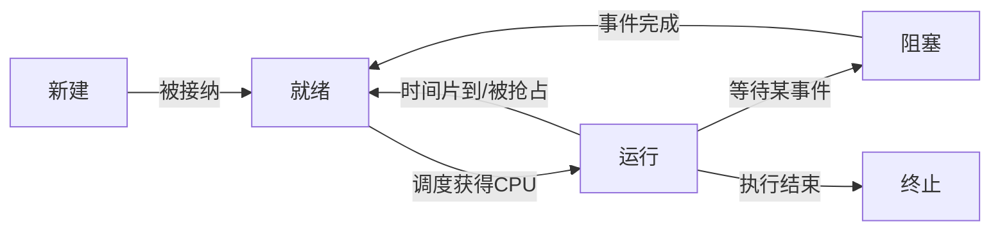
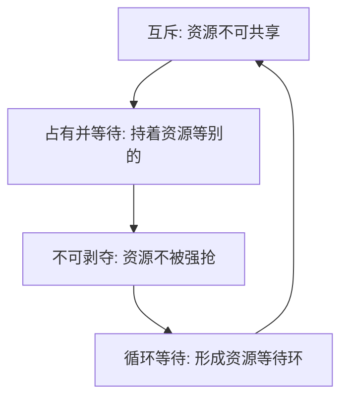
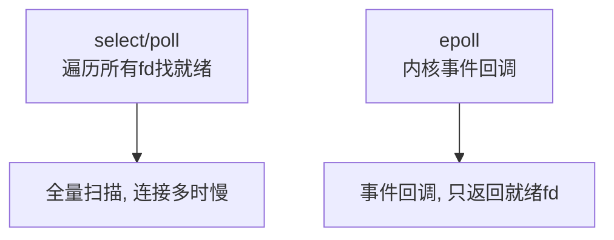

# 操作系统基础

> 文章来源：综合自《操作系统概念》（Silberschatz 等）、小林coding、美团技术博客等公开资料，部分由 AI 整理。

操作系统（OS）是硬件与应用程序之间的「大管家」：它管理 CPU、内存、磁盘、网络等硬件资源，并为程序提供统一、易用的抽象。理解 OS，本质是理解「资源如何被抽象、调度与隔离」。本文聚焦后端开发最该建立的五块心智模型：**进程 / 线程、CPU 调度、存储管理、并发同步、IO 模型**，并在结尾用一个真实请求把它们串起来。

---

## 进程与线程

**进程（Process）** 是 *资源分配的基本单位*——它拥有独立的虚拟地址空间、打开的文件句柄、信号处理等。**线程（Thread）** 是 *CPU 调度的基本单位*，同一进程内的线程共享地址空间与资源，只独有自己的栈和寄存器。

| 维度 | 进程 | 线程 |
| --- | --- | --- |
| 基本单位 | 资源分配 | CPU 调度 |
| 地址空间 | 独立 | 共享所属进程 |
| 通信方式 | IPC（管道 / 消息队列 / 共享内存等） | 直接读写共享变量（需同步） |
| 创建 / 切换开销 | 大（需切换地址空间） | 小（仅切换栈与寄存器） |
| 隔离性 | 强（一个崩了不影响其他） | 弱（一个崩，整个进程崩） |

> **比喻**：进程像一家「工厂」（有独立厂房、原料、账目），线程像工厂里的「工人」（共享厂房资源，各干各的活）。多开工厂成本高、隔离好；多招工人成本低，但一个工人闯祸可能全厂停摆。

> **说明**：现代「线程」也分内核态（由 OS 调度，如 Java 的 platform thread）与用户态（由 runtime 调度，如 Go goroutine、Java Loom virtual thread），但「共享地址空间」的本质不变。

进程在生命周期中会经历若干状态，核心状态转换如下：

> **图题：进程五状态转换**：新建 → 就绪 → 运行 → 阻塞 → 终止，状态转换由调度器与等待事件驱动。

> **说明**：「就绪」与「运行」之间频繁互转，是多任务「看起来同时跑」的来源；「运行 → 阻塞 → 就绪」由 IO 等慢操作触发，也是性能优化的重点（别让贵重的 CPU 干等慢 IO）。

---

## CPU 调度

单核 CPU 同一时刻只能跑一个线程，但系统里动辄上千个任务，**调度器（Scheduler）** 决定「谁先用、用多久」。

**调度目标**：高吞吐（单位时间完成多）、低延迟（响应快）、公平（不饿死）、高 CPU 利用率。

| 算法 | 思路 | 优点 | 缺点 | 适用 |
| --- | --- | --- | --- | --- |
| FCFS | 先来先服务 | 简单 | 长任务堵短任务（护航效应） | 批处理 |
| SJF | 优先短任务 | 平均等待最短 | 需预知时长，可能饿死长任务 | 理论最优 |
| RR | 时间片轮转 | 公平、响应快 | 上下文切换多 | 交互式 |
| 优先级 | 高优先级先 | 区分轻重 | 低优先级可能饿死 | 通用（需老化） |

> **说明**：**上下文切换（context switch）** 不是「免费」的——要保存 / 恢复寄存器、刷新 TLB，约微秒级。线程过多、频繁争抢会让大量时间耗在切换上，有效吞吐量反而下降。TLB 是「页表的高速缓存」，本该极快的地址转换若 TLB 被刷新，就要回内存查页表，这正是切换有成本的原因之一。

---

## 存储管理

### 内存与虚拟地址

程序看到的「内存」是 **虚拟地址空间**，由 OS 通过页表映射到物理内存。这样每个进程都以为自己独占整块内存，且彼此隔离。

- **分页（Paging）**：把虚拟 / 物理内存都切成固定大小的「页 / 帧」（通常 4KB），用 *页表* 记录「虚拟页号 → 物理帧号」，页内偏移不变。
- **缺页中断（Page Fault）**：访问的页不在物理内存时触发，OS 把它从磁盘（swap / 文件）调入内存。
- **局部性原理**：程序倾向于重复访问近期 / 邻近的数据（时间局部性、空间局部性）——这是缓存与预取有效的根本原因。

> **图题：虚拟地址到物理地址的转换**：虚拟地址拆成「页号 + 偏移」，页号查页表得帧号，拼回物理地址。

> **注意**：频繁缺页会让程序把大量时间耗在「等磁盘」上，称为 **抖动（Thrashing）**。给 Java 应用设 `-Xmx` 时要给系统留足内存，正是为避免应用与 OS 争抢物理页导致抖动。

### 文件系统

磁盘上的「持久化数据」由文件系统管理，它与内存管理是一体两面（一个管易失、一个管持久）。

- **块 / 簇**：文件在磁盘上按固定大小的块存储，是 IO 的最小单位。
- **inode**：存文件的元数据（大小、权限、数据块位置），**不含文件名本身**。
- **目录与路径**：目录本质是「文件名 → inode 编号」的映射；打开 `/a/b/c.txt` 要逐级查目录项、拿到 inode、再读数据块。
- **mmap**：文件可被映射到进程虚拟地址空间，之后像访问内存一样读写文件，省去「内核 ↔ 用户」的拷贝。

> **说明**：为什么 `rm` 有时很快、有时「空间不释放」？删的是目录项（断开了文件名 → inode 的链接），只要还有进程打开着这个文件，inode 和其数据块就不会真正回收——这正是文件系统的引用语义。

---

## 并发与同步

多线程共享内存带来 **竞态（Race Condition）**：多个线程同时改同一数据，结果取决于执行时序。解决靠同步原语与 **临界区（Critical Section）** 保护。

- **互斥锁（Mutex）**：同一时刻仅一个线程进入临界区，其余阻塞等待。
- **信号量（Semaphore）**：带计数的许可，可用于限流或生产者 - 消费者模型。
- **条件变量（Condition）**：让线程在特定条件满足前「睡」着，避免忙等。

**死锁** 是并发最棘手的问题，需同时满足四个必要条件：

> **图题：死锁四要素**：四个条件环环相扣，缺一不可，因此只要打破任一即可预防死锁。

> **比喻**：死锁像两个人各自拿着对方需要的资源还不松手——谁也走不了。打破它的务实办法是「按固定顺序申请资源」（破坏循环等待），比如数据库锁一律按主键大小顺序加。

> **说明**：打破死锁的常见手段——① 破坏循环等待：给资源编号、按序申请（如数据库锁按主键顺序）；② 破坏占有等待：一次性申请所有资源；③ 超时回退（如 Redis 分布式锁设 TTL + 看门狗）。

---

## IO 模型

IO 是程序里最慢的环节之一（磁盘毫秒级、网络更慢）。IO 模型讨论的是「等待数据与拷贝数据时，线程在干嘛」。

| 模型 | 等待数据 | 拷贝数据 | 特点 |
| --- | --- | --- | --- |
| 阻塞 IO | 阻塞线程 | 阻塞线程 | 最简单，并发靠多线程，成本高 |
| 非阻塞 IO | 立即返回（轮询） | 阻塞 | 轮询浪费 CPU |
| IO 多路复用 | 阻塞在 select/epoll | 阻塞 | 一个线程管海量连接，服务端主流 |
| 异步 IO（AIO） | 不阻塞 | 回调通知 | 真正「等 + 拷」都不阻塞 |

**IO 多路复用** 是高并发服务（Redis / Nginx / Netty）的基石：用 `epoll`（Linux）一个线程同时监听成千上万个连接，谁就绪就处理谁。

> **图题：IO 多路复用对比**：select/poll 每次都要全量扫描 fd，epoll 用事件回调只返回就绪的 fd，海量连接下优势明显。表中的 `O(n)` / `O(1)` 用来说明复杂度量级，概念图中去掉括号以避免 mermaid 解析歧义。

**零拷贝（Zero-Copy）**：传统文件发送要「内核 → 用户 → 内核」两次拷贝；`sendfile` / `mmap` 让数据不经过用户态，直接在内核态完成，大幅降低拷贝与上下文切换开销（Kafka、Nginx 静态文件靠它提吞吐）。

> **比喻**：阻塞 IO 像在窗口排队点餐（轮到你前只能干等）；IO 多路复用像一个服务员同时盯着一排取餐号（epoll），谁好了处理谁，一个人就能顾全场上百桌。

### 串起来看：一次网络请求历经了哪些机制

以「Web 服务器处理一个接口请求」为例，前面五块机制其实全跑了一遍：

1. **进程 / 线程**：服务端用线程池（或 epoll 单线程）接住连接；
2. **系统调用**：`read` / `write` 在用户态与内核态间切换，数据在 socket 缓冲区与用户缓冲间拷贝；
3. **虚拟内存**：请求处理中访问的变量、对象都在虚拟地址空间，由页表映射到物理页；
4. **调度**：该线程在 CPU 上被调度执行，时间片到就暂时让出；
5. **IO 多路复用 + 零拷贝**：服务端用 epoll 同时盯成千连接，响应经零拷贝发往网卡。

> 一个看似简单的数据往返，背后是进程、调度、内存、并发、IO 五块的接力。理解了它们，调优（线程数、内存、连接模型）才有抓手。

---

## 小结与衔接

- 进程 / 线程是资源与调度的最小单位，线程切换开销远低于进程。
- 虚拟内存 + 页表把「物理受限」抽象成「进程独占」，文件系统管理持久化数据的 inode 与目录。
- 并发要靠锁 / 信号量保护临界区，死锁四要素环环相扣，按序申请资源是务实解法。
- IO 多路复用与零拷贝是海量连接、高吞吐服务的底层支柱。

### 自测：你真的懂了吗

- 进程和线程的根本区别是什么？为什么说线程切换比进程便宜？
- 虚拟内存同时解决了「隔离」和「看似无限的内存」两个问题，具体怎么做到的？
- 死锁四个必要条件，打破哪一个最容易在工程里落地？
- epoll 相比 select 的核心优势是什么？它解决了什么场景的痛点？

> 衔接：epoll 思想在「网络」「微服务」中反复出现；虚拟内存 / 局部性在「计算机组成原理」的 Cache 一节会继续深入；死锁与「分布式事务」的锁竞争一脉相承；文件系统与「数据存储」的磁盘 / 索引页呼应。
