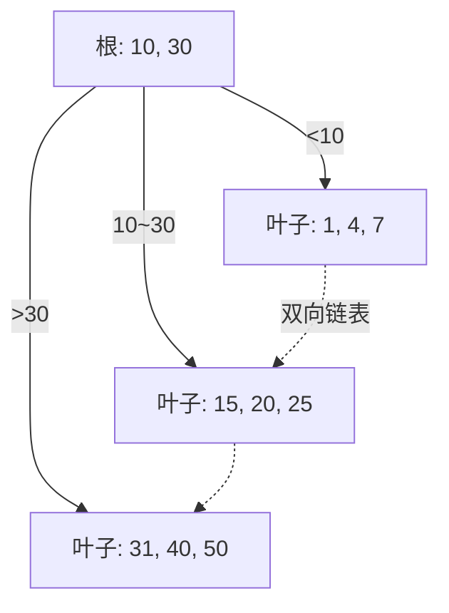

# 数据结构与算法基础

> 文章来源：综合自《算法导论》、《大话数据结构》、极客时间「数据结构与算法之美」等公开资料，部分由 AI 整理。

数据结构与算法是「如何组织数据、如何高效操作数据」的学问。对后端开发而言，它决定了接口的响应速度、服务的资源占用，也是面试与系统设计的基本功。本文按「复杂度 → 线性结构 → 树 → 图 → 排序查找」的顺序展开，并配上可运行的例子，帮你建立「看到场景就能选对结构」的直觉。

---

## 复杂度分析

衡量算法效率不数「绝对耗时」（受机器、数据影响），而用 **渐进复杂度** 描述「随数据规模 n 增长的趋势」。

- **大 O 表示法**：忽略常数与低阶项，只留增长最快的项。如 `3n² + 100n + 5` → `O(n²)`。
- **最坏 / 平均 / 最好**：同一算法在不同输入下表现不同，工程上通常关心最坏与平均。
- **空间复杂度**：算法额外占用的内存随 n 的增长趋势。

| 量级 | 名称 | 直觉 | 典型例子 |
| --- | --- | --- | --- |
| O(1) | 常数 | 与 n 无关 | 数组按下标访问 |
| O(log n) | 对数 | 每步砍半 | 二分查找、平衡树 |
| O(n) | 线性 | 遍历一遍 | 数组查找、链表遍历 |
| O(n log n) | 线性对数 | 分治排序 | 快排、归并、堆排 |
| O(n²) | 平方 | 双层嵌套 | 冒泡、简单选择、朴素匹配 |
| O(2ⁿ) | 指数 | 暴力枚举子集 | 无优化的背包、旅行商 |

> **说明**：量级差一个阶，数据量翻百倍时耗时可能差成百上千倍。写循环嵌套、递归时要本能地想一句：「这会不会掉到 O(n²) 甚至更糟？」

---

## 线性结构

数据「排成一条线」的结构，是最常用的基石。

| 结构 | 核心特性 | 访问 | 插入 / 删除 | 典型用途 |
| --- | --- | --- | --- | --- |
| 数组 | 连续内存、定长（动态数组可扩容） | O(1) 随机 | O(n) 中间插删 | 缓存友好、底层存储 |
| 链表 | 节点 + 指针，零散内存 | O(n) | O(1) 已知前驱 | 频繁头尾增删、LRU |
| 栈 | 后进先出（LIFO） | 仅栈顶 | O(1) | 函数调用、表达式求值 |
| 队列 | 先进先出（FIFO） | 仅队头 / 队尾 | O(1) | 任务调度、消息缓冲 |
| 哈希表 | 键值映射，哈希定位 | 平均 O(1) | 平均 O(1) | 缓存、索引、去重 |

**哈希表冲突** 两种主流解法：
- **链地址法**：同一桶挂一条链表 / 红黑树（Java HashMap 在链表过长时转红黑树）。
- **开放寻址法**：冲突了就按探测规则找下一个空位（线性探测 / 双重哈希），缓存更友好但易聚集。

#### 数组与链表的取舍

- 要**按位置随机访问**多 → 数组（O(1)）；要**频繁在中间增删** → 链表（O(1) 已知前驱，数组要搬移后续元素 O(n)）。
- 数组连续内存、缓存友好；链表节点散落、易缓存 miss。所以即使都是 O(n) 遍历，数组也常常更快。

---

## 树

树用「层级」表达一对多关系，是数据库索引、字典树、堆的基础。

- **二叉树 / 二叉搜索树（BST）**：左小右大，查找 O(log n)；但极端情况下会退化成链表（O(n)）。
- **平衡树（AVL / 红黑树）**：通过旋转保持平衡，查找稳定 O(log n)。红黑树是 Java `TreeMap`、`HashMap` 树化、C++ `std::map` 的底层。
- **B / B+ 树**：为 *磁盘* 设计的多路平衡树，一个节点存很多 key，树高很低，大幅减少 IO 次数——这是 **MySQL InnoDB 索引** 的底层结构。

> **图题：B+ 树结构（简化）**：非叶子节点只存索引、不存数据，所有数据都在叶子节点，且叶子间用双向链表串起，范围查询极快。



> **说明**：为什么索引用 B+ 树而非红黑树？红黑树每个节点只存一个 key、树高随数据线性涨，海量数据下树高太大、IO 次数多；B+ 树一个节点装很多 key，三到四层就能管住千万级数据，且叶子链表让「范围扫描」一气呵成。

#### 一次 B+ 树查找

查 `key = 20`：从根节点 `10, 30` 判断 `10 < 20 < 30` → 走中间分支到叶子 `15, 20, 25` → 命中 `20`。全程只访问了「根 + 一个叶子」两个节点，这就是「树高极低 → IO 极少」的威力。

- **堆（Heap）**：完全二叉树 + 堆序（最大 / 最小在根），用数组存储，取最值 O(1)、调整 O(log n)，是优先队列与堆排序的基础。

---

## 图

图表达「多对多」关系（社交网络、依赖关系、路径规划）。

- **存储**：邻接矩阵（O(n²) 空间，查边快）vs 邻接表（省空间，适合稀疏图）。
- **最短路径**：Dijkstra（非负权，贪心 + 优先队列，O((n+m)log n)）。
- **拓扑排序**：把有向无环图（DAG）排成线性序列，用于 *编译依赖、任务编排、SQL 执行计划* 等「有先后依赖」的场景。

#### 遍历：DFS 与 BFS

两种最基础的图遍历，区别在「用栈还是队列」：

```text
BFS(图, 起点):
  队列 q; q.offer(起点); 标记起点已访问
  while q 非空:
    v = q.poll(); 访问 v
    for 每个邻居 u of v:
      if u 未访问: 标记已访问; q.offer(u)

DFS(图, 起点):
  DFS 递归/栈: 访问起点, 对其每个未访问邻居递归 DFS
```

> **比喻**：BFS 像往池塘里丢石头，波纹一层层扩散（先近后远）；DFS 像走迷宫，一条道走到黑再回溯。求「最短步数」用 BFS，求「是否存在路径 / 穷举」常用 DFS。

---

## 排序与查找

| 排序 | 平均时间 | 稳定 | 特点 |
| --- | --- | --- | --- |
| 冒泡 / 选择 | O(n²) | 冒泡稳、选择不稳 | 教学用，工程少用 |
| 插入 | O(n²) | 稳 | 小数据 / 基本有序时好 |
| 快排 | O(n log n) | 不稳 | 平均最快，工程默认（如 Java 的 `Arrays.sort` 对基本类型） |
| 归并 | O(n log n) | 稳 | 需要额外空间，适合外部排序 |
| 堆排 | O(n log n) | 不稳 | 原地、取 TopK 利器 |

### 二分查找（代码）

前提是数组 **有序**，每次砍半，O(log n)。写的时候注意「左右边界 + 中点溢出（`mid = l + (r-l)/2`）」等细节。

```java
int binarySearch(int[] a, int target) {
    int l = 0, r = a.length - 1;
    while (l <= r) {
        int mid = l + (r - l) / 2;        // 防 (l+r) 溢出
        if (a[mid] == target) return mid;
        else if (a[mid] < target) l = mid + 1;
        else r = mid - 1;
    }
    return -1;
}
```

### 快排的一次划分（示意）

以 `nums = [5, 3, 8, 4, 2]`、选 `5` 为基准（pivot）为例，把 `< 5` 放左、`>= 5` 放右，得到 `[3, 4, 2, 5, 8]`。之后递归处理左右两段。平均每次把区间砍半，故整体 O(n log n)。

> **注意**：快排最坏 O(n²)（每次都选到极端的 pivot，如已排序数组选首尾）；工程实现会随机化选 pivot 或三数取中，把最坏概率压到极低。

- **布隆过滤器（Bloom Filter）**：用多个哈希 BIT 位判断「元素是否 *可能* 存在」，有误判率但极省空间，常用于缓存穿透防护、海量去重。

### 如何选型：数据结构速查

| 想要的能力 | 优先选 | 备选 |
| --- | --- | --- |
| 按键快速查 / 去重 / 缓存 | 哈希表 | — |
| 范围查询 / 排序遍历 | B+ 树 / 平衡树 | 跳表 |
| 先进先出（任务排队） | 队列 | — |
| 后进先出（撤销 / 递归） | 栈 | — |
| 取最大 / 最小（优先级） | 堆 | 平衡树 |
| 多对多关系 / 路径规划 | 图 | — |

---

## 小结与衔接

- 复杂度是「第一性原理」：动手前先估量级，避免无意掉进 O(n²) 陷阱。
- 哈希表平均 O(1) 是缓存与索引的底层依赖；树用层级换查询效率，B+ 树是磁盘索引之王。
- 排序 / 查找是算法题与系统优化的常客，快排与二分是必会两项。
- 图与拓扑排序在「编译依赖、任务编排、SQL 执行计划」中反复出现。

### 自测：你真的懂了吗

- `O(n log n)` 比 `O(n²)` 在数据量大时好多少？给个直觉。
- 为什么 MySQL 索引用 B+ 树而不是红黑树或哈希表？
- 二分查找的两个易错点（边界、溢出）分别是什么？
- 要实现一个「总是能取出当前最小元素」的调度器，该用哪种结构？

> 衔接：B+ 树与 MySQL 索引在「数据存储」群组的 MySQL 专题展开；哈希冲突、堆在「Java」「JVM」中继续深入；拓扑排序与编译流水线在「编译原理与程序执行基础」呼应；布隆过滤器在「安全与认证 / 缓存」实践中常用。
