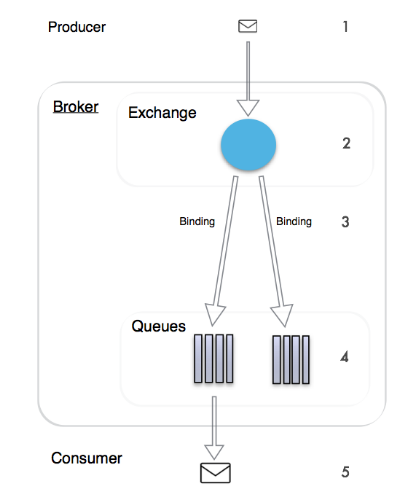

# RabbitMQ

许多新手在刚接触RabbitMQ的时候，会被各种名词弄晕，包括ConnectionFactory 、Connection 、Channel、Exchange、Queue、RoutingKey、BindingKey等等，现在我言简意赅的描绘一下这些名词到底是啥概念

> 参考：
>
> [RabbitMQ Exchange Queue RoutingKey BindingKey解析](https://blog.csdn.net/ad132126/article/details/83539213)
>
> [springboot集成RabbitMQ](https://blog.csdn.net/qq_38455201/article/details/80308771)
>
> [RabbitMQ快速入门（详细）](https://blog.csdn.net/kavito/article/details/91403659)

## 消息模型

消息模型可分为以下六种：

1. **基本消息模型**

   生产者、消费者、消息队列组成。

2. **work消息模型**

   工作队列或者竞争消费者模式，work queues与入门程序相比，多了一个消费端，两个消费端共同消费同一个队列中的消息，但是一个消息只能被一个消费者获取。

   这个消息模型在Web应用程序中特别有用，可以处理短的HTTP请求窗口中无法处理复杂的任务。

3. **Publish/subscribe**

   交换机类型：Fanout，也称为广播

   和前面两种模式不同，1  声明Exchange，不再声明Queue，2 发送消息到Exchange，不再发送到Queue

4. **Routing路由模型**

   交换机类型：direct

   - 生产者，向Exchange发送消息，发送消息时，会指定一个routing key
   - Exchange（交换机），接收生产者的消息，然后把消息递交给 与routing key完全匹配的队列
   - 消费者，其所在队列指定了需要routing key 为 error 的消息
   - 消费者，其所在队列指定了需要routing key 为 info、error、warning 的消息

5. **Topic通配符模式**

   交换机类型：topics

   每个消费者监听自己的队列，并且设置带统配符的routingkey,生产者将消息发给broker，由交换机根据routingkey来转发消息到指定的队列。通配符规则：

   - `#`：匹配一个或多个词
   - `*`：匹配不多不少恰好1个词

6. **RPC**

### 名词解释

- ConnectionFactory：与RabbitMQ服务器连接的管理器
- Connection：与RabbitMQ服务器的连接
- Channel：与Exchange的连接
- Exchange：接受消息提供者（生产者）的消息，并根据消息的RoutingKey和Exchange绑定的BindingKey分配消息
- Queue：存储消息接收者（消费者）的消息
- RoutingKey：指定当前消息被谁接受
- BindingKey：指定当前Exchange下，什么样的RoutingKey会被下派到当前绑定的Queue中

**生产者** 关心exchange、queue、routingKey

> 在direct类型的exchange中，只有这两个routingkey完全相同，exchange才会选择对应的binging进行消息路由。

**消费者** 关心queue

## 订阅模型分类

- 一个生产者多个消费者
- 每个消费者都有一个自己的队列
- 生产者没有将消息直接发送给队列，而是发送给exchange(交换机、转发器)
- 每个队列都需要绑定到交换机上
- 生产者发送的消息，经过交换机到达队列，实现一个消息被多个消费者消费

### Exchanges

（Exchanges）：交换机一方面：接收生产者发送的消息。另一方面：知道如何处理消息，例如递交给某个特别队列、递交给所有队列、或是将消息丢弃。到底如何操作，取决于Exchange的类型。

Exchange类型有以下几种：

- Fanout：广播，将消息交给所有绑定到交换机的队列

- Direct：定向，把消息交给符合指定routing key 的队列

- Topic：通配符，把消息交给符合routing pattern（路由模式） 的队列

- Header：header模式与routing不同的地方在于，header模式取消routingkey，使用header中的 key/value（键值对）匹配队列。

> **Exchange（交换机）只负责转发消息，不具备存储消息的能力**，因此如果没有任何队列与Exchange绑定，或者没有符合路由规则的队列，那么消息会丢失！

## 消息确认机制（ACK）

当消费者获取消息后，会向RabbitMQ发送回执ACK，告知消息已经被接收。不过这种回执[ACK](https://blog.csdn.net/kavito/article/details/91403659)分两种情况：

- 自动ACK：消息一旦被接收，消费者自动发送ACK
- 手动ACK：消息接收后，不会发送ACK，需要手动调用

如何选择：

- 如果消息不太重要，丢失也没有影响，那么自动ACK会比较方便
- 如果消息非常重要，不容丢失。那么最好在消费完成后手动ACK，否则接收消息后就自动ACK，RabbitMQ就会把消息从队列中删除。如果此时消费者宕机，那么消息就丢失了。

> 当消费者拿到消息，在进行消费的时候抛出了异常（比如除数不能为0），这时候如果不手动ACK的话，后续就拿不到这条消息，相当于这条消息就相当于丢失掉了。

