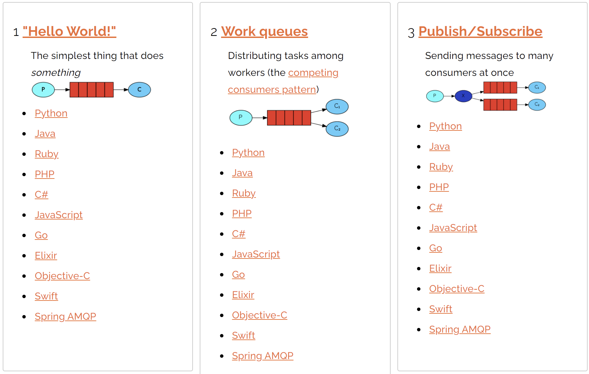
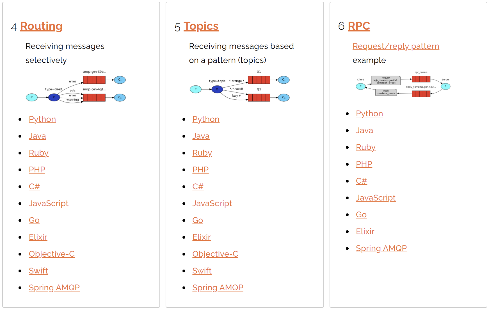
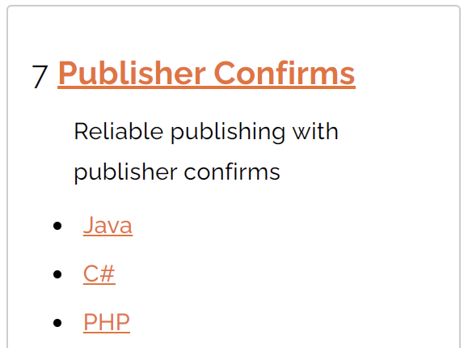

# RabbitMQ

## 特点

RabbitMQ是一个开源的消息中间件，它基于AMQP（高级消息队列协议）标准，用于在不同的应用程序之间进行异步通信。RabbitMQ具有以下几个显著特点：

### 1. 可靠性

- **消息持久化**：RabbitMQ支持将消息存储在磁盘上，即使服务器重启或发生故障，消息也不会丢失，从而保证了消息的可靠性。
- **确认机制**：RabbitMQ提供了发布确认和消费确认机制，确保消息被正确地接收和处理。发布者可以等待服务器确认消息已被接收，而消费者可以在处理完消息后向服务器发送确认。
- **镜像队列**：RabbitMQ的镜像队列功能允许在多个节点上复制队列，以实现高可用性和冗余。如果某个节点出现故障，其他节点上的镜像队列可以继续处理消息。

### 2. 灵活性

- **多种消息协议支持**：RabbitMQ支持多种消息传递协议，如AMQP、MQTT、STOMP等，使得不同系统之间可以方便地进行消息传递。
- **多种消息传递模式**：RabbitMQ支持多种消息传递模式，包括点对点、发布/订阅、请求/响应等，允许开发人员根据应用程序的需求来选择合适的消息模式。
- **交换机和绑定**：RabbitMQ通过交换机（Exchange）和绑定（Binding）来实现消息的路由和过滤。交换机负责将消息路由到不同的队列，而绑定则定义了交换机和队列之间的关系。RabbitMQ提供了多种类型的交换机，如Direct、Fanout、Topic等，以满足不同的路由需求。

### 3. 可扩展性

- **水平扩展**：RabbitMQ支持通过添加更多的节点和队列来实现水平扩展，以处理更多的消息传递需求。
- **集群支持**：RabbitMQ支持集群配置，允许多个RabbitMQ节点作为一个逻辑代理一起工作，以提高系统的可靠性和容错能力。

## 物理组成

### Broker

Broker（代理）：它主要负责接收、存储和转发消息。Broker 是整个消息系统的核心，它维护着各种队列、交换器和连接等资源。

相比RocketMQ需要nameServer，RabbitMQ只需要一个Broker节点即可直接使用。

1. 连接管理：接收来自生产者和消费者的连接请求，并建立和维护连接。
2. 信道管理：在连接之上创建信道，用于消息的发送和接收。信道可以提高连接的并发处理能力。
3. 队列管理：创建、删除和管理队列。队列用于存储等待被消费的消息。
4. 交换器管理：创建、删除和管理交换器。交换器根据特定的规则将消息路由到不同的队列。
5. 消息存储：将消息持久化存储在磁盘上，以确保消息在服务器重启或故障时不会丢失。

#### 总结

虽然 RabbitMQ 没有像 RocketMQ 那样的 NameServer 组件，但它通过自身的集群和负载均衡机制实现了类似的功能。具体来说：

- **服务发现**：在集群模式下，RabbitMQ 节点之间可以互相发现，并且客户端可以通过集群中的任一节点访问队列和消息。

- **集群管理**：RabbitMQ 集群支持节点间的通信和数据复制，确保高可用性和负载均衡。

总的来说，RocketMQ 的 NameServer 和 RabbitMQ 的集群机制各自解决了服务发现和集群管理的问题，但采用了不同的设计思路。RocketMQ 更加注重服务发现和配置管理的分离，而 RabbitMQ 则是在 Broker 层面集成了更多的集群管理功能。

### 逻辑组成

**Exchange（交换器）**

- 决定消息的路由方式。生产者将消息发送到交换器，交换器根据预先设定的规则将消息路由到一个或多个队列中。
- 常见的交换器类型有：
  - **Direct exchange（直连交换器）**：根据消息的路由键将消息准确地路由到一个队列。只有当消息的路由键与队列绑定的路由键完全匹配时，消息才会被路由到该队列。
  - **Topic exchange（主题交换器）**：通过通配符匹配路由键，将消息路由到符合特定主题模式的队列。例如，“*.stock.*” 可以匹配 “us.stock.up” 和 “eu.stock.down” 等路由键。
  - **Fanout exchange（扇形交换器）**：将消息广播到所有绑定的队列，不关心路由键。适用于需要将消息发送给多个消费者的场景。
  - **Headers exchange（头部交换器）**：根据消息的头部属性进行路由。可以设置多个键值对作为匹配条件，只有当消息的头部属性与绑定的条件完全匹配时，消息才会被路由到相应的队列。

**Queue（队列）**

- 用于存储等待被消费者消费的消息。消息在队列中按照先进先出（FIFO）的顺序排列。
- 队列可以设置不同的属性，如持久性、排他性、自动删除等：
  - 持久性队列在服务器重启后仍然存在，确保消息不会丢失。
  - 排他性队列只能被一个连接使用，当连接断开时，队列会被自动删除。
  - 自动删除队列在没有消费者连接时会自动删除。

**Binding（绑定）**

- 建立交换器和队列之间的关联。通过绑定，定义了消息从交换器路由到队列的规则。
- 绑定可以基于路由键、消息属性或头部信息等。例如，在直连交换器中，绑定的路由键必须完全匹配消息的路由键才能将消息路由到队列。

**Connection（连接）**

- 生产者和消费者与 RabbitMQ 服务器之间的网络连接。连接通常是长连接，以确保消息的可靠传输。
- 连接可以配置各种参数，如连接超时时间、心跳机制等。心跳机制用于检测连接的活性，当连接长时间没有活动时，服务器和客户端可以通过发送心跳消息来保持连接的有效性。

**Channel（信道）**

- 在连接之上的逻辑通信通道。多个信道可以共享同一个连接，每个信道独立进行消息的发送和接收。
- 信道可以提高连接的并发处理能力，减少连接的创建和销毁开销。信道可以设置各种属性，如确认模式、事务模式等。
- 在确认模式下，消费者在处理完消息后需要向服务器发送确认消息，以告知服务器消息已经被成功处理。如果消费者在处理消息过程中出现问题，它可以拒绝消息，服务器会将消息重新放入队列，等待其他消费者处理。

## 消息

### 消息存储

#### 一、元数据

RabbitMQ 默认使用基于 Erlang 的 Mnesia **数据库**来进行**存储**各种**元数据**信息。Mnesia 是一个分布式事务性的软实时数据库管理系统，它能够存储队列、交换器、绑定关系以及其他元数据。

- **元数据存储**：当创建一个队列或交换器时，RabbitMQ 会将相关的元数据信息存储在 Mnesia 中。当消费者订阅一个队列时，RabbitMQ 会从 Mnesia 中获取队列的信息，并将消息发送给消费者。
- **集群管理**：在 RabbitMQ 集群中，Mnesia 用于存储集群的配置信息和状态。它确保各个节点之间的元数据一致，并在节点加入或离开集群时进行自动调整。例如，当一个新的节点加入集群时，Mnesia 会自动将其他节点上的元数据复制到新节点上。当一个节点出现故障时，Mnesia 会标记该节点为不可用，并将其负责的队列和交换器重新分配给其他节点。
- **数据持久性**：可以将数据持久化到磁盘，以确保在服务器重启或故障时数据不会丢失。RabbitMQ 可以配置为将重要的元数据信息持久化到 Mnesia 中，以提高系统的可靠性。当 RabbitMQ 启动时，它会从 Mnesia 中恢复之前存储的元数据信息，并重新建立队列、交换器和绑定关系等。

#### 二、消息内容

在 RabbitMQ 中，除了元数据由 Mnesia 存储外，消息的内容主要存储在以下两个地方：

**内存存储**

当消息被接收后，如果系统有足够的内存并且配置允许，消息可能会被暂时存储在内存中。

- 优点：消息在内存中的读取和处理速度非常快，可以实现低延迟的消息传递。对于那些需要快速处理的消息，内存存储能够极大地提高系统的响应性能。
- 缺点：由于内存的易失性，如果服务器出现故障、重启或者内存不足导致消息被换出，存储在内存中的消息可能会丢失。

**磁盘存储**

持久化的消息或者当内存不足时，消息会被写入磁盘。

- RabbitMQ 将消息以文件的形式存储在磁盘上，通常是在特定的存储目录中。每个文件包含多个消息，并且采用顺序写入的方式，以提高写入性能并减少磁盘碎片。
- 优点：保证了消息的可靠性，即使在服务器出现故障或重启的情况下，消息也不会丢失。对于重要的消息或者需要长期保存的消息，磁盘存储是一种可靠的选择。
- 缺点：相比内存存储，磁盘存储的读取和写入速度较慢，会带来一定的性能开销。尤其是在高并发的情况下，频繁的磁盘读写可能会影响系统的整体性能。

#### 与RocketMQ存储方式的区别

- **RabbitMQ**：
  - RabbitMQ使用Mnesia数据库作为其底层存储引擎，Mnesia是一个分布式、事务性的数据库管理系统，专为Erlang环境设计。
  - 所有队列中的消息都以append的方式写到一个文件中，当文件大小超过指定限制后，会关闭该文件并创建一个新的文件继续写入。文件名从0开始依次累加。
  - RabbitMQ在启动时会创建msg_store_persistent和msg_store_transient两个进程，分别负责持久化消息的存储和内存不足时将非持久化数据转存到磁盘。
  - RabbitMQ在删除消息时，并不立即从文件中删除，而是做一些记录，当垃圾数据达到一定比例时，启动垃圾回收处理，将逻辑相邻的文件中的数据合并到一个文件中。
- **RocketMQ**：
  - RocketMQ采用分布式存储的方式来存储消息，其存储结构主要包括CommitLog、ConsumeQueue和IndexFile。
  - CommitLog是消息存储的物理文件，存储了所有消息的主题、标签、时间戳等基本信息和消息体。
  - ConsumeQueue是消息的逻辑队列，存储了具有相同属性（如Topic、队列ID等）的消息，采用顺序写入、随机读取的方式存储消息。
  - IndexFile是消息索引文件，存储了消息在CommitLog中的偏移量和消息物理偏移量对应关系，采用Hash索引方式加速定位。

> **是否默认持久化**
> 
> - RabbitMQ默认**不会**持久化消息。RabbitMQ的持久化机制需要显式地通过配置来启用，以确保消息在RabbitMQ服务器重启或故障后不会丢失。
> 
> - RocketMQ 默认对消息进行持久化。

### 消息的基本构成

RabbitMQ消息的基本构成主要可以从消息的结构和属性两个方面来阐述。

##### 一、消息的结构

RabbitMQ的消息主要由两部分组成：消息头（Headers）和消息体（Body）。

- **消息体（Body）**：这是消息的实际内容，是不透明的，可以是任何类型的数据，如文本、二进制数据等。消息体是消息传递过程中最关心的部分，因为它包含了需要传递的具体信息。
- **消息头（Headers）**：虽然RabbitMQ本身不直接强调“消息头”作为消息的一个独立部分（与AMQP协议中的概念有所不同），但消息在RabbitMQ中传输时，会包含一系列的可选属性，这些属性可以看作是广义上的“消息头”。这些属性包括但不限于路由键（routing key）、优先级（priority）、传输模式（delivery mode，指出该消息是否需要持久化存储）等。这些属性帮助RabbitMQ决定如何处理和路由消息。

##### 二、消息的属性（广义上的“消息头”）

以下是一些RabbitMQ消息中常见的属性：

- **路由键（Routing Key）**：用于指定消息应该被发送到哪个队列。它是消息路由的重要依据。
- **优先级（Priority）**：用于设置消息的优先级，高优先级的消息可能会在队列中被优先处理。但需要注意的是，RabbitMQ并不保证消息会严格按照优先级顺序被处理，只是提供了一种设置优先级的机制。
- **传输模式（Delivery Mode）**：用于指定消息是否需要持久化存储。如果设置为持久化，那么即使RabbitMQ服务器重启，消息也不会丢失。
- **其他可选属性**：RabbitMQ还支持设置其他多种可选属性，如消息的过期时间、消息的确认机制等，这些属性可以根据具体需求进行设置。

##### 三、消息的处理流程

在RabbitMQ中，消息的处理流程大致如下：

1. 生产者（Producer）创建消息，并设置消息的属性和内容。
2. 生产者将消息发送到RabbitMQ的交换机（Exchange）。
3. 交换机根据消息的路由键和预设的路由规则，将消息路由到一个或多个队列（Queue）中。
4. 消费者（Consumer）从队列中获取消息，并进行处理。

## 答疑

### RabbitMQ如何保证消息顺序

RabbitMQ保证消息顺序主要依赖于以下几个方面的机制和配置：

1. **队列的FIFO特性**

RabbitMQ的队列是先进先出（FIFO）的数据结构，这意味着消息在被发送到队列之后，会按照发送的顺序被排列在队列中。消费者连接到队列并开始消费消息时，会按照队列中的顺序接收到这些消息。这是保证消息顺序性的基础。即RabbitMQ 保证在单个队列中消息是按照先进先出（FIFO）的顺序被消费的。

2. **单一消费者模式**

当多个消费者同时订阅同一个队列时，RabbitMQ会使用竞争消费者模式来处理并发消费者对消息顺序的影响。然而，为了保证消息的顺序性，通常会将队列中的消费者数量限制为1个，即使用单一消费者模式。这样，同一时刻只有一个消费者能够处理消息，从而确保消息的处理顺序与队列中的顺序相同。

3. **prefetch_count设置**

通过设置消费者的prefetch_count（每次从队列中取出的消息数量）为1，可以确保消费者一次只处理一个消息，避免在消息处理过程中打乱顺序。这有助于在多个消费者环境下，即使不使用单一消费者模式，也能在一定程度上保证消息的顺序性（尽管不是绝对的，因为网络延迟等因素仍可能影响顺序）。

4. **手动确认机制**

使用手动确认模式（而不是自动确认），可以确保消息在被成功处理后才发送确认（ack）。如果消费者在处理过程中失败且未确认，RabbitMQ会重新将消息放回队列，这样可以在一定程度上保持消息的顺序性，尤其是在处理复杂业务逻辑或可能出现异常的情况下。

## 名词概念

许多新手在刚接触RabbitMQ的时候，会被各种名词弄晕，包括ConnectionFactory 、Connection 、Channel、Exchange、Queue、RoutingKey、BindingKey等等，现在我言简意赅的描绘一下这些名词到底是啥概念

> 参考：
> 
> [RabbitMQ Exchange Queue RoutingKey BindingKey解析](https://blog.csdn.net/ad132126/article/details/83539213)
> 
> [springboot集成RabbitMQ](https://blog.csdn.net/qq_38455201/article/details/80308771)
> 
> [RabbitMQ快速入门（详细）](https://blog.csdn.net/kavito/article/details/91403659)

## 消息模型

消息模型可分为以下几种：

1. **基本消息模型**
   
   生产者、消费者、消息队列组成。

2. **work消息模型**
   
   工作队列或者竞争消费者模式，work queues与入门程序相比，多了一个消费端，两个消费端共同消费同一个队列中的消息，但是一个消息只能被一个消费者获取。
   
   这个消息模型在Web应用程序中特别有用，可以处理短的HTTP请求窗口中无法处理复杂的任务。

3. **Publish/subscribe**
   
   交换机类型：Fanout，也称为广播
   
   和前面两种模式不同，1  声明Exchange，不再声明Queue，2 发送消息到Exchange，不再发送到Queue

4. **Routing路由模型**
   
   交换机类型：direct
   
   - 生产者，向Exchange发送消息，发送消息时，会指定一个routing key
   - Exchange（交换机），接收生产者的消息，然后把消息递交给 与routing key完全匹配的队列
   - 消费者，其所在队列指定了需要routing key 为 error 的消息
   - 消费者，其所在队列指定了需要routing key 为 info、error、warning 的消息

5. **Topic通配符模式**
   
   交换机类型：topics
   
   每个消费者监听自己的队列，并且设置带统配符的routingkey,生产者将消息发给broker，由交换机根据routingkey来转发消息到指定的队列。通配符规则：
   
   - `#`：匹配一个或多个词
   - `*`：匹配不多不少恰好1个词

6. **RPC**

### 消息模型图解

> 参考：[RabbitMQ 的七种消息传递形式](https://segmentfault.com/a/1190000040968626)

### 名词解释

- ConnectionFactory：与RabbitMQ服务器连接的管理器
- Connection：与RabbitMQ服务器的连接
- Channel：与Exchange的连接
- Exchange：接受消息提供者（生产者）的消息，并根据消息的RoutingKey和Exchange绑定的BindingKey分配消息
- Queue：存储消息接收者（消费者）的消息
- RoutingKey：指定当前消息被谁接受
- BindingKey：指定当前Exchange下，什么样的RoutingKey会被下派到当前绑定的Queue中

**生产者** 关心exchange、queue、routingKey

> 在direct类型的exchange中，只有这两个routingkey完全相同，exchange才会选择对应的binging进行消息路由。

**消费者** 关心queue

## 订阅模型分类

- 一个生产者多个消费者
- 每个消费者都有一个自己的队列
- 生产者没有将消息直接发送给队列，而是发送给exchange(交换机、转发器)
- 每个队列都需要绑定到交换机上
- 生产者发送的消息，经过交换机到达队列，实现一个消息被多个消费者消费

### Exchanges

（Exchanges）：交换机一方面：接收生产者发送的消息。另一方面：知道如何处理消息，例如递交给某个特别队列、递交给所有队列、或是将消息丢弃。到底如何操作，取决于Exchange的类型。

Exchange类型有以下几种：

- Fanout：广播，将消息交给所有绑定到交换机的队列

- Direct：定向，把消息交给符合指定routing key 的队列

- Topic：通配符，把消息交给符合routing pattern（路由模式） 的队列

- Header：header模式与routing不同的地方在于，header模式取消routingkey，使用header中的 key/value（键值对）匹配队列。

> **Exchange（交换机）只负责转发消息，不具备存储消息的能力**，因此如果没有任何队列与Exchange绑定，或者没有符合路由规则的队列，那么消息会丢失！

## 消息确认机制（ACK）

当消费者获取消息后，会向RabbitMQ发送回执ACK，告知消息已经被接收。不过这种回执[ACK](https://blog.csdn.net/kavito/article/details/91403659)分两种情况：

- 自动ACK：消息一旦被接收，消费者自动发送ACK
- 手动ACK：消息接收后，不会发送ACK，需要手动调用

如何选择：

- 如果消息不太重要，丢失也没有影响，那么自动ACK会比较方便
- 如果消息非常重要，不容丢失。那么最好在消费完成后手动ACK，否则接收消息后就自动ACK，RabbitMQ就会把消息从队列中删除。如果此时消费者宕机，那么消息就丢失了。

> 当消费者拿到消息，在进行消费的时候抛出了异常（比如除数不能为0），这时候如果不手动ACK的话，后续就拿不到这条消息，相当于这条消息就相当于丢失掉了。
