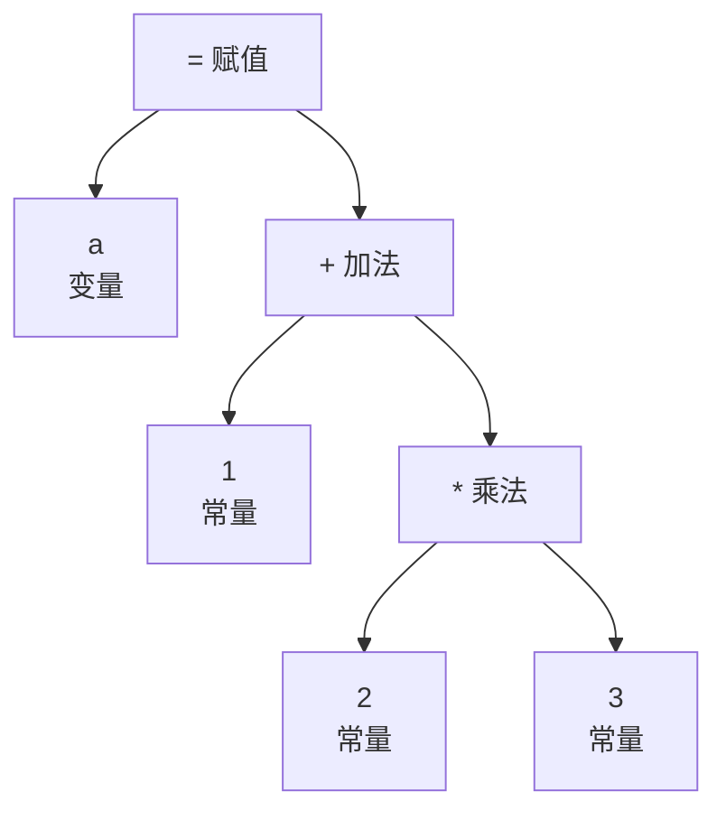
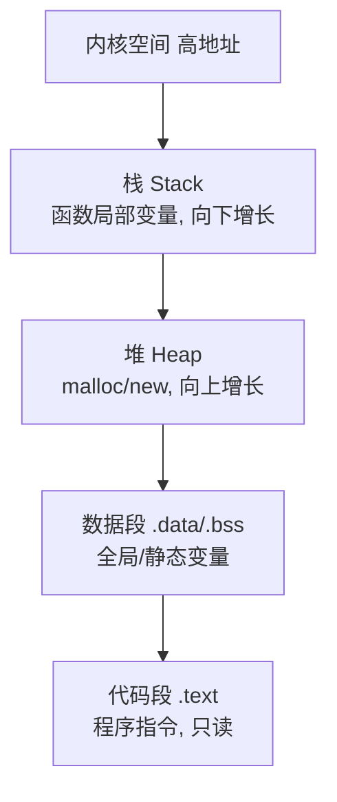

# 编译原理与程序执行基础

> 文章来源：综合自《编译原理》（龙书）、《程序员的自我修养》、JVM 相关公开资料，部分由 AI 整理。

我们每天写的 `.java` / `.c` 文件，最终怎么变成能在 CPU 上跑的机器码？中间经历了「编译 → 链接 → 加载 → 执行」一长串过程。理解它，能解释很多现象：为什么 Java「一次编译处处运行」、JIT 为何让热点代码飞快、动态链接库为什么能共享。本文把这条链路讲透，并衔接「JVM」板块。

---

## 编译流水线

以 C 语言为例，从源码到可执行文件大体经历：

> **图题：编译 - 链接 - 加载全流程**：源码经编译各阶段生成目标文件，链接器拼成可执行文件，运行时由加载器搬进内存执行。

- **预处理**：展开 `#include`、宏替换，得到纯 C 文本。
- **词法分析**：把字符流切成 token（关键字、标识符、运算符）。
- **语法分析**：按文法把 token 组成 **AST（抽象语法树）**，结构化的「代码树」。
- **语义分析**：类型检查、作用域校验，确保语义合法。
- **中间代码 + 优化**：生成与机器无关的中间表示（如三地址码），做常量折叠、死代码消除等优化。
- **目标代码生成**：翻译成具体指令集的机器码，输出目标文件。

> **说明**：**中间代码** 大白话——编译先不急着生成某款 CPU 的机器码，而是生成一种「通用的中间语言」，这样同一套前端（解析各种语言）能对接多套后端（生成不同 CPU 的码），也是跨平台的关键一环。

---

## AST（抽象语法树）

AST 把「线性文本」变成「树状结构」，是编译器后续所有阶段的工作对象，也是各类工具的基础。

### 一个具体例子：`a = 1 + 2 * 3`

表达式里 `*` 优先级高于 `+`，所以先算 `2 * 3` 再加 `1`，最后赋给 `a`。这棵语法树长这样：

> **图题：AST 示例 `a = 1 + 2 * 3`**：树的结构直接体现了运算符优先级——`*` 是 `+` 的右子树，故先算。

编译器正是遍历这棵树来求值：先算 `*`（2×3=6），再算 `+`（1+6=7），最后执行 `a = 7`。AST 让「先乘后加」这种结构信息一目了然，远比「一串字符」好处理。

- **IDE 语法高亮 / 重构**：本质是遍历 / 改写 AST。
- **格式化、Lint**：在 AST 上做规则检查。
- **转译（Transpile）**：如 Babel 把新语法转旧语法、TypeScript 转 JavaScript，都是在 AST 层面改树再生成代码。

> **说明**：很多「代码即数据」的能力（AST 操作、正则之外的结构化处理）都源于此。理解 AST，就理解了为什么很多工具能「读懂」你的代码。

---

## 链接（Linking）

多个 `.c` 编译成的目标文件，要由 **链接器** 拼成最终可执行文件。核心解决两件事：**符号解析**（把函数 / 变量引用对上定义）与 **重定位**（确定每个符号最终的内存地址）。

| 方式 | 特点 | 例子 |
| --- | --- | --- |
| 静态链接 | 把库代码直接拷进可执行文件，体积大、但独立 | 早期 C 程序、`gcc -static` |
| 动态链接 | 运行时才加载共享库（`.so` / `.dll`），多程序共享、省内存 | 绝大多数现代程序、`libc.so` |

> **比喻**：链接像拼图——每个 `.c` 是一块带「缺口（未定义的符号）」和「凸起（导出的符号）」的拼图，链接器把凸起对进缺口，拼成完整的一幅图（可执行文件）。

> **说明**：动态链接的「共享」是内存优化的关键——多个进程映射同一份 `.so` 的物理页，不重复占内存。代价是运行时依赖库版本，版本不匹配就会出现「找不到 xxx.so」的报错。

---

## 运行时：加载与内存布局

可执行文件被 **加载器** 读进内存后，进程地址空间大致长这样：

> **图题：进程虚拟内存布局（典型）**：从高地址到低地址依次是内核区、栈、堆、数据段、代码段。

- **代码段（.text）**：编译好的指令，通常只读，防误改。
- **数据段（.data/.bss）**：全局 / 静态变量（已初始化 / 未初始化）。
- **堆（Heap）**：动态分配（`malloc` / `new`），向高地址增长，由程序员 / GC 管理。
- **栈（Stack）**：函数调用栈帧（参数、返回地址、局部变量），向低地址增长，自动回收。

> **说明**：「栈溢出」就是无限递归 / 巨大局部变量把栈撑爆；「堆内存泄漏」是分配了却没释放（Java 靠 GC 缓解，C/C++ 靠人工）。栈快（连续、缓存友好）、堆灵活但有管理成本。

---

## JIT：为什么 Java 能又快又跨平台

Java 走的是「半编译半解释」路线，理解它要先分清两种执行：

- **解释执行**：逐行把字节码翻译成机器码再跑，启动快但慢。
- **编译执行（AOT）**：提前把全部编译成机器码，跑得快但启动慢、不灵活。
- **JIT（Just-In-Time，即时编译）**：运行时把 *频繁执行的热点代码*（如热点循环）编译成本地机器码并缓存，之后直接跑机器码——兼得「启动快」与「热点快」。

> **比喻**：AOT 编译像「提前把整本书笔译好」（跑得快但要等、不灵活）；解释执行像「同声传译」（随时能翻但慢）；JIT 像「先听几遍同传、发现这段常出现就提前笔译缓存好」——冷代码同传顶着、热点代码笔译加速。

> **说明**：JVM 的 HotSpot 用「解释器 + JIT」组合：冷代码解释跑、热代码 JIT 编译优化。这也是为什么 Java 服务「预热」后性能明显上升，以及为何 JVM 调优常关注「编译阈值」「内联」等 JIT 相关参数。

---

## 小结与衔接

- 源码到执行 = 编译（预处理→词法→语法→语义→中间码→优化→目标码）→ 链接 → 加载 → 运行。
- AST 是「代码即数据」的核心，支撑 IDE、Lint、转译等能力。
- 静态 / 动态链接权衡「独立 vs 共享省内存」；进程内存布局区分代码 / 数据 / 堆 / 栈。
- JVM 用「解释 + JIT」兼得跨平台与热点性能，是编译原理在工程上的最佳范例。

### 自测：你真的懂了吗

- 为什么 `a = 1 + 2 * 3` 的 AST 里 `*` 是 `+` 的子节点？这反映了什么？
- 静态链接和动态链接各有什么利弊？什么场景必须动态链接？
- 栈和堆的生命周期、增长速度、管理方式有什么不同？
- JIT 为什么能让 Java「启动快」又「热点快」？它牺牲了什么？

> 衔接：JIT、栈 / 堆、GC 在「Java」「JVM」群组深入；动态链接的 `.so` 共享思想与「操作系统基础」的内存管理呼应；AST 与编译流程也是前端 Babel / TS 转译的底层。
