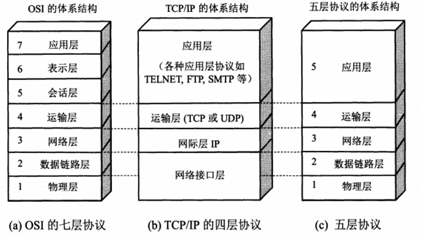
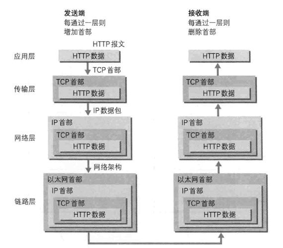

# 网络协议

> 著作权归https://pdai.tech所有。 链接：https://www.pdai.tech/md/develop/protocol/dev-protocol-osi7.html

## OSI

国际标准化组织ISO于1984年提出了OSI（Open System Interconnection Reference Model,开放系统互联参考模型）。OSI很快成为计算机网络通信的基础模型。

OSI七层参考模型的各个层次的划分遵循下列原则：

- 同一层中的各网络节点都有相同的层次结构，具有同样的功能。
- 同一节点内相邻层之间通过接口(可以是逻辑接口)进行通信。
- 七层结构中的每一层使用下一层提供的服务，并且向其上层提供服务。
- 不同节点的同等层按照协议实现对等层之间的通信。

OSI依层次结构来划分：

1. **物理层（Physical）**
   
   规定通信设备的机械的、电气的、功能的和过程的特性，用以建立、维护和拆除物理链路连接。

2. **数据链路层（Data Link）**
   
   在物理层提供比特流服务的基础上，建立相邻结点之间的数据链路，通过差错控制提供数据帧(Frame)在信道上无差错的传输，并进行各电路上的动作系列。数据链路层在不可靠的物理介质上提供可靠的传输。

3. **网络层（Network）**
   
   在 计算机网络中进行通信的两个计算机之间可能会经过很多个数据链路，也可能还要经过很多通信子网。网络层的任务就是选择合适的网间路由和交换结点， 确保数据及时传送。网络层将数据链路层提供的帧组成数据包，包中封装有网络层包头，其中含有逻辑地址信息- -源站点和目的站点地址的网络地址。如 果你在谈论一个IP地址，那么你是在处理第3层的问题。

4. **传输层（Transport）**
   
   第4层的数据单元也称作数据包(packets)。但是，当你谈论TCP等具体的协议时又有特殊的叫法，TCP的数据单元称为段 (segments)而UDP协议的数据单元称为“数据报(datagrams)”。这个层负责获取全部信息，因此，它必须跟踪数据单元碎片、乱序到达的 数据包和其它在传输过程中可能发生的危险。传输层协议的代表包括：TCP、UDP、SPX等。

5. **会话层（Session）**
   
   在会话层及以上的高层次中，数据传送的单位不再另外命名，而是统称为报文。会话层不参与具体的传输，它提供包括访问验证和会话管理在内的建立和维护应用之间通信的机制。如服务器验证用户登录便是由会话层完成的。

6. **表示层（Presentation）**
   
   这一层主要解决拥护信息的语法表示问题。数据的压缩和解压缩， 加密和解密等工作都由表示层负责。

7. **应用层（Application）**
   
   应用层为操作系统或网络应用程序提供访问网络服务的接口。应用层协议的代表包括：Telnet、FTP、HTTP、SNMP等。

## 集线器与交换机的区别

首先说HUB,也就是集线器。它的作用可以简单的理解为将一些机器连接起来组成一个局域网。而交换机（又名交换式集线器）作用与集线器大体相同。但是两者在性能上有区别：集线器采用的式共享带宽的工作方式，而交换机是独享带宽。这样在机器很多或数据量很大时，两者将会有比较明显的。

- **工作位置不同** ：集线器工作在物理层，而交换机工作在数据链路层。
- **工作方式不同** ： 集线器是一种广播方式，当集线器的某个端口工作时其他端口都能收听到信息。交换机工作时端口互不影响。
- **带宽不同** ：集线器是所有端口共享一条带宽，在同一时刻只能有两个端口传输数据；而交换机每个端口独占一条带宽。
- **性能不同** ：交换机以MAC地址进行寻址，有一定额外的寻址开销；集线器以广播方式传输数据，流量小时性能下降不明显，适用于共享总线的局域网。

## 路由器与交换机的区别

总的来说，路由器与交换机的主要区别体现在以下几个方面：

- **工作层次不同**。最初的的交换机是工作在数据链路层，而路由器一开始就设计工作在网络层。由于交换机工作在数据链路层，所以它的工作原理比较简单，而路由器工作在网络层，可以得到更多的协议信息，路由器可以做出更加智能的转发决策。
- **数据转发所依据的对象不同**。交换机是利用物理地址或者说MAC地址来确定转发数据的目的地址。而路由器则是利用IP地址来确定数据转发的地址。IP地址是在软件中实现的，描述的是设备所在的网络。MAC地址通常是硬件自带的，由网卡生产商来分配的，而且已经固化到了网卡中去，一般来说是不可更改的。而IP地址则通常由网络管理员或系统自动分配。
- **传统的交换机只能分割冲突域，不能分割广播域；而路由器可以分割广播域**。由交换机连接的网段仍属于同一个广播域，广播数据包会在交换机连接的所有网段上传播，在某些情况下会导致通信拥挤和安全漏洞。连接到路由器上的网段会被分配成不同的广播域，广播数据不会穿过路由器。虽然第三层以上交换机具有VLAN功能，也可以分割广播域，但是各子广播域之间是不能通信交流的，它们之间的交流仍然需要路由器。
- **交换机负责同一个网段的通信，而路由器负责不同网段的通信**。路由器提供了防火墙的服务。路由器仅仅转发特定地址的数据包，不传送不支持路由协议的数据包传送和未知目标网络数据包的传送，从而可以防止广播风暴。

## 路由表

路由表是指路由器或者其他互联网网络设备上存储的一张路由信息表，该表中存有到达特定网络终端的路径，在某些情况下，还有一些与这些路径相关的度量。路由器的主要工作就是为经过路由器的每个数据包寻找一条最佳的传输路径，并将该数据有效地传送到目的站点。由此可见，选择最佳路径的策略即路由算法是路由器的关键所在。为了完成这项工作，在路由器中保存着各种传输路径的相关数据——路由表（Routing Table），供路由选择时使用，表中包含的信息决定了数据转发的策略。路由表可以是由系统管理员固定设置好的，也可以由系统动态修改，可以由路由器自动调整，也可以由主机控制。

- **静态路由表**：由系统管理员事先设置好固定的路由表称之为静态（static）路由表，一般是在系统安装时就根据网络的配置情况预先设定的，它不会随未来网络结构的改变而改变。
- **动态路由表**：动态（Dynamic）路由表是路由器根据网络系统的运行情况而自动调整的路由表。路由器根据路由选择协议（Routing Protocol）提供的功能，自动学习和记忆网络运行情况，在需要时自动计算数据传输的最佳路径。

路由器通常依靠所建立及维护的路由表来决定如何转发。路由表能力是指路由表内所容纳路由表项数量的极限。路由表中的表项内容包括：

- destination mask pre costdestination：目的地址，用来标识IP包的目的地址或者目的网络。
- mask：网络掩码，与目的地址一起标识目的主机或者路由器所在的网段的地址。
- pre：标识路由加入IP路由表的优先级。可能到达一个目的地有多条路由，但是优先级的存在让他们先选择优先级高的路由进行利用。
- cost：路由开销，当到达一个目的地的多个路由优先级相同时，路由开销最小的将成为最优路由。
- interface：输出接口，说明IP包将从该路由器哪个接口转发。 nexthop：下一跳IP地址，说明IP包所经过的下一个路由器。[1]

## Socket

Socket本质上是一个编程**接口**（API），是对TCP/IP协议族的一种封装，提供了一组用于网络通信的函数和数据结构。

#### Socket的定义

- **本质**：Socket本质上是一个编程接口（API），是对TCP/IP协议族的一种封装，提供了一组用于网络通信的函数和数据结构。它不是一个具体的实现，而是一个抽象的概念，允许不同的操作系统和编程语言通过不同的方式来实现Socket API。
- **作用**：Socket允许应用程序通过网络发送和接收数据，实现不同计算机或不同虚拟机之间的通信。它就像是网络世界中的“插座”，为数据的传输提供了必要的接口和约定。

#### Socket的组成

- **套接字地址**：由IP地址和端口号两部分组成。IP地址用于标识网络中的设备，而端口号则用于标识设备上的特定应用程序。因此，一个套接字地址可以唯一地标识网络中的一个通信实体。
- **类型**：Socket主要有两种类型，即流式套接字（Stream Socket，基于TCP协议）和数据报套接字（Datagram Socket，基于UDP协议）。流式套接字提供面向连接的、可靠的数据传输服务，而数据报套接字则提供无连接的数据传输服务，但数据传输可能不可靠。

#### Socket的工作原理

- **连接建立**：在TCP协议中，Socket连接的建立需要通过三次握手过程来完成。客户端首先向服务器发送一个SYN报文段，服务器收到后回复一个SYN+ACK报文段，最后客户端再发送一个ACK报文段确认连接建立。在UDP协议中，由于是无连接的，因此不需要建立连接过程。
- **数据传输**：连接建立后，双方就可以通过Socket进行数据的发送和接收。在TCP协议中，数据传输是可靠的，因为TCP会进行数据的确认、重传和流量控制等操作。而在UDP协议中，数据传输是不可靠的，但传输速度较快。
- **连接关闭**：在数据传输完成后，双方需要关闭连接以释放资源。在TCP协议中，连接的关闭需要经过四次挥手过程。

#### Socket的应用场景

- **Web服务器和浏览器**：当用户在浏览器中输入URL地址时，浏览器会向服务器发起请求，服务器通过Socket接收请求并处理后将响应数据通过Socket发送给浏览器。
- **聊天社交工具**：如QQ、微信等聊天软件，它们都是基于Socket实现的。用户登录时，客户端会与服务器建立Socket连接；在聊天过程中，客户端和服务器之间会通过Socket进行数据的发送和接收。