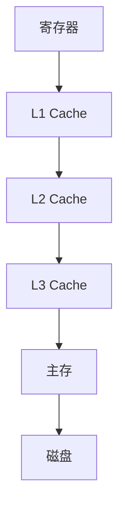

# 计算机组成原理基础

> 文章来源：综合自《计算机组成与设计》、小林coding、draveness 等技术博客，部分由 AI 整理。

「代码为什么这么慢？」「缓存为什么能让程序快百倍？」这类问题，答案藏在硬件如何执行指令、数据如何在不同速度的存储器间流动里。本文从冯·诺依曼体系讲到 CPU 流水线、存储层次与 Cache，并呼应「公共知识」里的延迟数字表，帮你建立「硬件视角」的性能直觉。

---

## 冯·诺依曼体系

现代计算机几乎都遵循冯·诺依曼模型，由五大部件组成：

| 部件 | 职责 |
| --- | --- |
| 运算器（ALU） | 算术 / 逻辑运算 |
| 控制器（CU） | 取指令、译码、发出控制信号 |
| 存储器 | 存放指令与数据（冯氏体系「存储程序」：指令和数据同等对待） |
| 输入设备 | 把外部信息送进计算机 |
| 输出设备 | 把结果呈现出来 |

> **说明**：运算器 + 控制器 = 我们常说的 **CPU**。核心思想是「存储程序」——程序和数据一样放在内存里，计算机按地址逐条取指执行，这才有了「通用计算机」。

---

## CPU 与指令执行

CPU 执行程序是一个不断重复的循环：**取指（Fetch）→ 译码（Decode）→ 执行（Execute）→ 写回（Write-back）**。

为提升吞吐，现代 CPU 用 **流水线（Pipeline）**：把一条指令拆成多阶段，不同阶段并行处理不同指令——如同工厂装配线，指令「流入」后连续产出。

> **图题：四级流水线**：第 1 条指令执行时，第 2 条已在译码、第 3 条在取指，硬件利用率大幅提升。


- **超标量（Superscalar）**：一个周期发射多条指令，进一步并行。
- **分支预测**：遇到 `if` 等分支时提前猜走向，猜错就要清空流水线、代价不小——这正是「公共知识」里「分支预测错误 5ns」的来历。
- **CISC vs RISC**：x86 是复杂指令集（CISC），ARM 是精简指令集（RISC），后者指令规整、功耗低，移动端主流。

---

## 存储层次与 Cache

「公共知识」的延迟表揭示了一个残酷事实：CPU 很快（亚纳秒），内存慢百倍，磁盘慢十万倍。若每次都直接访问内存 / 磁盘，CPU 大半时间在干等。

解决之道是 **存储层次（Memory Hierarchy）**：用少量极快的寄存器 / Cache，兜住绝大多数访问。

| 层级 | 典型容量 | 延迟量级 | 位置 |
| --- | --- | --- | --- |
| 寄存器 | 几十 ~ 几百字节 | ~0.5 ns | CPU 内 |
| L1 Cache | 几十 KB | ~0.5~1 ns | CPU 内 |
| L2 Cache | 几百 KB ~ 几 MB | ~数 ns | CPU 内 / 核共享 |
| L3 Cache | 几 MB ~ 几十 MB | ~十余 ns | 多核共享 |
| 主存（DRAM） | GB 级 | ~100 ns | 主板 |
| 磁盘（SSD/HDD） | TB 级 | ~ms | 外设 |

> **图题：存储金字塔**：越往上越快越贵、容量越小；Cache 的存在让「绝大多数访问命中快层」，整体接近最快层的速度。



> **比喻**：寄存器像你手边的草稿纸（最快），Cache 像办公桌上的常用文件，主存像身后的文件柜，磁盘像楼下的档案室——越远越慢。CPU 干活时尽量只翻草稿纸和桌面，少跑档案室。

- **局部性原理**：程序倾向于重复访问近期数据（时间局部性）和邻近数据（空间局部性）——Cache 正是赌「下一次访问就在附近 / 刚访问过」。

### 实例：一次 Cache Miss 如何拖慢程序

同样是求和，两种遍历二维数组的写法性能可能差数倍：

```java
// 写法 A：按行访问（连续内存，Cache 友好）
for (int i = 0; i < N; i++)
    for (int j = 0; j < N; j++) sum += a[i][j];

// 写法 B：按列访问（跨行跳着读，频繁 Cache Miss）
for (int j = 0; j < N; j++)
    for (int i = 0; i < N; i++) sum += a[i][j];
```

> 数组在内存里按「行」连续存放。写法 A 顺着内存读，命中率高；写法 B 每次跳一整行，容易触发 Cache Miss，要回主存取——两段代码结果相同，速度却可能差数倍。这就是「Cache 友好」比「算法优雅」更直接的性能来源。

#### Cache 映射与一致性

- **映射方式**：直接映射（一个槽位固定）、全相联（任意槽位）、组相联（折中，现代 CPU 主流）。冲突时会「Cache 缺失」，需回主存取。
- **一致性（MESI）**：多核各自有 Cache，某核改了数据要让其他核的副本失效 / 更新。**MESI** 是描述「某数据在多核 Cache 中各是什么状态」的协议——M 修改（我是唯一最新）、E 独占、S 共享、I 无效；核间通过状态转换保持数据不冲突。理解它，就理解了为什么多线程「不加锁改同一变量」会读到旧值。

> **说明**：写高性能代码时，「Cache 友好」常比「算法优雅」更关键——连续访问数组（空间局部性）远快于跳着访问链表。这也是为何数组遍历比链表遍历快得多。

---

## 指令、数据与字节序

程序编译后是机器码（二进制指令），CPU 按指令集（x86 / ARM）译码执行。

- **字节序**：多字节数据在内存的存放顺序（见「公共知识」的字节序一节）——网络传输用大端序，x86 用小端序。跨语言 / 跨网络读写二进制时务必留意，否则会出现「数字对不上」的诡异 Bug。
- **对齐（Alignment）**：数据按特定边界（如 4 / 8 字节）存放，CPU 访问更快；未对齐的访问在某些架构上会变慢甚至报错。

> **说明**：**对齐** 大白话——CPU 一次性从内存「按块」搬数据（如 8 字节），变量若正好落在块边界上，一次就能取走；若横跨两个块，就得取两次再拼，自然更慢。

---

## 输入输出（IO）

CPU 与慢速外设（磁盘、网卡）如何协作？

- **中断（Interrupt）**：外设完成操作后「打断」CPU，CPU 暂停当前工作去处理，避免忙等。键盘按键、网卡收包都靠中断。
- **DMA（直接内存访问）**：让外设 *不通过 CPU* 直接把数据搬进内存，CPU 只发命令、收中断，腾出算力做别的事。磁盘 / 网卡大量数据传输都靠 DMA。

> **说明**：中断 + DMA 把 CPU 从「盯着慢设备」中解放出来，是「操作系统」里 IO 模型（阻塞 / 多路复用 / 异步）得以成立的硬件基础。DMA 就像让快递员自己把货搬进仓库，不用你一趟趟跑。

---

## 小结与衔接

- 冯·诺依曼「存储程序」是通用计算机的根；CPU 靠取指 - 译码 - 执行循环 + 流水线提效。
- 存储层次用「少量极快 Cache」兜住绝大多数访问，局部性是它有效的根基。
- 字节序、对齐是跨语言 / 网络二进制交互的隐形坑；中断 + DMA 是 IO 的硬件支柱。
- 这些硬件事实，正是「公共知识」延迟表、操作系统虚拟内存 / Cache 行为的底层原因。

### 自测：你真的懂了吗

- 存储层次为什么「越往上越快越贵、容量越小」反而能提速？靠的是什么原理？
- 为什么「按行遍历数组」比「按列遍历」快？这跟 Cache 的哪条原理有关？
- MESI 解决的是什么问题？为什么多线程不加锁改同一变量会读到旧值？
- 中断和 DMA 各自解决了「CPU 等慢设备」的哪部分痛点？

> 衔接：虚拟内存 / 缺页在「操作系统基础」展开；分支预测代价呼应「公共知识」延迟表；字节序在「公共知识」与网络 / 序列化中反复出现；对齐与「数据结构」的内存布局相关。
