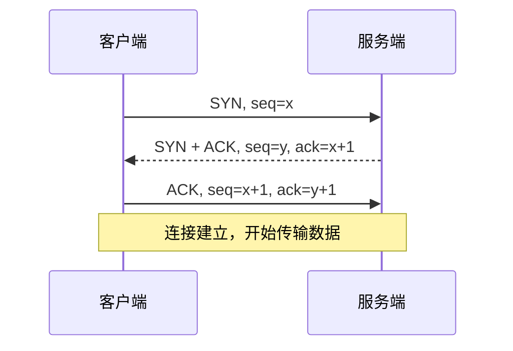
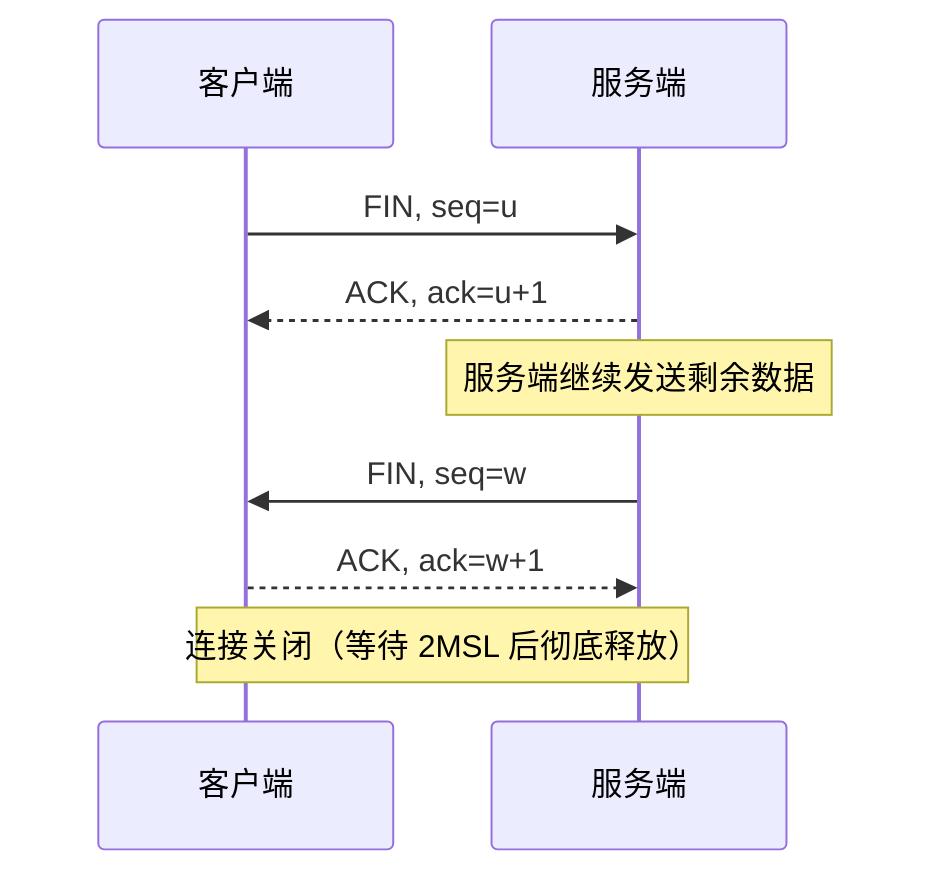

# 计算机网络基础

> 文章来源：综合自《计算机网络：自顶向下方法》、《TCP/IP 详解》、RFC 793/791 等公开资料，部分由 AI 整理。

网络解决的核心问题是：**散布在不同主机上的进程，如何可靠、高效地交换数据**。本文从分层模型入手，重点讲清 TCP 的可靠传输（三次握手 / 四次挥手），横向对比 TCP 与 UDP，再落到 IP 寻址、应用层衔接，最后用一个「浏览器输入网址」的端到端例子把四层串起来，帮你在「网络」「安全与认证」等相邻板块间建立连贯认知。

---

## 网络分层

网络通信极其复杂，分层把它拆成若干「各司其职」的层次。业界有两套经典模型：

| 层级 | OSI 七层 | TCP/IP 四层 | 职责 | 代表协议 |
| --- | --- | --- | --- | --- |
| 7 / 4 | 应用层 | 应用层 | 为用户程序提供网络服务 | HTTP、DNS、HTTPS、FTP |
| 6 | 表示层 | （并入应用层） | 编码、加密、压缩 | TLS、JSON |
| 5 | 会话层 | （并入应用层） | 会话管理 | — |
| 4 / 3 | 传输层 | 传输层 | 端到端可靠 / 不可靠传输 | TCP、UDP |
| 3 / 2 | 网络层 | 网际层 | 寻址与路由 | IP、ICMP |
| 2 | 数据链路层 | 网络接口层 | 相邻节点帧传输 | Ethernet、PPP |
| 1 | 物理层 | （并入网络接口层） | 比特流传输 | 双绞线、光纤 |

> **比喻**：分层像寄快递——你只管把信交给前台（应用层），后面打包、运输、派送各层各管一段，你不用关心卡车怎么开。每一层只跟相邻层打交道，复杂度因此可控。

> **说明**：实际工程几乎只用 TCP/IP 四层模型；OSI 七层更多是教学上的「完整参考」。记住「应用 → 传输 → 网络 → 链路」四层即可覆盖 90% 场景。段（Segment）/ 包（Packet）/ 帧（Frame）分别是传输层 / 网络层 / 链路层对数据的称呼。

---

## TCP 可靠传输

TCP 是 *面向连接、可靠、字节流* 的传输协议。它靠三件事保证可靠：**序号 / 确认（ACK）**、**超时重传**、**流量与拥塞控制**。而连接本身由「三次握手」建立、由「四次挥手」关闭。

### 三次握手（建立连接）

> **图题：TCP 三次握手**：双方各确认一次「我能发、你能收」，避免历史失效连接浪费资源。

- 第 1 次：客户端发 `SYN`，进入 `SYN_SENT`。
- 第 2 次：服务端回 `SYN+ACK`，进入 `SYN_RCVD`（此时服务端为该连接预留资源）。
- 第 3 次：客户端回 `ACK`，双方进入 `ESTABLISHED`。

> **比喻**：三次握手像打电话——「喂？」（SYN）、「听得到，你听得到我吗？」（SYN+ACK）、「听得到，那我开始说了」（ACK）。前两次确认「双向通路都在」，第三次避免你对着一个早已挂断的号码空讲。

> **说明**：为什么是三次而不是两次？两次握手时，若客户端早已失效的旧 `SYN` 迟到，服务端会误建连接并空等，浪费资源。第三次握手让服务端确认「客户端真的收到了我的 SYN」，再正式建连。

### 四次挥手（关闭连接）

> **图题：TCP 四次挥手**：TCP 全双工，关闭时需双向各关闭一次，故比握手多一次。

> **注意**：主动关闭方在发完最后 `ACK` 后，会进入 `TIME_WAIT` 并等待 `2MSL`（报文最大生存时间的两倍）。这是为了让迟到的旧报文消亡、并确保被动方收到 ACK，避免端口被立即复用后收到脏数据。高并发短连接（如大量 HTTP 请求）下 `TIME_WAIT` 过多会占满端口，是常见调优点。

### 可靠性机制

- **滑动窗口**：接收方告知「还能收多少」（窗口大小），发送方据此连续发送，不必每发一个等一个 ACK，提升吞吐。
- **拥塞控制**：网络拥塞时主动降速，核心是 *慢启动*（指数涨到阈值）→ *拥塞避免*（线性涨）→ 丢包时回退。目标是「别把网络冲垮」。

---

## TCP 与 UDP 对比

| 维度 | TCP | UDP |
| --- | --- | --- |
| 连接 | 面向连接（握手 / 挥手） | 无连接 |
| 可靠性 | 可靠（确认 / 重传 / 有序） | 尽力交付（可能丢、乱序） |
| 速度 | 慢（开销大） | 快（头部仅 8 字节） |
| 流量控制 | 有（滑动窗口） | 无 |
| 适用场景 | 网页、文件、接口（HTTP/MySQL） | 视频、语音、游戏、DNS 查询 |

> **比喻**：TCP 像打电话（先接通、确认对方在、按顺序说）；UDP 像发短信（发了就完，不管对方收没收到、顺序对不对）。UDP 并非「更差」，而是「更轻」——在能容忍少量丢包、却要求低延迟的场景（直播、实时音视频、DNS）里它更合适，可靠性的活儿可以上移到应用层自己做。

---

## IP 与寻址

**IP（网际协议）** 工作在网络层，负责把数据包从源主机送到目的主机，核心是 *寻址* 与 *路由*。

- **IPv4**：32 位地址，约 43 亿个，早已不够用；**IPv6**：128 位，解决地址耗尽并简化头部。
- **子网掩码（Subnet Mask）**：与 IP 做「按位与」得到 *网络号*，区分「本网段」与「跨网段」，决定要不要走网关。
- **NAT（网络地址转换）**：让内网多台机器共用一个公网 IP 上网，是 IPv4 续命的关键技术（也是为何内网服务要「端口映射」才能被外网访问）。

> **说明**：IP 只管「尽力送到」，不保证可靠、不乱序——这些恰恰是上层 TCP 补齐的。理解「IP 负责可达、TCP 负责可靠」，就抓住了网络层与传输层的分工。

---

## 应用层衔接

传输层之上才是日常打交道的应用协议。下面用一个端到端例子把它们串起来。

### 端到端串讲：浏览器输入网址到页面呈现

以访问 `https://www.example.com` 为例，背后是一次四层模型的接力：

1. **DNS 解析**：浏览器把域名交给 DNS（通常基于 UDP），拿到服务器 IP——「输入网址」的第一步其实是「查到 IP」。
2. **TCP 握手**：与服务器三次握手，建立可靠连接。
3. **TLS 握手**：若是 HTTPS，再协商密钥、验证证书（详见「安全与认证」的 HTTPS/TLS 专题）。
4. **发送请求**：HTTP 请求经 TCP 分段、IP 寻址、链路层封装发出。
5. **返回与渲染**：服务器响应原路返回，浏览器解析并渲染页面。

> 一张网页的背后，是 DNS + TCP + TLS + HTTP 在四层模型上的接力。哪一层出问题，表现可能是「域名解析失败」「连接超时」「证书不安全」或「页面空白」。

### 自测：你真的懂了吗

- 为什么握手三次、挥手四次？各自在防什么？
- `TIME_WAIT` 存在的意义是什么？什么场景下它会成为问题？
- TCP 和 UDP 各自的适用场景，举一个你用过的例子。
- 子网掩码是用来干嘛的？为什么内网服务要「端口映射」才能被外网访问？

---

## 小结与衔接

- 分层让复杂网络可治理：应用 → 传输（TCP/UDP）→ 网络（IP）→ 链路。
- 三次握手建连、四次挥手断连，可靠性由序号 / 确认 / 重传 / 窗口共同保证。
- TCP 可靠、UDP 轻快，按场景取舍；IP 管可达、TCP 管可靠。
- 一个网址的访问，是 DNS / TCP / TLS / HTTP 在四层上的接力。

> 衔接：握手挥手、TIME_WAIT 调优在「网络」群组的 TCP 专题深入；HTTPS 的 TLS 握手在「安全与认证」展开；DNS 解析细节可单独成篇补入「网络」分组；IPv4 耗尽与 NAT 是「基础设施 / 网络」运维的常客。
