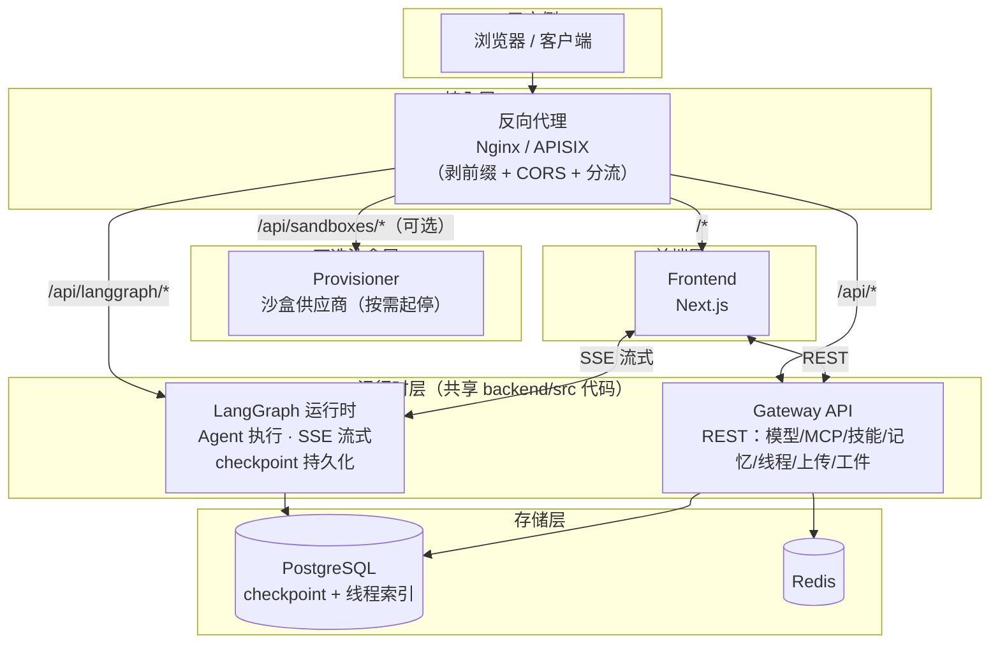
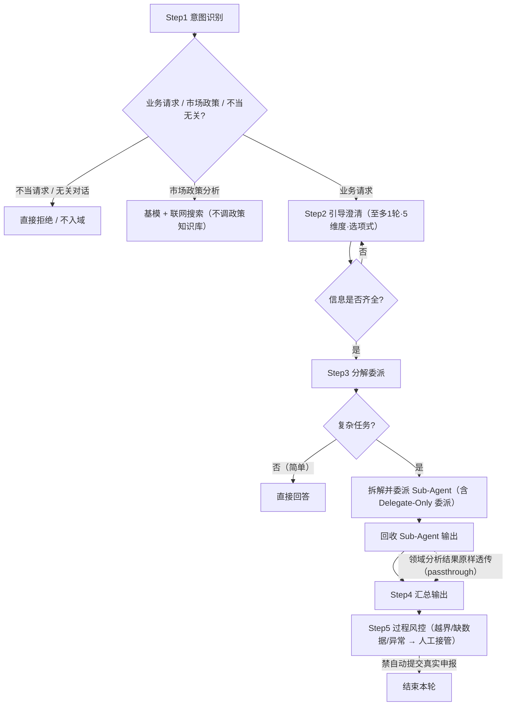
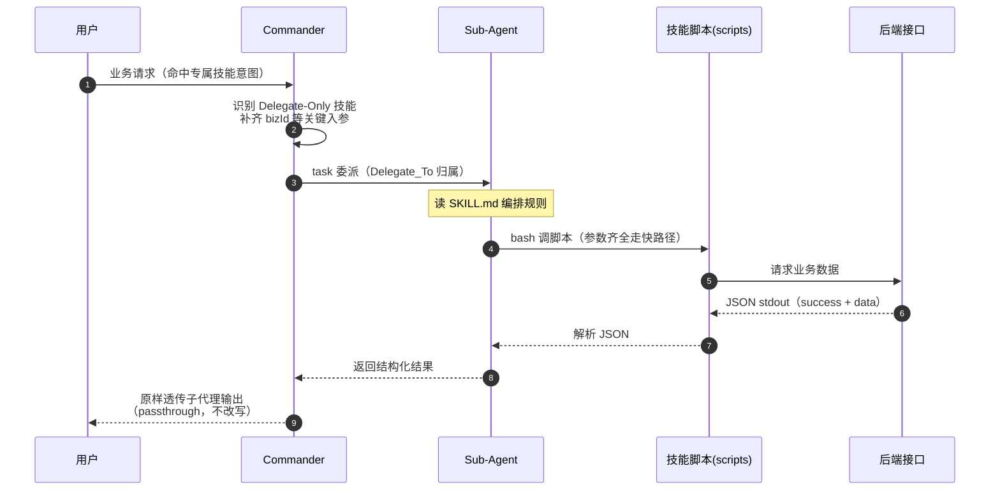
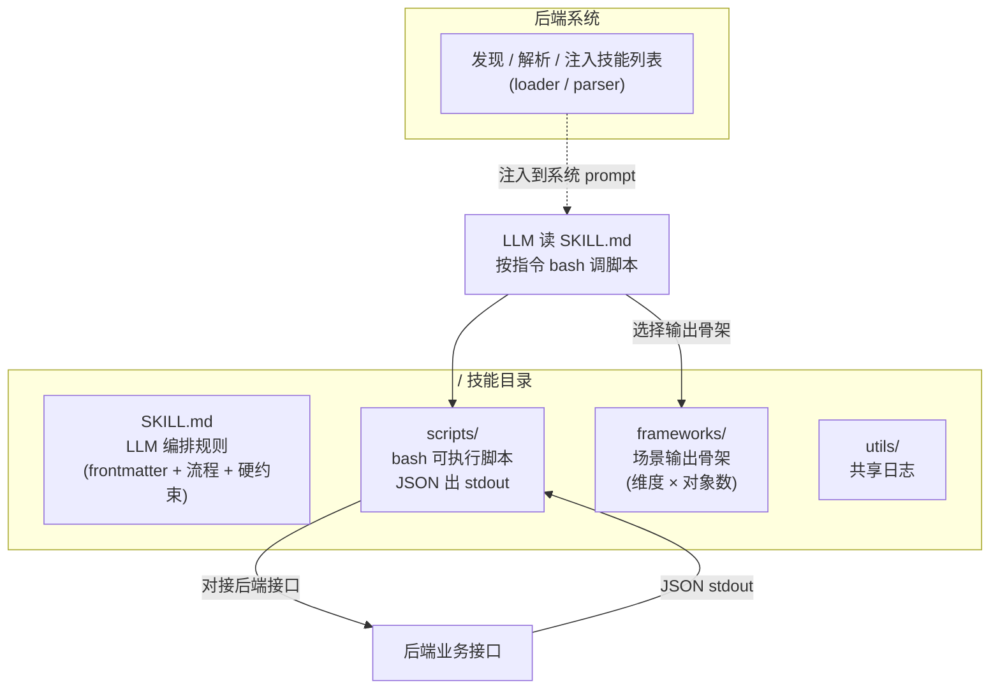
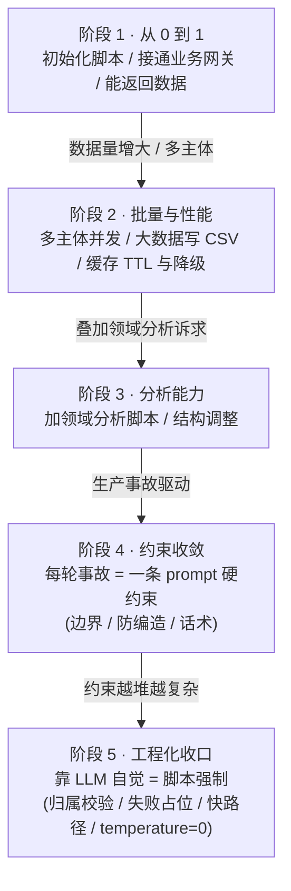
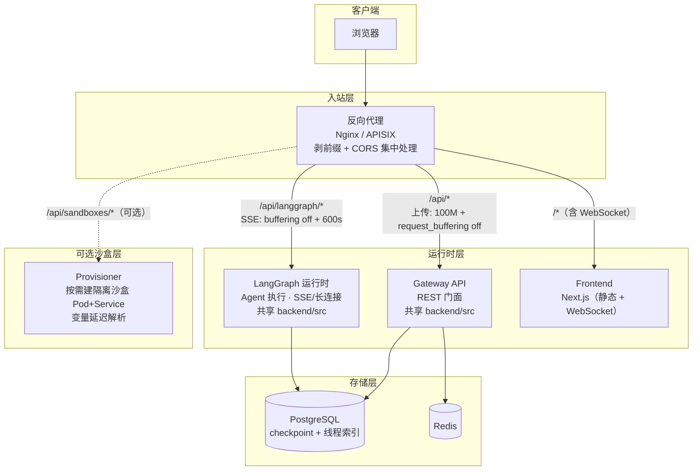

# 基于通用 LLM 超级代理框架的领域增强定制实践

> 阅读对象：需要把一个通用 AI 超级代理框架（LangGraph + FastAPI + Next.js 参考实现）深度改造成某个垂直业务领域的智能助手，并沉淀可复用工程经验的团队。
> 说明：本文介绍如何把一个通用 AI 超级代理框架（以 LangGraph + FastAPI + Next.js 为参考实现）深度改造成某个垂直业务领域的智能助手。文中架构与示例（`bizId`、客户机构、授信画像等）均为**普适性示例**，可迁移到金融、能源、政务等任意领域（方法见附录 A「场景射影表」）。

**目录**

- [快速导览与术语](#快速导览与术语)
- [背景：从通用框架到领域智能体](#背景从通用框架到领域智能体)
- [后端 Agent 层：Commander 总控](#后端-agent-层commander-总控)
- [能力层：技能、中间件与模型补丁](#能力层技能中间件与模型补丁)
- [子代理与前端产品化](#子代理与前端产品化)
- [基础设施与私有化](#基础设施与私有化)
- [关键启发与技能开发实战](#关键启发与技能开发实战)
- [部署、排障与附录](#部署排障与附录)

---

## 快速导览与术语

### 快速导览（给人和给 AI 的回车键）

| 你想解决什么问题 | 跳到哪一节 | 那节告诉你什么 |
|---|---|---|
| 怎么让 Agent 有"业务总控"而不是只会拆任务 | [后端 Agent 层](#后端-agent-层commander-总控) | Commander 五步流程、专属技能委派 |
| 怎么让 LLM 查业务数据而不是编数据 | [能力层](#能力层技能中间件与模型补丁) | 技能三层架构、防幻编四抓手 |
| 怎么让"子代理算出的结果原样到用户面前" | [能力层](#能力层技能中间件与模型补丁) | 透传中间件 + 假流式模型 |
| 怎么让"某段规则只在特定时刻才生效" | [能力层](#能力层技能中间件与模型补丁) | 门控中间件按场景 strip prompt 段 |
| model 开启思考后多轮报错怎么办 | [能力层](#能力层技能中间件与模型补丁) | 子类覆写请求封装 |
| 流式渲染大 HTML 表格怎么不卡 | [子代理与前端产品化](#子代理与前端产品化) | rehypeRaw + 分段结构化渲染 |
| 全局：哪些边界坑必踩 | 各节的"关键坑"行 | 每节都标了红色关键坑 |
| 我要新写一个业务技能，有哪些该一口气做对 | [关键启发与技能开发实战](#关键启发与技能开发实战) | 技能开发流程 + 大数据量处理 + 迭代演进五阶段 |
| 技能加载数百上千条数据会不会把上下文塞爆 | [关键启发与技能开发实战](#关键启发与技能开发实战) | 超阈值写 CSV + 下游脚本分析，不进上下文 |
| 部署上线最容易在哪几个地方翻车 | [部署、排障与附录](#部署排障与附录) | 部署架构 + 排障清单（现象→改法→为什么）|
| 我要复刻一个能连真实数据的技能，怎么对接接口 | [部署、排障与附录](#部署排障与附录) | 请求/响应契约模板 + 复刻顺序 |
| 技能 stdout 到底该输出什么形状，怎么让 LLM 判读 | [部署、排障与附录](#部署排障与附录) | 逐技能 JSON Schema + 通用信号约定 |

### 图例索引

（全文 Mermaid 图一览，均就近放置于对应章节：）

| 图 | 名称 | 所在区块 | 用途 |
|---|---|---|---|
| 图 1 | 整体架构图 | [背景](#背景从通用框架到领域智能体) | 浏览器到后端四服务的总体分流 |
| 图 2 | Commander 五步流程 | [后端 Agent 层](#后端-agent-层commander-总控) | 意图识别→澄清→分解委派→汇总→风控 |
| 图 3 | 中间件链示意 | [能力层](#能力层技能中间件与模型补丁) | 严格顺序 + 各中间件触发条件 |
| 图 4 | 技能 结构/委派时序 | [能力层](#能力层技能中间件与模型补丁) | 技能目录三层 + 专属委派调用流 |
| 图 5 | 部署拓扑图 | [部署、排障与附录](#部署排障与附录) | 反代层/运行时层/存储层拓扑 |
| 图 6 | 技能迭代生命周期 | [关键启发与技能开发实战](#关键启发与技能开发实战) | 五个演进阶段的状态迁移 |

不用 Mermaid 时，正文保留等价的 ASCII 结构图作兜底。

---

### 术语表

> 为方便人和 AI 统一理解，本文共用这套名词。括号内为它在下文代码示例里的具体代号。

| 名词 | 含义 | 备注 |
|---|---|---|
| **Commander** | 领域总控主 Agent，负责意图识别→澄清→分解委派→汇总，而非泛泛编排 | 对上游"lead agent"的改造 |
| **Sub-Agent（子代理）** | 被 Commander 用 `task` 委派出去的专用 Agent（如风险分析师） | 有视角隔离 |
| **Delegate-Only Skill（专属技能）** | 打标记"仅某子代理可执行"的技能，Main 不允许自读，必须委派 | 见「专属技能委派机制」 |
| **bizId** | 示例业务主体的唯一 ID，泛指"业务对象 ID" | 泛化标识 |
| **SKILL.md** | 技能目录里的编排规则文件（frontmatter + 流程 + 硬约束） | LLM 读它 |
| **scripts/** | 与后端接口对接的可执行脚本，JSON 出 stdout | bash 调它 |
| **frameworks/** | 按"维度×对象数"组合的**输出骨架模板**（markdown） | 见「结构化输出契约」 |
| **rehype / Streamdown** | 前端 Markdown→HTML 渲染管线插件体系 | 见「HTML 表格的流式渲染管线」 |
| **Checkpoint（LangGraph）** | LangGraph 的对话状态持久化机制 | 与「双层线程存储」配合 |
| **reasoning_content** | 部分模型思考内容字段，需补丁保留它在多轮上下文 | 见「模型补丁」 |

---

## 背景：从通用框架到领域智能体

通用超级代理框架给了可复用骨架：基于图的 Agent 运行时、多工具中间件链、沙盒执行、子代理委派、持久化记忆、MCP/技能扩展、前端流式对话。但落到具体垂直领域（金融、能源、政务…），要补齐**四类领域增强**：

1. **领域 Agent 人格与编排**：从"通用编排器"升级为"领域总控 Commander"，具备意图识别、澄清引导、任务分解、委派调度、结果汇总的**结构化业务流**。
2. **业务数据能力**：把领域业务数据抽象为**技能（Skill）+ 脚本（Scripts）**，让 LLM 调脚本拿到**可核验数据**，而非靠模型编造。
3. **确定性输出保障**：通过 prompt 硬规则 + 中间件在运行时强制，约束 LLM 的胶水层（格式化、透传、防幻编、防越权）。
4. **私有化可观测与基础设施**：Nacos 配置/服务发现、双层线程存储、链路追踪（Langfuse/LangSmith）、思考内容/思考时长等产品化体验。

下面按"Agent → 技能 → 中间件 → 模型 → 子代理 → 前端 → 基础设施 → 清单"展开。

**整体架构一览**（后续各章将逐步拆解每块）：



> 端口作架构示意：反代 `2026`、LangGraph `2024`、Gateway `8001`、Frontend `3000`、Provisioner `8002`。LangGraph 与 Gateway 共享同一套 `src/` 代码，是"运行时"与"REST 门面"的分工。

---

## 后端 Agent 层：Commander 总控

### 从通用编排到领域总控

上游的 lead agent 是通用任务编排器（拆解→并行委派→汇总）。领域化把它改成 **Commander 总控**：在系统 prompt 末尾追加多个**可插拔的领域 prompt 段**（每段一个 `<tag>` 块，函数返回字符串做简单拼接）：

```python
system_prompt = build_base_prompt(...)                  # 通用骨架：role / guardrails / 思考风格 / 技能列表
    + get_commander_prompt()                            # 总控流程 Step1~Step5
    + get_credit_risk_prompt()                          # 领域A：客户风险画像 的路由+委派规范
    + get_portfolio_prompt()                            # 领域B：授信组合分析 的路由+委派规范
    + get_risk_threshold_prompt()                       # 领域A 的追问阈值块（可被中间件按需门控）
    + get_credit_query_prompt()                         # 领域C：授信策略只读查询 路由
    + get_credit_strategy_prompt()                      # 领域C：授信策略生成 路由
```

**要点**
- 每个领域 prompt 段**自成一体、职责单一**，按业务模块增删。想让某能力灰度下架，直接注释掉对应段即可。
- 各段之间用**高优先级路由规则排他判定**（如"先判风险 vs 组合，再判简单/复杂"），避免多段规则打架。
- 安全红线（防注入、拒政治、拒敏感、内部信息不泄漏）放进**通用 guardrails**，独立于业务段。

### Commander 五步流程（可复用的业务流转模型）



**要点**：澄清若缺关键业务上下文，用 `ask_clarification` 中断本轮、列真实可选项；问数/画像/组合类缺参数时**禁止降级口述数字**。

```
Step1 意图识别 —— 业务请求 / 市场政策分析 / 不当请求&无关对话，三类分流
Step2 引导澄清 —— 至多 1 轮、至多 5 个维度；必须给 2-5 个示例选项，禁开放式问题
Step3 分解委派 —— 简单任务直接答，复杂任务拆解并委派 Sub-Agent
Step4 汇总输出 —— 结构化工整；特殊领域命中"原样透传"例外
Step5 过程风控 —— 越界/缺数据/异常集中时主动提醒人工接管；禁自动提交
```

关键工程点：

- **澄清必须"基于真实数据"**：缺业务主体时，规范要求先 bash 调数据技能拉用户**真实可选项列表**，再以此构造 `ask_clarification` 的 options，"禁止编造示例名称"。直接根除 LLM 澄清时幻编选项的通病。
- **防编造数值统一口径**：凡问数类回答，数值"必须来自数据技能或 Sub-Agent stdout"；参数未齐或查询未成功时"只说明缺什么或失败"，禁止降级口述数字。
- **降级策略分两类**：非问数任务可降级执行并说明假设；问数/画像/组合类缺关键上下文时**禁止降级**，须再澄清或明确无法查询。

### 专属技能委派（Delegate-Only Skill）机制

本方案最有特色的模式，解决"某些能力被刻意隔离给特定子代理执行"：

- 技能描述打标记"**仅 X Sub-Agent 可执行**"，注入系统 prompt 的 `<skill>` 列表并带 `<delegate_to>` 归属。
- 命中这类技能时，即使只有 **1 个子任务**，主 Agent 也必须 `task` 委派，不得自己 `read_file` 技能或直接调其工具链——前端才能渲染"Sub-Agent 子任务卡片"，对用户透明。
- 收益：① 领域分析复杂 prompt/脚本不污染主 Agent 上下文；② 主 Agent 是"编排器 + 整合器"，深度逻辑收敛在专门子代理；③ 天然产出可视化的子任务执行过程。

**专属委派时序**（命中 Delegate-Only 技能时的调用流）：



---

## 能力层：技能、中间件与模型补丁

以下三块共同构成给 Agent 的"领域能力"：技能层（数据怎么查）、中间件层（关键规则怎么在运行时强制）、模型补丁（厂商思考字段怎么保留）。

### 技能层：SKILL.md + scripts + frameworks 三层架构

#### 领域技能统一范式



所有业务数据能力以"技能"形式存在，每个技能目录三层：

```
skills/custom/<skill-name>/
├── SKILL.md        # LLM 编排规则（YAML frontmatter + 流程 + 硬约束）
├── scripts/        # bash 可执行脚本（对接后端接口，JSON 出 stdout）
├── frameworks/     # 场景输出骨架模板（按"维度×对象数"区分）
└── utils/          # 共享日志等
```

- 技能**不是后端独立执行的程序**，而是「LLM 读 SKILL.md → 按指令 bash 调脚本 → 解析 stdout」的驱动模式。后端只负责发现/解析/注入技能列表，执行主体是 LLM。
- 脚本统一以 **JSON 输出到 stdout**（`success` 标识成败、失败带 `error`），供 LLM 解析。

> **关键坑**：环境里若配置了 Python `sitecustomize` 启动噪音，可能在脚本 stdout 泄出，解析前需要剥离开头噪音行，否则 JSON 解析失败。

#### 三种可复用的结构化输出契约

领域数据类技能最终产出给用户，需要稳定、可被前端解析的格式，沉淀出三种契约：

| 契约 | 典型用途 | 结构示例 | 前端消费 |
|---|---|---|---|
| **HTML 表格** | 稠密明细（如 24 档逐时指标） | `<table class="risk-stream">`，异常行 `<tr class="pa-row-abnormal">` | 流式逐块渲染 + 完成态结构化表格 |
| **HTML 注释标记段** | 提取"一句话结论/数据摘要" | `<!-- SUMMARY_START -->...<!-- SUMMARY_END -->` | 前端据标记精确提取 |
| **固定列序的 Markdown 表** | 结构化策略/建议输出 | 固定表头列序、缺失值统一 `--` | 直接展示 |

契约要点：
- HTML 表 + 类名标记 → 前端对该技能内容走专门渲染分支（见 9.4）。
- 注释标记段 → 把"模型生成的自然语言结论"用程序可读注释包裹，前端按标记提取，不靠脆弱正则。
- 固定 Markdown 表 → 约束列名/顺序一字不差、缺失值用 `--` 而非 `0`/`null`，消除语义二义。

#### 防 LLM 幻编的四个抓手（最值得复用）

领域数据查询最怕 LLM 编造参数或数字，用四层机制层层设防：

1. **参数值只看前置接口返回**：分类码只能来自"目录/详情"接口返回；`userId` 只取 `<user_context>`；`bizId` 必须经"名称→ID 映射"接口精确匹配。禁止凭记忆填参。
2. **脚本内置归属/合法性硬校验**：取数脚本查询前先校验"请求的主体是否属于当前客户机构"，不在列表立即抛错终止；同时校验参数合法性（维度枚举、跨度上限）。
3. **失败写占位符防"自救"**：取数失败时脚本用 error 占位覆盖旧的缓存文件，防止子代理读到历史数据"自我救活"产生伪正确结果。
4. **SKILL.md 零容忍规则 + 语义化话术**：明确"用户没指定维度就强制 `❌` 追问、禁止默认填充"；把缺失项转成面向用户的**语义化提问**（禁输出内部参数名），避免技术词泄漏。

#### 边界建模：只承认两种场景 / 仅支持单对象

领域常有"能力边界"，要明确建模到 prompt 与脚本，避免 LLM 钻空子：

- **只承认两种场景**：单主体分析 / 多主体一起分析；**不存在**"多主体逐个单独分析"的中间场景。多主体必须一次脚本调用 + 按 `*-multi` 框架输出一份整体报告，**禁止**循环 N 次单查。
- **仅支持单对象**：涉及多个对象/跨期对比时，禁止拆成 N 个并行 task，直接回复"仅支持单对象"并用澄清工具让用户指定一个。
- **这类约束要落在 4 处**（SKILL.md + Sub-Agent prompt + Commander prompt + 中间件）多重兜底，防 LLM 从自定义 prompt 路径绕过。

---

### 中间件层：用 runtime 机制强制 prompt 规则

Prompt 规则是"建议"，会因换模型、超上下文、用户引导而走偏。本方案把**最关键的产品规则下沉到中间件**在运行时强制——从"提示工程"走向"机制工程"。

#### 思考时长中间件（ThinkingTimeMiddleware）

**目标**：前端实时展示"正在思考 / 已用时 X"。

- `abefore_agent()`：记录起始时间，推自定义 SSE 事件 `{"type":"thinking_started"}` 给前端，锚定用户可感知的 T0（比前端等 isLoading 翻转更快、更准）。
- `awrap_model_call()`：在每条 AIMessage 的 `additional_kwargs["thinking_time_ms"]` 打上端到端耗时（含工具执行与子代理阻塞时间），随 checkpoint 持久化（刷新浏览器不丢）。

> **关键坑**：T0 用 **state 字段传递而非 contextvar**。LangGraph 中 `abefore_agent` 与 `awrap_model_call` 运行在不同 contextvars 上下文，跨 hook 传变量会拿不到。

#### 子代理结果"原样透传"中间件（PassthroughMiddleware）

**目标**：当某种领域分析（如授信画像）完成后，主 Agent 不做任何改写，把子代理脚本输出**逐字流式**呈给用户，保证数字不被 LLM 改写、表格不被破坏。

实现手法（三步）：

1. **识别**：从最近一条 AI 消息的 `task` 工具调用 + 对应 tool 结果，判断是否"该领域分析任务"（按 prompt 关键词识别 taskType）。
2. **清洗**：`sanitizer` 截断 HTML 表 `</table>` 之后的杂质、剥掉 Python 启动噪音行；画像类要求**必须含 `<SUMMARY_START>` 标记**才透传（判定完整性）。
3. **伪造一个"逐字流式 ChatModel"**：命中透传时，中间件把请求的 model **换成 `VerbatimPassthroughChatModel`**——它忽略输入，把预计算 payload 按小块、带间隔离散 `chunk` 逐字流式产出，满足 LangGraph `stream_mode="messages"` 契约，前端看到真实"打字机"效果（直接返回整条 `AIMessage` 会让表格整块闪现）。

> **启发**：想让"子代理的确定性输出原样到达用户"（表格/报告/JSON）又必须走 LLM 流式管线时，"假模型占位"是绕过生成、保留流式契约的优雅方案。

#### 阈值规则"按上下文门控注入"中间件（ThresholdGateMiddleware）

**目标**：某段 prompt 规则（如评级分档阈值）只在特定时刻让模型看到，避免非场景下误用或画蛇添足。

- 把阈值块编进系统 prompt，但用中间件在 `before_model` 阶段**判断是否剔除**：仅当"历史已有画像表 + 本轮无发起词 + 点到具体档位 + 带'为什么/异常'意图"四条件同时满足才保留，否则 strip 掉。
- 效果：初次画像输出后，模型**不会**自动在表后追加解读；只有用户明确追问时才看到并套用阈值解释。

#### 并发子代理截断中间件（SubagentLimitMiddleware）

- prompt 里反复强调"每轮最多 N 个 task"，但更可靠是在 `after_model` 阶段**数工具调用、超过就丢弃多余**。硬限比"请求"可靠。

#### 中间件链的严格顺序

领域定制会在上游链条基础上插入自己的中间件，顺序敏感。示意链：


> **注**：Clarification 中断中间件必须最后；透传/门控要放在澄清之前、且在模型 wrap 阶段正确分层。顺序错误会导致拦截时机偏晚或与澄清冲突。上方 `(可选)`/`(plan 模式)`/`(视觉模型)`/`(子代理启用)` 标注为该中间件的**触发条件**，不满足则不在链中。

---

### 模型补丁：多轮对话中保留"思考内容"

#### 问题

接入带深度思考（reasoning/thinking）的模型后，开启 thinking 时**多轮对话可能报错**：部分厂家 API 要求所有 assistant 消息都携带 `reasoning_content`，而上游 OpenAI 兼容封装不识别该字段，导致上一轮思考内容丢失、后续请求异常。

#### 解法：子类覆写请求封装

```python
class PatchedChatModel(BaseChatModel):
    # 1) 上游已把响应里的 reasoning_content 写进 AIMessage.additional_kwargs["reasoning_content"]
    # 2) 覆写 _get_request_payload()：从历史 assistant 消息取上轮 reasoning_content，
    #    按"位置对齐"或"assistant 计数"写回本次请求体，保证每条 assistant 都带思考内容
```

- 前端据此从 `additional_kwargs.reasoning_content` 提取并渲染思考折叠面板（见 9.x）。
- 关键提醒：**不要**直接用过度简化的 OpenAI 兼容类（会静默丢弃 reasoning_content）；字段命名差异（`base_url` vs `api_base`）也要按子类约定对齐。

> **泛化启发**：凡"大模型厂商新增 / 上游封装未识别的字段"，优先用"继承模型类 + 只覆写封装修复方法"的小补丁，而非大改调用链。

---

## 子代理与前端产品化

### 子代理（Sub-Agent）定制

#### 领域子代理配置模板

新增一个领域子代理 = 注册 `SubagentConfig`：名称、描述（让主 Agent 识别委派时机）、system_prompt（全套领域规则）、`tools/disallowed_tools`（越权封禁）、`skills`（注入的子技能白名单）、模型与超时。

典型领域子代理（示例"风险分析师"）设计要点：

- **只读约束**：`disallowed_tools` 封禁 `write_file`/`str_replace`/`task`（禁再委派）/`present_files`，但**保留 `bash`** 以执行技能脚本。能查数、能分析，不能改业务、不能再嵌套。
- **技能白名单**：只注入本领域相关技能，隔离无关能力、省上下文。
- **模型继承 + 确定性**：`model="inherit"` 继承主 Agent 模型；`temperature=0` 收窄随机性；`max_turns` 设上限防死循环；`timeout` 匹配领域计算耗时。
- **输出自检清单**：内嵌 Mandatory 自检（章节顺序、标记唯一、一句话总结、数字来源），提交前逐项自检，不通过重来。
- **越权与脱敏**：明确"即使客户要求贴原始接口数据也必须拒绝"、禁止输出内部字段名——数据安全硬约束。

#### 主 Agent 与领域子代理的分工

- **主 Agent**：预解析 `bizId`（拉真实列表匹配）、补齐关键入参后 `task` 委派；参数齐全后子代理**只跑一条脚本快速通道**，避免无谓分步与重复读文件。
- **子代理**：认 task 里固定的参数字段，一般**不自查主体列表**（省时），只在参数缺失时按要求语义化提问。

---

### 前端产品化定制

#### 思考时长实时展示

- **契约**：后端推 `thinking_started` 自定义 SSE → 前端 `onCustomEvent` 锚定 `agentStartRef`（`??=` 保证不向后跳）作为 T0；完成态取 `additional_kwargs.thinking_time_ms`（后端纯计算）。
- **实时秒表**：avatar 组件 thinking 态起 `setInterval(100ms)` 累计 `elapsedMs`；完成后显示 `max(后端耗时, 本地计时)`，避免数字回退。
- **两个崩溃修复经验（很关键）**：
  1. **只给"当前 run"的组渲染计时器**：遍历历史逐条起计时会触发 React max-update-depth 崩溃。做法：`index > lastHumanGroupIndex` 才渲染 thinking 态。
  2. **不在渲染期 setState**：从消息推导状态必须在 `useMemo` 完成、`useEffect` 同步；用 `taskSyncKey` 稳定指纹门控重放，防止长线程重复同步死循环。

#### 模型选择器 + 深度思考开关

- 从后端 `/api/models` 拉模型列表，前端 Select 展示（`display_name`），元数据带 `supports_thinking`。
- 模式枚举 `flash/thinking/pro/ultra` 映射到 `thinking_enabled`、`is_plan_mode` 两个运行时 flag。
- 切到延迟敏感（flash）型号**默认关思考**；模型不支持思考时自动降级 + tooltip，且有去重 guard 防重复闪烁。

#### Sub-Agent 子任务卡片

- 前端消费 `task_running` SSE（把 `task` 工具调用转成卡片：标题「{SubAgentLabel}：{description}」、状态图标、推理/toolCall 步骤、结果 markdown）。
- **双通道合并**：流式 context 态（快）+ 从线程消息 `deriveSubtaskUpdates` 推导态（稳、首帧兜底）。按 task tool 结果前缀判终态（`Task Succeeded. Result:` → completed）。
- i18n 注册领域子代理名（如"风险分析师 / 授信策略 Agent"）。

#### HTML 表格的流式渲染管线

这是"后端透传 + 前端结构化渲染"配合的典型：

- **流式阶段**：检测到内容含 `risk-stream` 类名 → 直接走 Streamdown `MessageResponse` + `rehypeRaw`，由**浏览器增量解析 HTML**（避免每个 token 都触发 React 正则重建整表，卡顿根源）；并叠 `rehypeSplitWordsIntoSpans` 逐词 fade-in（中文用 `Intl.Segmenter` 分词）。行内加 `animation: none !important` 防词动画污染表格单元格。
- **完成阶段**：把 `<table` 之前 summary 文本正常渲染，表格交给 `StreamTable` 组件：`useMemo` 解析（不随 token 重建 DOM）、动态找目标列高亮、异常行按 class 标红。

---

## 基础设施与私有化

### 双层线程存储（PostgreSQL 线程索引）

- **LangGraph checkpoint 继续存全量对话状态**；Gateway 额外维护一张**轻量线程索引表**（thread_id/user_id/title/created_at/updated_at/deleted_at），只服务侧边栏列表、重命名、搜索。
- 前端线程列表/重命名/删除统一走 Gateway `/api/threads`，**不再把 `threads.search` 当侧边栏持久化来源**。
- 实现点：`INSERT ... ON CONFLICT(thread_id) DO UPDATE`（upsert + 软恢复）、软删除、`title ILIKE` 搜索、`ORDER BY updated_at DESC`。

### 配置中心 + 服务发现 + 即时改技能

- **Nacos 配置中心**：拉取通用 + 业务两份配置并入环境变量；本地开发优雅降级（无地址时静默跳过）。
- **Nacos 服务注册**：后端启动自注册、可注销。
- **运行时改技能/MCP**：Gateway `PUT` 写 `extensions_config.json`，LangGraph Server 靠 **mtime 检测**感知变更并重载——不改一行重启。

### 链路追踪（Langfuse / LangSmith）

- 支持双平台但**互斥**，Langfuse 优先；配置从环境变量读。
- 模型工厂自动附加 handler，子代理经同一工厂自动继承追踪。
- 把 handler 注入 `RunnableConfig.callbacks` 经 LangGraph 传播，使中间件/子代理全覆盖；元数据注入 agent_name/model_name/user_id/thread_id。

---

## 关键启发与技能开发实战

### 关键启发与落地清单

1. **Prompt 分层**：guardrails 骨架 | Commander 编排 | 各领域路由段 | 阈值门控段。段间排他路由。
2. **能力收敛到技能 + 脚本**：业务"查"用 bash 脚本（可核验），"说"交给 LLM，防模型编数。
3. **防幻编四抓手**：参数只看前置接口返回；脚本内置归属校验；失败覆盖缓存防自救；prompt 零容忍 + 语义化话术。
4. **机制 > 提示**：关键规则下沉中间件（透传/门控/并发截断/思考时长），运行时强制。
5. **确定性输出三层契约**：HTML 表 + 类名、注释标记段、固定列序表——各有前端消费方。
6. **模型厂商字段补丁**：继承模型类 + 覆写请求封装，适配 reasoning_content 多轮回传。
7. **透传的"假流式模型"**：让确定性输出既原样到达、又满足流式契约。
8. **渲染期禁 setState / 只给当前 run 起计时器**：React 19 流式长线程两条防崩溃铁律。
9. **边界建模多重兜底**：单日/多主体等场景约束落在 SKILL + Sub-Agent + Commander + 中间件四处。
10. **私有化必需**：双层线程存储、Nacos（配置+注册+热改）、Langfuse/LangSmith 互斥追踪。

---

### 技能开发与迭代实战

技能不是"写个脚本就完事"，它在项目里经历了多轮迭代才收敛。这一节沉淀技能**开发的正确姿势、大数据量处理、以及它从草稿到稳定的演进规律**，供新技能开发直接复用。

#### 新技能的推荐开发步骤

按以下顺序，能避免绝大多数的返工：

1. **先定义对外产品口径**：能力对客户叫什么（如"XX 分析能力"），**严禁**暴露 skill、bash、内部路径。写在 SKILL.md 顶部。
2. **写清 When to Use / When NOT to Use**：把"该走本技能"的信号词、"不该走本技能"的反例（常见混淆场景）都列出来，LLM 才不会误路由。
3. **锁定必填上下文来源**：每个参数从哪来（`<user_context>`？Commander 委派说明？前置接口），禁止编造。
4. **脚本 + 契约并行开发**：先定"JSON 出 stdout 的成功/失败契约"，再写脚本；SKILL.md 的决策规则（何时停 / 何时提示重试）与脚本 `success`/`Exit Code` 信号一一对应。
5. **配 Sub-Agent 委派 + 白名单**：领域能力收敛到专用子代理，`disallowed_tools` 封越权、`skills` 白名单隔离、`temperature=0` 收随机。
6. **一次到位做大数据量分流**（见 12.3），别等"数据多了再补"。

> **关键坑**：技能在系统中按**名称注册**，改名要同步改脚本路径和引用它的 prompt。曾因改名漏同步导致运行时找不到技能。

#### 技能脚本的 stdout 契约（LLM 的"判读语言"）

脚本的输出是 LLM 判断"下一步做什么"的唯一依据，需要一套**统一、无歧义的信号**：

| 信号 | 含义 | LLM 的处理 |
|---|---|---|
| 退出码非 0 | 硬失败 | 立即停止、语义化报告、**不重试** |
| `success: true/false`（业务层） | 业务成功/失败；失败带 `error` | false → 展示错误/引导检查参数 |
| `status: ok / not_found / error` | `not_found`= **业务无数据而非错误** | 直接返回"无数据"说明，**不触发重试** |
| `data_type: direct / file` | 数据量分流信号 | file → 引导下载/下游分析 |
| HTML 标记段（`<!-- FETCH_DATA_SUMMARY_START -->`…） | 查询成败 + 数据行数摘要 | 据标记判断进不进分析阶段 |
| 业务 code 非 0（接口统一返回体） | 接口业务错误 | 检查参数后重试/停止 |

**核心契约（命令执行规则，最易复用）**：

> "任一步 bash 返回 `Exit Code`、`Error`、`success: false`、`status: error` 时，立即停止流程并把错误摘要返回给用户；**不要反复修改命令重试**；同一个查询命令最多执行 1 次，禁止在无新用户输入时循环重跑。"

这条规则写在每个 SKILL.md 里，从 prompt 层消灭 LLM 的死循环和编造倾向。

#### 大数据量返回的分流处理

领域查询常返回数百上千条记录，**不可直接塞进 LLM 上下文**。成熟做法是"阈值分流 + 文件化 + 下游脚本分析"：

- **超阈值写 CSV**：`MAX_RECORDS`（如 500 条）内直接返回内存列表；超过则自动写 CSV 到输出目录并返回 `file_path`。数据不占上下文，且给下一步分析留了可落盘的中间产物。
- **引导下游分析**：返回 `data_type: file` + 路径，SKILL.md 提示用户"数据量较大，已保存文件"，并引导下载或交给 csv-analyzer 类脚本分析，而不是硬塞给模型。
- **多主体并发 + 部分失败不阻断**：多主体（多个 bizId）并行查（`ThreadPoolExecutor`，并发数取 min(如 5, 主体数)），单主体失败 try/except 收集到 `failed` 清单，**只有全失败才算整体失败**；成功结果每条打上主体标识列。提升大查询吞吐又不因个别失败整车抛锚。
- **脚本内置合法性/归属校验**：查询前先校验"请求的主体是否属于当前客户机构"、参数枚举/跨度合法，不在列表立即抛错终止——防拿错数据、防 LLM 传非法参。

#### 沙盒 stdout 噪音净化（必踩的坑）

Python 环境里若有 `sitecustomize.py`（部署级兼容补丁，见 13.2），解释器会在**每个 Python 子进程启动时自动加载**，往 stdout 打启动横幅；技能脚本自己也常打印"开始/结束"标记行。这些噪音会让 `json.loads(整段 stdout)` 必失败。三条防御线（可叠加）：

1. **`tail -n +2` / 重定向截断**：`... | tail -n +2 > file.json` 跳过头行。
2. **标记行定位**：脚本先 `print("查询结束")` 制造标记行，解析时按标记 + 从首个 `{` 截取 JSON。
3. **剥离正则**：后端透传中间件用正则删 `[sitecustomize.py]` 行。

> 教训：兼容补丁要尽量**静默**（不 print），否则其副作用会以"骚扰技能 stdout"的形式持续存在。

#### 技能迭代的五个演进阶段（可预见性）



从本项目看，技能几乎都遵循同一进化路线，新技能可提前规划：

| 阶段 | 关键词 | 典型动作 |
|---|---|---|
| 1️⃣ 从 0 到 1 | 打通数据 | 初始化脚本、接通业务网关、能返回数据 |
| 2️⃣ 批量与性能 | 并发/缓存 | 多主体并发 merge、大数据量写 CSV、缓存 TTL 与降级 |
| 3️⃣ 分析能力 | 叠加场景 | 加"领域分析"类脚本，多为多次结构调整 |
| 4️⃣ 约束收敛 | 修事故 | 每轮生产事故沉淀为一条 prompt 硬约束（边界、防编造、语义化话术） |
| 5️⃣ 工程化收口 | 机制强制 | 把"靠 LLM 自觉"改成"脚本强制"：归属校验、失败占位符、快路径脚本、temperature=0 |

**几个反复出现的收敛方向**（新技能可一步到位）：

- **多主体硬约束**：只承认"单主体 / 多主体一起分析"两种场景，**不存在"逐个单独分析"中间态**；多主体必须一次脚本调用 + 按 `*-multi` 框架输出一份整体报告，制止按主体循环拆查。
- **防"自救"**：取数失败时脚本用 error 占位**覆盖旧缓存文件**，并硬中断"禁止 read_file 旧 JSON / 从 cache 自救取数"——避免读到历史数据产生伪正确结果。
- **性能快路径**：参数齐时把"分步数次 query + 多次 LLM 往返"压成"一条脚本一步到位"，stdout 原样作为最终回复。既快又省，还少掉 LLM 改写的风险。
- **确定性收敛**：`temperature=0` + `timeout_seconds` 上限 + 输出自检清单（章节顺序/标记唯一/一句话总结/数字来源）。

---

## 部署、排障与附录

### 部署上线与排障实战

#### 生产部署架构（参考）

一个"多进程 + 反代 + 服务发现"的典型私有化形态：



（等效 ASCII 拓扑，供不使用 Mermaid 的场景阅读：）

```
浏览器
  │ HTTPS
  ▼
反向代理 (Nginx/APISIX)  ←── 统一入口，剥路由前缀 + CORS + 静态/动态分流
  │
  ├── /api/langgraph/*   → LangGraph 运行时（Agent 执行，长连接/SSE，需放开缓冲与超时）
  ├── /api/*             → Gateway API（REST：模型/MCP/技能/记忆/线程/上传/工件）
  ├── /api/sandboxes/*   → Provisioner（可选，沙盒供应商，延迟解析避免阻启动）
  └── /*                 → Frontend (Next.js，静态 + WebSocket)
```

- **反代要点**：SSE/长连接必须 `proxy_buffering off` + 超时调大；上传开大 `client_max_body_size` + `proxy_request_buffering off`；静态/上传走不同超时。
- **沙盒供应商（Provisioner）**：负责按需创建隔离执行环境（如 K8s 里每个沙盒一个 Pod + Service），此服务**可不启用**，注意用"变量延迟解析"保证它没起时反代也能起来。
- **双层存储**：LangGraph checkpoint 存全量状态 + Gateway 的轻量线程索引表（见 10.1），两者各自落库。

#### 部署期"加代码解决"的两个经典补丁

**① Windows + Python 3.14 强制换事件循环**
- 现象：Windows 上 `psycopg`/异步库崩溃、数据库连接建立即失败。
- 根因：psycopg3 不支持 `ProactorEventLoop`，而 Python 3.14 起 Windows 默认事件循环就是它。
- 解法（`sitecustomize.py`）：把 `ProactorEventLoop` 类**整体替换**成返回 `SelectorEventLoop` 的工厂；sitecustomize 让解释器自动加载，兜住**所有** Python 子进程（含技能脚本）；各数据库入口再用 `set_event_loop_policy` 双保险。
- 副作用：此补丁会向每个子进程 stdout 打启动横幅 → 见 12.4 的噪音净化。

**② Nacos 配置 data-id 必须与实际配置文件名一致**
- 现象：部署后应用拉不到配置 / 服务起不来。
- 根因：`NACOS_DATA_ID` 默认值写错了部署时实际在 Nacos 建的文件名。
- 解法：把默认 `NACOS_DATA_ID` 对齐到真实配置名，并保留环境变量覆盖。

#### 私有化部署排障清单（现象 → 改法 → 为什么）

以下几类坑最常在上线时出现，按"现象→解决→原因"列出，可直接对照排查：

| 现象 | 改法 | 为什么 |
|---|---|---|
| 容器里找不到技能 | 打包时 `COPY skills /skills`；构建上下文设项目根 | 脚本/技能是**非代码资源**，镜像打包容易漏 |
| 容器启动慢，被健康检查判死重启 | Dockerfile 分**两层**装依赖：先 `COPY lockfile` → `sync --no-install-project`（缓存层），再 COPY 全量代码 → 完整 sync | 依赖层可复用镜像缓存，启动不再联网下载 |
| 内层 `uv run` 疯狂重下依赖 | 子进程/内部命令统一加 `--frozen --no-dev` | 锁文件已固，避免重复解析/下载 |
| 数据库连接被高频建拆 | 引入全局连接池（configure 设 schema + commit、check `SELECT 1` 探活）；参数用环境变量可调 | 每条操作用新连接成本高且易耗尽 |
| 应用无 DB 配置就静默回退内存 | 启动时明确诊断 + 提供 `USE_MEMORY_CHECKPOINTER=true` **仅限本地**逃生门 | 防止生产静默丢数据 |
| 大文件上传 / SSE 流被截断｜新卡住 | `client_max_body_size 100M`、`proxy_request_buffering off`、`proxy_buffering off`、超时 600s | nginx 默认缓冲与超时会掐断长流 |
| 沙盒供应商未起导致反代起不来 | upstream 用**变量延迟解析**（名字面量启动解析、变量请求时解析） | 避免对暂未就绪服务的启动期强依赖 |
| `yarn build` 缺 Secret 失败 | 构建环境注入必填密钥变量，或设 `SKIP_ENV_VALIDATION=1`（仅调试） | 生产前端镜像多半在宿主机先构建，变量要进**构建环境** |
| 服务注册失败（被网关发现不到） | 让服务注册时的端口与容器实际监听端口对齐；环境变量可覆盖 | 注册端口与监听端口不符是服务发现的经典坑 |
| Windows 本机 nginx 起不来 | 显式配置临时目录（`client_body_temp` 等） | nginx windows 版默认临时路径不可用 |

> **部署铁律**：私有化环境差异极大（Windows/K8s/内网域名），所有可迁移的地址、端口、配置名都要**保留环境变量覆盖**，宁可默认 + 可覆盖，不要写死。所有 DB/存储开关要有**显式诊断日志**，不要静默降级。

---

### 附录 A：场景射影表（把本文映射到你的领域）

本文正文用"金融信贷风控"作为示例业务。你要落地到别处时，按下表精神替换即可。

| 本文示例（金融信贷） | 需要的业务抽象 | 落地到你的领域举例（金融/能源/政务） |
|---|---|---|
| 客户机构（主体） | 业务对象 | 客户机构 / 场站 / 证照主体 |
| `bizId` | 业务对象唯一 ID | 机构 ID / 站点 ID / 主体 ID |
| 授信画像分析 | 领域分析能力 A | 风险画像 / 负荷分析 / 主体抽检 |
| 授信组合分析 | 领域分析能力 B | 组合敞口 / 能耗趋势 / 项目画像 |
| 授信策略生成/查询 | 决策类能力 C | 定价策略 / 申报策略 / 批复建议 |
| 风险分析师 / 授信策略子代理 | 领域子代理 | risk-analyst / energy-analyst / compliance-agent |
| 授信画像 / 授信策略技能名 | 领域技能 | `risk-profile` / `credit-portfolio` 等 |
| 大数据量分流 | 通用能力 | 阈值写 CSV + 下游脚本分析 |
| 私有化部署排障 | 通用能力 | 见 13.3（环境变量覆盖 + 显式诊断） |

> 规则：所有 `*Id` 统一写成 `bizId`；不要用源项目的专有物名；子代理名、技能名改用你领域词汇。

---

### 附录 B：可复用清单速查

| 想实现的能力 | 放在哪层 | 关键写法 |
|---|---|---|
| 领域人设 + 安全红线 | 系统 prompt 通用骨架 | guardrails 段 |
| 领域流转（澄清/分解/委派/汇总） | Commander prompt | 五步流程 + 排他路由 |
| 领域数据查询 | 技能 scripts | bash 调脚本 + JSON stdout |
| 专属能力隔离 | 技能 ownership + 委派机制 | `<delegate_to>` + task 强制 |
| 防幻编 | SKILL + 脚本校验 + 中间件 | 四抓手 |
| 结果原样达用户 | 透传中间件 + 假流式模型 | PatchedPassthroughChatModel |
| 规则按场景生效 | 门控中间件 | 条件 strip prompt 段 |
| 思考时长体验 | 后端中间件 + 前端秒表 | SSE `thinking_started` + state 存 T0 |
| 模型厂字段适配 | 模型子类覆写 | `_get_request_payload` |
| 侧边栏/搜索 | Gateway 线程索引（Postgres） | 双层存储 |
| 配置/发现/热改 | Nacos + mtime 检测 | extensions_config.json |
| 可观测 | 模型工厂附加 handler | Langfuse/LangSmith 互斥 |
| 大数据量返回 | 技能脚本 | 阈值写 CSV + 下游脚本分析 |
| 脚本成败判定 | SKILL.md 决策规则 | 统一 `success`/`Exit Code`/`not_found` 信号 |
| 沙盒 stdout 净化 | 脚本 + 透传中间件 | `tail -n +2`/标记截断/剥离正则 |
| 技能迭代收敛 | 演进五阶段 | 见 12.5（约束收敛 + 工程化收口）|
| 部署排障 | 部署/镜像/启动 | 见 13.3 排障清单（缓存层/连接池/SSE 缓冲）|

---

### 附录 C：给你的 AI / RAG 的系统提示语（推荐）

如果你想把自己后面的 RAG 或 AI 助手用本文兜底，可在系统提示里放这段"文档使用指引"：

```
你正在使用一篇标题为《基于通用 LLM 超级代理框架的领域增强定制实践》的技术文档。
读取规则：
- 全文用"金融信贷"作为范例业务，其中 bizId 泛指"业务对象ID"；正文里的"客户机构、
  授信画像、授信策略"只是示例，落地到特定领域时整体替换，不要照抄示例词汇当真相。
- 想找某类问题的解法：先翻「1 快速导览」表格定位章节，再读对应小节。
- 不确定某名词：查「2 术语表」。
- 要把方案迁移到自己的项目：查「附录 A 场景射影表」。
- 直接落地：参考「附录 B 可复用清单速查」。
- 写新技能 / 排查大数据量返回：读「12 技能开发与迭代实战」（含 stdout 契约、大数据量分流、演进五阶段）。
- 上线 / 排查部署故障：读「13 部署上线与排障实战」（含部署架构、事件循环补丁、排障清单）。
- 要对接某业务的数据接口 / 复刻一个可连数据的技能：查「附录 D 领域接口契约模板」+「附录 E 技能输出契约」。
```

---

### 附录 D：领域接口契约模板（给复刻者的对接参照）

> 说明：本文正文本体为沉淀**机制**，业务数据契约已被脱敏。此附录用**通用占位符**（`bizId`/`clientId`/`startDt`/`endDt` 等）示范"一个领域数据技能脚本到底在对接什么样的接口、收发什么形状的数据"，让拿到本文的人能据此在自有业务里照葫芦画瓢，不必从零摸索。

#### D.1 一个"数据查询型"技能脚本的接口对接骨架

技能脚本（scripts/）的职责 = **封装后端接口 + 做通用处理（并发/分页/分流/出错兜底）+ 按统一 schema 出 stdout**。对接骨架：

```
脚本 action=query
  │
  ├─ 参数准备：校验必填（bizId/clientId/startDt/endDt 等），缺失不查
  ├─ 调业务接口：POST /api/{gateway}/query   { businessCode, fieldGroupCode, params }
  ├─ 通用处理：
  │    · 多主体 → 并发查询、合并、失败不阻断
  │    · 数据量超阈值 → 写 CSV、返回文件路径
  ├─ 统一输出：
  │    · 成功 → {"success":true, "data_type":"direct|file", "data":[...] 或 "file_path":...}
  │    · 失败 → {"success":false, "error":"..."}
  └─ stdout：JSON（成功/失败信号要能被 LLM 一眼判读）
```

#### D.2 请求体模板（业务网关查询）

```json
{
  "businessCode": "<一级分类code>",
  "fieldGroupCode": "<二级分类code>",
  "params": {
    "bizId": "<业务主体ID>",
    "clientId": "<客户主体ID>",
    "startDt": "2026-08-01 00:00:00",
    "endDt":   "2026-08-01 23:59:59"
  },
  "includeFields": ["<返回字段过滤，可选>"]
}
```

> 两个**防幻编要点**（对齐 §5.3）：`businessCode`/`fieldGroupCode` **必须**来自"目录/详情"接口返回，禁止 LLM 凭记忆填；`bizId` **必须**经"名称→ID 映射"接口精确匹配得到，禁止编造。

#### D.3 响应体模板（成功 / 失败 的字段形状）

```jsonc
// 成功·小数据量 direct
{ "code": "00000", "data": { "dataList": [ { ...记录... } ] } }

// 失败·业务错误
{ "code": "50001", "errorMsg": "<错误描述>", "description": "<冗余描述>" }
```

所有意图落地到 LLM/前端的最终结果，统一走"技能脚本的 stdout JSON"（对齐 §12.2），而不是裸透传接口响应：

```jsonc
// 成功·小数据量直接返回
{ "success": true, "data_type": "direct", "data": [ ... ], "total_records": 12 }

// 成功·大数据量转文件
{ "success": true, "data_type": "file", "file_path": "/mnt/user-data/outputs/xxx.csv", "total_records": 1200, "message": "数据量较大，已保存到文件" }

// 失败
{ "success": false, "error": "<原因>" }
```

#### D.4 推荐复刻顺序（拿到本文 → 建出可用技能）

1. 拿 D.3 的 **stdout schema** 定你的成功/失败契约（`success`/`data_type`/`data|file_path`/`error`）。
2. 封一个 `client.py`（超时 + 重试 + 统一错误），把业务网关请求封装成 D.2 形状。
3. 加 `cache.py`（目录/详情/列表三级 TTL + 降级路径）。
4. 用 §12.1 的 6 步写 SKILL.md，把 stdout 契约的"何时停/何时重试"规则写进去。
5. 配 Sub-Agent 委派 + 白名单（§8），把能力隔离给专用子代理。
6. 本地用 **mock 接口**跑通端到端，再切换真实接口。

---

### 附录 E：技能输出契约（JSON Schema 规范表）

> 给复刻者**逐技能**对照 stdout 形状。所有信号名保持统一，LLM 按此判读。

#### E.1 通用信号约定

| 信号 | 类型 | 含义 | LLM 处理 |
|---|---|---|---|
| `success` | bool | 业务是否成功 | false → 展示错误、不重试 |
| `data_type` | `direct\|file` | 数据量分流 | file → 下载/下游分析 |
| `status` | `ok\|not_found\|error` | 分析类脚本的细分状态 | not_found = 业务无数据，**非错误** |
| 退出码 | int | 硬失败 | 非 0 → 立即停止 |
| `error` | str | 失败原因 | false 时必带 |

#### E.2 各技能/动作的 stdout schema

| 技能 · 动作 | 成功 schema（脱敏） | 失败/无数据 schema | 特殊契约 |
|---|---|---|---|
| **数据查询 · catalog/详情** | `{data: "<markdown 目录/字段定义>"}` | `{error}` | 返回 Markdown 而非数组；供 LLM 翻目录选 code |
| **数据查询 · 列表主体** | `{success:true, data_type:"direct", data:[{...记录，每条带主体ID列}], total_records}` | `{success:false, error}` | 多主体时 `data` 每条带主体标识列 |
| **数据查询 · 大数据量** | `{success:true, data_type:"file", file_path, total_records, message}` | `{success:false, error}` | 超阈值（如 500）转 CSV |
| **领域分析 · 表格类** | `{status:"ok", output:"<HTML 表格+总结>", table:"<HTML>"}` | `{status:"not_found"}` 或 `{status:"error", output}` | `--print-table-only` 只出 table；**退出码 ok/not_found=0，error=1** |
| **策略生成 · 四步流程** | `{success:true, data:{策略列表1, 策略列表2, 策略列表3}}` | `{success:false, error}` | 三列表**只会一个非空**、全空 = 无策略；缺失值一律 `--` |
| **CSV 分析 · 脚本执行** | `{success:true, statistics:<result>}` | `{success:false, error}` | 脚本必须定义 `result` 变量，60s 超时 |
| **分析取数 · 数据摘要** | stdout 尾部含 `<!-- FETCH_DATA_SUMMARY_START -->...END -->` 摘要 | 失败写 error 占位覆盖旧缓存 | 按摘要判断进不进分析阶段；禁读旧 JSON 自救 |

### E.3 交叉引用

- 这些 schema 的**语义**（为什么这样设计、LLM 怎么用）见 §12.2；**大数据分流**见 §12.3；**沙盒噪音净化**见 §12.4。
- 拿到本表 + 附录 D，即可对任一业务的技能脚本定契约，无需改动框架后端。
