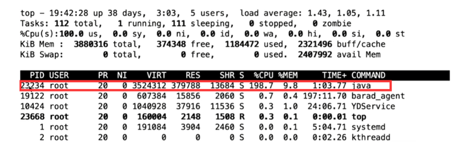
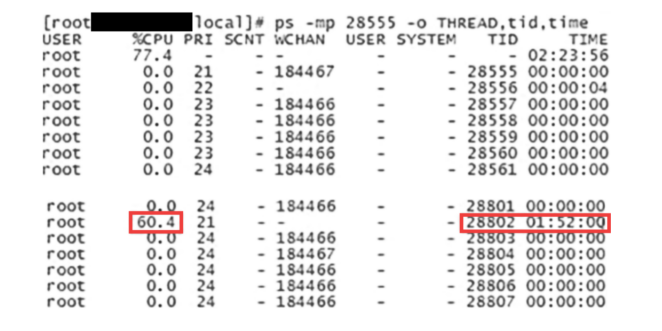
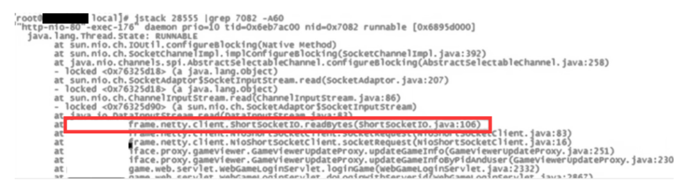

# 线上服务器CPU飙升，如何定位到Java代码

> 解决这个问题的关键是要找到Java代码的位置。下面分享一下排查思路，以CentOS为例，总结为4步。

第1步，使用top命令找到占用CPU高的进程。

第2步，使用ps –mp命令找到进程下占用CPU高的线程ID。

第3步，使用printf命令将线程ID转换成十六进制数。

第4步，使用jstack命令输出线程运行状态的日志信息。

下面详细介绍每一步的操作。

**第1步**，在使用top命令之后，可以看到一个列表，其中包含PID（进程ID）、USER（操作用户）、CPU占用率、内存占用率、TIME+（运行时间）、COMMAND（运行命令）等信息。一般默认按CPU占用率从上到下降序排列，如下图所示。



我们找到COMMAND列是java的这一行，说明这个程序就是用Java编写的。然后，用记事本记下这一行的PID，也就是进程ID。

**第2步**，使用ps -mp命令，输出这个PID下面的线程运行情况列表，如下图所示。



第3步，使用 printf 命令将TID转换为十六进制数，如下图所示。


这样就得到了真正占用CPU过高的线程ID。

第4步，使用jstack命令输出线程的具体运行日志，如下图所示。



jstack有3个参数，第1个参数是前面记下的 PID，之后加上 grep，紧跟着是转成十六进制数的TID，最后加上 –A和一个数字，这个数字表示输出日志的行数，至此就可以直接打印出具体的异常信息了。
如果日志信息比较多，异常内容比较复杂，则可以把这些异常信息输出到一个   txt文件中，慢慢分析。只需要在 jstack命令的最后追加 txt 文件名就可以了。

```
jstack PID | grep TID -A60 >> error_log.txt
```

> 来源：https://mp.weixin.qq.com/s/C2G-xvvDlnz6-tvaJit1TA
