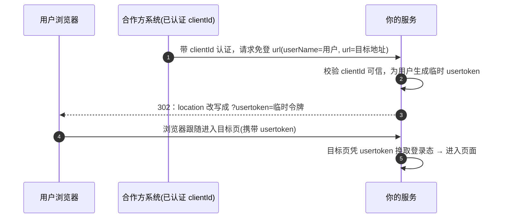
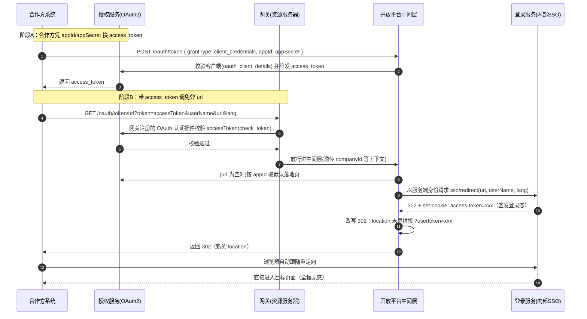

# 免登的服务端代理变体 —— 落地实践

> 相关协议原理见 [OAuth2](../../contents/security/OAuth2.md) 的「客户端凭证模式」与「典型应用场景」。

## 参与方与信任链

OAuth2 授权码模式解决的是「第三方应用替用户访问资源」，需要用户亲自授权；而免登场景只是「从别处来的用户访问平台自己的页面」，缺的不是授权，而是**登录态传递**。本篇介绍实践中常用的一种变体：**服务端代理变体**——由受信的合作方系统替用户声明身份，平台直接为其签发会话。

信任模型与授权码模式有本质差异：

> **授权码模式**：用户亲自向授权服务器证明身份 → 用户授权 → 签发令牌。
> **服务端代理变体**：合作方先用**自身的客户端凭据**认证，然后**替用户声明身份**（「此请求中的 userName 已由我验证过」），平台信任这个受信声明并**直接为其签发会话**。

> **关键认知**：免登的核心是「**登录态传递 + 受信声明**」，并不强制要求把系统拆成多个服务。绝大多数读者按**单服务**就能实现；只有当你的平台本身就是微服务（授权、网关、中间层、登录分离）时，才需要下面「多环节规模的完整落地」。

---

## 一、场景与动机

某开放平台允许合作方系统的用户**不重复登录**就跳转进入平台自己的页面（监控页、报表、工单等）。关键特征：

- 用户身份**已经由合作方系统验证过**，缺的是把外部登录态「翻译」成平台自身的登录态；
- 需要**免登**：合作方用户点击链接进入时应全程无感，不再出现登录页 / 授权页。

> 纯靠标准授权码模式实现这一场景有四个障碍：
> 1. **仍需登录/授权**：授权码流程要求用户至少「在授权服务器登录并同意」，体验上不算免登；
> 2. **对接方负担重**：合作方需实现完整 OAuth 客户端（code 回调端点、client_secret 换取、token 刷新），B 端系统能力参差，接入门槛过高；
> 3. **授权语义错位**：授权码的核心是「用户授权第三方访问**有限范围**资源」，而免登场景用户访问的是平台**自己的页面**，没有「授权给第三方」这层语义；
> 4. **纯前端 / iframe 嵌入困难**：code 交换要求接入方有后端，纯嵌入场景不具备。

**根本矛盾**：授权码模式是为「第三方应用替用户访问资源」设计的，而免登场景只是「从别处来的用户访问平台页面」——不需要授权语义，只需要**登录态传递**。

---

## 二、最小可用的免登落地（单服务）

如果你的平台不需要拆多个服务，这是实现免登的**最短路径**。只需在**一个服务**里完成三件事：认身份、造跳转、续登录态。

### 2.1 时序（单服务）



### 2.2 一个接口实现

合作方发一个带身份 header 的请求，你的服务校验它是受信合作方后，直接构造带 `usertoken` 的 302：

```java
// 单服务：免登接口
@GetMapping("/sso/redirect")
public void redirect(@RequestParam String userName,
                     @RequestParam(value = "url", required = false) String url,
                     @RequestParam(value = "lang", defaultValue = "zh") String lang,
                     HttpServletResponse resp) {
    // 1) 校验合作方身份可靠
    verifyClientFromHeader(request);   // 用 clientId 请求头认证，不是信任任意调用者
    // 2) 目标地址兜底
    if (StringUtils.isBlank(url)) url = defaultRedirectUrl;
    // 3) 为用户生成短期登录令牌（绑定 userName、限时生效）
    String token = issueUsertoken(userName, lang);
    // 4) 构造 302，把 usertoken 拼到地址
    url = (url.contains("?")) ? url + "&usertoken=" + token : url + "?usertoken=" + token;
    resp.setStatus(302);
    resp.setHeader("Location", url);
}
```

### 2.3 几个落地建议

- **信任边界**：`userName` 是「合作方替用户声明」的，所以这个接口必须在**网络层 / 网关可访问控制**内，或对合作方 `clientId` 做校验，避免被公开任意调用后冒充任意用户。
- **usertoken 要短期、可吊销**：它进入了 URL，建议做成绑定 `userName`、带过期时间、可失效的临时令牌（如无状态签名串或短 TTL 的 Redis key），而不是长寿命会话。
- **iframe 场景**：直接拼 URL 参数即可兼容 iframe（cookie 可能被浏览器拦截），天然解决第三方 cookie 问题。

> 单服务版够用后，下面的「多环节完整落地」是它在微服务拆分下的自然延伸——把"认证"交给授权服务、"校验"交给网关、"造登录态"交给登录服务、你自己只留"编排与改写"。

---

## 三、网关 + 多服务规模的完整落地

当平台已经存在独立的**授权服务**（OAuth2 客户端管理 + token 签发）、**网关**（资源服务器）与**登录服务**（内部统一 SSO）时，免登编排落到**中间层**，完整链路由「授权服务、网关、中间层、登录服务」四个环节协作完成。

### 3.1 总览时序（两阶段）

免登落地分两段：**先换 access_token，再带 token 走网关认证后免登**。



### 3.2 各环节职责一句话（免登主链路视角）

| 环节 | 在这个免登链路里做什么 |
| --- | --- |
| 授权服务 | 校验客户端（`appId/appSecret`）、签发 `access_token`、提供免登默认落地页 |
| 网关（资源服务器） | 对免登 url 做 `access_token` 认证（等价于 OAuth2 资源服务器校验），认证通过才放行；可用 **APISIX 等通用开源网关**落地 |
| 中间层 | 接收合作方请求，聚合下游（取默认落地页、调登录服务），改写重定向 |
| 登录服务 | 按用户名签发登录态（会话令牌），返回 302 |

> 免登的信任链是「**受信合作方凭 appId/secret 换 access_token → 网关校验 access_token → 会话令牌代用户身份**」三段递进：第 1 段证明"应用可信"，第 2 段证明"该请求确实来自持有效 access_token 的应用"，第 3 段才是真正替用户签发登录态。理解这条信任递进，就理解了这个设计的闭环。

### 3.3 关键实现片段

**① 阶段 A：换 access_token —— 中间层调授权服务**

合作方先发 `POST /oauth/token`，中间层把它转发给授权服务换取 `access_token`。请求体固定 `grant_type=client_credentials`：

```text
POST /api/oauth/token
{
  "grantType": "client_credentials", // 客户端模式，写死
  "scope": "all",
  "appId": "xxx",
  "appSecret": "xxx"
}
```

```java
// 中间层：转发换取 access_token
Response tokenRes = authServiceFeign.token(req.getGrantType(), req.getScope(), req.getAppId(), req.getAppSecret());
if (tokenRes.status() != 200) { throw new BusinessException("换 token 失败"); }
// 返回 accessToken + tokenType + expiresIn 等
```

**② 阶段 B 前置：网关对免登 url 做 access_token 认证 —— 资源服务器校验**

免登 url 挂在网关上，由网关注册一个 **OAuth 认证插件**，对该路由拦截校验 `access_token`（等价于 OAuth2 `check_token` 端点）。以 **APISIX** 这类通用开源网关为例：

```text
路由：GET/POST /oauth/token/url
插件：OAuth 认证插件（如 APISIX 的 oauth 插件）
  - 取请求头 Authorization: Bearer <accessToken>（或 url 上的 token 参数）
  - 调授权服务 check_token 校验 accessToken 是否有效
  - 有效 → 放行进中间层；无效 → 返回 accessToken 非法或已过期
```

> 网关具体组件可选 **APISIX**、Nginx + Lua 或云厂商 API 网关等，实现思路一致：在网关层注册资源服务器校验，业务服务无需感知 token 校验。

> 这样「中间层业务代码无需自己校验 token」——校验在网关层完成、集中收敛，业务服务始终只看到"已经通过认证"的请求。这正是方案里「网关作为资源服务器」的落地方式。

**③ 目标地址兜底 —— 中间层调授权服务**

合作方未显式传 `url` 时，中间层调授权服务按 `appId` 取预置默认落地页（字段 `redirectUrl`）。授权数据双通道：**配置兜底 + 数据库主源**。

```java
// 授权服务：根据 appId 取默认落地页
@GetMapping("/oauth/url")
public Result<String> fetchRedirectUrl(@RequestParam String appId) {
    // 1) 配置兜底：sso.clients 静态列表里同名 appId
    for (client : ssoClients.getClients()) {
        if (appId.equals(client.getClientId())) {
            return ResultUtils.success(client.getRedirectUrl());
        }
    }
    // 2) 数据库：sso_client_details 表里按 appId 查
    return ResultUtils.success(ssoClientService.getByClientId(appId).getRedirectUrl());
}
```

> - 双通道：`sso.clients`（配置，静态兜底）+ `sso_client_details` 表（主来源，持久化存储）；
> - 注册时客户端 `clientId` 用 UUID 生成，`clientSecret` 用 `sha1(clientId)` 派生，BCrypt 校验；
> - **用户名规则**：合作方需将系统内的用户 ID 做 md5（16 位）作为免登的 `userName`，保证双方对同一个用户的口径一致。

**④ 换取登录态 —— 中间层调登录服务**

```java
// 中间层：调用登录服务免登端点
Response resp = loginServiceClient.redirect(url, userName, lang);
// 全量透传状态码 + 响应头给浏览器
httpResp.setStatus(resp.status());
resp.headers().forEach((k, v) -> v.forEach(hv -> httpResp.addHeader(k, hv)));
```

**⑤ 改写重定向 —— 中间层把登录态转成 URL 参数**

- **普通跳转**：依赖 `set-cookie` 中的登录态即可，无需改写；目标页凭 cookie 识别。
- **iframe 嵌入**：第三方 iframe 中浏览器可能拦截 cookie，因此从响应 cookie 解析登录态,拼到 `location` 末尾：已有 `?` 追加 `&usertoken=xxx`，否则拼 `?usertoken=xxx`（并兼容尾斜杠）。

```java
// 中间层：从 302 响应 cookie 提取登录态，改写 location
String token = extractTokenFromCookie(cookieHeaders, "access-token");
String location = response.getHeader("location");
if (!location.contains("?")) {
    location = stripTrailingSlash(location) + "?usertoken=" + token;
} else {
    location = location + "&usertoken=" + token;
}
response.setHeader("location", location);
```

> **请求头上下文透传**：中间层用统一的请求头拦截器，把合作方身份上下文（如 `companyId`、账户标识）在服务间调用时透传给下游，保证链路上下文一致。

### 3.4 各环节协作下的关键约束（免登主链路）

| 关注点 | 落地做法 |
| --- | --- |
| 应用凭据 | 免登前先换 `access_token`，`grant_type` 用 `client_credentials` |
| token 认证位置 | **在网关层**（OAuth 认证插件等价 `check_token`），业务代码不重复校验 |
| 身份来源 | 双通道：数据库为主、配置兜底（`sso_client_details` 表 + `sso.clients`） |
| 默认落地页 | `redirectUrl` 与客户端绑定（授权服务 `/oauth/url`） |
| companyId 传递 | 网关校验通过后，把 `companyId` 等上下文透传给中间层/下游 |
| 用户名规则 | 合作方用户 ID 做 md5（16 位）作为免登 `userName` |
| 会话令牌 | 由登录服务签发，短期有效、可吊销（避免长时间暴露） |
| 信任边界 | 免登 url 挂在网关上做 access_token 认证，防被公开调用冒充用户 |

> 说明：这张表只列免登主链路真正关心的点。授权服务的 **OAuth2 token 配置**（BCrypt 密钥、token 存储、access/refresh TTL）属于「应用访问」链路的细节，见 4.1。

---

## 四、进阶扩展（按需选用）

以下两块**不是免登必需**，只在特定接入方出现，可按需翻阅。

### 4.1 access_token 的复用：免登之外的受保护数据接口

`access_token` 除了作为【阶段 B】免登 url 的认证凭证，也可以直接用于**以应用身份调用平台开放的受保护业务接口**（例如查股票走势、拉取报表数据等）。两者共享同一个「客户端凭据换 token」的起点。

| 用途 | 换取物 | 认证方式 | token 来源 |
| --- | --- | --- | --- |
| **免登**（阶段 B） | 会话令牌 / cookie | 网关 `check_token` 校验 access_token | 授权服务按 `client_credentials` 签发 |
| **数据访问** | 直接访问受保护接口 | 请求头 `Authorization: Bearer <access_token>` | 同一个 access_token |

换 access_token 用**客户端凭据模式**：

```bash
curl -X POST $OAUTH/HOST/oauth/token \
  -u "CLIENT_ID:CLIENT_SECRET" \
  -d "grant_type=client_credentials" \
  -d "scope=all"
```

> 授权服务侧要点：用 `@EnableAuthorizationServer` 开启标准 OAuth2 授权服务器；客户端**按需配置 grant_type**（`authorized_grant_types` 支持 `client_credentials`、`authorization_code` 等，授权服务器在换取 token 时据此校验该客户端被允许使用哪种 grant type）；`client_secret` 用 `BCryptPasswordEncoder` 校验；token 存 Redis，access/refresh 分开 TTL；`/oauth/**` 端点放行。

> **grant_type 的归属**：客户端详情表里的 `grant_type` 字段，约束的正是「这个应用允许用哪种方式换 access_token」（本链路即 `client_credentials`）。免登走的这条链路**用的是客户端模式换 token，而不是授权码模式**——不要因为表里有 `authorization_code` 等选项，就误以为免登走授权码四步。授权码模式（`/oauth/authorize` + 用户授权 + code）在本链路里并未使用。

### 4.2 接入方是定制协议时

如果合作方用了**定制协议**（如定制签名 + 加密载荷），中间层的请求/响应过滤器还要做**加解密与协议翻译**，让下游「无感」拿到标准请求。这类处理收敛在一个 `OncePerRequestFilter`，避免污染业务代码——核心是**协议层与业务层解耦**，业务服务始终只看标准语义。

---

## 五、好处与风险

### 好处

| 维度 | 说明 |
| --- | --- |
| 对接方零 OAuth 负担 | 只需「回一个 HTTP 请求 + 跟随 302」，无需回调端点、无需 secret、无需管 token 生命周期 |
| 用户体验无缝 | 全程自动跟随重定向，看不到登录页 / 授权页 |
| 协议转换收敛 | 外部极简语义（userName）由中间层翻译为内部标准流程，内部服务纯净、可复用 |
| 支持 iframe | 用 URL 参数而非 cookie 传递登录态，规避第三方 cookie 拦截 |
| 实施门槛低 | 单服务即可实现最小可用版，多服务只是微服务拆分下的延伸 |

### 风险与代价

| 风险点 | 说明 |
| --- | --- |
| 信任强度弱于授权码 | 用户身份由合作方「转述」，依赖 `clientId` 认证 + 网关 / 网络层访问控制兜底 |
| 缺 scope 粒度 | 签发的登录态是「全量」的，无法像授权码那样限定权限范围 |
| token 暴露于 URL | `usertoken` 进入浏览器历史与访问日志，存在泄露面，需评估有效期并做好日志清理 / 打码 |

---

## 六、与标准授权码 / 客户端凭证的定位对照

| 场景 | 采用方式 | 用户是否在场 | 信任来自 |
| --- | --- | --- | --- |
| 第三方平台替用户访问资源 | 授权码 + PKCE | 用户亲自授权 | 用户同意 |
| 服务间机器调用 | 客户端凭证 | 无用户 | 应用自身凭据 |
| 外部系统用户免登进平台页面 | 服务端代理变体 | 用户已在外部登录 | 受信合作方替用户声明 |

**小结**：免登的「服务端代理变体」把标准授权码的信任从「用户亲自授权」改为「受信合作方声明身份」，在 B 端开放平台的接入成本约束下相当务实；但应清醒认识其信任模型的局限，通常只应用于「登录态传递」而非「第三方授权访问资源」。

---

## 相关文档

- 协议原理：[OAuth2](../../contents/security/OAuth2.md)
- 令牌原理：[JWT](../../contents/security/JWT.md)
