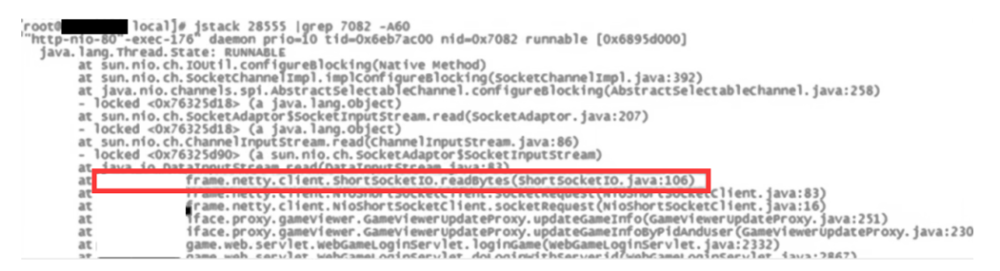

# 线上服务器 CPU 飙升，如何定位到 Java 代码

> 定位流程 4 步：**top（找进程）→ ps -mp（找线程）→ printf（转十六进制）→ jstack（抓栈）**。抄命令就能定位，下面逐步讲清楚每个命令的完整参数和输出解读。

**速查（CentOS / Ubuntu / 任何 Linux 通用）：**

```bash
top -bn1 -o %CPU | head -20                              # 找 CPU 最高的进程 PID
ps -mp <PID> -o THREAD,tid,time | sort -rnk2 | head -10  # 找 CPU 最高的线程 TID
printf '%x\n' <TID>                                       # 转十六进制 nid
jstack <PID> | grep -A 50 'nid=0x<nid>'                  # 抓栈帧看业务代码
```

## 1. 完整流程 4 步

### 1.1 top：找 CPU 最高的进程

```bash
# 推荐：一次性快照模式（-b），按 %CPU 降序（-o %CPU），取前 20
top -bn1 -o %CPU | head -20
```

关键字段：

| 列 | 含义 | 看什么 |
|----|------|--------|
| **PID** | 进程 ID | 这就是后面 ps / jstack 都要的进程号 |
| **USER** | 属主 | 非当前用户启动的进程改权限要 sudo |
| **%CPU** | CPU 占用率 | 单核上限 100%，多核环境可见 >100 |
| **MEM%** | 内存占用率 | 与 CPU 高同时发生要考虑内存泄漏 |
| **TIME+** | 累计 CPU 时间 | 飙升刚发生还是长期高负载，看这个列 |
| **COMMAND** | 启动命令 | 找 java 那一行 |


**小贴士**：
- 进入 top 交互模式（直接敲 `top`），按 `P` 切到 %CPU 排序、按 `1` 展开多核、按 `q` 退出——排查用 `-bn1` 快照模式更便于复制粘贴
- 看到多行 `java` 时，用 PID 区分（同一机器多服务常见）

### 1.2 ps -mp：找进程内 CPU 最高的线程

```bash
# 完整参数：-mp 表示列出所有线程，-o 自定义列，THREAD/tid/time 是 Java 排查三板斧
ps -mp <PID> -o THREAD,tid,time | sort -rnk2 | head -10
```

关键字段：

| 列 | 含义 | 看什么 |
|----|------|--------|
| **USER** | 属主 | 一般和进程一致 |
| **%CPU** | 线程级 CPU 占用 | 第二列，`sort -rnk2` 就为降序取前 10 |
| **TID** | 线程 ID | **十进制**，下一步要转成十六进制 |
| **TIME** | 线程累计 CPU 时间 | 高 + 长期 = 老问题 |

输出示例：

```
USER      %CPU    TID        TIME
jihui.jiang  45.2  12345      00:02:15
jihui.jiang  38.7  12346      00:01:50
...
```

记下 **%CPU 最高的 TID**（如 12345）。

> 没有 `ps -mp` 的 macOS / BusyBox 环境用 `ps -eL -o pid,tid,%cpu,comm | grep <PID>` 等价替代。

### 1.3 printf：十进制 TID → 十六进制 nid

```bash
printf '%x\n' 12345
# 输出: 3039
```

**为什么需要这一步**：jstack 输出里每个线程以 `nid=0x3039` 形式标识——`nid`（native ID）就是 Linux 的 TID，但**强制十六进制**（Java 线程池命名习惯）。所以十进制 TID 必须先转进制才能在栈帧里搜到。

### 1.4 jstack：抓栈帧看业务代码

```bash
# 完整命令：抓栈 + 搜 nid + 取前后 50 行上下文
jstack <PID> | grep -A 50 'nid=0x3039'
```



输出示例：

```
"business-thread-1" #25 prio=5 os_prio=0 tid=0x00007f... nid=0x3039 runnable [0x00007f...]
   java.lang.Thread.State: RUNNABLE
	at com.example.MyService.doHeavyCalc(MyService.java:142)
	at com.example.MyController.handle(MyController.java:38)
	at sun.reflect.NativeMethodAccessorImpl.invoke0(Native Method)
	at org.springframework.web.servlet.FrameworkServlet.service(FrameworkServlet.java:897)
```

**关键看什么**：

| 字段 | 看什么 |
|------|--------|
| `Thread.State` | RUNNABLE = 正在 CPU 上跑（真高负载）；BLOCKED/WAITING = 在等锁/等资源（CPU 高不是它引起的，是别的线程） |
| 栈帧第一行 | 真实业务代码入口——`doHeavyCalc` 这种才是根因 |
| 是否 GC 线程 | 名字是 `GC task thread#N` 或 `C2 CompilerThread` → 见「常见误区」 |

**把栈帧存文件慢看**：

```bash
jstack <PID> | grep 'nid=0x3039' -A 60 >> error_log.txt
# 或整个栈帧快照（便于事后分析）
jstack <PID> >> full_dump.txt
```

## 2. 拿到栈帧后怎么解读

**状态分诊**：

| 状态 | 含义 | CPU 高的真凶？ |
|------|------|--------------|
| **RUNNABLE** | 正在 CPU 上执行 | 是 |
| BLOCKED | 等 monitor 锁 | 否，但说明有锁竞争 |
| WAITING / TIMED_WAITING | sleep / park / 等条件 | 否，CPU 高是别的线程的事 |

**线程类型分诊**：

| 线程名 | 角色 | 处理 |
|--------|------|------|
| `业务线程-N` / `http-nio-*` | 业务请求 | 看栈帧代码定位 |
| `GC task thread#N` | 垃圾回收 | GC 线程飙高 → 堆内存问题 → 查 [容器与 JVM 内存配置不一致致 OOMKiller](/实践/产线故障复盘/md/pod重启/容器与JVM内存配置不一致致OOMKiller.md) |
| `C1/C2 CompilerThread` | JIT 编译 | 启动期短暂飙高正常，稳定期飙高是异常 |
| `VM Thread` / `VM Periodic Task` | JVM 内部任务 | 一般不排查，看关联 GC 日志 |

> 业务线程 RUNNABLE + 业务代码栈帧 → 定位完成；如果是 GC 线程 → 跳到内存排查路径。

## 3. 常见误区

**1. 只看进程 CPU，不看线程 CPU**
- 进程级 top 显示 `java` 占 90%，但 90% 可能是 100 个线程里某 1 个在忙，其他 99 个在睡觉——直接 `kill -9` 重启是错误动作

**2. 把 GC 线程飙高误判为业务代码慢**
- top 看到 java 进程 CPU 高 → ps 看到线程 TID → jstack 看到栈帧是 `GC task thread#N`——这时候根因是堆内存，不是业务代码
- 区分方法：线程名带 `GC` 或 `VM` 字眼即 JVM 内部线程

**3. 容器环境下的 top 读数失真**
- Docker 容器内 `top` 显示的 %CPU 是相对单核的，宿主机 4 核跑 4 个容器时「100%」可能只占物理核 25%
- 正确口径：用 `docker stats <container>` 看容器级资源，或用 JDK 10+ 的 `-XX:+UseContainerSupport`（默认开启）让 JVM 正确感知 cgroup 限制

**4. printf 转进制后搜不到 nid**
- 最常见：`grep nid=0x3039` 写成 `grep nid=3039`（漏 `0x`）
- 或者 jstack 输出里根本没有这个线程——**线程已经结束**（短生命周期线程），需要立刻再抓

## 4. 延伸阅读

- **深水区**：CPU 维度之外，IO / 内存 / 上下文切换都会让「服务器变慢」→ [生产服务器变慢诊断](生产服务器变慢诊断.md)
- **负载维度**：请求级响应慢，CPU 反而不高 → [线上接口负载剧增处理](接口负载剧增处理.md)
- **K8s 视角**：Pod 重启 → [K8s Pod 重启排查](K8sPod重启排查.md)
- **实战案例**：[下游接口未分页致 OOM](/实践/产线故障复盘/md/pod重启/下游接口未分页致OOM.md)
- **JVM 系统学习**：[JVM](/contents/java/JVM.md)

> 本文观点整理自：https://mp.weixin.qq.com/s/C2G-xvvDlnz6-tvaJit1TA
